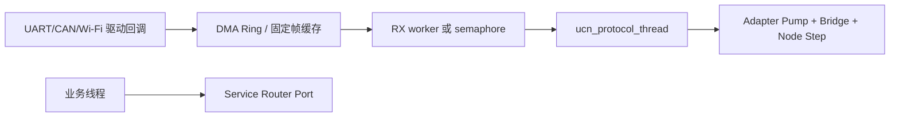

# UCN Zephyr 快速使用

> `ARCHIVED / NOT CURRENT`：本文仅保留 v5 Zephyr 接入记录；v6 请从[当前用户手册](../../用户手册/README.md)开始。

> 适用：Zephyr 应用。当前仓库已有独立、SDK 无关的 `ucn_port_zephyr` C99 外壳；产品仍需把它的 Hook 映射到实际 Zephyr 线程、同步原语和驱动。不要把该外壳称作“已合入的 Zephyr 驱动”。

> 当前 API：V5-62 Port API V2 要求所有 `ucn_port_ops_t` 具名填写 `struct_size/api_version`；旧位置初始化与旧对象不兼容。Transfer 还必须配置权威时钟并使用无时间参数的 `ucn_transfer_step()`。迁移见[总览](README.md)。

## 1. 加入 Zephyr 应用构建

在应用 `CMakeLists.txt` 中按[总览源文件矩阵](README.md#共同的构建输入)选择 UCN C99 源文件，并添加仓库 `include/`。下面明确选择 **Full + Service ON**；换成 Nano/Lite 时必须同时替换源文件和全局 `UCN_PROFILE`，不能只改宏：

```cmake
set(UCN_DIR ${CMAKE_CURRENT_SOURCE_DIR}/../UCN)

set(UCN_COMMON_SOURCES
  ${UCN_DIR}/src/core/ucn_core.c
  ${UCN_DIR}/src/core/ucn_endpoint.c
  ${UCN_DIR}/src/core/ucn_frame.c
  ${UCN_DIR}/src/transport/ucn_adapter.c
  ${UCN_DIR}/src/transport/ucn_standard_adapter.c
  ${UCN_DIR}/src/transport/ucn_protocol_owner.c)
set(UCN_PROFILE_SOURCES
  ${UCN_DIR}/src/node/ucn_node.c
  ${UCN_DIR}/src/routing/ucn_path.c
  ${UCN_DIR}/src/routing/ucn_policy.c)
set(UCN_SERVICE_SOURCES
  ${UCN_DIR}/src/service/ucn_service.c
  ${UCN_DIR}/src/service/ucn_service_bridge.c)

target_sources(app PRIVATE
  ${UCN_COMMON_SOURCES}
  ${UCN_PROFILE_SOURCES}
  ${UCN_SERVICE_SOURCES})
target_include_directories(app PRIVATE ${UCN_DIR}/include)
target_compile_definitions(app PRIVATE UCN_PROFILE=3 UCN_FEATURE_SERVICE=1)
```

在应用 `Kconfig` 中定义产品线程栈：

```kconfig
config APP_UCN_PROTOCOL_STACK_SIZE
    int "UCN protocol thread stack size"
    default 2048
```

再在 `prj.conf` 中配置它。`CONFIG_MAIN_STACK_SIZE` 只控制 Zephyr Main Thread，不能替代独立 Protocol Thread 的栈：

```ini
CONFIG_APP_UCN_PROTOCOL_STACK_SIZE=2048
CONFIG_ASSERT=y
CONFIG_LOG=y
```

UCN 没有现成的 Kconfig 符号；建议在你的应用 Kconfig 建立 `CONFIG_APP_UCN_*`，统一导出为 `UCN_MAX_FRAME_BYTES`、各固定表深度和线程栈大小。不要改 UCN Core 源文件来绑定某一个板子。

## 2. 线程与驱动模型



驱动 callback 可能运行在中断上下文，不能锁 `k_mutex`、不能调用 Node。用驱动自己的 DMA ring、`ring_buf` 或固定 RX worker 形成完整 UCN 帧；Protocol Thread 单独取出帧并调用 `ucn_adapter_rx_enqueue()`。这样 Adapter Queue 不被并发访问，可用 `ucn_adapter_rx_queue_init(&queue, NULL, NULL)`。

## 3. 静态 Protocol Thread

在线程启动前完成 Node 配置：`ucn_node_init()` 后调用 `ucn_node_set_wire_profiles()`，再按产品需要显式开启自动最小档；明文开发节点设置不复用的非零 Boot Session，生产节点安装 Security Provider，随后注册 Link。建议把固定 TX/最大 RX 档映射为产品 Kconfig 常量，但仍只调用官方 W0～W3 API，不自定义位宽。

```c
#include <zephyr/kernel.h>
#include "ucn/ucn_adapter.h"
#include "ucn/ucn_node_storage.h"

K_THREAD_STACK_DEFINE(g_ucn_stack, CONFIG_APP_UCN_PROTOCOL_STACK_SIZE);
static struct k_thread g_ucn_thread;
static ucn_node_t g_node;
static ucn_adapter_rx_queue_t g_rx_queue;

static void ucn_protocol_thread(void *a, void *b, void *c)
{
    ARG_UNUSED(a); ARG_UNUSED(b); ARG_UNUSED(c);
    for (;;) {
        size_t pumped = 0U;
        uint8_t sent = 0U;
        const uint32_t now_ms = k_uptime_get_32();

        app_driver_drain_complete_frames();
        (void)ucn_adapter_rx_pump(&g_rx_queue, &g_node, 4U, &pumped);
        (void)ucn_service_protocol_bridge_step_at(&g_bridge, now_ms, 2U, &sent);
        (void)ucn_node_step(&g_node, now_ms);
        k_sleep(K_MSEC(1));
    }
}

void app_start_ucn(void)
{
    k_thread_create(&g_ucn_thread, g_ucn_stack, K_THREAD_STACK_SIZEOF(g_ucn_stack),
        ucn_protocol_thread, NULL, NULL, NULL, 5, 0, K_NO_WAIT);
}
```

用实际 Heartbeat、Route 超时与发送负载决定休眠时间或改用信号唤醒；但必须保证周期执行 `ucn_node_step()`，不能只在有 RX 时运行。

## 4. Service Router 的 Zephyr 适配原则

Zephyr Port 需要三个静态对象：一个 `k_mutex` 保护 Router 短拷贝、每个业务消费者一个有界 Endpoint 通知对象、一个 Consumer 到 `k_tid_t` 的固定绑定表。通过 `ucn_service_protocol_bridge_set_inbound_hooks()` 把 Router lock/unlock 和“远端 Endpoint 已投递”通知交给 Bridge。

- `k_mutex` 仅由线程使用；ISR 只能写驱动缓冲并发信号。
- 通知对象只存 Endpoint 或计数，不能存第二份大 Payload；业务线程唤醒后循环 `ucn_service_inbox_take()`。
- 每个 Endpoint 只有一个 Router owner；用 `k_current_get()` 与绑定表拒绝错误线程读取 Inbox。
- Protocol Thread 必须在同一把 Router 锁下运行 Bridge Step，Hooks 已覆盖 Bridge 的取 Remote TX 和入站投递。
- `require_remote_q0_validator=true` 的 Binding 必须在安装 Endpoint handlers 前注册产品 Validator；否则 Bridge 按设计返回 `UCN_ERR_CONFIG`。

## 5. Link 与设备树边界

将 UART、CAN、SPI 无线模块的设备树选择和 Zephyr 驱动 API 放在产品 Adapter 中。Adapter 的 `send()` 把 Core 帧提交给该设备；`get_status()` 反映驱动真实 Up/Down/运行期 MTU；`get_metrics()` 生成介质无关 Cost。一个对端可有多个 Link（如 UART + Wi-Fi），但保持一个 `peer_node_id`。静态/动态 MTU 取较小值；窄介质可在注册前设置 Link 本地接收 Wire Profile 上限。

经典 CAN 小 MTU 的分段/重组已由 SDK 无关的 `ucn_can_source_t` 提供 C1/C2 Carrier 与固定重组状态机；产品仍必须实现 Zephyr CAN 控制器配置、Filter、ISR/Frame Ring、TX Queue、Bus-Off 恢复和 Link 状态，并完成目标板测试。

## 6. 最小验收

1. 在 `native_sim` 或目标板构建通过，再以单 Link、两个 Node、Q1 Endpoint 验证收发。
2. 驱动 RX ring 满时必须显式丢弃/计数，Protocol Thread 不得堆积或阻塞。
3. 加入 Service 后验证本机 Fast Path、远端 Bridge、Q0/Q1 语义和线程所有权。
4. 记录 `k_thread_stack_space_get()`、队列高水位、Link 错误与 Node/Router/Bridge 统计；完成后再接安全 Provider、Path 和负载均衡。

## 7. S16 Protocol Thread 时限

用 Kconfig/Product Profile 冻结 `UCN_MAX_STEP_INTERVAL_MS`、线程优先级、最大 `k_poll()`/`k_sleep()` 超时、RX Pump/Bridge 预算与 Link `send()` WCET。线程必须周期唤醒，不能只等业务事件。压力测试记录 `max_step_gap_ms`、`step_interval_violations` 和 Heartbeat/Probe 延迟；仓库当前没有 Zephyr Port 实测结果。

## 8. V5-58/59 Zephyr Event Runtime 与 Stream 映射

产品用 `k_sem` 或 `k_event` 实现同一组 Scheduler Hook：ISR/线程都只 Post/Give，`wait_owner()` 有界等待并返回是否收到事件，Round 预算耗尽时可 `k_yield()`。UART async、CAN callback、USB CDC 和无线回调各写自己的固定 Ring/Frame Queue 后 Signal Source；Zephyr 类型只存在产品 glue，不进入 UCN 公共对象。当前仍需目标 Zephyr 构建和实机门禁。

Zephyr UART async/USB CDC 的原始字节可直接写入每实例 `ucn_stream_source_t`，公共模块在 Protocol Thread 完成 COBS/重同步；`uart_event`、`k_work`、DMA Buffer 生命周期和 TX 完成仍由产品 glue 管理。
