# UCN V5 Cluster 当前实际状态机（Current Implementation FSM）

> **基准分支**：`codex/v5-adaptive-wire`  
> **精确代码快照**：`a571853`  
> **文档性质**：Current / As-Implemented  
> **用途**：与 `UCN_V5_Cluster_FSM_Design_v2.md`（Target / 理想状态机）逐项对照。  
>
> 本文档严格描述 `a571853` 当前代码真实行为：
>
> - 不把 Target v2 中尚未实现的机制写成“当前已有”；
> - 当前代码存在的隐式状态、特殊乱序路径、回绕行为和非理想迁移均照实记录；
> - Mermaid 图表示“代码当前如何运行”，不是“应该如何设计”。

---

# 0. 本次更新相对上一版 Current FSM 的变化

上一份 `UCN_V5_Cluster_CURRENT_FSM.md` 基于较早代码。

当前 `a571853` 已经补齐上一轮 C07.7 收尾修复，主要变化如下：

```text
1. Cluster Wire：
   28 B -> 32 B

2. Message Type：
   新增 Type 18 BACKUP_RESYNC_REQ
   新增 Type 19 BACKUP_REJECT

3. Type 12：
   携带 backup_generation
   member_nonce 完整 32 bit
   membership_sequence 完整 32 bit
   flags 严格白名单

4. Delta：
   检测 sequence gap
   gap -> Backup Not Ready / Syncing
       -> BACKUP_RESYNC_REQ
       -> Head Full Snapshot

5. JOIN：
   JOIN_REQUEST nonce 作为 join transaction id
   JOIN_ACCEPT/JOIN_REJECT 必须 echo 并匹配

6. HEAD_STEPDOWN：
   Member/Backup 保存 last_stepdown_nonce
   旧 stepdown 不再重复生效

7. Backup Candidate：
   coverage/no-space fail
   -> BACKUP_REJECT
   -> Head candidate cooldown
   -> 立即选下一个

8. Backup Heartbeat：
   校验 cluster / term / generation / sequence

9. Recovery：
   Receiver 真正切入 Recovery Cluster
   Recovery Head ACK 真正登记 Member
   周期 Recovery Declare 维护 Lease
   双候选通过 (nonce,node_id) 仲裁

10. Takeover：
    Backup self vote
    vote identity = (cluster_id, term, generation)
    same-cluster higher Term Head 可中止 takeover
    foreign-cluster Term 不用于 Backup takeover 中断

11. Head capacity：
    capacity=0 只限制新的 Join；
    不再阻止现有 Head/Backup 的关键收敛逻辑

12. Neighbor Sync：
    staging 成功后再 commit，避免失败时留下半张 peer table

13. Token Bucket：
    修复冷启动第一次 refill 再次补满 burst。
```

---

# 1. 最重要的结论：当前仍不是 Target v2 的“唯一 Phase FSM”

`a571853` 公开 Role 仍然只有 9 个：

```c
typedef enum
{
    UCN_CLUSTER_ROLE_DISABLED = 0,
    UCN_CLUSTER_ROLE_DETACHED,
    UCN_CLUSTER_ROLE_JOIN_PENDING,
    UCN_CLUSTER_ROLE_MEMBER,
    UCN_CLUSTER_ROLE_CANDIDATE,
    UCN_CLUSTER_ROLE_HEAD,
    UCN_CLUSTER_ROLE_BACKUP,
    UCN_CLUSTER_ROLE_STEPPING_DOWN,
    UCN_CLUSTER_ROLE_RECOVERY_HEAD
} ucn_cluster_role_t;
```

但真实状态仍依赖大量字段：

```text
head_grace_deadline_ms

backup_node_id
backup_generation
backup_ready
backup_syncing
backup_assign_pending
backup_sync_cursor
backup_delta_cursor

backup_takeover_active
backup_takeover_ack_count
backup_takeover_announce_active

recovery_eligible
recovery_backoff_deadline_ms
recovery_cooldown_until_ms
recovery_nonce
accepted_recovery_nonce

pending_join_nonce
last_stepdown_nonce

backup_candidate_cooldown_until_ms
backup_rejected_node_id
```

因此当前实现本质仍是：

```text
9 个公开 Role
+
Role 内部 bool/deadline/cursor 隐式子状态
```

而不是 Target v2 的：

```text
Unique Phase
```

---

# 2. 当前 Role 与隐式子状态总览


```mermaid
flowchart TD

    ROLE["公开 role<br/>9 states"]

    ROLE --> DIS["DISABLED"]
    ROLE --> DET["DETACHED"]
    ROLE --> JP["JOIN_PENDING"]
    ROLE --> MEM["MEMBER"]
    ROLE --> CAN["CANDIDATE"]
    ROLE --> HEAD["HEAD"]
    ROLE --> BACK["BACKUP"]
    ROLE --> STEP["STEPPING_DOWN"]
    ROLE --> REC["RECOVERY_HEAD"]

    MEM --> MN["MEMBER_NORMAL<br/>head_grace_deadline=0"]
    MEM --> MG["MEMBER_GRACE<br/>head_grace_deadline!=0"]

    DET --> DO["NORMAL_OBSERVE"]
    DET --> DRO["RECOVERY_OBSERVE"]
    DET --> DRB["RECOVERY_BACKOFF"]
    DET --> DRC["RECOVERY_COOLDOWN"]

    HEAD --> H0["HEAD_NO_BACKUP<br/>backup_node_id=0"]
    HEAD --> HA["HEAD_BACKUP_ASSIGNING<br/>backup_assign_pending"]
    HEAD --> HS["HEAD_BACKUP_SYNCING<br/>backup_ready=false"]
    HEAD --> HR["HEAD_BACKUP_READY<br/>backup_ready=true"]
    HEAD --> HD["HEAD_DELTA_REFRESH"]
    HEAD --> HANN["TAKEOVER_ANNOUNCE"]

    BACK --> BS["BACKUP_SYNCING<br/>backup_syncing=true"]
    BACK --> BR["BACKUP_READY<br/>backup_ready=true"]
    BACK --> BW["WAIT_PRIMARY_LEASE"]
    BACK --> BT["BACKUP_TAKEOVER<br/>takeover_active=true"]
```

这些蓝图里的：

```text
MEMBER_GRACE
HEAD_BACKUP_SYNCING
BACKUP_READY
BACKUP_TAKEOVER
RECOVERY_BACKOFF
```

**都不是 enum 状态。**

---

# 3. 当前真实 Role 主状态机

下面只画实际修改 `cluster->role` 的主要迁移：

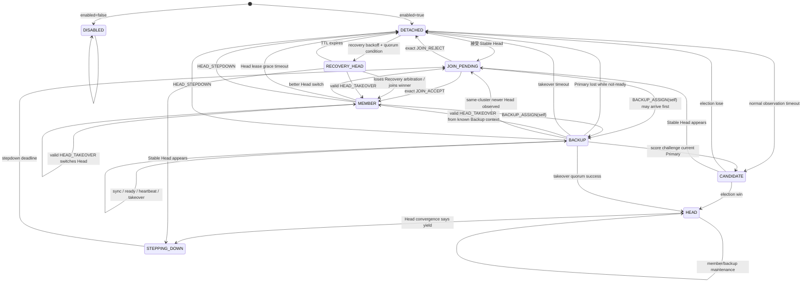
```mermaid
stateDiagram-v2
    [*] --> DISABLED: enabled=false
    [*] --> DETACHED: enabled=true

    DISABLED --> DISABLED

    DETACHED --> JOIN_PENDING: 接受 Stable Head
    DETACHED --> CANDIDATE: normal observation timeout
    DETACHED --> RECOVERY_HEAD: recovery backoff + quorum condition

    CANDIDATE --> HEAD: election win
    CANDIDATE --> DETACHED: election lose
    CANDIDATE --> JOIN_PENDING: Stable Head appears

    JOIN_PENDING --> MEMBER: exact JOIN_ACCEPT
    JOIN_PENDING --> BACKUP: BACKUP_ASSIGN(self) may arrive first
    JOIN_PENDING --> DETACHED: exact JOIN_REJECT

    MEMBER --> MEMBER: current Head refresh
    MEMBER --> JOIN_PENDING: better Head switch
    MEMBER --> BACKUP: BACKUP_ASSIGN(self)
    MEMBER --> DETACHED: Head lease grace timeout
    MEMBER --> MEMBER: valid HEAD_TAKEOVER switches Head
    MEMBER --> DETACHED: HEAD_STEPDOWN

    HEAD --> HEAD: member/backup maintenance
    HEAD --> STEPPING_DOWN: Head convergence says yield

    BACKUP --> BACKUP: sync / ready / heartbeat / takeover
    BACKUP --> CANDIDATE: score challenge current Primary
    BACKUP --> HEAD: takeover quorum success
    BACKUP --> DETACHED: Primary lost while not-ready
    BACKUP --> DETACHED: takeover timeout
    BACKUP --> MEMBER: valid HEAD_TAKEOVER from known Backup context
    BACKUP --> JOIN_PENDING: same-cluster newer Head observed
    BACKUP --> DETACHED: HEAD_STEPDOWN

    RECOVERY_HEAD --> MEMBER: loses Recovery arbitration / joins winner
    RECOVERY_HEAD --> STEPPING_DOWN: Stable Head appears
    RECOVERY_HEAD --> DETACHED: TTL expires
    RECOVERY_HEAD --> MEMBER: valid HEAD_TAKEOVER

    STEPPING_DOWN --> JOIN_PENDING: stepdown deadline
```

---

# 4. 当前 Cluster Wire

## 4.1 固定长度

当前：

```text
UCN_CLUSTER_MESSAGE_BYTES = 32
```

上一版 Current FSM 的：

```text
28 bytes
```

已经过时。

---

## 4.2 Wire 头部

前 16 B 仍然是：

```text
Byte 0     version
Byte 1     type
Byte 2     role
Byte 3     flags
Byte 4-7   cluster_id
Byte 8-11  term
Byte 12-15 head_node_id
```

后续字段按 Message Type 重新解释。

---

## 4.3 当前 Header 注释存在一个小型文档滞后

源码常量已经：

```text
32 B
```

但头文件附近的旧注释仍写：

```text
Fixed 28 B wire format v3
```

因此理解协议时应以：

```text
UCN_CLUSTER_MESSAGE_BYTES == 32
```

和 encode/decode 实现为准。

---

# 5. 当前 Message Type

当前一共 19 种：

| Type | Message |
|---:|---|
| 1 | `ADVERTISE` |
| 2 | `JOIN_REQUEST` |
| 3 | `JOIN_ACCEPT` |
| 4 | `JOIN_REJECT` |
| 5 | `KEEPALIVE` |
| 6 | `LEAVE` |
| 7 | `HEAD_DECLARE` |
| 8 | `HEAD_TAKEOVER` |
| 9 | `HEAD_STEPDOWN` |
| 10 | `BACKUP_ASSIGN` |
| 11 | `BACKUP_READY` |
| 12 | `BACKUP_MEMBER_SYNC` |
| 13 | `PRIMARY_HEARTBEAT` |
| 14 | `TAKEOVER_PREPARE` |
| 15 | `TAKEOVER_ACK` |
| 16 | `RECOVERY_DECLARE` |
| 17 | `RECOVERY_ACK` |
| 18 | `BACKUP_RESYNC_REQ` |
| 19 | `BACKUP_REJECT` |

---

# 6. Type 12 当前 flags

只有以下四种值合法：

```text
0
SYNC_BEGIN
SYNC_END
SYNC_DELTA
```

即：

```text
BEGIN | END
BEGIN | DELTA
END | DELTA
BEGIN | END | DELTA
```

全部非法。

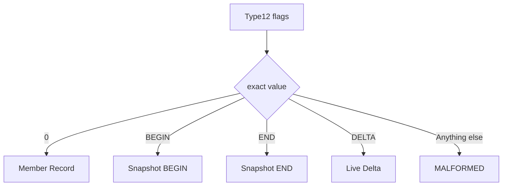
```mermaid
flowchart TD
    F[Type12 flags] --> V{exact value}
    V -->|0| DATA[Member Record]
    V -->|BEGIN| BEGIN[Snapshot BEGIN]
    V -->|END| END[Snapshot END]
    V -->|DELTA| DELTA[Live Delta]
    V -->|Anything else| BAD[MALFORMED]
```

---

# 7. Type / Role 当前严格配对

当前 parser 对 Backup 相关 Type 已经明显收紧。

例如：

```text
BACKUP_ASSIGN      -> role HEAD
BACKUP_MEMBER_SYNC -> role HEAD
PRIMARY_HEARTBEAT  -> role HEAD

BACKUP_READY       -> role BACKUP
TAKEOVER_PREPARE   -> role BACKUP

TAKEOVER_ACK       -> role MEMBER

BACKUP_RESYNC_REQ  -> role BACKUP
BACKUP_REJECT      -> role BACKUP
```

Type12 额外要求：

```text
backup_generation != 0
```

且：

```text
BEGIN / END:
    member_node_id == 0

normal / DELTA:
    member_node_id 有效
    member_nonce != 0
```

---

# 8. 初始化

`ucn_cluster_init()` 当前逻辑概念上：

```text
enabled=false
    -> DISABLED

enabled=true
    -> DETACHED
    -> observation_deadline = now + observation_ms
    -> next_nonce initialized
    -> Token Bucket 初始 burst
```

当前仍没有 Target v2 的：

```text
Persistent StableEpoch
ClusterPersistenceProvider
CommittedVoterSet
Joint Config
authority_active
HEAD_FENCED
```

---

# 9. `set_detached()` 当前行为

当前进入 DETACHED 会清：

```text
cluster_id
term
head_node_id
current_head_score

pending_head
pending_cluster
pending_term
pending_score

known_backup_node_id
known_backup_generation

head lease
head grace
election deadline
```

另外本轮已经增加：

```text
member_voted_term = 0
member_voted_cluster_id = 0
member_voted_generation = 0
```

即：

```text
Detach 会重置 takeover vote identity。
```

---

## 9.1 与 Target v2 的差异

Target v2 建议：

```text
Detach 不应清除某些安全历史，
特别是需要跨掉电/跨重入保护的 Epoch/Vote。
```

当前仍然没有 Persistence 层，所以这是：

```text
Current 行为
!=
Target 持久化安全语义
```

---

# 10. DETACHED 隐式状态

当前至少存在：

```text
DETACHED_NORMAL_OBSERVE
DETACHED_RECOVERY_OBSERVE
DETACHED_RECOVERY_BACKOFF
DETACHED_RECOVERY_COOLDOWN
```

但公开：

```text
role == DETACHED
```

完全相同。

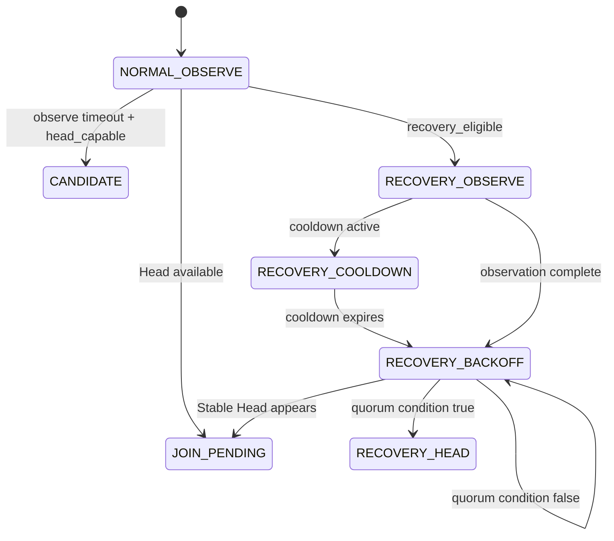
```mermaid
stateDiagram-v2
    [*] --> NORMAL_OBSERVE

    NORMAL_OBSERVE --> JOIN_PENDING: Head available
    NORMAL_OBSERVE --> CANDIDATE: observe timeout + head_capable

    NORMAL_OBSERVE --> RECOVERY_OBSERVE: recovery_eligible

    RECOVERY_OBSERVE --> RECOVERY_COOLDOWN: cooldown active
    RECOVERY_COOLDOWN --> RECOVERY_BACKOFF: cooldown expires

    RECOVERY_OBSERVE --> RECOVERY_BACKOFF: observation complete

    RECOVERY_BACKOFF --> RECOVERY_HEAD: quorum condition true
    RECOVERY_BACKOFF --> RECOVERY_BACKOFF: quorum condition false
    RECOVERY_BACKOFF --> JOIN_PENDING: Stable Head appears
```

---

# 11. 普通 Election

普通 Detached Election：

```text
role = CANDIDATE

cluster_id = local_node_id

term =
    old term == UINT32_MAX
        ? 1
        : old term + 1

head_node_id = local
election_deadline = now + election_window
```

由于普通：

```text
set_detached()
```

会把 term 清零，所以新形成 Cluster 时通常：

```text
term = 1
```

---

# 12. Candidate 排名

```text
CandidateBetter =
    higher head_score

or:

    equal score
    smaller node_id
```

即：

```text
score DESC
node_id ASC
```

---

# 13. Candidate Election 完成

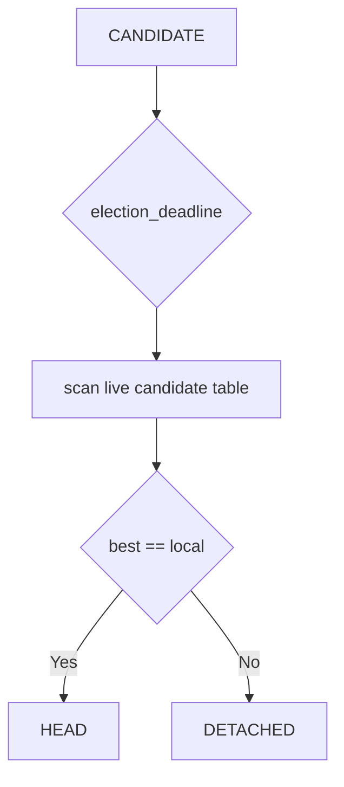
```mermaid
flowchart TD
    C[CANDIDATE] --> T{election_deadline}
    T --> SCAN[scan live candidate table]
    SCAN --> B{best == local}
    B -->|Yes| H[HEAD]
    B -->|No| D[DETACHED]
```

Candidate 输了以后：

```text
不会立即 Join winner
```

而是：

```text
DETACHED
-> 后续收到 winner 的 HEAD ADVERTISE
-> JOIN_PENDING
```

---

# 14. Head Offer 当前处理顺序

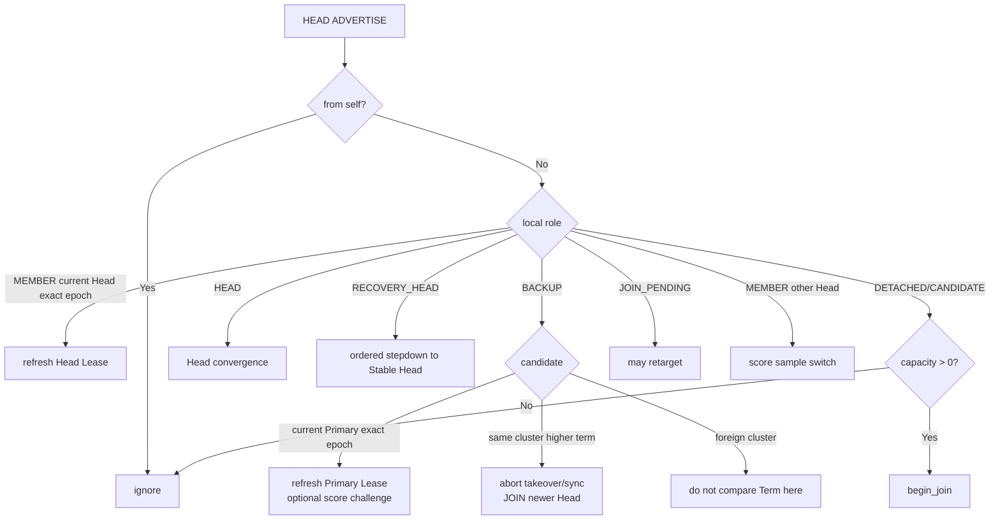
```mermaid
flowchart TD

    RX[HEAD ADVERTISE] --> SELF{from self?}
    SELF -->|Yes| IGN[ignore]
    SELF -->|No| ROLE{local role}

    ROLE -->|MEMBER current Head exact epoch| MR[refresh Head Lease]

    ROLE -->|BACKUP| BP{candidate}

    BP -->|current Primary exact epoch| BREF[refresh Primary Lease<br/>optional score challenge]
    BP -->|same cluster higher term| BJ[abort takeover/sync<br/>JOIN newer Head]
    BP -->|foreign cluster| BIGN[do not compare Term here]

    ROLE -->|HEAD| HH[Head convergence]
    ROLE -->|RECOVERY_HEAD| RHS[ordered stepdown to Stable Head]

    ROLE -->|DETACHED/CANDIDATE| CAP{capacity > 0?}
    CAP -->|Yes| JOIN[begin_join]
    CAP -->|No| IGN

    ROLE -->|JOIN_PENDING| RET[may retarget]
    ROLE -->|MEMBER other Head| MS[score sample switch]
```

---

# 15. capacity=0 当前语义

当前修正后：

```text
capacity == 0
```

只阻止：

```text
DETACHED/CANDIDATE -> JOIN_PENDING
```

不会阻止：

```text
现有 Member 刷新当前 Head lease
Backup 判断 current Primary
Head-to-Head 收敛
```

这是上一轮“满员 Head 阻断 convergence”修复后的真实行为。

---

# 16. BACKUP 看见其它 Head

当前 BACKUP 特殊处理：

## 16.1 当前 Primary

要求：

```text
source/head == backup_primary
same cluster
same term
```

动作：

```text
刷新 Primary Lease

如果 local score 明显更好
且 Backup tenure 足够：
    backup_challenge()
```

---

## 16.2 同 Cluster 更高 Term

如果：

```text
candidate.cluster_id == local cluster_id
candidate.term > local term
```

则：

```text
backup_takeover_active = false
清 Backup sync
begin_join(new Head)
```

---

## 16.3 外部 Cluster

如果：

```text
candidate.cluster_id != local cluster_id
```

当前 BACKUP 不会仅因为：

```text
foreign candidate term 很大
```

就放弃当前 Cluster。

这是 `a571853` 新增修正。

---

# 17. HEAD 对其它 Head 的当前行为

当前 `role == HEAD` 分支依次判断：

```text
candidate.term > local.term
    -> ordered stepdown

candidate.term < local.term
    -> ignore

same term:
    score improvement
    + required samples
    + min tenure
    -> ordered stepdown
```

---

## 17.1 一个仍存在的 Current/Target 差异

**当前 HEAD 分支在比较 Term 前没有先要求 `candidate.cluster_id == local.cluster_id`。**

因此当前代码仍可能：

```text
Head A / Cluster X / Term 2
看到
Head B / Cluster Y / Term 9

=> Term 9 > 2
=> A ordered stepdown
```

这与 Target v2 的：

```text
Different Cluster Term 不可直接比较
```

仍不一致。

本轮 `a571853` 修正的是：

```text
BACKUP takeover interruption
```

的 foreign-term 问题，不是整个 Head-to-Head Merge 机制。

---

# 18. MEMBER 当前 Head Lease

当前 Member 接收 current Head：

```text
same cluster
same term
same head
```

则：

```text
head_lease_expires_at = now + lease
head_grace_deadline = 0
current_head_score = candidate score
```

Role 保持：

```text
MEMBER
```

---

# 19. MEMBER 仍然会主动“跳槽”

Target v2 建议由 Head-to-Head Merge 统一迁移 Cluster。

但当前实现仍保留：

```text
Member 看见另一个 score 明显更高的 Head
+
连续样本达到 switch_required_samples
```

则：

```text
发送 LEAVE 给旧 Head
begin_join(new Head)
```

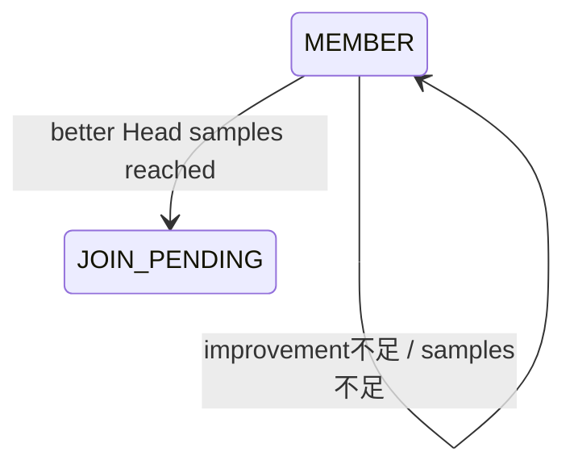
```mermaid
stateDiagram-v2
    MEMBER --> MEMBER: improvement不足 / samples不足
    MEMBER --> JOIN_PENDING: better Head samples reached
```

所以当前：

```text
Member 自主 Head switch
```

仍然存在。

---

# 20. MEMBER Head Lease Grace

Head Lease 第一次超时：

```text
role 仍是 MEMBER
```

只设置：

```text
head_grace_deadline =
    now + keepalive_interval
```

因此真实存在：

```text
MEMBER_NORMAL
MEMBER_GRACE
```

但不是两个 enum。

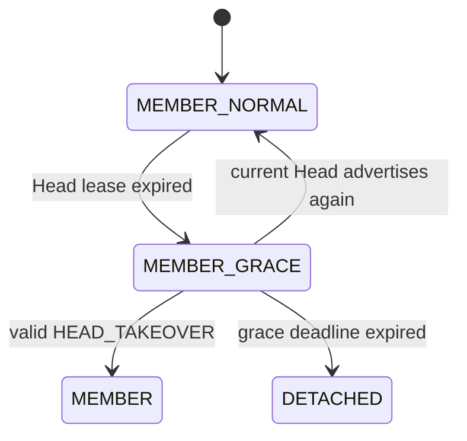
```mermaid
stateDiagram-v2
    [*] --> MEMBER_NORMAL

    MEMBER_NORMAL --> MEMBER_GRACE: Head lease expired

    MEMBER_GRACE --> MEMBER_NORMAL: current Head advertises again
    MEMBER_GRACE --> MEMBER: valid HEAD_TAKEOVER
    MEMBER_GRACE --> DETACHED: grace deadline expired
```

Grace 超时：

```text
recovery_eligible = true
set_detached(recovery_observation_ms)
```

---

# 21. Takeover Vote 当前身份

Member 保存：

```text
member_voted_cluster_id
member_voted_term
member_voted_generation
```

投票身份：

```text
(cluster_id, term, backup_generation)
```

而不是旧实现：

```text
term only
```

Detach 时该身份被重置。

---

# 22. TAKEOVER_PREPARE 当前校验

当前要求：

```text
local role == MEMBER

message.cluster_id == current cluster
message.term == current term
message.head_node_id == current Head

source == known_backup_node_id

message.backup_generation ==
known_backup_generation
```

然后检查：

```text
是否已经对相同
(cluster_id,term,generation)
投过票
```

---

## 22.1 Current 与 Target v2 的差异

当前 Handler 只要求：

```text
role == MEMBER
```

并没有要求：

```text
head_grace_deadline 已启动
或
Head Lease 已经真正 expired
```

因此理论上：

```text
正常 MEMBER
```

也能对合法 known Backup 的 PREPARE 投票。

Target v2 则要求：

```text
MEMBER_TAKEOVER_GRACE
```

才可投票。

---

# 23. JOIN_PENDING 当前状态

`begin_join()`：

```text
role = JOIN_PENDING

pending_head_node_id
pending_cluster_id
pending_term
pending_head_score

next_join_retry = now
```

Active 字段并不立即替换成 pending target。

---

# 24. Join Transaction ID

`a571853` 使用：

```text
JOIN_REQUEST.nonce
```

作为 Join Transaction ID。

每次发送 JOIN_REQUEST：

```text
nonce = next_nonce()
pending_join_nonce = nonce
```

Head Reply：

```text
JOIN_ACCEPT.nonce = request.nonce
JOIN_REJECT.nonce = request.nonce
```

Receiver 必须：

```text
message.nonce == pending_join_nonce
```

---

# 25. Join 时序

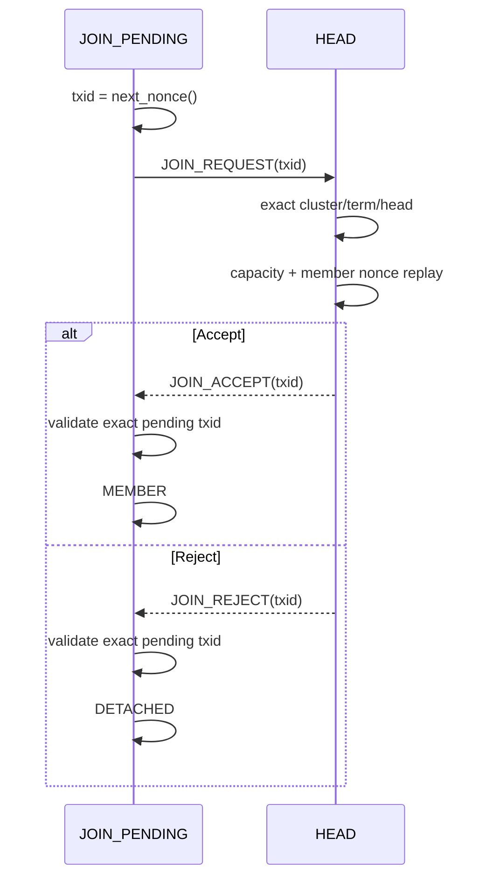
```mermaid
sequenceDiagram
    participant J as JOIN_PENDING
    participant H as HEAD

    J->>J: txid = next_nonce()
    J->>H: JOIN_REQUEST(txid)

    H->>H: exact cluster/term/head
    H->>H: capacity + member nonce replay

    alt Accept
        H-->>J: JOIN_ACCEPT(txid)
        J->>J: validate exact pending txid
        J->>J: MEMBER
    else Reject
        H-->>J: JOIN_REJECT(txid)
        J->>J: validate exact pending txid
        J->>J: DETACHED
    end
```

---

# 26. JOIN_REJECT 当前 Replay Fencing

只有同时满足：

```text
role == JOIN_PENDING
source == pending Head
cluster_id == pending Cluster
term == pending Term
nonce == pending_join_nonce
```

才真正结束当前 Join。

旧 Join 的 REJECT 即便：

```text
Head / Cluster / Term 相同
```

但 txid 不同：

```text
不会杀死新 Join。
```

---

# 27. 特殊乱序：BACKUP_ASSIGN 先于 JOIN_ACCEPT

当前仍支持这一条特殊路径。

如果 JOIN_PENDING 节点先收到：

```text
BACKUP_ASSIGN(selected=self)
```

则：

```text
JOIN_PENDING -> BACKUP
backup_syncing=true
```

之后迟到的 JOIN_ACCEPT：

```text
如果 exact pending txid/epoch
```

仍可接受，并保持：

```text
role == BACKUP
```

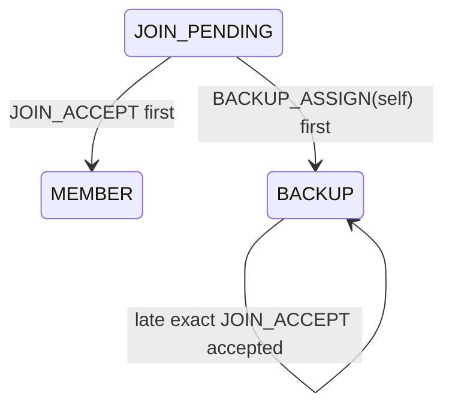
```mermaid
stateDiagram-v2
    JOIN_PENDING --> MEMBER: JOIN_ACCEPT first
    JOIN_PENDING --> BACKUP: BACKUP_ASSIGN(self) first
    BACKUP --> BACKUP: late exact JOIN_ACCEPT accepted
```

---

# 28. HEAD 成员表

当前 HEAD 使用：

```text
members[]
```

保存：

```text
node_id
lease
last_nonce
```

新的 JOIN_REQUEST：

```text
allocate_member()
```

容量受：

```text
config.member_capacity
```

限制。

---

# 29. KEEPALIVE

Member -> Head：

```text
KEEPALIVE
```

Head 校验：

```text
role HEAD
same cluster
same term
head_node_id == local
member exists
nonce > member.last_nonce
```

成功：

```text
member.last_nonce = new nonce
member lease refresh
```

---

# 30. LEAVE

当前 LEAVE 已经完整做 Member nonce replay fencing。

要求：

```text
HEAD
same cluster
same term
member exists
leave.nonce > member.last_nonce
```

否则：

```text
REPLAY
```

成功：

```text
remove_member()
```

如果离开的是 Backup：

```text
backup_node_id = 0
backup_ready = false
```

随后 Head step 会自动重新选 Backup。

---

# 31. HEAD 当前隐式 Backup 状态

公开 Role：

```text
HEAD
```

内部实际：

```text
HEAD_NO_BACKUP
HEAD_BACKUP_SELECTED
HEAD_BACKUP_ASSIGNING
HEAD_BACKUP_SYNCING
HEAD_BACKUP_READY
HEAD_DELTA_REFRESH
HEAD_TAKEOVER_ANNOUNCE
```

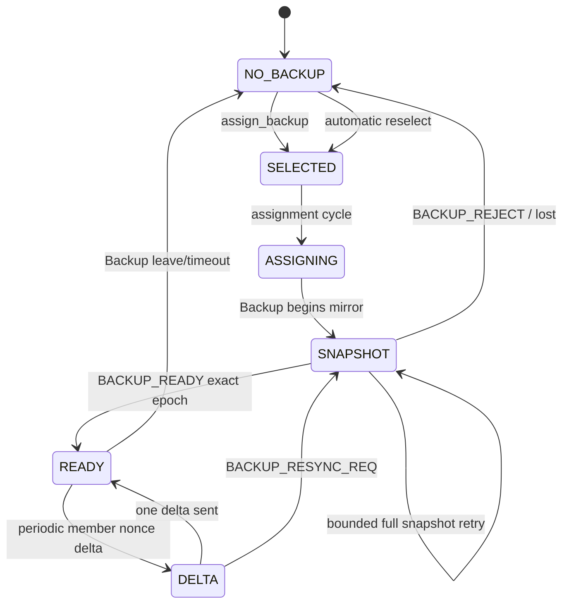
```mermaid
stateDiagram-v2
    [*] --> NO_BACKUP

    NO_BACKUP --> SELECTED: assign_backup
    SELECTED --> ASSIGNING: assignment cycle
    ASSIGNING --> SNAPSHOT: Backup begins mirror

    SNAPSHOT --> READY: BACKUP_READY exact epoch
    SNAPSHOT --> SNAPSHOT: bounded full snapshot retry

    READY --> DELTA: periodic member nonce delta
    DELTA --> READY: one delta sent
    DELTA --> SNAPSHOT: BACKUP_RESYNC_REQ

    SNAPSHOT --> NO_BACKUP: BACKUP_REJECT / lost
    READY --> NO_BACKUP: Backup leave/timeout

    NO_BACKUP --> SELECTED: automatic reselect
```

---

# 32. Backup 自动重选

当前 Head 每次 step：

```text
if backup_node_id == 0:
    assign_backup()
```

因此 Backup：

```text
LEAVE
Member lease expiry
BACKUP_REJECT
```

后，不再依赖：

```text
“必须再来一个新 JOIN”
```

才能重新选。

---

# 33. Backup Candidate 选择

只从当前：

```text
members[]
```

中挑，并要求 candidate table 有相应 head-capable candidate。

排序：

```text
head_score DESC
node_id ASC
```

如果 candidate 最近发送过：

```text
BACKUP_REJECT
```

Head 会保存：

```text
backup_rejected_node_id
backup_candidate_cooldown_until_ms
```

Cooldown 内跳过该 candidate。

---

# 34. Backup Generation

每选一个新 Backup：

```text
backup_generation++
```

但当前仍然：

```text
UINT32_MAX -> 1
```

即：

```text
Generation wrap 仍存在
```

Target v2 的：

```text
No-wrap + Rekey
```

尚未实现。

---

# 35. BACKUP_ASSIGN

Head 向当前成员传播：

```text
selected backup ID
backup_generation
```

每个 Member 保存：

```text
known_backup_node_id
known_backup_generation
```

选中的节点：

```text
MEMBER/JOIN_PENDING
-> BACKUP
```

并建立：

```text
backup_primary_node_id
backup_generation
backup_syncing=true
backup_ready=false
```

---

# 36. Backup Candidate 拒绝

当前新增：

```text
BACKUP_REJECT
```

Reason：

```text
COVERAGE
NO_SPACE
UNSUPPORTED
EPOCH_CONFLICT
```

实际已使用的主要路径：

```text
Snapshot END coverage failed
    -> COVERAGE

mirror allocation failed
    -> NO_SPACE
```

---

# 37. BACKUP_REJECT 时序

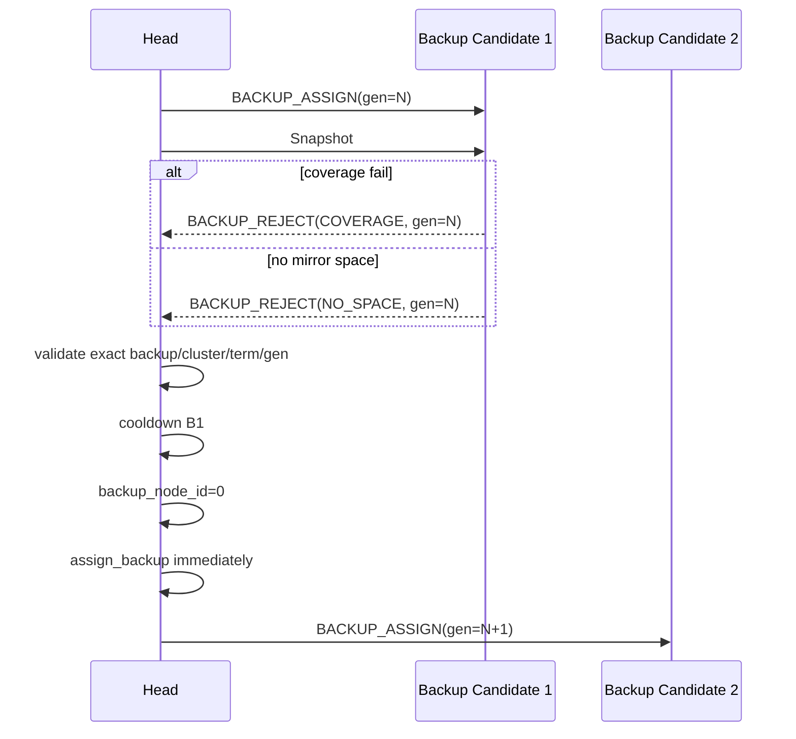
```mermaid
sequenceDiagram
    participant H as Head
    participant B1 as Backup Candidate 1
    participant B2 as Backup Candidate 2

    H->>B1: BACKUP_ASSIGN(gen=N)
    H->>B1: Snapshot

    alt coverage fail
        B1-->>H: BACKUP_REJECT(COVERAGE, gen=N)
    else no mirror space
        B1-->>H: BACKUP_REJECT(NO_SPACE, gen=N)
    end

    H->>H: validate exact backup/cluster/term/gen
    H->>H: cooldown B1
    H->>H: backup_node_id=0
    H->>H: assign_backup immediately

    H->>B2: BACKUP_ASSIGN(gen=N+1)
```

这已经修掉旧实现：

```text
必须等 B1 lease timeout 才换人
```

的问题。

---

# 38. Type12 当前 Wire 数据

当前 Type12 关键字段：

```text
backup_generation      uint32
member_node_id         node-id field
membership_sequence    uint32
member_nonce           uint32
```

因此不再存在旧版：

```text
member_nonce 16-bit truncation
membership_sequence 16-bit truncation
Type12 无 generation
```

这三个问题。

---

# 39. Full Snapshot

当前流程：

```text
SYNC_BEGIN
Member Record #1
Member Record #2
...
Member Record #N
SYNC_END
```

每个 Type12：

```text
backup_generation == current generation
```

否则：

```text
REPLAY
```

---

# 40. Full Snapshot Sequence

当前：

```text
SYNC_BEGIN:
    sequence starts/reset

Member:
    must == local + 1

SYNC_END:
    must == local + 1
```

如果 full snapshot 中间 frame 丢失/乱序：

```text
Backup：
    stays BACKUP
    backup_syncing=true
    backup_ready=false
    membership_sequence reset
```

等待 Head 的 bounded snapshot retransmit。

不会像早期实现一样直接 Detach。

---

# 41. Snapshot BEGIN 当前仍然直接清 mirror

收到 BEGIN：

```text
clear_members()
membership_sequence = incoming
backup_syncing=true
backup_ready=false
```

因此当前不是 Target v2 的：

```text
Committed Mirror
+
Staging Mirror
+
Atomic Swap
```

双缓冲模型。

这是 Current/Target 仍然存在的结构差异。

---

# 42. Backup Coverage

Snapshot END：

```text
backup_covers_all_members()
```

现在要求 mirror 中每个 Member 对应 peer：

```text
存在
AND
neighbor_state == ADMITTED
```

`SUSPECT` 不再算 coverage。

---

# 43. Snapshot END

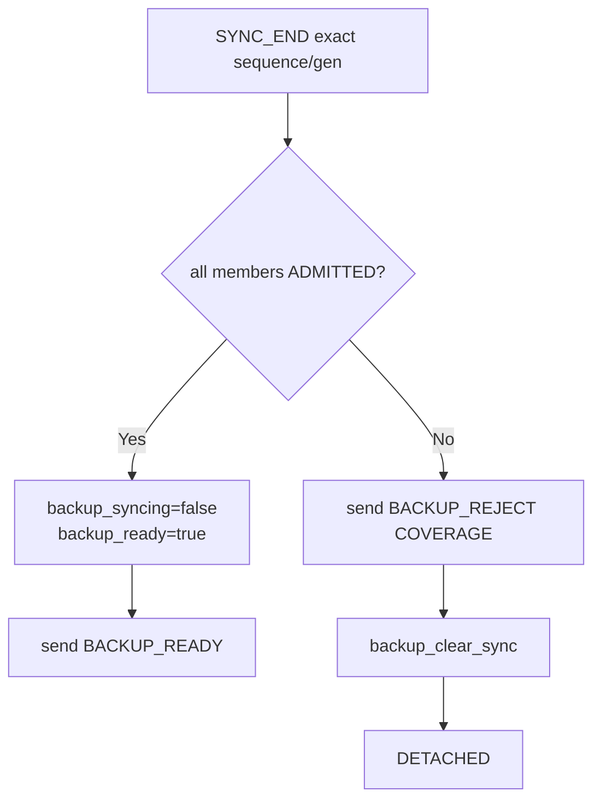
```mermaid
flowchart TD
    END[SYNC_END exact sequence/gen] --> COV{all members ADMITTED?}

    COV -->|Yes| READY[backup_syncing=false<br/>backup_ready=true]
    READY --> MSG[send BACKUP_READY]

    COV -->|No| REJ[send BACKUP_REJECT COVERAGE]
    REJ --> CLR[backup_clear_sync]
    CLR --> DET[DETACHED]
```

---

# 44. BACKUP_READY Fencing

Backup READY 带：

```text
cluster_id
term
backup_generation
membership_sequence
```

Head 只有全匹配：

```text
current Cluster
current Term
current Backup generation
current membership sequence
```

才：

```text
backup_ready = true
```

旧 READY 不再能提前标记新镜像 READY。

---

# 45. Live `SYNC_DELTA`

Backup READY 后，Head 周期 round-robin 同步：

```text
一个 Member 的最新 nonce
```

Delta：

```text
backup_generation
membership_sequence
member_node_id
member_nonce
```

不切换：

```text
HEAD/BACKUP role
```

---

# 46. Delta 正常路径

Backup 收到：

```text
sequence == local_sequence + 1
```

则：

```text
更新对应 member.last_nonce
刷新该 mirror member lease
membership_sequence++
保持当前 Backup role
```

---

# 47. Delta stale

如果：

```text
incoming sequence <= local sequence
```

当前：

```text
ignore / UCN_OK
```

不会倒退 mirror。

---

# 48. Delta gap

如果：

```text
incoming sequence > local + 1
```

说明中间 Delta 丢失。

当前：

```text
backup_ready = false
backup_syncing = true

send BACKUP_RESYNC_REQ
return replay/gap
```

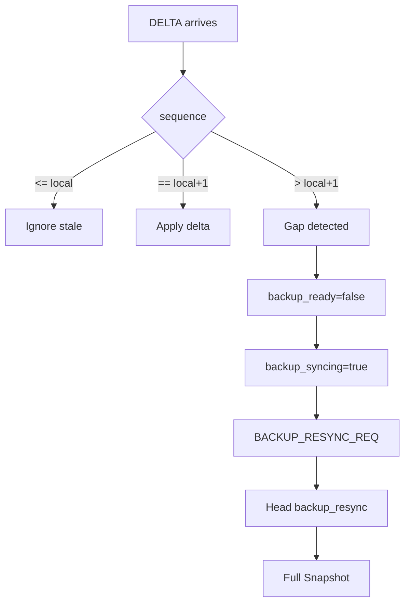
```mermaid
flowchart TD
    D[DELTA arrives] --> S{sequence}

    S -->|<= local| OLD[Ignore stale]
    S -->|== local+1| APPLY[Apply delta]
    S -->|> local+1| GAP[Gap detected]

    GAP --> NR[backup_ready=false]
    NR --> SY[backup_syncing=true]
    SY --> REQ[BACKUP_RESYNC_REQ]
    REQ --> FULL[Head backup_resync]
    FULL --> BEGIN[Full Snapshot]
```

这已经修掉旧实现：

```text
gap 后直接把 sequence 跳到更高值
```

造成 nonce baseline 永久缺口的问题。

---

# 49. BACKUP_RESYNC_REQ

Type 18：

```text
Backup -> Head
```

携带：

```text
cluster_id
term
backup_generation
membership_sequence
```

Head 校验：

```text
role HEAD
source == current backup
same cluster
same term
same generation
```

成功：

```text
backup_resync()
```

重新启动 full snapshot。

---

# 50. PRIMARY_HEARTBEAT

当前 Heartbeat 绑定：

```text
cluster_id
term
backup_generation
membership_sequence
```

Backup 接收时：

```text
cluster exact
term exact
generation exact
incoming sequence >= local sequence
```

如果：

```text
incoming sequence < local
```

视为 replay/stale。

如果 heartbeat 带更大的 sequence：

```text
local membership_sequence = incoming sequence
```

随后刷新：

```text
primary heartbeat deadline
primary lease deadline
miss counter = 0
```

---

# 51. Backup 也把 Primary HEAD_ADVERTISE 当 liveness evidence

当前 Primary 的受保护 HEAD_ADVERTISE：

```text
same backup_primary
same cluster
same term
```

也会延长：

```text
backup_primary_lease_deadline
```

这样单纯丢几个 direct heartbeat：

```text
不一定触发 takeover
```

---

# 52. BACKUP 隐式子状态

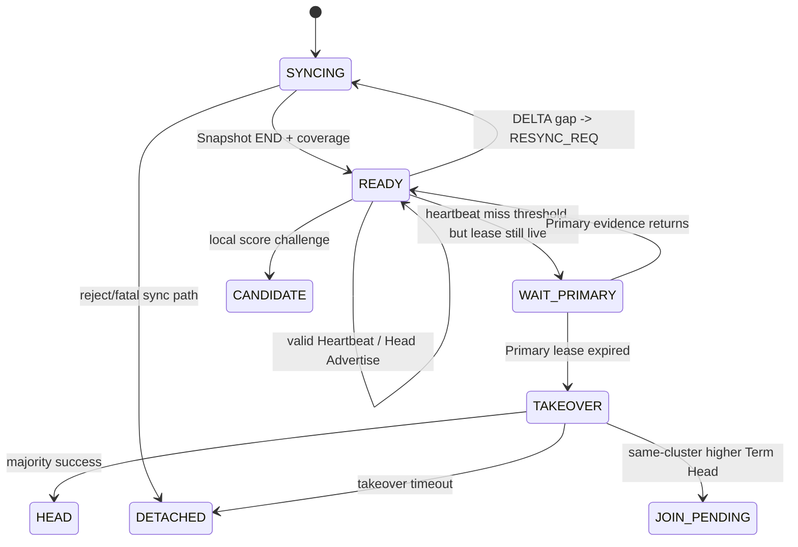
```mermaid
stateDiagram-v2
    [*] --> SYNCING

    SYNCING --> READY: Snapshot END + coverage
    SYNCING --> DETACHED: reject/fatal sync path

    READY --> READY: valid Heartbeat / Head Advertise
    READY --> SYNCING: DELTA gap -> RESYNC_REQ
    READY --> WAIT_PRIMARY: heartbeat miss threshold but lease still live

    WAIT_PRIMARY --> READY: Primary evidence returns
    WAIT_PRIMARY --> TAKEOVER: Primary lease expired

    TAKEOVER --> HEAD: majority success
    TAKEOVER --> DETACHED: takeover timeout
    TAKEOVER --> JOIN_PENDING: same-cluster higher Term Head

    READY --> CANDIDATE: local score challenge
```

所有这些隐式状态公开：

```text
role == BACKUP
```

除非转到：

```text
CANDIDATE
HEAD
DETACHED
JOIN_PENDING
```

---

# 53. Backup score challenge

如果：

```text
local head_score 显著优于 Primary
+
Backup role tenure >= head_min_tenure
```

则：

```text
BACKUP -> CANDIDATE
```

保持：

```text
same cluster_id
```

并：

```text
term++
```

当前 Term 仍：

```text
MAX -> 1
```

---

# 54. Primary 失效检测

Backup 有：

```text
backup_primary_deadline_ms
backup_primary_lease_deadline_ms
backup_missed_heartbeats
```

到 heartbeat check deadline：

```text
missed++
```

达到：

```text
UCN_CLUSTER_BACKUP_MISS_LIMIT
```

后分情况。

---

# 55. Primary Lost + Backup READY

如果：

```text
backup_ready=true
takeover_active=false
miss limit reached
```

还必须：

```text
Primary Lease expired
```

才：

```text
start_takeover()
```

否则：

```text
继续 BACKUP 等 lease
```

---

# 56. Primary Lost + Backup NOT READY

如果：

```text
miss limit reached
backup_ready=false
takeover_active=false
```

当前：

```text
recovery_eligible=true
backup_clear_sync()
```

导致：

```text
BACKUP -> DETACHED
```

随后走 Recovery。

---

# 57. Takeover Self Vote

当前 `start_takeover()`：

```text
backup_takeover_active = true
ack_count = 0
```

扫描 mirror：

如果 mirror 中存在：

```text
local Backup self
```

则：

```text
ack_count = 1
```

即：

```text
Backup self vote 已计入。
```

---

# 58. Takeover Prepare

Backup 遍历 mirror：

```text
skip empty
skip self
skip already acked
```

逐个发送：

```text
TAKEOVER_PREPARE
```

绑定：

```text
cluster_id
term
old Primary head id
backup_generation
```

---

# 59. Takeover Majority

当前 denominator：

```text
member_count(mirror)
```

majority：

```text
floor(active / 2) + 1
```

Backup self vote 在：

```text
self in mirror
```

时计入。

---

# 60. Takeover Vote Identity

Member 的防重复投票身份：

```text
cluster_id
term
backup_generation
```

同一身份重复 PREPARE：

```text
不会重复算新票
```

Detach 后身份清零。

---

# 61. Takeover 成功

达到 majority：

```text
complete_takeover()
```

动作：

```text
role = HEAD

term =
    MAX ? 1 : term + 1

head_node_id = self

backup_takeover_active=false
backup_ready=false
backup_syncing=false

backup_node_id=0
backup_primary_node_id=0

known_backup=clear
```

继承 mirror 成员：

```text
删除 self member slot
其余 Member lease 续期
```

之后：

```text
逐 Member 发送 HEAD_TAKEOVER
```

发送采用 cursor：

```text
Token Bucket back-pressure 时可继续重试
```

---

# 62. Takeover 成功时序

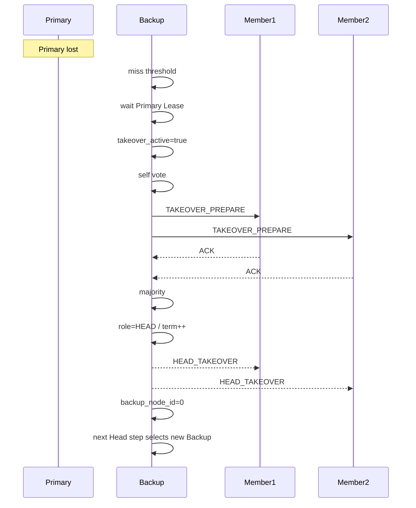
```mermaid
sequenceDiagram
    participant P as Primary
    participant B as Backup
    participant M1 as Member1
    participant M2 as Member2

    Note over P: Primary lost
    B->>B: miss threshold
    B->>B: wait Primary Lease
    B->>B: takeover_active=true
    B->>B: self vote

    B->>M1: TAKEOVER_PREPARE
    B->>M2: TAKEOVER_PREPARE

    M1-->>B: ACK
    M2-->>B: ACK

    B->>B: majority
    B->>B: role=HEAD / term++

    B-->>M1: HEAD_TAKEOVER
    B-->>M2: HEAD_TAKEOVER

    B->>B: backup_node_id=0
    B->>B: next Head step selects new Backup
```

---

# 63. Takeover 超时

如果：

```text
backup_takeover_active
AND takeover_deadline expired
```

当前会清 Backup Sync 并：

```text
BACKUP -> DETACHED
```

后续是否进入 Recovery 取决于当前 recovery-related 状态路径。

---

# 64. HEAD_TAKEOVER

当前允许：

```text
MEMBER
BACKUP
JOIN_PENDING
RECOVERY_HEAD
```

等场景接受合法 takeover。

主要 fencing：

```text
known backup source
backup_generation
cluster/term relation
incoming new term
```

成功：

```text
role = MEMBER
head = takeover source
term = incoming term
lease refresh
Backup state clear
```

---

# 65. HEAD member expiry

HEAD 每 step：

```text
expire_members()
```

Member lease 到期：

```text
remove slot
```

如果过期的是 Backup：

```text
backup_node_id=0
backup_ready=false
```

后续同一个/下一次 Head step：

```text
assign_backup()
```

---

# 66. KEEPALIVE 与 Backup Delta 的关系

Member KEEPALIVE：

```text
Head 更新真实 member.last_nonce
```

但不是每次 KEEPALIVE 立刻发送 Delta。

Head 使用：

```text
backup_delta_cursor
next_backup_delta_ms
```

round-robin 同步。

因此：

```text
Head member table
```

可能短时间领先：

```text
Backup mirror
```

但 Delta gap 已有 full-resync 保护。

---

# 67. HEAD_STEPDOWN 当前 replay fencing

Head 发送 `HEAD_STEPDOWN` 时：

```text
send_message()
```

生成新的 nonce。

Member/JoinPending/Backup 接收时：

```text
same current Head
same cluster
same term
message.nonce > last_stepdown_nonce
```

才能生效。

成功后：

```text
last_stepdown_nonce = message.nonce
```

旧 Stepdown 重放不会再次生效。

---

# 68. Backup 现在接受 HEAD_STEPDOWN

当前允许：

```text
MEMBER
JOIN_PENDING
BACKUP
```

接收当前 Head 的合法 Stepdown。

Backup：

```text
backup_clear_sync()
-> DETACHED
```

普通 Member：

```text
set_detached()
```

这修掉旧实现：

```text
Head 主动让位后 Backup 留在旧 Cluster
然后误触发 takeover
```

---

# 69. HEAD_STEPDOWN 仍不携带 Target

当前 Head 自己：

```text
begin_ordered_stepdown(candidate)
```

会在本地保存：

```text
pending target Head
pending target Cluster
pending target Term
```

但发给 Member 的：

```text
HEAD_STEPDOWN
```

仍主要描述：

```text
old Cluster / old Term / old Head + nonce
```

Member 收到后：

```text
DETACHED
```

并不知道 Head 希望它直接去哪个 Target。

这仍是 Current 与 Target v2：

```text
HEAD_STEPDOWN(target)
```

的差异。

---

# 70. STEPPING_DOWN

Head：

```text
send HEAD_STEPDOWN
-> role = STEPPING_DOWN
-> stepdown_deadline = keepalive_interval
```

deadline 到：

```text
clear members
role = JOIN_PENDING
```

Head 自己保留：

```text
pending target
```

所以它随后直接向 winner：

```text
JOIN_REQUEST
```

---

# 71. Ordered Stepdown 时序

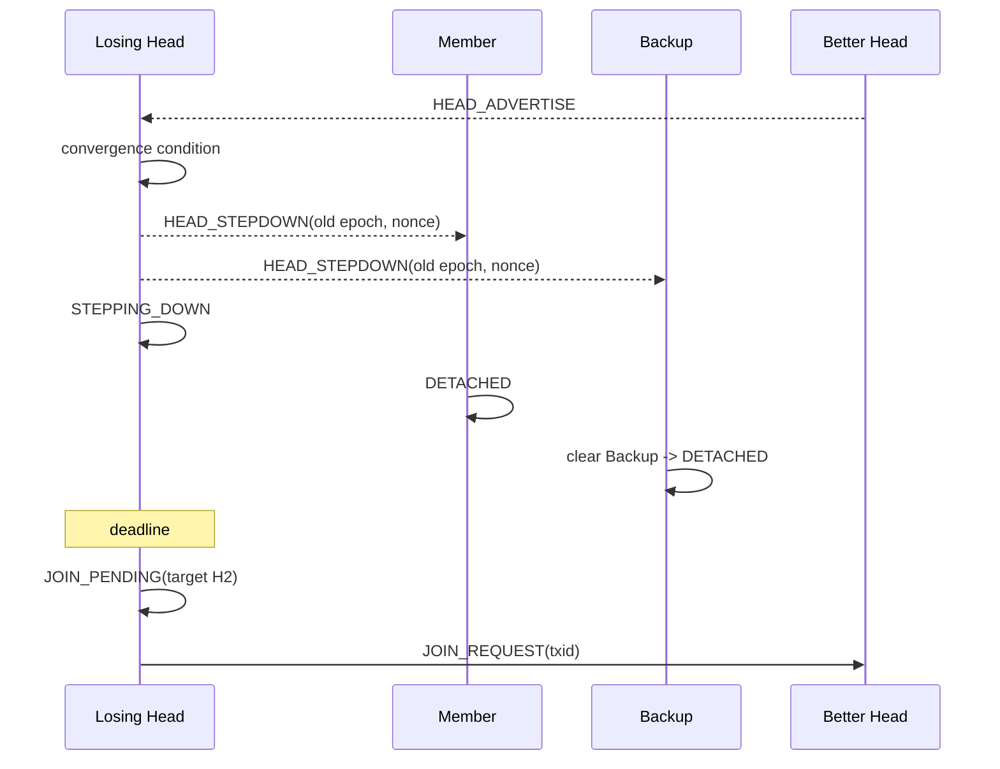
```mermaid
sequenceDiagram
    participant H1 as Losing Head
    participant M as Member
    participant B as Backup
    participant H2 as Better Head

    H2-->>H1: HEAD_ADVERTISE
    H1->>H1: convergence condition

    H1-->>M: HEAD_STEPDOWN(old epoch, nonce)
    H1-->>B: HEAD_STEPDOWN(old epoch, nonce)

    H1->>H1: STEPPING_DOWN

    M->>M: DETACHED
    B->>B: clear Backup -> DETACHED

    Note over H1: deadline

    H1->>H1: JOIN_PENDING(target H2)
    H1->>H2: JOIN_REQUEST(txid)
```

---

# 72. Recovery 当前已经是“真实临时 Cluster”

这是当前相较旧文档最重要的变化之一。

旧版：

```text
Recovery Head 只是自己 role=RECOVERY_HEAD
ACK 节点不真正加入
```

现在：

```text
RECOVERY_DECLARE receiver
真正写入：
    recovery_cluster_id
    cluster_id
    term
    head_node_id
    role=MEMBER
    head lease
```

Recovery Head：

```text
收到 RECOVERY_ACK
真正把 source 登记进 members[]
并维护其 lease
```

---

# 73. Recovery 不冒充旧 Cluster

Recovery Head 当前：

```text
recovery_cluster_id = local_node_id
cluster_id = local_node_id
term = 1
head = local
```

因此 Recovery Cluster：

```text
不继续使用失效 stable Cluster 的 cluster_id
```

这是 Recovery Island 模型。

---

# 74. Recovery declaration 前的可见性约束

当前 `recovery_quorum_met()` 有两种语义。

## 74.1 Backup 仍持有 mirror

如果：

```text
mirror_count > 0
```

要求：

```text
visible mirrored members
>= floor(mirror_count/2)+1
```

即：

```text
visible mirror majority
```

---

## 74.2 普通 Member 无 mirror

如果：

```text
mirror_count == 0
```

只要求：

```text
至少 1 个 ADMITTED peer
```

所以当前 Recovery 的安全模型不是：

```text
任何 Recovery Island 都必须 old-cluster majority
```

而是：

```text
不能完全孤立自封

有旧 mirror 的 Backup：
    要求 visible majority

普通 Member：
    只要形成至少两节点可见域即可建临时 Recovery Island
```

---

# 75. Recovery Backoff

当前：

```text
recovery_nonce = next_nonce()

backoff =
    local_node_id
    % recovery_backoff_max_ms
```

这只是初始错峰。

当前还没有 Target v2 的：

```text
recovery_round
bounded exponential backoff
lineage parent_term ranking
```

---

# 76. Recovery 双候选仲裁

当前使用：

```text
(recovery_nonce, node_id)
```

字典序比较。

原则：

```text
严格更小的 tuple 胜出
```

如果本机：

```text
还没启动 recovery nonce
```

则接受对方。

如果本机已经：

```text
RECOVERY_HEAD
```

但看到严格更小的 contender：

```text
本机让位
并加入 winner
```

因此不会出现：

```text
A 加 B
同时
B 加 A
```

的对称错误。

---

# 77. `accepted_recovery_nonce`

当前把：

```text
本机 recovery_nonce
```

与：

```text
已接受远端 Recovery nonce
```

拆开：

```text
recovery_nonce
accepted_recovery_nonce
known_recovery_source
```

避免：

```text
接收远端 declare
```

污染本机 candidacy nonce。

---

# 78. RECOVERY_DECLARE Receiver

允许：

```text
MEMBER
BACKUP
DETACHED
RECOVERY_HEAD
```

参与。

普通 Member 如果：

```text
当前 Stable Head Lease 仍然有效
```

会拒绝 Recovery Declare。

---

# 79. 接受 Recovery Head

成功接受：

```text
cluster_id = recovery cluster
term = recovery term
head_node_id = recovery source
role = MEMBER
head lease = recovery TTL

recovery_eligible=false
recovery_backoff=0
```

然后：

```text
RECOVERY_ACK
```

---

# 80. Recovery ACK 现在真的建立成员关系

Recovery Head 收 ACK：

```text
find existing member
```

如果没有：

```text
直接从固定 members[] 找空 slot
```

注意：

这里故意**绕过正常 `member_capacity`**。

原因：

```text
声明 Recovery 的节点可能原本只是普通 Member，
其 member_capacity 可能为 0。
```

成功后：

```text
Member lease = recovery_head_ttl
recovery_ack_count++
```

重复 ACK：

```text
只刷新 lease
```

---

# 81. Recovery Head 周期维护

当前 Recovery Head 每 step：

```text
expire_members()

每 advertise interval:
    send_recovery_declare()
```

因此：

```text
已有成员 lease 可刷新
迟到 survivor 也可以加入
```

---

# 82. Recovery TTL

到：

```text
recovery_deadline
```

则：

```text
stepdown_recovery_head()
```

动作：

```text
recovery cooldown
清 recovery cluster state
保留 recovery_eligible
DETACHED
```

如果网络仍 headless：

```text
之后再 backoff / retry
```

---

# 83. Recovery 当前状态图

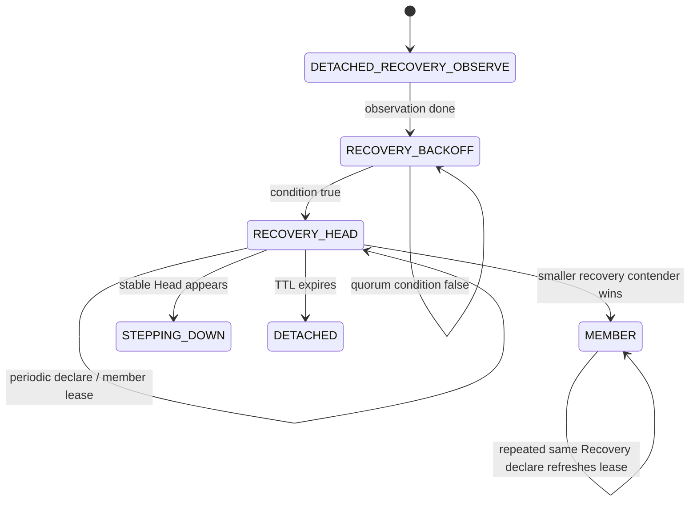
```mermaid
stateDiagram-v2
    [*] --> DETACHED_RECOVERY_OBSERVE

    DETACHED_RECOVERY_OBSERVE --> RECOVERY_BACKOFF: observation done
    RECOVERY_BACKOFF --> RECOVERY_BACKOFF: quorum condition false
    RECOVERY_BACKOFF --> RECOVERY_HEAD: condition true

    RECOVERY_HEAD --> RECOVERY_HEAD: periodic declare / member lease
    RECOVERY_HEAD --> MEMBER: smaller recovery contender wins
    RECOVERY_HEAD --> STEPPING_DOWN: stable Head appears
    RECOVERY_HEAD --> DETACHED: TTL expires

    MEMBER --> MEMBER: repeated same Recovery declare refreshes lease
```

---

# 84. Recovery Head 遇 Stable Head

`consider_head_offer()` 对：

```text
RECOVERY_HEAD
```

收到 Stable Head：

```text
begin_ordered_stepdown()
```

即：

```text
Stable Head reclaim
```

优先于临时 Recovery Head。

---

# 85. RX 入口

所有 Cluster frame 先经过：

```text
cluster enabled
source valid
source != self
protected_control if required
source peer exists
peer must be ADMITTED
decode
message validity
head/source generic relation
type dispatch
```

---

# 86. 当前 RX Dispatch

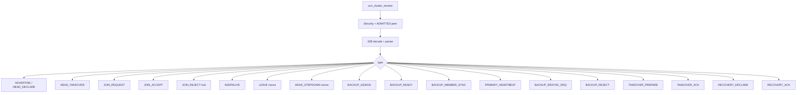
```mermaid
flowchart TD

    RX[ucn_cluster_receive] --> SEC[Security + ADMITTED peer]
    SEC --> DECODE[32B decode + parser]
    DECODE --> TYPE{type}

    TYPE --> ADV[ADVERTISE / HEAD_DECLARE]
    TYPE --> HT[HEAD_TAKEOVER]

    TYPE --> JR[JOIN_REQUEST]
    TYPE --> JA[JOIN_ACCEPT]
    TYPE --> JJ[JOIN_REJECT txid]

    TYPE --> KA[KEEPALIVE]
    TYPE --> LE[LEAVE nonce]
    TYPE --> SD[HEAD_STEPDOWN nonce]

    TYPE --> BA[BACKUP_ASSIGN]
    TYPE --> BR[BACKUP_READY]
    TYPE --> BMS[BACKUP_MEMBER_SYNC]
    TYPE --> PH[PRIMARY_HEARTBEAT]
    TYPE --> RR[BACKUP_RESYNC_REQ]
    TYPE --> BJ[BACKUP_REJECT]

    TYPE --> TP[TAKEOVER_PREPARE]
    TYPE --> TA[TAKEOVER_ACK]

    TYPE --> RD[RECOVERY_DECLARE]
    TYPE --> RA[RECOVERY_ACK]
```

---

# 87. 当前 parser 已经严格解决的组合

Type12：

```text
flags exact whitelist
role == HEAD
generation nonzero
marker/member field shape
```

Type18/19：

```text
role == BACKUP
```

Backup control types：

```text
role pairing
generation requirements
```

因此上一版 Current FSM 中的：

```text
BEGIN|DELTA 被误当 DELTA
Type12 任意 role
```

已经不是当前行为。

---

# 88. Neighbor Sync

当前 `ucn_cluster_sync_neighbors()` 已改成：

```text
先构造临时 peer table
检查容量
全部成功
再 commit
```

如果：

```text
NO_SPACE
```

当前已有 peer table 不会先被清成半张。

这是当前真实的 atomic logical commit。

---

# 89. Peer 表仍只接受 ADMITTED RX

虽然 peer snapshot 可以保存 Core 的状态信息，但：

```text
ucn_cluster_receive()
```

要求 source 当前：

```text
neighbor_state == ADMITTED
```

否则：

```text
ACCESS
```

---

# 90. Token Bucket 冷启动

当前初始化：

```text
tokens = burst
last_refill_ms = 0
```

第一次 refill：

```text
只设置 last_refill_ms
不再次把 tokens 重置到 burst
```

因此旧的：

```text
t=0 消耗一个 burst
t=1 又凭空获得整个 burst
```

问题已修。

---

# 91. Control Send 的 cursor 语义

一些多帧控制过程：

```text
Backup Assignment
Snapshot
Takeover Prepare
Takeover Announce
Advertisement
```

使用 cursor。

原则：

```text
TX 成功：
    cursor/sequence 推进

Token Bucket / send 失败：
    不推进或安排重试
```

从而避免：

```text
控制流尾部帧静默丢失
```

---

# 92. `ucn_cluster_step()` 当前真实执行顺序

当前不是：

```text
switch(role)
```

而是一串顺序执行的条件块。

大致：

```text
1. MEMBER Head Lease / Grace

2. HEAD:
   - expire members
   - Head advertise
   - auto select Backup
   - assignment cycle
   - Delta
   - Primary heartbeat
   - takeover announce
   - Backup assignment
   - Backup full snapshot
   - snapshot retry

3. BACKUP:
   - heartbeat miss
   - Primary lease
   - start takeover / recovery

4. BACKUP takeover timeout

5. BACKUP takeover prepare

6. DETACHED:
   - normal election
   - Recovery cooldown/backoff/quorum

7. CANDIDATE election completion

8. RECOVERY_HEAD:
   - expire recovery members
   - periodic declare
   - TTL

9. STEPPING_DOWN deadline

10. CANDIDATE advertise

11. JOIN_PENDING retry

12. MEMBER/BACKUP keepalive
```

---

# 93. Current Step 伪代码

```c
cluster_step()
{
    now = now_ms();

    if (MEMBER && HeadLeaseExpired) {

        if (GraceNotStarted)
            StartMemberGrace();

        else if (GraceExpired) {
            recovery_eligible = true;
            DETACHED;
        }
    }

    if (HEAD) {

        expire_members();

        if (HeadAdvertiseDue)
            advertise_one_peer();

        if (backup_node_id == 0)
            assign_backup();

        if (backup_assignment_cycle_due)
            start_assignment_cycle();

        send_backup_delta_step();
        send_primary_heartbeat_step();
        send_takeover_announce_step();
        send_backup_assignment_step();
        send_full_snapshot_step();

        if (snapshot_finished_but_not_ready &&
            resync_deadline_expired) {
            backup_resync();
        }
    }

    if (BACKUP && heartbeat_check_expired) {

        missed++;

        if (missed >= MISS_LIMIT) {

            if (backup_ready && !takeover_active) {

                if (PrimaryLeaseExpired)
                    start_takeover();
            }
            else if (!takeover_active) {

                recovery_eligible = true;
                backup_clear_sync();
                return;
            }
        }

        restart_heartbeat_check();
    }

    if (BACKUP &&
        takeover_active &&
        takeover_deadline_expired) {

        backup_clear_sync();
        return;
    }

    if (BACKUP && takeover_active)
        send_takeover_prepare_step();

    if (DETACHED &&
        head_capable &&
        observation_expired) {

        if (recovery_eligible &&
            cooldown_active) {
            wait;
        }
        else if (recovery_eligible) {

            if (backoff_not_started)
                start_recovery_backoff();

            else if (backoff_expired) {

                if (recovery_quorum_met())
                    declare_recovery_head();
                else
                    restart_bounded_backoff();
            }
        }
        else {
            start_election();
        }
    }

    if (CANDIDATE && election_expired)
        complete_election();

    if (RECOVERY_HEAD) {

        expire_members();

        if (declare_due)
            send_recovery_declare();

        if (TTL_expired) {
            stepdown_recovery_head();
            return;
        }
    }

    if (STEPPING_DOWN && deadline_expired) {
        clear_members();
        role = JOIN_PENDING;
    }

    if (CANDIDATE && advertise_due)
        advertise();

    if (JOIN_PENDING && retry_due)
        send_join_request();

    if ((MEMBER || BACKUP) && keepalive_due)
        send_keepalive();
}
```

---

# 94. 当前有效状态组合矩阵

| Public Role | 关键字段 | 实际子状态 |
|---|---|---|
| DETACHED | `recovery_eligible=false` | Normal Observe |
| DETACHED | `recovery_eligible=true` | Recovery Observe |
| DETACHED | `recovery_backoff_deadline!=0` | Recovery Backoff |
| DETACHED | cooldown active | Recovery Cooldown |
| JOIN_PENDING | `pending_join_nonce` | Join Txn |
| MEMBER | `head_grace_deadline=0` | Member Normal |
| MEMBER | `head_grace_deadline!=0` | Member Grace |
| HEAD | `backup_node_id=0` | No Backup |
| HEAD | `backup_assign_pending=true` | Backup Assigning |
| HEAD | Backup exists + `backup_ready=false` | Snapshot/Waiting Ready |
| HEAD | `backup_ready=true` | Backup Ready |
| HEAD | Delta cursor active | Live Mirror Refresh |
| HEAD | takeover announce active | Announcing Promotion |
| BACKUP | `backup_syncing=true` | Syncing |
| BACKUP | `backup_ready=true` | Ready |
| BACKUP | misses reached + Primary lease alive | Waiting Lease |
| BACKUP | `takeover_active=true` | Takeover |
| STEPPING_DOWN | deadline | Ordered Yield |
| RECOVERY_HEAD | recovery deadline | Temporary Recovery Cluster |

---

# 95. 当前 Term 行为

Term 增长路径至少包括：

```text
start_election()
backup_challenge()
complete_takeover()
```

当前仍：

```text
UINT32_MAX -> 1
```

这是 Current 真实行为。

Target v2 的：

```text
Term exhaustion
-> Cluster Rekey
```

尚未实现。

---

# 96. 当前 Nonce 行为

`next_nonce()` 当前也存在：

```text
wrap/restart
```

逻辑。

当前没有 Target v2 的：

```text
sender incarnation
Persistent replay epoch
```

---

# 97. Backup Generation 也会回绕

当前：

```text
backup_generation ==
UINT32_MAX
    ? 1
    : +1
```

所以：

```text
Generation No-Wrap
```

仍是 Target，不是 Current。

---

# 98. 当前没有 Head Majority Authority

`HEAD` 当前并不会：

```text
计算 CommittedVoterSet quorum
```

也没有：

```text
authority_active
HEAD_QUORUM_GRACE
HEAD_FENCED
```

因此网络分区时旧 Head：

```text
不会因为只剩少数派自动关闭 Authority
```

当前主要依赖：

```text
Head offer convergence
Member lease
Backup takeover
```

来收敛。

---

# 99. 当前没有 Committed / Joint Membership Config

当前只有：

```text
members[]
```

HEAD 时：

```text
真实成员表
```

BACKUP 时：

```text
Snapshot mirror
```

没有：

```text
RuntimeMembers
CommittedVoterSet
C_old
C_joint
C_new
config_id
```

所以 Target v2 的 Membership Reconfiguration Safety 尚未进入 Current。

---

# 100. 当前 JOIN_ACCEPT 仍直接变正式 MEMBER

当前：

```text
JOIN_ACCEPT
-> MEMBER
```

没有 Target v2：

```text
JOIN_ACCEPT
-> MEMBER_PROVISIONAL
-> CONFIG_COMMIT
-> MEMBER_ACTIVE
```

---

# 101. 当前没有 Persistence Provider

没有：

```text
persist-before-vote
persist-before-advertise
persist Config Commit
persist Rekey
```

的统一 `ClusterPersistenceProvider`。

Takeover vote identity：

```text
只在 RAM。
```

节点重启后的跨重启防重放：

```text
尚不是 Target v2 语义。
```

---

# 102. Recovery 当前也没有 Lineage

当前 Recovery 保存：

```text
recovery_cluster_id
recovery_nonce
accepted_recovery_nonce
known_recovery_source
```

但没有：

```text
parent_cluster_id
parent_term
parent_config_id
recovery_round
```

所以 Target v2 的：

```text
RecoveryLineage
```

尚未实现。

---

# 103. Recovery retry 当前不是指数退避

当前：

```text
initial:
    node_id % recovery_backoff_max

quorum fail:
    wait recovery_backoff_max

TTL stepdown:
    cooldown = recovery_observation
```

没有：

```text
bounded exponential backoff
recovery_round
deterministic round jitter
```

---

# 104. Current 与 Target v2 关键状态映射

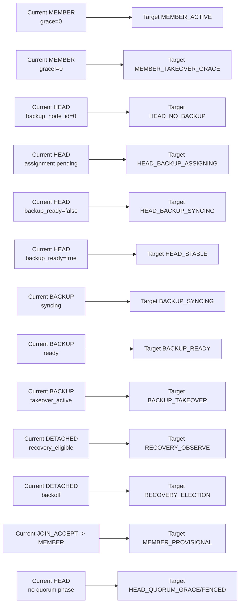
```mermaid
flowchart LR

    CM["Current MEMBER<br/>grace=0"] --> TM["Target MEMBER_ACTIVE"]
    CG["Current MEMBER<br/>grace!=0"] --> TG["Target MEMBER_TAKEOVER_GRACE"]

    CH0["Current HEAD<br/>backup_node_id=0"] --> TH0["Target HEAD_NO_BACKUP"]
    CHA["Current HEAD<br/>assignment pending"] --> THA["Target HEAD_BACKUP_ASSIGNING"]
    CHS["Current HEAD<br/>backup_ready=false"] --> THS["Target HEAD_BACKUP_SYNCING"]
    CHR["Current HEAD<br/>backup_ready=true"] --> THR["Target HEAD_STABLE"]

    CBS["Current BACKUP<br/>syncing"] --> TBS["Target BACKUP_SYNCING"]
    CBR["Current BACKUP<br/>ready"] --> TBR["Target BACKUP_READY"]
    CBT["Current BACKUP<br/>takeover_active"] --> TBT["Target BACKUP_TAKEOVER"]

    CR["Current DETACHED<br/>recovery_eligible"] --> TRO["Target RECOVERY_OBSERVE"]
    CRB["Current DETACHED<br/>backoff"] --> TRE["Target RECOVERY_ELECTION"]

    CJ["Current JOIN_ACCEPT -> MEMBER"] --> TP["Target MEMBER_PROVISIONAL"]

    CQ["Current HEAD<br/>no quorum phase"] --> TQ["Target HEAD_QUORUM_GRACE/FENCED"]
```

---

# 105. 当前已经接近 Target 的部分

以下机制目前已经显著接近理想方向：

```text
Backup generation fencing
32-bit member nonce/sequence
Delta gap full resync
Backup automatic reselection
Backup candidate rejection/cooldown
Takeover self vote
Takeover vote identity
Recovery new Cluster ID
Recovery real membership
Recovery conflict arbitration
Join transaction fencing
Stepdown nonce fencing
Strict Type12 parser
Atomic peer snapshot commit
Token Bucket retry behavior
```

---

# 106. 当前仍明显未达到 Target v2 的部分

```text
Unique Phase
Head Majority Authority
HEAD_QUORUM_GRACE
HEAD_FENCED

MEMBER_PROVISIONAL

Committed / Joint Membership Config

Persistence Provider

Persist-before-vote
Persist-before-advertise

Snapshot committed/staging dual mirror

Recovery Lineage
Recovery round/backoff escalation

Cluster Rekey

Term / Generation no-wrap

Merge hold-down / dedicated cross-cluster semantics
```

---

# 107. 当前状态迁移总表

| 当前 Role | 事件 | 条件 | 动作 | 下一 Role |
|---|---|---|---|---|
| DISABLED | - | disabled | none | DISABLED |
| DETACHED | Head offer | capacity available | begin join | JOIN_PENDING |
| DETACHED | observation timeout | normal/head capable | election | CANDIDATE |
| DETACHED | recovery backoff | condition true | declare island | RECOVERY_HEAD |
| CANDIDATE | Head offer | joinable | begin join | JOIN_PENDING |
| CANDIDATE | election win | local best | become Head | HEAD |
| CANDIDATE | election lose | other best | detach | DETACHED |
| JOIN_PENDING | JOIN_ACCEPT | exact head/epoch/txid | commit active | MEMBER |
| JOIN_PENDING | BACKUP_ASSIGN(self) | exact expected Head | preassigned Backup | BACKUP |
| JOIN_PENDING | JOIN_REJECT | exact epoch/txid | detach | DETACHED |
| MEMBER | current Head advert | exact epoch | refresh lease | MEMBER |
| MEMBER | better Head | score samples | LEAVE + join | JOIN_PENDING |
| MEMBER | BACKUP_ASSIGN(self) | exact | Backup setup | BACKUP |
| MEMBER | Head lease first expires | - | start grace | MEMBER |
| MEMBER | grace expires | - | recovery eligible | DETACHED |
| MEMBER | HEAD_TAKEOVER | valid backup/gen | switch Head | MEMBER |
| MEMBER | HEAD_STEPDOWN | exact + new nonce | detach | DETACHED |
| HEAD | JOIN_REQUEST | capacity/replay OK | add member | HEAD |
| HEAD | KEEPALIVE | nonce newer | refresh member | HEAD |
| HEAD | LEAVE | nonce newer | remove member | HEAD |
| HEAD | member timeout | lease | remove member | HEAD |
| HEAD | backup absent | eligible candidate | assign Backup | HEAD |
| HEAD | BACKUP_REJECT | exact backup epoch | cooldown + next candidate | HEAD |
| HEAD | BACKUP_RESYNC_REQ | exact backup epoch | full snapshot | HEAD |
| HEAD | BACKUP_READY | exact gen/seq | ready=true | HEAD |
| HEAD | other Head higher Term | current implementation | ordered yield | STEPPING_DOWN |
| HEAD | better same Term | samples + tenure | ordered yield | STEPPING_DOWN |
| BACKUP | snapshot BEGIN/records | exact gen/seq | mirror | BACKUP |
| BACKUP | snapshot END | coverage OK | ready | BACKUP |
| BACKUP | snapshot END | coverage fail | reject + clear | DETACHED |
| BACKUP | DELTA | next sequence | update nonce | BACKUP |
| BACKUP | DELTA gap | gap | resync request | BACKUP |
| BACKUP | Primary HB | exact epoch/nonstale seq | refresh | BACKUP |
| BACKUP | Primary advert | exact Primary | refresh lease | BACKUP |
| BACKUP | score challenge | threshold+tenure | term++ election | CANDIDATE |
| BACKUP | same-cluster higher Term Head | valid offer | abandon backup/join | JOIN_PENDING |
| BACKUP | Primary lost/not ready | miss threshold | recovery eligible | DETACHED |
| BACKUP | Primary lost/ready | Primary lease expired | takeover flag | BACKUP |
| BACKUP | takeover majority | enough ACK | become Head | HEAD |
| BACKUP | takeover timeout | - | clear/detach | DETACHED |
| BACKUP | HEAD_STEPDOWN | exact + nonce | clear/detach | DETACHED |
| STEPPING_DOWN | deadline | - | target pending | JOIN_PENDING |
| RECOVERY_HEAD | ACK | valid | add/refresh member | RECOVERY_HEAD |
| RECOVERY_HEAD | declare timer | - | redeclare | RECOVERY_HEAD |
| RECOVERY_HEAD | smaller recovery contender | arbitration | join winner | MEMBER |
| RECOVERY_HEAD | Stable Head | valid offer | ordered yield | STEPPING_DOWN |
| RECOVERY_HEAD | TTL | expired | cooldown | DETACHED |

---

# 108. 当前消息与主要状态影响

| Message | 主要接收角色 | 当前作用 |
|---|---|---|
| ADVERTISE | many | candidate discovery / Head refresh / convergence |
| JOIN_REQUEST | HEAD | add/refresh member |
| JOIN_ACCEPT | JOIN_PENDING / preassigned BACKUP | finish Join |
| JOIN_REJECT | JOIN_PENDING | exact txid abort |
| KEEPALIVE | HEAD | member lease + nonce |
| LEAVE | HEAD | replay-fenced remove |
| HEAD_DECLARE | many | candidate/head offer |
| HEAD_TAKEOVER | MEMBER/BACKUP/etc. | switch to promoted Head |
| HEAD_STEPDOWN | MEMBER/JOIN_PENDING/BACKUP | leave old Head |
| BACKUP_ASSIGN | MEMBER/JOIN_PENDING/BACKUP | known Backup / self promotion |
| BACKUP_READY | HEAD | exact snapshot readiness |
| BACKUP_MEMBER_SYNC | BACKUP | BEGIN/member/END/DELTA |
| PRIMARY_HEARTBEAT | BACKUP | Primary liveness/epoch sequence |
| TAKEOVER_PREPARE | MEMBER | vote request |
| TAKEOVER_ACK | BACKUP | majority count |
| RECOVERY_DECLARE | headless peers / Recovery Head | join/arbitrate Recovery Island |
| RECOVERY_ACK | RECOVERY_HEAD | establish/refresh Recovery Member |
| BACKUP_RESYNC_REQ | HEAD | restart full snapshot |
| BACKUP_REJECT | HEAD | cooldown candidate and reselect |

---

# 109. 当前测试应重点理解的新版故障组合

当前代码已经专门强化：

```text
1. old BACKUP_READY / heartbeat replay
2. Type12 old generation
3. Delta lost -> gap -> resync
4. Backup coverage failure -> immediate reject
5. Join old Reject replay
6. Stepdown replay
7. Backup takeover self vote
8. same-term different generation vote identity
9. same-cluster newer Head interrupts Backup takeover
10. foreign-cluster higher Term does NOT interrupt Backup takeover
11. dual Recovery candidate
12. Recovery ACK membership
13. fully isolated recovery prevention
14. 32-bit member nonce boundary
15. strict Type12 flag combinations
```

---

# 110. 当前测试证据的定位

当前仓库测试已经覆盖：

```text
Cluster codec
strict parser negatives
Backup sync
Backup epoch fencing
Delta gap resync
Backup reject switch
Join txid
Stepdown nonce
Takeover guard
Takeover self vote
Takeover vote identity
Recovery real Cluster
Recovery conflict
Capacity
Timing profiles
64-node simulation paths
```

但测试通过：

```text
证明“当前设计实现一致”
```

并不等价于：

```text
Target v2 的所有 Safety Property 已经实现
```

因为 Target v2 的：

```text
Head quorum/fence
Joint Config
Persistence
Rekey
```

当前代码本身还没有。

---

# 111. Current 与 Target 的核心区别，一句话版本

Current `a571853`：

```text
9 Role
+
大量 bool/deadline/cursor
+
增强过的 Backup/Takeover/Recovery fencing
```

Target v2：

```text
Unique Phase
+
Persistent Epoch
+
Quorum/Fence
+
Joint Membership Config
+
Atomic Committed Snapshot
+
Recovery Lineage
+
No-wrap Rekey
```

---

# 112. 当前代码已经可以视为什么阶段

现在的 Current 已经不再是早期：

```text
“基础 Cluster 原型”
```

更准确地说，它已经属于：

```text
Cluster v3/C07.7 强化实现
```

具备：

```text
选主
Join
Member lease
Backup assignment
Backup full mirror
live Delta
fenced Backup epoch
Majority takeover
Recovery island
ordered stepdown
Replay improvements
```

但是架构仍是：

```text
Current FSM 1.x 风格：
Role + implicit substates
```

而不是 Target v2 的：

```text
Correctness-oriented explicit FSM architecture
```

---

# 113. 后续重构建议：先保持行为，再显式化 Phase

从 `a571853` 往 Target v2 迁移时，最稳的方法仍然是：

```text
阶段 1：
    把当前隐式子状态映射为显式 phase
    尽量不改变行为

阶段 2：
    现有测试全部保持通过

阶段 3：
    加 Head Quorum / authority_active / Fence

阶段 4：
    加 Provisional + Joint Config

阶段 5：
    加 Persistence

阶段 6：
    改 Snapshot committed/staging

阶段 7：
    Recovery Lineage / Rekey / No-wrap

阶段 8：
    删除旧 bool 组合
```

---

# 114. 推荐显式化映射

第一阶段可以机械映射：

```text
role=MEMBER
head_grace_deadline==0
    ->
MEMBER_ACTIVE
```

```text
role=MEMBER
head_grace_deadline!=0
    ->
MEMBER_TAKEOVER_GRACE
```

```text
role=HEAD
backup_node_id==0
    ->
HEAD_NO_BACKUP
```

```text
role=HEAD
backup_assign_pending
    ->
HEAD_BACKUP_ASSIGNING
```

```text
role=HEAD
backup_node_id!=0
backup_ready==false
    ->
HEAD_BACKUP_SYNCING
```

```text
role=HEAD
backup_ready==true
    ->
HEAD_STABLE
```

```text
role=BACKUP
backup_syncing==true
    ->
BACKUP_SYNCING
```

```text
role=BACKUP
backup_ready==true
takeover_active==false
    ->
BACKUP_READY
```

```text
role=BACKUP
takeover_active==true
    ->
BACKUP_TAKEOVER
```

```text
role=DETACHED
recovery_eligible
backoff not elapsed
    ->
RECOVERY_OBSERVE
```

```text
role=DETACHED
recovery backoff active
    ->
RECOVERY_ELECTION
```

这一步可以先：

```text
只显式化，不改变 protocol wire。
```

---

# 115. 当前仍建议保留的审计关注点

即使 `a571853` 已经收尾原 20 条问题，后续仍应关注：

```text
1. HEAD 跨不同 cluster_id 仍直接比较 Term
2. Term wrap MAX->1
3. Backup Generation wrap MAX->1
4. Nonce/Restart persistence
5. Member 在正常 ACTIVE 时即可 Takeover ACK
6. HEAD 无 quorum/fencing
7. Snapshot BEGIN 直接清 committed mirror
8. Member JOIN 后立即成为正式 Member
9. Recovery 没有 parent lineage
10. Recovery retry 没有 round escalation
11. HEAD_STEPDOWN 不携带 target
12. Member 仍自主切换 Head
```

这些不是说 `a571853` 修复失败。

它们属于：

```text
Current -> Target v2
```

下一阶段的架构性差异。

---

# 116. 最终当前状态机压缩图

```mermaid
flowchart TD

    I[Init] --> D[DETACHED]

    D --> C[CANDIDATE]
    D --> J[JOIN_PENDING]
    D --> RH[RECOVERY_HEAD]

    C --> H[HEAD]
    C --> D
    C --> J

    J --> M[MEMBER]
    J --> B[BACKUP]
    J --> D

    M --> J
    M --> B
    M --> D

    H --> SD[STEPPING_DOWN]
    SD --> J

    B --> C
    B --> H
    B --> D
    B --> J
    B --> M

    RH --> M
    RH --> SD
    RH --> D

    M -. grace deadline .-> MG[Implicit Member Grace]

    H -. backup fields .-> HI[
        Implicit:
        NoBackup
        Assign
        Snapshot
        Ready
        Delta
    ]

    B -. backup fields .-> BI[
        Implicit:
        Syncing
        Ready
        WaitLease
        Takeover
    ]

    D -. recovery fields .-> DI[
        Implicit:
        Recovery Observe
        Cooldown
        Backoff
    ]
```

---

# 117. 最终结论

基于 `a571853`，当前 Cluster FSM 的准确描述是：

```text
公开状态：
    9 个 Role

内部实际状态：
    Role
    + Backup bool/cursor/deadline
    + Member Grace
    + Recovery backoff/cooldown
    + Join/Stepdown transaction fencing
```

本轮代码更新已经把早期版本中最明显的：

```text
Recovery 空壳
Backup stale epoch
Delta nonce 漏同步
Takeover self-vote
Backup candidate 卡死
JOIN_REJECT replay
HEAD_STEPDOWN replay
Type12 parser
```

等问题显著补强。

但是当前架构仍然没有进入 Target v2 的：

```text
Unique Phase
Head Quorum/Fence
Joint Config
Persistence
Provisional Member
Dual-buffer Snapshot
Recovery Lineage
No-wrap Rekey
```

因此以后对照时应该明确：

```text
UCN_V5_Cluster_CURRENT_FSM.md
    =
a571853 当前真实实现

UCN_V5_Cluster_FSM_Design_v2.md
    =
下一阶段理想目标规格
```

两者不要混用。
