# UCN V5 Cluster 状态机完整设计

> 适用分支：`codex/v5-adaptive-wire`  
> 目标：将 Cluster / Backup / Takeover / Recovery 整理为**确定性、可验证、可恢复、避免双主**的有限状态机。  
> 说明：本文描述的是建议的修正版 FSM，不是对当前 `ucn_cluster.c` 的逐行复刻。

---

## 1. 设计目标

必须满足：

1. 同一个稳定 Cluster 在同一 Term 下只能有一个 Authority Head。
2. Term 永不回退。
3. 旧控制帧不能改变新状态。
4. Backup 接管旧 Cluster 必须获得稳定成员配置的多数派。
5. 原 Head 丢失多数派后必须自我 FENCE。
6. Recovery 不能冒充旧 Cluster 的 Authority。
7. 跨 Cluster 合并必须确定性收敛。
8. 所有状态修改只能由单一 Cluster FSM Owner 串行执行。
9. 内部状态只能有一个明确 `phase`，不能依赖多个互相矛盾的 bool。
10. 相同输入、相同状态下，所有节点必须得到相同的决策。

---

## 2. 六条绝对规则

### 2.1 Stable Epoch

```text
StableEpoch = {
    cluster_id,
    term,
    head_node_id
}
```

同一 `cluster_id`：

```text
term 大者绝对优先。

term 相同：
    head_node_id 必须唯一。

若出现：
    cluster_id 相同
    term 相同
    head_node_id 不同

=> 协议冲突。
=> 禁止继续 Authority Write。
=> 不允许按 score 强行选一个。
=> 必须 FENCE / 升高 Term 后重新收敛。
```

### 2.2 Term 永不回退

持久/半持久保存：

```text
active_cluster_id
active_term

last_cluster_id
max_seen_term
last_takeover_vote
last_stepdown_nonce
replay history
```

离簇时只清 Active 信息，不清安全历史。

禁止：

```text
UINT32_MAX -> 1
```

Term 达最大值时应：

```text
封存旧 cluster_id
创建新的 cluster_id
```

### 2.3 Majority / Quorum

```text
CommittedVoterSet = {
    Head,
    Backup,
    Voting Members...
}

QUORUM = floor(N / 2) + 1
```

### 2.4 Head 自己也必须持有 Majority Authority Lease

```text
self vote
+
最近有效 KEEPALIVE 的 Voting Members
>= QUORUM
```

否则：

```text
HEAD_* -> HEAD_FENCED
```

FENCED 后禁止：

```text
Directory Ownership 写入
新的 Authority Write
Membership Commit
Backup Generation 修改
新的 JOIN admission
```

### 2.5 Recovery 永远不继承旧 Cluster Authority

Primary + Backup 都无法维持旧 Cluster 时：

```text
old cluster_id = A
```

Recovery 必须创建：

```text
new recovery_cluster_id = R
parent_cluster_id = A
parent_term = old_term
```

Recovery Head 不能使用旧 `cluster_id=A` 自称新 Authority。

### 2.6 所有状态修改由唯一 Owner 执行

```text
RX
Timer
Neighbor Change
Local API
      ↓
Cluster Event Queue
      ↓
Single Cluster FSM Owner
      ↓
唯一修改 Cluster State
```

---

## 3. 内部 Phase 定义

```c
typedef enum
{
    CL_PHASE_DISABLED = 0,

    CL_PHASE_DETACHED_OBSERVE,
    CL_PHASE_ELECTION,
    CL_PHASE_JOIN_PENDING,

    CL_PHASE_MEMBER_ACTIVE,
    CL_PHASE_MEMBER_TAKEOVER_GRACE,

    CL_PHASE_HEAD_NO_BACKUP,
    CL_PHASE_HEAD_BACKUP_ASSIGNING,
    CL_PHASE_HEAD_BACKUP_SYNCING,
    CL_PHASE_HEAD_STABLE,
    CL_PHASE_HEAD_FENCED,

    CL_PHASE_BACKUP_SYNCING,
    CL_PHASE_BACKUP_READY,
    CL_PHASE_BACKUP_TAKEOVER,

    CL_PHASE_STEPPING_DOWN,

    CL_PHASE_RECOVERY_OBSERVE,
    CL_PHASE_RECOVERY_ELECTION,
    CL_PHASE_RECOVERY_HEAD,

} ucn_cluster_phase_t;
```

对外 Role 可以继续映射成：

```text
DETACHED
CANDIDATE
JOINING
MEMBER
HEAD
BACKUP
RECOVERY_HEAD
STEPPING_DOWN
```

但真正驱动 FSM 的只有 `phase`。

---

## 4. 总状态机

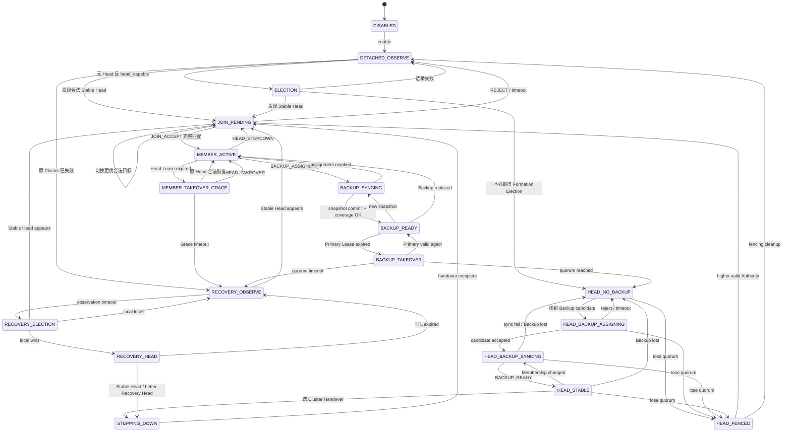
```mermaid
stateDiagram-v2
    [*] --> DISABLED

    DISABLED --> DETACHED_OBSERVE: enable

    DETACHED_OBSERVE --> JOIN_PENDING: 发现合法 Stable Head
    DETACHED_OBSERVE --> ELECTION: 无 Head 且 head_capable
    DETACHED_OBSERVE --> RECOVERY_OBSERVE: 原 Cluster 已失效

    ELECTION --> JOIN_PENDING: 发现 Stable Head
    ELECTION --> HEAD_NO_BACKUP: 本机赢得 Formation Election
    ELECTION --> DETACHED_OBSERVE: 选举失败

    JOIN_PENDING --> MEMBER_ACTIVE: JOIN_ACCEPT 完整匹配
    JOIN_PENDING --> DETACHED_OBSERVE: REJECT / timeout
    JOIN_PENDING --> JOIN_PENDING: 切换更优合法目标

    MEMBER_ACTIVE --> BACKUP_SYNCING: BACKUP_ASSIGN(self)
    MEMBER_ACTIVE --> JOIN_PENDING: HEAD_STEPDOWN
    MEMBER_ACTIVE --> MEMBER_TAKEOVER_GRACE: Head Lease expired

    MEMBER_TAKEOVER_GRACE --> MEMBER_ACTIVE: 原 Head 合法恢复
    MEMBER_TAKEOVER_GRACE --> MEMBER_ACTIVE: HEAD_TAKEOVER
    MEMBER_TAKEOVER_GRACE --> RECOVERY_OBSERVE: Grace timeout

    HEAD_NO_BACKUP --> HEAD_BACKUP_ASSIGNING: 找到 Backup candidate
    HEAD_BACKUP_ASSIGNING --> HEAD_BACKUP_SYNCING: candidate accepted
    HEAD_BACKUP_ASSIGNING --> HEAD_NO_BACKUP: reject / timeout
    HEAD_BACKUP_SYNCING --> HEAD_STABLE: BACKUP_READY
    HEAD_BACKUP_SYNCING --> HEAD_NO_BACKUP: sync fail / Backup lost

    HEAD_STABLE --> HEAD_BACKUP_SYNCING: Membership changed
    HEAD_STABLE --> HEAD_NO_BACKUP: Backup lost
    HEAD_STABLE --> STEPPING_DOWN: 跨 Cluster Handover

    HEAD_NO_BACKUP --> HEAD_FENCED: lose quorum
    HEAD_BACKUP_ASSIGNING --> HEAD_FENCED: lose quorum
    HEAD_BACKUP_SYNCING --> HEAD_FENCED: lose quorum
    HEAD_STABLE --> HEAD_FENCED: lose quorum

    HEAD_FENCED --> JOIN_PENDING: higher valid Authority
    HEAD_FENCED --> DETACHED_OBSERVE: fencing cleanup

    BACKUP_SYNCING --> BACKUP_READY: snapshot commit + coverage OK
    BACKUP_SYNCING --> MEMBER_ACTIVE: assignment revoked

    BACKUP_READY --> BACKUP_SYNCING: new snapshot
    BACKUP_READY --> BACKUP_TAKEOVER: Primary Lease expired
    BACKUP_READY --> MEMBER_ACTIVE: Backup replaced

    BACKUP_TAKEOVER --> HEAD_NO_BACKUP: quorum reached
    BACKUP_TAKEOVER --> BACKUP_READY: Primary valid again
    BACKUP_TAKEOVER --> RECOVERY_OBSERVE: quorum timeout

    STEPPING_DOWN --> JOIN_PENDING: handover complete

    RECOVERY_OBSERVE --> JOIN_PENDING: Stable Head appears
    RECOVERY_OBSERVE --> RECOVERY_ELECTION: observation timeout

    RECOVERY_ELECTION --> JOIN_PENDING: Stable Head appears
    RECOVERY_ELECTION --> RECOVERY_HEAD: local wins
    RECOVERY_ELECTION --> RECOVERY_OBSERVE: local loses

    RECOVERY_HEAD --> STEPPING_DOWN: Stable Head / better Recovery Head
    RECOVERY_HEAD --> RECOVERY_OBSERVE: TTL expired
```

---

## 5. Event Driven 架构

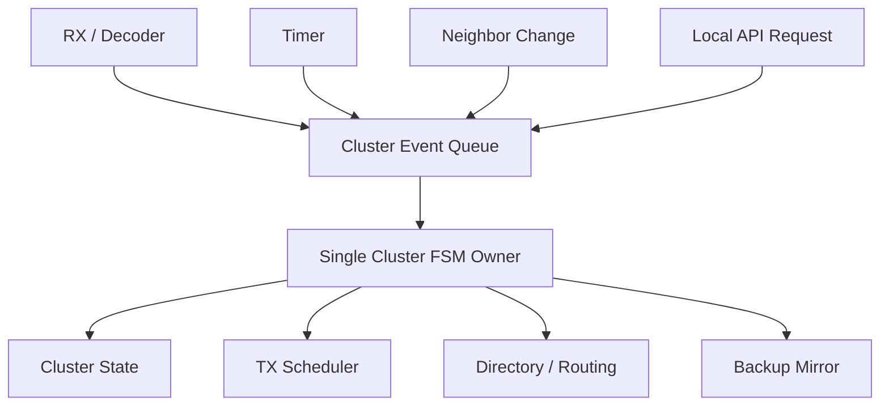
```mermaid
flowchart TD
    RX[RX / Decoder] --> EQ[Cluster Event Queue]
    TM[Timer] --> EQ
    NB[Neighbor Change] --> EQ
    API[Local API Request] --> EQ

    EQ --> FSM[Single Cluster FSM Owner]

    FSM --> STATE[Cluster State]
    FSM --> TX[TX Scheduler]
    FSM --> DIR[Directory / Routing]
    FSM --> MIRROR[Backup Mirror]
```

事件固定优先级：

```text
1. Security / Parser / Replay Reject
2. Higher Term / Higher Authority
3. 当前 Primary / Head 合法保活
4. Takeover / Stepdown / Handover
5. Lease timeout
6. Election timeout
7. Backup Snapshot
8. Score Optimization
9. 普通广播
```

必须：

```text
先 RX，后 Timer。
```

---

# 6. Detached / Election

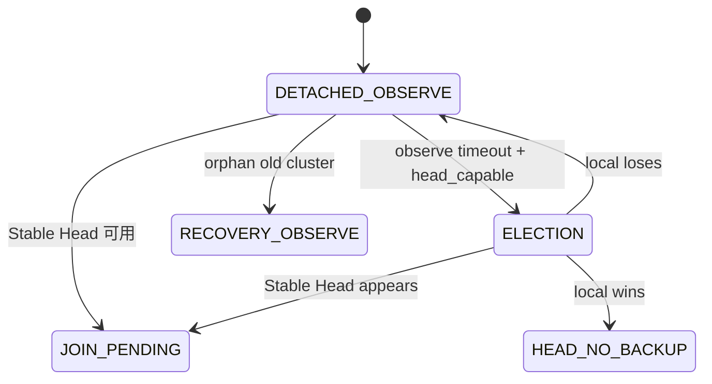
```mermaid
stateDiagram-v2
    [*] --> DETACHED_OBSERVE
    DETACHED_OBSERVE --> JOIN_PENDING: Stable Head 可用
    DETACHED_OBSERVE --> ELECTION: observe timeout + head_capable
    DETACHED_OBSERVE --> RECOVERY_OBSERVE: orphan old cluster

    ELECTION --> JOIN_PENDING: Stable Head appears
    ELECTION --> HEAD_NO_BACKUP: local wins
    ELECTION --> DETACHED_OBSERVE: local loses
```

Candidate 排序固定为：

```text
CandidateRank = (
    head_score DESC,
    node_id ASC
)
```

不建议把 RSSI、随机数、动态 capacity 放进最终 tie-break。

### 6.1 Detached 伪代码

```c
void detached_step(cluster_t *c, uint64_t now)
{
    head_offer_t *head = find_best_valid_stable_head(c);

    if (head != NULL) {
        begin_join(c, head);
        return;
    }

    if (now < c->observe_deadline)
        return;

    if (c->orphan_from_old_cluster) {
        enter_recovery_observe(c);
        return;
    }

    if (!c->head_capable) {
        restart_observation(c);
        return;
    }

    enter_election(c);
}
```

### 6.2 Election 伪代码

```c
void election_step(cluster_t *c, uint64_t now)
{
    head_offer_t *head = find_best_valid_stable_head(c);

    if (head != NULL) {
        begin_join(c, head);
        return;
    }

    if (now < c->election_deadline) {
        send_candidate_advertise(c);
        return;
    }

    candidate_t best = local_candidate(c);

    for_each_live_candidate(c, cand) {
        if (candidate_rank(cand) > candidate_rank(best))
            best = *cand;
    }

    if (best.node_id == c->node_id)
        become_new_cluster_head(c);
    else
        enter_detached_observe(c);
}
```

---

# 7. Join

Join 必须增加：

```text
join_txid
```

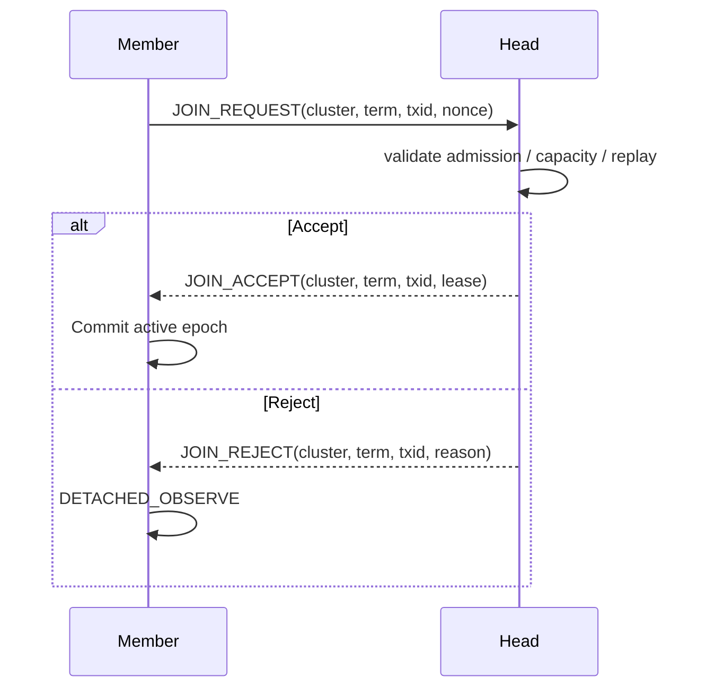
```mermaid
sequenceDiagram
    participant M as Member
    participant H as Head

    M->>H: JOIN_REQUEST(cluster, term, txid, nonce)
    H->>H: validate admission / capacity / replay
    alt Accept
        H-->>M: JOIN_ACCEPT(cluster, term, txid, lease)
        M->>M: Commit active epoch
    else Reject
        H-->>M: JOIN_REJECT(cluster, term, txid, reason)
        M->>M: DETACHED_OBSERVE
    end
```

### 7.1 Begin Join

```c
void begin_join(cluster_t *c, const head_offer_t *head)
{
    c->phase = CL_PHASE_JOIN_PENDING;

    c->pending.cluster_id = head->cluster_id;
    c->pending.term       = head->term;
    c->pending.head_id    = head->node_id;
    c->pending.join_txid  = next_local_nonce(c);

    send_join_request(c);
}
```

### 7.2 JOIN_ACCEPT

```c
void on_join_accept(cluster_t *c, const join_accept_t *msg)
{
    REQUIRE(c->phase == CL_PHASE_JOIN_PENDING);

    REQUIRE(msg->source     == c->pending.head_id);
    REQUIRE(msg->cluster_id == c->pending.cluster_id);
    REQUIRE(msg->term       == c->pending.term);
    REQUIRE(msg->join_txid  == c->pending.join_txid);

    c->active.cluster_id = msg->cluster_id;
    c->active.term       = msg->term;
    c->active.head_id    = msg->source;

    c->head_lease_deadline = now_ms() + msg->lease_ms;

    clear_pending_join(c);
    c->phase = CL_PHASE_MEMBER_ACTIVE;
}
```

---

# 8. Member

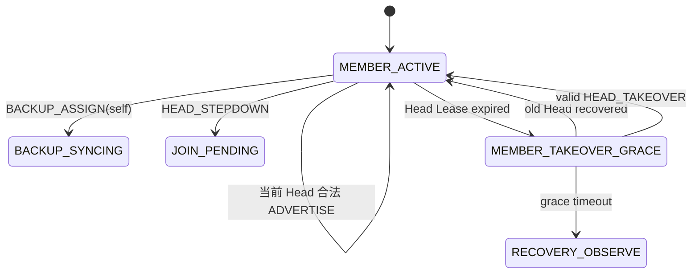
```mermaid
stateDiagram-v2
    [*] --> MEMBER_ACTIVE

    MEMBER_ACTIVE --> MEMBER_ACTIVE: 当前 Head 合法 ADVERTISE
    MEMBER_ACTIVE --> BACKUP_SYNCING: BACKUP_ASSIGN(self)
    MEMBER_ACTIVE --> JOIN_PENDING: HEAD_STEPDOWN
    MEMBER_ACTIVE --> MEMBER_TAKEOVER_GRACE: Head Lease expired

    MEMBER_TAKEOVER_GRACE --> MEMBER_ACTIVE: old Head recovered
    MEMBER_TAKEOVER_GRACE --> MEMBER_ACTIVE: valid HEAD_TAKEOVER
    MEMBER_TAKEOVER_GRACE --> RECOVERY_OBSERVE: grace timeout
```

Member 不应该因为看到另一个 score 更高的 Head 就自己 LEAVE。

正确规则：

```text
Member 只有在下面情况换 Head：

1. 当前 Head HEAD_STEPDOWN
2. 合法 Backup Takeover
3. 当前 Head Lease 真正到期
4. 当前 Cluster 被显式撤销
```

Cluster Merge 必须由：

```text
HEAD <-> HEAD
```

完成。

### 8.1 Head Advertise

```c
void on_head_advertise(cluster_t *c,
                       const head_advertise_t *msg)
{
    if (msg->cluster_id != c->active.cluster_id)
        return;

    if (msg->term != c->active.term)
        return;

    if (msg->source != c->active.head_id)
        return;

    c->head_lease_deadline = now_ms() + msg->lease_ms;

    if (c->phase == CL_PHASE_MEMBER_TAKEOVER_GRACE)
        c->phase = CL_PHASE_MEMBER_ACTIVE;
}
```

---

# 9. Member Takeover Grace

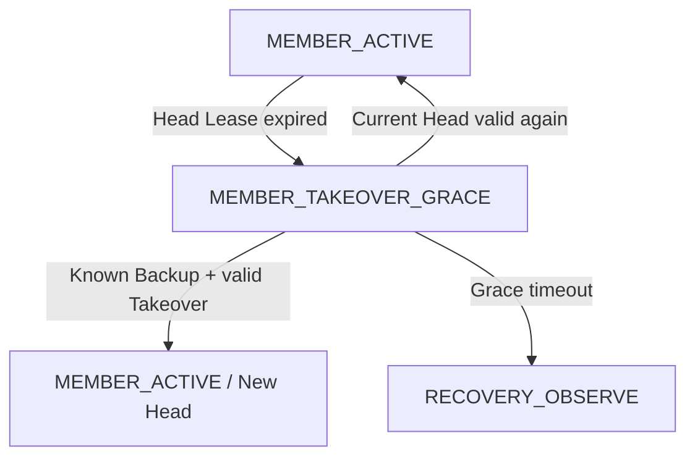
```mermaid
flowchart TD
    M[MEMBER_ACTIVE] -->|Head Lease expired| G[MEMBER_TAKEOVER_GRACE]
    G -->|Current Head valid again| M
    G -->|Known Backup + valid Takeover| NM[MEMBER_ACTIVE / New Head]
    G -->|Grace timeout| R[RECOVERY_OBSERVE]
```

不要：

```text
Head Lease expired
=> MEMBER -> DETACHED
```

应该给已知 Backup 一个确定的 takeover 窗口。

---

# 10. Head 状态机

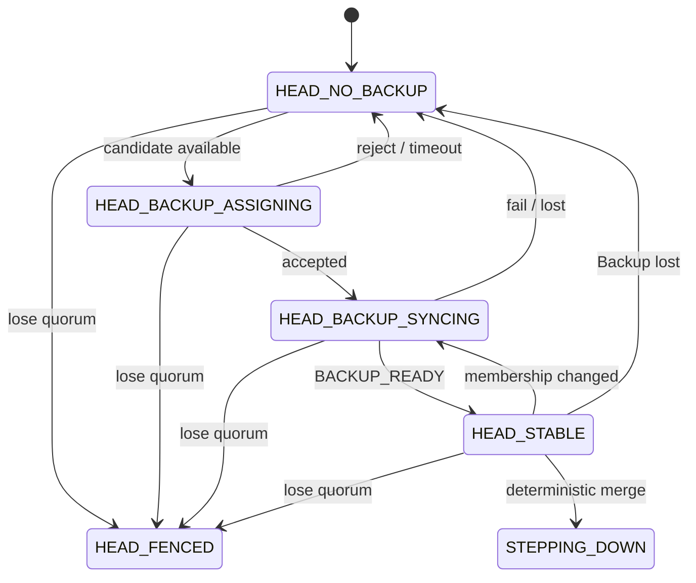
```mermaid
stateDiagram-v2
    [*] --> HEAD_NO_BACKUP

    HEAD_NO_BACKUP --> HEAD_BACKUP_ASSIGNING: candidate available
    HEAD_BACKUP_ASSIGNING --> HEAD_BACKUP_SYNCING: accepted
    HEAD_BACKUP_ASSIGNING --> HEAD_NO_BACKUP: reject / timeout

    HEAD_BACKUP_SYNCING --> HEAD_STABLE: BACKUP_READY
    HEAD_BACKUP_SYNCING --> HEAD_NO_BACKUP: fail / lost

    HEAD_STABLE --> HEAD_BACKUP_SYNCING: membership changed
    HEAD_STABLE --> HEAD_NO_BACKUP: Backup lost

    HEAD_NO_BACKUP --> HEAD_FENCED: lose quorum
    HEAD_BACKUP_ASSIGNING --> HEAD_FENCED: lose quorum
    HEAD_BACKUP_SYNCING --> HEAD_FENCED: lose quorum
    HEAD_STABLE --> HEAD_FENCED: lose quorum

    HEAD_STABLE --> STEPPING_DOWN: deterministic merge
```

---

# 11. Head Majority Authority Lease

```c
bool head_has_quorum(cluster_t *c, uint64_t now)
{
    uint32_t votes = 1; // Head self vote

    for_each_committed_voter(c, voter) {
        if (voter->node_id == c->node_id)
            continue;

        if (voter->last_keepalive_ms +
            c->cfg.authority_lease_ms >= now) {
            votes++;
        }
    }

    return votes >= quorum_size(c->committed_voters.count);
}
```

```c
void head_common_step(cluster_t *c, uint64_t now)
{
    if (head_has_quorum(c, now)) {
        c->quorum_loss_started = false;
        return;
    }

    if (!c->quorum_loss_started) {
        c->quorum_loss_started = true;
        c->quorum_loss_deadline =
            now + c->cfg.authority_grace_ms;
        return;
    }

    if (now >= c->quorum_loss_deadline)
        enter_head_fenced(c);
}
```

```c
void enter_head_fenced(cluster_t *c)
{
    c->phase = CL_PHASE_HEAD_FENCED;
    c->authority_active = false;

    directory_disable_owner_write();
    cluster_disable_join_admission(c);
    cluster_freeze_membership_commit(c);
    cluster_freeze_backup_generation(c);
}
```

---

# 12. Backup Candidate 选择

合法 Backup：

```text
Member
head_capable
Neighbor == ADMITTED
not cooldown
not blacklist
```

排序：

```text
BackupRank = (
    head_score DESC,
    node_id ASC
)
```

```c
node_id_t select_backup(cluster_t *c)
{
    member_t *best = NULL;

    for_each_runtime_member(c, m) {
        if (!m->head_capable)
            continue;

        if (m->neighbor_state != UCN_NEIGHBOR_ADMITTED)
            continue;

        if (backup_cooldown_active(m))
            continue;

        if (best == NULL ||
            m->head_score > best->head_score ||
            (m->head_score == best->head_score &&
             m->node_id < best->node_id)) {
            best = m;
        }
    }

    return best ? best->node_id : 0;
}
```

Backup 掉线后：

```text
invalidate Backup
-> HEAD_NO_BACKUP
-> 立即重新 select_backup()
```

不能等下一次 JOIN。

---

# 13. Backup Epoch

所有 Backup 控制面统一绑定：

```text
BackupEpoch = {
    cluster_id,
    term,
    head_id,
    backup_node_id,
    backup_generation
}
```

每换 Backup：

```text
backup_generation++
```

禁止 generation 复用。

---

# 14. Backup Assignment

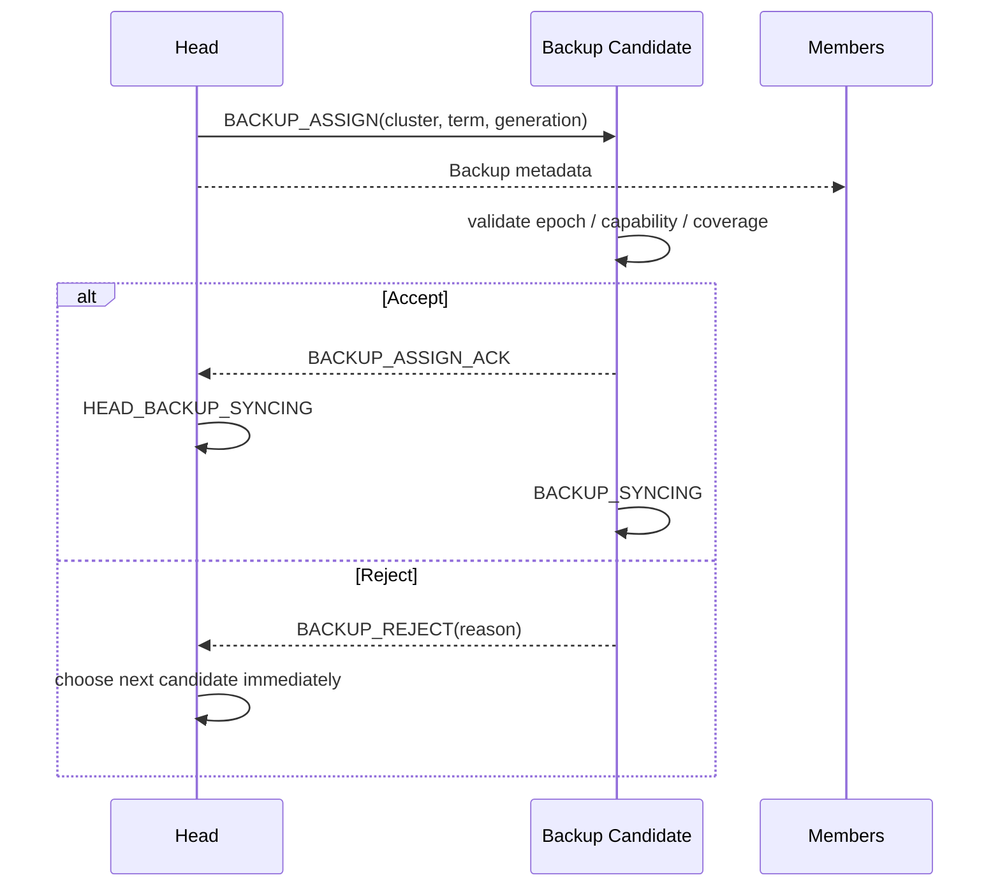
```mermaid
sequenceDiagram
    participant H as Head
    participant B as Backup Candidate
    participant M as Members

    H->>B: BACKUP_ASSIGN(cluster, term, generation)
    H-->>M: Backup metadata
    B->>B: validate epoch / capability / coverage
    alt Accept
        B-->>H: BACKUP_ASSIGN_ACK
        H->>H: HEAD_BACKUP_SYNCING
        B->>B: BACKUP_SYNCING
    else Reject
        B-->>H: BACKUP_REJECT(reason)
        H->>H: choose next candidate immediately
    end
```

---

# 15. Snapshot Epoch

Snapshot 再增加：

```text
snapshot_id
```

完整：

```text
SnapshotEpoch = {
    cluster_id,
    term,
    backup_generation,
    snapshot_id
}
```

消息建议：

```text
SYNC_BEGIN:
    cluster_id
    term
    backup_generation
    snapshot_id

SYNC_MEMBER:
    cluster_id
    term
    backup_generation
    snapshot_id
    membership_sequence_u32
    member_id
    member_nonce_u32
    member_lease
    flags

SYNC_END:
    cluster_id
    term
    backup_generation
    snapshot_id
    final_sequence_u32
    member_count
    snapshot_hash
```

注意：

```text
member_nonce 必须 32 bit
membership_sequence 建议 32 bit
```

---

# 16. Backup 双缓冲 Snapshot

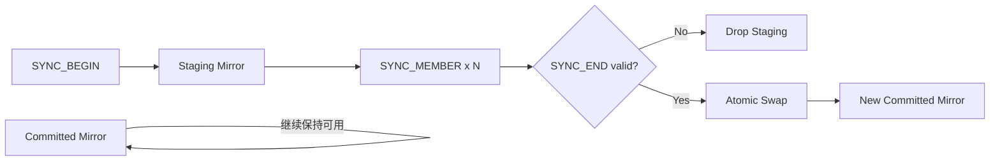
```mermaid
flowchart LR
    A[Committed Mirror] -->|继续保持可用| A
    B[SYNC_BEGIN] --> C[Staging Mirror]
    C --> D[SYNC_MEMBER x N]
    D --> E{SYNC_END valid?}
    E -->|No| X[Drop Staging]
    E -->|Yes| F[Atomic Swap]
    F --> G[New Committed Mirror]
```

SYNC_BEGIN 不能直接清空当前 committed mirror。

### 16.1 SYNC_BEGIN

```c
void on_sync_begin(cluster_t *c,
                   const backup_sync_begin_t *msg)
{
    REQUIRE(exact_backup_epoch(c, msg));

    if (msg->snapshot_id <= c->backup.last_committed_snapshot_id)
        return reject_replay(msg);

    clear_member_table(&c->backup.staging_members);

    c->backup.staging_snapshot_id = msg->snapshot_id;
    c->backup.expected_sequence = 1;
    c->phase = CL_PHASE_BACKUP_SYNCING;
}
```

### 16.2 SYNC_MEMBER

```c
void on_sync_member(cluster_t *c,
                    const backup_sync_member_t *msg)
{
    REQUIRE(c->phase == CL_PHASE_BACKUP_SYNCING);
    REQUIRE(exact_backup_epoch(c, msg));
    REQUIRE(msg->snapshot_id == c->backup.staging_snapshot_id);
    REQUIRE(msg->membership_sequence == c->backup.expected_sequence);

    staging_add_member(
        c,
        msg->member_id,
        msg->member_nonce,
        msg->lease_ms,
        msg->flags);

    c->backup.expected_sequence++;
}
```

### 16.3 SYNC_END

```c
void on_sync_end(cluster_t *c,
                 const backup_sync_end_t *msg)
{
    REQUIRE(c->phase == CL_PHASE_BACKUP_SYNCING);
    REQUIRE(exact_backup_epoch(c, msg));
    REQUIRE(msg->snapshot_id == c->backup.staging_snapshot_id);
    REQUIRE(msg->final_sequence == c->backup.expected_sequence);
    REQUIRE(msg->member_count == c->backup.staging_members.count);
    REQUIRE(snapshot_hash(c->backup.staging_members) == msg->snapshot_hash);
    REQUIRE(backup_has_admitted_coverage(c, &c->backup.staging_members));

    atomic_swap(
        &c->backup.committed_members,
        &c->backup.staging_members);

    c->backup.last_committed_snapshot_id = msg->snapshot_id;
    c->backup.last_committed_membership_sequence = msg->final_sequence;

    c->phase = CL_PHASE_BACKUP_READY;

    send_backup_ready(c);
}
```

---

# 17. BACKUP_READY

Head 必须验证：

```text
source
cluster_id
term
backup_generation
snapshot_id
membership_sequence
```

全部一致。

```c
void on_backup_ready(cluster_t *c,
                     const backup_ready_t *msg)
{
    REQUIRE(c->phase == CL_PHASE_HEAD_BACKUP_SYNCING);
    REQUIRE(msg->source == c->backup.node_id);
    REQUIRE(msg->cluster_id == c->active.cluster_id);
    REQUIRE(msg->term == c->active.term);
    REQUIRE(msg->backup_generation == c->backup.generation);
    REQUIRE(msg->snapshot_id == c->backup.current_snapshot_id);
    REQUIRE(msg->membership_sequence == c->membership_sequence);

    commit_current_voter_set(c);
    c->phase = CL_PHASE_HEAD_STABLE;
}
```

---

# 18. Primary Heartbeat

必须包含：

```text
cluster_id
term
head_id
backup_generation
snapshot_id
membership_sequence
nonce
```

Backup 只接受完整匹配当前 Backup Epoch 的 Heartbeat。

---

# 19. Backup Takeover

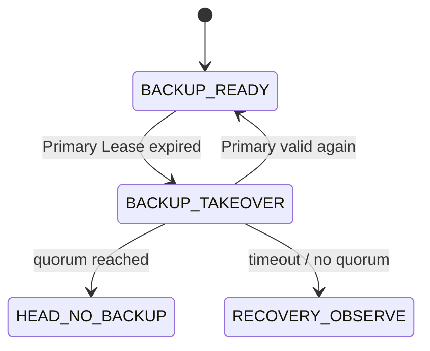
```mermaid
stateDiagram-v2
    [*] --> BACKUP_READY
    BACKUP_READY --> BACKUP_TAKEOVER: Primary Lease expired
    BACKUP_TAKEOVER --> BACKUP_READY: Primary valid again
    BACKUP_TAKEOVER --> HEAD_NO_BACKUP: quorum reached
    BACKUP_TAKEOVER --> RECOVERY_OBSERVE: timeout / no quorum
```

Member 投票身份必须是：

```text
TakeoverVoteId = {
    cluster_id,
    old_term,
    proposed_term,
    backup_generation,
    snapshot_id
}
```

不能只保存 `member_voted_term`。

---

# 20. Takeover 时序

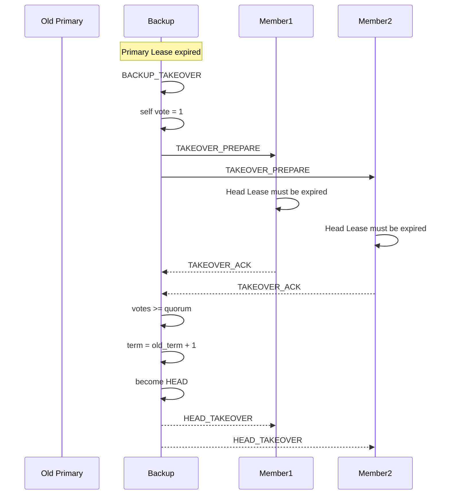
```mermaid
sequenceDiagram
    participant P as Old Primary
    participant B as Backup
    participant M1 as Member1
    participant M2 as Member2

    Note over B: Primary Lease expired
    B->>B: BACKUP_TAKEOVER
    B->>B: self vote = 1

    B->>M1: TAKEOVER_PREPARE
    B->>M2: TAKEOVER_PREPARE

    M1->>M1: Head Lease must be expired
    M2->>M2: Head Lease must be expired

    M1-->>B: TAKEOVER_ACK
    M2-->>B: TAKEOVER_ACK

    B->>B: votes >= quorum
    B->>B: term = old_term + 1
    B->>B: become HEAD

    B-->>M1: HEAD_TAKEOVER
    B-->>M2: HEAD_TAKEOVER
```

### 20.1 Start Takeover

```c
void start_takeover(cluster_t *c)
{
    REQUIRE(c->phase == CL_PHASE_BACKUP_READY);
    REQUIRE(primary_lease_expired(c));
    REQUIRE(c->backup.committed_snapshot_valid);
    REQUIRE(c->active.term != UINT32_MAX);

    c->phase = CL_PHASE_BACKUP_TAKEOVER;

    c->takeover.old_term = c->active.term;
    c->takeover.proposed_term = c->active.term + 1;
    c->takeover.id = make_takeover_id(c);

    clear_vote_bitmap(c);
    add_vote(c, c->node_id); // self vote

    broadcast_takeover_prepare(c);

    c->takeover.deadline =
        now_ms() + c->cfg.takeover_window_ms;
}
```

### 20.2 Member TAKEOVER_PREPARE

```c
void on_takeover_prepare(cluster_t *c,
                         const takeover_prepare_t *msg)
{
    REQUIRE(c->phase == CL_PHASE_MEMBER_TAKEOVER_GRACE);
    REQUIRE(msg->cluster_id == c->active.cluster_id);
    REQUIRE(msg->old_term == c->active.term);
    REQUIRE(msg->source == c->known_backup.node_id);
    REQUIRE(msg->backup_generation == c->known_backup.generation);
    REQUIRE(msg->proposed_term == c->active.term + 1);
    REQUIRE(now_ms() >= c->head_lease_deadline);

    takeover_vote_id_t id = takeover_vote_id_from(msg);

    if (vote_record_equals(&c->last_vote, &id)) {
        resend_takeover_ack(c, msg);
        return;
    }

    if (already_voted_conflicting_candidate(c, msg->proposed_term))
        return reject_vote(msg);

    persist_takeover_vote(c, &id);
    send_takeover_ack(c, msg);
}
```

### 20.3 Backup 收集 ACK

```c
void on_takeover_ack(cluster_t *c,
                     const takeover_ack_t *msg)
{
    REQUIRE(c->phase == CL_PHASE_BACKUP_TAKEOVER);
    REQUIRE(exact_takeover_id(c, msg));
    REQUIRE(committed_voter_contains(c, msg->source));

    if (vote_already_recorded(c, msg->source))
        return;

    add_vote(c, msg->source);

    if (c->takeover.vote_count >=
        quorum_size(c->committed_voters.count)) {
        commit_takeover(c);
    }
}
```

---

# 21. 网络分区安全性

假设：

```text
H1 + B1 + M1 + M2 + M3
N = 5
QUORUM = 3
```

分区：

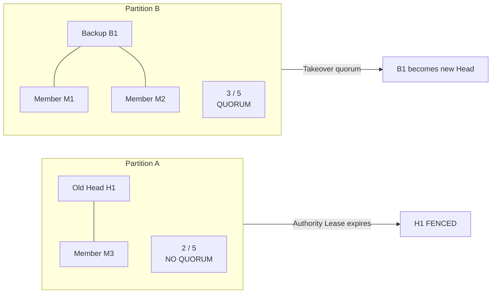
```mermaid
flowchart LR
    subgraph A[Partition A]
        H1[Old Head H1]
        M3[Member M3]
        H1 --- M3
        ACOUNT["2 / 5<br/>NO QUORUM"]
    end

    subgraph B[Partition B]
        B1[Backup B1]
        M1[Member M1]
        M2[Member M2]
        B1 --- M1
        B1 --- M2
        BCOUNT["3 / 5<br/>QUORUM"]
    end

    A -->|Authority Lease expires| F[H1 FENCED]
    B -->|Takeover quorum| NH[B1 becomes new Head]
```

结果：

```text
旧 Head 无多数派 => FENCE
Backup 一侧有多数派 => takeover
```

不会出现两个可写 Authority。

---

# 22. 两节点 Cluster

```text
Head + Backup
N = 2
QUORUM = 2
```

Head 挂掉后：

```text
Backup = 1 / 2
```

不能安全接管。

若业务要求“两业务节点任意一台故障仍自动切换”，需要：

```text
Head + Backup + Witness
N = 3
QUORUM = 2
```

---

# 23. 原 Primary 恢复

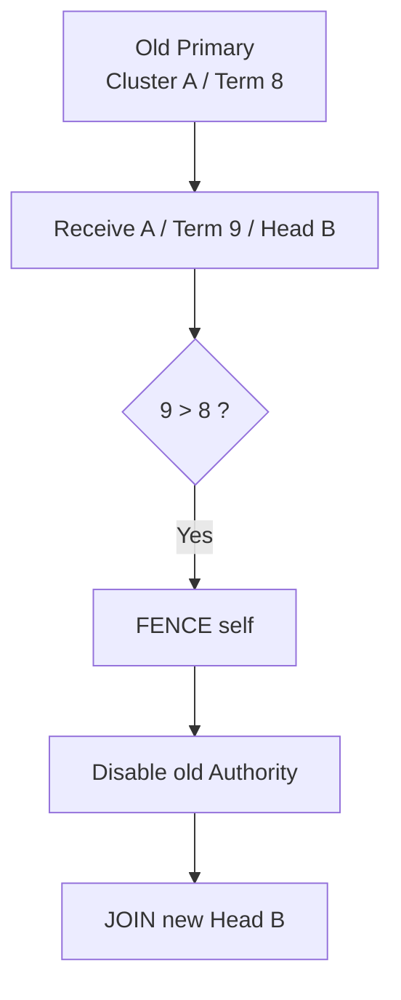
```mermaid
flowchart TD
    P[Old Primary<br/>Cluster A / Term 8] --> R[Receive A / Term 9 / Head B]
    R --> C{9 > 8 ?}
    C -->|Yes| F[FENCE self]
    F --> D[Disable old Authority]
    D --> J[JOIN new Head B]
```

旧 Primary 不允许因为自身 score 更高重新抢 Head。

---

# 24. 跨 Cluster Merge

不同 `cluster_id` 的 Term 不直接比较。

跨 Cluster 使用：

```text
MergeRank = (
    head_score DESC,
    node_id ASC
)
```

容量只作为：

```text
能否完整承接对方 Cluster 的前置条件
```

不能让 `available_capacity == 0` 阻断 Authority 信息传播和冲突发现。

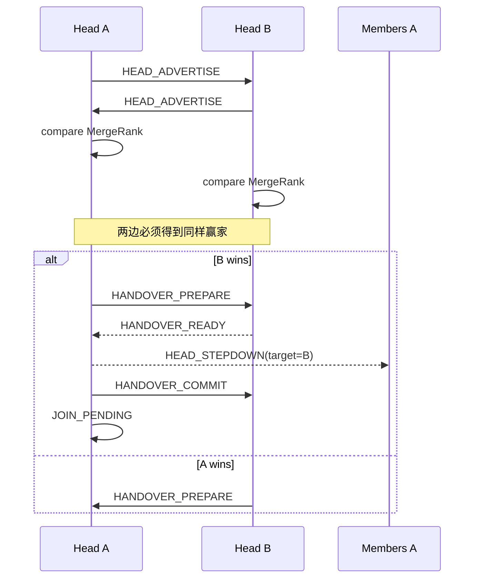
```mermaid
sequenceDiagram
    participant HA as Head A
    participant HB as Head B
    participant MA as Members A

    HA->>HB: HEAD_ADVERTISE
    HB->>HA: HEAD_ADVERTISE

    HA->>HA: compare MergeRank
    HB->>HB: compare MergeRank

    Note over HA,HB: 两边必须得到同样赢家

    alt B wins
        HA->>HB: HANDOVER_PREPARE
        HB-->>HA: HANDOVER_READY
        HA-->>MA: HEAD_STEPDOWN(target=B)
        HA->>HB: HANDOVER_COMMIT
        HA->>HA: JOIN_PENDING
    else A wins
        HB->>HA: HANDOVER_PREPARE
    end
```

---

# 25. HEAD_STEPDOWN

消息建议：

```text
old_cluster_id
old_term
old_head_id

target_cluster_id
target_term
target_head_id

stepdown_nonce
```

Member 和 Backup 都必须处理。

```c
void on_head_stepdown(cluster_t *c,
                      const head_stepdown_t *msg)
{
    REQUIRE(msg->source == c->active.head_id);
    REQUIRE(msg->old_cluster_id == c->active.cluster_id);
    REQUIRE(msg->old_term == c->active.term);
    REQUIRE(msg->stepdown_nonce > c->last_stepdown_nonce);

    c->last_stepdown_nonce = msg->stepdown_nonce;

    set_pending_target(
        c,
        msg->target_cluster_id,
        msg->target_term,
        msg->target_head_id);

    c->phase = CL_PHASE_JOIN_PENDING;
}
```

---

# 26. Recovery

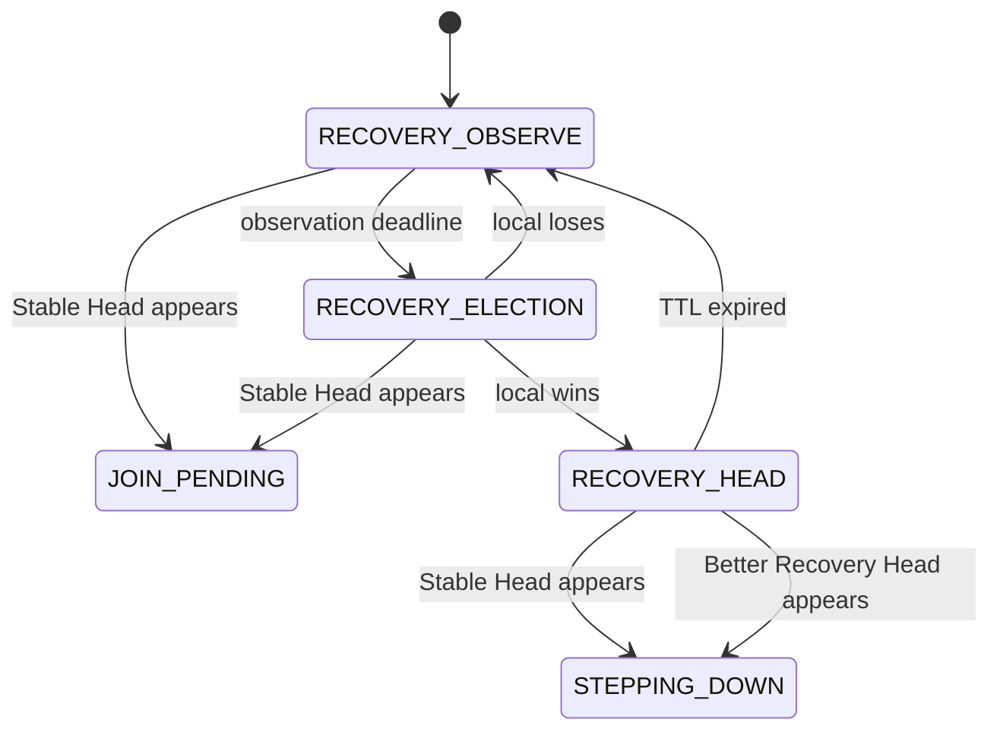
```mermaid
stateDiagram-v2
    [*] --> RECOVERY_OBSERVE

    RECOVERY_OBSERVE --> JOIN_PENDING: Stable Head appears
    RECOVERY_OBSERVE --> RECOVERY_ELECTION: observation deadline

    RECOVERY_ELECTION --> JOIN_PENDING: Stable Head appears
    RECOVERY_ELECTION --> RECOVERY_HEAD: local wins
    RECOVERY_ELECTION --> RECOVERY_OBSERVE: local loses

    RECOVERY_HEAD --> STEPPING_DOWN: Stable Head appears
    RECOVERY_HEAD --> STEPPING_DOWN: Better Recovery Head appears
    RECOVERY_HEAD --> RECOVERY_OBSERVE: TTL expired
```

进入 Recovery：

```text
Member:
    Head Lease expired
    -> TAKEOVER_GRACE
    -> no valid takeover
    -> RECOVERY_OBSERVE

Backup:
    Primary Lease expired
    -> BACKUP_TAKEOVER
    -> quorum impossible/timeout
    -> RECOVERY_OBSERVE
```

Backup 未 READY 时 Primary 丢失：

```text
不能 takeover old cluster
-> RECOVERY_OBSERVE
```

Recovery 排序：

```text
RecoveryRank = (
    head_score DESC,
    node_id ASC
)
```

Recovery Head 必须：

```text
new recovery_cluster_id != parent_cluster_id
```

### 26.1 Recovery Election

```c
void recovery_election_step(cluster_t *c, uint64_t now)
{
    head_offer_t *stable = find_best_valid_stable_head(c);

    if (stable != NULL) {
        begin_join(c, stable);
        return;
    }

    recovery_candidate_t best = local_recovery_candidate(c);

    for_each_recovery_candidate(c, cand) {
        if (recovery_rank(cand) > recovery_rank(best))
            best = *cand;
    }

    if (best.node_id != c->node_id) {
        enter_recovery_observe(c);
        return;
    }

    c->recovery.parent_cluster_id = c->last_cluster_id;
    c->recovery.parent_term = c->max_seen_term;

    c->active.cluster_id = make_recovery_cluster_id(c);
    c->active.term = 1;
    c->active.head_id = c->node_id;

    c->phase = CL_PHASE_RECOVERY_HEAD;
}
```

---

# 27. Recovery Island 合并

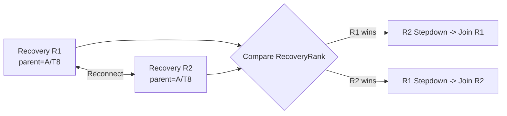
```mermaid
flowchart LR
    R1[Recovery R1<br/>parent=A/T8] <-->|Reconnect| R2[Recovery R2<br/>parent=A/T8]
    R1 --> C{Compare RecoveryRank}
    R2 --> C
    C -->|R1 wins| S2[R2 Stepdown -> Join R1]
    C -->|R2 wins| S1[R1 Stepdown -> Join R2]
```

Authority 等级固定：

```text
Stable Head > Recovery Head > Candidate > Detached
```

Recovery Head 遇到合法 Stable Head 必须让位。

---

# 28. Committed Membership

建议维护：

```text
RuntimeMembers
CommittedVoterSet
```

新 Member：

```text
JOIN_ACCEPT
-> RuntimeMembers += M
-> Backup Snapshot
-> BACKUP_READY
-> CommittedVoterSet += M
```

Head Authority Quorum 与 Backup Takeover Quorum 都只使用：

```text
CommittedVoterSet
```

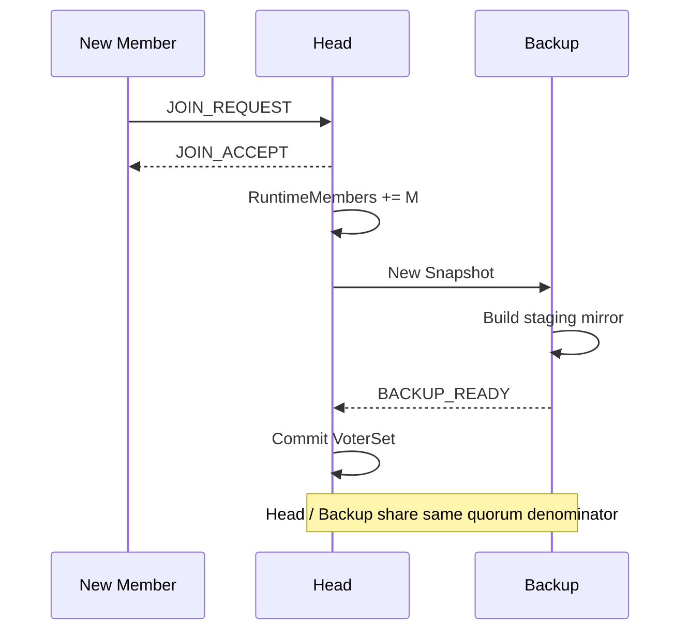
```mermaid
sequenceDiagram
    participant M as New Member
    participant H as Head
    participant B as Backup

    M->>H: JOIN_REQUEST
    H-->>M: JOIN_ACCEPT
    H->>H: RuntimeMembers += M

    H->>B: New Snapshot
    B->>B: Build staging mirror
    B-->>H: BACKUP_READY

    H->>H: Commit VoterSet
    Note over H,B: Head / Backup share same quorum denominator
```

---

# 29. LEAVE Replay Protection

```c
void on_member_leave(cluster_t *c,
                     const leave_t *msg)
{
    REQUIRE(is_head_phase(c->phase));

    member_t *m = find_member(c, msg->source);
    REQUIRE(m != NULL);

    REQUIRE(msg->cluster_id == c->active.cluster_id);
    REQUIRE(msg->term == c->active.term);

    if (msg->nonce <= m->last_nonce)
        return reject_replay(msg);

    m->last_nonce = msg->nonce;

    bool was_backup =
        (m->node_id == c->backup.node_id);

    remove_runtime_member(c, m);
    trigger_membership_commit(c);

    if (was_backup) {
        invalidate_backup(c);
        try_assign_backup_immediately(c);
    } else {
        trigger_backup_resync(c);
    }
}
```

---

# 30. RX 统一预检查

```c
rx_result_t validate_cluster_rx(cluster_t *c,
                                const cluster_msg_t *msg)
{
    if (msg->source == c->node_id)
        return RX_REJECT_SELF;

    if (!neighbor_is_admitted(msg->source))
        return RX_REJECT_NEIGHBOR;

    if (security_required(c) && !msg->protected_control)
        return RX_REJECT_SECURITY;

    if (!legal_type_role(msg->type, msg->role))
        return RX_REJECT_MALFORMED;

    if (!reserved_bits_zero(msg))
        return RX_REJECT_MALFORMED;

    if (!legal_flags_for_type(msg))
        return RX_REJECT_MALFORMED;

    if (global_replay_detected(c, msg))
        return RX_REJECT_REPLAY;

    return RX_OK;
}
```

然后才：

```text
dispatch_by_phase()
```

---

# 31. Neighbor Snapshot 必须原子提交

错误做法：

```text
clear peers
-> copy...
-> capacity overflow
-> return error
```

正确：

```c
int sync_neighbors(cluster_t *c,
                   const neighbor_table_t *src)
{
    peer_table_t tmp = {0};

    for_each_neighbor(src, n) {
        if (!neighbor_eligible_for_cluster(n))
            continue;

        if (tmp.count >= UCN_CLUSTER_MAX_PEERS)
            return UCN_ERR_NO_SPACE;

        tmp.peers[tmp.count++] = convert_neighbor(n);
    }

    c->peers = tmp;
    return UCN_OK;
}
```

---

# 32. Backup Coverage

Backup READY 要求所有目标成员都是：

```text
ADMITTED
```

不能把：

```text
SUSPECT
```

算作覆盖成功。

```c
bool backup_has_admitted_coverage(cluster_t *c,
                                  member_table_t *members)
{
    for_each_member(members, m) {
        peer_t *p = find_peer(c, m->node_id);

        if (p == NULL)
            return false;

        if (p->neighbor_state != UCN_NEIGHBOR_ADMITTED)
            return false;
    }

    return true;
}
```

---

# 33. Cluster Poll 主循环

```c
void ucn_cluster_poll(cluster_t *c)
{
    uint64_t now = now_ms();

    // 1. RX/Event first
    while (!event_queue_empty(&c->events)) {

        cluster_event_t e =
            event_queue_pop(&c->events);

        if (e.type == EVENT_RX) {
            if (validate_cluster_rx(c, &e.rx.msg) != RX_OK)
                continue;

            if (contains_higher_authority(c, &e.rx.msg)) {
                process_higher_authority(c, &e.rx.msg);
                continue;
            }
        }

        dispatch_cluster_event(c, &e);
    }

    // 2. Neighbor snapshot atomic commit
    apply_pending_neighbor_snapshot(c);

    // 3. Timers / current phase
    switch (c->phase) {

    case CL_PHASE_DISABLED:
        break;

    case CL_PHASE_DETACHED_OBSERVE:
        detached_step(c, now);
        break;

    case CL_PHASE_ELECTION:
        election_step(c, now);
        break;

    case CL_PHASE_JOIN_PENDING:
        join_pending_step(c, now);
        break;

    case CL_PHASE_MEMBER_ACTIVE:
        member_active_step(c, now);
        break;

    case CL_PHASE_MEMBER_TAKEOVER_GRACE:
        member_takeover_grace_step(c, now);
        break;

    case CL_PHASE_HEAD_NO_BACKUP:
        head_common_step(c, now);
        head_no_backup_step(c, now);
        break;

    case CL_PHASE_HEAD_BACKUP_ASSIGNING:
        head_common_step(c, now);
        head_backup_assigning_step(c, now);
        break;

    case CL_PHASE_HEAD_BACKUP_SYNCING:
        head_common_step(c, now);
        head_backup_syncing_step(c, now);
        break;

    case CL_PHASE_HEAD_STABLE:
        head_common_step(c, now);
        head_stable_step(c, now);
        break;

    case CL_PHASE_HEAD_FENCED:
        head_fenced_step(c, now);
        break;

    case CL_PHASE_BACKUP_SYNCING:
        backup_syncing_step(c, now);
        break;

    case CL_PHASE_BACKUP_READY:
        backup_ready_step(c, now);
        break;

    case CL_PHASE_BACKUP_TAKEOVER:
        backup_takeover_step(c, now);
        break;

    case CL_PHASE_STEPPING_DOWN:
        stepping_down_step(c, now);
        break;

    case CL_PHASE_RECOVERY_OBSERVE:
        recovery_observe_step(c, now);
        break;

    case CL_PHASE_RECOVERY_ELECTION:
        recovery_election_step(c, now);
        break;

    case CL_PHASE_RECOVERY_HEAD:
        recovery_head_step(c, now);
        break;
    }

    // 4. Debug/Test invariant checks
    assert_cluster_invariants(c);
}
```

---

# 34. Invariants

```c
void assert_cluster_invariants(cluster_t *c)
{
    switch (c->phase) {

    case CL_PHASE_MEMBER_ACTIVE:
        ASSERT(c->active.cluster_id != 0);
        ASSERT(c->active.term != 0);
        ASSERT(c->active.head_id != 0);
        ASSERT(c->active.head_id != c->node_id);
        break;

    case CL_PHASE_HEAD_NO_BACKUP:
    case CL_PHASE_HEAD_BACKUP_ASSIGNING:
    case CL_PHASE_HEAD_BACKUP_SYNCING:
    case CL_PHASE_HEAD_STABLE:
    case CL_PHASE_HEAD_FENCED:
        ASSERT(c->active.cluster_id != 0);
        ASSERT(c->active.term != 0);
        ASSERT(c->active.head_id == c->node_id);
        break;

    case CL_PHASE_BACKUP_SYNCING:
    case CL_PHASE_BACKUP_READY:
    case CL_PHASE_BACKUP_TAKEOVER:
        ASSERT(c->active.cluster_id != 0);
        ASSERT(c->active.head_id != 0);
        ASSERT(c->active.head_id != c->node_id);
        ASSERT(c->backup.node_id == c->node_id);
        ASSERT(c->backup.generation != 0);
        break;

    case CL_PHASE_RECOVERY_HEAD:
        ASSERT(c->active.cluster_id !=
               c->recovery.parent_cluster_id);
        break;

    default:
        break;
    }

    if (c->authority_active) {
        ASSERT(is_head_phase(c->phase));
        ASSERT(head_has_quorum(c, now_ms()));
    }

    ASSERT(!(c->phase == CL_PHASE_BACKUP_TAKEOVER &&
             !primary_lease_expired(c)));
}
```

---

# 35. 推荐关键数据结构

```c
typedef struct
{
    uint64_t cluster_id;
    uint32_t term;
    uint64_t head_id;
} ucn_cluster_epoch_t;
```

```c
typedef struct
{
    uint64_t cluster_id;
    uint32_t old_term;
    uint32_t proposed_term;

    uint64_t backup_id;
    uint32_t backup_generation;

    uint32_t snapshot_id;
} ucn_takeover_vote_id_t;
```

```c
typedef struct
{
    uint64_t node_id;

    uint32_t head_score;
    uint64_t lease_deadline_ms;
    uint64_t last_keepalive_ms;

    uint32_t last_nonce;

    bool head_capable;
    bool voting;

    ucn_neighbor_state_t neighbor_state;
} ucn_cluster_member_t;
```

```c
typedef struct
{
    uint64_t node_id;
    uint32_t generation;

    uint32_t current_snapshot_id;
    uint32_t last_committed_snapshot_id;
    uint32_t last_committed_membership_sequence;

    uint64_t primary_lease_deadline;

    member_table_t committed_members;
    member_table_t staging_members;
} ucn_backup_state_t;
```

---

# 36. 防重放字段总表

| 流程 | 必须检查 |
|---|---|
| JOIN | `join_txid + nonce` |
| KEEPALIVE | `member_nonce` |
| LEAVE | `member_nonce` |
| HEAD_STEPDOWN | `stepdown_nonce` |
| Backup Assign | `backup_generation` |
| Snapshot | `generation + snapshot_id + sequence` |
| BACKUP_READY | `generation + snapshot_id + final_sequence` |
| Primary Heartbeat | `generation + snapshot_id + nonce` |
| Takeover | `generation + snapshot_id + proposed_term` |
| Recovery | `recovery_round + recovery_cluster_id + nonce` |

---

# 37. 定时器关系

建议至少保证：

```text
HEAD_ADVERTISE_INTERVAL < MEMBER_HEAD_LEASE

PRIMARY_HEARTBEAT_INTERVAL < BACKUP_PRIMARY_LEASE

MEMBER_KEEPALIVE_INTERVAL < HEAD_AUTHORITY_LEASE
```

通常：

```text
Lease >= 3 * heartbeat interval
```

示例：

```text
Head Advertise        = 500 ms
Member Head Lease     = 2000 ms

Primary Heartbeat     = 300 ms
Backup Primary Lease  = 1200 ms

Member Keepalive      = 500 ms
Head Authority Lease  = 2000 ms
```

---

# 38. Primary 故障完整流程

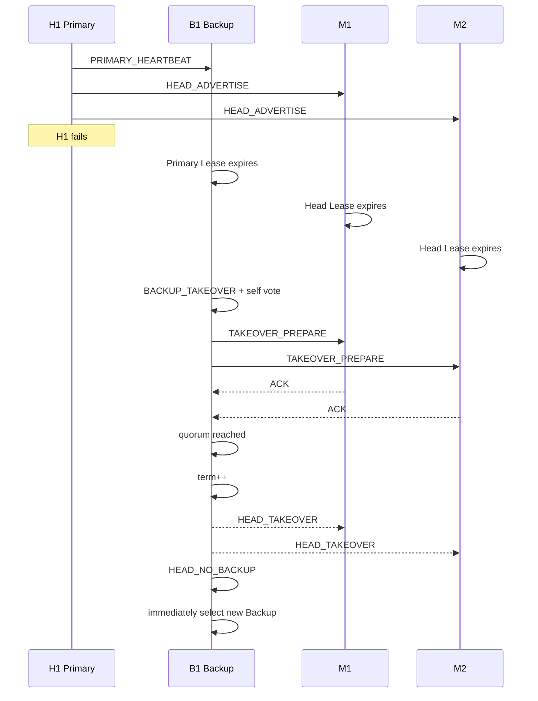
```mermaid
sequenceDiagram
    participant H as H1 Primary
    participant B as B1 Backup
    participant M1 as M1
    participant M2 as M2

    H->>B: PRIMARY_HEARTBEAT
    H->>M1: HEAD_ADVERTISE
    H->>M2: HEAD_ADVERTISE

    Note over H: H1 fails

    B->>B: Primary Lease expires
    M1->>M1: Head Lease expires
    M2->>M2: Head Lease expires

    B->>B: BACKUP_TAKEOVER + self vote

    B->>M1: TAKEOVER_PREPARE
    B->>M2: TAKEOVER_PREPARE

    M1-->>B: ACK
    M2-->>B: ACK

    B->>B: quorum reached
    B->>B: term++

    B-->>M1: HEAD_TAKEOVER
    B-->>M2: HEAD_TAKEOVER

    B->>B: HEAD_NO_BACKUP
    B->>B: immediately select new Backup
```

---

# 39. Backup 故障完整流程

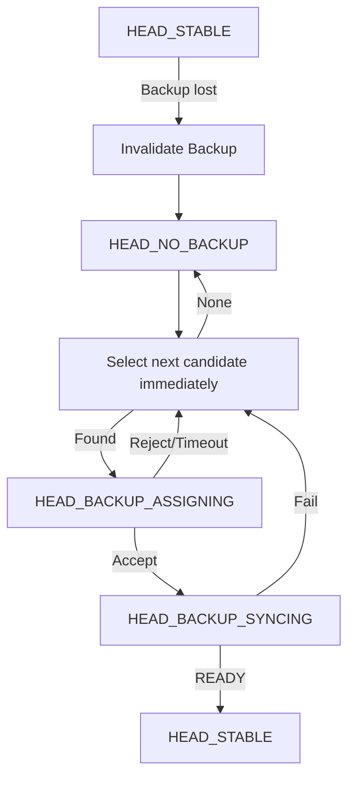
```mermaid
flowchart TD
    S[HEAD_STABLE] -->|Backup lost| I[Invalidate Backup]
    I --> N[HEAD_NO_BACKUP]
    N --> C[Select next candidate immediately]
    C -->|Found| A[HEAD_BACKUP_ASSIGNING]
    C -->|None| N
    A -->|Accept| SY[HEAD_BACKUP_SYNCING]
    A -->|Reject/Timeout| C
    SY -->|READY| ST[HEAD_STABLE]
    SY -->|Fail| C
```

---

# 40. Recovery 完整流程

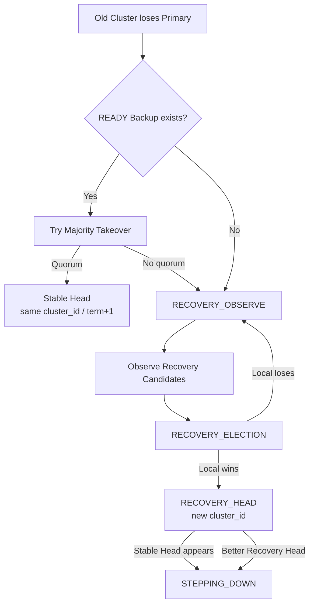
```mermaid
flowchart TD
    A[Old Cluster loses Primary] --> B{READY Backup exists?}

    B -->|Yes| T[Try Majority Takeover]
    T -->|Quorum| H[Stable Head<br/>same cluster_id / term+1]
    T -->|No quorum| R[RECOVERY_OBSERVE]

    B -->|No| R

    R --> O[Observe Recovery Candidates]
    O --> E[RECOVERY_ELECTION]
    E -->|Local loses| R
    E -->|Local wins| RH[RECOVERY_HEAD<br/>new cluster_id]

    RH -->|Stable Head appears| SD[STEPPING_DOWN]
    RH -->|Better Recovery Head| SD
```

---

# 41. 状态迁移总表

| 当前状态 | 事件 | 条件 | 动作 | 下一状态 |
|---|---|---|---|---|
| DISABLED | enable | - | init transient | DETACHED_OBSERVE |
| DETACHED_OBSERVE | Stable Head | valid | begin_join | JOIN_PENDING |
| DETACHED_OBSERVE | observe timeout | head_capable | start election | ELECTION |
| DETACHED_OBSERVE | orphan old cluster | allowed | recovery | RECOVERY_OBSERVE |
| ELECTION | Stable Head | valid | cancel election | JOIN_PENDING |
| ELECTION | deadline | local wins | create cluster | HEAD_NO_BACKUP |
| ELECTION | deadline | local loses | restart observe | DETACHED_OBSERVE |
| JOIN_PENDING | JOIN_ACCEPT | exact txid/epoch | commit | MEMBER_ACTIVE |
| JOIN_PENDING | JOIN_REJECT | exact txid | clear pending | DETACHED_OBSERVE |
| JOIN_PENDING | timeout | - | clear pending | DETACHED_OBSERVE |
| MEMBER_ACTIVE | BACKUP_ASSIGN | exact epoch/self | sync | BACKUP_SYNCING |
| MEMBER_ACTIVE | HEAD_STEPDOWN | exact | join target | JOIN_PENDING |
| MEMBER_ACTIVE | Head lease expired | - | grace | MEMBER_TAKEOVER_GRACE |
| MEMBER_TAKEOVER_GRACE | Head valid | exact epoch | refresh | MEMBER_ACTIVE |
| MEMBER_TAKEOVER_GRACE | HEAD_TAKEOVER | valid proof | switch Head | MEMBER_ACTIVE |
| MEMBER_TAKEOVER_GRACE | timeout | - | recovery | RECOVERY_OBSERVE |
| HEAD_NO_BACKUP | candidate | eligible | generation++ | HEAD_BACKUP_ASSIGNING |
| HEAD_BACKUP_ASSIGNING | accept | exact | snapshot | HEAD_BACKUP_SYNCING |
| HEAD_BACKUP_ASSIGNING | reject/timeout | - | next candidate | HEAD_NO_BACKUP |
| HEAD_BACKUP_SYNCING | BACKUP_READY | exact | commit voters | HEAD_STABLE |
| HEAD_BACKUP_SYNCING | fail/lost | - | invalidate | HEAD_NO_BACKUP |
| HEAD_STABLE | membership change | - | resync | HEAD_BACKUP_SYNCING |
| HEAD_STABLE | Backup lost | - | invalidate | HEAD_NO_BACKUP |
| HEAD_* | quorum lost | grace expired | FENCE | HEAD_FENCED |
| HEAD_STABLE | merge lose | deterministic | handover | STEPPING_DOWN |
| HEAD_FENCED | higher Authority | valid | join | JOIN_PENDING |
| BACKUP_SYNCING | SYNC_END | hash/coverage OK | commit mirror | BACKUP_READY |
| BACKUP_SYNCING | revoked | - | clear Backup | MEMBER_ACTIVE |
| BACKUP_READY | new snapshot | valid | staging | BACKUP_SYNCING |
| BACKUP_READY | Primary lease expired | - | takeover | BACKUP_TAKEOVER |
| BACKUP_TAKEOVER | quorum | reached | term++ | HEAD_NO_BACKUP |
| BACKUP_TAKEOVER | Primary recovers | valid old epoch | cancel | BACKUP_READY |
| BACKUP_TAKEOVER | timeout | no quorum | recovery | RECOVERY_OBSERVE |
| STEPPING_DOWN | commit | - | join target | JOIN_PENDING |
| RECOVERY_OBSERVE | Stable Head | valid | join | JOIN_PENDING |
| RECOVERY_OBSERVE | deadline | - | election | RECOVERY_ELECTION |
| RECOVERY_ELECTION | local wins | - | new island | RECOVERY_HEAD |
| RECOVERY_ELECTION | local loses | - | observe | RECOVERY_OBSERVE |
| RECOVERY_HEAD | Stable Head | valid | stepdown | STEPPING_DOWN |
| RECOVERY_HEAD | better Recovery | deterministic | stepdown | STEPPING_DOWN |
| RECOVERY_HEAD | TTL expired | - | dissolve | RECOVERY_OBSERVE |

---

# 42. 明确禁止的直接跳转

```text
MEMBER -> HEAD
DETACHED -> BACKUP
MEMBER -> RECOVERY_HEAD
BACKUP_READY -> RECOVERY_HEAD
HEAD_STABLE -> MEMBER
RECOVERY_HEAD -> old cluster_id Stable Head
```

例如必须：

```text
BACKUP_READY
-> BACKUP_TAKEOVER
-> HEAD_NO_BACKUP
```

不能直接：

```text
BACKUP_READY -> HEAD
```

---

# 43. 必须补的测试矩阵

### Replay

```text
旧 JOIN_ACCEPT
旧 JOIN_REJECT
旧 LEAVE
旧 HEAD_STEPDOWN
旧 BACKUP_READY
旧 PRIMARY_HEARTBEAT
旧 Snapshot
旧 TAKEOVER_ACK
旧 RECOVERY_DECLARE
```

### Boundary

```text
nonce:
    0
    1
    65535
    65536
    UINT32_MAX

membership_sequence:
    65534
    65535
    65536

term:
    UINT32_MAX - 1
    UINT32_MAX
```

### Partition

```text
5 nodes:
    Head + 1
    Backup + 2

3 nodes:
    Head
    Backup + Member

4 nodes:
    Head + Member
    Backup + Member
```

### Backup Lifecycle

```text
Backup LEAVE
Backup timeout
Backup REJECT
Backup coverage fail
Backup sync timeout
Backup READY 后失联
Takeover 后立即重新选 Backup
```

### Recovery

```text
Primary + Backup 同时死
多个 Recovery Candidate
两个 Recovery Island 重连
Recovery Head 遇到 Stable Head
Recovery TTL 到期
```

---

# 44. 最关键安全性质

### Safety-1

```text
同一个 cluster_id：
任何时刻最多一个节点 authority_active == true。
```

### Safety-2

```text
Backup 只有获得 CommittedVoterSet 多数派，
才能使用 old cluster_id + new term 成为 Head。
```

### Safety-3

```text
Recovery Head 永远使用新的 cluster_id。
```

### Safety-4

```text
旧 Term 消息永远不能修改新 Term 状态。
```

### Safety-5

```text
旧 Backup Generation 永远不能修改新 Backup 状态。
```

### Safety-6

```text
旧 Snapshot 永远不能覆盖新 Snapshot。
```

### Safety-7

```text
同一 proposed_term，一个 Member 最多投给一个 Takeover Candidate。
```

---

# 45. 最终架构总结

```mermaid
flowchart TD
    E[Event Queue] --> FSM[Single Cluster FSM Owner]

    FSM --> P[Unique Phase]
    FSM --> EP[Stable Epoch]
    FSM --> CV[Committed VoterSet]
    FSM --> BA[Backup Epoch]
    FSM --> RP[Replay State]

    P --> D[DETACHED / ELECTION / JOIN]
    P --> M[MEMBER]
    P --> H[HEAD]
    P --> B[BACKUP]
    P --> T[TAKEOVER]
    P --> R[RECOVERY]

    H --> Q[Majority Authority Lease]
    B --> Q2[Majority Takeover]
    R --> NC[New Recovery Cluster ID]
```

最终应从：

```text
role
+ backup_ready
+ backup_syncing
+ takeover_active
+ recovery_eligible
+ 多个互相影响的 timeout
```

改成：

```text
Unique Phase
+
Stable Epoch
+
Committed VoterSet
+
Head Majority Authority Lease
+
Backup Majority Takeover
+
Backup Generation / Snapshot Fencing
+
Recovery New Cluster ID
+
Single Event FSM Owner
```

这样每一个事件都有且只有一条合法迁移路径，异常场景可以直接通过状态迁移矩阵和故障注入测试验证。

---

# 46. 推荐实现优先级

## P0：状态模型

```text
引入唯一 phase
引入 active epoch / max_seen_term
禁止 Detached 清掉安全历史
```

## P0：Quorum / Fencing

```text
CommittedVoterSet
Head Majority Authority Lease
Backup Majority Takeover
Backup self vote
```

## P0：Backup Epoch

```text
backup_generation
snapshot_id
32-bit nonce
32-bit membership_sequence
严格 BACKUP_READY 验证
```

## P0：Recovery

```text
RECOVERY_OBSERVE
RECOVERY_ELECTION
RECOVERY_HEAD
Recovery 新 cluster_id
```

## P1：Cluster Merge

```text
Head-to-Head Handover
HEAD_STEPDOWN target
Backup 同样处理 Stepdown
```

## P1：Replay / Parser

```text
LEAVE
JOIN_REJECT
HEAD_STEPDOWN
BACKUP_READY
TAKEOVER
Recovery
```

## P1：测试

```text
fault injection
partition
replay
boundary
state transition matrix
```
