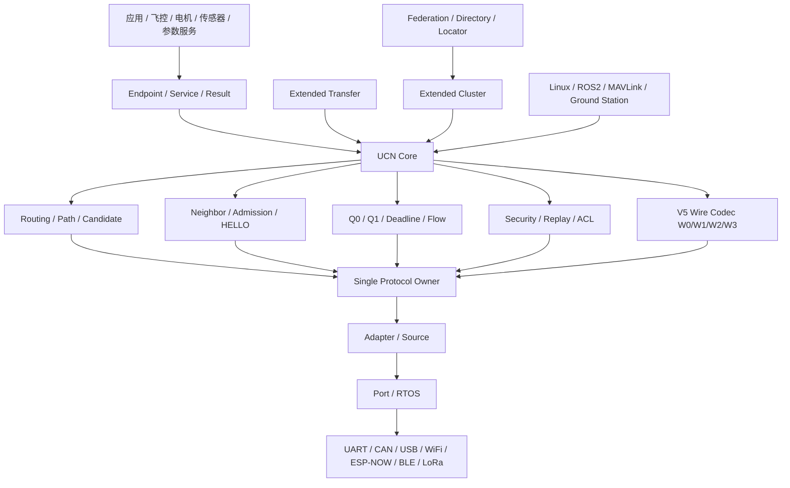
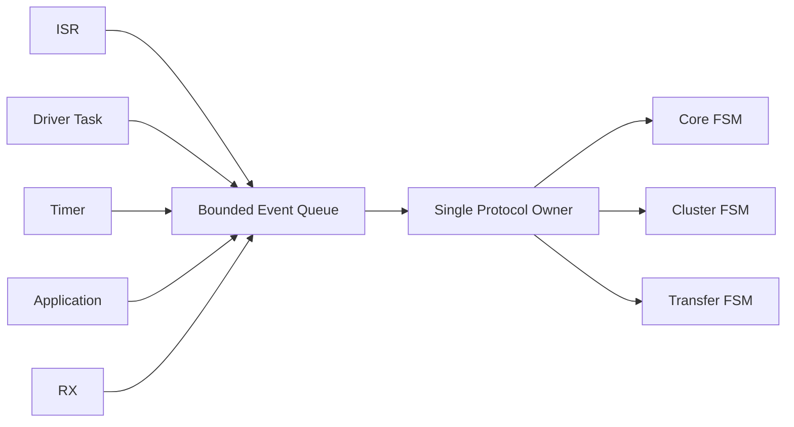
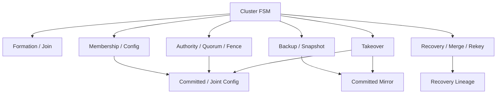
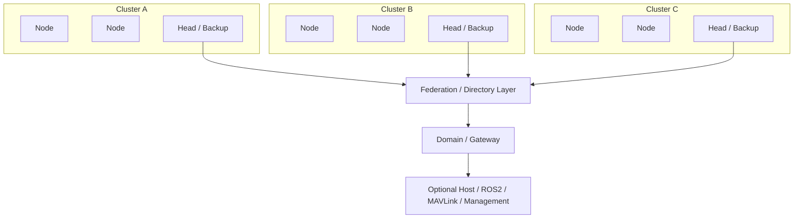
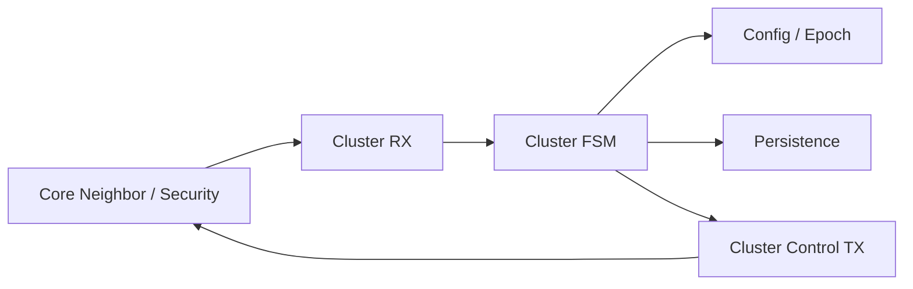
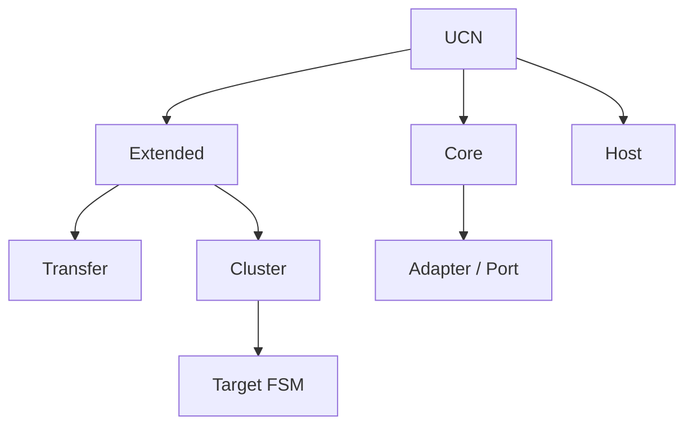

# UCN 理想协议架构与 Cluster Target FSM 定位说明

> 目的：明确 UCN 的理想总架构、Cluster 在整个协议中的正确定位，以及后续实现 Target FSM 时哪些边界可以升级、哪些架构原则绝对不能破坏。  
> 适用背景：UCN V5 / `codex/v5-adaptive-wire`  
> 结论：**理想 Cluster 状态机属于 UCN Extended Cluster 控制平面的内部升级，不应改变 UCN 的基础分层架构。**

---

# 1. 核心结论

理想 Target FSM **不会破坏 UCN 的协议架构**，前提是后续实现时坚持以下边界：

```text
Cluster 只负责控制平面
Cluster 不接管普通数据转发
Cluster 不直接操作 Adapter / Driver
Cluster 不侵入 Core Neighbor / Routing 内部实现
Cluster 不要求所有 Node 都具备完整 Head/Backup 能力
Cluster Wire 可以升级，但不要破坏 UCN Core Wire 基础语义
```

更准确地说：

```text
Target FSM 改的是：

Cluster 控制平面的内部一致性模型

而不是：

UCN 整体通信架构
```

Target FSM 从当前：

```text
role
+ bool
+ deadline
+ 各类隐式状态
```

升级成：

```text
Unique Phase
+
Stable Epoch
+
Committed/Joint Membership Config
+
Head Quorum / Fencing
+
Backup Epoch
+
Majority Takeover
+
Recovery Lineage
+
Persistence
```

这是 **Extended Cluster 内部成熟化**，不是推翻 UCN。

---

# 2. UCN 不等于 Cluster

最重要的架构认识：

```text
UCN ≠ Cluster

Cluster ⊂ UCN Extended
```

Cluster 只是 UCN 的一个可选高级能力。

没有 Cluster：

```text
Node
Neighbor
Routing
QoS
Endpoint
Security
Transfer
```

仍然可以正常工作。

因此 Cluster 绝不能成为整个 UCN 的中心依赖。

---

# 3. UCN 理想总架构



整个 UCN 的目标应该是：

> 应用只关心“给哪个 Node 的哪个 Endpoint 发送什么数据，以及需要什么可靠性、时延和安全级别”。

至于：

```text
走 CAN
走 UART
走 Wi-Fi
是否中继
如何选路
如何切 Link
如何恢复
```

由 UCN Core + Adapter 负责。

---

# 4. Product Port / Adapter 层

这一层只解决：

> 如何把真实硬件介质转换成 UCN 能认识的 Link / Source。

例如：

```text
ESP-NOW
CAN / CAN-FD
UART
RS485
USB
Ethernet
BLE
LoRa
```

理想关系：

```text
ESP-NOW Driver
    ↓
ESP-NOW Adapter
    ↓
UCN Link

CAN Driver
    ↓
CAN Adapter
    ↓
UCN Link
```

Adapter 负责处理介质私有信息：

```text
RSSI
SNR
CAN Error Counter
Wi-Fi Retry
UART 状态
```

再转换成 Core 能理解的：

```text
Link Metrics
Cost
Availability
Source Event
```

---

## 4.1 Cluster 绝对不能依赖驱动对象

禁止：

```c
cluster->wifi_rssi
cluster->esp_now_peer
cluster->CAN_Handle
cluster->UART_Handle
```

也禁止：

```text
Cluster 直接调用 ESP-IDF
Cluster 直接操作 STM32 HAL CAN
Cluster 直接修改 UART Driver
```

正确关系：

```text
Cluster
   ↓
Core API
   ↓
Adapter
   ↓
Driver
```

---

# 5. Single Protocol Owner

这是 UCN 非常重要的执行架构。

所有：

```text
Neighbor
Route
Path
Cluster
Transfer
Security
Timer
```

都不应被多个线程、ISR 或 callback 同时修改。

应该统一：



核心原则：

```text
ISR 不进入协议状态机
Driver callback 不直接改 Cluster
Timer callback 不直接 become_head()
Application 不直接改 route/member table
```

统一：

```text
Event
-> Queue
-> Protocol Owner
-> FSM
```

---

# 6. UCN Core 的理想职责

UCN Core 应尽可能小、稳定、普适。

推荐 Core 保留以下能力：

```text
UCN Core
│
├── Identity
│   ├── Node ID
│   └── Network ID
│
├── Wire Codec
│   └── W0 / W1 / W2 / W3
│
├── Link / Neighbor
│   ├── HELLO
│   ├── Admission
│   ├── Heartbeat
│   └── Liveness
│
├── Routing
│   ├── Candidate
│   ├── AODV-Lite
│   ├── Route
│   ├── Path
│   └── RERR
│
├── QoS / Scheduler
│   ├── Q0
│   ├── Q1
│   ├── Deadline
│   └── Flow
│
├── Security Primitives
│   ├── ACL
│   ├── Replay
│   ├── Control Authentication
│   └── E2E Protection Hook
│
└── Endpoint Delivery
```

Core 不应该强制包含：

```text
Cluster
8K Transfer
File Service
ROS2
MAVLink
Linux
ESP-IDF
HAL Driver
```

---

# 7. Core Neighbor 与 Cluster Member 必须分开

这是后续非常容易写乱的一条。

## 7.1 Core Neighbor

回答：

> “当前哪些 Node 与我有一跳 Link？”

例如：

```text
Node 1
 ├── UART -> Node 2
 ├── CAN  -> Node 3
 └── WiFi -> Node 4
```

Core Neighbor 管理：

```text
ADMITTED
SUSPECT
REMOVED
Bearer
Cost
Heartbeat
```

---

## 7.2 Cluster Member

回答：

> “哪些 Node 属于当前逻辑 Cluster？”

例如：

```text
Node1 = Head
Node2 = Backup
Node3 = Member
Node4 = Member
```

Cluster 管理：

```text
StableEpoch
Membership Config
Backup
Takeover
Recovery
Merge
```

因此：

```text
Neighbor != Member
```

依赖方向：

```text
Core Neighbor
      ↓
Cluster 可以读取

Cluster
      X
不能反过来定义 Core Neighbor
```

---

# 8. Cluster 是控制平面，不是数据转发中心

这是最重要的架构边界之一。

错误架构：

```text
M1 -> Head -> M2
M3 -> Head -> M4
所有数据必须经过 Head
```

这样会把 UCN 退化成中心化星型网络。

正确架构：

```text
Cluster Head 管：

Membership
Authority
Directory
Backup
Recovery
Cluster Merge

普通 Data Plane：

仍由 Core Routing / Path 决定。
```

例如：

```text
M1 ---------------- M2
 \                  /
  \                /
       Head
```

如果 Core 已有：

```text
M1 -> M2
```

的最佳 Route：

```text
直接传输
```

不需要：

```text
M1 -> Head -> M2
```

因此：

> **Head 是控制平面 Authority，不是数据平面的 Router Boss。**

---

# 9. Cluster 理想内部模块

未来不建议继续让 `ucn_cluster.c` 无限膨胀。

推荐：

```text
src/extended/cluster/

    cluster_fsm.c
    cluster_membership.c
    cluster_authority.c
    cluster_backup.c
    cluster_takeover.c
    cluster_recovery.c
    cluster_merge.c
    cluster_codec.c
    cluster_persist.c
    cluster_diag.c
```

逻辑关系：



---

## 9.1 唯一状态修改者

即使拆成多个 `.c`：

```text
cluster_membership.c
cluster_backup.c
cluster_recovery.c
```

它们也不应直接随意：

```c
cluster->phase = ...
```

更推荐：

```text
子模块返回：
    Event
    Result
    Action

最终 Phase Transition：
    cluster_fsm.c 决定
```

---

# 10. Target FSM 在整个 UCN 中的位置

Target FSM：

```text
HEAD_QUORUM_GRACE
HEAD_FENCED
MEMBER_PROVISIONAL
CommittedVoterSet
Joint Config
BackupEpoch
SnapshotEpoch
RecoveryLineage
Persistence
```

全部属于：

```text
UCN Extended
    ↓
Cluster
    ↓
Cluster Control Plane
```

并没有侵入：

```text
Core Wire
Core Routing
Core Neighbor
Adapter
Driver
Application API
```

所以它是：

> **架构内升级。**

---

# 11. 架构兼容与 Wire 兼容是两回事

Target FSM 可能需要新增：

```text
join_txid
config_id
backup_generation
snapshot_id
stepdown_nonce
rekey_txid
Recovery lineage
```

这些字段可能导致：

```text
Cluster v3
    ↓
Cluster v4
```

或者：

```text
Cluster Capability Extension
```

这属于：

```text
Extended Cluster 子协议升级
```

不等于：

```text
UCN 总架构被破坏
```

---

## 11.1 不建议为了 Cluster 修改整个 Core Wire

应尽量保持：

```text
W0 / W1 / W2 / W3 基础语义
```

稳定。

如果 Cluster 控制消息字段不够：

```text
升级 Cluster Control Wire
```

而不是：

```text
为了 Cluster 把整个 UCN 基础帧重新设计
```

---

# 12. Cluster Capability Negotiation

理想状态下，不是所有 MCU 都需要完整 Cluster 能力。

建议定义类似：

```text
CLUSTER_CAP_BASIC
CLUSTER_CAP_BACKUP
CLUSTER_CAP_TAKEOVER
CLUSTER_CAP_JOINT_CONFIG
CLUSTER_CAP_RECOVERY
CLUSTER_CAP_REKEY
```

节点可以：

```text
Node A:
    member only

Node B:
    member + Backup capable

Node C:
    full Head capable
```

例如：

```text
Node A:
head_capable   = false
backup_capable = false

Node B:
head_capable   = true
backup_capable = true

Node C:
head_capable   = true
backup_capable = false
```

Election / Backup Selection：

```text
只从 Capability 满足要求的节点中选。
```

这样保持：

```text
资源有界
功能可裁剪
MCU-first
```

---

# 13. Cluster 与 Routing 的正确关系

推荐：

```text
Cluster 提供：

Cluster ID
Head Locator
Directory
Gateway Hint
Aggregated Reachability

Routing 提供：

Next Hop
Path
Route
Link Selection
```

例如：

```text
Node A
要找 Node Z

Directory:
    Z 属于 Cluster C8
    Gateway / Locator = G8

Routing:
    如何到 G8？
    自己算 Route / Path
```

Cluster 不应该自己维护：

```text
全网完整 Route Table
```

---

# 14. 大规模网络应该层次化

不应该：

```text
10000 Nodes
    ↓
一个 Cluster
    ↓
一个 Head
```

理想：



规模层次：

```text
若干 Node
    ↓
Cluster

多个 Cluster
    ↓
Federation

多个 Federation / 地址域
    ↓
Domain / Gateway

Linux / PC
    ↓
Optional Host
```

---

# 15. 理想 Data Plane

业务数据：


正常业务帧：

```text
不需要每次经过 Cluster FSM
```

这样 Cluster 再复杂：

```text
也不会直接拖慢飞控/执行器实时数据。
```

---

# 16. 理想 Control Plane

Cluster 控制路径：



Core 提供：

```text
Admitted Peer
Monotonic Time
Send API
Security API
Metrics
```

Cluster 返回：

```text
Control Messages
Directory / Authority State
```

禁止：

```text
Cluster 直接改 Adapter
Cluster 直接写 Driver
Cluster 直接写 Routing 内部数组
```

---

# 17. Security 分层

推荐：

```text
UCN Security Core
│
├── Node Identity
├── Join Authentication
├── Control Authentication
├── Replay Primitives
├── E2E AEAD
└── Key Provider
```

Cluster：

```text
Cluster Security State
│
├── Term
├── Takeover Vote
├── Config Commit
├── Backup Generation
├── Snapshot Epoch
├── Recovery Lineage
└── Persistence Provider
```

关系：

```text
Core Security：
    提供密码学原语

Cluster：
    定义哪些状态必须持久化
    定义什么 Epoch 下消息才合法
```

Cluster 不应重新发明：

```text
Encryption
MAC
AEAD
Key Exchange
```

---

# 18. Target FSM 对 UCN 架构的实际影响

可以明确分三类。

## 18.1 不应该动

```text
Node / Link API
Adapter / Product Port
Single Protocol Owner
Core Wire 基础原则
Core Neighbor
Routing / Path
QoS
Transfer
Endpoint / Service
Host Optional
```

---

## 18.2 Cluster 内部升级

```text
Current:
role + bool

Target:
Unique Phase
```

```text
Current:
members[]

Target:
Runtime Membership
+
Committed / Joint Config
```

```text
Current:
Backup bool

Target:
BackupEpoch
+
SnapshotEpoch
```

```text
Current:
Takeover ACK count

Target:
Frozen Quorum
+
Persisted Vote
```

```text
Current:
Recovery Head

Target:
RecoveryLineage
+
Recovery Island
+
Backoff
```

```text
Current:
Head

Target:
Head Identity
+
Authority
+
Quorum
+
Fence
```

---

## 18.3 Cluster Wire 可能升级

可能增加：

```text
join_txid
config_id
snapshot_id
backup_generation
stepdown_nonce
rekey
```

这属于：

```text
Cluster 子协议版本升级
```

不是 Core 架构升级。

---

# 19. UCN 理想模块依赖规则

```text
Product Application
        │
        ▼
Endpoint / Service API
        │
        ▼
┌─────────────────────────────┐
│        UCN Extended         │
│                             │
│ Transfer   Cluster   Future │
└──────────────┬──────────────┘
               │
               ▼
┌─────────────────────────────┐
│          UCN Core           │
│ Wire / Neighbor / Routing   │
│ QoS / Endpoint / Security   │
└──────────────┬──────────────┘
               │
               ▼
       Protocol Owner
               │
               ▼
        Adapter / Source
               │
               ▼
        Product Port/BSP
               │
               ▼
      Physical Controller
```

依赖方向必须冻结：

```text
Extended -> Core        YES

Core -> Extended        NO

Core -> SDK             NO

Cluster -> Adapter SDK  NO

Application -> Route internals  NO

ISR -> Core FSM         NO

Host required by Core   NO
```

这些建议视为：

> **架构级不可破坏规则。**

---

# 20. Target FSM 的正确位置

不是：

```text
UCN
 ↓
Cluster FSM
 ↓
所有东西归 Cluster 管
```

而应该：



因此：

> Target FSM 只是 **Cluster Extended 的理想内部控制架构**。

---

# 21. 为什么 Target FSM 没有破坏原架构

Target FSM 增加的是：

```text
Unique Phase
Stable Epoch
Membership Config
Quorum
Fencing
Persistence
Backup Epoch
Recovery Lineage
```

这些问题本来就是：

```text
Cluster 控制平面自己的职责。
```

没有把它们下沉到：

```text
Core Neighbor
Routing
Adapter
Driver
```

所以符合原分层。

---

# 22. 真正需要避免的架构破坏

后续实现 Target FSM 时，最需要防止以下情况。

## 22.1 不要把 Quorum 搬进 Core

错误：

```text
ucn_core.c
直接理解 Cluster VoterSet
```

正确：

```text
Core 只提供：
Neighbor / Time / Send / Security

Cluster 自己计算 Quorum
```

---

## 22.2 不要让 Cluster 接管所有 Data Plane

错误：

```text
普通数据：
Member -> Head -> Destination
```

正确：

```text
普通数据：
Routing 决定 Path
```

---

## 22.3 不要让 Cluster 直接访问驱动

错误：

```text
Cluster -> WiFi Driver
Cluster -> CAN Driver
```

正确：

```text
Cluster -> Core -> Adapter
```

---

## 22.4 不要让所有 MCU 都支付 Full Cluster 成本

应该：

```text
Member-only
Backup-capable
Head-capable
Full Cluster
```

可裁剪。

---

## 22.5 不要为了 Cluster 字段重写整个基础 Wire

优先：

```text
升级 Extended Cluster Control Protocol
```

不要：

```text
破坏 W0-W3 Core Wire
```

---

# 23. 理想 UCN 最终架构一句话总结

```text
UCN Core
负责：
    让节点能安全、可靠、实时地互联和寻路

UCN Extended Cluster
负责：
    在 Core 提供的网络之上建立稳定、可接管、可恢复的控制域

Routing
负责：
    数据怎么走

Cluster
负责：
    谁属于哪个控制域、谁有 Authority、故障后谁接管

Adapter
负责：
    数据最终怎么从具体硬件介质发出去
```

---

# 24. 最终架构公式

```text
MCU-first
+
Core Independent
+
Single Protocol Owner
+
Media-independent Adapter
+
Bounded Routing / QoS
+
Optional Extended Modules
+
Cluster Control Plane Only
+
Hierarchical Federation
+
Optional Host
=
理想 UCN 架构
```

而 Cluster Target FSM：

```text
Unique Phase
+
Stable Epoch
+
Committed / Joint Membership
+
Head Quorum / Fence
+
Backup Epoch / Snapshot
+
Majority Takeover
+
Recovery Lineage
+
Persistence
```

只是其中：

```text
Extended Cluster Control Plane
```

的内部正确性升级。

---

# 25. 最终结论

理想状态机并没有破坏 UCN 的协议架构。

正确实现 Target FSM 后：

```text
Core 仍然独立
Routing 仍然独立
Neighbor 仍然属于 Core
Adapter 仍然介质无关
Host 仍然可选
普通数据仍然不必经过 Head
Cluster 仍然可以按需裁剪
```

真正变化的只有：

```text
Cluster 从“role + bool + timeout 的原型状态机”

升级为

“有明确 Epoch、Quorum、Fencing、Backup、Recovery、
Membership Config 和持久化语义的成熟控制平面”
```

因此：

> **Target FSM 不但没有破坏 UCN 架构，反而是在让 Cluster 模块真正符合 UCN 原本 MCU-first、模块化、资源有界、介质无关、Extended 按需加载的总体设计方向。**
