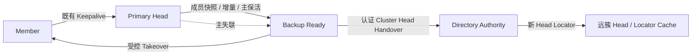

# UCN V5 C07 · 主备簇头、快速恢复与目录交接整体方案

> 状态：**C07.0 历史设计基线；C07.1～C07.6 已完成当前 Host 软件闭环。**
>
> 下文保留最初设计推导；以本节“当前实现事实”为准。它不把 Host 模拟当作实机结论，也不承诺无线网络中的零丢帧或绝对零脑裂。

## 当前实现事实（C07-R1，2026-08-15）

当前实现已经不是本方案撰写时的 v1/v2 原型。Cluster 控制格式已经破坏性升级到 **v3**（仍为固定 `28 B`，Core Wire 仍为 v5）；旧 Cluster Control v1/v2 帧会被明确拒绝。C07 的软件闭环和仍待实机验证的边界如下。

| 项目 | 当前代码事实 | 安全/资源边界 |
| --- | --- | --- |
| Backup 身份 | `BACKUP_ASSIGN` 向每个已加入成员传递 `{backup_generation, backup_node_id}`；成员保存 `known_backup_node_id/generation`。选定 Backup 优先收到指派，新成员取得可重试的定向指派，并在一个租约周期内做有界全员复告。 | 成员只接受自己已知 Backup 的 `TAKEOVER_PREPARE`/`HEAD_TAKEOVER`，不会因陌生成员自称 Backup 而投票或切换。 |
| 快照与保活 | Head 以 `BEGIN → N Member → END` 同步；快照帧间隔上限为 `250 ms`，Token defer 不推进序号。普通 Head 广告/成员租约优先于后台同步。 | 无业务缓存、无动态分配；`UCN_CLUSTER_MAX_MEMBERS≤32`（32 bit ACK bitmap），Head 的产品 `member_capacity` 还必须不超过 `UCN_CLUSTER_MAX_PEERS`。 |
| 误接管抑制 | Backup 不只依赖 `PRIMARY_HEARTBEAT`：同 Cluster/Term/Primary 的受保护 `ADVERTISE` 同样续 Primary 租约。 | 连续心跳丢失仍必须等 Primary 租约失效且满足多数 ACK；这降低受损链路上的假接管概率，但实际时延仍取决于产品租约与介质。 |
| Directory Handover | 受保护模式同时强制 `authorize_handover` 与 `build_handover_proof`；自动发布必须产生非零产品 proof。相同 Term/相同 proof 的重发只刷新 Lease，冲突同 Term 被拒绝。 | 没有 C06.3 传输 ACK；首轮最多 3 次、间隔 250 ms，随后按 `locator_refresh_ms` 继续重发同一幂等 Handover，不能把“已入发送队列”表述成 Authority 已确认。 |
| Host 证据 | Full/Lite/Nano 均通过 `12/12` CTest：64/256/1000 节点 clean/15% 丢包+抖动+重复+单向阻断、Head 故障、成员移动、评分切换、FAST_FIXED。 | 当前 Windows x64 Debug 测得 `sizeof(ucn_cluster_t)=1048 B`、`sizeof(ucn_cluster_federation_t)=3328 B`；不是 MCU RAM 承诺。C07.7 仍需满足一跳 Backup 覆盖的实板验证。 |

本轮受损 Host 门禁的确定性样本为：`64` 节点 FAST_FIXED 受损场景 `8 Head + 56 Member`、`15400 ms` 收敛、控制峰值 `27 frame/s`；同一实现也已通过 `1000` 节点 default 受损收敛。这个结果仅证明静态 Host 模型中的状态机与预算闭环，不替代无线、长期、功耗或 MCU ISR/BSP 验收。

### C07.7 首次实板前置结果（2026-08-15）

四块 ESP32-S3-N16R8 已以当前 v3 代码完成 A—B—C—D、3 Mbps UART-only、FAST_FIXED 冷启动；B 成为 Head，A/C 进入过 Backup 指派路径，UART 解码/溢出/队列丢失均为零。但这条**线形**链不满足 C07 的正式验收前提：B 的 Backup 候选 A 或 C 无法在不经过 B 的情况下，一跳覆盖 B 的另一成员。因此 `backup_covers_all_members()` 按设计失败关闭，Backup 不进入 `READY`，未执行主断接管试验。后续必须改为 Primary 与 Backup 都一跳覆盖全体成员的 CAN/RS-485、多 Bearer 或已稳定四节点 ESP-NOW 拓扑；不得把线形结果记为 C07 协议失败或接管实测成功。

## 1. 目标、范围与结论

UCN 的单层 Cluster 已有 Head 选举、成员租约、FAST_FIXED 时序和 Head 故障后重新选举能力。FAST_FIXED 在 Host 64 节点模拟中恢复约 `3.68 s`，在四块 ESP32-S3、3 Mbaud UART 的短窗台架中，观测到约 `3.500–3.516 s` 的接任。它们都是“租约到期后重新选举”，不是备用簇头接管。

C07 的目标是在**满足拓扑、安全和多数确认条件**的簇中，让已经同步完成的 Backup 直接承接 Head；若 Head 与 Backup 都不可用，再建立一个短寿命的临时恢复簇头。恢复后用有门槛的方式回到更优的 Head，避免角色反复抖动。

本阶段的边界如下：

| 范围 | C07 要做到的事 | 不承诺的事 |
| --- | --- | --- |
| 本簇控制面 | 主备选择、成员状态复制、接管、临时恢复、稳定回切、控制面限流。 | 任意拓扑都能在 1–2 s 内接管。 |
| 数据面 | 本簇 Core Route 保持独立；接管后恢复 Head Gateway 职责。 | Q1 零丢包、在途帧自动迁移、业务 Payload 缓存。 |
| 跨簇 C06 | 目录支持原子 Head Handover，缓存陈旧时返回显式错误并由发送端用新事务重试。 | 当前 C06.3 单帧 Tunnel 在 Head 切换中自动保存并重放业务。 |
| 安全 | 生产接管必须是受保护控制面，并使用可验证的接管证明。 | 未启用安全 Provider 时抵御伪造 TAKEOVER。 |
| 资源 | 静态表、固定帧、无动态分配、无业务数据队列。 | 不经目标 MCU 测量便承诺统一 RAM/Flash 数值。 |

因此，“无缝”的正式定义是：**控制面在受支持条件下有界恢复；普通本簇 Core 数据面不因 Cluster 角色本身被中断；跨簇小消息可出现一次 `DIRECTORY_STALE`/`DOWNSTREAM` 并由应用以新 Transaction 重试；关键业务使用既有 Transfer 可靠语义。**

## 2. 历史编写时的代码基础与缺口（已过期）

当前 `ucn_cluster` 已保留 `BACKUP`、`HEAD_TAKEOVER`、`HEAD_STEPDOWN` 枚举，但还没有 Backup 状态机、成员表复制、快速接管或临时代理。现有 `HEAD_TAKEOVER` 仍按 Head 候选消息处理；现有 `HEAD_STEPDOWN` 只会让成员退回 Detached。`KEEPALIVE` 也只允许 Head 接收，所以不能直接把成员 Keepalive 抄送给 Backup。

当前 C06.3 Directory 对同一 Node 的新 Head 会拒绝覆盖仍在租约内的旧 Head，且本地 Locator 采用“先 Withdraw、再 Register”的保守流程。原 Head 突然掉电时无法完成 Withdraw，因此没有 C07 的原子交接，跨簇 Tunnel 不能宣称快速恢复。

### 2.1 拓扑硬前提

当前 Cluster 是单层、一跳控制域。一个 Backup 只有同时满足下列条件，才允许标记为 `BACKUP_READY`：

1. 是当前簇的已准入 Member，且 `head_capable=true`；
2. 与 Primary Head 有健康、已准入的直连 Bearer；
3. 能不经过 Primary Head 直接到达当前每个活跃 Member；
4. 有足够的固定 Member 表容量和产品允许的 Bearer/Wire/Security 能力；
5. 已取得完整成员快照，并连续接收 Primary 保活。

不能满足覆盖条件时，**本簇没有 Backup**，继续使用既有 FAST_FIXED 重选流程。这是安全降级，不允许把“评分第二、但覆盖不到成员”的节点强行作为备用。现有 UART 线形拓扑通常不满足该条件；验证主备接管应使用星形或菱形连通拓扑，或经实际验证的无线一跳覆盖。

## 3. 格式、版本和静态对象原则

### 3.1 历史方案：一次性升级 Cluster Control Format v2（已被 v3 取代）

当前 Cluster Format v1 固定为 28 B，并严格要求 `flags=0`、消息类型在 1–9。C07 需要 Backup 指派、快照、接管确认和恢复声明，不能在 v1 上偷偷复用未定义 Flags 或 Type。

本项目尚未对外发布，采用明确的破坏性升级：

| 项目 | 决策 |
| --- | --- |
| Endpoint | 继续使用 Cluster 控制 Endpoint `0xA0`。 |
| Cluster Control Format | `v1 → v2`；v1 与 v2 不混跑，旧帧明确返回 `UCN_ERR_MALFORMED`。 |
| Core Wire | 保持 UCN Core Wire v5；这是 Extended 的控制载荷升级，不改普通数据帧格式。 |
| 固定长度 | 继续固定 `28 B`，避免动态解析和不定长控制包。 |
| 字段模型 | 前 16 B 保持 `Version/Type/Role/Flags/ClusterID/Term/HeadID`；后 12 B 按 Type 解释。 |
| 安全 | `require_protected_control=true` 是生产 C07 的前提；仅允许显式 Lab 配置跳过，Lab 不能宣称抗伪造接管。 |

### 3.2 历史 v2 控制消息表（已被 v3 取代）

| Type | 消息 | 方向 | 固定语义 |
| ---: | --- | --- | --- |
| 1–9 | 既有消息 | 保留 | v2 中保留既有语义；`HEAD_TAKEOVER` 与 `HEAD_STEPDOWN` 按本方案扩展。 |
| 10 | `BACKUP_ASSIGN` | Head → Member | 分配 Backup、携带 `backup_generation` 和同步令牌。 |
| 11 | `BACKUP_READY` | Backup → Head | 已完成快照、覆盖检查和连续保活确认。 |
| 12 | `BACKUP_MEMBER_SYNC` | Head → Backup | 单条成员快照/新增/续租/删除；带单调 `membership_sequence`。 |
| 13 | `PRIMARY_HEARTBEAT` | Head → Backup | 主存活与当前成员序号；不复用 Member Keepalive。 |
| 14 | `TAKEOVER_PREPARE` | Backup → Member | 请求当前 Term 的一次性接管确认。 |
| 15 | `TAKEOVER_ACK` | Member → Backup | 成员对一个 `(cluster_id, term, backup_generation)` 至多确认一次。 |
| 16 | `RECOVERY_DECLARE` | 临时恢复节点 → 邻居 | 宣布短寿命 `RECOVERY_HEAD`。 |
| 17 | `RECOVERY_ACK` | Member → 临时恢复节点 | 仅表示本地成员跟随，不构成跨簇目录授权。 |

`BACKUP_MEMBER_SYNC` 的 Type 专用 12 B 使用 `{member_node_id, member_lease_ms, member_nonce, membership_sequence}`；其它 Type 使用相同位置承载自身明确的固定字段。每个 Type 都必须有精确长度、合法 Flags、合法 Role 和 Golden Vector 测试，不能采用“剩余字段随便复用”的隐式规则。

### 3.3 新增静态状态

所有状态属于应用拥有的 `ucn_cluster_t` 或独立 C06 Federation 对象：

| 对象 | 必需状态 | 上界原则 |
| --- | --- | --- |
| Primary Head | `backup_node_id`、`backup_generation`、同步序号、Ready 状态、少量发送 Deadline。 | 不复制业务 Payload；成员仍只保存既有 `members[]`。 |
| Backup | 既有固定 `members[]` 作为只读镜像、快照序号、Primary Heartbeat Deadline、每成员投票位。 | 不新增动态表；表满即不可 Ready。 |
| Member | 已知 Backup ID/Generation、最后一次 Head 保活、`voted_term`。 | 常数级字段。 |
| Directory Authority | 每 Cluster 一个 `ClusterHeadLease` 固定记录。 | 独立于逐成员 Locator 表；表满则 Handover 失败关闭。 |

## 4. 正常运行：主备选择与成员状态复制

### 4.1 主备选择

1. 现有选举先正常产生 Head；不改变初始选举和默认稳定时序。
2. Head 在已加入的成员中计算 Backup 候选。候选必须通过第 2.1 节的覆盖、能力、资源和安全门槛；分数仅用于在合格候选中排序，Node ID 用于平局。
3. Head 单播 `BACKUP_ASSIGN`，失败按固定次数重试；被拒绝或超时后选择下一合格候选。
4. 被指派节点进入 `BACKUP_SYNCING` 内部状态。它不是 Head、不发布 Locator、不转发 Federation Tunnel。
5. Snapshot 完整、增量连续、Primary Heartbeat 稳定后，Backup 回 `BACKUP_READY`，Head 才对外宣布该簇存在可用 Backup。

### 4.2 同步策略：快照加增量，而非成员长期双发

不采用“每一个 Member 永久向 Head 与 Backup 双发 Keepalive”。FAST 500 ms 下它会让每成员控制发送翻倍，且现有接收状态机并不接受 Backup 收到的 Keepalive。

采用以下固定同步链：

1. 指派后，Head 发送 `BACKUP_MEMBER_SYNC` 快照：`BEGIN → N 条 Member → END`；
2. 每条快照或增量都有单调 `membership_sequence`；Backup 发现缺号、重放或跨 Generation 即丢弃镜像并重新请求快照；
3. Member Join、Leave、Lease 续期/到期仅由 Head 生成对应增量给 Backup；
4. Head 用独立 `PRIMARY_HEARTBEAT` 证明自己仍存活及当前 `membership_sequence`；
5. Backup 只有镜像完整且序号连续时才 `READY`。同步异常时退回 `SYNCING`，不允许接管。

这会把稳态额外流量限制为“Primary 到一个 Backup 的增量和保活”，而不是与成员数成正比的双发。初始快照是有界突发，最大条数等于 `UCN_CLUSTER_MAX_MEMBERS`。

## 5. 主 Head 失联后的安全接管

### 5.1 检测与多数确认

Backup 在连续错过 `BACKUP_MISS_LIMIT` 次 `PRIMARY_HEARTBEAT` 后进入 `TAKEOVER_PREPARE`。默认建议为 3 次；在 FAST 档 500 ms 周期下，纯检测约为 1.5 s。

为了避免链路抖动或网络分区中出现两个有效 Head，检测并不等于立即接管。Backup 还必须：

1. 处于 `BACKUP_READY`；
2. 等待 Primary 租约到期，或得到产品安全模块签发的提前失效证明；
3. 对镜像中仍有效的成员发 `TAKEOVER_PREPARE`；
4. 收到严格多数 `floor(active_member_count / 2) + 1` 的 `TAKEOVER_ACK`；每个成员在一个 Term 仅确认一次；
5. 在确认窗口结束前未收到更高 Epoch 的合法 Head 声明。

满足后 Backup 原子地变为 Head，`term = old_term + 1`，发 `HEAD_TAKEOVER` 并为成员续租。成员收到合法的新 Term 后直接切换 Head 指针，不需要走完整 Join/Accept；未收到的成员仍以普通 Join 作为兜底。

两个成员的簇无法在失去其中一个成员时取得严格多数；默认应降级为普通重新选举，而非冒充安全无缝接管。产品若选择可用性优先的单节点覆盖策略，必须显式配置并接受分区脑裂风险。

### 5.2 时序口径

| 场景 | 正式口径 |
| --- | --- |
| 当前 FAST_FIXED | 已有 Host/四板短窗证据约 3.68 s / 3.50–3.516 s，属于重新选举。 |
| C07 Backup 快速接管 | 目标为已验证有线/低抖动配置下约 2–3 s；检测、租约、多数确认和成员通知均计入。 |
| 小于 2 s | 仅能作为专用产品档的目标；需要缩短租约、实测媒体抖动并证明没有误接管，不能预先承诺。 |
| 无 Backup 或同步未完成 | 明确退回现有 FAST_FIXED 重新选举。 |

### 5.3 分区与旧主恢复

没有中心协调器的网络无法同时保证任意分区下的绝对可用与绝对单主。C07 选择“有多数才接管”的安全优先策略：少数分区可临时恢复本地控制，但不得接管全簇 Directory 所有权。

原 Head 恢复时若 Term 较旧，必须退为 Member/Candidate，不能凭原始高分立即抢回 Head。只有满足最小任期、连续健康样本、评分改进门槛和有序 Stepdown，才允许成为新的优选 Head。

## 6. C06 Directory 的原子 Head Handover

### 6.1 为什么必须单独做

当前 Directory 的逐成员 Locator 是 `{Node, Cluster, Head, Term, Lease, Nonce}`。旧 Head 突然失联时，Backup 无法先撤销旧记录；直接 Register 会被 Authority 以重放/不同 Head 拒绝。因此仅完成本簇角色切换，不等于跨簇数据面恢复。

### 6.2 新的 ClusterHeadLease 间接层

C07 在 Directory Authority 增加固定 `ClusterHeadLease` 表：

| 字段 | 含义 |
| --- | --- |
| `cluster_id` | Cluster 的稳定控制域标识。 |
| `head_node_id` | 当前可接收 Tunnel 的 Head。 |
| `term` / `backup_generation` | 单调接管世代。 |
| `lease_expires_at_ms` | Authority 的单调时钟上的有效期。 |
| `handover_proof` | 产品安全回调验证的固定证明。 |

逐成员 Locator 继续记录 Member → Cluster；Directory Reply 在返回时由当前 `ClusterHeadLease` 解析出 Head。这样一次 Backup 接管只需原子更新一条 Cluster Head Lease，不需要为每个 Member 依次撤销/注册。

### 6.3 `LOCATOR_HANDOVER` 规则

新增 Federation 控制 Kind `LOCATOR_HANDOVER`：

1. 只接受 `BACKUP_READY` 指向的 Backup，且 `new_term > stored_term`；
2. Authority 调用产品 `authorize_handover()` 验证受保护控制和证明；
3. 验证通过后在同一次 Owner 操作中替换 `ClusterHeadLease`；旧 Head 的更新从此被拒绝；
4. 成功后新 Head 发布成员 Locator 刷新；失败则本簇仍可运行，但跨簇消息返回显式错误；
5. Head 未完成 Directory Handover 前，不接收新的 Federation `TUNNEL_DATA` 作为 Gateway。

远端 H1 若持有旧 H2 Cache，可能收到 `DOWNSTREAM` 或 `DIRECTORY_STALE`。C06.3 不缓存业务 Payload；发送端完成 Locator Query 后以**新的 Transaction ID**重发。C06.4 的 Transfer 则必须在完整 Flow 边界取消或重试，绝不混接旧/新 Head 的分片。

## 7. 主备双失联：临时恢复簇头

为避免“代理”被误解为透明业务中继，协议角色命名为 `RECOVERY_HEAD`，对外可称“快速代理簇头”。它只恢复本簇控制面，不代表已有跨簇 Gateway 或缓存业务数据。

### 7.1 触发与资格

触发条件为：Primary 租约到期、Backup 接管窗口结束且没有合法 `HEAD_TAKEOVER`。候选不按综合评分排序，但仍必须通过最低资格门槛：

- `head_capable`、控制面受保护、可用 Bearer；
- 固定 Member 表未超出物理 `UCN_CLUSTER_MAX_MEMBERS`；
- 能接触到至少多数仍活跃成员；
- 未处于冷却期，且未被当前更高 Term Head 否决。

候选用 `(recovery_nonce, node_id)` 计算固定 `0..BACKOFF_MAX_MS` 退避；同一可见域内更低 Node ID 胜出。网络分区时不同分区可以各自产生 `RECOVERY_HEAD`，这是受限可用性行为；重新连通后必须按 Term、成员多数和最小任期收敛。

### 7.2 行为和寿命

| 项目 | `RECOVERY_HEAD` 规则 |
| --- | --- |
| Cluster ID | 建立新的恢复 Cluster ID；不冒充旧 Cluster 的安全连续 Head。 |
| 成员 | 使用简化 Join/ACK 加入，但不可越过静态表物理上限。 |
| 业务 | 普通本簇 Core Route 仍照常运行；新的跨簇 Tunnel 等待 Directory 刷新。 |
| 容量 | 可忽略产品软 `member_capacity`，但不能突破编译期 `UCN_CLUSTER_MAX_MEMBERS`。 |
| 寿命 | 默认 30 s；只要未产生稳定 Head，就有界地重新退避，不可无限占位。 |
| 回切 | 新 Head 满足资格和最小任期后，Recovery Head 有序 Stepdown。 |

## 8. 稳定回切与动态 Cost 的关系

现有 C05 已证明：恢复的高分旧 Head 会加入现任低分 Head，属于稳定优先。C07 保持这个原则，并将自动回切限定为以下全部成立：

1. 当前 Head/Recovery Head 已达到 `head_min_tenure_ms`；
2. 候选连续 `switch_required_samples` 次的滤波评分优于现任，且超过 `switch_improvement_percent`；
3. 候选通过 Backup 覆盖和安全资格；
4. 旧 Head 先进入 `STEPPING_DOWN`，新 Head 已 `READY` 并完成 Directory Handover；
5. 任一条件失败，保持现任，不进行抢占。

Cost、链路质量和负载仅参与候选评分；它们不能绕过租约、多数确认和安全证明。这样避免“瞬时 RSSI 改善”导致整个簇的控制面抖动。

## 9. 控制面预算与资源边界

### 9.1 固定 Token Bucket

Cluster 控制面使用独立的固定 Token Bucket，不能挤占普通 Q1 业务队列：

| 类别 | 默认预算 | 用途 |
| --- | --- | --- |
| 正常广告/Primary Heartbeat | Burst 4，补充 1/250 ms | 有界 Head/Backup 保活。 |
| Backup 同步 | Burst 4，补充 1/125 ms | 增量同步和有限重传。 |
| 初始快照 | 最多 `UCN_CLUSTER_MAX_MEMBERS + 2` 帧，固定间隔发出 | 不缓存业务，不无界重试。 |
| 紧急接管/恢复 | Burst 8，补充 1/100 ms | Takeover、Ack、Recovery 声明；超预算延后而不是无限广播。 |

真实帧数取决于是否有经验证的控制广播能力：支持受保护广播时可单帧通知；否则按成员单播并计入 Bucket。任何“2 s 恢复”门槛都必须把这部分发送时间算进去。

### 9.2 编译期容量

| 宏/表 | 约束 |
| --- | --- |
| `UCN_CLUSTER_MAX_MEMBERS` | 是 Member、Backup 镜像和多数投票的硬上限。 |
| `UCN_CLUSTER_MAX_PEERS` | 必须覆盖产品的一跳 Head/Backup 邻居需求。 |
| `UCN_CLUSTER_FED_MAX_CLUSTER_HEADS`（新增） | 至少覆盖本产品同时活跃的 Cluster 数；不足时拒绝 Handover。 |
| Handover/同步重试次数 | 固定小上限；超限退回普通选举或报告失败。 |

不引入动态内存、业务帧缓存或按成员分配的 Heap。实现后必须分别报告 Full/Lite/Nano 的静态对象增量；若某 Profile 不承载 C07，应由公开 API 返回 `UCN_ERR_CONFIG`，而不是出现链接缺符号或隐式降级。

## 10. 实施拆分

| ID | 实施内容 | 完成判据 |
| --- | --- | --- |
| C07.0 | 冻结本文、C07 控制语义与 Format v2。 | 历史设计条目；当前 Format v3 的实现事实见文首和任务表。 |
| C07.1 | v2 Codec、角色/Flags/配置与严格负向解析。 | 历史实施拆分；当前 v3 Golden/负向测试已由 OP-181 补充。 |
| C07.2 | Backup 资格、指派、快照/增量同步、Ready 与失步降级。 | 覆盖不足不能 Ready；丢同步/重放/表满/重试均失败关闭。 |
| C07.3 | 多数确认的 Head Takeover、旧 Head 回归和成员免重入。 | 备份接管、无多数降级、抖动误触发、分区再合并、旧 Term 拒绝。 |
| C07.4 | C06 `ClusterHeadLease` 与 `LOCATOR_HANDOVER`。 | 旧 Lease 未过期时新 Head 可经证明原子接管；伪造/旧 Generation/表满拒绝。 |
| C07.5 | `RECOVERY_HEAD`、寿命、稳定回切与 Token Bucket。 | 双失效可恢复；无界广播、超物理容量和抢占抖动均被拒绝。 |
| C07.6 | Host 规模/故障模拟与 Sanitizer/Analyzer。 | 2/4/16/64/256/1000 节点、丢包/乱序/分区/恢复、目录切换与资源报告通过。 |
| C07.7 | MCU 实测。 | 使用满足 Backup 覆盖条件的四板以上拓扑，重复主断、主备双断、旧主回归、跨簇缓存陈旧和长稳测试。 |

## 11. 测试门禁

### 11.1 软件测试

- Codec：v2 每种消息 Golden、损坏 Version/Type/Flag/长度、非法 Role、重复 Nonce；
- 同步：Snapshot 缺条、序号跳变、Lease 到期、同步重试耗尽、成员离开、表满；
- 接管：Head 突断、短暂抖动、Backup 未 Ready、无多数、双 Backup/旧 Head 回归、恶意高 Term；
- Directory：旧 Locator 未过期时的原子 Handover、Authority 不可达、伪造证明、Cache 陈旧、Tunnel 重试新 Transaction；
- 临时恢复：分区、多个声明碰撞、超时退位、恢复后有序回切；
- 资源：Full/Lite/Nano、产品低资源配置、ASan/UBSan、`-fanalyzer`、静态容量和控制峰值。

### 11.2 MCU 实测

必须避免把“线形串口中备用无法覆盖所有成员”的结果误判为协议失败。实机至少记录：固件 Hash、Node ID、完整连接图、各角色时间线、控制帧计数、Heap/RAM/CPU、业务 Ping/Transfer 成功率和原始串口日志。

| 场景 | 最低判据 |
| --- | --- |
| Primary Head 断电 | Backup 已 Ready、达到多数后接管；成员不走完整重入。 |
| Head 链路短抖动 | 不触发错误接管。 |
| Head + Backup 断电 | 临时恢复簇头在预算内形成；不越过物理成员表上限。 |
| 旧 Head 恢复 | 不能立即抢占；旧 Term 被拒绝或作为 Member 回归。 |
| C06 两簇 | Handover 后远端 Cache 可重查并以新 Transaction 成功；在途业务不宣称零丢失。 |
| 长稳与压力 | 控制 Token Bucket 不溢出、无角色循环、无 Heap 增长。 |

## 12. 验收结论口径

C07 当前代码和 Host 软件门禁已完成，不等于协议已经在实机证明“无缝”。当前可以表述为：单层 Cluster 具备受保护的 Backup 同步、多数接管、`RECOVERY_HEAD` 和 Directory Handover；C06.3 仍是显式单帧 Tunnel，跨簇 Transfer/自动 Gateway 不在本阶段。只有完成 C07.7 的满足 Backup 一跳覆盖的 MCU、无线/有线长稳、功耗和故障实测，才可以把能力扩大表述为“经过实机验证的主备簇头快速恢复”。
