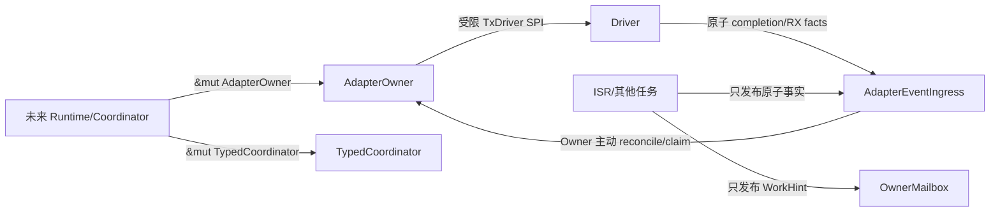
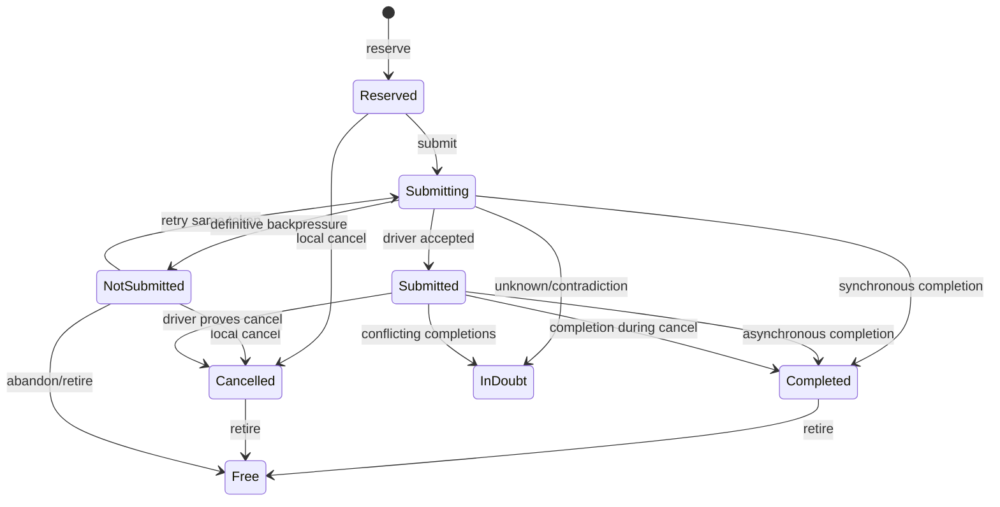

# UCN V6S RUST-02 Owner、Coordinator 与 Adapter Token 实施及自审报告

## 1. 结论

`RUST-02` 已在独立 Rust 实现中完成，并通过本轮分项自审与总体自审：

```ini
RUST-02 = DONE / SELF-REVIEW PASS
RUST-03 = ALLOWED TO START
EXTERNAL REVIEW = DEFERRED UNTIL RUST HOST SOFTWARE COMPLETE
```

本结论只覆盖 Host 软件行为、声明 MSRV 和 Cortex-M 编译目标，不代表真实 MCU、ISR 抢占、Driver、
物理 Bearer、栈水位、性能或生产放行。

## 2. 实施范围

本阶段新增两个 crate：

| crate | 唯一职责 | 明确不负责 |
| --- | --- | --- |
| `ucn-owner` | 单写 Owner 基础、Callback Gate、Mailbox、typed Coordinator | Wire、Driver、Runtime、业务 FSM |
| `ucn-adapter` | Link Handle、TX/RX Token、Driver Facts ingress 和 Adapter Owner | Endpoint、Route、Security、业务重试策略 |

同时扩展 `ucn-types::Error` 为与 C99 公共错误语义一致的固定 `repr(i32)` 分类，供后续模块统一使用。
没有引入 FFI、第三方 crate、堆分配或异步 Runtime。

## 3. 顶层所有权结构



关键约束是：Driver 和 ISR 永远拿不到 `&mut AdapterOwner`。正常协议状态只能由持有 `&mut self`
的单一 Owner 改写；异步上下文只能发布受 Token/Generation 绑定的事实。

## 4. `ucn-owner` 实施

### 4.1 Callback Gate

`CallbackGate` 是 caller-owned 原子门，不使用进程级全局变量。一次进入必须携带完整
`CallbackClaim`：

```text
owner_instance
operation_id
operation_generation
operation_kind
```

成功后签发同时绑定 `gate_instance + lease_generation + claim` 的 `CallbackLease`。退出只接受该精确
Lease；错 Gate、错 Claim、过期 Lease、并发第二进入者和代际耗尽都失败关闭。过渡态保守视为活动，
不向调用方暴露半写 Claim。

### 4.2 Owner Mailbox

`OwnerMailbox` 只承载五类工作提示：Completion、Invalidation、Cancel/Retire、Timer、Request。它不是
业务真相；真正状态仍从 Owner 固定槽读取。

- 多发布者使用原子饱和计数，不丢失未达到 `u32::MAX` 的 occurrence；
- 单消费者通过原子 take gate 防止两个 Owner 同时取走工作；
- 跨调用持久 rotating cursor 防止固定从槽 0 扫描造成饥饿；
- 单次 `take()` 只取一类合并提示，后续预算由未来 Runtime 决定。

### 4.3 Typed Coordinator

`TypedCoordinator<R,E,SLOTS>` 是固定容量单写依赖路由器：

- `R` 保存完整 canonical requirement；只有 `Eq` 精确成立才复用；
- digest 不参与相等判断，因此同摘要、不同内容不会错绑；
- Handle 绑定 Coordinator Instance、Slot 和不回绕 Generation；
- completion 是 immutable event；相同重复幂等，不同终态拒绝；
- Pending 只能 cancel，Completed 只能 retire；
- 退休保留槽位 Generation 高水位，旧 Handle 不能操作复用槽。

## 5. `ucn-adapter` 实施

### 5.1 Link 与 TX Token 身份

Link Handle 精确绑定：

```text
adapter_instance
link_slot
link_handle_generation
link_instance_generation
```

TX Token 再增加 `tx_slot + token_generation`。任何实例、槽位或代际不匹配都不能被完成、取消、
查看或退休。

### 5.2 TX 状态机



`NOT_SUBMITTED` 只证明 Driver 没有产生物理副作用，因此保留原 Token 供未来 Runtime 使用同一
Attempt、Origin Sequence 和 Deadline 重试。`UNKNOWN` 或冲突事实不能伪装为失败终态，而是进入
`IN_DOUBT` 并围栏对应 Link。

### 5.3 同步早到与并发 completion

每个 TX 槽在调用 Driver 前先 arm completion latch。Driver 在 `submit()` 内同步发布 completion
时，事实先落入 ingress；Owner 在 Driver 返回后统一合并：

- `SUBMITTED + terminal`：terminal 成立；
- `COMPLETE(x) + terminal(x)`：幂等成立；
- `NOT_SUBMITTED + terminal` 或两个不同 terminal：进入 `IN_DOUBT`；
- 相同异步重复 completion：幂等；
- 过期 Token：拒绝，不能完成已复用槽。

per-slot 原子门把 Token 字段校验和 terminal 写入放在同一临界域，防止 retire/reuse 与迟到 ISR
形成 ABA。该门非阻塞，竞争者得到 `Error::State` 并由平台决定重试或重新唤醒 Owner。

### 5.4 Link reopen 与未知旧事务

Link reopen 只接受严格更大的物理实例代际和不回绕 Handle Generation：

- 旧 `RESERVED/NOT_SUBMITTED` 可确定为 Cancelled；
- 旧 `SUBMITTING/SUBMITTED/IN_DOUBT` 封存为 `Failure(InDoubt)`，旧物理实例失效后可退休；
- 若迟到的精确 completion 到达，它可以替换封存的未知结果；
- 旧 Token 的迟到冲突绝不重新围栏新 Link 实例；
- 已 claim RX 未退休时拒绝 reopen，避免调用方持有的帧所有权被撤销。

### 5.5 RX 原子所有权

每个 RX 固定槽同时拥有：

```text
完整 frame bytes
frame length
Link Handle / Link Instance Generation
timestamp_us
sender_discriminator
RX slot generation
```

因此不存在“Frame Ring 与 Timestamp Sidecar Ring 靠顺序配对”的错位路径。Driver 发布遵循
`FREE → WRITING → READY`；Owner claim 后为 `CLAIMED`，精确 Token retire 后才回到 `FREE`。

- RX 未启用、旧 Link、空帧、超 MTU、容量满和代际耗尽均明确拒绝；
- 输出缓冲区不足时不 claim，输出哨兵和 Ready 槽均保持不变；
- copy 完成后返回的 View 与 Frame 来自同一槽；
- Link reopen 会清理尚未 claim 的旧 Ready 项，竞态迟到项在 claim 时按代际再次拒绝。

## 6. 分项自审发现与修正

| 自审项 | 初始问题 | 修正 |
| --- | --- | --- |
| SR-02-01 | RX slot generation 达到 `u32::MAX` 后最终返回 `NO_SPACE`，虽不回绕但原因不精确 | 记录 generation exhausted，未找到其他可用槽时返回 `EXHAUSTED` |
| SR-02-02 | 初版 Link reopen 后旧 `IN_DOUBT` 无法退休，固定 TX 槽可能永久泄漏 | 旧实例失效时封存 unknown terminal，并允许迟到精确证明替换 |
| SR-02-03 | 旧 Token 迟到冲突可能尝试围栏其历史 Link Handle | 围栏前精确核对当前 Link 代际；历史 Token 不能改写新 Link |
| SR-02-04 | Owner 在 Driver 返回后若借用 completion writer gate，竞争失败可能遗失 Driver 返回事实并停在 `SUBMITTING` | Owner 只原子观察 immutable latch；写入、disarm 和槽复用继续经 per-slot gate 串行化 |
| SR-02-05 | 两个 Gate 若误配相同数值 ID，纯字段 Lease 可能跨对象同形 | Lease 加入签发 Gate 的生命周期引用并核对对象身份，且不能活过 Gate |

## 7. 回归矩阵

### 7.1 Owner/Coordinator

1. 精确 Claim 进入、同步重入拒绝、错 Gate/旧 Lease 退出拒绝；
2. 八线程同时进入只有一个获胜者；
3. Mailbox occurrence 合并与跨类别游标公平；
4. 四线程共发布 4000 次提示，计数不丢失；
5. Coordinator exact requirement、同摘要不同内容、固定容量、重复/冲突 event；
6. cancel/retire、旧 Handle、槽复用和 Generation 终值不回绕。
7. 相同数值 ID 的两个 Gate 仍不能交叉使用 Lease。

### 7.2 Adapter

1. 配置容量和实例绑定；
2. TX/RX/Link Generation 终值不回绕；
3. 同步早到 completion；
4. 两次 `NOT_SUBMITTED` 后同 Token 第三次成功；
5. 冲突 completion 围栏和 Link reopen 恢复；
6. local cancel、Driver 拒绝取消、取消期间 completion；
7. TX 固定容量满载且既有槽不变；
8. RX disabled、原子 frame/meta、输出不足零写、精确 retire；
9. RX 容量满、旧 Link generation、reopen 后只交付新帧；
10. 八线程相同 completion 幂等收敛；
11. Unknown submit、旧实例封存和迟到精确证明；
12. 四线程 RX publication 的 frame/meta 不交叉；
13. 大小不同的 ingress 不改变 Owner 大小，证明 Owner 不复制 Frame Array。

## 8. 验证结果

| 门禁 | 结果 |
| --- | --- |
| 当前 Rust Host Debug | `34/34 PASS` |
| 当前 Rust Host Release | `34/34 PASS` |
| Rust 1.85.0 MSRV Host | `34/34 PASS` |
| 当前/MSRV Clippy `-D warnings` | PASS |
| MSRV rustdoc `-D warnings` | PASS |
| `thumbv7em-none-eabi` | 当前与 MSRV 均 PASS |
| `thumbv7em-none-eabihf` | 当前与 MSRV 均 PASS |
| 正常依赖树 | 仅 4 个工作区 crate，第三方 0 |
| 生产 `std/alloc/Vec/Box/String/unsafe` 扫描 | 0 |
| C Full fresh | `47/47 PASS` |

## 9. 未完成边界

下列内容没有被本报告证明：

- RUST-03 Runtime、Endpoint、静态 Path、Q0～Q3 队列和完整单帧通信；
- 真实 RTOS 中断优先级、SMP 内存模型和 Driver 回调时序；
- ESP32-S3/RISC-V/其他目标编译与板上执行；
- 真实 CAN/UART/Wi-Fi/USB Bearer；
- 任务栈水位、Flash/RAM map、吞吐、延迟、功耗和长稳；
- Persistence、Security、Admission、Route、Transfer 或可选扩展模块。

因此 `RUST-02` 完成只允许开始 `RUST-03`，不得表述为 Rust 版协议已经可用或可发布。
