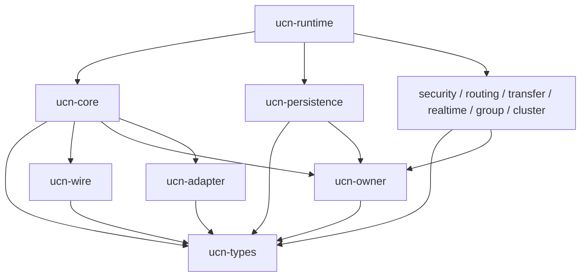

# UCN v6 简化版 Rust 独立实现总体设计

> 文档状态：`RUST-05 / DONE / SELF-REVIEW PASS`
>
> 对应分支：`v6-simplified-rust`
>
> 基线：C 简化版 `IMPL-02 = DONE / EXTERNAL REVIEW GO（受限 Host 软件范围）`

## 1. 目的

本项目新增一套 Rust 实现，用于验证 UCN v6 简化协议能否在保持 MCU-first、固定内存、低 Wire
开销和可裁剪模块边界的前提下，获得更强的类型、生命周期和并发安全。

Rust 版不是新协议版本，也不是 C 版包装器。C 与 Rust 必须遵守同一份语言无关协议合同：

```text
协议 RFC / Wire Registry / Golden / Negative / 恢复矩阵
                         │
             ┌───────────┴───────────┐
             │                       │
        C99 独立实现             Rust 独立实现
             │                       │
             └───── 互操作与差分门禁 ─────┘
```

任何一份实现的当前行为都不能单独反向修改协议规范。发现实现冲突时，先停止编码，回到冻结合同裁决。

## 2. 目标与非目标

### 2.1 目标

1. 默认 `#![no_std]`，不依赖操作系统和堆分配。
2. 所有容量编译期确定，达到上限后失败关闭，不驱逐安全状态。
3. 保留单一 Protocol Owner、Coordinator 编排和模块 Owner 边界。
4. 与 C 版逐字节 Wire 互通，拥有独立 Encoder、Decoder 和状态机实现。
5. Feature OFF 时对应状态、符号、依赖和 Wire 终止能力同时消失。
6. 将 `unsafe` 集中在 Port/HAL 边界；协议 crate 默认禁止 `unsafe`。
7. Host、Cortex-M 和后续 ESP32-S3 使用相同协议核心，不建立 Host 特权路径。

### 2.2 非目标

1. 不把 C API 逐函数翻译成 Rust API。
2. 不通过 FFI 调用 C 版完成协议处理。
3. 不使用 `serde`、`bincode` 或 Rust 内存布局作为线上格式。
4. 不默认引入 Tokio、Embassy 或其他异步 Runtime。
5. 不在 `RUST-00` 实现正式 Wire、路由、安全、持久化或簇状态机。
6. 不因 Rust 类型安全降低密码、掉电、物理链路和实机验证要求。

## 3. 权威关系

Rust 实现的输入优先级固定为：

1. V6 最终协议架构 RFC；
2. V6S-00 冻结合同；
3. Wire Registry、Golden、Negative 和持久化恢复矩阵；
4. 全局不变量与 Owner Connection Registry；
5. 已外审通过的模块专项合同；
6. C 版实现，仅作为差分证据和错误案例来源。

三类测试必须区分：

| Oracle | 作用 | 不能证明什么 |
| --- | --- | --- |
| 规范 Golden/Negative | 决定唯一线上字节和非法输入 | 完整状态机正确性 |
| C↔Rust 差分 | 找到实现分歧 | 两边没有复制同一错误 |
| Rust 独立属性/故障测试 | 验证 Rust 所有权与状态机 | 真实 MCU/Flash/射频行为 |

## 4. Workspace 与 crate 边界

```text
rust/
├─ Cargo.toml
├─ rust-toolchain.toml
└─ crates/
   ├─ ucn-types          # 无行为基础类型
   ├─ ucn-wire           # C0～C5 严格 Codec
   ├─ ucn-owner          # Owner/Fence/Handle/Generation
   ├─ ucn-adapter        # Driver Facts、RX/TX Token
   ├─ ucn-core           # 基础队列、Endpoint、静态通信
   ├─ ucn-persistence    # Record/Journal/Witness/Recovery
   ├─ ucn-security       # Session、认证、加密
   ├─ ucn-identity       # Authority、Lease 与 Binding
   ├─ ucn-admission      # 动态 Bootstrap/JOIN
   ├─ ucn-capability     # Capability、Profile 与 Resolver
   ├─ ucn-routing        # SoftRoute、Discovery、Flow
   ├─ ucn-transfer       # Reliable、Fragment、Operation
   ├─ ucn-realtime       # 可选实时和时间同步
   ├─ ucn-group          # 可选群组通信
   ├─ ucn-cluster        # 可选簇管理
   ├─ ucn-runtime        # 选定模块的 Coordinator 装配
   └─ ucn-testkit        # Fake Driver/Provider 与 Oracle
```

`RUST-00` 只创建 `ucn-types` 与 `ucn-wire` 的空行为边界。其余 crate 必须随对应任务逐个加入，禁止
预建空壳后宣称模块已经支持。

## 5. 依赖方向



模块 Owner 不直接调用另一个模块 Owner。跨模块 Requirement/Event 必须由 Runtime Coordinator
路由。Driver 和 Provider 只能通过各自 Adapter 发布完成事实。

## 6. `no_std`、内存和资源合同

默认 Feature 下禁止：

- `extern crate alloc`；
- `Vec`、`Box`、`String`、哈希表或运行期增长容器；
- 递归协议处理；
- 无界 iterator 收集；
- 无界队列扫描；
- 在回调中借用可变 Runtime 再次进入公共写 API。

每个 Profile 由生成配置给出精确容量。实现可以使用固定数组、位图和带显式长度的 slot 表；是否
采用第三方 `heapless` 必须另行审计其 MSRV、panic、代码尺寸和审计面，`RUST-00` 不引入依赖。

每个模块必须输出 `size_of`/`align_of`、固定队列/slot、Host 与目标 Flash/RAM、最大调用栈或
实机任务栈水位，以及 Feature OFF 前后差值。

## 7. 执行与并发模型

Rust 不使用共享可变全局状态。默认运行模型仍是单一写 Owner：

```text
ISR/Driver/Provider
       │ 原子事实、token、generation
       ▼
固定槽/队列 ──唤醒提示──> Protocol Owner
                              │
                              ▼
                         Coordinator
                              │
                     每模块有界 step/budget
```

通知允许合并或丢失，协议真值必须保存在 token、slot 或 durable record 中。低频维护 step 负责发现
遗漏的 wakeup 和到期状态。

```text
fn step(runtime, now, budget):
    require runtime.owner.try_enter()
    facts = adapter.take_bounded_facts(budget.fact_cap)
    coordinator.route(facts)
    coordinator.step_classes_with_rotating_cursor(now, budget)
    runtime.owner.leave()
```

Rust 借用检查不能代替 ISR/SMP 原子协议、临界区和硬件内存屏障。跨中断状态必须使用已审计的
Port 原语。

## 8. Wire 实现合同

Rust Codec 必须：

1. 手工按冻结 offset 和 big-endian 读写；
2. 先完整校验，再写输出；
3. 拒绝输入/输出的完整或部分别名合同违规；
4. 不依赖 `repr(Rust)`、结构体转字节或宿主字节序；
5. raw→typed 与 typed→raw 使用独立 fixture；
6. 先通过冻结 Golden，再允许 round-trip；
7. 任何保留值、错误长度、非法 C/O/H 组合均失败且输出不变。

```text
encode(value, output):
    validate_every_field(value)
    validate_exact_output_length(output)
    write_to_local_fixed_staging()
    copy_staging_to_output_once()
```

## 9. Persistence 合同

Rust Persistence 必须独立实现但保持相同 96 B Envelope、16 B Marker、摘要、Witness 和恢复结果。
禁止调用 C Foundation，也禁止根据 C 结构体布局序列化。

恢复由共享原始槽 fixture、C↔Rust 介质镜像差分和 Rust 独立掉电/撕裂测试共同验证。真实 Flash
原子性仍必须在目标硬件证明，Host 文件或内存 Provider 不构成掉电证明。

## 10. Security 与密码边界

Security crate 只接受显式 Suite/Key/Generation、canonical AAD 和调用方固定 workspace。密码实现
通过受控 Provider trait 注入；Feature OFF 不保留密钥槽、Replay 窗口或密码依赖。

密码 Provider 是允许 `unsafe` 的外部边界之一，但安全协议 crate 仍保持 safe Rust。任何
Provider callback 重入、同步早到、异步 token 错绑或 buffer overlap 必须在首次 sequence reserve
之前拒绝。

## 11. Feature 与 Profile

Cargo Feature 表达静态组合，不表达线上协议版本。初始规则：

- `default = []`；
- `std` 只用于 Host Adapter、日志和测试；
- `alloc` 不作为 MCU 协议核心依赖；
- `security`、`routing`、`transfer`、`realtime`、`group`、`cluster` 分别独立；
- 非法 Feature 组合在编译期拒绝；
- 关闭模块后仍能透明转发的能力由 Wire Contract 决定，不能解释为本地支持该模块。

Nano/Lite/Full 由受审 Manifest 生成容量和值域常量，不是任意 Cargo Feature 集合。

## 12. 错误、panic 与故障

协议公共路径返回定宽、稳定的错误分类，不以字符串决定行为。产品构建要求 `panic=abort`，但正常
外部输入、容量耗尽、时间到期和 Provider 错误不得依靠 panic 处理。

no-wrap 耗尽、durable high-water 损坏、Provider 违反 completion、冲突事实和无法证明的持久化
历史必须进入显式错误或 Fault。

## 13. `unsafe` 规则

当前两个基础 crate 使用 `#![forbid(unsafe_code)]`。未来只有 MMIO/DMA/ISR、RTOS/HAL、必要 C ABI
和经审计的锁/原子 Port 可以申请例外。每个 `unsafe` 块必须紧邻写出安全前提并具备 Host 模型、
目标编译和实机测试；协议状态机、Wire 和 Persistence 选择逻辑不得用 `unsafe` 绕过所有权合同。

## 14. 验证矩阵

```text
cargo fmt --all --check
cargo clippy --workspace --all-targets -- -D warnings
cargo test --workspace
cargo check --workspace --target thumbv7em-none-eabi
cargo check --workspace --target thumbv7em-none-eabihf
```

后续增加 Miri、fixed-seed fuzz/property、C↔Rust Golden/Negative/Record/状态差分、map/size/stack
资源门禁，以及 ESP32-S3 编译、烧录、六板互通、故障和长稳。

## 15. 实施顺序

| 任务 | 内容 | 放行条件 |
| --- | --- | --- |
| RUST-00 | 总体合同与空行为 Workspace | Host/Cortex-M 编译，零正式协议行为 |
| RUST-01 | Types、Registry、C0/C1 Wire | 共享 Golden/Negative 与 C 互通 |
| RUST-02 | Owner、Coordinator、Adapter Token | 重入、并发、同步早到与资源门禁 |
| RUST-03 | 最小静态通信 | 单帧 TX/RX、Endpoint、四级队列 |
| RUST-04 | Persistence Foundation | Record/Witness/恢复差分与故障矩阵 |
| RUST-05 | Security Session | 认证、加密、Replay、Key Generation |
| RUST-06 | Admission 与 Capability | Bootstrap/JOIN、租约、Profile 协商 |
| RUST-07 | 自动路由 | SoftRoute、RREQ/RREP/RERR、Flow |
| RUST-08 | Reliable/Transfer/Service | Receipt、重试、分片、Operation |
| RUST-09 | Realtime/Group/Cluster | 三个独立可选模块和 Feature OFF |
| RUST-10 | 双实现与硬件闭环 | C↔Rust、MCU、Flash、Bearer、长稳 |

每项均执行分项自审；全部 Host 软件完成后执行至少两轮不同顺序的全体自审，再送外部审计。

## 16. RUST-00 验收条件

1. 分支从已外审通过的 C IMPL-02 基线建立。
2. Workspace 在 Host、`thumbv7em-none-eabi` 和 `thumbv7em-none-eabihf` 编译通过。
3. `ucn-types`、`ucn-wire` 默认 `no_std` 且禁止 `unsafe`。
4. 没有正式 Encoder/Decoder、状态机、Driver 或 Provider 行为。
5. 没有第三方 crate、动态内存或异步 Runtime。
6. 任务表和操作记录明确 C/Rust 共用规范、实现相互独立。
7. 当前没有宣称 ESP32-S3、实机、密码或掉电证明。

满足上述条件只能放行 `RUST-01`，不能宣称 Rust 协议已经可用。

## 17. RUST-01 实施边界与结果

RUST-01 已将 V6S-00-02/03/04 的基础标量、Registry、C0 与 C1 Core Wire 映射为独立 Rust
实现。为了保持 Security Owner 的唯一所有权，本阶段仅公开 `encode/decode_*_o0_h0`：

- C0/C1 的 Common Header、地址宽度、big-endian offset 和基础长度已经实现；
- C0 Bootstrap 与已绑定地址域分开校验；
- C1 Data、Control、Diagnostic 和固定 Fragment/SACK subtype 已做 raw 结构校验；
- O1/O2/H1 不接受调用方直接提供伪 Tag，而在 RUST-05 由唯一 Security Context 产生 sealed frame；
- semantic policy 仍由后续 Operation、Transfer、Admission 和 Security Owner 完成，raw 合法不代表
  业务可执行。

共享 Oracle 位于 `rust/tests/conformance/v6s_wire_core_v1.h`。C1 的 C/Rust Codec 使用同一份 4 个
地址宽度 Golden 与 6 个 Negative 常量；C0 使用冻结 A1 Bootstrap Golden，并由独立 Python Wire
Oracle 逐字段重建。RUST-01 自审报告记录于
`docs/08-实现与验证/版本演进/UCN_V6S_RUST_01_基础类型Registry与C0C1_Wire实施及自审报告.md`。

RUST-01 完成不表示安全、Adapter、Runtime 或实机已经完成，只解除 RUST-02 的顺序阻塞。

## 18. RUST-02 实施边界与结果

RUST-02 已实现 `ucn-owner` 与 `ucn-adapter` 两个独立 `no_std` crate，但尚未建立 Runtime、
Endpoint 或业务发送 API：

- Owner 状态只能经 `&mut self` 修改；任务/ISR 只能向 caller-owned 原子 Mailbox 或受限 Event
  Ingress 发布事实；
- Callback Gate 使用精确 Owner/Operation/Generation/Kind Claim 和不可回绕 Lease，拒绝递归、错门、
  旧 Lease 及并发第二进入者；
- Coordinator 只路由 typed Requirement/Event，保留完整 canonical requirement；摘要不得代替精确相等；
- Adapter TX Token 精确绑定 Adapter、Slot、Token Generation、Link Slot、Link Handle Generation
  和 Link Instance Generation；
- Driver 只实现最小 `TxDriver` SPI，并只能持有 `AdapterEventIngress`；它无法取得
  `&mut AdapterOwner`，因此同步 completion 可以到达但不能递归控制 Owner；
- RX Frame 与 Link/时间戳事实由同一固定槽拥有并一起 claim/retire，不依赖两个 Ring 的顺序配对；
- `NOT_SUBMITTED` 保留同一 Attempt/Token 供上层有界重试；`UNKNOWN` 或矛盾事实进入
  `IN_DOUBT` 并围栏旧 Link；Link 实例重开后未知旧事务可安全退休，迟到精确证明仍可收敛；
- 所有容量由 const generic 在编译期确定，达到上限不驱逐，代际终值不回绕。

RUST-02 的详细代码—测试—边界映射见
`docs/08-实现与验证/版本演进/UCN_V6S_RUST_02_Owner_Coordinator与AdapterToken实施及自审报告.md`。
本阶段完成只解除 RUST-03 的顺序阻塞；没有证明最小静态通信、真实 Driver/ISR 时序、目标 MCU
资源或生产可用性。

## 19. RUST-03 实施边界与结果

RUST-03 新增独立 `ucn-core` crate，在 RUST-01 的 C1/O0/H0 Codec 和 RUST-02 的 Owner/Adapter
基础上完成最小静态通信闭环：

- `CoreNode` 只接受可信静态 O0 网络配置，启动前安装静态 Peer Binding、Endpoint 与单跳 Path；
- `publish()` 在分配 Origin Sequence 前完成目标、Binding Generation、Path、队列、MTU 和 Deadline
  预检，失败不消耗 Sequence、不驱逐队列项；
- TX 使用四个固定分区和跨调用持久化的十二槽 `6:3:2:1` 调度表，同 Class 内按 Origin Sequence
  选择最老请求；Adapter 暂时无槽时保留当前队列和调度位置；
- `NOT_SUBMITTED` 重用精确 Adapter Token、Origin Sequence 和 Frame；`UNKNOWN/IN_DOUBT` 等无法证明
  的 Driver 副作用使 Core 进入 Fault；
- RX 原子 claim `{frame, link, timestamp, sender}`，严格解码并检查本机目标、静态 Source Binding、
  Endpoint 和易失 64 位 Replay Window 后才进入受控回调；未知 Endpoint 不提前消耗 Replay；
- stop 先通过 Adapter 的 RX publication 原子门关闭新输入，再以调用方预算取消/退休固定槽，最终到达
  Quiescent；停止期间拒绝新业务，Quiescent 可显式重启；
- Endpoint/Path Handle 绑定实例、槽位和不回绕 Generation，删除重建后旧 Handle 永久失效。

本阶段分项自审主动关闭六个实现期问题：RX 停止门与 publication 分配必须共用原子临界区，且删除
可绕过该证明的旧 RX setter；Adapter
暂时满载不得消耗调度游标；一次 `step` 的最后清空检查不得突破预算；Callback Gate 已有 `u32`
租约代际，不得再用 `u16` 回调次数让长运行节点在 65,535 次 RX 后错误耗尽；`publish()` 必须在
分配 Sequence 前通过只读 Adapter 快照复核静态 Path 的 Link Generation 与当前 MTU。

验证结果包括 Rust Host Debug/Release/MSRV 1.85 的 47 项测试、65,537 帧回调长运行与 12,000 次
持续补队列公平压力、Clippy
与 rustdoc `-D warnings`、两个 Cortex-M `no_std` target，以及 C Full fresh 47/47。Host 上
`CoreNode` 固定对象尺寸为 Nano 5,976 B、Lite 16,920 B、Full 58,264 B；该数字不等于 MCU 的最终
RAM/栈/Flash 证明。

RUST-03 只解除 RUST-04 的实施顺序阻塞。Persistence、Security、Admission、动态 Route、可靠
Transfer、Realtime、Group、Cluster、ESP32-S3 与真实 Bearer 均未由本阶段实现或放行。详细证据见
`docs/08-实现与验证/版本演进/UCN_V6S_RUST_03_最小静态通信实施及自审报告.md`。

## 20. RUST-04 实施边界与结果

RUST-04 新增独立 `ucn-persistence` crate，按同一冻结合同重新实现，而不是包装或链接 C archive：

- Record 使用 96 B big-endian Envelope 与槽尾 16 B Commit Marker；正文 CRC32C、Header CRC32C、
  BLAKE2s-128 Body Digest 和 Durable Manifest Digest 均由 Rust 安全代码独立计算；
- `PersistenceOwner<DOMAINS, BODY, SLOT>` 的 Domain、双槽、写入/回读 scratch、恢复正文和请求全部是
  const generic 固定数组，不分配堆内存；
- 提交严格沿 `inactive write → readback → marker → witness → reload witness/slots → select → proof`
  单向推进，业务状态只能消费 reload 后、精确绑定 Domain/Owner/Generation/Transaction 的 proof；
- Provider 的同步完成与 `PENDING → poll` 共用一套 exact completion 校验，Token、Phase、Slot、完整
  字节数和 Blob State 任一不一致均失败关闭；共享原子 Gate 阻断跨 Owner 回调重入并分配不回绕 Token；
- 恢复只接受 Witness 精确代；补推进仅允许 Factory `0→1`，或同时保留相邻前驱/后继且 Transaction
  严格递增的 `n→n+1`；坏 Marker、坏摘要、跳代、同代、缺前驱和 Transaction 相等/回退均 Fault；
- required Domain 故障使 Owner Fault；optional Domain 独立 Fault 后，其他 required Domain 仍可恢复；
  每个 Domain 同时至多一个请求，Handle/取消/退休和半开 Deadline 均受固定状态机约束。

C/Rust 共享 Oracle 覆盖 BLAKE2s-128、Nano/Lite/Full Manifest Digest、Body Digest 及完整 115 B
Record image。Host 故障注入覆盖六个 Provider 阶段的同步/异步完成、五类 completion 错配、读回破坏、
torn Marker、Witness 补推进、每个提交掉电窗口、精确重放和多 Domain 隔离。当前 Host 类型尺寸为
Nano 3,968 B、Lite 9,072 B、Full 25,424 B；这些是静态布局证据，不是目标 MCU 栈或 Flash 实测。

RUST-04 只解除 RUST-05 的实施顺序阻塞。Host Fake Provider 不能证明真实 Flash 的 Marker 原子性、
独立 Witness 物理隔离、掉电行为或磨损寿命；Security、Admission、动态 Route、可靠 Transfer、
Realtime、Group、Cluster 与 ESP32-S3 仍未由 Rust 实现完成。详细证据见
`docs/08-实现与验证/版本演进/UCN_V6S_RUST_04_Persistence_Foundation实施及自审报告.md`。

## 21. RUST-05 实施边界与结果

RUST-05 新增独立 `ucn-security` crate，并保持 `no_std`、禁止 `unsafe`、固定容量和零第三方依赖：

- `SecurityOwner<SESSIONS,REPLAY_SLOTS>` 唯一拥有 Peer Session、Key selector、密码 Replay
  Window 与活动/围栏状态；其他模块只能持有不可构造的 `SessionHandle`；
- 静态握手候选精确绑定双方 Principal/Binding、Link/Session/Policy/Key Generation、Suite、
  Origin/Hop Context fingerprint、绝对到期时间与 transcript；密码 Provider 必须验证完整候选；
- 新 Session 先生成 192 B canonical Record 和 typed Persistence requirement，只有精确绑定的
  reload proof 才能将 `AWAITING_DURABILITY` 原子发布为 `ACTIVE`；高代 Session 发布时围栏旧代；
- C0～C3 当前受保护路径实现 O1 HMAC-SHA-256-128、O2 AES-128-GCM/ChaCha20-Poly1305 Provider
  边界、H1 HMAC-SHA-256-96 与 C2/H2 Combined Proof；所有 canonical AAD、Nonce、Tag 和长度均
  对冻结 Wire Oracle；
- C1 Origin Sequence、C0 Transaction ID 与 Hop Sequence 仍由各自唯一字段 Owner 提供；在密码
  Provider 首次观察 Key/Nonce 前不可逆 burn，Provider 失败不复用；纯结构错误在 burn 前拒绝；
- RX 先认证/解密，再执行精确 Principal、Binding、Context、Service、Opcode、方向 ACL，然后只
  reserve Replay mutation；Coordinator 预留完业务资源后才 `commit`，失败则 `abort`；
- exact duplicate 只返回 Session/Key/Context/AAD/Payload digest 证据，不再次暴露明文，也不由
  Security 越权声称业务重复；遗失的 reservation 由持久游标和显式预算在半开 Deadline 清理；
- H1 暂时关闭时，Record 仍保留 TX/RX Hop Key Generation 高水位；以后重新启用必须严格递增，
  删除/降级 Profile 不能释放旧 Key ID/Generation 的防 ABA 约束。

本阶段刻意不把 C4 当作普通 Peer Session：C4 Routed Origin 必须等 RUST-07 的 Flow Owner 提供
独立 Origin 与逐跳 Context。H3 只在 Provider trait 保留密码原语，活动 Session 明确拒绝它，因为
H3 唯一属于 RUST-09 的 C5 Group/Tree Security。`ucn-core` 的 O0/H0 静态路径也没有被暗中升级为
安全 Runtime；后续 Runtime Coordinator 必须显式组合两个 Owner。

验证包括 80 项 Rust Workspace Debug/Release/MSRV 测试、Clippy 和 rustdoc `-D warnings`、两个
Cortex-M `no_std` target、10 条独立密码 Wire Oracle 与 C Full fresh 47/47。Host 固定对象尺寸为
Nano 2,368 B、Lite 11,120 B、Full 32,176 B；256/512 B Payload workspace 分别为 984/1,752 B。
这些数字不是 ESP32-S3 的 Flash、调用栈、任务栈或性能证明。

RUST-05 只解除 RUST-06 的实施顺序阻塞。Dynamic Admission、Bootstrap/JOIN、Capability、生产
密码库/安全元件、真实 Flash 防回退、随机数质量、侧信道、物理 Bearer 和 MCU 实测均未完成。
详细证据见
`docs/08-实现与验证/版本演进/UCN_V6S_RUST_05_Security_Session实施及自审报告.md`。

### 13.6 RUST-06 已实现边界

RUST-06 将原先概括为单一 Admission crate 的职责拆成三个单写 Owner：

- `ucn-identity`：Address Authority、保守 Lease Deadline、Binding Certificate、持久化
  Requirement 与 reload proof 后发布；
- `ucn-admission`：只处理 UNBOUND 节点的 Cookie、Bootstrap/JOIN transcript、严格阶段 FSM、
  固定 pending 与有界分片重组；
- `ucn-capability`：只保存当前认证 Peer 的 Capability 事实，并提供 Profile 交集和无副作用
  Contract Resolver。

三者不直接调用彼此的 Owner，也不直接调用 Persistence、Adapter 或 Driver。跨边界只传私有
来源字段约束的不可变 `BindingView`、`AuthenticatedPeerView`、`PersistenceProof` 和 typed
Requirement。缓存事实不等于实时权限；后续 RUST-07/08 的 Coordinator 在每次使用前仍必须按
当前 Session、Binding、Capability、Path 和资源快照重验。

验证包括 100 项 Rust Workspace Debug/Release/MSRV 测试、Clippy、rustdoc `-D warnings`、两个
Cortex-M `no_std` target、7 条独立 Admission/Capability Wire Oracle 与 C Full 47/47。Host
固定对象尺寸为 Identity `2832/7440/13584 B`、Admission `1264/4912/9776 B`、Capability
`472/1528/2936 B`（Nano/Lite/Full），单个 Bootstrap Reassembly 为 576 B。

RUST-06 只解除 RUST-07 的实施顺序阻塞。统一动态 Runtime 编排、自动路由、可靠投递、生产密码
Provider、真实 Flash/掉电、物理 Bearer、MCU 栈/Flash/性能和实机仍未由本阶段完成。详细证据见
`docs/08-实现与验证/版本演进/UCN_V6S_RUST_06_Admission与Capability实施及自审报告.md`。
