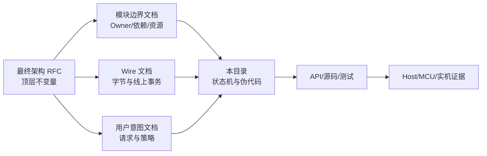

# 00 编写、评审与冻结规则

> 状态：`SELF-REVIEWED / EXTERNAL REVIEW REQUIRED`
>
> 本文负责定义整套逻辑模型文档怎样写、怎样审、怎样冻结。它不定义任何具体协议模块的业务算法。

## 1. 四个成熟度状态

| 状态 | 含义 | 是否允许写生产代码 |
| --- | --- | --- |
| `DRAFT` | 正在讨论，允许改变状态和接口 | 否 |
| `SELF-REVIEWED` | 内部逐项检查完成，但没有独立复审 | 否 |
| `EXTERNAL-REVIEWED` | 独立复审未发现阻断项 | 仍需总架构门禁 |
| `FROZEN FOR IMPLEMENTATION` | 上下游合同一致，可以据此实现 | 是 |

“已经画图”不等于冻结，“代码已有类似实现”也不能反向替代设计审查。

## 2. 文档权威关系



本目录不能修改 Wire 字段含义；发现需要新增字段时，应回到 Wire 文档修改并重新评审。类似地，本目录不能自行改变用户 API 语义或模块硬依赖。

`00～14` 与 `15～26` 不是两份可任选的协议。后者是实现主线，前者是同一合同的完整失败/恢复附录。基础自动路由只有 `RREQ → RREP → SoftRoute`；只有 Advanced Flow 才能使用 `STAGE/STAGE_ACK/COMMIT/COMMIT_ACK/ABORT`。任何文档把 RREP 直接写成授权 Flow、或把 SoftRoute 交给 Pinned/Realtime/Cluster 消费，均属于冻结阻断冲突。第 26 篇集中登记跨模块不变量和 typed dependency，其他文档只能引用，不能另建第二套结果枚举或对接结构。

## 3. 每篇模块文档的固定结构

每篇详细文档应尽量包含：

1. 负责与不负责；
2. 依赖和 Feature OFF 行为；
3. 概念对象和唯一 Owner；
4. 不变量；
5. 状态机；
6. 正常时序；
7. 入口伪代码；
8. 超时、取消和失败回滚；
9. 重启与持久化关系；
10. 固定资源上界；
11. 对抗用例；
12. 与未来源码/API 的映射。

不适用的章节必须写明“不适用及原因”，不能静默省略。

## 4. 伪代码的精度

伪代码必须明确：

- 校验发生在首次写状态和首次外部副作用之前；
- 使用 `<`、`<=` 还是 checked-serial 比较；
- 哪个 Owner 分配 ID、Sequence 和 Generation；
- 错误时输出是否保持不写回；
- 何时建立 pending、何时发帧、何时允许重试；
- 回调前是否已经建立重入门；
- 哪些失败可重试，哪些失败进入 Fence/Fault；
- Request 完成与 Buffer 释放是否为不同事件。

不合格的伪代码：

```text
if valid:
    send()
```

合格的伪代码至少应接近：

```text
send_attempt_submit(runtime, attempt, frame, now):
    require runtime.lifecycle_phase == RUNNING
    require runtime.ingress_active == false
    require attempt belongs_to owner_instance
    require full_preflight_use(attempt.binding, now) == ALLOW
    require output_capacity >= encoded_length

    if atomically try_acquire caller_owned callback_domain_gate fails:
        return BUSY with zero token/continuation/state change
    under Adapter event gate:
        reserve adapter token whose embedded completion_latch is EMPTY
        reserve exact completion continuation
        if either reservation fails:
            rollback unpublished reservation
            release callback_domain_gate
            return NO_SPACE with zero published state
        token.state = SUBMITTING
        token.completion_latch = EMPTY
        continuation = {runtime_instance, attempt_id, token, token_generation}

    runtime.driver_callback_active = true
    result = call_driver_submit(frame, token)  # only inside Adapter Owner
    runtime.driver_callback_active = false
    release callback_domain_gate

    # Driver 可能已在 callback 内把 completion 原子锁存进 token。
    # Driver-completion wakeup queue 只是可丢失 hint；完成真值在 token latch，且不同于用户 Completion Receipt。
    # 返回值和 latch 都只能作为同一提交事实的输入，不能各自完成一次状态转换。
    merge = merge_submit_return_with_latched_event(token, continuation, result)

    if merge == WAIT_FOR_EVENT:
        require exact continuation still active
        mark token as SUBMITTED
        return PENDING

    if merge == TERMINAL_COMPLETE:
        consume exact continuation at most once
        mark token as COMPLETED
        return COMPLETE

    if merge == TERMINAL_NOT_SUBMITTED:
        retire exact continuation and reservation once
        return merge.error

    mark token as IN_DOUBT and fence this Adapter against new submit
    retain the exact token/latch/continuation obligation needed for reconciliation
    return IN_DOUBT
```

共享 callback-domain gate 必须先以原子 try-acquire 成功，再在 Adapter event gate 下发布
`SUBMITTING`、内嵌 completion latch 和 continuation，最后才调用外部 Driver。不能先检查
“gate free”或先发布 token 再抢门；门忙必须返回且没有可观察状态改变。每个可提交 TX token
自带一个不需要额外分配的终态 latch；Driver/ISR 通过 exact token/generation 将事实原子地从
`EMPTY` 改为终态。队列满只允许丢 wakeup，不允许丢 latch。Runtime 会在保留预算内扫描活动
latch，所以完成正确性不依赖通知队列容量。

返回后 Owner 必须在同一 Adapter event gate/原子临界区内读取 exact latch、合并 Driver 返回值并推进 token；不得在“检查 latch”和“`SUBMITTING -> SUBMITTED`”之间留下竞态窗口。因此“回调内已完成、随后 `submit()` 返回 `PENDING`”必须直接走已锁存终态，不能退回 `SUBMITTED`。Runtime 生命周期 phase 不得被 callback 临时改写，callback active 使用正交门表示。

### 4.1 submit 返回值与早到 latch 合并表

`TERMINAL_SUBMITTED` 表示 Driver 已给出“可能已产生物理提交且已不再持有该 token/Buffer”的终态证据；`TERMINAL_NOT_SUBMITTED` 表示可证明零物理副作用。下表是唯一合并规则：

| 回调内 latch | `submit()` 返回 COMPLETE | 返回 PENDING | 返回 NOT_SUBMITTED | 返回 UNKNOWN/非法 |
| --- | --- | --- | --- | --- |
| `EMPTY` | `TERMINAL_COMPLETE` | `WAIT_FOR_EVENT` | `TERMINAL_NOT_SUBMITTED` | `IN_DOUBT` |
| `TERMINAL_SUBMITTED` | `TERMINAL_COMPLETE` | `TERMINAL_COMPLETE` | `TERMINAL_COMPLETE + ADAPTER_CONTRACT_FAULT` | `TERMINAL_COMPLETE + ADAPTER_CONTRACT_FAULT` |
| `TERMINAL_NOT_SUBMITTED` | `TERMINAL_COMPLETE + ADAPTER_CONTRACT_FAULT` | `IN_DOUBT + ADAPTER_CONTRACT_FAULT` | `TERMINAL_NOT_SUBMITTED` | `IN_DOUBT + ADAPTER_CONTRACT_FAULT` |
| `CONFLICT/UNKNOWN` | `TERMINAL_COMPLETE + ADAPTER_CONTRACT_FAULT` | `IN_DOUBT + ADAPTER_CONTRACT_FAULT` | `IN_DOUBT + ADAPTER_CONTRACT_FAULT` | `IN_DOUBT + ADAPTER_CONTRACT_FAULT` |

任一“可能已提交”的证据都禁止将本 Attempt 当作 `NOT_SUBMITTED` 重发。明确 COMPLETE 证据优先于相互矛盾的否定证据，但矛盾本身必须立即 Fence 该 Adapter；对同一 token/generation 的完全相同重复 latch 幂等接受，不同终态则原子标记 `CONFLICT`。

## 5. 图的职责

| 图类型 | 用来回答 | 不应承载 |
| --- | --- | --- |
| 组件图 | 哪些模块依赖哪些模块 | 字节偏移 |
| 状态图 | 对象可以处于哪些状态、转换条件是什么 | 跨对象完整时序 |
| 时序图 | 多个 Owner 的调用和副作用顺序 | 全部字段约束 |
| 数据流图 | Frame、Buffer、Handle 流经哪里 | 权威状态转换 |
| 表格 | 字段、Owner、容量和失败码 | 动态先后顺序 |

同一个关键规则应有一个文字/表格权威，图用于帮助理解，不能让文字和图分别定义不同算法。

## 6. 原子性标注

每个伪代码入口应按以下阶段书写：

```text
PRECHECK      只读，失败时零写入、零发送
RESERVE       只预留本地资源，可完全回滚
COMMIT_LOCAL  提交本地状态
SIDE_EFFECT   调用 Driver/Provider 或发送线上消息
CONTINUE      异步完成后的精确 continuation
RETIRE        归还所有资源
```

若算法必须先产生外部副作用才能知道结果，必须明确补偿动作、幂等键和失败终态，不能笼统写“失败则回滚”。

跨 Owner 的“原子提交”不能只写成一句话。文档必须给出共享临界区、reservation bundle 或 persist-before-publish continuation；若 Sequence 已经取得唯一值而后续本地步骤失败，必须明确该值是安全 burn、可证明未发布后 abort，还是事务提交的一部分，禁止含糊地“释放全部资源”。

## 7. 固定内存规则

所有概念对象在冻结前必须给出：

- 编译期最大数量；
- 单项目标 ABI 字节数；
- Owner 扫描上界；
- 表满时的错误和是否允许驱逐；
- 哪些容量为基础预留，不能被 Bulk/诊断消耗；
- 是否进入持久化记录。

不能使用“缓存若干”“保存历史”“必要时扩容”等无界表述。

## 8. 时间规则

所有 Deadline 和 Lease 必须写清：

- 时钟域；
- 单位和位宽；
- `now == deadline` 是否过期；
- 回绕比较限制；
- 量化误差和 uncertainty；
- Owner 在哪个使用点重新验证。

默认使用半开区间：`now < deadline` 有效，`now >= deadline` 过期。偏离时必须在所属文档中单独说明理由。

## 9. Feature OFF 规则

每个可选模块必须选择且只选择一种关闭行为：

```text
NOT_COMPILED      API/符号不出现在产品面
CONFIG_REJECTED   组合在构建或初始化时拒绝
REQUEST_REJECTED  统一 API 存在，但请求在零副作用前拒绝
FALLBACK_DEFINED  使用已经完整定义和测试的较低 Contract
```

“忽略”“尽量工作”“自动降级”都不是有效关闭合同。

## 10. 冻结检查表

一篇文档只有同时满足以下条件，才允许标记 `FROZEN FOR IMPLEMENTATION`：

- 正常、超时、取消、重试、重启流程全部存在；
- 所有线上事务都有唯一事务键；
- 所有本地状态都有唯一 Owner；
- 所有副作用都有 preflight 和 continuation；
- 所有资源都有固定上界；
- Feature OFF 行为唯一；
- 与 Wire、模块和用户意图文档无冲突；
- 对抗用例能区分安全实现与已知错误实现；
- 外部复审结论可追溯到精确文档哈希。
