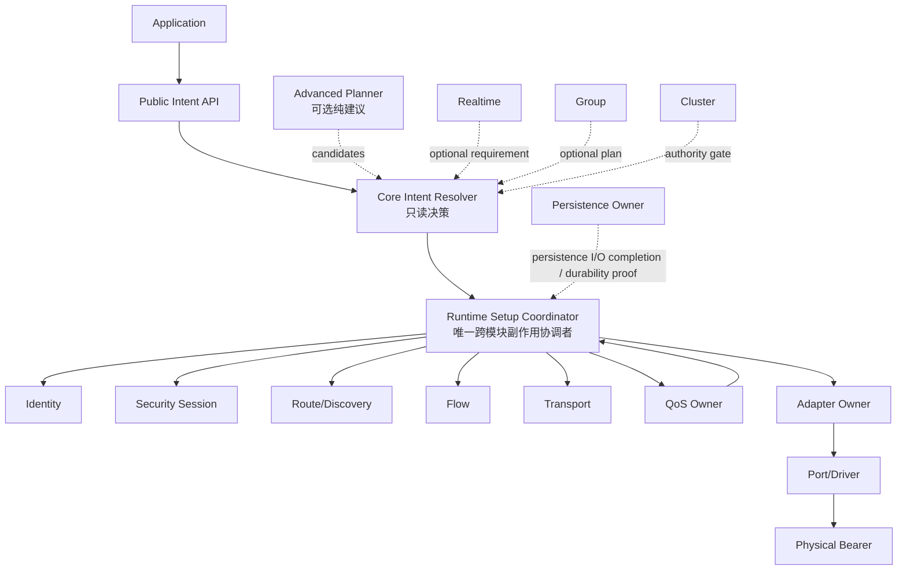
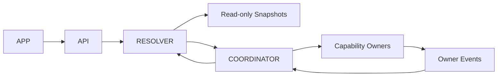
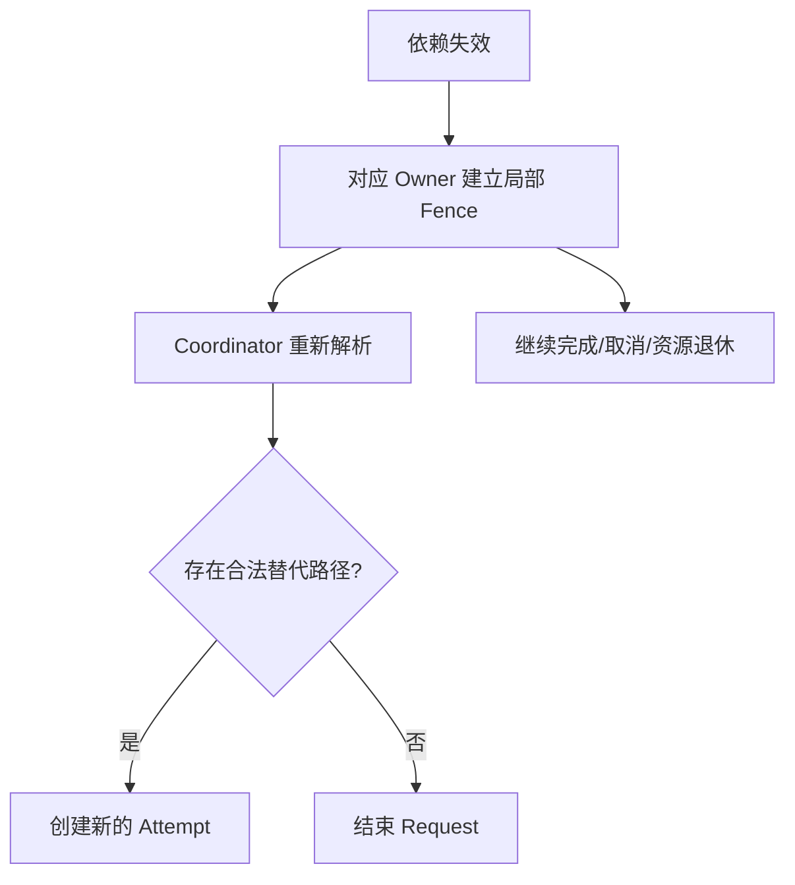

# 01 总体执行模型与模块协作

> 状态：`SELF-REVIEWED / EXTERNAL REVIEW REQUIRED`
>
> 本文负责描述一次用户请求怎样穿过 Resolver、Runtime Coordinator 和各能力 Owner。它不定义精确 Wire 字段，也不定义各模块内部算法。

Capability View、硬门禁次序与 Contract 选择以[第 23 篇](23-Capability与Contract-Resolver简化设计.md)为准；基础 SoftRoute 与高级 Flow 的副作用分界分别以[第 15 篇](15-基础通信与自动路由简化设计.md)和[第 24 篇](24-Advanced-Route与Flow简化设计.md)为准；公共名称和内部 SPI 以[第 25 篇](25-统一公共API与内部SPI冻结候选.md)为候选权威。

## 1. 总体对象



三个核心角色不能混合：

| 角色 | 可以做什么 | 不能做什么 |
| --- | --- | --- |
| Core Intent Resolver | 读取快照、验证 Intent、选择现有合法 Contract 或返回缺失条件 | 分配资源、发帧、启动发现、修改 Owner 状态 |
| Advanced Planner | 计算候选、评分和优化建议 | 建立 Route/Flow/Session，持有可执行 Fast Path |
| Runtime Setup Coordinator | 按 Resolver 决策申请资源、调用模块、保存 Pending 并重新解析 | 绕过模块 Owner 直接修改内部状态 |

## 2. 统一决策结果

概念结果如下，最终枚举名可以在 API 冻结时调整：

```text
READY(plan_inputs)
NEED_DEPENDENCY(typed DependencyRequirement)
WAIT_EXISTING(exact DependencyHandle)
REJECT_UNSUPPORTED(reason)
REJECT_POLICY(reason)
REJECT_RESOURCE(reason)
```

`DependencyRequirement.kind` 至少覆盖 `IDENTITY_BINDING/SECURITY_SESSION/CAPABILITY_REFRESH/SOFT_ROUTE/FLOW/TRANSFER/GROUP/TIME_DOMAIN/PERSISTENCE`，并用 tagged union 携带该 Owner 唯一理解的不可变参数。Resolver 只返回描述，不创建 Handle；只有对应 Owner 的 `ensure(requirement, now, out_handle)` 可以创建或复用 exact pending Handle。完整布局和调用约束以第 25、26 篇为准。

## 3. 解析循环

```text
runtime_submit(intent, payload):
    require runtime.lifecycle_phase == RUNNING
    require no ingress/driver/app callback active
    submission = borrowed_input_descriptor(intent, payload)
    require static_validate(submission) == ALLOW

    preaccept_snapshot = runtime.collect_read_only_snapshot(now)
    require resolver.preaccept_validate(submission, preaccept_snapshot) == ALLOW
    # 到这里仍然是零 Request、零 Buffer、零 Sequence、零线上副作用

    if submission matches strict untracked publish semantics:
        first = resolver.resolve(submission.intent, preaccept_snapshot)
        if first is READY or only NEED_DEPENDENCY(SOFT_ROUTE) for bounded discovery:
            tx = base_tx.reserve_and_copy(submission)
            publish READY or WAIT_ROUTE in one local commit
            return UCN_OK without a public handle
        # 需要其他 Setup 时不能接受后再升级；继续走受跟踪路径。

    request, accepted_handle = request_owner.request_create(submission, now)
    # 必须复用第 03 篇唯一创建路径：
    # stable Anchor + independent Receipt + execution slot + Buffer ledger 同时预留
    coordinator.schedule_bounded_progress(request)
    return UCN_OK with accepted_handle

runtime_progress_request(request, now):
    require exact request execution handle is still active
    snapshot = runtime.collect_read_only_snapshot(now)
    decision = resolver.resolve(request.frozen_intent, snapshot)

    switch decision.kind:
        READY:
            rc = coordinator.start_attempt(request, decision, now)

        NEED_DEPENDENCY:
            owner = coordinator.owner_for(decision.requirement.kind)
            rc, dependency_handle = owner.ensure(
                decision.requirement, now)
            bind request to exact dependency_handle when rc is PENDING/READY

        WAIT_EXISTING:
            rc = bind request to exact existing DependencyHandle

        REJECT_*:
            rc = request_owner.request_finalize_execution(request, decision.reason, now)
            already_finalized = true

    if not already_finalized and rc is a terminal dynamic failure or outcome-unknown result:
        request_owner.request_finalize_execution(request, rc, now)
    else if rc is pending/retryable dependency progress:
        retain exact bounded continuation; do not finalize yet
    # rc never changes the already-returned submit result or immutable user Completion latch
    return bounded internal progress status to Owner loop
```

`static_validate()` 负责指针、长度、枚举、编译能力和不依赖动态网络状态的 Policy 冲突；`preaccept_validate()` 只读验证目标/Endpoint/Completion 等本次提交是否存在必然拒绝。满足第 15 篇严格条件的未跟踪 `PUBLISH + ONE_WAY + operation_id=0 + BEST_EFFORT + COPY + 单帧 + LOCAL_ACCEPTED`，且调用者不要求 Handle/callback/Operation/dedup 时，只原子预留一个 TX Slot；它不进入下面的 Request Coordinator。其余提交只有在两级验证通过后，Runtime 才能通过第 03 篇的唯一 `request_create()` 分别分配稳定 Anchor、Completion Receipt、Request execution 和 Copy/zero-copy obligation，并发布 `LOCAL_ACCEPTED`。若用户选择的 Completion Level 就是 `LOCAL_ACCEPTED`，同一个 bundle commit 必须同时写 Receipt 的不可变 success latch、retention 起点，并在用户配置回调时激活已预留 callback-delivery obligation。**从该 commit 成功起，公共 submit API 的同步结果只能是 `UCN_OK`，并在调用者提供 `out_handle` 时返回有效 Handle**；后续 Resolver 的 `NEED/PENDING/REJECT` 只更新内部 execution outcome、诊断和最终 Completion，不能再把已经接受的 Request 伪装成同步创建失败。模块完成事件到达后，Coordinator 不直接沿用旧决策，而是重新运行 Resolver。这样可以发现等待期间发生的 Policy、Session、Route、Authority 或容量变化。

`decision.reason` 不是任意 API 错误码，而是固定的 `request_terminal_outcome_t` 映射；`request_finalize_execution()` 只接受该终态类型（`SUCCESS/FAILURE/UNKNOWN` 及其固定原因），Resolver/Coordinator 的内部 `rc` 另用 `progress_status_t` 表示 `PENDING/RETRY/BUSY`。公共同步 `UCN_OK/UCN_ERR_*` 只属于 submit/Owner 调用返回，不得直接作为第二次 Finalizer 输入。这样同一终态重复收口时可以按结构化 outcome 做 exact equality，而不是比较不同命名空间的整数。

`NEED_DEPENDENCY(SOFT_ROUTE)` 只能建立/刷新非 Authority 的 SoftRoute；`NEED_DEPENDENCY(FLOW)` 才能创建不可变 Proposal 并执行 Stage/Commit。Coordinator 不得因为 SoftRoute 已可转发，就把依赖 FlowPath 的 Pinned、C2/C3/C4、Network Time Sync 或 Cluster 请求重新解释为 READY。

`request_finalize_execution()` 是第 03 篇定义的唯一终态入口：它一次性写 append-once Outcome，
在成功达到里程碑时发布 SUCCESS；在所请求里程碑已不可能达到时发布 FAILURE/UNKNOWN Completion，激活已预留 callback（若有）、
建立保留期并启动资源退休。任何 Resolver/Owner 都不得只调用一个私有
`record_execution_outcome()` 后停止，否则会留下永远 `UNPUBLISHED` 的 Completion 与不能退休的
Anchor/Receipt。Receipt query/retention 始终预留；callback-delivery 仅在用户配置时预留。

## 4. Fast Path

稳定通信不应每包重新执行完整 Planner。Flow/Runtime 可以保存 Execution Binding，但每次使用仍必须检查：

```text
fast_path_valid(binding, now):
    require binding.runtime_instance == current_runtime_instance
    require binding.owner_instance matches all referenced owners
    require every generation still matches
    require no referenced owner is fenced
    require now < every required deadline
    require current policy still permits the request
    require required queue/buffer/adapter admission succeeds
    return true
```

Generation 相同但资源过期时，必须拒绝。两个 Runtime 即使对象编号和 Generation 相同，也不能互换 handle。

## 5. 模块调用方向

允许的方向：



禁止的方向：

- Adapter 直接修改 Route/Session；
- Planner 直接创建 Flow；
- Persistence 完成直接发送 Authority 帧；
- Group 直接改 Security Replay Window；
- Cluster 故障冻结普通 Runtime；
- 应用绕过 Owner 写内部 Generation。

## 6. 普通消息与高级能力的关系

最小静态直连消息只需要：

```text
Kernel + Runtime + Core Resolver + Endpoint Registry + Direct Binding
+ Core Message Sequence Owner + Basic Queue + Adapter + Port/Driver
```

它不应初始化：

- Discovery；
- Flow；
- Transfer；
- Persistence；
- Realtime；
- Group；
- Cluster；
- Advanced Planner。

安全、可靠和自动寻路按 Intent 与 Composition 逐项加入。一个模块未启用时，Resolver 必须选择已定义替代路径或在零副作用前拒绝，不能假装成功。

## 7. 失败传播



局部 Fence 阻止依赖该资格的新副作用，但不能阻止 Driver completion、取消确认和 Buffer 归还。

## 8. 空闲推进

Runtime Owner 的单次 `step(now, budget)` 只推进有界工作：

```text
runtime_step(now, budget):
    require runtime.lifecycle_phase in {STARTING, RUNNING, STOPPING, FAULT}
    require no driver/app callback active
    preflight monotonic now and bounded budget
    scan active embedded completion latches and process critical completions within reserved budget
    expire leases and establish fences
    process cancellation and resource retirement
    if lifecycle phase != RUNNING:
        advance only bounded start/stop/fault continuations
        return MORE_WORK, IDLE, QUIESCENT or FAULT
    process control state machines
    schedule bounded business work
    return MORE_WORK if queues remain
```

必要维护和资源退休必须有保留预算，不能被 Bulk 数据无限饿死。

## 9. Feature OFF

- Advanced Planner OFF：Resolver 和固定 Coordinator 路径仍可工作。
- Flow OFF：允许 C1 普通消息和已经完整定义的 C1 Reliable；不允许需要 C4 的网络时间同步和 Cluster Base。
- Security OFF：只允许 Policy 明确接受的 O0/H0 路径，普通 Origin Sequence 仍由 Core Message Sequence Owner 分配。
- Persistence OFF：普通 Request/Result、单帧 C1 与 C1 Reliable 仍可工作；Durable Operation、动态身份承诺、Cluster，以及没有等价硬件单调 witness 的 C1 Transfer 被拒绝。不能把易失 boot counter、随机数或 Security Session 代际冒充 C1 Transport Parent 的 anti-ABA 高水位。

## 10. 对抗检查

- Resolver 返回 `NEED_DEPENDENCY(SOFT_ROUTE)` 后 Policy 改变：完成发现后必须重新解析，而不是立即发送。
- Route Generation 未变但 Lease 已到期：Fast Path 拒绝。
- 两个 Runtime 产生相同局部 Handle 数值：跨实例使用拒绝。
- Cluster Authority Fence：普通静态消息仍能发送。
- Bulk 占满自己的配额：控制完成和基础消息仍有保留推进份额。

## 11. 生命周期、固定资源与重启

Runtime 生命周期统一由第 05 篇定义。Resolver 和 Planner 没有独立后台线程或 callback phase；它们只消费只读 View。Coordinator 至少需要编译期固定的：

- Request Anchor、Completion Receipt、Request execution、Attempt 和 dependency-pending 槽；
- completion/invalidation 事件保留槽；
- Completion callback-delivery obligation 槽与每轮 `READY` 扫描保留预算；wakeup hint 不计为正确性资源；
- Copy Buffer 与 Buffer Obligation ledger；
- 每轮 Resolver/Coordinator 最大工作预算；
- 基础消息和资源退休不可被高级能力占用的保留份额。

表满时不得驱逐活动 Anchor、Receipt、Request、Attempt 或 completion。Public Request Handle 始终锚定 Anchor；Anchor 中的 exact `live_request_ref` 与 exact `receipt_ref` 分别解析执行槽和回执槽。Request execution 退休与 Receipt ACK/过期是两个条件，不能因任一个单独成立就复用 Anchor 或错误释放另一个对象。普通易失 Request 不跨重启恢复；掉电前尚未得到可证明终态的请求在新 Runtime Instance 中不得复活旧 callback/handle。只有第 12 篇明确登记的 durable Operation 可以依照持久化恢复合同继续。

本篇的 Feature OFF 行为见第 9 节；关闭能力不得保留对应 Pending、Timer 或后台扫描。Runtime 停止时 Resolver 立即拒绝新 Request，但 Coordinator 必须继续处理 completion、取消和 obligation 退休，直到 `QUIESCENT`。
