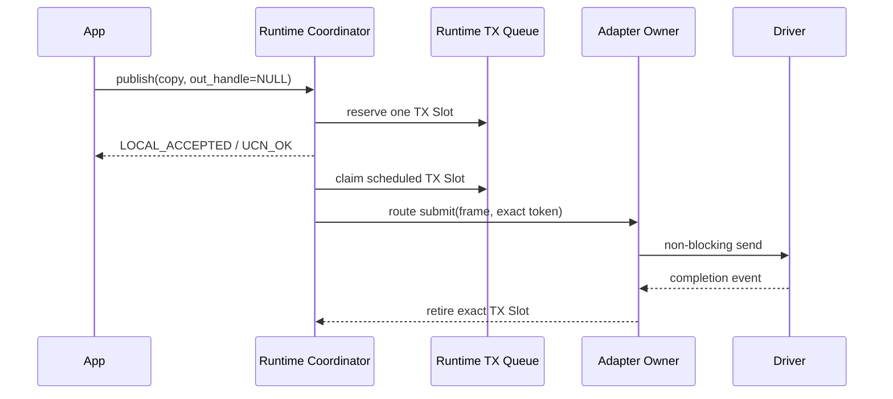

# 02 最小发送与接收闭环

> 状态：`SELF-REVIEWED / EXTERNAL REVIEW REQUIRED`
>
> 本文只描述 `Security OFF + Discovery OFF + Flow OFF + Reliable OFF` 时，静态直连单帧消息的完整闭环。任何高级模块都必须保证这条基线不被隐式依赖破坏。

本篇故意只证明 Direct Binding 的最小闭环。启用 Discovery 后的最小自动寻路是[第 15 篇](15-基础通信与自动路由简化设计.md)定义的 `RREQ → RREP → SoftRoute → C1`，仍不要求 Advanced Flow；需要稳定 Path 证明时才进入[第 24 篇](24-Advanced-Route与Flow简化设计.md)。

## 1. 场景和依赖

场景：节点 A 使用预配置 Direct Binding，经一个 Adapter 向节点 B 的 Endpoint 发送 Copy 模式小消息。

所需组件：

```text
Runtime
Core Resolver
Endpoint Registry
Direct Binding
Core Message Sequence Owner
Basic Queue
Adapter
Port/Driver
```

不需要 Route Discovery、Flow、Transfer、Persistence、Realtime、Group、Cluster 或 Advanced Planner。

## 2. 不变量

1. 一个 API 调用只创建一个本地发送所有权根：严格未跟踪路径是一个 TX Slot，受跟踪路径是一个逻辑 Send Request；
2. 首次外部发送前完成长度、Endpoint、Binding、Policy 和资源检查；
3. Origin Sequence 由 Core Message Sequence Owner 唯一分配；
4. Driver 回调前已建立 Runtime phase/reentry gate；
5. Request 完成不自动代表 Buffer 已释放；
6. RX 在认证/结构检查失败时不调用业务 Endpoint；
7. Feature OFF 不产生隐藏状态或后台工作。

## 3. 发送时序

同一个 Public API 自动选择两种本地执行层级。默认 fire-and-forget 调用若满足第 15 篇全部条件，
只创建 TX Slot；调用者要求 Handle/callback，或请求高于 `LOCAL_ACCEPTED` 的完成证明时，进入受
跟踪路径。Wire 字节和对端行为不因本地是否跟踪而改变。

### 3.1 未跟踪最小路径



### 3.2 受跟踪最小路径

```mermaid
sequenceDiagram
    participant App
    participant Runtime as Runtime Coordinator
    participant Resolver
    participant Seq as Sequence Owner
    participant Queue
    participant Adapter as Adapter Owner
    participant Driver

    App->>Runtime: ucn_publish(endpoint, copy payload, intent, out_handle)
    Runtime->>Resolver: resolve(read-only snapshot)
    Resolver-->>Runtime: READY(C1/O0, direct binding)
    Runtime->>Queue: reserve local reservation bundle
    Runtime->>Seq: reserve unique origin sequence
    Seq-->>Runtime: sequence
    Runtime->>Runtime: encode into reserved frame
    Runtime->>Queue: commit request + attempt; burn sequence on later abort
    Runtime->>Adapter: route submit(frame, tx token)
    Adapter->>Driver: non-blocking send
    Driver-->>Adapter: completion event
    Adapter-->>Runtime: TX completion
    Runtime-->>App: completion according to requested level
```

## 4. 发送伪代码

### 4.1 未跟踪 Best-Effort Copy

```text
publish_untracked_small(runtime, endpoint, payload, intent):
    require publish + one-way + operation_id == 0 + best-effort + copy + single-frame
    require requested completion == LOCAL_ACCEPTED
    require no callback and out_handle == NULL
    require no Group/Latest/Reliable/Transfer/Zero-copy/Operation/dedup/remote result
    require no independent Security/Flow/Persistence setup is needed
    reserve exactly one TX slot, including frame bytes and driver completion latch
    copy and freeze payload, policy, deadline and current route requirement
    if only a SoftRoute is missing and Auto Route is permitted:
        put slot in WAIT_ROUTE and join one bounded discovery
    else:
        require a current Direct/Static/SoftRoute and publish READY
    return UCN_OK without a public handle
```

任何条件不满足时都不能“先返回未跟踪成功、以后再补对象”。Runtime 必须在接受前改走 4.2 的
受跟踪路径，或零副作用拒绝。未跟踪路径的后续失败只进入统计/诊断，不产生 callback 或查询结果。

### 4.2 受跟踪 Copy

```text
send_copy_small(runtime, endpoint, payload, intent, out_request):
    require runtime != null
    require out_request != null
    require output remains untouched until COMMIT_LOCAL
    require runtime.lifecycle_phase == RUNNING
    require no ingress/driver/app callback active
    require runtime accepts new requests and is not stop-fenced
    require payload_length fits selected C1 budget
    require endpoint exists and allows direction

    snapshot = runtime.read_only_snapshot(now)
    decision = resolver.resolve(intent, snapshot)
    require decision == READY
    require decision.contract == C1
    require decision.security == O0

    binding = direct_binding.lookup(destination)
    require binding is current and not fenced

    bundle = reservation_bundle_begin()
    prepared_request = request_owner.request_prepare_create(
                           intent, COPY(payload), bundle)
    # 上述唯一帮助器已在同一 bundle 中预留：
    # stable Request Anchor + independent Completion Receipt
    # + Request execution + Copy Buffer/ledger
    bundle.reserve attempt_slot
    bundle.reserve queue_slot
    bundle.reserve frame_buffer from basic-message quota
    bundle.reserve adapter_tx_credit whose token embeds completion_latch
    on any reserve failure:
        bundle.rollback_in_reverse_order()
        return ERR_NO_RESOURCE without allocating sequence

    sequence_reservation = message_sequence.reserve_unique()
    if sequence reservation fails:
        bundle.rollback_in_reverse_order()
        return error
    require sequence cannot wrap into a previously valid domain

    # 精确长度和字段已在分配 Sequence 前验证；下面的最终写入必须是 infallible。
    frame = encode_c1_o0_infallible(binding, endpoint,
                                    sequence_reservation.value, payload)

    sequence_reservation.commit_to(attempt)
    out_request = request_commit_create(prepared_request, bundle, now)
    # 唯一 commit helper 原子发布 Anchor/Receipt/Request/Attempt/Queue，
    # 并在目标级别为 LOCAL_ACCEPTED 时写 Receipt latch/retention/callback obligation。
    return ACCEPTED
```

Sequence 不应在可回滚的容量和编码合法性预检之前消耗。`reserve_unique()` 一旦成功，该值即不再分配给其他请求；如果分配后的本地 commit 因检测到内存损坏等异常失败，必须 `burn` 该值并进入可诊断失败，不能把它放回空闲池。多 Owner 间不宣称魔法式原子提交：Sequence Owner 的唯一性由 reservation 保证，Anchor/Receipt/Request/Attempt/Queue 的本地发布由同一 Runtime 临界区中的 bundle commit 保证。本路径不得重新实现 Request 创建清单，必须复用第 03 篇的 `request_prepare_create()`。

## 5. Driver 提交

```text
submit_queued_attempt(runtime, attempt):
    require runtime.lifecycle_phase == RUNNING
    require no ingress/callback active
    require full_preflight_use(attempt.binding, now) == ALLOW
    require endpoint/policy/completion requirements still permit this attempt
    require attempt owns an exact adapter credit

    if atomically try_acquire caller-owned callback-domain gate fails:
        return BUSY with attempt/token/continuation unchanged
    under Adapter event gate:
        require attempt's reserved adapter token contains an EMPTY embedded completion_latch
        reserve exact completion continuation
        if reservation fails:
            release callback-domain gate after leaving event gate
            return NO_SPACE with attempt/token/continuation unchanged
        adapter token -> SUBMITTING
        attempt -> SUBMITTING
        publish {runtime instance, attempt id, token, token generation}

    runtime.driver_callback_active = true
    result = coordinator_route_adapter_submit(frame, token)
    runtime.driver_callback_active = false
    release callback-domain gate

    # 同步 completion 可能已在 callback 内锁存进 exact token。
    # event queue 只提供 wakeup hint，队列满不影响 latch。
    merge = merge_submit_return_with_latched_event(
                token, continuation, result)

    if merge == WAIT_FOR_EVENT:
        require exact continuation still active
        token SUBMITTING -> SUBMITTED
        attempt SUBMITTING -> DRIVER_PENDING
        return PENDING

    if merge == TERMINAL_COMPLETE:
        consume continuation at most once
        token -> COMPLETED
        classify attempt by Delivery/Completion:
            Best Effort/local Link completion -> SUCCEEDED
            Reliable/remote completion       -> LINK_SENT/WAITING_ACK
        retire adapter obligation exactly once
        advance request completion if its selected milestone was reached
        return COMPLETE

    if merge == TERMINAL_NOT_SUBMITTED:
        retire continuation and adapter reservation exactly once
        token -> RETIRED
        attempt -> FAILED
        fail or safely replan request according to policy
        return merge.error

    token -> RETIRING
    attempt -> IN_DOUBT
    immediately fence Adapter against new submit
    retain exact token/latch/continuation and Buffer obligation
    start one bounded reconciliation deadline without renewal
    unless its delivery contract proves safe dedup retry:
        request_finalize_execution(request, OUTCOME_UNKNOWN, now)
    return IN_DOUBT
```

Driver 可以在 `submit()` 内同步发布 completion，因此 `SUBMITTING` token、内嵌 latch 和 continuation 必须在回调前可见。合法 completion 首先在 exact token/generation 的内嵌 latch 中原子地锁存；固定 completion 队列只是可丢失的 wakeup hint，不得是唯一完成存储，也不得递归推进 Runtime。`merge_submit_return_with_latched_event()` 在 Adapter event gate/等价原子区中读取 latch、合并返回值并推进 token，完整真值表以第 00 篇为唯一权威。重复同值 completion 幂等，冲突 completion 立即 Fence Adapter；任一“可能已提交”的证据都禁止把该 Attempt 当作未发送而重试。

`IN_DOUBT` 一经建立就禁止该 Adapter 新提交。Runtime 只能在固定对账预算内查询/取消 exact token；到界后必须进入第 05 篇定义的 Fence→close/reopen→quiescence 路径。只有 Driver 证明旧 instance 不再访问 Buffer 才能退休 holder；无法证明则 Adapter Fault 并永久隔离该有界资源。

## 6. 接收时序

```mermaid
sequenceDiagram
    participant Driver
    participant Adapter
    participant Runtime
    participant Wire
    participant Security
    participant Policy
    participant Endpoint

    Driver->>Adapter: RX bytes + metadata
    Adapter->>Adapter: atomically reserve RX item
    Adapter-->>Runtime: RX event token
    Runtime->>Adapter: peek immutable RX item
    Runtime->>Wire: strict decode
    Wire-->>Runtime: C1 semantic frame
    Runtime->>Security: open + classify replay relation
    Security-->>Runtime: fresh payload+mutation OR read-only replay evidence only
    Runtime->>Policy: source/destination/endpoint admission
    Policy-->>Runtime: ALLOW
    alt fresh input
        Runtime->>Runtime: reserve delivery; consume mutation + publish pending
        Runtime->>Endpoint: deliver(payload, metadata)
        Endpoint-->>Runtime: result
    else authenticated exact duplicate
        Runtime->>Runtime: query retained receipt; never redeliver
    end
    Runtime->>Adapter: retire RX item
```

## 7. 接收伪代码

```text
process_one_rx(runtime, now):
    require runtime.lifecycle_phase == RUNNING
    require runtime.ingress_active
    item = coordinator_route_adapter_claim_rx_obligation()
    if no item:
        return EMPTY

    if item does not belong_to current adapter instance:
        outcome = REJECT_STALE_INSTANCE
        goto RETIRE
    if item length is outside bearer/protocol bounds:
        outcome = REJECT_LENGTH
        goto RETIRE

    decoded = strict_decode(item.bytes)
    if decode fails:
        record bounded diagnostic
        outcome = REJECT_DECODE
        goto RETIRE

    if destination/source binding is unacceptable:
        outcome = REJECT_ADMISSION
        goto RETIRE

    if decoded security is O1/O2:
        opened = security_open_classify_reserve(decoded, item, now)
        if open/auth/replay classification fails:
            outcome = REJECT_SECURITY
            goto RETIRE
    else:
        require exact O0 policy/trusted-path contract
        opened = core_origin_sequence_classify_reserve(decoded, now)
        if classification fails:
            outcome = REJECT_REPLAY
            goto RETIRE

    if opened.classification == AUTHENTICATED_REPLAY_CANDIDATE
       or opened.classification == TRUSTED_O0_REPLAY_CANDIDATE:
        validate current Endpoint/opcode ACL using authenticated metadata only
        require Endpoint/Service is Reliable and permits duplicate receipt lookup
        duplicate = reliable_owner.match_retained_receipt(
            opened.transaction_key,
            opened.aad_fingerprint,
            opened.payload_digest,
            opened.security_semantics)
        if duplicate is not EXACT_DUPLICATE:
            outcome = REJECT_REPLAY_CONFLICT_OR_EXPIRED
            goto RETIRE
        reserve exact ACK/receipt retransmission obligation
        if reservation fails:
            outcome = REJECT_NO_SPACE
            goto RETIRE
        publish the retained immutable receipt; do not call Endpoint
        outcome = DUPLICATE_RECEIPT_REPLAYED
        goto RETIRE

    require opened.classification == FRESH_AUTHENTICATED
        or opened.classification == FRESH_TRUSTED_O0
    payload_view = opened.payload_view if authenticated else decoded.payload

    if endpoint direction, payload length or local policy rejects delivery:
        abort opened.mutation_handle
        outcome = REJECT_POLICY
        goto RETIRE

    reserve exact bounded delivery record + callback/retry obligation
    if reservation fails:
        abort opened.mutation_handle
        outcome = REJECT_NO_SPACE
        goto RETIRE

    PRECOMMIT under Runtime Coordinator + Security Owner gates:
        under Runtime Coordinator gate revalidate exact ACL/Policy generations
        rc = consume opened.mutation_handle exactly once using current trusted now
        if rc fails because reservation/context/key/lease/fence/policy changed:
            release all still-unpublished delivery/callback reservations
            outcome = REJECT_SECURITY_CHANGED
            goto RETIRE
    NOFAIL_PUBLISH:
        publish already-reserved delivery record with payload/item references
        # from here retry resumes the delivery record; it never opens/consumes replay again

    acquire app-callback gate without changing lifecycle phase
    runtime.app_callback_active = true
    result = endpoint.deliver(payload_view, immutable metadata)
    runtime.app_callback_active = false
    release app-callback gate

    if result == RETRY_NOT_CONSUMED:
        require Endpoint contract guarantees zero business side effects
        if retry count/deadline remains within fixed bound:
            delivery record + item -> DELIVERY_RETRY
            schedule using reserved RX-maintenance budget
            return PENDING
        outcome = REJECT_RETRY_EXHAUSTED
        goto RETIRE

    outcome = result

RETIRE:
    retire exact delivery record if one was published
    coordinator_route_adapter_retire_rx_obligation(item.token, item.generation) exactly once
    return outcome
```

`RETRY_NOT_CONSUMED` 只表示 Endpoint 明确承诺“本次没有接管 Payload、没有产生业务副作用”；否则重复调用会造成重复执行，必须使用终态 `ACCEPTED/REJECTED`。RX Item 在 Retry 期间保持同一个 token/generation，不靠重新入队复制 Frame。Replay/Origin Sequence 已在 `PRECOMMIT` 消费，重试从同一个 delivery record 恢复，不能再次调用 `security_open_classify_reserve()`。认证重复帧和可信 O0 重复帧在 classification 后立即转入只读 receipt 查询；它们不取得 Payload view、不创建 delivery record、不调用 Endpoint、也不再次消费 Replay mutation。`security_replay_commit()` 仍可能因 deadline/Context 变化拒绝，因此它位于可失败 `PRECOMMIT`；只有成功后才进入不可失败 `NOFAIL_PUBLISH`。所有拒绝、超时、callback 错误和正常完成都经过共同退休尾声。

## 8. 失败和取消

| 位置 | 失败 | 必须发生 |
| --- | --- | --- |
| Resolver | Policy/Binding 不允许 | 零队列、零 Sequence、零发送 |
| Reserve | 任一槽不足 | 反向释放已有 reservation |
| Encode preflight | 字段/容量非法 | 输出不写回，逆序释放 bundle，尚未分配 Sequence |
| Sequence 后的异常 | 本地 commit/内存损坏 | burn Sequence，不复用；逆序退休其他 reservation |
| Driver submit | 临时背压且明确 NOT_SUBMITTED | 保留或重排 Attempt；不伪造完成 |
| Driver submit | Link Down | Attempt 失败；Request 按策略结束或重规划 |
| Driver submit | 是否已提交不确定 | Attempt 进入 `IN_DOUBT`、Request execution 进入 `OUTCOME_UNKNOWN`；仅有安全去重证明时才能重试 |
| App cancel | 尚未提交 Driver | 从队列撤销并释放 |
| App cancel | Driver 持有 Buffer | Request 标记取消；等待 Driver retire 后再释放 Buffer |
| RX validation | 任一拒绝 | 共同 retire 当前 RX obligation，不阻塞队首 |
| Endpoint retry | `RETRY_NOT_CONSUMED` | 使用原 RX token 有界重试；到期后退休，不重复业务副作用 |

## 9. 最小基线测试

- A→B Copy 小消息完整交付，Payload 精确匹配；
- Endpoint 不存在时零 Sequence、零发送；
- Basic Queue 满时不破坏已有 Request；
- Driver 同步完成、异步完成和提交失败；
- App callback 内递归 reopen/stop/send 的门禁；
- Request 已完成但 Driver obligation 未退休时 Buffer 不可复用；
- Security/Flow/Transfer/Cluster OFF 的产物不含对应符号和状态。
- Driver 在 `submit()` 内同步发 completion：token 已为 `SUBMITTING`，只完成一次；
- completion wakeup 队列已满：内嵌 latch 仍成功锁存，Runtime 保留扫描能发现并退休它；
- 早到 `TERMINAL_SUBMITTED` 分别与 COMPLETE/PENDING/NOT_SUBMITTED 返回合并：严格按第 00 篇真值表，冲突时 Fence Adapter；
- Policy 在排队后、Driver 前撤销：完整 preflight 拒绝且零 Driver 调用；
- 过期/错误 Destination/非法 Sequence：RX Item 均退休，恶意输入不能卡住 Ring；
- Endpoint `RETRY_NOT_CONSUMED` 首次背压、后续成功，以及到期耗尽；
- Sequence 分配后注入本地异常：值被 burn，不回收、不与下一 Request 重复。
- Fresh Sequence 尚处于 replay reservation 时并发重复：返回 `REPLAY_IN_FLIGHT`，无第二个 reservation；
- 已提交的 exact duplicate：只重发 retained receipt，Endpoint 调用次数不增加；冲突 digest、过期 receipt 与普通 stale Replay 均不发 ACK。
- Replay reservation 建立后 Session/Key 到期、撤销、Fence 或安全/ACL Policy Generation 改变：ordered commit 前拒绝并只释放本 reservation，业务状态不写；`now==reservation/session/key deadline` 同样拒绝。

## 10. Feature OFF、固定资源和重启

本基线中的 Security、Discovery、Flow、Reliable、Transfer、Persistence、Realtime、Group、Cluster 与 Advanced Planner 均为 `NOT_COMPILED` 或由 Composition 明确关闭；关闭后不得创建其 Pending、Timer、Context 或隐式 callback。C1/O0/H0 只允许产品 Threat Policy 已证明可接受的 Direct Binding。

必须在冻结前分别量化 TX Slot，以及受跟踪路径的 Request Anchor、Completion Receipt、Request execution、Attempt、Queue、Frame、Adapter TX/RX、RX Retry 和 Buffer Obligation 容量。每个 TX token 的 completion latch 是 token 内嵌字段，不另行依赖可能耗尽的事件槽；wakeup、RX retirement、取消和基础消息仍有不可被普通数据耗尽的保留份额。任一表满只拒绝本次新工作，不覆盖活动槽，也不能把 Anchor 或 Receipt 槽临时借作另一个对象。严格未跟踪路径的 TX Slot 配额必须独立可用，不能因 Receipt 表满而失败；一旦调用者要求跟踪，则不得借未跟踪路径绕过 Receipt 容量失败。

普通易失 Request、Attempt、Sequence reservation、RX Retry 和 Driver token 不跨重启恢复。新启动建立新的 Runtime/Adapter Instance；任何旧 Handle 或迟到 completion 因 instance/generation 不匹配而拒绝。Storage 只有在第 05 篇定义的 `QUIESCENT` 后才允许复用。
