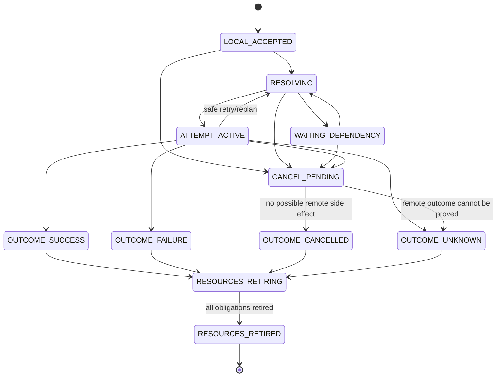
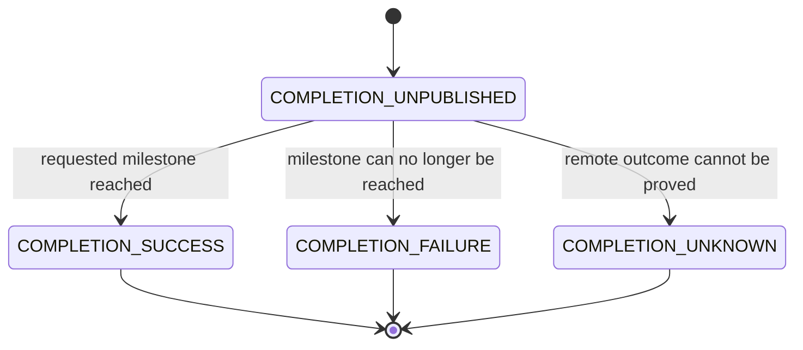
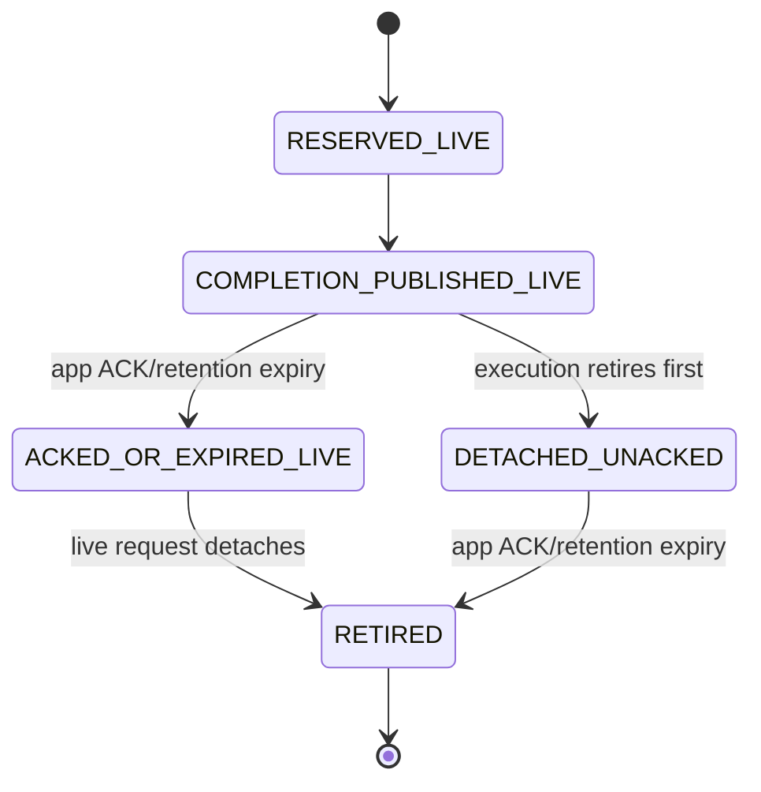
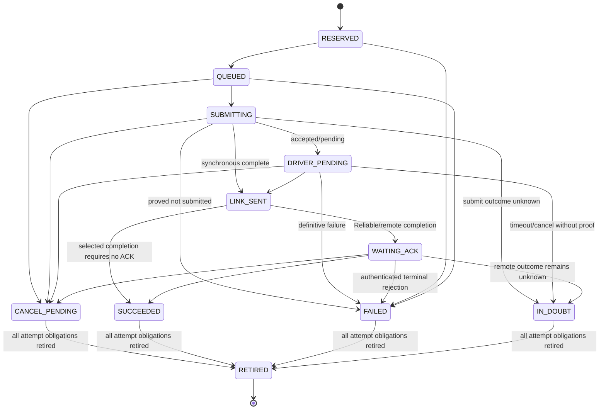
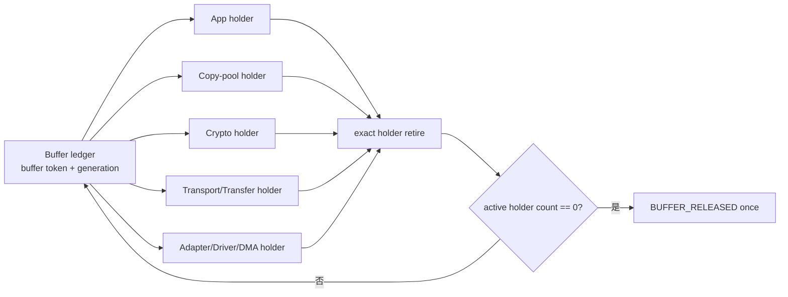

# 03 Request、Attempt 与 Buffer 生命周期

> 状态：`SELF-REVIEWED / EXTERNAL REVIEW REQUIRED`
>
> 本文是异步生命周期的唯一行为模型。它负责区分逻辑请求、具体传输尝试和内存使用义务，不负责选择 Route 或定义 Wire ACK 字段。

本文只适用于**受跟踪发送**。满足第 15 篇全部严格条件、`operation_id=0` 且没有 Handle/callback 的未跟踪 Best-Effort Copy 只由一个 TX Slot 承担；一旦要求 Reliable、Latest、Request/Result、Group、Transfer、Zero-copy、任何 Operation/dedup、远端 Completion 或独立 Setup，就必须使用本文的完整模型。

## 1. 三个执行对象、一个稳定锚点与一个独立回执

| 对象 | 创建原因 | 结束条件 | 可否因切路而重建 |
| --- | --- | --- | --- |
| Request Anchor | 给应用一个稳定 Request Handle 锚点，并精确定位活动执行与回执 | `live_request_ref` 和 `receipt_ref` 均已清除，且 Anchor 查询义务为零 | 否 |
| Completion Receipt | 保存不可变用户 Completion、append-once 后台 Outcome、必有 query/retention 与可选 callback-delivery 状态 | 后台执行已脱离，用户已 ACK/consume 或达到冻结的非 durable 保留期，且 query/retention 与可选 callback obligation 均已退休 | 否 |
| Send Request | 应用要求完成一项逻辑发送 | 执行达到内部终态且 Request/Attempt/Buffer 义务退休；终态摘要写入独立 Receipt 后执行槽可先复用 | 否 |
| Transmission Attempt | 选定一次具体 Contract/Path 并尝试传输 | 成功、确定失败、结果不确定、取消或被替代；随后退休 | 是 |
| Buffer Obligation | 一个固定 ledger 描述哪些 Owner/Driver 仍使用一块内存 | 所有 holder 逐项显式退休 | 否；只能增加/转移/减少 holder |

一个 Request 可以在生命周期内拥有多个 Attempt；默认串行，只有第 8 节所述显式合同才允许有界并行。同一消息的 operation/request ID 不能因切路改变。Public Request Handle 始终指向稳定 Anchor，而不是可提前复用的 Request 执行槽。

## 2. 状态机



Request 的内部执行状态与用户 Completion latch 正交。尤其当用户只要求 `LOCAL_ACCEPTED` 时，Completion 可以在分配固定槽后立即成功，但 Runtime 仍必须继续排队、提交和退休底层义务：



Completion latch 一旦发布不可改变；它不等于释放 Request 执行槽，也不自动停止尚未退休的 Attempt。若 `LOCAL_ACCEPTED` 已成功回调而后续 Link 失败，只记录有界后台诊断并完成内部清理，不能再向应用发布第二个相反 Completion。

创建 Request 时必须同时预留彼此独立的固定 `Request Anchor` 与 `Completion Receipt` 槽。Public Handle 编码 `{runtime_instance_id, owner_instance_id, anchor slot, anchor generation, REQUEST_ANCHOR kind}`；Anchor 内部保存 `{request id, optional live_request_ref, exact receipt_ref}`，两个引用分别携带目标 slot 与 generation。Receipt 保存 `{request id, immutable user_completion_latch, append-once execution_outcome, mandatory query/retention obligation, optional callback-delivery obligation}`。只有 Request Owner 能在资源退休时清除 `live_request_ref`；只有 Receipt Owner 能在完成保留合同后退休 Receipt，并由 Anchor Owner 清除 exact `receipt_ref`。因此执行槽或 Receipt 槽复用后，旧 Handle 都不会别名到新对象；Runtime/Owner 重建或 Anchor 复用后，旧 runtime/owner instance 或 Anchor generation 又会被拒绝。任一 Anchor、Receipt 或 Request 槽无法预留时，必须在任何业务副作用前拒绝新 Request。

下面第一张图是 **Completion Receipt** 的保留状态；Anchor 的两个引用是独立状态，不能把
Receipt 的 `RETIRED` 直接解释成 Anchor 也已释放。



Receipt 保留期只能从 user Completion 实际发布时开始，不能从 Request 创建时开始。应用提前 ACK 只在 exact Receipt 中记录“不再需要回执”；只要 `live_request_ref` 存在，Receipt 和 Anchor 都不可释放，同一 Handle 仍可用于 cancel/status。执行退休后先清除 Anchor 的 `live_request_ref`；Receipt 达到 ACK/consume 或合法过期条件、query/retention 已完成且可选 callback-delivery obligation 为零时才退休，并用 exact generation 清除 Anchor 的 `receipt_ref`。Anchor 只在两个引用均为 `NONE` 且自身查询义务为零时释放。





Buffer ledger 的生命周期为 `FREE → ACTIVE → RELEASE_PENDING → RELEASED → FREE`，holder 集合与该生命周期正交。实现可使用固定 holder bitmap、固定小数组或等价的有界 ledger，但每个 holder 必须绑定 Owner Instance、token、generation 和访问权限；不能用一个裸引用计数掩盖重复 release 或错误 Owner 的 release。

## 3. Copy 与 Zero-copy

Copy 模式：

```text
API 返回 LOCAL_ACCEPTED
    => 应用原 Buffer 可立即复用
    => Runtime 自己的 Copy Buffer 仍有独立 obligation
```

Zero-copy 模式：

```text
API 返回 LOCAL_ACCEPTED
    != 应用 Buffer 已归还

只有独立的 BUFFER_RELEASED ownership event
    => 应用才可复用/释放 Buffer
```

完成级别和 Buffer 所有权是两个正交结果。

## 4. 创建 Request

```text
request_prepare_create(intent, payload_ref, reservation_bundle):
    validate intent and payload descriptor without mutation
    require preaccept Policy/Endpoint validation already passed

    reservation_bundle.reserve stable request anchor slot
    reservation_bundle.reserve independent completion receipt slot
    reservation_bundle.reserve request execution slot
    reservation_bundle.reserve exact receipt query/retention obligation
    if a completion callback is configured:
        reservation_bundle.reserve exact callback-delivery obligation

    if COPY:
        reservation_bundle.reserve copy buffer
        reservation_bundle.reserve runtime buffer-obligation ledger
        reservation_bundle.reserve exact copy-pool holder entry
        copy payload into unpublished staging buffer
    else:
        reservation_bundle.reserve application buffer-obligation ledger
        reservation_bundle.reserve exact application holder entry
        validate app buffer token without transferring ownership

    on any failure:
        reservation_bundle.rollback_in_reverse_order()
        keep output handle untouched
        return error

    assign request id from Request Owner
    initialize receipt.user_completion_latch = UNPUBLISHED
    initialize receipt.execution_outcome = PENDING
    bind anchor.receipt_ref to exact receipt slot + generation
    bind anchor live_request_ref to exact request slot + generation
    construct public handle from anchor slot + anchor generation
    return prepared_request without publishing it

request_commit_create(prepared_request, reservation_bundle, now):
    require base bundle contains anchor + receipt + request execution
    require base bundle contains buffer/holder + receipt query/retention obligation
    if a completion callback is configured:
        require base bundle contains its exact callback-delivery obligation
    if reservation_bundle includes a READY fast-path extension:
        require the extension contains its exact Attempt/Queue/Frame/Adapter resources
        require all selected-path generations still match before the one commit
    if requested completion level == LOCAL_ACCEPTED:
        stage receipt.user_completion_latch = SUCCESS
        stage receipt.published_at and retention_deadline from now
    if ZERO_COPY:
        stage transfer of the validated application holder into the Buffer ledger
    commit bundle in one Runtime-local publish step:
        publish prepared anchor + receipt + request execution together
        publish staged LOCAL_ACCEPTED latch/retention and zero-copy ownership transfer
    activate the receipt query/retention obligation
    if completion latch is terminal and a callback is configured:
        schedule the pre-reserved callback-delivery obligation; wakeup hint may be lossy
    else if a callback is configured:
        keep its obligation RESERVED_NOT_READY until terminal publication
    return request handle

request_create(intent, payload_ref, now):
    bundle = reservation_bundle_begin()
    prepared = request_prepare_create(intent, payload_ref, bundle)
    if prepare failed:
        return prepare.error with output handle untouched
    return request_commit_create(prepared, bundle, now)
```

`request_prepare_create()` 是唯一 Request/Anchor/Receipt 基础预留清单。无论 Route、Security 或
Flow 是否已经可用，基础 commit 都只强制预留 Anchor、Receipt、Request execution、
Buffer/holder/ledger 和 receipt query/retention obligation；只有配置 callback 时才另预留
callback-delivery obligation。Copy 只写未发布 staging，Zero-copy 只验证
token，应用所有权到 `request_commit_create()` 才原子转移。只有 Resolver 已经给出 `READY`
Plan 时，最小直连 Fast Path 才把 Attempt/Queue/Frame/Adapter 等“所选路径资源”作为扩展加入
同一 bundle 并一次 commit；`NEED_DEPENDENCY(SOFT_ROUTE/SECURITY_SESSION/FLOW/TRANSFER)` 路径在创建
Request 时尚不存在 selected path，不能被要求预留不存在的路径资源。普通路径可先提交基础
bundle，随后用独立、代际绑定的 Attempt bundle 推进；两条路径都不得复制一份遗漏独立 Receipt、
漏绑 exact `receipt_ref` 或漏发 `LOCAL_ACCEPTED` latch 的私有创建逻辑。

## 5. 创建和替换 Attempt

```text
attempt_create(request, execution_binding):
    require request execution is not OUTCOME_*/RESOURCES_RETIRING/RETIRED
    require no incompatible active attempt
    require binding is current at now

    bundle = reservation_bundle_begin()
    bundle.reserve attempt slot
    bundle.reserve frame/queue/adapter resources
    bundle.reserve all required holder entries
    on any failure:
        bundle.rollback_in_reverse_order()
        return error without changing request

    assign attempt id
    freeze path, contract, security and transfer references
    link attempt to original request id
    commit bundle and attempt in one Runtime-local publish step
```

```text
attempt_replan(request, failed_attempt):
    require failed_attempt is definitively FAILED or safely retryable
    if failed_attempt is IN_DOUBT:
        if delivery/operation contract lacks authenticated exact dedup:
            request_finalize_execution(request, OUTCOME_UNKNOWN, now)
            return without creating another attempt

    mark failed_attempt terminal once
    retire its resources when obligations permit
    preserve request id, operation id and application semantics
    run Resolver again from current state
    create a new attempt only after current checks pass
```

不能就地改写已经 Probe、加密、分片、提交 Driver 或等待 ACK 的 Attempt 路径字段。

```text
attempt_enter_in_doubt(request, attempt, now):
    mark attempt IN_DOUBT exactly once
    unless exact dedup permits reconciliation:
        request_finalize_execution(request, OUTCOME_UNKNOWN, now)
    immediately fence the affected Adapter against new submit
    freeze reconciliation_started_at and absolute deadline; retries cannot extend it
    keep exact token, embedded completion latch, continuation and Buffer holder
    let Adapter Owner run bounded query/cancel/reopen described by document 05

    if Driver later proves terminal/quiescent:
        retire exact token and holder once
    else if Adapter cannot prove old instance quiescent by the bound:
        Adapter -> FAULT
        permanently quarantine the still-possibly-owned token/Buffer
        do not publish BUFFER_RELEASED and do not reuse that storage
```

`IN_DOUBT` 不允许同一 Adapter 继续创建新的物理提交，因此模糊义务数上界为 Fence 建立时已在飞的 Adapter token 数，不会被新业务无限累积。若最终无法证明 DMA/Driver 已停止引用 Buffer，保留资源是显式的永久隔离而不是可静默回收的“泄漏”。仅清零对象、销毁或重建 Runtime **不是** quiescence 证明，绝不能据此复用旧 Storage；只有经过审计的 Driver/hardware reset、外设复位、断电，或启动屏障能够证明旧 DMA 已不可能访问该内存时，新的 Runtime 才能重新接管相应容量。

## 6. 完成聚合

```text
request_update_completion(request, event):
    anchor = resolve request.anchor_ref by exact anchor slot + generation
    receipt = resolve anchor.receipt_ref by exact receipt slot + generation
    require receipt.request_id == anchor.request_id
    request = resolve anchor.live_request_ref if present
    verify event owner instance + token + attempt id
    verify referenced continuation/holder is still active
    update only the referenced attempt
    retire exactly the event's obligation once

    if requested completion level reached and receipt.user_completion_latch is unpublished:
        atomically publish immutable completion success into receipt once

    if execution can no longer reach requested completion
       and receipt.user_completion_latch is unpublished:
        atomically publish immutable completion failure or unknown into receipt once

    if request execution reached OUTCOME_*:
        request_finalize_execution(request, request.execution_outcome, event.now)
```

所有动态拒绝、失败、成功和未知结果都必须经同一个终态收口，不能只写 execution outcome 后
遗留未发布 Completion：

```text
request_finalize_execution(request, terminal_outcome, now):
    resolve exact anchor, receipt, execution and reserved obligations
    if execution already terminal:
        require identical terminal_outcome and continue idempotently
    else:
        atomically append execution outcome exactly once
    require execution is now terminal
    if receipt.user_completion_latch is UNPUBLISHED:
        if terminal_outcome proves the requested completion milestone was reached:
            publish immutable SUCCESS completion exactly once
        else:
            require requested completion can no longer be reached
            publish immutable FAILURE or UNKNOWN completion exactly once
    require receipt.user_completion_latch is terminal
    freeze/retain its query deadline without renewal
    if callback configured and callback obligation is RESERVED_NOT_READY:
        make it READY and enqueue only a lossy wakeup hint
    request -> RESOURCES_RETIRING
    if all Attempt/Queue/Frame/Buffer obligations retired:
        publish BUFFER_RELEASED once when applicable
        request -> RESOURCES_RETIRED
        clear anchor.live_request_ref using exact slot + generation
        release request execution slot
    if request == RESOURCES_RETIRED
       and anchor.live_request_ref == NONE
       and receipt completion was ACKed/expired
       and no callback delivery is active
       and callback obligation is DELIVERED or NONE:
        retire exact receipt query/retention obligation and receipt slot
        clear anchor.receipt_ref
    if anchor.live_request_ref == NONE and anchor.receipt_ref == NONE
       and no anchor query obligation remains:
        retire anchor slot
```

终态收口不能假设成功一定先经过某个事件分支。同步完成、无异步 token 的本地完成、恢复/对账后直接
得到成功终态，都可能首次从 `request_finalize_execution()` 进入。因此 Finalizer 本身必须能从
`terminal_outcome + requested completion` 唯一导出 SUCCESS；否则“Execution 已成功、Completion
仍未发布”会成为无法退休的合法状态。反过来，失败/未知也只能在确认目标里程碑已不可能达到后发布。

`LOCAL_ACCEPTED` 可能早已发布成功 Completion；后续发送失败只写独立 execution outcome，不能
改写该成功 latch。更高 Completion Level 在动态 Policy 拒绝、Session 失效、资源耗尽或
`IN_DOUBT` 后已不可能达到时，由本函数发布失败/未知，并启动 callback、retention 与资源退休。
Receipt/query 元数据始终存在；callback delivery 仅在用户配置回调时存在，而且只能在终态
Completion 发布之后从 `RESERVED_NOT_READY` 变为 `READY`。

Receipt 绝不能因为应用已经 ACK `LOCAL_ACCEPTED` 就提前退休：只有 Request 已经达到
`RESOURCES_RETIRED`、Anchor 的 exact `live_request_ref` 已清除、query/retention obligation
已经满足，且 callback obligation 已为 `DELIVERED` 或 `NONE` 时，Finalizer 才能清除
`receipt_ref`。因此活动 Request 期间，即使用户不再需要回调，Receipt 仍保留为旧 Handle 的
状态与取消查询目标。

Callback delivery 的 lossy wakeup 只用于降低延迟，不是可靠性条件。Runtime 的保留维护预算
必须扫描每个 `READY` obligation，并以 `READY -> INVOKING -> DELIVERED` 单向推进；扫描在
`RUNNING` 与 `STOPPING` 都继续，且在 app/driver callback 或 ingress active 时延后而不是丢弃。
一次 `INVOKING` 只允许一个调用；回调返回错误也要记录有界诊断并进入 `DELIVERED`，不能无限
重试或让 Receipt 永久悬挂。

可能的完成级别：

```text
LOCAL_ACCEPTED
LINK_SUBMITTED
REMOTE_REASSEMBLED
REMOTE_INBOX_ACCEPTED
APPLICATION_RESULT
```

这些名称和语义以用户意图文档为唯一权威。`BUFFER_RELEASED` 不在 Completion Level 中；它是独立所有权事件，可能早于或晚于远端结果。Durable Operation 的恢复/结果证明也不在本篇私自增加 Completion 枚举，必须由用户语义和 Persistence/Operation 合同共同定义。

Receipt 中有两个分开的单调字段：`user_completion_latch` 是对用户所选 Completion Level 的不可变结论；`execution_outcome` 是后台执行的 `PENDING -> OUTCOME_*` append-once 摘要。早期 `LOCAL_ACCEPTED` 成功不得被后续 Link 失败改写，后续失败只写 `execution_outcome` 和有界诊断。因此“冻结 Completion”与“后来补全 Outcome”不再是同一字段的互相矛盾修改。

Anchor/Receipt 不持有 Payload、Attempt 或 Driver 资源。Anchor 在 Request 尚活动时保存 exact `live_request_ref`，并始终通过独立 exact `receipt_ref` 定位回执；Receipt 自身不反向猜测或复用 Request 槽。执行槽完成退休后可先复用，旧 Handle 仍通过 Anchor slot/generation 再解析 exact Receipt。非 durable Receipt 的自动过期必须晚于 API 宣告的最大查询/回调重试窗口，并产生可诊断的 `RECEIPT_EXPIRED`；durable Operation 的结果保留和 GC 由第 09、12 篇的 Journal 合同决定，不能靠易失 Receipt 冒充掉电恢复。

## 7. 取消

```text
request_cancel(request):
    anchor = resolve exact Request Handle
    receipt = resolve exact anchor.receipt_ref
    require anchor belongs_to current runtime
    if anchor.live_request_ref is NONE:
        return receipt completion/outcome view
    request = resolve anchor.live_request_ref by slot + generation

    if request execution is not already OUTCOME_*:
        request -> CANCEL_PENDING
    stop creating new attempts
    request cancellation from active owners
    keep processing driver/crypto/persistence completions
    if no physical/remote side effect is possible:
        execution -> OUTCOME_CANCELLED
    else if remote outcome cannot be proved:
        execution -> OUTCOME_UNKNOWN
    else:
        return PENDING while existing obligations reconcile
    request_finalize_execution(request, execution.outcome, now)
```

取消不能：

- 直接清空 Driver 正在使用的槽；
- 复用仍在 DMA 的 Buffer；
- 删除等待中的持久化 operation 后重用 ID；
- 阻止必要的完成事件处理。

## 8. 固定容量

冻结实现前必须确定：

| 资源 | 容量与隔离要求 |
| --- | --- |
| Request execution slots | 基础消息保留量 + 各高级能力上限 |
| Request Anchor slots | 覆盖仍有 live Request 或 retained Receipt 的逻辑请求上界；创建时预留，只在两个 exact 引用均清除后释放 |
| Completion Receipt slots | 覆盖活动 Request 与已退休但尚未 ACK/过期回执的总上界；创建时独立预留，只在执行脱离且保留合同完成后释放 |
| Attempt slots | 每 Request 最大串行/并行尝试数 |
| Buffer obligations | 至少覆盖 Driver、Crypto、Transfer 和 App 持有者 |
| Callback/Cancel/Retire obligations | 创建时预留 correctness obligation；Driver 终态在 token latch，wakeup 提示可丢但取消/退休必须获得推进容量 |
| Copy pool | 基础小消息与 Bulk 分区或有界借用 |
| Holder ledger entries | 每 Buffer 最大 holder 数、Owner 类型与 token/generation |

Attempt 默认串行创建。只有某个 Delivery/Operation 合同明确允许并行副本、并定义终态聚合和重复抑制时，Composition 才能配置大于 1 的并行 Attempt；否则 `max_parallel_attempts_per_request = 1`。无论是否并行，必要 completion/retirement 槽必须独立保留。

## 9. 对抗测试

- Request 已 `LOCAL_ACCEPTED`，Driver 仍持有 zero-copy Buffer；
- 路径 A 等待 ACK 时出现路径 B：创建新 Attempt，不改写 A；
- cancel 与 Driver completion 同时到达：只退休一次；
- 重复 completion：不重复释放、不重复回调；
- Runtime stop：拒绝新 Request，但继续退休所有 obligation；
- Request execution slot 满：必要完成事件仍能进入；
- 两个 Runtime 的 Request Handle 数值相同：跨实例拒绝。
- Best Effort 在 Link 完成后直接退休，不进入不存在的 ACK 等待；
- Driver 可能已接收但结果未知：Request execution 进入 `OUTCOME_UNKNOWN`，无 dedup 证明时不重发；
- Request 已发布 Completion 但 DMA 仍持有 Buffer：Request execution slot 和 holder ledger 不复用；
- Request 执行与资源已退休但应用尚未查询 Completion：执行槽可复用，exact Receipt 仍可由旧 Handle 查询且不会别名到新 Request；
- Request Anchor 表满或 Completion Receipt 表满：在分配 Sequence、复制 Payload 或产生发送副作用前拒绝新 Request；
- `LOCAL_ACCEPTED` 是请求的 Completion 目标：bundle commit 同时写 exact Receipt latch、冻结 retention 起点并登记已预留 callback；不得只返回 `UCN_OK` 而让 latch 永久未发布；
- Receipt 过期后旧 Handle：返回确定的 `RECEIPT_EXPIRED/NOT_FOUND`，不得读取复用槽的新结果；
- 应用在 `LOCAL_ACCEPTED` 后立即 ACK Receipt，但 Attempt 仍活动：Receipt 与 Anchor 均不释放，同一 Handle 仍能 cancel；
- Request 执行槽复用而旧 Receipt 未 ACK：旧 Handle 只命中旧 Anchor，并由 exact `receipt_ref` 命中旧 Receipt，不命中新 Request；
- Receipt 槽已退休并复用但旧 Anchor/generation 被伪造使用：exact `receipt_ref` generation 不匹配，零写拒绝且不得返回新 Receipt；
- Completion 要求为 `LOCAL_ACCEPTED`：成功只回调一次，但 Attempt 继续发送和退休；后续 Link 失败只记诊断；
- `LOCAL_ACCEPTED` 已回调后调用 cancel：允许停止尚未退休的后台 Attempt，但不发布第二次 Completion；
- callback wakeup 队列满、随后 Runtime 只收到普通 timer/step：保留预算仍发现 `READY` obligation，
  完成一次 `READY -> INVOKING -> DELIVERED`，Receipt 最终可退休；
- App、Crypto、Transfer、Driver 同时持有 Buffer：逐 holder 退休，最后一个才发布 `BUFFER_RELEASED`；
- copy buffer reservation 失败：已预留 Anchor 和 Request execution slot 逆序回滚，输出 handle 不写回。
- Buffer obligation/holder 或 callback 槽预留失败：不复制可见 Payload、不接管 App token、不发布 Anchor/Receipt；
- ambiguous submit 后 Driver 永不回 completion：Adapter 立即 Fence，有界对账后只有“证明 quiescent 并退休”或“FAULT 且永久隔离”，不继续积累新模糊 token。

## 10. Feature OFF、重启与持久化

本生命周期模型属于最小 Runtime，不可整体关闭。Copy、zero-copy、Reliable、Transfer、Security 和 Persistence 可以分别由 Composition 关闭：关闭某种 holder 类型时不分配对应 ledger entry；关闭 Reliable/Transfer 时不能留下 ACK/fragment pending；关闭 Persistence 时普通易失 Request 仍工作，但不得恢复 durable Operation。

普通 Request、Attempt、callback 和 Buffer token 只在当前 Runtime Instance 内有效，不跨重启。重启后旧 Handle/completion 因 Runtime/Owner Instance 不匹配而拒绝。持久化只保存第 12 篇明确允许恢复的 Operation 状态；它不能恢复应用进程中的普通 callback，也不能据此假定旧 DMA/Driver obligation 仍存在。Storage 必须在所有 holder、Attempt 和 callback obligation 退休、Runtime 达到 `QUIESCENT` 后才可清零或复用。
