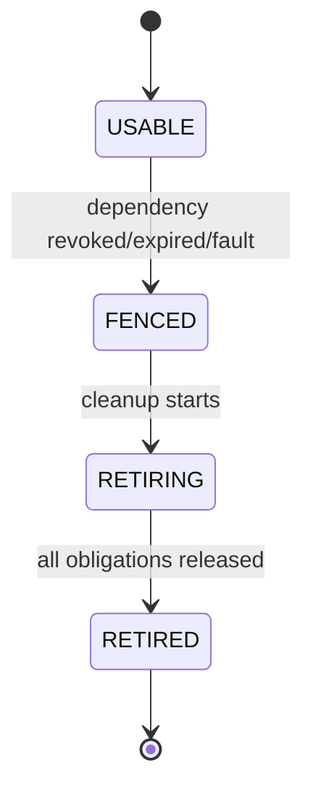

# 04 Owner、Handle、Generation 与 Fence

> 状态：`SELF-REVIEWED / EXTERNAL REVIEW REQUIRED`
>
> 本文负责 UCN v6 的状态所有权和失效传播。任何模块文档使用 Handle、Generation、Lease 或 Fence 时，都必须遵守本文，不得重新定义第二套通用规则。

## 1. 唯一 Owner

每一项可变状态只有一个写入者：

| 状态 | 唯一 Owner | 其他模块如何使用 |
| --- | --- | --- |
| Runtime phase、Request Anchor、Completion Receipt、Request execution、Attempt | Runtime/Request Owner | 稳定 Anchor Handle + read-only snapshot |
| Callback-domain gate | Composition 提供的 caller-owned Gate Owner | Runtime/Adapter 只通过 gate API 进入外部 callback |
| C1 Origin Sequence | Core Message Sequence Owner | Frame Builder 请求分配值 |
| Identity/Address Binding | Identity Owner | Binding Handle |
| Peer Session、Key、Crypto Replay | Security Owner | Security Context Handle |
| Route/Candidate | Route Owner | Route Handle |
| Flow Context/Generation | Flow Owner | Execution Binding |
| Transfer | Transfer Owner | Transfer Handle |
| Group membership/business duplicate | Group Owner | Group Handle |
| Cluster authority/config | Cluster Owner | Authority Handle |
| Durable record/witness | Persistence Owner | Completion Proof |

共享结构不等于共享写权限。

## 2. Handle 结构

概念 Handle 至少绑定：

```text
runtime_instance_id
owner_instance_id
object_slot
object_generation
object_kind
```

若对象有安全/业务代际，还要通过被引用对象校验，而不是把所有代际复制进 Handle。

```text
handle_resolve(owner, handle):
    require owner.runtime_instance_id == handle.runtime_instance_id
    require owner.instance_id == handle.owner_instance_id
    require handle.object_kind matches API
    require slot < configured capacity
    object = owner.slot[slot]
    require object.valid
    require object.generation == handle.object_generation
    return object
```

受跟踪 Request 使用一条特化但不违反上述规则的稳定锚点：Public Request Handle 的 `object_kind` 固定为 `REQUEST_ANCHOR`，`object_slot/object_generation` 只指向独立 Request Anchor 槽，而不直接指向可提前复用的 Request execution 或 Completion Receipt 槽。Anchor 再以两个 exact slot/generation 引用定位二者。未跟踪最小发布不产生 Public Handle，只能由 exact TX slot/generation 在 Runtime 内部推进和退休，不能把该内部引用泄漏成可长期保存的应用 Handle。

```text
request_handle_resolve(request_owner, handle, need_live_execution):
    anchor = handle_resolve(request_owner.anchor_table, handle)
    require anchor.kind == REQUEST_ANCHOR
    receipt = resolve exact anchor.receipt_ref by receipt slot + generation
    require receipt.request_id == anchor.request_id
    if not need_live_execution:
        return {anchor, receipt}

    require anchor.live_request_ref is present
    require live_request_ref.owner_instance == request_owner.instance
    request = resolve exact request slot + request generation
    require request.request_id == anchor.request_id
    require request.anchor_ref == {handle.slot, handle.generation}
    return {anchor, receipt, request}
```

Anchor 可在 Request 执行槽退休后继续保留终态查询。应用提前 ACK Completion 时只在 exact Receipt 写 `acknowledged=true`；只要 exact `live_request_ref` 未清除，Receipt 和 Anchor 都不得释放，Handle 依然可用于 cancel/status。只有 Request Owner 能在所有执行义务退休后清除 `live_request_ref`；Receipt Owner 在执行已脱离且保留合同完成后退休 exact Receipt，并清除 `receipt_ref`。Anchor Owner 只在两个引用均已清除且 Anchor 自身查询义务为零时推进 Anchor generation 并复用槽位。

## 3. Generation 与 Lease

Generation 回答“是否还是同一个对象/权威域”，Lease 回答“它现在是否仍有效”。二者都必须检查：

```text
reference_is_usable(ref, now):
    object = handle_resolve(ref.handle)
    require object.generation == ref.expected_generation
    require object.fence == NONE
    if object is lease-bearing:
        require deadline is valid in the declared monotonic clock domain
        require now < object.deadline
    else:
        require object is an immutable Manifest/static-lifetime object
    require current policy permits use
    return true
```

后台清扫尚未执行时，使用点仍必须直接检查 Deadline。

静态对象不能通过伪造“无限 Deadline”绕过时间检查。它必须显式标记为 Manifest/static-lifetime，并随 Runtime/Owner Instance 或 Manifest Generation 失效；动态对象则必须携带合法 Deadline，二者不能依赖 `deadline=0/MAX` 的隐式约定互相转换。

## 4. Fence



Fence 是立即阻止新权威副作用的门，不是清理完成事件。它必须有作用域：

| Fence | 阻止 | 仍允许 |
| --- | --- | --- |
| Session Fence | 使用该 Session 的新加密/认证发送 | completion、取消、记录诊断 |
| Route Fence | 使用该 Route 的新 Attempt | 已提交 Driver completion、重新发现 |
| Authority Fence | 新 Authority 帧和状态承诺 | 普通业务、恢复/观察、资源退休 |
| Runtime Stop Fence | 新应用 Request | RX/TX completion、取消、quiescent |

## 5. 依赖失效

```text
owner_invalidate(object, reason):
    require owner phase permits mutation
    if already fenced:
        preserve first safety-relevant reason
        return IDEMPOTENT

    object.fence = reason
    object.accept_new_use = false
    publish bounded invalidation event if capacity exists
    schedule cleanup using reserved maintenance budget
```

即使事件队列满，Fence 本身也必须立即落地。事件用于唤醒和清理，不是安全门。

## 6. 使用点门禁

所有关键副作用前使用同一顺序：

```text
preflight_use(binding, now):
    validate caller and runtime phase
    validate handles and owner instances
    validate generations
    validate no fence
    validate deadlines
    validate policy/capability/authority
    validate resource admission
    return ALLOW
```

Provider/Driver 回调返回后、持久化完成后、等待异步依赖后必须重新执行，而不是继承调用前结果。

进入外部 Driver/Provider 前，必须先原子取得对应 caller-owned callback-domain gate，再发布
精确的 operation kind、该操作要求的
`expected_pre_callback_state` 和 continuation；否则同步 callback/completion 无法证明自己属于
哪次调用。状态并不一律是 `SUBMITTING`：TX submit 使用 `TX_SUBMIT + SUBMITTING`，Adapter
open/close 分别使用 `ADAPTER_OPEN + OPENING`、`ADAPTER_CLOSE + CLOSING`，Provider I/O 和
reconciliation 使用各自冻结的 pending 状态。第 05 篇只拥有 Driver/Adapter operation/state
映射；第 12 篇拥有 Persistence Provider I/O 映射，两者共同引用本篇的通用 gate 原则。通用 gate
只做对应表的精确匹配，不能把所有操作强制解释成 TX submit。Callback-domain gate 与
Runtime lifecycle phase 正交：它只能阻止非法递归/并发，不得把
`INITIALIZED/STARTING/STOPPING` 无条件恢复成 `RUNNING`。

## 7. Generation 更新

```text
replace_object(slot, new_state):
    fence old object
    wait until old obligations are detached or safely versioned
    next = checked_next(old.generation)
    if exhausted:
        owner -> FAULT
        return ERR_EXHAUSTED
    initialize new object with next generation
    atomically publish slot
```

不能回绕到仍可能存在于 Handle、Wire、Flash 或迟到事件中的值。

Request 或 Attempt 即使已经发布用户终态，只要仍有 Buffer/Driver/Crypto/Persistence obligation，就不能执行 `replace_object()` 复用槽。终态结论、Fence 和槽退休是三个不同事件。

## 8. 跨模块快照

Resolver 读取的 snapshot 不是授权令牌。它只能用于提出计划：

```text
snapshot collected at t0
decision produced at t1
attempt committed at t2
```

在 `t2` 必须重新从各 Owner 校验，而不是相信 `t0` 的布尔值。

## 9. 对抗测试

- Generation 相同但 Deadline 已过：拒绝；
- 不同 Runtime 的相同 slot/generation：拒绝；
- completion 到达时 slot 已重用：按旧 generation 拒绝且不写新对象；
- Request execution 槽已重用但 Receipt 未 ACK：旧 Handle 经旧 Anchor 的 exact `receipt_ref` 仍只返回旧 Receipt，不别名到新 Request；
- Completion 已 ACK 但 `live_request_ref` 仍存在：Anchor 不释放，cancel/status 仍能精确定位执行槽；
- invalidation event 队列满：Fence 仍立即生效；
- Authority Fence：普通数据发送不受影响；
- stop 后新 Request 拒绝，但已提交 Driver token 能退休；
- Generation 耗尽：进入 Fault，不回绕。

## 10. Callback-domain gate 合同

Gate 必须由产品 Composition 或明确的 Port 并发域提供 caller-owned Storage，不能依赖普通静态全局指针或每个 Adapter 各自的无关锁。所有可能同步回调到 UCN、共享同一 Driver/ISR 资源或被要求互斥的 Runtime/Adapter/Provider 都绑定同一个 gate handle；互不共享回调域的独立 Runtime 可以绑定不同 gate。

```text
callback_enter(owner, gate, prepared_continuation):
    validate owner lifecycle and no active ingress/app callback
    expected = operation_state_table[prepared_continuation.operation_kind]
    validate prepared continuation target instance/generation without publishing it
    atomically try_acquire gate or return ERR_STATE with zero state change/callback
    under the target Owner's event gate:
        revalidate lifecycle, target instance/generation and required source state
        publish exact expected.pre_callback_state + prepared_continuation
    owner.callback_active = true

callback_leave(owner, gate):
    owner.callback_active = false
    atomically release exact gate ownership
```

Gate 自身具有 Instance/Magic/Schema，初始化和销毁也服从 `QUIESCENT`；任务/ISR/SMP 访问必须使用 Port 提供的原子或临界区，`volatile` 不构成同步。

## 11. Feature OFF、固定资源与重启

Handle/Generation/Fence 基础设施属于 Kernel，不可关闭。某可选模块关闭时，其对象 kind、slot 表和清理事件必须 `NOT_COMPILED` 或容量为经构建合同证明的零，其他 Owner 不得保留指向不存在模块的 Handle。

冻结前必须分别量化每种 Handle/slot/generation 位宽、Request Anchor、Completion Receipt 与 execution 槽容量、callback-domain gate 数、invalidation/wakeup 保留槽和每轮清理扫描上界。表满不允许覆盖活动对象；Generation 耗尽 Fault；安全 Fence 和 token 内嵌 completion latch 不依赖事件分配成功。

普通 Handle 和 callback continuation 不跨重启。持久化记录恢复后必须创建新的 Runtime/Owner Instance，并由所属 Owner 重新发布新的 Handle；Flash 中的旧数字不能直接恢复成当前可用引用。只有持久化文档明确拥有的 monotonic high-water/witness 可以跨重启连续。
