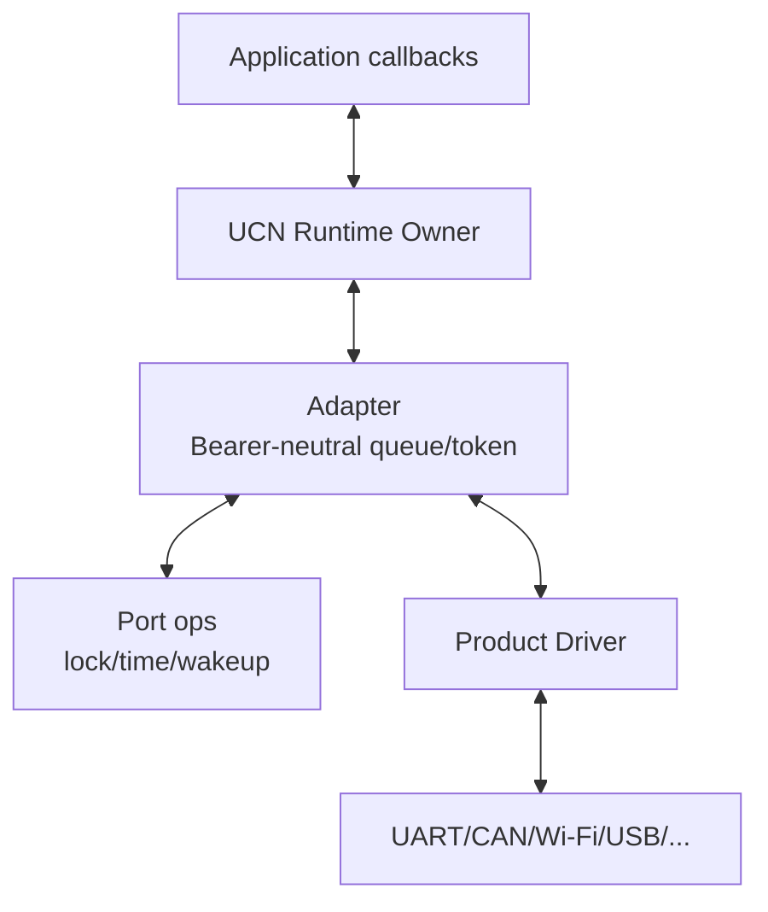
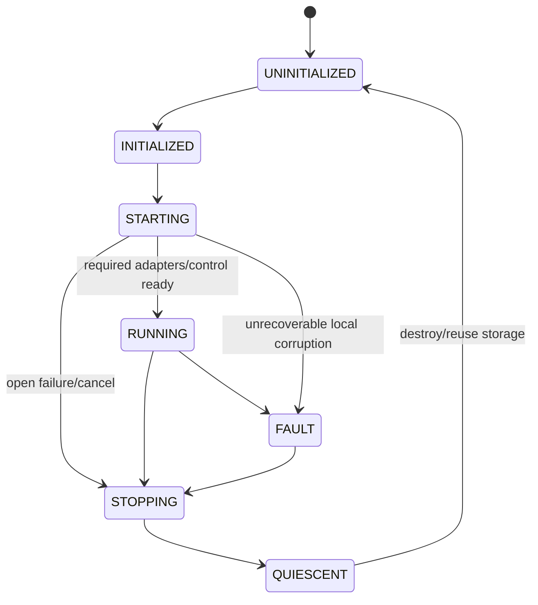
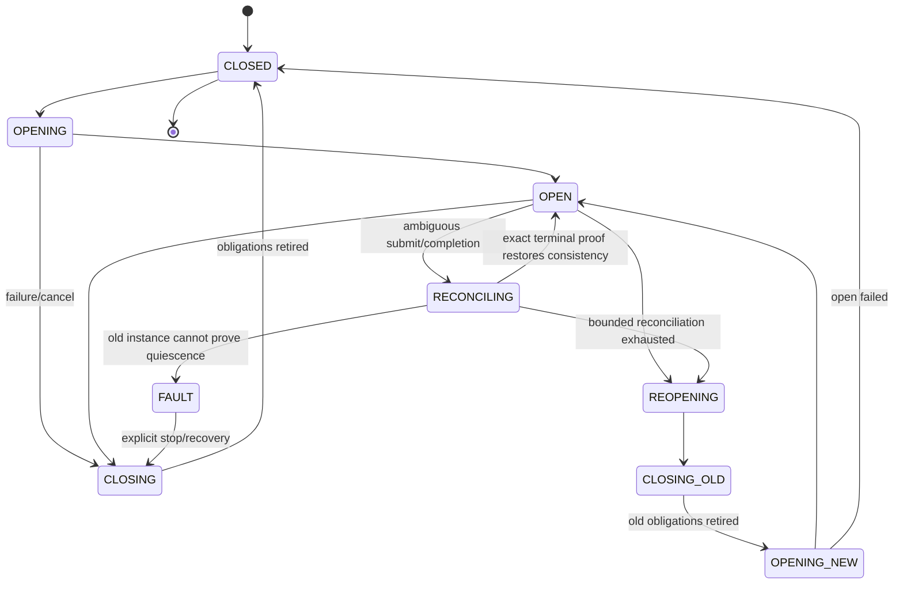
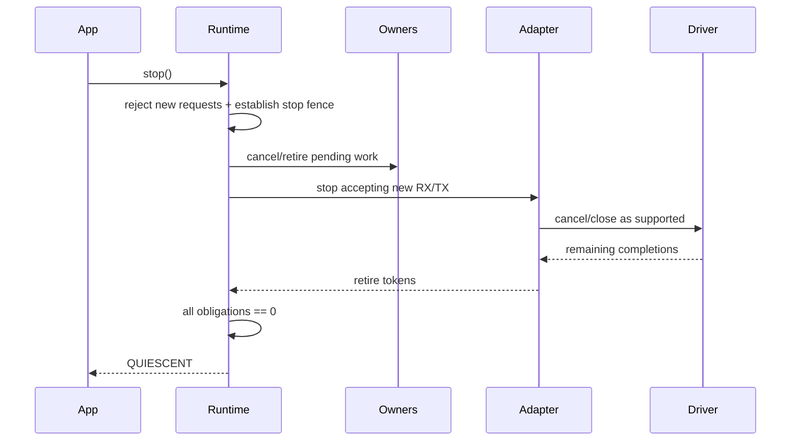

# 05 Runtime、Adapter、Port 与事件循环

> 状态：`SELF-REVIEWED / EXTERNAL REVIEW REQUIRED`
>
> 本文负责本地执行模型：唯一 Runtime Owner 怎样接收 Driver 事件、推进协议、调用应用以及安全停止。它不定义具体 Bearer 驱动和路由算法。

## 1. 分层



- Runtime：协议状态唯一推进者；
- Adapter：完整 RX Item 和 TX Token 的固定容量边界；
- Port：锁、原子、单调时钟、唤醒等平台能力；
- Driver：介质 I/O，不拥有协议 Route/Session/Endpoint。

## 2. Runtime 与 Adapter 生命周期





Driver callback、Application callback 和 `ingress_active` 是与生命周期正交的活动门，不是 Runtime phase。改变 Runtime/Adapter 生命周期的入口，在任一 callback 或 `ingress_active` 时必须拒绝且不写状态。任何 helper 都不能在 callback 返回后无条件写 `RUNNING`；只有生命周期 Owner 能依照上述转换改变 phase。

## 3. RX Item 必须原子

一个 RX Item 至少概念性包含：

```text
adapter_instance
link_instance_generation
rx_token
complete_frame_bytes
frame_length
ingress_link
receive_timestamp/event_key if enabled
driver_metadata
```

Frame 与时间戳不能分别进入两个只靠顺序配对的 Ring。

## 4. ISR/Driver 入队

```text
adapter_rx_publish(adapter, input):
    enter shared task/ISR-safe gate
    validate adapter running and link generation
    if one complete RX item cannot be reserved:
        publish no RX token and no Buffer obligation
        leave input ownership with Driver/caller
        leave gate and return NO_SPACE
    reserve one complete RX item
    copy or bind complete frame and metadata atomically
    assign rx token
    publish item with release semantics
    leave gate
    notify Runtime
```

这里的 task/ISR-safe gate 是保护 Adapter Ring/Token 发布的短临界区，与阻止控制 API 递归的 callback-domain gate 不是同一把不可重入锁。Driver 在 callback-domain gate 持有期间必须仍能原子写入 TX token 内嵌 completion latch，并能将完整 RX Item 发布到 RX 队列，否则同步 completion 会死锁。RX 表满时整项拒绝，不能只保存 Frame 丢失时间戳或只保存 metadata。Copy 输入在失败时从未转移所有权，Driver/caller 继续回收原 Buffer；bind/zero-copy 输入也只有在 RX Item、token 与 obligation 原子发布时才转移给 Adapter，预留失败仍由 Driver/caller 持有并回收。发布后的 RX Item 同时建立一个 obligation，状态至少为 `PUBLISHED → CLAIMED → DELIVERY_RETRY(optional) → RETIRED`；任何结构、代际、Policy、Endpoint 或 callback 失败都必须经过精确 token/generation 的共同退休路径，不能用早返回遗留队首。

TX completion 不使用可能分配失败的独立“完成事实槽”。每个 TX/open/close token 在被预留时已内嵌一个固定 terminal latch：

```text
adapter_completion_publish(adapter, token_ref, terminal_fact):
    enter Adapter task/ISR-safe event gate
    resolve exact adapter instance + token slot + token generation
    require token state permits {SUBMITTING, SUBMITTED, RETIRING, OPENING, CLOSING}
    if latch == EMPTY:
        latch = terminal_fact with release semantics
    else if latch == terminal_fact:
        record bounded duplicate diagnostic
    else:
        latch = CONFLICT without discarding either "may-have-submitted" fact
        establish Adapter contract fence
    leave gate
    try_publish_wakeup_hint()  # 队列满可丢 hint，不得回滚 latch
```

内嵌 latch 使每个已预留 token 都有一个不可失败的完成落点。Runtime 在每轮保留维护预算中扫描活动 token latch，wakeup 只减少延迟，不承担正确性。

## 5. Runtime step

```text
runtime_step(runtime, now, budget):
    require phase in {STARTING, RUNNING, STOPPING, FAULT}
    require not ingress_active and no callback active
    require now is valid monotonic input

    scan every active token's embedded completion latch with reserved budget
    scan READY receipt callback obligations with a separate reserved budget
    # READY -> INVOKING -> DELIVERED is correctness-critical; wakeup is only a hint
    process latched driver completions and eligible receipt callbacks; wakeup queue is only a hint
    process invalidation/fence work
    process cancellation and retirement

    if phase == STARTING:
        advance bounded adapter-open continuations
        return MORE_WORK or IDLE

    if phase in {STOPPING, FAULT}:
        reject/retire newly arrived RX without business delivery
        advance bounded close/cancel/quiescent continuations
        return MORE_WORK, QUIESCENT, or FAULT

    while budget remains and RX exists:
        ingress_active = true
        process one immutable RX item
        ingress_active = false

    advance bounded protocol timers
    schedule control traffic before ordinary/bulk quotas
    schedule ordinary TX according to admission
    return MORE_WORK or IDLE
```

`process one immutable RX item` 即使返回错误也必须把 `ingress_active` 恢复为 false；实现应使用单一 epilogue，而不是在中间分支直接返回。Endpoint 的 `RETRY_NOT_CONSUMED` 只在其保证零业务副作用时允许，使用原 token 有界延期；超时或重试耗尽后退休该 item。

## 6. 回调重入

```text
call_driver(runtime, callback_domain, prepared_continuation, operation):
    require lifecycle phase permits this exact operation
    expected = exact_driver_precondition(operation)
    require prepared_continuation.kind == expected.continuation_kind
    require prepared_continuation token/adapter instance/generation matches operation target
    require no ingress/app callback active
    if atomically try_acquire caller-owned callback-domain gate fails:
        return BUSY with target state and continuation unpublished/unchanged
    result = call_driver_with_gate_held(runtime, callback_domain,
                                        prepared_continuation, operation)
    return result

call_driver_with_gate_held(runtime, callback_domain, prepared_continuation, operation):
    require callback_domain gate is held by this Runtime/Owner
    require no ingress/app callback active
    under Adapter event gate:
        if lifecycle/instance/generation or required pre-callback state is stale:
            result = ERR_STATE
            go to EPILOGUE without publishing any target state/continuation
        revalidate lifecycle/instance/generation and required pre-callback state
        stage one unpublished operation bundle containing:
            exact target state, continuation, token generation and any outer
            lifecycle fence required by the operation
        publish that complete bundle atomically
        runtime.driver_callback_active = true
    result = driver.operation()
    under Adapter event gate:
        runtime.driver_callback_active = false
        merge driver return value with any early embedded latch using the
            frozen truth table; consume the continuation at most once
EPILOGUE:
    runtime.driver_callback_active = false if it was set
    atomically release exact callback-domain gate ownership on every path
    return normalized result
```

`exact_driver_precondition()` 是冻结表而不是“任意 pending”判断：TX submit 对应
`TX_SUBMIT + SUBMITTING`；initial open 对应
`ADAPTER_OPEN + {adapter phase=OPENING, open token=OPENING}`，reopen 的新实例对应
`ADAPTER_OPEN + {adapter phase=OPENING_NEW, open token=OPENING}`；close 对应
`ADAPTER_CLOSE + CLOSING`，reconcile query/cancel 对应各自
`RECONCILE_QUERY/RECONCILE_CANCEL + RECONCILING/RETIRING`。普通 stop close 对应
`ADAPTER_CLOSE + CLOSING`；Reopen 内部发出的 close 仍使用同一
`ADAPTER_CLOSE` continuation，但目标状态是 `CLOSING_OLD` 并额外绑定外层 reopen operation。
类型或状态不匹配必须在
Driver 回调前零写拒绝，不能为了启动/停止能工作而绕开统一 callback-domain gate。

Callback-domain gate 的 Owner、Storage 和作用域由 Composition 明确提供：共享 Driver/ISR/Port 并发域的 Runtime、Adapter 或 Provider 绑定同一个 caller-owned gate；真正互相独立的域可以使用不同 gate。不得使用无同步静态全局指针，也不得误认为每个 Adapter 自己的局部锁能够防住跨 Adapter 重入。同步递归和双线程/双 Adapter 并发必须由 Port 的真实原子或临界区保护；`volatile` 不是同步原语。门必须先原子取得，之后才能在 Adapter event gate 下发布 `OPENING/CLOSING/SUBMITTING` 和 continuation；门忙时操作对象保持逐字节不变。所有 open/close/reopen/submit/reconcile Driver 路径只能经 `call_driver()`；`call_driver_with_gate_held()` 是唯一实际调用点，负责 `driver_callback_active`、早到 latch 合并及所有出口的 gate 释放。

TX token、内嵌 completion latch 和精确 continuation 必须在外部 `submit()` 前进入 `SUBMITTING`。Driver 可以同步返回 COMPLETE、返回 PENDING 后异步发 event，或在合同允许时于回调内锁存 event；无论哪种形式，同一 token 只允许消费 continuation 一次。回调内事件通过独立的 Adapter event-publish gate 先写 token latch，然后尝试入 wakeup 队列；它不递归执行 Runtime 状态机，也不尝试重新获取当前持有的 callback-domain gate。回调返回后，Runtime 在同一 event gate/等价原子区内完成 latch、Driver 返回值和 token 状态的合并，统一使用第 00 篇真值表。

## 6.1 `IN_DOUBT` 对账与 Adapter 隔离

```text
adapter_begin_reconciliation(adapter, ambiguous_token, now):
    require exact token/latch/continuation still exists
    adapter.accept_new_submit = false
    adapter.phase = RECONCILING
    freeze reconcile_deadline from the first ambiguity; retries cannot renew it
    retain every in-flight token and Buffer/DMA holder

adapter_reconcile_step(adapter, now, fixed_budget):
    process any exact terminal latch first
    issue bounded driver query/cancel through callback-domain gate
    if all ambiguous tokens obtain terminal proof and driver contract remains sound:
        retire exact obligations once
        adapter.phase = OPEN
        adapter.accept_new_submit = true
        return COMPLETE

    if now < reconcile_deadline:
        return PENDING

    fence old link instance
    asynchronously close/reset it using published continuation
    if Driver proves old instance quiescent:
        retire old tokens/holders exactly once
        checked-next link generation
        reopen according to normal lifecycle
        return RECOVERING

    adapter.phase = FAULT
    permanently quarantine all possibly-owned tokens/Buffers
    return FAULT
```

一旦进入 `RECONCILING`，不允许新业务提交，所以隔离数不会超过首次模糊时已在飞的编译期 TX 上限。超时不能直接释放 DMA Buffer；只有 Driver/hardware reset 合同证明 quiescence 才能退休 holder。无法证明时，保留槽位是可观测的永久隔离，Runtime 不得宣称 `BUFFER_RELEASED/QUIESCENT`。其他独立 Adapter 是否可继续服务由产品 Fault Policy 决定，但不能解除该 Adapter Fence。

应用回调内默认只允许明确列出的无副作用查询。`reopen`、`stop`、`destroy`、重新初始化和直接推进 RX 必须拒绝。

## 7. Link reopen

```text
adapter_reopen_begin(runtime, adapter, out_operation):
    require runtime lifecycle phase == RUNNING
    require adapter phase == OPEN
    require not ingress_active and no callback active
    require output remains untouched until local commit

    reserve reopen-operation + completion slots as unpublished staging
    freeze old link instance/generation in staging
    precompute checked-next generation; exhaustion -> FAULT before callback
    prepare first exact cancel/close continuation without publishing it
    # call_driver publishes the complete outer+inner bundle only after the gate
    # is held; there is no direct Driver call in this entry point.
    result = call_driver(runtime, callback_domain, prepared_close,
                          ADAPTER_CLOSE)
    if result is BUSY:
        rollback all unpublished staging
        return BUSY with adapter, output and old link unchanged
    # The prepared bundle atomically fenced the old link, set
    # adapter phase = CLOSING_OLD, and published the reopen operation plus
    # exact close continuation before the callback.
    return result mapped through the common close completion path

adapter_reopen_continue(runtime, adapter, event):
    require exact reopen operation + old instance/generation match
    retire exactly the completed old token
    if any old callback/DMA/Driver/RX/TX obligation remains:
        return PENDING

    prepare unpublished `ADAPTER_OPEN` continuation for
        {adapter phase=OPENING_NEW, open token=OPENING}
    result = call_driver(runtime, callback_domain, prepared_open_new,
                          ADAPTER_OPEN)
    # call_driver 取得 gate 后，才原子发布 phase=OPENING_NEW 和 exact continuation
    if result is pending:
        return PENDING
    if result proves open success:
        install precomputed new link generation
        adapter phase = OPEN
        complete reopen operation once
        return COMPLETE

    keep old instance fenced and retired
    adapter phase = CLOSED or FAULT according to failure class
    complete reopen operation as failure once
```

Reopen 不阻塞等待 I/O，也不在旧 obligation 存在时复用 Driver/Adapter Storage。迟到的旧 completion 通过 instance generation 被拒绝；失败后不能恢复旧已 Fence 的 Link，也不能伪装成新 Link 已打开。

## 8. 启动

```text
runtime_init(storage, manifest):
    validate address, size, alignment, schema, layout hash
    initialize local objects without external callbacks
    bind dependency owners and caller-owned callback-domain gates
    return INITIALIZED

runtime_start(runtime):
    require phase == INITIALIZED and no callback/ingress active
    preflight all required Adapter configs and reserve unpublished start continuations
    prepare the first required adapter OPEN continuation without publishing it
    if there is a required adapter:
        atomically try_acquire its callback-domain gate
        if busy: rollback unpublished start staging and return BUSY with runtime unchanged
        prepare a bundle for {runtime STARTING, adapter OPENING,
            open token OPENING, exact first continuation}
        result = call_driver(runtime, callback_domain, prepared_open, ADAPTER_OPEN)
        if result is BUSY or PENDING:
            return PENDING with STARTING bundle retained
        if result is definitive failure:
            publish stop fence + CLOSE_REQUIRED work marker
            phase = STOPPING
            return PENDING
        consume synchronous completion through the common open completion path
    else:
        atomically publish RUNNING without external callback
    for each remaining required adapter within bounded cursor:
        prepare exact unpublished OPEN continuation
        result = call_driver(runtime, callback_domain, prepared_open, ADAPTER_OPEN)
        if result is BUSY or PENDING:
            retain cursor and return PENDING
        if result is definitive failure:
            publish stop fence + CLOSE_REQUIRED work marker
            phase = STOPPING
            return PENDING
        consume synchronous completion through the same event path before
            preparing the next adapter

    when all required adapters are OPEN:
        phase = RUNNING
        enable only business capabilities whose dependencies are Ready

    if any required open fails:
        keep business capabilities disabled
        phase = STOPPING
        asynchronously close/retire already-opened adapters
        when cleanup completes, return INITIALIZED or FAULT by failure class
```

`runtime_start()` 是可返回 `PENDING` 的有界状态机，不在一次调用中循环阻塞等待所有 Driver。对象初始化完成不等于 Adapter 已打开，也不等于网络、Session、Route 或 Authority 已 Ready；`STARTING` 期间不得接受普通业务 Request，只开放完成启动所需的内部控制 continuation。

## 9. 停止与 Storage 复用



`stop()` 只建立 stop Fence、把 phase 原子推进为 `STOPPING`，并发布不依赖具体 Driver 调用的 `CLOSE_REQUIRED` 工作标记，然后返回 COMPLETE 或 PENDING。它不得在尚未取得 callback-domain gate 时发布 Driver-specific close continuation；后续 `runtime_step()` 取得 gate 后，才通过 `call_driver()` 为每个 Adapter 准备并发布精确的 cancel/close bundle。Driver cancel/close、Provider I/O 和剩余 completion 全部由后续 `runtime_step()` 有界推进；任何 callback 失败不得把 phase 恢复成 `RUNNING`。若 Driver 永远不能证明 DMA/Buffer 已退休，Runtime 可以保持 `STOPPING` 或进入 Fault，但不能谎报 `QUIESCENT`。

只有所有 Request/Attempt/RX/TX/Buffer/timer/pending/callback obligation 为零、所有 Adapter 为 CLOSED 且 callback-domain gate 无本对象持有者时，才发布 `QUIESCENT`。只有 `QUIESCENT` 才允许 destroy 或复用 caller-owned Storage。

## 10. 固定资源和测试

必须量化：RX Items、RX Retry、TX Tokens（每项内嵌 terminal latch）、submit/open/close/reopen continuation、start/stop/reconciliation operation、wakeup hints、callback-domain gates、每次 step 的最大工作量和保留维护预算。Callback depth 固定为 1；递归 callback 不靠扩栈支持，而是失败关闭。表满时新业务/新 lifecycle operation 在零外部副作用前拒绝，已有 latch、取消和退休仍使用 token 内嵌状态与保留预算推进。Wakeup 队列容量不得决定 completion 是否丢失。

对抗测试：

- App callback 内 `reopen/stop/init` 全部拒绝且对象不变；
- Driver callback 内跨 Adapter 控制调用拒绝；
- 双线程双 Adapter 在 TSan 下无数据竞争；
- RX Item 满时整项丢弃，Frame/时间戳不拆散；
- RX Ring 满的 Copy 与 bind/zero-copy 输入均不发布 token/obligation，所有权仍由 Driver/caller 精确回收；
- reopen 后旧 completion 不影响新实例；
- stop 时新请求拒绝，但 completion 和 Buffer retire 继续。
- Driver 在 `submit/open/close` 内同步发布 completion：操作已处于 `SUBMITTING/OPENING/CLOSING`，精确 continuation 只消费一次；
- wakeup 队列已满时 callback 内完成：内嵌 latch 仍锁存，后续保留扫描必须发现；
- wakeup 队列已满时 Receipt callback 仍由保留预算扫描 `READY -> INVOKING -> DELIVERED`，RUNNING/STOPPING 均不得永久丢失；
- 早到 terminal latch 与 submit 返回值的全组合：按第 00 篇真值表，不倒退、不重复退休；
- ambiguous submit 后 Driver 永不证明 quiescence：新 submit 立即停止，对账到界后 Adapter Fault，Buffer 不伪造释放；
- `STARTING` 打开第二个 Adapter 失败：第一个异步关闭，期间不进入 RUNNING；
- reopen cancel 首次 PENDING、后续完成：新 generation 只在旧 obligation 为零后发布；
- stop 的 Driver close 返回错误：Runtime 不恢复 RUNNING，也不提前报告 QUIESCENT；
- 非法 RX、Endpoint RETRY 到期和 callback 错误均退休原 RX obligation。
- submit/open/close/reconcile continuation kind 或前置状态交叉错配：Driver 调用次数为零，对象与输出不变。
- driver.open 在回调内同步调用 stop，或首个 open 同步失败：生命周期 bundle、early latch、callback-active 与 gate 逐字节收口；不允许重入改写或遗留已发布 continuation。

## 11. Feature OFF、重启与持久化

- 某 Adapter OFF：对应 API/符号、Driver slot、RX/TX Ring 和 continuation 不进入产品布局；Runtime 本身仍可由其他 Adapter 使用。
- Port 能力不足：在构建或 `runtime_init()` 阶段拒绝依赖组合，不能运行时静默退成无锁/无单调时钟。
- zero-copy OFF：不建立 App Buffer holder，Copy 路径仍遵守相同 completion/retirement 合同。
- Realtime OFF：RX Item 不包含 timestamp event key，但 Frame、metadata 与 token 仍作为一个原子 item。
- Diagnostics OFF：保留饱和的必要错误计数，不创建无界 trace。

Runtime/Adapter/Driver token、callback continuation 和 Link Handle 不跨重启；新启动生成新的 Runtime、Adapter 与 Link Instance。Persistence 只能恢复其自身 Record 和上层明确允许的 durable 状态，不能声称旧 Driver/DMA 已完成。任何持久化 load/submit/poll callback 也必须绑定明确 callback-domain gate，并在外部调用前发布 I/O continuation。
