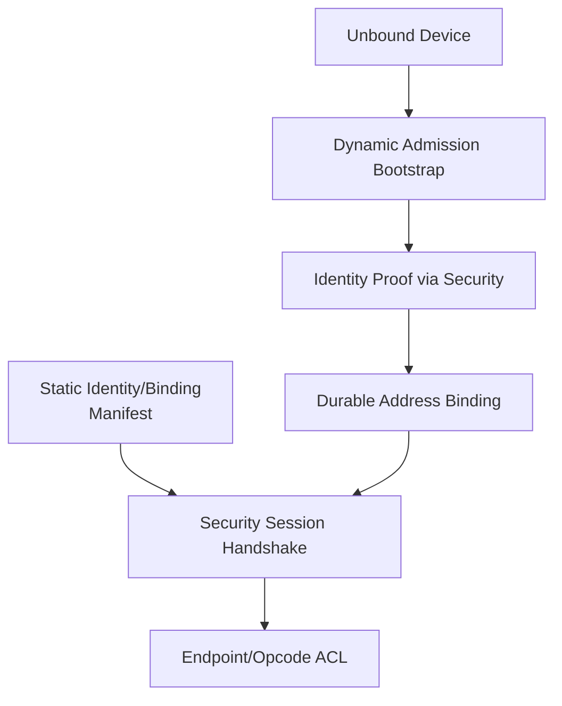
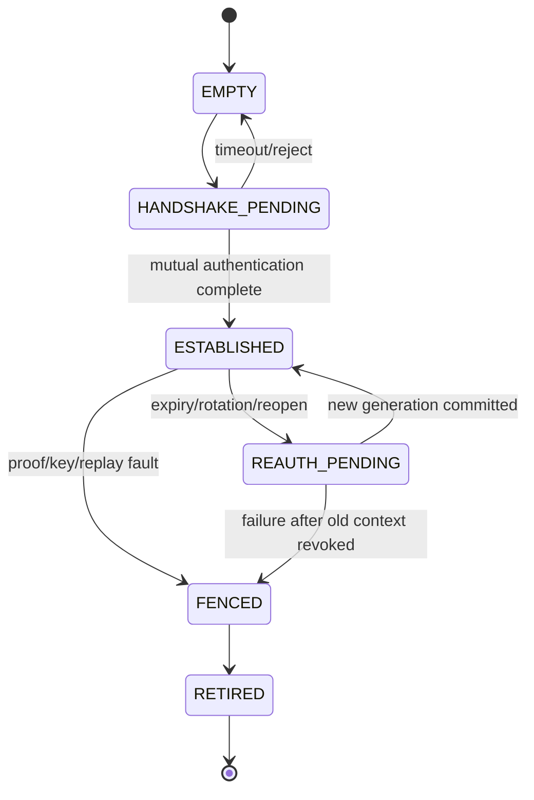

# 06 Identity、Security 与 Admission

> 状态：`SELF-REVIEWED / EXTERNAL REVIEW REQUIRED`
>
> 本文负责三类经常被混淆的能力：设备是谁、相邻安全上下文怎样建立、陌生设备怎样取得网络资格。本文不定义 Route、Cluster 或业务 ACL 的全部字段。

## 1. 职责边界

| Owner | 负责 | 不负责 |
| --- | --- | --- |
| Identity | Device Principal、Realm、Address Binding、Binding Generation | Peer Session nonce、动态 Route |
| Security Session | Peer handshake、认证、Key/Suite、Session Generation、Sequence、Crypto Replay、reauth/rotation | 分配网络地址、决定设备是否成为 Cluster voter |
| Dynamic Admission | 未绑定设备的 Bootstrap、资格审核、动态 Address Binding | 已绑定节点重启后的普通 Session 重建 |
| Endpoint Policy/ACL | 当前 Principal 是否可调用指定 Endpoint/Opcode | 证明 Principal 本身 |

“认证设备”不等于“给设备动态分配地址”。预配置节点可以关闭 Dynamic Admission，但仍建立新鲜 Security Session。

## 2. 组合



静态配置保存的是身份、信任锚和密钥材料，不是永久有效的运行时 Session。每次启动、Link reopen 或 Session Generation 变化后都要建立新鲜 Sequence/Replay 域。

## 3. Security Session 状态机



## 4. 已绑定节点重连

```text
security_ensure_session(peer_binding, link):
    require peer_binding belongs_to current Identity Owner
    require binding generation current and not fenced
    if a current session exists for peer+link and not expired:
        return existing handle

    reserve handshake pending under per-peer/per-link quota
    create fresh local challenge and session transaction id
    bind transcript to:
        protocol version, handshake role and ordered message transcript
        session transaction id
        realm
        local and remote principal
        local and remote binding generation
        link instance generation
        proposed session generation and parent high-water proof
        suite/key selector
        both nonces
    include the same transcript in KDF, ACCEPT and COMMIT proof
    send authenticated handshake messages
    return PENDING
```

此路径不调用地址分配 Authority。

`session_transaction_id` 不是本地查表提示，而是认证事务身份的一部分。任一消息角色、顺序、
事务 ID、nonce、Binding、Link Generation 或 Suite 不匹配都属于另一事务；不得把一个事务的
`ACCEPT/COMMIT` 用于另一个 pending。精确重复只能读取原 pending/terminal receipt，不能刷新
Deadline、Generation 或密码预算。

## 5. 动态入网

```text
admission_begin_unbound(link, bootstrap_identity):
    verify cookie/rate limit before expensive crypto
    reserve one bounded bootstrap pending
    verify identity transcript and freshness
    consult Admission Policy/Authority
    allocate Address Binding Generation persist-before-promise
    re-check authority and policy after persistence completes
    publish final binding
    start ordinary Security Session
```

未完成 Address Binding Commit 前，Bootstrap 地址只允许一跳控制事务，不得路由普通业务。

## 6. 发送保护

```text
security_protect(session, semantic_frame, output_sealed_artifact):
    precheck no input/output/workspace partial overlap
    validate session handle, generation, expiry and fence
    validate suite/key selector and payload budget
    accept an exact sequence reservation from its unique field owner
    if this is Hop Sequence, allocate it from Security's persisted interval
    otherwise require the Core/Flow/Group owner's reservation token
    irreversibly consume the reservation through that owner before crypto callback
    establish callback/reentry gate
    build canonical AAD from immutable wire fields
    invoke provider
    on success atomically commit one immutable origin-sealed artifact
    on failure keep output untouched but never reuse the consumed sequence/nonce
```

普通 C1 Origin Sequence 由 Core Message Sequence Owner 分配；Security 只把它纳入认证/Replay 绑定，不拥有该业务序号。

密码 Provider 尚未被调用的纯校验失败可以零消耗返回。一旦 Provider 能够观察 Key/Nonce，
对应发送 Sequence 必须由它的唯一字段 Owner 进入 `CONSUMED/BURNED`，即使 Provider 返回错误、
Driver 未发送或调用方取消也不能回到可分配集合。Security 自己只分配 Hop Sequence；C1、
C2/C4 和 Group Origin Sequence 分别仍由 Core Message、Flow 和 Group Sender Owner 分配。
持久化区间的未使用尾部可在同一可信运行期继续分配，但区间高水位不得因重启、失败或回滚旧
Record 而降低。

`security_protect()` 成功产生的 Origin 保护结果不是可以按同一 Sequence 重新计算的临时
Buffer，而是 `ORIGIN_SEALED` artifact。它固定保存本次 Origin 不可变 Header、Payload、
Origin Tag、Sequence、Suite/Key Generation 和 canonical digest。Reliable 重传只能取得该
artifact 的只读 holder 并重发完全相同的 Origin bytes；不得再次调用密码 Provider 使用同一
Nonce。每个下一跳仍可在该 artifact 外分配全新的 Hop Sequence/Tag。artifact 只有在所有
Driver/Hop/Reliable holder 和合法重试窗口都退休后才可释放。

### 6.1 Hop Profile 不由 Frame 自报

低开销 Common Header 没有 H0/H1/H2/H3 位。RX 只能先在已验证 Carrier 边界内只读最小
Contract/context selector，再用 `{link instance generation,exact ingress context}` 找到唯一活动
Hop Profile、Key/Context fingerprint 和预期 Trailer 长度。找不到、找到多个、总长度不匹配或
generation 不确定均在 Replay/密码/协议状态写入前拒绝；不能试 H0 后再试 H1，也不能依次试
current/previous Key。H1/H3 换钥必须先 Fence 旧映射、完成有界 drain/cancel，再原子发布新映射。
H2 只由已认证 C2 Direct Flow Context 证明，C2+O1/O2 本身不等于 H2。TX 同样从 exact egress
Context 获取唯一 Profile，应用与 Payload 无权指定或降级。逐字节细节以低开销 Wire 3.0 为准。

## 7. 接收验证

```text
security_open_classify_reserve(session_selector, input, output, now):
    precheck all ranges and overlap before reserving replay state
    locate exact peer/group security context
    require context current and not expired/fenced
    build canonical AAD
    verify tag/decrypt into non-overlapping workspace
    compute Wire 2.6 AAD digest and PAYLOAD_DIGEST over authenticated origin plaintext
    atomically classify the replay-window relation as exactly one of:
        FRESH_AUTHENTICATED:
            reserve one exclusive REPLAY_MUTATION handle
        AUTHENTICATED_REPLAY_CANDIDATE:
            return one read-only REPLAY_EVIDENCE handle; reserve no bitmap mutation
        REPLAY_IN_FLIGHT:
            same sequence already has a live mutation reservation; reject BUSY
        REPLAY_STALE_OR_INVALID:
            reject
    every returned handle binds:
        security owner/runtime instance
        context slot/generation + key slot/generation
        session/key lease deadlines + security-policy generation
        source principal + sequence + classification + digests
    REPLAY_MUTATION additionally binds:
        reservation slot/generation/deadline
    expose payload only to bounded protocol preflight; do not deliver or mutate business state yet
    for AUTHENTICATED_REPLAY_CANDIDATE expose only the read-only evidence:
        canonical transaction key, immutable-AAD fingerprint and payload digest
        to the Reliable receipt owner
    let the Reliable owner classify EXACT_DUPLICATE or REPLAY_CONFLICT
        against its retained original receipt
    reject REPLAY_STALE_OR_INVALID without Endpoint side effects

security_replay_commit(exact_mutation_handle, trusted_now):
    require classification == FRESH_AUTHENTICATED
    validate owner/runtime/context/reservation generations and unexpired deadline
    revalidate exact session/key generations, leases, revoke/fence and security-policy generation
    require trusted_now is known and before every half-open lease/deadline
    on any mismatch atomically abort only this mutation; do not mark sequence seen
    atomically consume the exact reserved replay mutation once
    return OK; no later operation in the caller's ordered commit may fail

security_replay_abort(exact_mutation_handle):
    require classification == FRESH_AUTHENTICATED
    validate exact still-RESERVED handle
    release only this reservation; do not mark sequence seen
```

Replay bitmap 只能证明 Sequence 已出现，不能单独证明新输入与第一次输入完全相同。因此
Security 不得在查询 receipt 前声称 `EXACT_DUPLICATE`。只有 Reliable Owner 找到仍在 retention
内的原 receipt，并逐项匹配事务键、不可变 AAD fingerprint、Payload digest、Interaction 和
Security 语义后，才能重发相同 ACK。任一字段不同都返回 `REPLAY_CONFLICT`；receipt 已过期或
不存在时失败关闭，不能把普通 stale Replay 自动升级成 ACK。只读 `REPLAY_EVIDENCE` 既不能
调用 `security_replay_commit()`，也不能进入 Endpoint/Group 的首次业务提交；查询结束后只需
退休当前 RX/密码 workspace。只有 bitmap 中已经 `COMMITTED` 的 Sequence 才能产生该 evidence；
仍处于 `RESERVED` 的并发重复输入固定返回 `REPLAY_IN_FLIGHT`，不得取得第二个 reservation，
也不得提前复用尚未发布的 receipt。

Security OFF/O0 没有“已认证重复”这一结果。若 Composition 允许 O0 Reliable，它必须同时满足：
Endpoint 明确声明 `PUBLIC_UNAUTHENTICATED` 且无权限副作用；当前 Planner/Route Owner 又提供
精确绑定 Link/Path Generation、由产品 Threat Policy 批准的 `TRUSTED_LINK_ALLOWED` 证明。
缺少任一条件时，在创建 Attempt、receipt 或 ACK 前拒绝。Transport 只在 per-Link/
per-source 限流之后，用完全相同的 canonical 事务键和 Payload digest 查询自己的 receipt，
匹配时只重发非敏感 Delivery ACK。要求原始 Principal、Request 副作用或敏感结果的 Reliable
业务必须使用 O1/O2；否则 Composition 在创建 Attempt 前拒绝。

Replay mutation reservation 使用固定 `UCN_V6_MAX_REPLAY_RESERVATIONS` 槽；寿命由编译期非零
`UCN_V6_REPLAY_RESERVATION_LIFETIME_US` 决定，且不得超过 Security Owner 的最大处理时长。
创建时要求可信 `now_us:u64`，通过 checked-add 计算绝对 deadline；未知时钟、零寿命、超上限或
加法溢出均在占槽前拒绝。有效区间固定为 `now_us < deadline_us`，等于 deadline 即过期。并发相同 Sequence
在原 reservation 提交前只能得到 `REPLAY_IN_FLIGHT`；提交后才可取得只读 evidence 并查询
retained receipt，不能各自获得可消费承诺。reservation 超时仅由
Security Owner 的独立保留预算有界维护路径清理，错误 handle/输入不得 lazy-expire 其他合法槽；
`AUTHENTICATED_REPLAY_CANDIDATE`、`REPLAY_IN_FLIGHT` 与 `REPLAY_STALE_OR_INVALID` 均不占新的
mutation 槽。Group、
Reliable 和普通交付必须先预留自己的全部下游资源，再进入可失败 `PRECOMMIT` 调用
`security_replay_commit(handle,trusted_now)`；Runtime Coordinator 在同一有界 gate 内先复验
Endpoint ACL/Policy handle 的精确 Generation，再由 Security 复验 Session/Key/Policy/Fence 和
期限。调用失败时释放全部未发布资源；只有调用成功、Replay 已消费后才能进入
`NOFAIL_PUBLISH`，随后只做已预留的不可失败写入。若任一前置复验或下游预留失败，执行 abort 并保持
Replay Window 与业务状态都不变；不能用“slot generation 没变”替代使用点租约复验。

业务 Endpoint 在交付前继续执行 `{principal, endpoint, protocol_opcode}` ACL。Frame Type 通配不能扩大到全部 Control Opcode。

## 8. Feature OFF

| 关闭项 | 唯一关闭行为 | 仍允许的行为 |
| --- | --- | --- |
| Security | `REQUEST_REJECTED`：要求 O1/O2、Peer/Group Auth 或认证 Principal 的请求在零副作用前拒绝 | Policy 明确标为公开明文的 O0/H0 路径；不得伪造 Principal |
| Dynamic Admission | `REQUEST_REJECTED`：UNBOUND Bootstrap/JOIN 不分配 pending、不发 Challenge | Manifest 静态 Binding 节点仍可建立新鲜 Security Session |
| Persistence | `CONFIG_REJECTED`：动态 Address、受保护 Session/Sequence 高水位等需要耐久承诺的组合在构建/init 拒绝 | 仅使用签名 Manifest 且无需推进耐久高水位的静态明文配置；具备等价 anti-rollback 硬件 Provider 时应把它作为 Persistence 实现接入 |

`Security OFF` 不能被解释为“跳过验证后仍返回 authenticated Principal”；`Admission OFF` 也
不能让已绑定节点回退成 UNBOUND Bootstrap。

## 9. 固定资源

Build Manifest 必须为下列项生成精确整数和 Storage 汇总；实现不得把“有界”解释成运行时扩容：

| 资源 | 编译期合同 | 扫描/满载行为 |
| --- | --- | --- |
| Peer Session | `UCN_V6_MAX_PEER_SESSIONS` | 每次 Owner run 最多扫描该值；满载不驱逐已认证 Session |
| Session Handshake Pending | `UCN_V6_MAX_SESSION_PENDING` | 每 Peer/Link 还受子配额；满载返回 `NO_SPACE` |
| Bootstrap Pending | `UCN_V6_MAX_BOOTSTRAP_PENDING`，默认 8；每 Link 默认 2 | 不匹配输入不得 lazy-expire/替换合法槽 |
| Replay Window | `UCN_V6_REPLAY_WINDOW_BITS` 与 `UCN_V6_MAX_REPLAY_WINDOWS` | 位宽和窗口数均在编译期固定 |
| Replay Reservation | `UCN_V6_MAX_REPLAY_RESERVATIONS`、`UCN_V6_REPLAY_RESERVATION_LIFETIME_US` | 表满在业务预留/交付前返回 `NO_SPACE`；错误输入不驱逐，不刷新 deadline；Owner 保留清理预算 |
| Key Slot | `UCN_V6_MAX_KEY_SLOTS` | ACTIVE/STAGED/PREVIOUS 状态不因新请求被驱逐 |
| Sequence interval | `UCN_V6_SEQUENCE_INTERVAL_SIZE` | 每次预留固定区间；到阈值轮换父代际或 Fault |
| 认证前预算 | `UCN_V6_PREAUTH_OPS_PER_RUN` 与 per-Link token bucket | 单次 Owner run 的 Cookie、签名和 Provider 操作分别受限 |

启用对应能力时，上述值必须为有限合法值并进入 Layout/Manifest Hash；关闭能力时相关值固定为
0 且对象/符号不进入产品面。生成的 `UCN_V6_SECURITY_STORAGE_BYTES/ALIGNMENT` 与
`UCN_V6_ADMISSION_STORAGE_BYTES/ALIGNMENT` 是静态分配的唯一大小来源。

## 10. 对抗测试

- Admission OFF、静态安全节点重启后能重新建立 Session；
- 延迟 Final Commit 不能重置 Authority Lease 起点；
- Future-start Challenge 在当前时间不能取得写权限；
- Input/Payload/AAD/Workspace 任意部分重叠均在零写入前拒绝；
- Session Generation 轮换后旧帧和旧 completion 拒绝；
- Bootstrap 洪泛受 cookie、配额、超时和密码预算限制；
- 未通过 Endpoint/Opcode ACL 的已认证 Source 仍被拒绝。
- 同一已认证 Sequence、相同事务键但不同 AAD/Payload digest 被 Reliable Owner 判为冲突，不重发 ACK；
- Replay bitmap 命中但 receipt 已过期时失败关闭，不能被 Security 误报为精确重复；
- O0 Reliable 只允许公开无权限副作用 Endpoint；Security OFF 时不得伪造 authenticated duplicate；
- O0 Reliable 缺 `TRUSTED_LINK_ALLOWED`、Path/Link Generation 改变或 Threat Policy 撤销时，零 receipt、零 ACK、零 Attempt；
- Replay reservation 后 Group/业务资源预留失败：abort 后 Replay Window 不变；并发同 Sequence 只能消费一次；
- Replay reservation 在 `deadline-1` 且所有 Context/Key/Policy 仍 current 时可提交；在
  `now==deadline`、Session/Key lease 到期、撤销、Fence 或任一绑定 Generation 改变时提交拒绝，
  下游状态不写；Replay candidate/in-flight/stale 输入不增加 mutation 槽计数；
- AAD/Payload/Transfer digest 全部按 Wire 2.6 Suite 1 重算，算法、domain string、长度或截断方式不同即拒绝；
- 同一语义明文在 O0/O1/O2 下的 `PAYLOAD_DIGEST` 相同；ciphertext、Origin/Hop Tag 与 Carrier
  padding 均不进入输入，Fragment Envelope 与业务字节则精确进入；
- O2 Reliable ACK 丢失后重传复用同一 `ORIGIN_SEALED` bytes，Origin Crypto Provider 只调用一次。
- H0/H1、C2-H0/H2、H1/H3 Key Owner 不明确或映射多于一个时，在密码调用和状态写入前拒绝；
  认证失败不得尝试另一 Profile/Key，换钥后的迟到旧帧不得用 previous Key 猜测接受。
