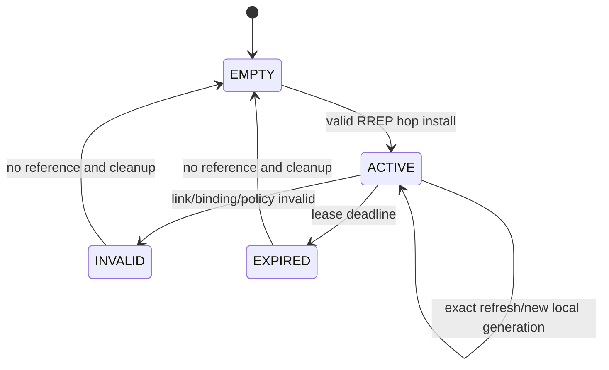
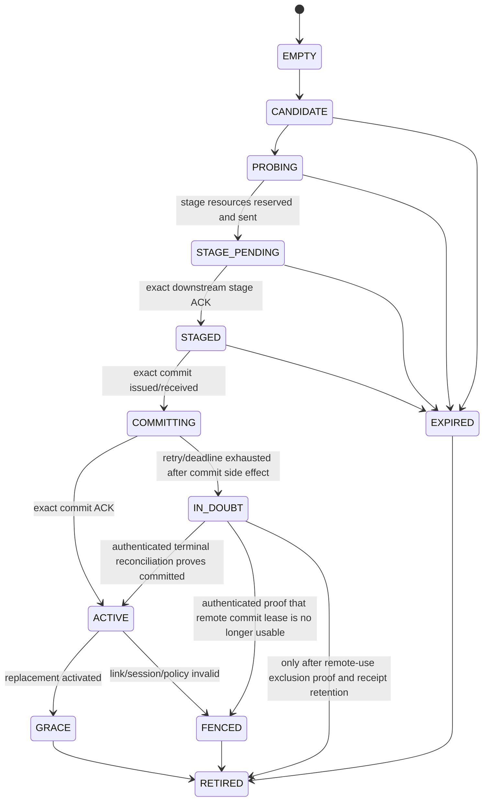
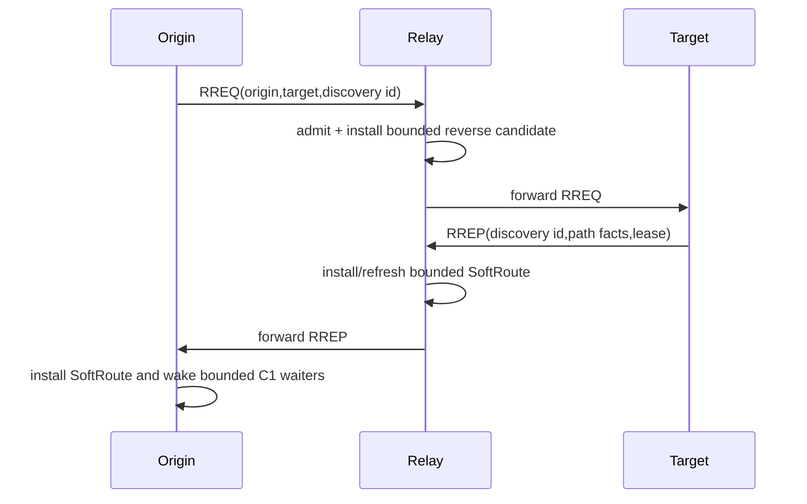

# 07 Route、Discovery 与 Forwarder

> 状态：`SELF-REVIEWED / EXTERNAL REVIEW REQUIRED`
>
> 本文负责网络可达性：Direct Binding、Static Route、基础 SoftRoute、高级 FlowPath 发现和逐跳转发。它不负责可靠 ACK、业务 Endpoint 执行或 Cluster 权威。简化主线分别见第 15 篇和第 24 篇。

## 1. 角色能力

| 能力 | 行为 | 硬依赖 |
| --- | --- | --- |
| `DISCOVERY_ORIGINATE` | 为本节点目标发起发现 | Route Store、C0 Control |
| `DISCOVERY_RESPOND` | 作为目标/已授权实体响应 | Identity/Policy、C0 Control |
| `DISCOVERY_RELAY` | 转发发现控制消息 | Forwarder、Route Store |
| `DISCOVERY_AUTHORIZE` | 批准受控路径/绑定 | 对应 Authority/Security |

叶子节点可只发起和接收，不必承担 Transit Forwarder。

## 2. Route 对象与权限分界

本文不再用一个“Dynamic Route”同时表示普通下一跳和可供权威消费的稳定路径：

| 对象 | 产生方式 | 用途 | 不允许的用途 |
| --- | --- | --- | --- |
| `SoftRoute` | RREP 逐跳安装 | C1 Best Effort/Latest，可选的单次 C1 Reliable Attempt | Pinned、C2/C3/C4、Network Time Sync、Cluster Authority、durable promise |
| `FlowPath` | Probe 后逐跳 Stage/Commit | C2/C3/C4、Pinned、长流、Realtime 和 Cluster 的路径证明 | 代替 Security/Quorum/Persistence 自身证明 |

`SoftRoute` 是可过期的易失下一跳提示，不发布 Authority，所以允许 RREP 在途中部分安装并靠租约回收。`FlowPath` 才拥有冻结 Proposal、Label、Capability 交集和可对账激活状态。

`FlowPath Route Domain` 的 canonical 身份字段为：

```text
realm
origin_principal
origin_address
origin_binding_generation
origin_session_generation
destination_principal
destination_address
destination_binding_generation
```

具体已安装 FlowPath 实例的键是 `{Route Domain, route_generation}`；`route_generation` 是该 Domain
下 Route Instance 的代际，不是第二个 Domain 身份字段。任何 Candidate
Transaction ID、Probe、Activate、ACK、RERR、
Previous Grace 和事务高水位都位于该完整 Domain 内。不同 Origin、不同 Source Session 或地址
被另一个 Device 复用后，即使 Candidate ID/Route Generation 数值相同，也不能命中旧 Route。

FlowPath 值包含：

```text
egress adapter/link instance
next hop binding
path MTU/capability summary
cost/hop count
expiry
fence
```

基础 SoftRoute 使用更小的本地键：`{destination binding, next-hop binding, link generation, local entry generation}`，不对端声称全网 Route Generation。静态 Route 是显式 fallback，不参与 FlowPath Route Generation 所有权；精确动态路径优先，静态 Route 可对合法 Source 提供通配中继。

## 3. 两个状态机

### 3.1 SoftRoute



SoftRoute 不出现 `STAGED/COMMITTING/IN_DOUBT`，因为它不对外承诺全路径原子激活。

### 3.2 FlowPath



## 4. 基础自动发现



RREP 安装的是 SoftRoute，不是 FlowPath。Relay 部分安装而 Origin 没有收到 RREP 时，只留下一个可过期的本地提示，不会授权或锁定业务执行。需要高级路径时，Origin 将该发现结果变成新的不可变 Candidate，再进入下文 Stage/Commit。

## 5. FlowPath Candidate 不可变性

```text
candidate_update_from_rrep(existing, incoming):
    if existing has any proof/generation/activation state:
        if incoming path identity differs:
            allocate a new candidate transaction
            never mutate existing path fields
        else:
            accept only idempotent matching information
    else:
        update candidate only if incoming is strictly better and valid
```

一旦 Candidate 已 Probe、分配 Route Generation、发送 Activate 或等待 ACK，路径快照不可就地改变。

## 6. FlowPath Activate 分布式提交

本节仅适用于 Advanced Route/Flow，不适用于普通 C1 SoftRoute。其精确五个 C0 Opcode 和 byte offset 由 Wire 文档拥有；在 Golden/Negative 完成外审前，只允许离线模型。

```text
handle_path_activate_stage(candidate, message, now):
    PRECHECK:
        validate exact Route Domain + candidate id + frozen proposal digest
        validate route generation, source, profile, capability and stage lease
        validate both forward/reverse route capacity
        validate output/next-hop capacity
    RESERVE:
        reserve all local route/label slots and outgoing frame
        create immutable STAGE_PENDING record with an absolute deadline
    SIDE_EFFECT:
        forward the same stage transaction downstream
    CONTINUE:
        target with no downstream hop validates and atomically publishes STAGED
        relay changes STAGE_PENDING to STAGED only after exact downstream STAGE_ACK
        only after local STAGED exists, retain receipt and send exact STAGE_ACK upstream

handle_path_activate_commit(staged, message, now):
    PRECHECK:
        require exact staged transaction and now < stage_deadline
        require frozen route/path/session/capability dependencies still current
        reserve commit output and terminal receipt before forwarding
    LOCAL:
        move STAGED to COMMITTING; do not publish Active yet
    SIDE_EFFECT:
        forward exact COMMIT downstream
    CONTINUE:
        target with no downstream hop atomically publishes Active and creates COMMIT_ACK
        relay publishes its reserved local route only after exact downstream COMMIT_ACK
        after local Active is visible, retain terminal receipt and send COMMIT_ACK upstream
```

这里的逐跳顺序是强制合同：`STAGE_ACK` 和 `COMMIT_ACK` 都只能沿 `Target → Relay → Origin`
方向，在本节点完成对应状态转换后向上游传播。Relay 不得因为“本地资源已经预留”就把
`STAGE_PENDING` 报告成 `STAGED`；也不得在下游尚未确认 Active 时把自己的 Route 提前发布。
Origin 是最后一个发布新 Active Route 的节点。

发送到另一节点的副作用不能靠恢复本地 snapshot 撤销。Stage 失败只回收本地预留；已经被远端
Stage 的状态由认证 `ABORT` 或绝对 stage lease 到期清理。Commit 途中失联时，各节点保留已有
终态/receipt 并用精确重复事务收敛，不得把远端可能已提交描述为“已回滚”。旧 Active Route
在 Origin 收到精确 `COMMIT_ACK` 前始终保持不变。

## 7. ACK 与重试

```text
handle_activate_ack(candidate_or_staged, ack, now):
    require candidate originated_here or exact relay ownership
    require candidate probe complete
    require expected stage/commit message was actually submitted
    require ack Route Domain, candidate_id, route_generation and proposal_digest exact match
    require ack arrives on frozen reverse path
    require now < transaction_deadline
    if STAGE_ACK:
        advance only to STAGED and retain receipt
    if COMMIT_ACK:
        atomically install route from frozen activation snapshot
        retain terminal receipt
```

ACK 丢失时使用同一完整 Route Domain、Candidate ID、Route Generation 和 Proposal Digest、全新外层
Sequence 有界重发。Stage 重试耗尽后发送有界 `ABORT` 并等待 lease 清理；Commit 重试耗尽时
返回 `IN_DOUBT`/受限诊断，保留旧 Active 和足以识别迟到 ACK/重复 Commit 的 terminal 状态，
不能立即复用 ID。远端 Stage/Commit receipt 到期规则必须晚于合法最大重试窗口。

## 8. Forwarder 快路径

```text
forward(frame, ingress, now):
    strict decode mutable hop fields and immutable e2e fields
    validate hop auth if required
    reject local-only/bootstrap traffic
    lookup exact dynamic route
    if not found, lookup permitted static fallback
    validate route expiry/fence/link generation/MTU
    decrement hop budget using checked arithmetic
    apply class-local admission; never elevate traffic class
    submit without parsing encrypted business payload
```

## 9. 失效

Link、Session、Binding 或 Route Lease 失效时立即 Fence 相关 Route；RERR 使用精确
`{完整 Route Domain, route_generation}` 失效，不能跨 Origin、Binding 或 Session 删除其他实例。

## 10. Feature OFF

| 关闭项 | 唯一关闭行为 |
| --- | --- |
| Route Store | `CONFIG_REJECTED`：除 Manifest Direct Binding 外，不允许声明自动路由/静态中继能力 |
| Discovery Origin | `REQUEST_REJECTED`：无 Route 的发送零 pending、零 RREQ；现有静态/Active Route 仍可用 |
| Discovery Relay | `REQUEST_REJECTED`：不创建反向 Candidate、不转发 RREQ/RREP |
| Forwarder | `REQUEST_REJECTED`：只允许本机 Origin/Terminate，不承担 Transit |
| Basic SoftRoute | `REQUEST_REJECTED`：无 Direct/Static 时 C1 自动发现不可用 |
| Advanced Route/Flow | `REQUEST_REJECTED`：C2/C3/C4、Pinned、Network Time Sync 和 Cluster Authority 不得把 SoftRoute 代替事务激活的 FlowPath |

只有已经完整定义和测试的 Manifest 静态 Route/Direct Binding 才属于 `FALLBACK_DEFINED`；其余
缺失能力一律不得被自动解释成广播、泛洪或无状态转发。

## 11. 固定资源

| 资源 | 编译期合同 | 满载/扫描行为 |
| --- | --- | --- |
| SoftRoute entries | `UCN_V6_MAX_SOFT_ROUTES` | 不驱逐被正在执行的 Attempt 引用项；新发现可拒绝 |
| RouteSet/Active/Grace | `UCN_V6_MAX_ROUTESETS`、`UCN_V6_MAX_ACTIVE_ROUTES_PER_SET` | 不驱逐 Active；每次推进扫描有硬上限 |
| Candidate/Probe | `UCN_V6_MAX_ROUTE_CANDIDATES` | 满载拒绝新发现，不覆盖已 Probe 项 |
| Stage/Commit pending | `UCN_V6_MAX_ROUTE_ACTIVATIONS` | Stage、Commit 和 terminal receipt 共用固定、分状态配额 |
| Discovery reverse cache | `UCN_V6_MAX_DISCOVERY_REVERSE` | 未认证/不匹配输入不得驱逐合法事务 |
| Label/Forwarding entry | `UCN_V6_MAX_FORWARD_LABELS` | 满载拒绝新 Path，旧转发继续 |
| Terminal receipt | `UCN_V6_MAX_ROUTE_RECEIPTS` | retention 覆盖最大重试/迟到 ACK 窗口 |

所有值由 Build Manifest 生成并进入 `UCN_V6_ROUTE_STORAGE_BYTES/ALIGNMENT`；每次 Owner run 的
Candidate、expiry 和 receipt 扫描预算也必须是编译期常量。

## 12. 对抗测试

- 基础 RREP 只安装 SoftRoute，不创建 Flow/Label/Route Generation；
- SoftRoute 部分安装后上游丢 RREP：到期清理，无 Authority/持久副作用；
- Cluster/Network Time Sync/Pinned 请求仅有 SoftRoute：返回 `NEED_DEPENDENCY(FLOW)` 或拒绝；
- 动态 Origin 经静态中继 Route 正常转发；
- 容量不足时 Activate 零写入、零发送；
- ACK Route Generation 错误不改 Route/Candidate/统计；
- ACK 丢失执行有界重发并保留旧 Active；
- 等待 ACK 时更优 RREP 不能改写已冻结 Candidate；
- Stage 后下游成功、上游 ACK 丢失：重复 Stage 只重发同一 receipt；
- Relay 仍为 `STAGE_PENDING` 时不得向上游发送 `STAGE_ACK`；Target 拒绝 Stage 时整条上游均不能进入 `STAGED`；
- Commit 后中继成功、向上游 ACK 失败：不能本地回滚远端副作用，重复 Commit 最终收敛；
- Relay 未收到下游 `COMMIT_ACK` 时不得发布本地 Active 或向上游发送 `COMMIT_ACK`；
- Origin 永久失联：未 Commit 的 Stage 由绝对 lease 清理，ID 在迟到窗口前不复用；
- Commit retry/deadline 耗尽进入 `IN_DOUBT`，不得按普通 Stage Abort 删除，也不得复用事务键；
- 相同事务键的重复 Stage/Commit 只重发冻结 receipt；字段冲突保持原状态并拒绝；
- Path 过期而 Generation 未变时转发仍拒绝；
- 叶子 Discovery Originator 不包含 Transit Forwarder 状态。
