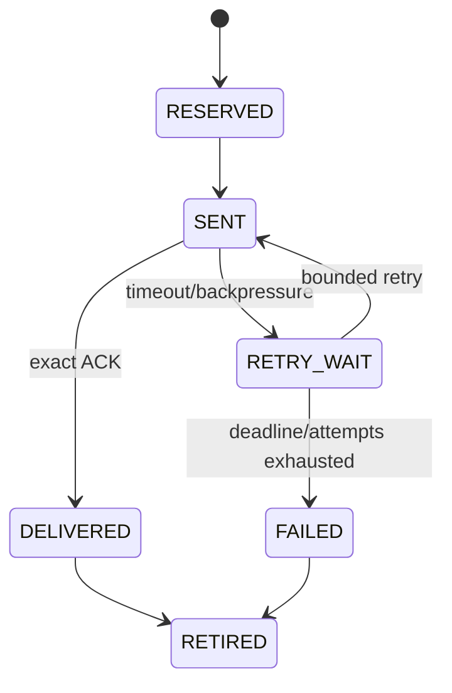
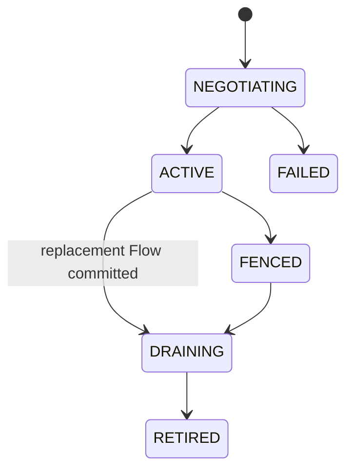
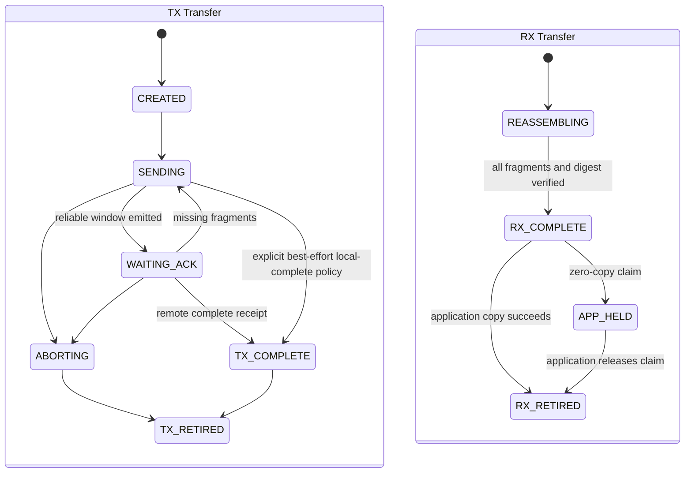

# 08 Reliable、Flow 与 Transfer

> 状态：`SELF-REVIEWED / EXTERNAL REVIEW REQUIRED`
>
> 本文负责交付机制分层。Reliable 表示确认与有界重试，Flow 表示稳定上下文，Transfer 表示超过单帧预算的数据重组；三者不是同一个开关。

## 1. 能力矩阵

| 需求 | Contract | Reliable | Flow | Transfer |
| --- | --- | --- | --- | --- |
| 单帧 Best Effort | C1 | 否 | 否 | 否 |
| 偶发单帧可靠 | C1 + Delivery ACK | 是 | 否 | 否 |
| 稳定一跳高频可靠 | C2 | 是 | 是 | 否 |
| 稳定多跳高频可靠 | C4 | 是 | 是 | 否 |
| 无 Flow 大消息 | C1 Transfer | 按 Endpoint 策略 | 否 | 是 |
| 一跳 Flow 大消息 | C2 Transfer | 按 Endpoint 策略 | 是 | 是 |
| 多跳 Flow 大消息 | C4 Transfer | 按 Endpoint 策略 | 是 | 是 |

`Flow OFF + Reliable ON` 必须走真实 C1 ACK/重传路径；若实现未完成，Composition 必须拒绝该能力声明。

## 2. C1 Reliable

事务键由 Wire 文档冻结。逻辑状态：



```text
c1_reliable_send(request, frame):
    reserve reliable transaction
    freeze destination binding, service, sequence and security context
    protect Origin fields exactly once and retain immutable ORIGIN_SEALED artifact
    acquire one read-only artifact holder for this Attempt
    for each bounded transmission attempt:
        reuse the exact Origin bytes/tag from ORIGIN_SEALED
        allocate a fresh per-hop Sequence/Tag for the selected next hop
        submit without invoking Origin crypto again
    arm retry deadline only after actual submission

on_ack(ack):
    authenticate and replay-check ACK
    require exact transaction key
    if exact duplicate after terminal:
        return idempotent result
    mark delivered and complete request
```

O1/O2 接收端重复报文先由 Security 返回 `AUTHENTICATED_REPLAY_CANDIDATE` 和 canonical
事务键/AAD fingerprint/Payload digest，再由本模块查询 retained receipt 并裁决
`EXACT_DUPLICATE` 或 `REPLAY_CONFLICT`。只有前者可重发相同 receipt，不能重复交付业务
副作用。普通 stale、receipt 已过期和 conflicting Replay 不得触发 ACK。

Security OFF/O0 不产生 authenticated candidate。若 Endpoint 明确允许
`PUBLIC_UNAUTHENTICATED + RELIABLE`，还必须由 Planner/Route Owner 为当前精确
Link/Path Generation 提供产品 Threat Policy 批准的 `TRUSTED_LINK_ALLOWED`。Transport 只能
在固定限流后对完整 canonical 事务键和
Payload digest 做本地 exact match，并重发不含敏感结果的 Delivery ACK；任何需要 Principal、
权限、外部副作用或缺少可信路径证明的组合在 Attempt/receipt/ACK 创建前拒绝。

`ORIGIN_SEALED` 的生命周期至少覆盖所有 Driver/Hop holder、ACK 最大等待、合法重试和迟到
completion 窗口。ACK 到达只结束 Reliable 事务，不得抢先释放仍被 Driver 使用的 artifact。

## 3. Flow

Flow Context 保存稳定执行上下文：

```text
flow_id
flow_generation
source/destination binding
route/path handle
security context handle
MTU/payload budget
traffic policy
expiry/fence
```



Advanced Planner 可建议 Flow 候选，但 Execution Binding 由 Flow/Runtime Owner 持有。

ACTIVE Flow 的 17 项 Context Fingerprint 不可就地修改。Rekey、Parent Session、Route/Path、
MTU、ACL 或 Policy 变化时，Runtime 让旧 Flow 保持原状态，同时创建另一个处于
`NEGOTIATING` 的新 Flow ID/Generation；新 Flow 完成认证 Setup/Commit 后再原子切换 Execution
Binding，旧 Flow 才进入有界 `DRAINING`。新 Flow 建立失败时，只有依赖仍有效的旧 Flow 才能
继续；Parent 已失效时旧 Flow 必须保持 FENCED，不能“回到 ACTIVE”。

## 4. Flow 快速发送

```text
flow_send(flow_handle, request, now):
    resolve exact runtime/owner/slot/generation
    validate route, session, MTU, policy and deadline at use point
    reserve flow sequence and queue credit
    encode C4 using frozen context
    submit attempt
```

任何依赖失效使 Flow 局部 Fence；Request 可按策略重新解析到 C1 或新 Flow，但旧 Attempt 不可变。

## 5. Transfer

发送和接收是两个对象，不能把应用持有 RX Payload 写成 TX 状态：



RX terminal receipt 与 Payload Buffer Obligation 是并列状态：前者可以在 Payload 被应用领取后继续
保留，用于认证重复消息；后者只能由 copy 完成或 claim release 退休。

Transfer 的线上事务键按 Contract 分开，但必须展开成同一个 canonical Transfer Identity：

| Contract | 父上下文 | Transfer 键的必要部分 |
| --- | --- | --- |
| C1 | 当前 Source/Destination Binding、C1 Transport Parent、Service 与所选 Security 域（存在时） | canonical principals/bindings + transport parent generation + service + security domain + transfer id + conditional correlation |
| C2 | 一跳 Flow Context | flow fingerprint/generation + transfer id + conditional correlation |
| C4 | 多跳 Flow Context | flow fingerprint/generation + transfer id + conditional correlation |

C3 没有端到端 Origin Sequence/身份语义，不能承载 Transfer。C1 Transfer 使用独立于 Security
Session 的 C1 Transport Parent 固定表保存 Setup、总长度、摘要和分片预算，不要求 Flow；C2/C4
使用不可变 Flow Context。

`conditional correlation` 由 Interaction Role 唯一决定：`ONE_WAY` 时该字段不存在，Transfer
Identity 仍由 canonical principals/bindings、Service、安全域、父上下文和 Transfer ID 组成，
只是没有 Operation ID；`REQUEST/RESULT/ERROR` 时必须再绑定对应 Operation/Request ID。不得让
不同实现自行选择“字段缺失”或“填 0”。

### 5.1 Transfer Setup

任何 Contract 在接收首个 Fragment 前都必须存在一个按父 Contract 安全/公开策略准入、精确
匹配的 Transfer Setup。O1/O2 必须认证，O0 只允许前述受限的公开无权限副作用组合：

```text
transfer_setup_begin(parent, request, payload):
    allocate transfer id from the exact parent owner
    checked-calculate total length, fragment payload budget and fragment count
    require fragment count in 1..min(configured maximum, 32767)
    build immutable setup:
        parent fingerprint/generation
        transfer id
        exact service id
        interaction role + conditional operation id/flags/result code
        delivery policy
        total payload length + complete-payload digest
        fragment count + maximum fragment payload
        setup lease/deadline
    validate Setup Lifetime using checked ms-to-us + checked absolute deadline
    reserve RX/TX transfer, reassembly and receipt capacity before promise
    send TRANSFER_SETUP over the unique C0 Transport-Control contract
    wait for exact TRANSFER_SETUP_ACK before emitting fragments
```

唯一控制 Opcode 集是 `TRANSFER_SETUP/TRANSFER_SETUP_ACK/TRANSFER_ABORT/`
`TRANSFER_TERMINAL_RECEIPT`，四者全部由 C0 Transport-Control 承载；C1/C2/C4 只决定
实际 Fragment 的父数据 Contract，不能再各自定义一套 Setup 控制帧。具体 byte layout 由 Wire
Registry 冻结，但上述字段、事务键与状态不可省略。C1 Setup 的 Service 非零且就是目标 Service；
C2/C4 Setup Service 必须与父 Flow 绑定 Service 精确相等。完全相同的 Setup 重发相同 ACK；Transfer ID
相同而任何 immutable 字段不同都属于冲突。Setup 超时或显式 Abort 只能释放尚未完成的
reassembly；不能回收 `RX_COMPLETE/APP_HELD` Payload，也不能撤销已交付业务副作用。

Setup Lifetime 的本地 deadline 只在首次接受时由可信单调 `now_us` 计算：duration 必须位于
`1..UCN_V6_MAX_TRANSFER_SETUP_LIFETIME_MS`，毫秒乘 1000 和与 `now_us` 相加都使用 checked
算术；时钟未知、下溢/溢出均零写拒绝。有效区间为 `now < deadline`，`now == deadline` 已过期，
精确重复不得刷新 deadline。

Fragment 不再重复 Operation Envelope。每片 MessageMeta Interaction、Service、父 Context 和
Transfer ID 都必须精确匹配 Setup；One-way 不读取 Operation 字段，Request/Result/Error 的非零
Operation ID 和 Flags 只从 Setup 恢复，Result/Error 还恢复条件 Result Code。它们与单帧
Operation Envelope 使用同一合法域。完整消息与 Setup digest 均使用 Wire 2.6 的
`UCN_V6_DIGEST_SUITE_1`，不得由实现自行选择 hash、端序或截断方式。

Setup 不能假设底层一次 Carrier 就能容纳完整控制帧。发送端必须先按精确的
`path_frame_mtu`、安全 Tag、Carrier framing/padding 和固定资源计算 Setup 的实际承载预算；
43/52/54 B 的 Setup 在 Classic CAN、窄串流或其他小 MTU Bearer 上，应使用已经单独审计的
Carrier-level segmentation/reassembly。该承载层使用独立的 Carrier transaction、分片序号、
超时和固定槽，不得借用尚未建立的 Transfer ID/Fragment Window 来“自举分片”，也不得把
Carrier 分片误当成业务 Fragment。若 Carrier 分片能力未启用或资源不足，Setup 必须在分配
Transfer、发送首片或写入远端重组状态前失败关闭；不能退化成截断、隐式多帧或重复定义另一套
Setup 协议。

### 5.2 Transfer ID 所有权

- C1 Transfer ID 由当前 `{Realm, Source/Destination Principal+Binding, C1 Transport Parent
  Generation}` 的 Transport Owner checked-next 分配；C1 Transport Parent 独立于 Security
  Session，必须通过 C0 三阶段建立并由 durable checked-next 高水位防回退；
- C2/C4 Transfer ID 由对应不可变 Flow ID/Generation 的 Flow Transport Owner checked-next 分配；
- 同一父代际内已分配 ID 永不回绕，也不因单个 Transfer 退休而重新进入可分配集合；
- 父代际切换后旧 Fragment/ACK 因完整父 fingerprint 不匹配而拒绝；C1 Fragment 为此逐片携带
  4 B Parent Generation，C2/C4 则由不可变 Flow Context 短引用证明；
- 32-bit ID 到阈值时必须建立新 C1 Transport/Flow 父代际，无法安全轮换则拒绝新 Transfer/Fault。

高水位和 active/receipt slot 都是固定容量。重启后只有建立新鲜父 C1 Transport/Flow Generation 才能
重新从初值分配；不得在恢复同一父代际时把本地计数清零。

### 5.3 数据发送与接收

发送伪代码：

```text
transfer_begin(request, payload):
    require payload does not fit selected single-frame budget
    select exactly one valid C1, C2 or C4 transfer parent
    require parent context and security/policy dependencies current
    compute fragment budget from actual frame/security overhead
    checked-calculate fragment count in 1..min(configured maximum, 32767)
    reserve one transfer and bounded window
    freeze payload identity, parent fingerprint/generation and conditional correlation
    complete exact Transfer Setup/ACK
    emit fragments within credit/window
```

接收伪代码：

```text
transfer_receive_fragment(fragment):
    authenticate before allocating or mutating transfer
    locate exact transfer key
    require matching admitted Setup and unexpired setup lease
    for C1 require fragment.parent_generation == setup.parent_generation
    require fragment kind/count high bit is 0 and count is 1..32767
    validate total count, index, length and immutable metadata
    reject overlapping/conflicting duplicate
    store fragment in fixed reassembly budget
    when complete:
        verify complete length/digest
        create one complete-payload Buffer Obligation
        deliver once by copy or explicit application claim
        retain bounded terminal receipt for duplicate ACK
        do not let reassembly timeout reclaim an APP_HELD payload
```

反向 SACK/Credit 使用受约束的 Transport Feedback 通道，而不是任意反转业务帧：C1 Header
必须使用保留 `UCN_V6_SERVICE_TRANSPORT_FEEDBACK`，并在 Payload 携带 Original Service 与
Parent Generation；C2/C4 必须使用 Flow 建立时原子创建、绑定正向 canonical Flow Fingerprint
的成对反向反馈 Flow。缺少反馈 Flow 时，C2/C4 Setup 在 ACK 前失败，或整次 Plan 在首片前
回退 C1，禁止传输中途临时换反馈身份。

Fragment 与 SACK 在共同前缀的 16-bit `Fragment Index/Kind` 位置区分：Fragment 的 bit15=0，
SACK 必须精确为 `0x8000`。SACK 固定为 `Best Effort + One Way + Transfer`，Traffic Class 必须
精确等于 Setup 冻结值，安全性必须满足 Endpoint/Transport Policy。接收端推进发送窗口前必须匹配
父代际、Original Service 或成对 Flow 证明、Transfer ID、Window Base、bitmap 有效位和 Credit
上限；不能靠 Payload 长度、方向或当前状态猜 subtype。

收到完整消息后，“Transfer 已完成”“业务已收到”和“底层 Payload 可以复用”是三个不同事件。
Copy 交付只有复制成功后才能退休底层 Buffer；zero-copy 交付必须返回带 Runtime/Transfer/
Buffer Generation 的 claim handle，由应用显式 release。应用长期持有时形成可观测背压，不能
由普通 fragment timeout 静默回收或重新开放同一 Transfer ID。

## 6. 路径变化

- C1 Reliable/Transfer：一次 Attempt 冻结 Destination Binding 和发送路径；换路创建新 Attempt，
  但原 Request/Operation ID 不变。若旧 C1 事务键不能跨 Path/Session 验证，则必须分配新
  C1 Origin Sequence，并由 Operation/业务去重合同防止二次副作用。
- Flow：旧 Flow Fence，建立新 Flow Generation。
- Transfer：不能让不同 MTU/Flow 的分片隐式拼接；迁移必须建立明确的新 Transfer/Attempt 规则。

## 7. 资源隔离

Transfer/Bulk 只能使用自己的窗口和公共资源配额，不能耗尽：

- 基础小消息 Buffer 保留；
- ACK/Abort/Completion 事件；
- Owner 清理预算；
- 必要控制流量 Adapter credit。

## 8. Feature OFF

| 关闭项 | 唯一关闭行为 |
| --- | --- |
| Reliable | `REQUEST_REJECTED`：RELIABLE Intent 在零 Attempt 前拒绝；不得伪装 Best Effort 成功 |
| Flow | `FALLBACK_DEFINED` 仅限已完整实现的 C1 Best Effort/Latest/Reliable/Transfer；C2/C3/C4 请求拒绝 |
| Transfer | `REQUEST_REJECTED`：超过单帧预算的 Payload 不截断、不隐式拆包 |
| C1 Transfer | `CONFIG_REJECTED/REQUEST_REJECTED`：Flow OFF 时若未编译 C1 Transfer，就不得声明大消息能力 |
| Persistence/monotonic witness | C1 Transport Parent 无法取得 durable checked-next Generation 时，C1 Transfer 在配置或首个 Setup 前拒绝；不得改用 Security Session、boot counter 或随机 32-bit 值 |

关闭某个能力不改变仍支持 Contract 的 Golden bytes，也不保留对应 pending、window 或 receipt 表。

## 9. 固定资源

| 资源 | 编译期合同 | 满载行为 |
| --- | --- | --- |
| C1 reliable transaction/receipt | `UCN_V6_MAX_C1_RELIABLE_TX/RX` | 新 Reliable 拒绝，Best Effort 不检查该表 |
| Origin-sealed artifact/holder/bytes | `UCN_V6_MAX_ORIGIN_SEALED_FRAMES`、`UCN_V6_MAX_SEALED_HOLDERS`、`UCN_V6_ORIGIN_SEALED_POOL_BYTES` 与每 Contract bucket 上限 | 在 Origin Sequence/Nonce/protect 前预留；基础 C1 Reliable bucket 不被 Transfer/Bulk 借尽；Driver 未退休时 artifact/bytes 不复用 |
| Flow/Replacement/Drain | `UCN_V6_MAX_FLOWS`、`UCN_V6_MAX_FLOW_REPLACEMENTS` | 不驱逐 ACTIVE/DRAINING Flow |
| Transfer TX/RX | `UCN_V6_MAX_TRANSFER_TX/RX` | 首片/发送前明确 `NO_SPACE` |
| Transfer Setup/receipt | `UCN_V6_MAX_TRANSFER_SETUPS`、`UCN_V6_MAX_TRANSFER_SETUP_RECEIPTS` | Setup 满载时零 Fragment；receipt 覆盖最大 Setup 重试窗口 |
| C1 Transport Parent/high-water | `UCN_V6_MAX_C1_TRANSPORT_PARENTS` 与每 Parent durable 32-bit Generation/Transfer-ID 高水位 | 无 Persistence/等价 monotonic witness 时 C1 Transfer 拒绝；不借用 Security Session |
| Transfer ID high-water | 每个 C1 Transport/Flow parent 固定一个 checked-next 32-bit 高水位 | 不扫描历史空洞、不回绕；到阈值轮换父代际或 Fault |
| Fragment window/bitmap | `UCN_V6_TRANSFER_WINDOW_FRAGMENTS` | 固定窗口，不分配可变 bitmap |
| Fragment exact-replay evidence | `UCN_V6_MAX_TRANSFER_FRAGMENT_EVIDENCE`，并受每 Transfer 最大 Fragment 数约束 | 保存 Origin Sequence、AAD/Payload digest 与 outcome，直到 Security replay 与 Transport receipt 两个窗口都结束；满载时首个状态写入前拒绝 |
| Reassembly bytes | `UCN_V6_REASSEMBLY_BYTES` | 按事务原子预留；不能借用基础消息保留 |
| Complete/APP_HELD buffer | `UCN_V6_MAX_COMPLETE_PAYLOADS` | 应用迟滞形成背压，不覆盖已交付 Payload |
| Terminal receipt | `UCN_V6_MAX_TRANSFER_RECEIPTS` | retention 覆盖最大合法重试/Replay 窗口 |

这些值和 `UCN_V6_TRANSPORT_STORAGE_BYTES/ALIGNMENT` 由 Build Manifest 生成；每次 Owner run
最多推进固定数量的 retransmit、fragment、ACK、cleanup 和 application-release 事件。

## 10. 对抗测试

- Flow OFF 的 C1 Reliable 完成 ACK、重传、重复 receipt；
- O1/O2 C1 重传只复用 sealed Origin bytes，Origin Crypto Provider 调用次数保持 1；
- O0 Reliable 只在公开无权限副作用 Endpoint 走 Transport exact-match；
- O0 Reliable 没有当前 `TRUSTED_LINK_ALLOWED` 时，零 Attempt、零 receipt、零 ACK；
- forged/错误 ACK 不结束事务；
- Flow Route Lease 过期但 Generation 未变：发送拒绝；
- Transfer 表满不阻断基础 C1；
- Fragment 重复、乱序、冲突总数、错误 MTU；
- C1/C2/C4 分别完成 Transfer；C3 和不支持的 Contract 在零状态写入前拒绝；
- C1/C2/C4 缺 Setup、错误 Setup digest、Setup ID 冲突时零 Fragment/零 reassembly 写入；
- ONE_WAY Transfer 不读取不存在的 Operation ID，其他 Interaction 缺 correlation 时拒绝；
- Request/Result/Error Transfer 的 Operation Flags 或条件 Result/Error Code 与单帧 Operation
  Envelope 不同：Setup/digest 零写拒绝；
- Fragment Interaction/Service 与 Setup 不一致时，在 bitmap/reassembly 写入前拒绝；
- C1 旧 Parent Generation Fragment/SACK 撞上新 Setup 的相同 Transfer ID：在 bitmap、窗口和
  reassembly 写入前拒绝；C2/C4 不接受来自另一 Flow Generation 的短引用；
- Fragment Index/Kind 为非法 bit15=1 值、SACK Kind 不等于 `0x8000`、越界 Window/bitmap/Credit：
  全部零状态拒绝，Fragment 与 SACK 不能靠相同长度互相误解；
- C1 SACK 使用业务 Service 作 Header、缺 Original Service 或错 Parent Generation；C2/C4 SACK
  缺少成对反馈 Flow、反馈 Flow 未 ACTIVE 或绑定另一正向 Flow：零窗口推进、零 Credit 变化；
- SACK Traffic Class 与 Setup 不精确相等：零窗口推进，不能通过降低/提高值创建第二种语义；
- 已提交 Fragment 的 replay candidate 与保留 AAD/Payload digest 不同：按 conflict 拒绝；
  exact duplicate 只有在 evidence 仍在合法保留期时才可重发 SACK/terminal receipt；
- Setup Lifetime 等于 deadline、毫秒换算/加法溢出、未知时钟均拒绝；精确重放不刷新 deadline；
- Digest 算法/domain/长度前缀/截断任一不同均不能匹配 Setup、fragment completion 或 receipt；
- sealed byte pool 或基础 C1 bucket 已满时，在 Origin Sequence/Nonce/protect 前拒绝；
- Transfer ID 到阈值不回绕，父 C1 Transport/Flow 未轮换时新 Transfer 失败关闭；
- COMPLETE 后应用未 release：普通重组 timeout 不释放或复用 Payload Buffer；
- ACK/Abort 在 Bulk 队列满时仍有推进资源；
- 切路产生新 Attempt，不改 Request/Operation ID。
