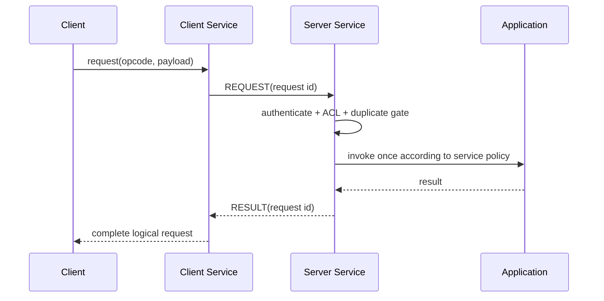
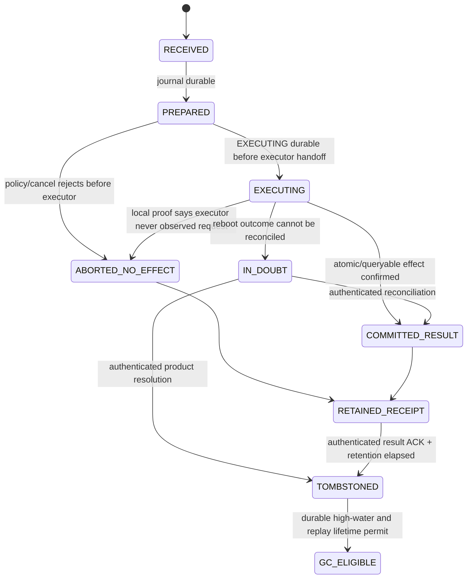

# 09 Service、Operation 与 QoS

> 状态：`SELF-REVIEWED / EXTERNAL REVIEW REQUIRED`
>
> 本文负责业务交互语义和调度。Service 定义 Endpoint/Opcode 与 Request/Result；Operation 只负责需要耐久副作用的执行；QoS 决定已准入 Attempt 的发送顺序。

## 1. 三层独立性

| 层 | 解决的问题 | 不应隐式要求 |
| --- | --- | --- |
| Service | 调用哪个 Endpoint/Opcode，如何关联 Request/Result | Flash Journal |
| Operation | 外部副作用是否需要幂等、持久化、对账 | 所有 RPC 都启用 |
| QoS | 多个已准入 Attempt 谁先发送 | 改变可靠性、安全或权限 |

## 2. Delivery 与 Interaction 分离

```text
delivery_guarantee:
    BEST_EFFORT | LATEST | RELIABLE

interaction_role:
    ONE_WAY | REQUEST | RESULT | ERROR
```

因此可以表达 Reliable Request、Best-effort One-way 或 Latest Result，而不是把它们混成同一
枚举。`EVENT`、`COMMAND` 是用户 API/Endpoint 模板，不占用线上 Interaction Role；例如
Command 在线上通常是 `REQUEST`，无返回业务事件通常是 `ONE_WAY`。

## 3. 普通 Request/Result



普通查询可只使用有界 RAM duplicate/receipt 状态，不要求 Persistence。

## 4. Durable Operation

只有产品明确要求掉电语义的副作用才进入 Operation：



```text
operation_execute(request):
    authenticate principal and exact opcode
    validate operation id and argument fingerprint
    if exact terminal record exists:
        return stored result/status
    if conflicting reuse exists:
        reject
    reserve before any Provider I/O or executor-visible state:
        exact journal slot
        one operation persistence continuation
        one operation reply receipt + mandatory query/retention obligation
        one callback-delivery obligation only when the Endpoint configures a callback
        fixed inline result buffer declared by this Endpoint
        reconciliation/fault bookkeeping
    if any reservation fails:
        reject with zero journal, zero executor call and zero promise
    submit PREPARED before external side effect
    return PENDING until completion + reload prove exact PREPARED
    re-check current authority/policy after proof
    if execution is no longer permitted:
        publish_terminal_after_durable_proof(ABORTED_NO_EFFECT)
        return its durable terminal rejection only after exact reload
    submit EXECUTING before handing request to executor
    return PENDING until completion + reload prove exact EXECUTING
    re-check current authority/policy after EXECUTING proof
    if execution is no longer permitted and local executor-observed flag is provably false:
        publish_terminal_after_durable_proof(ABORTED_NO_EFFECT)
        return its durable terminal rejection only after exact reload
    if it cannot prove whether the executor observed the request:
        publish_terminal_after_durable_proof(IN_DOUBT)
        do not call the executor again
        return IN_DOUBT only after exact reload
    execute only through atomic or queryable executor contract
        pass the already-reserved inline result buffer and exact capacity
    when exact result/failure is provable:
        publish_terminal_after_durable_proof(COMMITTED_RESULT)
        return result/status only after exact reload
```

```text
publish_terminal_after_durable_proof(next_terminal):
    validate exact current journal state + operation key + request digest
    require the operation's pre-reserved persistence continuation, reply receipt and result storage
    reserve nothing and allocate nothing after the executor may have observed the request
    submit canonical next record
    if provider returns PENDING:
        keep reply unpublished and advance only through bounded poll events
    on completion:
        reload durable slots/witness
        require exact operation key, fingerprint, transition and terminal bytes
        atomically publish the terminal receipt once
    on provider/reload/mismatch failure:
        publish no success/rejection/IN_DOUBT reply
        enter scoped Operation persistence fault
```

`*_PERSIST_PENDING` 是 Runtime continuation，不是允许重启后猜测的 Journal 终态。无论目标是
`ABORTED_NO_EFFECT`、`IN_DOUBT` 还是 `COMMITTED_RESULT`，Provider 的同步返回值、一次 poll
或 RAM 中的执行器结果都不能代替 reload+journal exact-match proof。结果已知但持久化仍 pending
时，业务执行器不得再次调用，客户端只能看到 pending/backpressure，不能先得到最终结果。

如果外部执行器无法原子提交或查询对账，协议不能承诺“必然重放原结果”，只能返回 `IN_DOUBT` 且不自动重复执行。

`ABORTED_NO_EFFECT` 只能在 Owner 能证明请求尚未交给外部执行器、没有外部副作用时写入；它与
普通执行失败、`IN_DOUBT` 都不是同一状态。这样 PREPARED 后 Policy/Authority 撤销不会永久占槽，
也不会为了清表而冒险调用执行器。

Endpoint 必须在 Manifest 声明
`max_durable_result_bytes <= UCN_V6_DURABLE_RESULT_INLINE_BYTES`。执行器只能写入上述预留
buffer/capacity；返回更大长度、在外部保存未绑定结果或要求事后动态分配，都属于执行器合同
故障。若外部副作用可能已发生，Owner 使用已经预留的终态资源写 `IN_DOUBT` 并 Fence 该
Endpoint/执行器，不能把它伪装成普通 `NO_SPACE` 或重新执行。未来若支持更大结果，必须先定义
独立的原子 Provider Blob、持久 ref+digest 和恢复顺序；它不属于当前基础合同。

`IN_DOUBT` 是重启恢复结论，不是在执行器返回普通错误时随意选择的成功终态。Owner 加载到
`EXECUTING` 后，只有同一原子事务或经认证、绑定 Operation Key 的执行器查询能够恢复确切
结果；否则必须原子写入 `IN_DOUBT`，禁止再次调用执行器。`PREPARED`、`EXECUTING`、
`IN_DOUBT` 均不得按时间自动 GC。`COMMITTED_RESULT` 只有在认证结果 ACK 和最小 retention
窗口结束后才可持久化 Tombstone；槽复用还必须证明发起 Principal 的 Operation ID 高水位
与最大 Replay 生命周期已经越过该记录。

## 5. QoS 准入和调度

QoS 只处理已经通过 Policy、Security、Route 和资源准入的可发送对象。未跟踪路径传入 exact TX
slot ref，受跟踪路径传入 exact Attempt ref；两者最终都定位同一个 TX Slot：

```text
qos_enqueue(sendable_ref):
    validate traffic class and per-source/per-flow quota
    require sendable_ref resolves one exact TX Slot
    attach scheduling metadata inside that slot
    reserve exactly one fixed queue slot/generation reference
    enqueue the reference once; never copy or transfer Payload ownership
```

Basic Queue 与 Advanced QoS 是一条所有权链上的不同调度策略，不是重复排队。

## 6. 调度伪代码

```text
qos_schedule(now, budget):
    first advance reserved control/completion/cleanup work
    for each class according to configured bounded schedule:
        choose eligible source/flow using round-robin or declared policy
        if realtime hop budget exists:
            use only inside the same traffic class and quota
            require 0 < remaining_budget <= initial_budget
        submit at most bounded number of attempts
```

Hop Deadline/Budget 不能提升 Traffic Class，也不能占用其他 Class 的保留份额。

## 7. Latest

Latest 的键必须明确：

```text
{destination, endpoint, opcode/stream key, security/policy domain}
```

新值只能替换尚未提交 Driver 的旧值；Driver 已持有的 Attempt 必须正常退休。多个热点 key 使用 round-robin，不能固定从 slot 0 扫描导致饥饿。

## 8. 资源和 GC

- Request/Result receipt 表固定容量；
- Durable Journal 固定容量和明确 GC 水位；
- `IN_DOUBT` 未人工/产品策略解决前不能驱逐；
- 每 Source/Flow 的 QoS 占用受限；
- 业务数据不能耗尽 ACK、结果、取消和清理事件。

## 9. Feature OFF

| 关闭项 | 唯一关闭行为 |
| --- | --- |
| Service/RPC | `NOT_COMPILED`：Request/Result API 与状态不进入产品面；基础 ONE_WAY Endpoint 属于 Message Core，仍按 Composition 工作 |
| Durable Operation | `REQUEST_REJECTED`：要求 `DURABLE_AT_MOST_ONCE` 的调用零 Journal/零副作用拒绝；普通 Request/Result 不受影响 |
| Persistence | `CONFIG_REJECTED`：不能声明 Durable Operation Ready；不得偷偷退化为 volatile dedup |
| Advanced QoS | `FALLBACK_DEFINED`：使用同一物理 Queue Owner 的 Basic Queue；不创建第二条队列 |
| Latest | `REQUEST_REJECTED`：不允许静默改成 Best Effort FIFO 或 Reliable |

## 10. 固定资源

| 资源 | 编译期合同 | 满载/GC 行为 |
| --- | --- | --- |
| Request correlation | `UCN_V6_MAX_REQUESTS` | 新 Request 拒绝，不覆盖未终结项 |
| Volatile receipt/dedup | `UCN_V6_MAX_SERVICE_RECEIPTS` | retention 未结束的记录不驱逐 |
| Operation Journal | `UCN_V6_MAX_DURABLE_OPERATIONS` | 表满在 ACK/EXECUTING/副作用前拒绝 |
| Operation persistence continuation | `UCN_V6_MAX_OPERATION_PERSIST_PENDING` | 每个 durable transition 最多一个 exact continuation；满载不提交新副作用 |
| Operation reply receipt | `UCN_V6_MAX_DURABLE_OPERATION_RECEIPTS` | 在 PREPARED 前预留；终态 proof 后只发布一次，不与用户 Request Completion Receipt 混用 |
| Durable inline result bytes | `UCN_V6_DURABLE_RESULT_INLINE_BYTES` 与固定 pool/bucket | 在 PREPARED 前按 Endpoint ceiling 预留；执行后禁止再分配；越界进入合同 Fault/IN_DOUBT |
| Operation ID interval | `UCN_V6_OPERATION_ID_INTERVAL_SIZE` | persist-before-use；耗尽轮换父域或 Fault |
| QoS queue per class | `UCN_V6_Q0_DEPTH..UCN_V6_Q3_DEPTH` | 基础控制/完成/清理拥有独立保留 |
| Source/Flow quota | `UCN_V6_MAX_QOS_SOURCES/FLOWS` | 未认证新 Source 不驱逐现有合法配额 |
| Latest key | `UCN_V6_MAX_LATEST_KEYS` | round-robin；只替换未提交 Driver 的旧 Attempt |

所有队列索引类型必须能够表达配置上限；若索引为 `uint8_t`，对应深度必须在编译期验证
`<= UINT8_MAX`。Storage 大小由 `UCN_V6_SERVICE_STORAGE_BYTES/ALIGNMENT`、
`UCN_V6_OPERATION_STORAGE_BYTES/ALIGNMENT` 与 `UCN_V6_QOS_STORAGE_BYTES/ALIGNMENT` 生成。

## 11. 对抗测试

- Request/Result 在 Persistence OFF 时正常工作；
- 相同 Operation ID、相同 fingerprint 返回幂等结果；冲突 fingerprint 拒绝；
- PREPARED durable 后、EXECUTING durable 前不得调用执行器；EXECUTING durable 后掉电不得自动重试；
- Journal/continuation/reply receipt/result pool 任一满载：PREPARED、Provider I/O、执行器调用均为零；
- PREPARED 后 Policy/Authority 撤销：写入 exact `ABORTED_NO_EFFECT`，零执行器调用且可幂等重放；
- EXECUTING durable 后、交给执行器前撤销：只有本机仍能证明 executor 未观察请求时才允许 `ABORTED_NO_EFFECT`，否则进入 `IN_DOUBT`；
- EXECUTING 掉电且无法对账时进入 `IN_DOUBT`，不重复执行；
- `IN_DOUBT` 无论经过多长时间都不自动进入普通 GC；
- COMMITTED_RESULT Provider 连续多次 PENDING：proof 前零最终回复，reload exact match 后只回复一次；
- executor 结果恰等于 inline ceiling 可提交；大 1 B 且副作用可能已发生时使用预留资源进入 IN_DOUBT 并 Fence，不执行第二次；
- ABORTED_NO_EFFECT/IN_DOUBT 持久化撕裂、错 operation key 或错 fingerprint：不得发送终态回复；
- 两个 Q1/Latest 热点流都有有限等待；
- 负 Traffic Class 和越界值在所有编译器一致拒绝；
- Realtime Budget 不能跨 Class 抢占；
- Advanced QoS OFF 不产生第二条队列或绕过准入。
