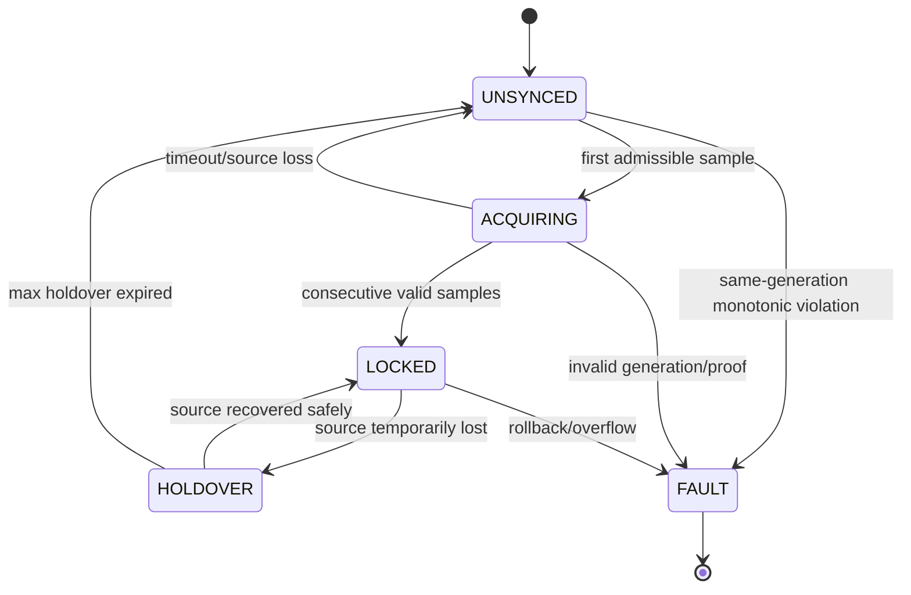
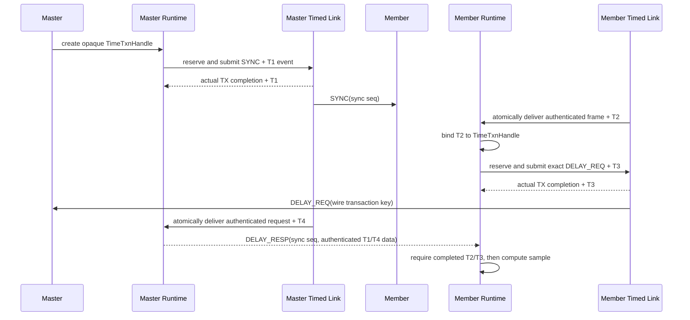

# 10 Realtime 与时间同步

> 状态：`SELF-REVIEWED / EXTERNAL REVIEW REQUIRED`
>
> 本文负责可选时间能力的运行逻辑。精确 Envelope 字段仍由 Realtime/Wire RFC 负责。关闭本模块时，普通消息不增加时间字段和运行状态。

## 1. 三种能力不是一件事

| 能力 | 是否需要网络同步 | 是否需要 Flow |
| --- | --- | --- |
| 本地 RX/TX 时间戳 | 否 | 否 |
| 业务 Local Stamp | 否 | 否 |
| 外部已同步 Time Provider | 取决于 Provider | 否 |
| UCN Network Time Sync v1 | 是 | 是，使用 C4 固定 Path |
| Timed/Deadline Envelope | 需要可信 Domain Time 才能声明同步语义 | 按所用传输 Contract |

普通动态 Route 不创建 v1 四报文时间同步事务；缺少可信 Path asymmetry 上界的结果只能进入诊断，不能推动 Domain `LOCKED`。

## 2. Time Domain 状态机



进入 `UNSYNCED` 时清除 acquisition/filter 历史，但同一 Domain Generation 的已发布时间高水位不能清除。

## 3. 四时间戳事务



T1/T4 属于 Master，T2/T3 属于 Member。本地 event key 不跨节点；线上消息只通过认证的 Wire Time Transaction Key 关联。

Runtime 是 Time Sync 事务的唯一 Owner。它签发不可由调用方构造的 `TimeTxnHandle`，至少绑定：

```text
runtime/time-owner instance
local role (MASTER or MEMBER)
wire sync sequence and message role
time domain + domain generation
fixed route/path + path generation
peer session/binding generation
absolute transaction deadline
expected local T1/T2/T3/T4 event-key slots
```

应用、测试和上层模块不能直接传入任意三元 event key 来声称 T1～T4 已发生。Member 只有在
Timed Link 返回**实际 TX completion**并携带匹配 T3 timestamp 后，才能把 DELAY_REQ 标为可用于
样本；`reserve/submit` 成功本身不等于 T3 已捕获。Master 同理必须拥有实际 T1/T4 completion，
`DELAY_RESP` 才能引用对应时间戳。

## 4. Event key 生命周期

```text
timed_event_reserve(link, kind):
    reserve fixed slot
    allocate token under current link_instance_generation
    state = RESERVED

timed_event_submit(token):
    require token state == RESERVED
    if atomically try_acquire shared task/ISR/SMP-safe callback gate fails:
        return BUSY with token unchanged
    under Timed-Link event gate:
        revalidate token is exact RESERVED instance/generation
        state = SUBMITTING
        publish exact timestamp-completion continuation
    result = invoke driver with exact token
    release shared callback gate after callback returns
    merge = merge_submit_return_with_latched_timestamp_event(
                token, exact continuation, result)
    if merge == WAIT_FOR_EVENT:
        state SUBMITTING -> SUBMITTED
    if merge == TERMINAL_TIMESTAMP:
        consume exact continuation at most once
        state = COMPLETED
    if merge proves driver never observed the token:
        consume continuation once
        return to RESERVED or release according to the frozen driver contract
    if merge cannot prove whether a physical timestamp operation exists:
        state = RELEASE_PENDING

timed_event_complete(token, timestamp):
    require exact instance + token + generation
    if state == SUBMITTING or state == SUBMITTED:
        latch timestamp for the exact active continuation once
        state = COMPLETED
    else if state == RELEASE_PENDING:
        latch completion only as proof that the physical timestamp operation ended
        mark the exact release obligation satisfied
        state = COMPLETED_FOR_RETIRE
        never expose this timestamp to TimeTxnHandle/sample admission
    else:
        reject duplicate/stale completion without changing state

timed_event_retire(token):
    peek release obligation
    if state == COMPLETED_FOR_RETIRE and exact completion already proves no Driver holder:
        ack/pop obligation and release slot once
    else:
        ask Driver to retire/cancel
        only on success or an explicit equivalent terminal proof ack/pop obligation
```

同一 token 不能重复 submit，提交后不能按未提交 token 取消。Driver 若在 callback 内先发布
timestamp completion、随后返回 `PENDING` 或重复 `COMPLETE`，Owner 必须以已锁存的 exact event
为终态，不能把 `COMPLETED` 倒退成 `SUBMITTED`，也不能第二次消费 continuation。返回值与 event
冲突且无法证明是否存在硬件动作时进入 `RELEASE_PENDING`。超时、Path 变化和更高 sequence 替换
必须生成可重试的 release obligation，而不是直接 `memset` 丢失 key。

Driver callback 开始后，只有 Driver 明确证明“没有观察 token、没有安排 DMA/ISR、以后也不会
返回 completion”时才允许完全回滚。否则无论回调返回错误与否，都必须保留
`RELEASE_PENDING`，采用 `peek → retire/cancel → ack/pop` 退休；回调内对任意 Timed Link 或
Time Authority 的控制 API 重入都必须在状态变化前返回 `ERR_STATE`。

`RELEASE_PENDING` 表示该 event 已经失去参与当前 Time Transaction 的资格，不表示迟到的硬件
completion 可以丢弃。精确匹配的迟到 completion 只能解除 Driver/resource obligation，不能恢复
事务、填入 T1～T4 或产生 Sample；错误 instance/token/generation 的 completion 仍零写拒绝。
completion 与 cancel/retire 同时到达时，共享 gate 必须保证只有一个路径消费 obligation 和释放
slot，另一条路径得到幂等 terminal 结果。

## 5. Sample admission

```text
time_sample_admit(transaction, timestamps, path, now):
    verify authenticated transaction key and roles
    verify fixed path/session/domain generations
    verify all four event ownership proofs
    require trusted max_asymmetry is known
    calculate offset/delay with checked signed arithmetic
    calculate sender components S with checked addition
    calculate receiver/local uncertainty
    U = checked_add(sender_uncertainty, receiver_uncertainty)
    reject any unknown/zero-illegal/overflow component
    return diagnostic or admissible sample
```

滤波残差、采样锁存误差、Link timestamp 误差、timer resolution、oscillator drift 和整数舍入都必须由明确分量覆盖。

## 6. Domain ingest

```text
domain_ingest(sample, now):
    require sample generation and source proof current
    require sample admissible, not diagnostic-only
    update bounded acquisition/filter candidate

    if candidate would transition to LOCKED:
        candidate_time = compute_domain_time(now)
        if same_generation and has_output_highwater and candidate_time < highwater:
            enter FAULT immediately
            return ERR_ROLLBACK
        enter LOCKED
```

不能先对外暴露 `LOCKED`，再等 `get_clock_view()` 发现回退。

## 7. Envelope 发送

```text
realtime_prepare_envelope(policy, domain, capture):
    if requirement == NONE:
        emit no realtime envelope
    require domain phase == LOCKED
    require DOMAIN_TIME_VALID and source policy
    require capture bound and all uncertainty components known
    S = checked aggregate sender upper bound
    encode ceil-log2 uncertainty class from S
    bind domain generation and capture time
```

远端 `HOLDOVER`：REQUIRED 固定拒绝；PREFERRED 只有产品显式信任、E2E 认证和 ACL 同时满足时才可例外。

## 8. Endpoint 双门禁

接收入队前：

```text
check source authentication, ACL, envelope structure,
domain generation, future skew, combined uncertainty and age upper bound
```

业务副作用前再次检查：

```text
R = current receive/use domain time
U = sender S + current receiver uncertainty
require U <= max_uncertainty_us
require capture_time not beyond allowed future upper bound
age_upper = checked(R - capture_time + U)
effective_max_age = min(endpoint max age, guard max age)
require age_upper < effective_max_age
```

`now == deadline` 过期。

## 9. Feature OFF

| 关闭项 | 唯一关闭行为 |
| --- | --- |
| Realtime 全部关闭 | `NOT_COMPILED`；普通 Frame、Queue、Runtime 不增加时间字段或状态 |
| Network Time Sync v1 | `REQUEST_REJECTED`：零 sync pending、零四报文；Local Stamp/外部 Provider 不受影响 |
| Timed Link | `CONFIG_REJECTED`：不能声明硬件 RX/TX timestamp 或 Network Sync 能力 |
| Synced/Deadline Envelope | `REQUEST_REJECTED`：不得降级成伪造 `DOMAIN_TIME_VALID`；PREFERRED 只能按已冻结 Policy 回退 LOCAL/NONE |
| Hop Deadline Scheduling | `FALLBACK_DEFINED` 仅表示仍按原 Traffic Class 公平调度；不得继续传播已耗尽的 Deadline-aware Frame |

## 10. 固定资源

| 资源 | 编译期合同 | 满载/扫描行为 |
| --- | --- | --- |
| Time Domain/Source | `UCN_V6_MAX_TIME_DOMAINS/SOURCES` | 不驱逐 LOCKED 当前源；候选扫描有固定上限 |
| Time transaction | `UCN_V6_MAX_TIME_TRANSACTIONS` | 每 Peer/Path 子配额；满载不发 SYNC/DELAY_REQ |
| Timed Link event | `UCN_V6_MAX_TIMED_EVENTS_PER_LINK` | token slot 在 completion/retire 前不复用 |
| Release obligation | `UCN_V6_MAX_TIME_RELEASE_OBLIGATIONS` | 为 timeout/reopen 保留，不能被新同步占满 |
| Filter/sample window | `UCN_V6_TIME_FILTER_SAMPLES` | 固定窗口，无动态历史 |
| Sync/response receipt | `UCN_V6_MAX_TIME_RECEIPTS` | retention 覆盖最大重传和迟到事件窗口 |

Build Manifest 必须生成 `UCN_V6_REALTIME_STORAGE_BYTES/ALIGNMENT` 和每次 Owner run 的
timestamp completion、release、filter、timeout 推进预算。Timed Link/Authority 的共享 callback
gate 必须是调用方提供、可在 task/ISR/SMP 环境安全访问的固定对象，不能用未同步全局指针。

## 11. 对抗测试

- 固定 Path 但无可信 asymmetry：允许诊断事务，Domain 不增加有效样本、不 LOCKED；
- 普通动态 Route + PREFERRED：零 pending、零同步帧，回退 LOCAL/NONE；
- `60 + 60 > 100` 的组合 uncertainty 拒绝，等于门限接受；
- HOLDOVER 超时后清滤波但保留同代际输出高水位；
- 新源重锁候选时间倒退：ingest 当场 FAULT；
- timed token 重复 submit、迟到 completion、retire 首次失败后重试；
- event 进入 RELEASE_PENDING 后收到 exact late completion：只退休资源，不恢复 TimeTxnHandle 或 sample；
- late completion 与 cancel 并发：release obligation 和 slot 恰好消费一次；
- Driver callback 内先发布 timestamp completion 后返回 PENDING/COMPLETE：终态只消费一次且不倒退；
- Driver callback 内跨 Link/Authority 重入在零状态变化前拒绝；
- Runtime 集成必须真正调用 Timed Link，不能伪造 T1～T4 key；
- DELAY_REQ 已 submit 但尚无实际 T3 completion：DELAY_RESP 不得产出有效 sample；
- 不同 Path/Session/Domain 或另一 Member 的 TimeTxnHandle/event completion 不能交叉拼成四时间戳样本。
