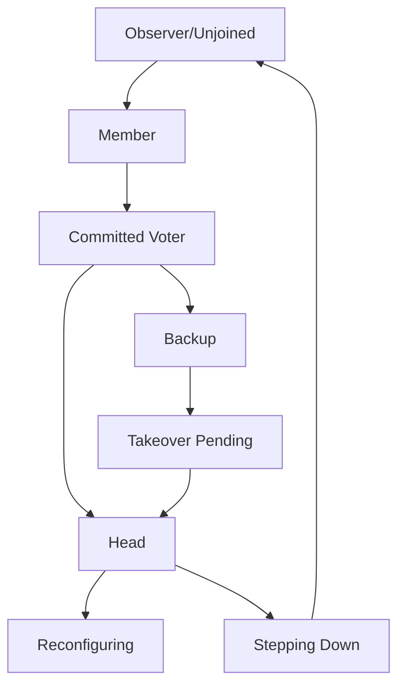
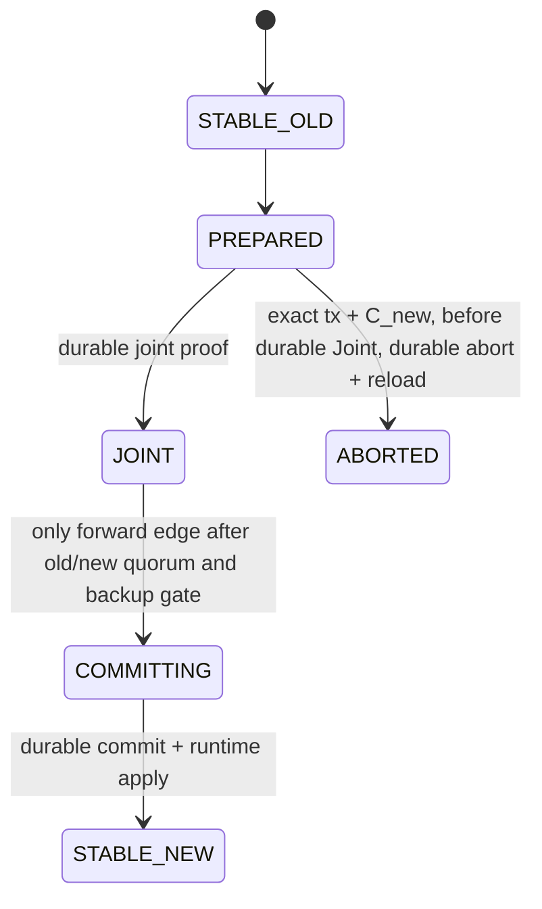
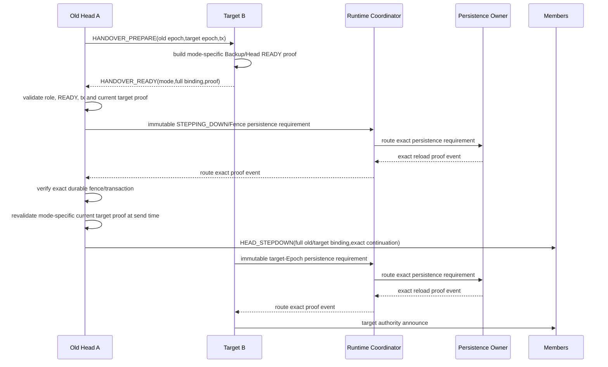

# 11 Group 与 Cluster

> 状态：`SELF-REVIEWED / EXTERNAL REVIEW REQUIRED`
>
> 本文负责 Group 群发状态与 Cluster 权威状态怎样建立和隔离。Group 是业务组语义，Cluster 是规模化控制平面；二者均为可选模块，不能成为普通点对点通信的依赖。

## 1. 边界和依赖

| 能力 | 依赖 | 关闭影响 |
| --- | --- | --- |
| Static Manifest Group | Group Core；C5 Tree 时再依赖 Route/Forwarder + C5 | 退回有界单播 fanout 或拒绝 Group Intent |
| Dynamic Group membership/tree | Group Core + Identity + Security + Persistence + 当前逻辑 Realm Address Authority/quorum | 只能使用静态 Manifest Group |
| Secure Group | Group Core + Security Group Context + Persistence | 只允许产品显式批准的非安全、非 Authority 用途，否则拒绝 |
| Cluster Base | Flow + C4 + Identity + Security + Persistence + Route Store | Cluster 请求拒绝，普通通信继续 |
| Cluster Group Acceleration | Cluster Base + Group + C5 | 回到 C4 Cluster Base |

当前不存在 `Cluster ON + Flow OFF` 的合法替代路径，该 Composition 必须拒绝。

## 2. Group Owner

Group 拥有：

```text
group id/slot
policy generation
member set and membership generation
forwarding/tree state
business duplicate-delivery state
expiry/fence
```

Security 拥有：

```text
group key slot/key generation
per-sender cryptographic replay window
group authentication context
```

Group 只保存 Security Handle，不复制或修改密码学 Replay Window。

Group 有三条必须分开的装配路径：

1. **静态 Group**：Group ID、成员、Sender Slot 和可选 Tree 均来自平台 anti-rollback 保护的只读 Manifest；不创建动态成员代际或 UCN runtime Persistence 状态，也不允许运行期退休/更新。若使用 C5，必须存在固定容量的 C5 Context/转发表。
2. **动态 Group**：成员、Policy/Tree Generation 只由持有当前 Generation、Lease、Fence、quorum 和认证证明的逻辑 Realm Address Authority 提交；Generation 和动态 ID 必须 persist-before-use。每个 Realm/Group Scope 的 Manifest 必须在“只读签名静态 Manifest”与“动态 Realm Address Authority”中恰好选择一个 Owner 模式，二者不能同时生效。Group Core 只消费该 Owner 的当前证明，不自行选举 Authority、不复制 Authority 状态；Cluster Head 只能提出变更请求，不能被委派为第二个 Group Policy Owner。
3. **安全 Group**：Group 通过带代际 Handle 使用 Security Owner 中的 Group Key、Sender 派生身份和密码 Replay Window。若 Endpoint ACL 要求精确 Principal，共享组密钥本身不够，必须使用 Sender Slot 派生子键、签名或等价的 `EXACT_PRINCIPAL` 证明。

以上路径不能由 CMake 隐式补开依赖。特别是 `Group ON` 不得隐式打开 Cluster，`Cluster ON + Group OFF` 必须继续使用 C4 Cluster Base。动态装配的规范依赖为
`GROUP_DYNAMIC = GROUP_CORE + IDENTITY + SECURITY/AUTH_PROVIDER + PERSISTENCE + GROUP_AUTHORITY_OWNER`；任一依赖缺失时必须在创建 pending、调用 Provider、发送 ACK 或发布成员/Tree Generation 前拒绝，不能降级成未认证动态 Group。

## 3. Group 发送

```text
group_send(group_handle, request, now):
    validate group owner instance/generation/lease/fence
    if request requires authenticated/encrypted group delivery:
        validate security group handle/key generation/sender proof
    validate sender membership and endpoint group policy
    choose an already-admitted bounded unicast fanout or C5 tree
    reserve bounded fanout/tree attempt resources
    submit attempts under per-group quota
```

Group 完成范围由证据而不是本地 fanout 数量决定。`LOCAL_ONLY` 只证明本机已原子接受完整发送
计划；`ANY/ALL/QUORUM/SUBSET` 必须对冻结成员快照收集认证、去重并绑定同一 Send/Operation
ID 的逐成员 Reliable terminal receipt。Best Effort Group 不得声明非本地完成范围。One-Way
`publish_group` 只能聚合交付 receipt；业务 `APPLICATION_RESULT` 属于独立 `request_group`
Operation。所需 receipt/bitmap/摘要容量不足时必须在首个 submit 前拒绝，不得降级成功范围。

动态 Group ID 只从持久化单调高水位分配，删除不回退；静态 Group 使用当前签名 Manifest 的
固定槽，`RETIRED` 在该 Manifest/Realm Generation 内永久占位。改变静态槽只能安装新的、通过
平台 anti-rollback 校验的完整 Manifest，不能由 Group Runtime 写状态。

Group 接收和转发必须走完整生命周期，不能在验证一个 Group Context ID 后直接回调业务：

```text
group_receive(rx_item, now):
    PRECHECK:
        validate Runtime/Link/RX token and strict C5 structure
        lookup hop-local Group Context with owner instance/generation/fence
        validate Group/Policy/Tree generation and bounded lifetime
        validate role: relay, local member, or both
    SECURITY:
        validate Group Hop protection before expensive origin work
        validate canonical Group origin context and Sender Slot proof
        opened = security_open_classify_reserve(...)
        require result binds Security/Runtime/Context generations, sequence, classification and digests
        resolve exact Source Principal when Endpoint ACL requires it
    ADMISSION:
        validate endpoint/group/opcode ACL and local membership snapshot
        if opened is read-only AUTHENTICATED_REPLAY_CANDIDATE:
            query an exact retained Group receipt/fanout outcome
            if no exact retained match: reject replay conflict or expired receipt
            reserve and resend only the permitted immutable receipt
            never relay again, never call the application, never mutate Group business dedup
            retire current RX/crypto workspace exactly once
            return DUPLICATE_RECEIPT_REPLAYED
        require opened is FRESH_AUTHENTICATED with an exclusive replay mutation handle
        preflight all local-delivery and relay resources without writing state
    RESERVE:
        reserve RX/local-delivery obligation and bounded relay fanout attempts
        reserve Group business-dedup mutation and all required queue positions
        if any reservation fails:
            security_replay_abort(opened.mutation_handle)
            release only this RX item reservations; do not mutate replay/dedup/attempt state
    PRECOMMIT under Runtime Coordinator + Security Owner gates:
        revalidate exact ACL/Policy generations and current Group Authority proof
        rc = security_replay_commit(opened.mutation_handle, trusted_now)
        if rc fails:
            release all still-unpublished Group/RX/fanout reservations
            retire current RX item and return rejected
    NOFAIL_PUBLISH:
        publish the already-reserved Group business-dedup and Attempt records with infallible writes
        enqueue local delivery and all preflighted relay Attempts from reserved positions
    CALLBACK_AND_RETIRE:
        Driver submission/retry runs through each committed Attempt lifecycle
        application callback cannot reopen or mutate the active RX lifecycle
        record completion against the frozen member snapshot/success scope
        retire RX token, buffers and fanout obligations exactly once
```

这里不宣称两个独立 Owner 具有魔法式事务内存。新输入时，Security Replay Owner 先返回带代际
mutation reservation；已经提交过的 Sequence 只返回只读 evidence，绝不能进入下面的首次业务
commit。Group/Runtime 再把所有后续固定资源预留好。`security_replay_commit()` 因 deadline、
Context、Key、Fence 或 Policy 变化仍可失败，所以它属于可回滚 `PRECOMMIT`：失败时 Replay 不
消费、所有未发布资源释放。只有该调用成功后才进入 `NOFAIL_PUBLISH`，此后
不得再调用 Provider、Driver、应用回调或任何可能失败/重入的外部函数，只执行已预留的本地
发布。若在消费 replay 后检测到内存损坏等不可能正常
失败，只能 fail-closed/Fault，不能把 replay 值放回并重放业务。任一正常失败都只能影响本
Group/RX item；不得建立部分 Tree、不得绕过 Security Owner、不得泄漏 Driver token。C5 上的
Cluster Authority、Vote、Commit 默认仍要携带可独立验证的单源证明；没有该证明时，C5 只能
承载非授权通知或证书载荷。

## 4. Cluster 状态层次



角色变化必须由持久化 Epoch/Config/Vote/事务证明和当前 Authority 门禁共同控制。

## 5. Config/Joint



```text
cluster_config_commit(tx, now):
    require exact durable PREPARED + JOINT journal
    require live runtime Joint refers to same tx and C_new
    recompute old and new quorum from current live voter evidence
    validate exact Backup gate tx + C_new + backup identity + ACK source
    publish immutable CONFIG_COMMIT persistence requirement to Runtime Coordinator
    wait for Coordinator-routed exact reload proof from Persistence Owner
    verify completion proof still matches this tx and C_new
    atomically install the exact durable config into runtime state
    recompute authority/quorum/policy from the installed config and current now
    if authority is not currently valid:
        remain fenced, but keep the durable config installed in runtime
    else:
        allow commit/authority frames under the new config
```

Durable Config 是 Runtime 恢复和安装的事实来源，不能因旧 Authority 已过期而拒绝安装。Authority 只决定“当前能否执行/发送权威副作用”，不能决定“是否把已经 durable 的 Config 映射进 RAM”。安装失败时进入局部 Cluster Fault/Fence，重启仍从 durable Config 恢复，绝不能继续使用旧 Runtime Config 发送。

`PREPARED` 的 Abort 必须精确绑定同一 `txid + C_new`，且只能在不存在匹配 durable Joint journal 时执行；先持久化 exact Config Abort 终态/receipt 并 reload，才能清除 Runtime staging 和幂等通知参与者。当前合同一旦 `JOINT` 已 durable，就不存在本地超时、单 quorum 或单方管理命令触发的回退边；只能继续保持 Joint/Fence 并沿匹配事务向 `STABLE_NEW` 前进。若未来需要 Joint rollback，必须另行冻结同时获得 old/new quorum 的 rollback certificate、独立 operation、持久化顺序和恢复语义，不能复用 PREPARED Abort。

## 6. Takeover/Recovery

每张票必须绑定：

```text
cluster/active epoch
candidate identity and binding generation
candidate backup generation/role
voter identity, binding/session/capability generation
config/snapshot
transaction id
```

```text
takeover_commit(tx, now):
    validate tx structural state and terminal fence
    for every recorded vote:
        revalidate the exact voter evidence is still current and live
    recompute stable or joint quorum
    require candidate remains designated and qualified Backup
    publish immutable TAKEOVER_EPOCH_COMMIT persistence requirement to Runtime Coordinator
    wait for Coordinator-routed exact reload proof from Persistence Owner
    match exact successor epoch
    enter EPOCH_DURABLE terminal state
```

成员失效或重新准入时，旧票必须被原子清除或因精确 session/binding/capability 证据不匹配而失效。仅保存 bitmap 不足以防历史票复活。

## 7. Planned Handover

Planned Handover 必须区分两个模式；二者不能共享一个含糊的 READY 角色：

| 模式 | READY 发送者 | READY 时的 Authority | 必须证明 |
| --- | --- | --- | --- |
| Same-Cluster Planned Transfer | 已确认且事务绑定的 Backup B | 仍无 Head Authority | old Config 中 Backup 身份、目标 `old_term + 1`、完整 old/target Epoch、Config、txid、准备证明 |
| Cross-Cluster Merge/Handover | 已经合法的目标 Head B | 拥有其自身 Cluster 的当前 Authority | 完整 old/target Epoch、目标 Config、txid、当前 quorum/capability/Authority proof；跨 Cluster 不比较 Term |



同簇 B 在 READY 时仍是 Backup，不能发送任何 Head Authority 帧；只有收到精确匹配的 Stepdown/Commit、持久化并 reload 目标 Epoch 后才能成为 Head。跨簇 B 的 READY 则只能由已经对其自身 Cluster 拥有 Authority 的 Head 发出。

`HANDOVER_READY` 不能只证明“目标身份存在”。A 必须在持久化前完成模式相关的当前 proof 复验，然后先 durable 地进入不可逆 `STEPPING_DOWN/Fence` 并 reload 精确记录。由于 Provider I/O 或掉电会消耗时间，A 在每次实际发送 `HEAD_STEPDOWN` 前还必须用新鲜可信 `now` 重新验证当前目标 role、lease、quorum、capability 和 mode-specific proof。只有复验通过才允许发送 exact continuation。若 proof 已在持久化期间过期或变为不匹配，A 仍保持不可逆 Fence、不发送 Stepdown，转入 handover recovery continuation；不得恢复普通 Advertise、Vote、Commit、业务 Authority 或旧 Head 身份。若在 durable fence 后、发送前掉电，重启同样先复验 proof，只能重发该精确 continuation，或保持 Fence 进入恢复。

## 8. 局部失效

Cluster Authority Fence 只阻止 Cluster Authority 行为。普通 Route、Flow、Service 和点对点消息继续按各自 Owner 工作。

## 9. Feature OFF

| 关闭项 | 唯一合法行为 |
| --- | --- |
| Group OFF | Group API/符号、C5 terminator、Group Context/Sender/receipt/fanout 表均不进入产品布局；Group Intent 在零 Attempt 前拒绝，普通单播不受影响 |
| Cluster OFF | Cluster API/符号、成员/Config/Authority/transaction 表均不存在；收到 Cluster Service/Opcode 明确拒绝；Group 仍可独立存在 |
| Security OFF | 只允许 Manifest 明确声明的公开、无 Authority 静态 Group；Secure Group、Dynamic Group、Cluster Vote/Config/Authority 在配置期拒绝，不能降级 O0 |
| Persistence OFF | Dynamic Group、Secure Group 的持久 Key/Policy、Cluster Config/Authority 在配置期拒绝；不得用易失状态冒充 persist-before-promise |
| Flow/C4 OFF | Cluster 配置无效并在 init 前拒绝；Group 若只使用已定义 C5/静态 Tree 可独立启用 |
| Realtime OFF | Group/Cluster 语义不变，只是不产生时间 Envelope 或 Deadline 调度；不能把本地 uptime 当 Cluster Epoch |

任一 Feature OFF 都必须同时从生成头、安装头、链接目标、Storage/Layout Hash 和运行时 Capability
移除对应资产；只让函数返回 `NOT_SUPPORTED` 而仍保留全部表不算裁剪。

## 10. 固定资源与扫描预算

| 资源 | 编译期合同 | 满载/推进规则 |
| --- | --- | --- |
| Group Context/Key slot | `UCN_V6_MAX_GROUP_CONTEXTS`、`UCN_V6_MAX_GROUP_KEYS_PER_CONTEXT` | ACTIVE/PREVIOUS/RETIRED 槽不被新 Group 驱逐；ID/Generation 耗尽 Fault |
| Group Sender/Replay | `UCN_V6_MAX_GROUP_SENDERS_PER_CONTEXT`、`UCN_V6_MAX_GROUP_REPLAY_WINDOWS` | Sender Slot 与 Key Generation 精确绑定；表满拒绝新 Sender |
| Group RX receipt/dedup | `UCN_V6_MAX_GROUP_RX_RECEIPTS` | 保留期覆盖最大合法 replay/fanout retry；满载时在 Replay commit 前拒绝 |
| Group fanout/attempt | `UCN_V6_MAX_GROUP_ATTEMPTS`、`UCN_V6_MAX_GROUP_FANOUT_TARGETS` | 一次 fanout 原子预留目标/Attempt/Queue/Completion；不借用基础单播保留 |
| Group pending rotation | `UCN_V6_MAX_GROUP_POLICY_TX`、`UCN_V6_MAX_GROUP_KEY_TX` | 同父域冲突事务拒绝；每轮最多推进固定条数 |
| Cluster Context/member/voter | `UCN_V6_MAX_CLUSTER_CONTEXTS`、`UCN_V6_MAX_CLUSTER_MEMBERS`、`UCN_V6_MAX_CLUSTER_VOTERS` | current/Joint/retired lineage 固定容量；不截断 voter set，不驱逐 current Authority |
| Config/Joint transaction | `UCN_V6_MAX_CLUSTER_CONFIG_TX`、`UCN_V6_MAX_CLUSTER_JOINT_CERT_FRAGMENTS` | PREPARED/JOINT/COMMIT journal 与 staging 精确绑定；满载零 Provider I/O |
| Election/Takeover/Recovery/Handover | `UCN_V6_MAX_CLUSTER_ELECTION_TX`、`UCN_V6_MAX_CLUSTER_TAKEOVER_TX`、`UCN_V6_MAX_CLUSTER_RECOVERY_TX`、`UCN_V6_MAX_CLUSTER_HANDOVER_TX` | 每票证据、proof、deadline、durable continuation 同槽保存；终态/旧 Fence 不被新事务覆盖 |
| Cluster completion/control reserve | `UCN_V6_MAX_CLUSTER_COMPLETIONS`、`UCN_V6_CLUSTER_CONTROL_QUEUE_DEPTH` | ACK/Abort/cleanup 有独立保留，不被 Group fanout 或业务 Q0 借尽 |
| Owner 单轮预算 | `UCN_V6_GROUP_STEP_BUDGET`、`UCN_V6_CLUSTER_STEP_BUDGET`、`UCN_V6_CLUSTER_CLEANUP_BUDGET` | 每轮最多扫描/推进固定对象数；cursor 跨轮保存，不从 slot 0 永久偏置 |

Composition 生成 `UCN_V6_GROUP_STORAGE_BYTES/ALIGNMENT` 与
`UCN_V6_CLUSTER_STORAGE_BYTES/ALIGNMENT`；初始化按 size、alignment、Manifest/Layout Hash
验证。容量乘法和总 Storage 使用 checked compile-time contract，任何表上界无法表示时构建失败。

## 11. 对抗测试

- Cluster OFF 时最小点对点路径无 Cluster 状态和符号；
- Cluster ON + Flow OFF 构建/init 拒绝；
- PREPARED + 双 quorum 但无 durable Joint：零 Provider I/O 拒绝 Commit；
- PREPARED Abort 的 txid/C_new 不匹配时零写拒绝；durable JOINT 遇本地超时、单 quorum 或单方 Abort 时保持 Joint/Fence，不回退旧 Config；
- 持久化等待期间 Authority/Backup gate 到期：不发送承诺；
- CONFIG_COMMIT durable 时旧 Authority 恰好过期：仍安装 exact Runtime Config，但所有 Authority 发送保持 Fence；
- 历史 voter 过期后重新准入但未重投：Commit 拒绝；
- Stable/Joint、Takeover/Recovery 均精确复核票证据；
- 同簇 READY 由 Backup 发送且不能提前获得 Head Authority；跨簇 READY 由目标 Head 发送且不跨 Cluster 比较 Term；
- 不在 Cluster 的目标、错误 READY role 或不完整 proof 不能让旧 Head Fence；
- `durable STEPPING_DOWN → 掉电 → reload` 只重发 exact Stepdown continuation，旧 Authority 永不恢复；
- target proof 在 Fence 持久化/reload 期间过期：不发送 Stepdown，durable Fence 保持并进入 handover recovery；
- `HEAD_STEPDOWN` 发送失败/重试不撤销 durable Fence，且不会发送其他旧 Epoch Authority 帧；
- 静态/动态/安全 Group 关闭各自依赖时结果明确，Group ON 不隐式打开 Cluster；
- Group RX 在 Security、ACL、资源预检或 callback 重入失败时不部分提交、不泄漏 token；
- Group RX 任一 reservation 失败时 Security replay、Group dedup、Attempt 与应用队列全部不变；进入 ordered no-fail commit 后不调用外部 callback；
- Group 表、Sender Slot、fanout、Tree 和 completion 结果表满时 fail-closed，不驱逐其他 Owner 资源；
- Cluster Fence 后普通业务仍可运行。
