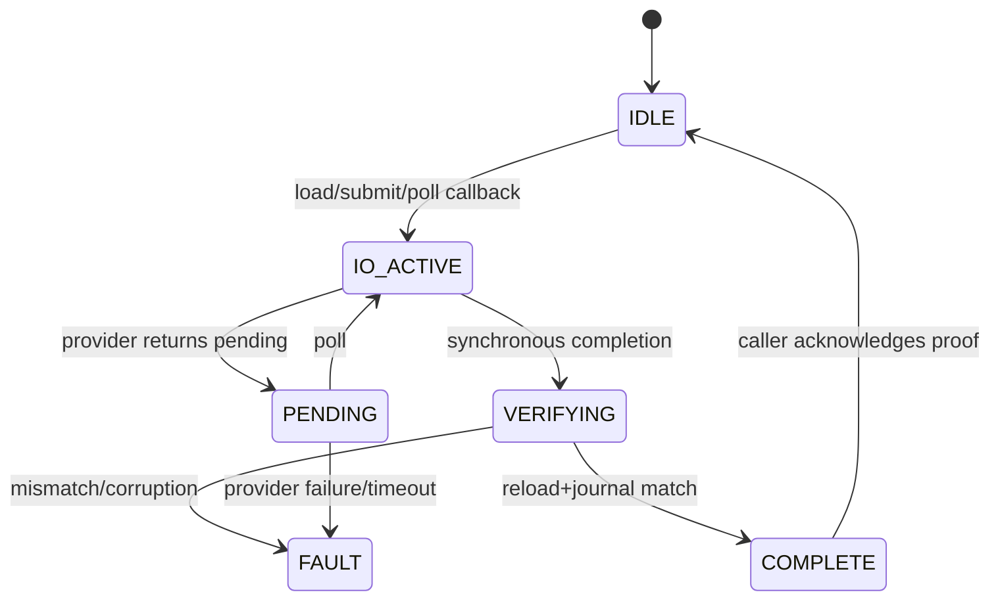

# 12 Persistence 与恢复

> 状态：`SELF-REVIEWED / EXTERNAL REVIEW REQUIRED`
>
> 本文负责持久化 I/O、Record 原子性、Completion Proof 和重启恢复。Persistence 不决定业务承诺是否仍合法；最终资格由调用模块 Owner 重新验证。

## 1. 两层证明

| 层 | 证明内容 |
| --- | --- |
| Persistence Owner | 记录按指定操作写入、读回一致、schema/CRC/serial/witness 合法 |
| Caller Owner | 记录属于当前事务，且当前 Authority、Lease、Policy、Config、Session 仍允许使用 |

`persisted == true` 不等于 `may_promise == true`。

## 2. Durable Identity 与 Volatile Completion Routing

持久化记录中的 Durable Identity 至少绑定：

```text
schema/layout generation
durable owner/object identity
transaction_id
operation_id/type
parent epoch/config/generation
record_fingerprint
expected_pre_state
expected_post_state
```

这些字段在重启后仍有意义，用于判断“盘上的记录是哪一个协议事务”。它们不能包含 Runtime 指针、callback、队列下标或仅在本次启动有效的 Owner Instance。

当前启动中的异步 Completion Routing 另用 RAM-only continuation：

```text
runtime_instance_id/generation
caller_owner_instance_id/generation
persistence_owner_instance_id/generation
pending_slot_id/generation
expected durable identity/fingerprint
continuation kind and destination
```

Provider Completion 必须同时匹配 durable 证据和当前 volatile continuation，不能只凭 operation ID；不匹配时不得调用旧 callback 或写入新 Runtime。volatile continuation 永不编码进 Record。重启后不存在“恢复旧 callback”这件事：Persistence 先加载 immutable durable snapshot，再由当前 Owner 按 Durable Identity 认领、恢复或 Fence 对应事务。

## 3. Provider I/O 状态机



Provider 回调前必须先原子取得共享重入门，再在 Persistence Owner gate 下发布 operation-specific
`IO_ACTIVE`、pending generation 与 continuation，最后才调用 Provider；门忙时不得先留下
`IO_ACTIVE`。递归 init/submit/poll 和跨 Owner 不安全调用均在零写入前拒绝。本篇的
Provider operation/state 表是 Persistence I/O 的唯一权威，第 05 篇只拥有 Driver/Adapter 映射。

## 4. 提交流程

```mermaid
sequenceDiagram
    participant C as Caller Owner
    participant R as Runtime Coordinator
    participant P as Persistence Owner
    participant D as Provider

    C->>C: validate current transition
    C->>R: immutable persistence requirement(operation, pre, post, fingerprint)
    R->>P: route exact persistence requirement
    P->>P: validate record + transition + reserve journal
    P->>P: acquire callback gate; publish io_active + continuation
    P->>D: submit encoded record
    D-->>P: COMPLETE or PENDING
    P->>D: load/reload when completion available
    D-->>P: durable bytes
    P->>P: decode + exact journal verification
    P-->>R: durable proof event + RAM-only bound continuation
    R-->>C: route exact durable proof event
    C->>C: install/recover exact durable state required by operation
    C->>C: revalidate current authority/policy/lease
    C->>C: emit allowed promise/authority action or remain fenced
```

Caller Owner 的 operation 和 Persistence Owner 的 proof 都只能由 Runtime Coordinator 路由。图中的 Coordinator 不验证 Record 内部语义、也不拥有 durable state；它只按 exact requester/owner/slot/generation/continuation 把不可变 requirement 和 proof event 送达正确 Owner。同步 Provider 完成不得绕过这条路径直接回调 Caller Owner。

Completion Proof 的 durable 部分说明“什么已经落盘”；volatile routing 部分只说明“这次启动把结果交给谁”。前者可以跨重启恢复，后者随 Runtime/Owner generation 失效。任何 stale completion 即使 durable fingerprint 正确，也不能路由到不同的 Runtime Instance；Owner 只能通过启动恢复流程重新认领 durable 状态。对 Config/Epoch 等状态恢复而言，“安装 durable 状态”和“允许对外承诺”是两步：当前 Authority 失效可以禁止发送，但不能让 Runtime 继续使用与 Record 不一致的旧状态。

## 5. 提交伪代码

```text
persistence_submit(owner, request):
    PRECHECK:
        validate owner phase and request binding
        validate current durable state
        validate operation-specific transition
        canonical-encode post state
        compute fingerprint
    RESERVE:
        prepare one unpublished journal/pending slot + continuation
        atomically try_acquire the shared Provider callback-domain gate
        if gate busy: rollback unpublished slot and return with zero visible state
        under Persistence Owner gate revalidate transition and publish operation-specific io_active
    SIDE_EFFECT:
        call provider.submit
    if PENDING:
        retain exact request and global/local fence required by caller contract
    if COMPLETE:
        reload and verify exact post state before returning proof
    on provider/verification failure:
        enter scoped persistence fault
```

语义缺省字段必须 canonical 为零；全零 completion/load result 必须无效。

## 6. 双槽和 Witness

```text
write inactive slot with next generation and uncommitted marker
verify bytes
atomically mark committed according to provider contract
advance independent anti-rollback witness before any external promise
```

若最新已发布槽损坏且无法证明其从未对外使用，不能静默回退旧 generation；必须由独立 witness/hardware monotonic proof 恢复，否则 fail-closed。

## 7. 启动恢复

```text
persistence_load_before_owner_start():
    if not atomically try_acquire shared Provider callback-domain gate:
        return BUSY with owner, output and durable state unchanged
    under Persistence Owner gate:
        revalidate owner is uninitialized/IDLE and no callback/ingress active
        publish one LOAD + IO_ACTIVE continuation before provider.load
    result = call provider.load through the same gated callback template
    if result is PENDING:
        retain exact LOAD continuation and return PENDING
    if result is definitive failure:
        enter scoped persistence fault and go to the common epilogue
    load both slots and witness from the completed provider result
    validate schema, CRC, canonical form and serial domains
    choose state only when anti-rollback proof is unambiguous
    recover pending/terminal transaction according to schema
    advance boot/session incarnation persist-before-use when required
    merge synchronous/pending completion through one epilogue
    clear callback-active, retire/load continuation and release gate on every exit
    return immutable recovered snapshot keyed by Durable Identity
```

Owner 在得到恢复快照后初始化 Runtime 状态；不能先发送 Advertise/ACK/Commit 再异步补加载。
`try_acquire` 是非阻塞门禁，不得等待或自旋；递归 `init/load`、门忙或 Owner 状态不符均在
Provider I/O 前零写拒绝。同步失败、`PENDING`、decode/verify 失败和异常退出都必须经过同一
epilogue，不能遗留 `IO_ACTIVE`、continuation 或 callback-domain gate。

## 8. Operation 掉电窗口

```text
PREPARED:
    side effect has not started

ABORTED_NO_EFFECT:
    exact terminal rejection/cancel is durable and executor was provably never invoked

EXECUTING:
    effect may have started

COMMITTED_RESULT:
    effect and result can be proved/replayed

IN_DOUBT:
    effect cannot be safely determined
```

`PREPARED` 后 Policy/Authority 撤销时，Caller 可在证明执行器尚未观察请求的前提下持久化
`ABORTED_NO_EFFECT`，从而释放未执行事务而不冒充普通错误。`EXECUTING` 也只有当前启动仍持有
可靠的 `executor_observed=false` 证明时允许转入该终态；掉电恢复不能重建这个易失证明。
无法对账的 `EXECUTING` 重启后进入 `IN_DOUBT`，不得自动重复外部副作用。

## 9. Scope Fence

- Cluster persistence 故障只 Fence 依赖该记录的 Cluster Authority；
- Durable Operation 故障不冻结普通数据；
- completion 发送背压不是 persistence failure；
- 清理、取消、Driver completion 和其他无关业务继续推进。

## 10. Feature OFF 与 Provider 缺失

| 条件 | 唯一合法行为 |
| --- | --- |
| Persistence OFF | API/符号、Provider vtable、record/pending/recovery Storage 全部不进入产品；普通易失 Request、静态通信和 Realtime local-only 继续运行 |
| 依赖 durable promise 的模块 ON、Persistence OFF | Composition/configure 阶段失败；Dynamic Admission、Durable Operation、Dynamic/Secure Group、Cluster 不得在运行时偷偷退化为易失 |
| Persistence ON、Required Provider 缺失/合同非法 | init 在任何 Owner 启动和发送前失败，输出对象保持未初始化；不得先运行再报告 degraded |
| 显式 `VOLATILE_TEST` | 只允许命名测试 Composition，Capability/diagnostic 必须显示非 durable；不能通过生产 Manifest 或作为掉电证据 |
| 单一 durable domain 被 Fence | 只关闭依赖该 domain 的承诺；Provider completion、清理和其他独立 domain 按预算继续推进 |

## 11. 固定资源与扫描预算

| 资源 | 编译期合同 | 满载/推进规则 |
| --- | --- | --- |
| Durable domain | `UCN_V6_MAX_PERSIST_DOMAINS` | 每个 domain 有独立 Fault/Fence、schema 与 Owner；满载不合并不相干记录 |
| 双槽 Record | 每 domain 精确 `UCN_V6_PERSIST_SLOT_COUNT=2`、`UCN_V6_PERSIST_RECORD_BYTES` | inactive write → verify → commit；槽尺寸不足构建失败，不做可变记录 |
| Anti-rollback witness | `UCN_V6_MAX_PERSIST_WITNESSES` | 与 domain 一一/Manifest 映射；损坏或落后无法判定时 fail-closed |
| Request/pending/continuation | `UCN_V6_MAX_PERSIST_REQUESTS`、`UCN_V6_MAX_PERSIST_PENDING`、`UCN_V6_MAX_PERSIST_COMPLETIONS` | submit/poll/load 各有 exact operation/slot/generation；表满在 Provider I/O 前拒绝 |
| Canonical staging/scratch | `UCN_V6_PERSIST_STAGING_BYTES`、`UCN_V6_PERSIST_VERIFY_BYTES` | 位于 caller-owned Storage，不使用大栈或动态内存；不足时零 Provider I/O |
| Recovered snapshot/routing | `UCN_V6_MAX_PERSIST_RECOVERY_SNAPSHOTS`、`UCN_V6_MAX_DURABLE_COMPLETION_ROUTES` | snapshot 由 Durable Identity 索引；volatile callback route 不持久化、不猜新 Owner |
| Operation journal/tombstone | 由消费模块声明固定 `*_JOURNAL_ENTRIES/*_TOMBSTONES`，并计入对应 durable domain Record | 不存在通用无限日志；GC 只删除已满足模块安全保留条件的终态，不能回收 anti-rollback 高水位 |
| Owner 单轮预算 | `UCN_V6_PERSIST_POLL_BUDGET`、`UCN_V6_PERSIST_VERIFY_BUDGET`、`UCN_V6_PERSIST_GC_BUDGET` | 每轮固定次数；多次 PENDING 保留 cursor/continuation，不从 slot 0 饥饿其他 domain |

Composition 生成 `UCN_V6_PERSIST_STORAGE_BYTES/ALIGNMENT`，并 checked 计算全部 domain、slot、
staging 与 completion 容量。Provider 的最小 write/erase alignment、原子粒度、最大 record size 与
API version 必须在 init 前验证；不能等第一次承诺时才发现不兼容。

## 12. 对抗测试

- 全零 Provider completion/load 无效；
- submit/poll/init 回调递归与双线程门禁；
- Provider `load()` 内递归 `init/load`：`try_acquire` 或 Owner 状态校验失败，零 Provider 二次调用、零对象写回、共享 gate 最终释放；
- 撕裂写、旧槽有效/新槽损坏、witness 落后/损坏；
- 相同 operation ID、不同状态/fingerprint 拒绝；
- 相同 operation ID 但不同 durable owner/parent generation 拒绝；
- `PENDING` 多次 poll 后完成并精确 reload；
- Runtime A 发起后销毁，数值相同的 Runtime B 收到迟到 completion：不路由、不写 B；
- 掉电后旧 volatile continuation 不恢复，只允许新 Owner 按 Durable Identity 认领 snapshot；
- PREPARED 后资格撤销：durable `ABORTED_NO_EFFECT` 可幂等重放，执行器调用次数保持 0；
- EXECUTING 重启且无法证明执行器未观察请求：进入 `IN_DOUBT`，不得伪造 `ABORTED_NO_EFFECT`；
- durable identity 匹配但 pending slot/Owner generation 不匹配：记录保留，callback 不调用；
- 持久化完成时 Caller Authority 已过期：记录保留但承诺不发送；
- completion 后 ACK/发送 `NO_SPACE/LINK_DOWN` 不污染 persistence fault；
- Feature OFF 时普通 Request/Result 无持久化依赖。
