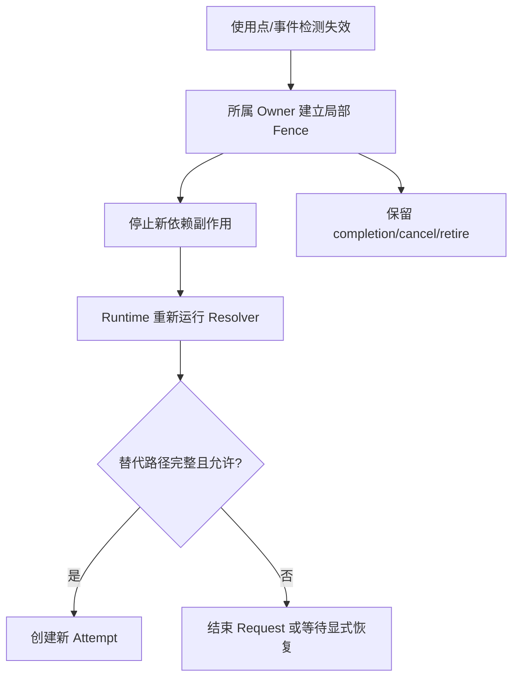

# 13 故障恢复与对抗矩阵

> 状态：`SELF-REVIEWED / EXTERNAL REVIEW REQUIRED`
>
> 本文汇总跨模块故障，不重新定义各 Owner 算法。每条用例必须能区分安全实现与至少一种已知错误实现。

## 1. 故障传播原则



## 2. 原子性失败注入点

每条有副作用流程至少在以下边界注入失败：

```text
P0: 输入校验前
P1: PRECHECK 完成后
P2: 预留第一个资源后
P3: 所有资源预留后
P4: 本地状态提交后
P5: 外部回调进入时
P6: 外部副作用已发生但 completion 未到
P7: completion 到达但 continuation 未执行
P8: continuation 执行后、资源退休前
```

每个点应声明：可重试、回滚、补偿、Fence 或 `IN_DOUBT`。

## 3. 核心生命周期矩阵

| 反例 | 错误实现会怎样 | 正确结果 |
| --- | --- | --- |
| Request 已完成，Driver 仍持有 Buffer | 提前复用内存 | Request 终态与 obligation 退休分离 |
| 未跟踪 Best-Effort Copy 被要求返回 Handle/callback | 仍走单 TX Slot，留下不可查询的伪 Handle | 接受前升级为受跟踪 Request，或因 Anchor/Receipt 容量不足零副作用拒绝 |
| 未跟踪发布后来才发现需要 Security/Flow/Transfer/Persistence Setup | 先返回成功，事后补建事务对象 | 接受前完成分层选择；未跟踪路径只允许基础 SoftRoute 等待，不能事后升级 |
| cancel 与 completion 交叉 | 双释放/双回调 | token 精确匹配，只退休一次 |
| callback 内 reopen | 换代后旧 RX 修改新实例 | `ERR_STATE`，对象和 generation 不变 |
| Driver open/close/reopen 路径绕过统一模板 | callback 内 stop/reopen 改写生命周期，或同步失败遗留 continuation/gate | 所有路径均经 `call_driver_with_gate_held()`；完整状态 bundle、`driver_callback_active`、早到 latch 和 gate 释放在同一真值表收口 |
| 两 Runtime Handle 数值相同 | 串用对象 | instance 校验拒绝 |
| completion wakeup queue 满 | 丢失退休事实 | exact TX token 的内嵌 latch 仍锁存；保留扫描发现事实，队列只作提示 |
| 持续 RX/completion flood | Timer、控制 TX、取消和退休永久饥饿 | `StepBudgetPlan` 的每类保留份额和跨 step cursor 保证有限推进；安全 Fence 在事实发布时立即建立 |
| 模块绕过 Adapter 直接调用 Driver | callback gate/continuation 尚未建立就发生同步重入 | 链接/符号门禁拒绝；只有 Adapter 的 `call_driver` 可以进入 Driver |
| 业务 Owner 直接调用 Persistence、Adapter 或另一 Owner | 绕过 Coordinator 的统一依赖、预算和 continuation 编排 | 静态依赖/符号门禁失败；Owner 只能向 Coordinator 发布不可变 Requirement/Event |
| Persistence reload/init proof 直接返回业务 Owner | 同步 Provider 路径形成隐藏直连，绕过 Coordinator 的 instance、continuation 和预算校验 | Persistence 只向 Coordinator 发布 exact proof event；Coordinator 按请求 Owner/instance/slot/generation 路由 |
| 文档图或伪代码把 Security/Cluster 等业务 Owner 直连 Persistence/Adapter | 正文规则正确但实现者按另一张图恢复直连 | 00～26 全目录检查失败；内置变异自测必须能检出直连 Mermaid、直接 owner 调用和裸 `persist OPERATION` |
| Owner 图用 `==>`、`<--`、`-)` 等非规范箭头隐藏直连 | 检查器不认识箭头，图仍能被 Mermaid 渲染并误导实现 | 含 Owner 的图只允许五种冻结箭头；其他连接符不猜语义，直接使门禁失败 |
| 业务专项伪代码调用 `persistence_submit()`、`adapter_*()` 或跨行 `.persistence_owner.submit()` | 不含旧检查器要求的业务 Owner 单行前缀，绕过静态门禁 | 05 只允许定义 Adapter 内部 API，12/22 只允许定义 Persistence 内部 API；其他 00～26 只能调用 `coordinator_route_*` |
| Adapter 把原始 Driver/Link Fact 标成 authenticated | 未经 Wire/Security 验证的字节获得 Principal/权限语义 | Driver Fact 只能描述完整字节与物理元数据；Wire 结构校验和 Security 认证完成后才发布 authenticated frame/facts |
| Driver callback 内先发 completion，随后 submit 返回 PENDING | 把 COMPLETED 倒退成 SUBMITTED 或双消费 | 返回值与 exact event 只在一个合并点消费一次，终态不倒退 |
| Request 执行槽已退休、应用稍后查询旧 Handle | 读到复用槽的新请求或丢失终态 | exact Completion Receipt 独立保留；旧 Handle 只命中原代际 |
| Completion Receipt 表满 | 已发送后才发现无处保存终态 | 在 Sequence/Buffer/副作用前拒绝新 Request |
| Anchor 与 Receipt 数值槽号相同但 generation/对象不同 | Public Handle 直接命中错误回执 | Handle 只解析 Anchor；再由 exact `receipt_ref` 定位 Receipt，任一 generation 不匹配零写拒绝 |
| `LOCAL_ACCEPTED` 作为 Completion 目标 | API 返回成功但 Receipt 永久 UNPUBLISHED | 唯一 bundle commit 同时写 latch、retention 起点和已预留 callback obligation |
| 应用 ACK `LOCAL_ACCEPTED` 但 Request/Attempt 仍活动 | Receipt 提前退休，旧 Handle 丢失查询/取消目标 | 仅 `RESOURCES_RETIRED + live_request_ref == NONE + query/retention 满足 + callback DELIVERED/NONE` 才清除 `receipt_ref` |
| Receipt callback wakeup hint 丢失或队列已满 | callback 永久不执行，STOPPING 永不 QUIESCENT | 保留预算扫描 `READY -> INVOKING -> DELIVERED`；RUNNING/STOPPING 均继续，wakeup 只降延迟 |
| Buffer/holder ledger 在 Copy/bind 后才发现满载 | 已复制可见数据或已接管 App token，回滚后所有权不明 | 全资源先预留；Copy 只写 staging，Zero-copy 只在 bundle commit 转移所有权 |
| RX Ring 满（Copy 或 bind 输入） | Driver Buffer 泄漏或被双方释放 | 零 token/obligation；所有权从未转移，Driver/caller 精确回收 |
| 仅销毁/重建 Runtime 后复用 `IN_DOUBT` Buffer | 旧 DMA 仍写入新对象 | Runtime 重建不是 quiescence；必须由已审计硬件 reset/断电/启动屏障证明 |
| submit/open/close/query/cancel continuation kind 交叉错配 | 合法生命周期被拒绝或错误回调绕过门禁 | 按 operation 的精确 continuation kind、状态、instance/generation 在回调前拒绝 |
| Runtime A 的持久化 completion 迟到 Runtime B | stale callback 修改 B | durable 记录保留，但 volatile Owner/slot generation 不匹配，不路由到 B |
| Provider `load()` 内递归 `init/load` 或共享门忙 | 阻塞、死锁或半初始化对象可见 | `try_acquire` 失败零写返回；Owner gate 重校验后才发布 LOAD/IO_ACTIVE，统一 epilogue 清理 continuation/门 |
| 掉电后试图恢复旧 callback/queue slot | 把 durable identity 当 completion 地址 | 只恢复 immutable durable snapshot，由新 Owner 认领，不恢复 volatile routing |

## 4. 网络矩阵

| 反例 | 正确结果 |
| --- | --- |
| 基础 RREP 途中丢失 | 已安装项只是可过期 SoftRoute，无 Flow/Label/Authority/持久副作用 |
| 仅有 SoftRoute 却请求 Pinned/Network Time Sync/Cluster Authority | Resolver 返回 `NEED_DEPENDENCY(FLOW)` 或拒绝，不把 SoftRoute 冒充 FlowPath |
| 动态 Source 经静态中继 Route | 静态 fallback 不错误比较动态 Route Generation |
| Activate Stage 容量/输出预检不足 | 零 Route 写入、零 Candidate 删除、零线上发送 |
| Relay 已建立 `STAGE_PENDING`，下游拒绝/超时 | 不向上游发送 `STAGE_ACK`；回收或等待绝对 stage lease 清理本事务预留，不影响旧 Active |
| Target 已 STAGED，但 Stage ACK 丢失 | 同键重复 Stage 只重发冻结 receipt；字段冲突零写拒绝 |
| 错 Route Domain/Candidate/Route Generation/Digest/反向路径的 Stage/Commit ACK | Route/Candidate/统计不变 |
| Relay 未收到下游 `COMMIT_ACK` | 不发布本地 Active、不向上游发送 Commit ACK；保持 `COMMITTING` 并有界重试 |
| Commit 已在下游生效但上游 ACK 丢失 | 不谎称本地回滚；同键重发/terminal receipt 收敛，Origin 旧 Active 保留并报告 `IN_DOUBT` |
| Commit retry/deadline 耗尽 | 保留冻结事务键与 terminal receipt，进入 `IN_DOUBT`；不能复用普通 Stage Abort 删除 |
| Stage Abort 到达时本节点已接受 Commit | Abort 拒绝；只有尚未接受任何 Commit 的 Stage 才可认证 Abort/绝对 lease 清理 |
| terminal receipt 表项早于最大重试/迟到窗口被复用 | 测试必须失败；receipt retention 覆盖窗口且同键冲突不命中新事务 |
| 等待 ACK 时 RREP 改路径 | 已冻结 Candidate 不被就地改写 |
| Route lease 到期但未清扫 | 使用点立即拒绝 |
| 旧 RERR 与新 Route 使用相同下一跳 | 仅按 Peer/Link 删除新 Route | RERR 的 RouteDomain、route generation、causal ID、failed-link generation 全匹配才失效 |

## 5. 安全与身份矩阵

| 反例 | 正确结果 |
| --- | --- |
| Admission OFF 的静态安全节点重启 | 不分配地址也能重建新 Session |
| Future-start Authority challenge | 在开始时间前无写权限 |
| 延迟 Final Commit 修改本地起点 | transcript/本地 pending 绑定拒绝 |
| Session handshake 完成但 generation 未 durable/reload | 先发布 ACTIVE 并开始加密业务 | 只产生 exact Persistence requirement；proof 到达且当前资格复验后才发布 ACTIVE |
| Payload 与 AAD/workspace 部分重叠 | 首次写入前拒绝，输出不变 |
| Bootstrap 洪泛 | cookie、per-link quota、timeout 和密码预算限制 |
| 已认证但 Opcode ACL 不允许 | 业务副作用前拒绝 |

## 6. Reliable/Flow/Transfer 矩阵

| 反例 | 正确结果 |
| --- | --- |
| Flow OFF + Reliable ON | C1 ACK/重传真实闭环，或组合被拒绝 |
| forged/迟到 ACK | 不结束当前事务 |
| Transfer 表满 | 基础 C1 和控制 completion 仍可推进 |
| 冲突 Fragment 元数据 | 不污染已有重组 |
| Flow 依赖过期 | 旧 Flow Fence，Request 重新解析 |

## 7. Persistence/Group/Cluster Authority 矩阵

| 反例 | 正确结果 |
| --- | --- |
| Provider 同步重入 | 回调前的 io gate 拒绝 |
| durable domain A 损坏、表满或等待 I/O | 全局 Snapshot/Fault 冻结 B 与普通通信 | 只 Fence A；B 按自己的 record/witness/pending 推进，无持久依赖的 C1 继续 |
| inactive slot 写完、commit marker 前掉电 | 把未提交槽当最新记录 | 忽略未提交槽并保留旧 committed record |
| commit marker 后、witness 前掉电 | witness 先行或静默复用 generation | reload marker 所属新记录，再 checked-advance witness；不重新发布同代际 |
| witness 后、reload proof 前掉电 | 向调用者发送未回读承诺 | 重启只从 durable record 建新 continuation，旧 callback/slot 永不恢复 |
| 持久化等待期间 Authority 到期 | durable 记录保留，承诺不发送 |
| 新槽已发布后损坏 | 无 witness 时不回退重用 generation |
| 已执行副作用但结果未落盘 | 重启进入 `IN_DOUBT`，不自动重做 |
| PREPARED 尚未 durable/reload 就交给执行器 | 掉电后无法证明是否已开始 | 零执行器调用；先 durable PREPARED，再 durable EXECUTING 并逐字段 reload 后才 handoff |
| Config/Joint/Vote/Epoch 仅 submit 成功、尚无 exact reload proof | 提前发送 ACK/Commit/Stepdown | 线上承诺为零；proof 与当前 tx/config/epoch/voter/authority/fence 全匹配后才允许 |
| Durable Operation 使用含糊 `ABORTED` 终态 | 把“确定未执行”与“结果未知”混合 | 只允许有未观察证明的 `ABORTED_NO_EFFECT`，否则写 durable `IN_DOUBT` |
| Journal/continuation/Operation reply receipt/inline result pool 任一满载 | 在 PREPARED、Provider I/O 和执行器调用前零副作用拒绝 |
| 执行器返回结果超过预留 inline ceiling 且副作用可能已发生 | 使用已预留终态资源进入 `IN_DOUBT` 并 Fence；不事后分配、不重试执行器 |
| PREPARED 后资格撤销、执行器尚未观察 | durable `ABORTED_NO_EFFECT`，零执行器调用且可幂等查询 |
| PREPARED Abort 的 txid/C_new 不匹配 | 零 Provider I/O、零 staging 改变；仅 exact durable Abort + reload 可清除 |
| durable JOINT 遇本地超时、单 quorum 或单方 Abort | 保持 Joint/Fence；当前合同没有回退旧 Config 的边 |
| CONFIG_COMMIT durable 后旧 Authority 过期 | exact Config 仍安装进 Runtime；Authority 只 Fence 发送/副作用，不阻止状态恢复 |
| 历史 voter 重新准入但未投新票 | Takeover/Recovery Commit 拒绝 |
| 无完整 target proof 的 READY | 旧 Head 不永久 Fence |
| 同簇目标 Backup 以 Head 身份发 READY | 角色错误，旧 Head 不进入 Stepping Down |
| 跨簇目标非 Head 或跨 Cluster 比较 Term | READY 拒绝，不用 Term 数值建立跨簇 Authority 顺序 |
| Old Head 先发 Stepdown、后持久化 | 对抗测试必须失败；线上承诺前必须 durable Fence + reload |
| durable Stepping Down 后、Stepdown 发送前掉电 | 重启保持旧 Authority Fence，只能重发 exact handover continuation |
| target proof 在 Fence 持久化/reload 期间到期或改变 | 发送前 current-proof 复验失败；不发 Stepdown，保持 durable Fence 并进入 handover recovery |
| Stepdown 发送背压/Link Down | durable Fence 不撤销，不发送其他旧 Epoch Authority 帧 |
| 动态 Group 没有 Identity/Security/Persistence/当前逻辑 Realm Address Authority/quorum 任一项 | 创建 pending、Provider I/O、ACK、成员/Tree Generation 均为零 |
| Secure Group 缺 Security Context | Group RX 在 replay/ACL/业务副作用前拒绝 |
| Group 已取得 Replay reservation，后续 fanout/app 资源预留失败 | abort exact reservation；Replay Window、Group dedup、Attempt 和业务队列均不变 |
| Replay reservation 建立后 Session/Key/Policy/Fence 或 deadline 变化 | 可失败 PRECOMMIT 拒绝并释放全部未发布资源；不进入 NOFAIL_PUBLISH，不写业务状态 |
| 同 Sequence 已 COMMITTED 的 exact duplicate | 只读 evidence 查询 retained receipt；不暴露 Payload、不重复本地交付或 Group relay |
| 同 Sequence 已 COMMITTED 但 digest/事务键冲突 | 拒绝且不重发 receipt；不能以 Replay bitmap 命中冒充 exact duplicate |
| 同 Sequence 仍有 live mutation reservation | 返回 `REPLAY_IN_FLIGHT`，不创建第二个 reservation、不提前读 receipt |
| Group relay 资源预检失败 | 零部分 fanout、零本地交付、RX token 最终可退休 |
| Group PRECOMMIT 任一复验/Replay commit 失败 | Group dedup、Attempt、应用队列均不改变，只释放本 RX 预留；Replay bitmap 不消费 |
| Group 已进入 `NOFAIL_PUBLISH` 后发生外部 callback/Provider 调用 | 测试必须失败；该区段只能执行预留后的不可失败内存发布，损坏只能局部 Fault |

## 8. Realtime 矩阵

| 反例 | 正确结果 |
| --- | --- |
| 无 asymmetry proof 的固定 Path | 仅诊断，不 LOCKED、不产生同步 Envelope |
| Network Time Domain 生成新 generation 但尚未 durable/reload | 发布 `DOMAIN_TIME_VALID` 或同步 Envelope | 保持 `GENERATION_PENDING`；exact proof 后用空滤波窗口进入 UNSYNCED/ACQUIRING |
| 动态 Route + PREFERRED | 零时间同步 pending/帧，回退 LOCAL/NONE |
| 同 generation 重锁时间倒退 | ingest 当场 FAULT |
| retire event 首次失败 | obligation 留队，后续可重试 |
| Timed Driver callback 内先发 timestamp completion、随后返回 PENDING | exact event 胜出且只消费一次，不把 COMPLETED 倒退成 SUBMITTED |
| 发送端/接收端 uncertainty 合计越界 | Deadline 门禁拒绝 |

## 9. 模块关闭矩阵

| Composition | 必须证明 |
| --- | --- |
| 最小内核 | 无 Security/Route Discovery/Flow/Transfer/Persistence/Cluster 状态和符号 |
| Admission OFF + Security ON | 静态节点会话可重建 |
| Advanced Route/Flow OFF | Direct/Static/SoftRoute C1 继续；收到 Stage/Commit/ACK/Abort 在分配 Candidate/pending 前拒绝；C2/C3/C4/Pinned/Network Time Sync/Cluster Authority 不得消费 SoftRoute |
| Flow OFF + Reliable ON | C1 可靠路径真实可运行 |
| Cluster ON + Flow OFF | configure/init 零副作用拒绝 |
| Cluster ON + Group OFF | C4 Cluster Base 可用，C5 加速状态和符号为零 |
| Group ON + Cluster OFF | 静态/动态 Group 按自身依赖工作，不创建 Cluster 状态或 Authority |
| Dynamic Group OFF | 静态 Manifest Group 可用，不创建动态 ID/成员/Tree 持久状态 |
| Dynamic Group ON + Realm Address Authority/Identity/Security/Persistence 任一 OFF | configure/init 或首个动态请求零副作用拒绝，不隐式补开依赖 |
| Static Group 尝试运行期修改/退休 | 零 Provider I/O、零 Generation 推进；必须通过新的 anti-rollback Realm Manifest 或改用 Dynamic Group |
| O0 Reliable Endpoint 合法但没有当前 `TRUSTED_LINK_ALLOWED` | 零 Attempt、零 receipt、零 ACK；不能仅凭 `PUBLIC_UNAUTHENTICATED` 放行 |
| O0 Reliable 的 Link/Path Generation 在 receipt 重放前改变 | 旧 trusted proof 失效，不重发 ACK，不复用旧路径承诺 |
| Transfer Fragment 的 Interaction/Service 与 Setup 不同 | 认证后仍在 bitmap/reassembly 写入前拒绝 |
| C1 旧 Parent Generation Fragment/SACK 与新 Setup 复用 Transfer ID | 在 bitmap、reassembly 或发送窗口写入前拒绝；C1 逐片 Parent Generation 必须匹配 |
| Fragment Index/Kind 为非法 bit15=1 值或 SACK Kind 非 `0x8000` | 零状态拒绝；不能以 Payload 长度或方向猜 subtype |
| C1 SACK 不使用保留 Feedback Service、缺 Original Service/Parent Generation | 零发送窗口与 Credit 写入；不得把业务 Service 反转后当作 SACK |
| C2/C4 SACK 没有 ACTIVE 成对反馈 Flow，或该 Flow 绑定另一正向 Fingerprint | 零发送窗口与 Credit 写入；Setup ACK 前必须已预留正确反馈 Flow |
| Transfer Setup deadline 等于当前时间或 checked ms-to-us/add 溢出 | 零 Setup/重组资源；精确重复不得刷新旧 deadline |
| Origin sealed 数量有槽但字节池/bucket 满 | 在 Origin Sequence、Nonce、crypto 前拒绝，不借用基础 C1 保留 |
| 同一入站 Context 可同时解释成 H0/H1、H0/H2 或两个 Key Generation | 在 Replay/crypto/状态写入前拒绝；不得按长度、Tag 或认证失败结果试探，换钥迟到帧不回退 previous Key |
| Group Security OFF | 仅产品显式允许的非安全、非 Authority Group 用途可用；安全 Group 明确拒绝 |
| Realtime local-only | 只提供本地采样/收发时间戳，不创建 Network Time Sync pending，也不包含 Flow/Persistence 依赖 |
| Persistence OFF | 静态易失通信、单帧 C1、C1 Reliable 和 Realtime local-only 可用；Dynamic Admission、Durable Operation、持久 Cluster/Dynamic Group，以及没有等价硬件单调 witness 的 C1 Transfer 明确拒绝 |
| Nano secure endpoint ↔ Full gateway | Layout Hash 不同但共同 Wire/Capability 可互通 |
| dependency kind 与 union 分支不一致、Handle 过期或跨 Runtime | 在任何 Owner 写入前拒绝；不得按非零字段猜 kind |
| 两个 canonical requirements 的 64-bit digest 相同但字段不同 | 第二个错误复用第一个 Pending slot、Handle 或 proof | digest 只作预筛；命中后逐字段/逐字节精确比较，冲突输入零写拒绝且原槽不变 |
| Hop Budget 到期 | 只记 `DROP_EXPIRED`；不得降级成普通队列、提高 Class 或继续传播 |
| Feature OFF 只返回 UNSUPPORTED，但 archive 仍含专用符号/Storage | `nm/map/header/consumer` 门禁失败；不能宣称物理解耦 |
| 统一 Persistence 迁移时新旧 Store 同时可写 | 构建/启动拒绝；隔离 adapter 只允许一个 domain 的迁移测试，最终旧符号 denylist 归零 |
| Mermaid 使用 `==>`、`<--`、`-)`、带标签虚线或其他非规范 Owner 连线 | 含 Owner 的行无法按冻结语法完整解析，文档门禁拒绝；“不依赖”只能写正文或 Note，不能伪装成边 |
| Mermaid 使用无 `as` 的 `participant SecurityOwner` 直连 `PersistenceOwner` | CamelCase/下划线端点归一化为规范 Owner ID；逐边核对登记表后拒绝 |
| Mermaid 使用规范箭头连接登记表以外的 Owner 或错误方向 | 即使经过 Coordinator 或箭头语法合法也必须拒绝；Source、Target、Direction 三者均需命中唯一登记表 |
| 业务伪代码调用 `persistence.submit()`、`PersistenceOwner.submit()`、`adapter.submit()` 或裸 `persistence_*()` | 文档门禁拒绝；只能调用显式 `coordinator_route_*` 路由入口 |
| 业务伪代码先把 `persistence_owner`/`adapter_owner` 赋给别名再调用，或把 Owner 与方法拆到多行 | 固定块内别名传播与跨行匹配仍必须拒绝；不得通过拼写变化绕过 Coordinator |

## 10. 固定资源矩阵

| 资源耗尽或损坏 | 必须证明 |
| --- | --- |
| Persistence journal/pending slot 满 | 不覆盖已提交记录；不调用 Provider；不阻断无持久化依赖的普通发送 |
| 同步成功/恢复对账成功直接进入 Request Finalizer，未经过 completion event | Finalizer 仍发布一次 SUCCESS 并写入 exact Receipt；execution 不得带未发布 latch 退休 |
| Route Stage/Commit pending 或 terminal receipt 满 | 新 Stage 在发送前拒绝；已有 COMMITTING/IN_DOUBT 和 completion/retry/receipt 仍可推进，不驱逐其他事务 |
| Group/Member/Sender Slot 表满 | 不驱逐旧 Group 或密码 Replay；新事务 fail-closed |
| Group fanout/Tree attempt 满 | 不产生部分发送；已存在 Attempt 的 completion/cancel/retire 仍可推进 |
| Group completion result 表满 | 返回冻结的有界聚合/截断状态，不动态增长、不误报 ALL/QUORUM |
| Best-Effort Group 请求 ANY/ALL/QUORUM/SUBSET | 以本地 fanout submit 数量冒充远端成功 | 首个发送前拒绝；非本地 scope 必须有逐成员认证 Reliable receipt 和冻结成员快照 |
| Cluster Config/Joint/Vote 表满 | 零 Authority 状态改变、零承诺发送，旧 Config 继续受 Fence/Authority 规则约束 |
| durable handover continuation 槽满/损坏 | Old Head 不发送 Stepdown；已经 durable 的 Fence 损坏时 fail-closed，不恢复旧 Authority |
| Feature OFF 模块收到对应 Frame/Intent | 在分配任何模块状态前明确拒绝；最小路径的字节、符号和 Storage 不变化 |

## 11. 证据等级

```text
L0 文档和伪代码一致
L1 纯模型/合同测试
L2 Host 单元与故障注入
L3 Sanitizer/Analyzer/并发检查
L4 目标 MCU 构建和栈/资源测量
L5 实板功能、掉电和物理故障
L6 长稳、规模、性能和功耗
```

高等级证据不能由低等级结果代替；例如 Host 通过不能证明真实 Flash 掉电或硬件时间戳精度。
