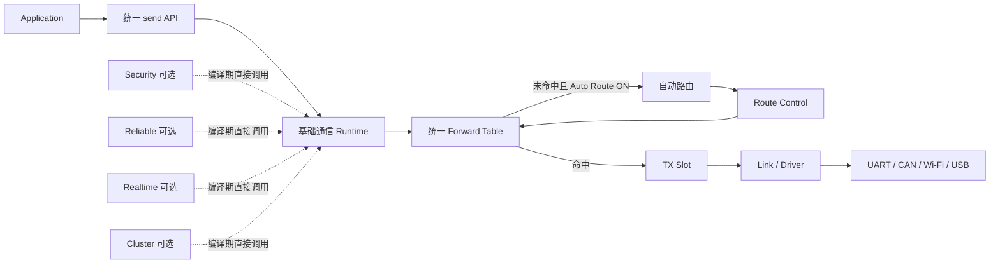
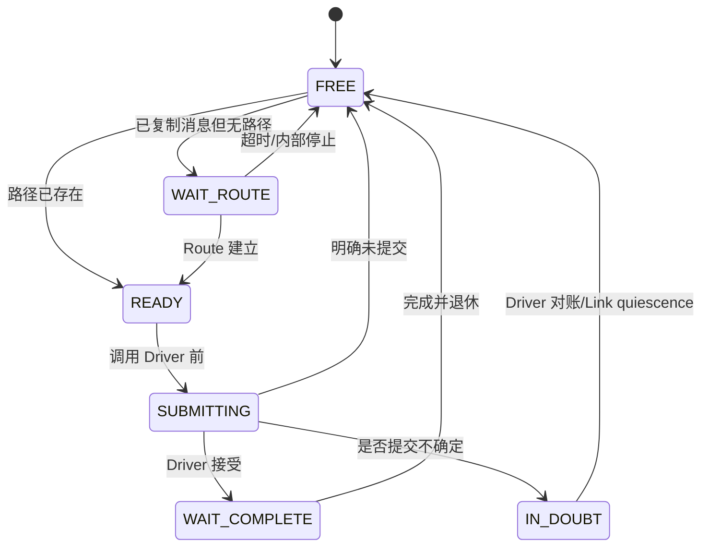
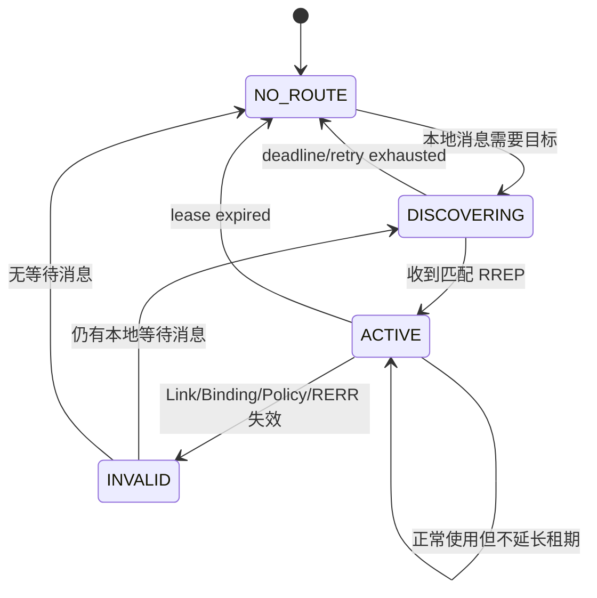
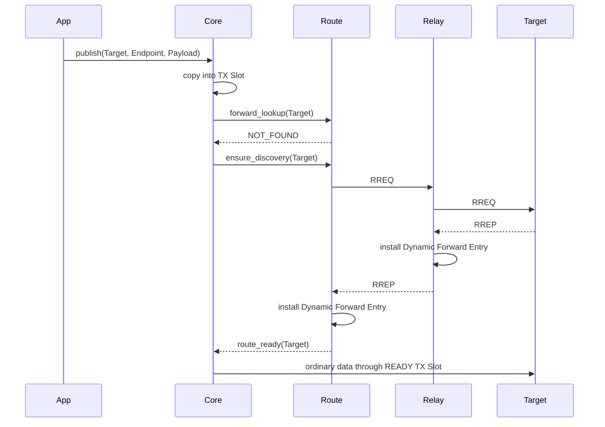

# 15 基础通信与自动路由简化设计

> 状态：`SELF-REVIEWED / EXTERNAL REVIEW REQUIRED`
>
> 适用目标：UCN v6 下一轮简化重构。
>
> 本文只定义“基础通信”和“自动路由”两个模块的最小职责、状态、调用顺序、伪代码与失败边界；不冻结最终 C API 名称、Wire byte offset、Opcode 数值或当前源码已经完成的结论。

本文是基础 C1 可达性的当前简化权威：RREP 只逐跳安装可过期、非持久、非 Authority 的 `SoftRoute`。需要 C2/C3/C4、Pinned Path、Network Time Sync、Cluster Authority 或原子换路时，必须升级到[Advanced Route 与 Flow](24-Advanced-Route与Flow简化设计.md)的 `FlowPath` Stage/Commit 事务。第 07 篇和低开销 Wire 第 12 章已按这条分界统一，不再允许实现者二选一。

## 1. 为什么先简化这两个模块

UCN 最初要解决的问题很直接：

1. 节点能够发送和接收一条消息；
2. 不知道路径时，协议能够自动找到目标；
3. 路径失效后能够重新寻找；
4. MCU 不依赖 Linux、服务器或动态内存也能独立运行。

安全、可靠传输、分片、实时、Group 和 Cluster 都是重要能力，但它们不应让最普通的一条消息先经过完整事务平台。最小路径如果已经包含 Request Anchor、Receipt、Attempt、Flow、Transfer、复杂 Planner 和多个 Owner，就很难阅读、验证和裁剪。

因此本轮先把协议分成两个清楚的层次：

```text
基础通信：已经知道下一跳时，按确定的本地生命周期把一帧交给链路或本地 Endpoint。
自动路由：不知道下一跳时，寻找并维护一个可用的下一跳。
```

自动路由只能提供“可达性”，不能自动获得安全、可靠、实时或 Cluster Authority。

## 2. 总体目标

目标结构如下：



核心原则：

- 一个节点默认只有一个协议状态 Owner；
- 一个符合严格条件的未跟踪 Best-Effort Copy 消息只占用一个 TX Slot；
- 静态路径和动态路径共用同一张 Forward Table；
- 自动路由关闭时，不保留 Discovery 槽、Seen 表或后台 Timer；
- 自动路由不直接调用应用 Endpoint；
- 基础通信不理解 Cluster、Realtime 或业务 Operation；
- 编译期使用直接函数调用，不建立动态插件注册表；
- 所有数组容量编译期确定，不调用 `malloc/free`；
- 错误路径不能覆盖现有 Route、活动 TX Slot 或 Driver Buffer。

## 3. 两个模块的边界

### 3.1 基础通信负责什么

基础通信只负责：

- Runtime 生命周期；
- Link 注册和 Link 状态；
- Endpoint 注册和本地分发；
- 严格 Wire 编解码；
- 固定容量 RX/TX Slot；
- 静态 Direct/Forward Entry；
- 根据 Forward Table 选择下一跳；
- 单帧 Best Effort Copy 发送；
- 中继普通数据帧；
- Driver 提交、完成、取消和 Buffer 退休；
- 本地单调时间、Deadline、Token、Generation 和 Fence；
- 为控制帧保留最小发送资源。

基础通信不负责：

- 自动发现路径；
- 端到端 ACK 与重传；
- 大消息分片；
- 动态身份入网；
- 密钥协商或密码算法；
- 网络时间同步；
- Group/Cluster Authority；
- 多路径评分、负载均衡或带宽预留。

### 3.2 自动路由负责什么

自动路由只负责：

- 没有可用 Forward Entry 时发起 Route Discovery；
- 对 RREQ 做有界去重和 Hop Limit 检查；
- 保存临时 Reverse Entry；
- 目标节点产生 RREP；
- RREP 返回时逐跳安装 Dynamic Forward Entry；
- Link/下一跳失效时使对应 Dynamic Entry 失效；
- 发送受限 RERR；
- 到期清理 Route、Reverse 和 Discovery 状态；
- 路由建立后唤醒等待该目标的本地 TX Slot。

自动路由不负责：

- 保证业务帧送达；
- 远端业务执行结果；
- E2E 身份认证；
- Cluster Head/Backup 选举；
- 为转发数据缓存并代替 Origin 重新寻路；
- 主动把一条仍然可用的路径切换到“分数略高”的路径；
- 基础版本中的 Probe、Stage、Commit、Label Flow 或多路径事务。

## 4. 为什么基础路由不使用分布式 Stage/Commit

基础自动路由的 Route 只是一个有有效期的“下一跳提示”，不是 Authority，也不是持久化承诺。RREP 在某个 Relay 安装成功、但在更上游丢失时，多出来的 Route 只会暂时占用一个固定槽并在租期后失效，不会授予业务权限。

因此基础版本使用：

```text
RREQ → RREP → SOFT_ACTIVE
```

而不使用：

```text
PROBE → STAGE → STAGE_ACK → COMMIT → COMMIT_ACK
```

这样做的取舍是：

| 项目 | 基础自动路由 | 高级事务路径 |
| --- | --- | --- |
| 目标 | 尽快获得可达路径 | 原子建立完整 Path/Label/资源证明 |
| 控制消息 | RREQ、RREP、RERR | Probe、Stage、Commit、Receipt 等 |
| 路径切换丢包 | 允许 Best Effort 丢失 | 可设计为无损或可对账 |
| 内存和代码 | 小 | 大 |
| 适用 | 普通传感器、控制状态、临时连接 | 可靠 Flow、硬实时预留、Cluster 关键通道 |

如果业务不能接受切路丢包，应启用 Reliable/Flow 模块，而不是把全部基础路由升级为分布式事务。

## 5. 唯一 Forward Table

基础通信和自动路由不得分别维护两张“当前路由表”。二者共用一个 Forward Table：

```text
ForwardEntry
    state                 FREE / ACTIVE / INVALID
    kind                  DIRECT / STATIC / DYNAMIC
    destination           目标 Binding 引用
    next_hop              下一跳 Binding 引用
    link_id
    link_generation
    local_generation      本节点本地 Entry 代际
    installed_from_causal_id  # DYNAMIC 必填；DIRECT/STATIC 为零
    hop_count
    cost
    expires_at_us         DIRECT/STATIC 可为永久
```

查找优先级固定为：

```text
精确 DIRECT
→ 可用 STATIC
→ 未到期 DYNAMIC
→ NOT_FOUND
```

同一目标同一类型最多只有一个活动 Entry。简单版本不做 Weighted Multipath，也不为每个业务流建立 Flow Pin。

Forward Entry 只引用当前 Link Generation。Link reopen 后旧 Generation 的 Entry 立即失效，不能等待下一次业务发送才发现。

## 6. 基础通信的数据对象

### 6.1 Core Owner

概念对象：

```text
Core
    lifecycle
    instance_generation
    links[LINK_COUNT]
    endpoints[ENDPOINT_COUNT]
    forward_table[FORWARD_COUNT]
    tx_slots[TX_COUNT]
    rx_slots[RX_COUNT]
    next_origin_sequence
    pending_event_bits
    stats
    optional auto_route state
```

Core 不嵌入 Security、Transfer、Realtime 或 Cluster 的最大对象。可选模块拥有自己的 Storage，由编译期 Composition 决定是否存在。

### 6.2 TX Slot

普通 Copy 消息只需要一个对象：

```text
TxSlot
    state
    slot_generation
    destination
    endpoint
    traffic_class
    deadline_us
    route_ref
    frame_length
    frame_bytes[MAX_BASIC_FRAME]
    driver_token
    completion_latch
```

状态：



基础路径不创建独立的 Request Anchor、Completion Receipt、Attempt 和 Buffer Ledger。TX Slot 自己持有 Copy 后的 Frame 和 Driver obligation。该优化只允许 `PUBLISH + ONE_WAY + operation_id=0 + BEST_EFFORT + COPY + 单帧 + LOCAL_ACCEPTED + 无 callback + out_handle==NULL`，且不得要求 Group、Latest、Reliable、Transfer、Zero-copy、任何 Operation/dedup、远端结果或独立 Setup 生命周期。调用者要求 Handle，或 Resolver 需要上述任一能力时，统一 Public API 必须在返回成功前改走第 03 篇的受跟踪生命周期。

### 6.3 RX Slot

```text
RxSlot
    state                 FREE / PUBLISHED / CLAIMED
    slot_generation
    link_id
    link_generation
    sender_discriminator
    timestamp
    frame_length
    frame_bytes[MAX_BASIC_FRAME]
```

基础 Endpoint 回调只允许终态 `ACCEPT` 或 `DROP`。如果业务需要“稍后再试”，必须启用带有显式 Delivery Record 的高级接收模式，不能让最小 RX Slot 无限占用 Ring。

## 7. 建议的最小公共接口

以下是概念接口，不是已冻结 ABI。

### 7.1 应用侧

```c
ucn_result_t ucn_init(
    void *storage,
    size_t storage_bytes,
    const ucn_config_t *config,
    ucn_node_t **node);

ucn_result_t ucn_endpoint_add(
    ucn_node_t *node,
    const ucn_endpoint_config_t *endpoint,
    ucn_endpoint_handle_t *out_endpoint);

ucn_result_t ucn_static_route_add(
    ucn_node_t *node,
    const ucn_static_route_t *route,
    ucn_path_handle_t *out_path);

ucn_result_t ucn_publish(
    ucn_node_t *node,
    const ucn_target_t *target,
    const void *payload,
    size_t payload_bytes,
    const ucn_send_options_t *options,
    ucn_send_handle_t *out_handle);

ucn_result_t ucn_send_cancel(
    ucn_node_t *node,
    ucn_send_handle_t handle);

ucn_result_t ucn_step(
    ucn_node_t *node,
    uint64_t now_us,
    uint16_t budget,
    ucn_step_result_t *result);

ucn_result_t ucn_get_stats(
    const ucn_node_t *node,
    ucn_stats_t *stats);

ucn_result_t ucn_stop(ucn_node_t *node);
```

普通用户不直接调用 Route Candidate、Probe、ACK、Queue、Wire Encode 或 Adapter retire API。

### 7.2 Driver 侧

```c
ucn_result_t ucn_driver_rx_publish(
    ucn_node_t *node,
    ucn_link_handle_t link,
    const uint8_t *bytes,
    size_t length,
    const ucn_rx_meta_t *meta);

ucn_result_t ucn_driver_tx_complete(
    ucn_node_t *node,
    ucn_driver_token_t token,
    ucn_result_t result,
    const ucn_tx_meta_t *meta);

ucn_result_t ucn_driver_link_event(
    ucn_node_t *node,
    ucn_link_handle_t link,
    ucn_link_state_t state);
```

Driver API 只发布事实，不解析 Wire、不修改 Route、不调用业务 Endpoint。

## 8. 基础发送伪代码

### 8.1 用户入口

```text
publish(node, target, payload, options, out_handle):
    require node is RUNNING
    require no Driver/App callback is active
    if the request is not eligible for the strict untracked fast path:
        return submit_tracked_intent(...)
    require out_handle == NULL
    require COPY + single-frame + BEST_EFFORT + ONE_WAY + operation_id == 0 + LOCAL_ACCEPTED
    validate destination, endpoint, payload length and traffic class
    validate static product policy

    slot = reserve one TX slot
    if no slot:
        return NO_SPACE without sequence or Wire side effect

    copy immutable request fields and payload into slot
    route = forward_lookup(request.destination, now)

    if route exists:
        slot.route_ref = exact local route reference
        slot.state = READY
    else if AUTO_ROUTE is compiled and enabled:
        slot.state = WAIT_ROUTE
        rc = auto_route_ensure_discovery(destination, now)
        if rc is terminal failure:
            release slot
            return rc
    else:
        release slot
        return NOT_FOUND

    post TX event
    return OK
```

`UCN_OK` 只表示消息已复制到 UCN 固定存储并被本机接受，不表示远端已经收到。该未跟踪路径没有 Public Handle、callback、查询或取消；后续 Link 失败只进入诊断。远端确认属于 Reliable 模块，并会自动使用受跟踪路径。

### 8.2 TX 推进

```text
step_one_tx(node, now):
    slot = oldest READY control-reserved-or-business slot
    if none:
        return IDLE

    revalidate slot deadline
    revalidate exact route/link generation
    if route invalid:
        if AUTO_ROUTE enabled and deadline remains:
            slot.state = WAIT_ROUTE
            auto_route_ensure_discovery(slot.destination, now)
            return PROGRESS
        finish slot with NOT_FOUND
        return PROGRESS

    preflight exact encoded length and Driver capacity
    sequence = reserve next non-wrapping Origin Sequence
    encode directly into slot.frame_bytes
    bind sequence permanently to slot

    # This function executes inside Runtime Coordinator; a business Owner only
    # publishes an immutable prepared-send requirement to the Coordinator.
    prepared = coordinator_route_adapter_prepare(slot.frame_bytes, exact link reference)
    # Adapter SPI owns the shared callback-domain gate and exact continuation.
    result = coordinator_route_adapter_submit(prepared)
    # Coordinator-routed Adapter submit is the only path to call_driver(); it publishes
    # SUBMITTING/token before callback and merges synchronous completion latch.

    switch merged result:
        SUBMITTED:
            slot.state = WAIT_COMPLETE
        COMPLETE:
            finish and release slot exactly once
        NOT_SUBMITTED:
            finish failure or bounded local retry
        UNKNOWN:
            slot.state = IN_DOUBT
            fence exact Link instance against new submit
```

Sequence 只能在 Route、长度、Slot 和 Driver 容量预检通过后分配。分配后即使发送失败也不能复用。
基础通信文档不得复制 Driver 回调模板。`step_one_tx()` 只调用 Adapter Owner SPI；共享 callback-domain gate、Adapter event gate、`SUBMITTING` continuation、早到 completion 合并和所有出口释放唯一由[第 05 篇](05-Runtime-Adapter-Port与事件循环.md)的 `call_driver()` 实现。这样多个 Adapter、任务与 ISR 仍经过同一个调用域门禁。

## 9. 基础接收伪代码

### 9.1 Driver 发布

```text
ucn_driver_rx_publish(node, link, bytes, length, meta):
    validate exact link instance and basic length bound
    atomically reserve RX slot
    copy bytes + metadata into RX slot
    publish PUBLISHED
    post RX event
    return immediately
```

ISR/SDK callback 只复制和通知，不在中断中解码、查路或调用 Endpoint。

### 9.2 Owner 消费

```text
step_one_rx(node, now):
    item = claim oldest PUBLISHED RX slot
    if none:
        return IDLE

    rc = wire_decode_strict(item.bytes)
    if rc fails:
        count malformed
        goto RETIRE

    require frame hop limit is valid
    apply optional compiled Hop Security gate

    if frame.destination is local:
        validate Endpoint and local policy
        apply optional E2E gate
        call Endpoint once
        record ACCEPT or DROP
        goto RETIRE

    if forwarding is disabled:
        count not_for_us
        goto RETIRE

    if frame.hop_limit <= 1:
        count hop_exhausted
        maybe queue bounded RERR
        goto RETIRE

    route = forward_lookup(frame.destination, now)
    if route not found:
        count no_route
        maybe queue bounded RERR
        # Relay does not retain this foreign data while discovering a route.
        goto RETIRE

    reserve one relay TX slot
    decrement hop limit
    replace only permitted mutable Hop fields
    apply optional next-Hop protection
    queue relay TX

RETIRE:
    retire exact RX slot once
    return PROGRESS
```

中继不解析业务 Payload，也不代表 Origin 暂存业务帧等待自动寻路。这样可以避免一个未知来源耗尽 Relay 的固定内存。

## 10. 自动路由的数据对象

### 10.1 Discovery Slot

每个目标最多一个本地 Discovery：

```text
DiscoverySlot
    state                 FREE / WAIT_REPLY
    destination
    discovery_id
    started_at_us
    deadline_us
    next_retry_us
    attempts
```

多个本地 TX Slot 等待同一目标时，共用这个 Discovery，不重复广播。

### 10.2 Seen/Reverse Slot

Relay 使用一个合并对象：

```text
ReverseSlot
    state                 FREE / ACTIVE
    discovery_key
    previous_hop
    ingress_link_generation
    remaining_hops
    expires_at_us
```

`discovery_key` 至少绑定：

```text
Realm
Origin Binding
Requested Destination Address
Discovery ID
```

同一 key 只接受第一次合法 RREQ。基础版本不为了寻找“更优一点”的路径反复改写 Reverse Slot。

### 10.3 Route 控制消息

本文只冻结语义，不冻结字节布局。

```text
RREQ
    discovery key
    maximum hops / remaining hops
    accumulated cost
    required basic capability

RREP
    discovery key
    resolved destination binding
    hop count
    accumulated cost
    path frame MTU

RERR
    original traffic RouteDomain
        realm
        origin principal/address/binding/session
        destination principal/address/binding
    route_generation
    route_causal_id          # 原 RREP 的 canonical discovery key/digest，仅作因果索引
    reporting next hop binding
    failed link id
    failed link generation
    reason
```

RERR 必须在线上显式携带并认证完整 `original traffic RouteDomain + route_generation + route_causal_id + failed_link_generation`；`route_causal_id` 不能替代其他字段，也不能仅凭 digest 相等认定同一 Route。`affected destination binding` 已包含在 RouteDomain 中，不再形成第二份可能漂移的目标身份。如果 Security 启用，这些消息必须通过对应控制消息认证；如果 Security 关闭，只允许产品明确声明可信的物理网络。

## 11. 自动发现伪代码

### 11.1 发起发现

```text
auto_route_ensure_discovery(destination, now):
    if a live Forward Entry exists:
        wake waiting TX slots
        return OK

    if matching DiscoverySlot exists:
        return PENDING

    reserve DiscoverySlot and one control TX credit
    if either reservation fails:
        release both
        return NO_SPACE

    id = take next non-wrapping discovery id
    slot = WAIT_REPLY(destination, id, absolute deadline)
    queue RREQ with configured maximum hop count
    return PENDING
```

### 11.2 Relay 收到 RREQ

```text
route_on_rreq(message, ingress, now):
    validate control frame, identity, hop limit and policy
    key = canonical discovery key from message

    if key already exists in ReverseSlot:
        return DUPLICATE without forwarding

    reserve ReverseSlot, one return Forward Entry and control TX credit
    before writing any object
    if no capacity:
        return NO_SPACE without partial state

    publish ReverseSlot(key, ingress next hop, deadline)
    install/refresh one DYNAMIC return entry to message.origin through ingress
    # This uses the same Forward Table; it is not a second reverse-route table.

    if requested destination is local:
        queue RREP using the new ReverseSlot
        return OK

    if remaining_hops <= 1 or forwarding disabled:
        retire the just-created ReverseSlot if no reply can use it
        return EXHAUSTED

    decrement remaining_hops
    add local conservative link cost
    forward exact RREQ once
```

### 11.3 目标生成 RREP

```text
route_make_rrep(rreq, reverse, now):
    require rreq destination is this node's current binding
    require reverse key and ingress generation still match
    reserve control TX credit
    build RREP with current destination binding and accumulated Path MTU
    send to reverse.previous_hop
```

### 11.4 Relay 收到 RREP

```text
route_on_rrep(reply, ingress, now):
    validate exact discovery key and resolved destination
    reverse = lookup exact ReverseSlot(reply.discovery_key)
    require reverse exists and not expired

    local_origin = reply origin is local
    preflight one Dynamic Forward Entry
    if not local_origin:
        preflight one upstream control TX credit
    if either unavailable:
        return NO_SPACE without installing Route

    next = make_dynamic_entry(
        destination = reply.resolved_destination,
        next_hop = ingress.peer,
        link = ingress.link,
        hop_count = reply.hop_count + 1,
        cost = checked_add(reply.cost, ingress.cost),
        path_frame_mtu = min(reply.path_frame_mtu, ingress.frame_mtu),
        expiry = checked_add(now, local_dynamic_route_lease_us))

    atomically install/replace only the matching DYNAMIC entry

    if local_origin:
        complete matching DiscoverySlot
        wake every WAIT_ROUTE TX slot whose payload fits path_frame_mtu
        fail oversized waiting slots without consuming a business Sequence
        retire ReverseSlot
        return OK

    forward the same RREP to reverse.previous_hop
    retire ReverseSlot only after the upstream send is committed or terminal
```

部分 Relay 安装成功而上游 RREP 丢失是允许的。这些 Entry 没有 Authority，且会按本节点的固定动态 Route 租期到期。RREP 不携带远端绝对时间或可续租承诺；普通业务流量也不延长租期。只有新的合法 RREP 或显式静态配置才能建立新的有效期。

## 12. 自动路由状态图



基础版本不在 `ACTIVE` 时主动扫描更优路径。只有当前路径失效、到期或用户显式要求重新发现时，才启动新 Discovery。

## 13. 路径失效与 RERR

```text
on_link_invalid(link_id, old_generation):
    mark every matching Forward Entry INVALID
    cancel/fail TX slots bound to the old exact Link generation
    for each affected local WAIT_ROUTE-capable request:
        start or join one new Discovery
    queue at most one bounded RERR toward each recorded traffic Origin
```

```text
route_on_rerr(message, ingress, now):
    validate authenticated reporting Peer and exact original traffic RouteDomain
    validate nonzero route_generation, route_causal_id,
        failed_link_id and failed_link_generation
    current = lookup exact message.original_traffic_route_domain
    if current.route_generation != message.route_generation
        or current does not use this reporting Peer/failed Link generation
        or current.installed_from_causal_id != message.route_causal_id:
        ignore stale RERR
    else:
        invalidate current entry
        wake local waiting policy
        forward one bounded RERR toward the original Source if a return
        Forward Entry exists; otherwise stop propagation
```

每个 Dynamic Forward Entry 必须保存完整 RouteDomain、`route_generation`、建立它的 `installed_from_causal_id` 以及精确 Link ID/Generation；新的 Discovery ID/RREP 即使仍选择同一下一跳，也形成新的 causal ID。RERR 只能使“原始 traffic Origin/Destination 域、Route 代际、报告者、精确 Link Generation 且发现因果实例全部相同”的 Entry 失效，不能按 Destination、Peer 或 digest 粗暴删除无关静态、新建或已刷新路径。RERR 是加速收敛的 Best Effort 提示，不是正确性的唯一来源；即使返回路径不存在，Link Fence、Route 租期和下一次本地发送也必须最终发现失效。

## 14. Runtime 单轮推进

不再使用 13 个公开 phase hook。唯一 `ucn_step()` 使用**按工作类别保留预算 + 跨调用轮转游标**，不能用无限严格优先级：

```text
ucn_step(node, now, budget):
    require monotonic now
    require budget > 0
    require no Driver/App callback active

    classes = [COMPLETION_RETIRE, INVALIDATION_CLEANUP, RX,
               TIMER, CONTROL_TX, ORDINARY_TX, OBLIGATION_RETIRE]
    credits = derive fixed per-class caps from compile-time StepBudgetPlan
    cursor = node.step_class_cursor
    work = 0

    while work < budget and any class has work:
        cls = next class from cursor with remaining credit and pending work
        if none because this call's credits are exhausted:
            break
        process exactly one item from cls
        credits[cls] -= 1
        work += 1
        cursor = class after cls

    node.step_class_cursor = cursor

    return {work, more_work, next_deadline}
```

`StepBudgetPlan` 为 completion/清理、RX、Timer、控制 TX、普通 TX 和 obligation 退休保留编译期份额；某类未使用的份额可在本轮末尾借给其他类，但不能改变下一轮起始游标。若调用者给出的 `budget` 小于类别数，持久游标仍保证连续调用中的有限等待。持续 RX 或 completion flood 不能永久饿死 Timer、RERR/ACK、取消或 Buffer/Token 退休。

安全性不能等待调度公平性：Link/Session/Authority 失效在事实发布点先设置不可绕过的 Gate/Fence；`INVALIDATION_CLEANUP` 类只负责传播和退休。所有类别还必须有各自固定容量与满载计数，不能用一个满载普通 RX 队列阻止保留的 completion/control/retire 槽。

完成、Fence、取消和控制消息拥有保留进度，Bulk 数据不能无限饿死它们。可选模块由编译期直接调用，不通过可变 callback 数组拼装执行顺序。

## 15. 自动路由与基础发送怎样组合



应用不需要先调用内部 `discover()` 再调用 `ucn_publish()`。默认 API 自动等待 Route；高级用户可以通过配置选择：

- `AUTO_ROUTE`：没有路径时自动发现；
- `STATIC_ONLY`：没有静态路径立即返回 `NOT_FOUND`；
- `PINNED`：只允许指定 Link/Path，失效后不自动换路。

这些是策略，不是三套发送实现。

## 16. 固定资源合同

基础通信只需要：

| 资源 | 编译期容量 | 满载行为 |
| --- | --- | --- |
| Link | `LINK_COUNT` | 拒绝新 Link |
| Endpoint | `ENDPOINT_COUNT` | 拒绝注册 |
| Forward Entry | `FORWARD_COUNT` | 不覆盖活动 Entry |
| TX Slot | `TX_COUNT` | 拒绝新消息 |
| RX Slot | `RX_COUNT` | 丢弃新入站并计数 |
| 控制保留 TX | 至少 1 | 不允许普通数据占用 |

自动路由额外需要：

| 资源 | 编译期容量 | 满载行为 |
| --- | --- | --- |
| Discovery Slot | `DISCOVERY_COUNT` | 新目标发现失败 |
| Reverse/Seen Slot | `REVERSE_COUNT` | 不转发新 RREQ |
| Dynamic Forward Entry | 与 Forward Table 共用配额 | 不覆盖 STATIC/DIRECT |

Feature OFF 时 `DiscoverySlot`、`ReverseSlot`、相关 Timer、统计和控制 Opcode 均不得进入对象布局或产物符号。

## 17. 简化后的内部函数划分

建议每个函数只完成一个动作。

### 17.1 基础通信内部函数

```text
core_validate_send()
forward_lookup()
tx_reserve()
tx_prepare_frame()
tx_submit_one()
tx_complete_one()
rx_claim_one()
rx_process_local()
rx_process_forward()
rx_retire_one()
core_expire_one()
```

### 17.2 自动路由内部函数

```text
route_ensure_discovery()
route_on_rreq()
route_on_rrep()
route_on_rerr()
route_install_dynamic()
route_invalidate_link()
route_expire_one()
route_wake_waiters()
```

不建议在基础版本公开 Candidate Begin/Add/Probe/Prepare/Record/Ack 等一组细粒度 API。若未来实现高级事务路径，应放入独立 `Advanced Route/Flow` 模块，而不是重新膨胀基础 Route API。

## 18. 文件建议

基础实现控制在少量清晰文件中：

```text
include/ucn/
    ucn.h                 用户基础 API
    ucn_driver.h          Driver 事件 API
    ucn_config.h          最小公共配置

src/v6/base/
    ucn_base.c            checked arithmetic、time、storage
src/v6/wire/
    ucn_wire.c            严格 codec
src/v6/core/
    ucn_core.c            init/send/step/stop
    ucn_core_rx.c         RX 与 Endpoint
    ucn_core_tx.c         TX 与 Driver completion
src/v6/route/
    ucn_route.c           Forward Table、RREQ/RREP/RERR
```

平台代码不进入总头：

```text
ports/freertos/
adapters/can/
adapters/uart/
reference/esp32s3/
```

用户只有在使用对应平台时才显式包含其头文件。

## 19. 现有实现到目标实现的处理原则

| 当前概念 | 简化目标 |
| --- | --- |
| Stack Owner + Runtime Owner | 合并为一个 Core Runtime Owner |
| 13 个 phase hook | 一个固定顺序 `ucn_step()` |
| 大量 invalidation callback | 一个带类型的内部 invalidation queue/slot |
| 普通消息也无条件创建完整 Request/Receipt/Attempt | 未跟踪 Best-Effort Copy 只创建 TX Slot；要求跟踪或高级语义时创建完整生命周期 |
| Adapter 的 peek/retire/service 全部公开 | 变为 Core 内部接口 |
| Wire 依赖 Identity | Wire 只依赖基础类型 |
| Adapter 依赖 Wire/Protocol Owner | Adapter 只搬运 bytes、token、timestamp |
| Route Candidate/Probe/Activate API 暴露 | 基础 Route 只保留 lookup/control/invalidate/expire |
| RREQ 后必须完成分布式两阶段激活 | 基础路由收到 RREP 即逐跳安装；高级 Flow 另行实现事务激活 |
| 总头包含 Port/Reference Board | 总头只暴露用户基础 API |

现有安全门禁不能因为简化而删除。Token Generation、Link Generation、no-wrap Sequence、回调前 `SUBMITTING`、完成 latch、无部分写入和固定容量都必须保留。

## 20. 必须覆盖的测试

### 20.1 基础通信

- 两节点静态直连，Payload 完整一致；
- Endpoint 不存在时零 Sequence、零发送；
- TX/RX Table 满时不覆盖活动槽；
- Driver 同步完成、异步完成、明确未提交和结果未知；
- completion 早于 `submit()` 返回时只完成一次；
- 任意发送模块绕过 Adapter 直接调用 Driver 时链接/符号门禁失败；只有 `call_driver` 可进入回调；
- 持续 RX/completion flood 下，Timer、控制 TX、取消与 token/Buffer 退休在固定 step 上限内得到推进；
- Link reopen 后旧 token、旧 completion 和旧 Forward Entry 全部拒绝；
- callback 内递归 send/stop/reopen 返回状态错误且对象不变；
- Hop Limit 到界时不转发；
- Relay 不解析或修改业务 Payload；
- Auto Route/Security/Reliable/Realtime/Cluster OFF 产物不含对应符号。

### 20.2 自动路由

- A→B→C 首次发送自动触发 RREQ/RREP，随后业务送达；
- 同一 Discovery 的重复 RREQ 只转发一次；
- RREQ 环路由 Seen/Reverse Slot 和 Hop Limit 终止；
- RREP 只沿匹配 Reverse Entry 返回；
- 过期、错误 Origin、错误 Destination、错误 Discovery ID 的 RREP 不安装 Route；
- Discovery 超时释放等待 TX Slot，并且不消耗业务 Sequence；
- 多个 TX Slot 等待同一目标时只发起一个 Discovery；
- Link Down 使精确 Dynamic Entry 失效并重新发现；
- 旧 RERR 不能删除使用新下一跳的 Route；即使新 Route 复用同一下一跳，只要 original traffic RouteDomain、route generation、causal ID 或 failed-link generation 任一不同也不能删除；
- Forward Table 满时不覆盖 DIRECT/STATIC/活动 DYNAMIC；
- Relay 无 Route 时丢弃外来业务帧并受限发送 RERR，不缓存后代替 Origin 发现；
- Security OFF 只允许 Manifest 明确声明的可信网络组合；
- Route Feature OFF 时静态发送仍正常，Storage/Flash/Timer 无 Route Discovery 成本。

## 21. 当前明确不做的能力

本简化版本暂不实现：

- 主动寻找更优路径；
- 多路径负载均衡；
- Per-flow Hash；
- 无损路径切换；
- 带宽和 Deadline 预留；
- Label Fast Path；
- 分布式 Route Stage/Commit；
- 远端 Route 持久化恢复；
- Route 本身授予安全或 Cluster 权威。

这些能力以后可以作为独立模块增加。增加前必须证明：关闭该模块时，基础通信和基础自动路由的代码、状态和 Wire 不发生变化。

## 22. 验收标准

本文方案进入实现前至少应满足：

1. 满足本文严格未跟踪条件的 Best-Effort Copy 消息只占一个 TX Slot；
2. 用户只调用一个 `publish()`，Route 缺失时由协议自动发现；
3. Auto Route OFF 后不保留任何 Discovery/Seen/Reverse 状态；
4. 静态和动态路径只有一张 Forward Table；
5. 基础 Route 控制只有 RREQ、RREP、RERR 三类语义；
6. 基础路由不使用 Probe/Stage/Commit；
7. 中继不缓存未知路径的外来业务数据；
8. 一个固定 `ucn_step()` 能完整推进 RX、TX、Timer、Route 和退休；
9. 平台 Adapter 和参考板不进入基础总头；
10. 所有容量固定，满载失败关闭，不覆盖活动对象；
11. Route 仅表示可达性，不绕过 Security、Endpoint Policy 或 Cluster Authority；
12. Full/Lite/Nano 使用同一行为合同，差别只在编译能力和表容量。
13. Driver 入口只有 Adapter 一个 Owner，所有回调前门禁和 continuation 顺序一致。
14. `ucn_step()` 在持续输入压力下仍对 Timer、控制、取消和退休提供有限等待。
15. RERR 必须在线上携带并匹配 exact original traffic RouteDomain、route generation、causal ID 和 failed-link generation；causal digest 只作索引，不能代替逐字段身份比较。

## 23. 最终效果

最普通场景变为：

```text
配置 Link + Endpoint
→ 调用 publish()
→ 有 Route 直接发送
→ 无 Route 自动 RREQ/RREP
→ Route 建立后继续发送
```

用户不需要理解 C0/C1、RREQ/RREP、Forward Table 或 Driver Token。高级用户仍可选择静态路径、禁止自动寻路或固定某条路径。

协议内部则保持清楚的两层：

```text
基础通信解决“一帧怎样安全地进出本机”。
自动路由解决“这帧下一跳应该发给谁”。
```

安全、可靠、实时、Group 和 Cluster 继续建立在这两个小模块之上，而不是反过来污染基础消息路径。
