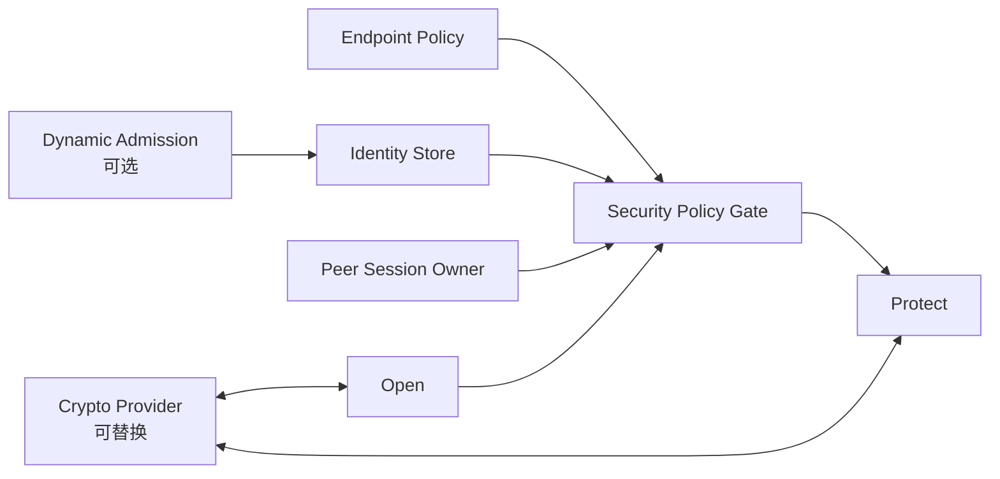
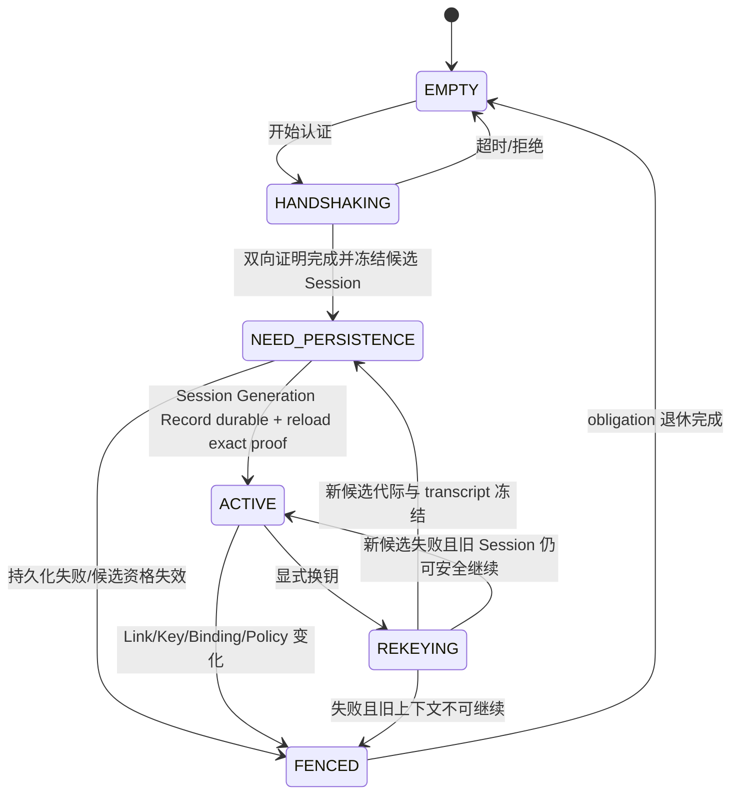

# 16 身份、准入与安全简化设计

> 状态：`SELF-REVIEWED / EXTERNAL REVIEW REQUIRED`
>
> 目标：让“谁在通信、是否允许、是否可信、是否加密”成为一个可选且容易理解的模块；未要求安全的最小通信不承担密码状态和线上 Tag 开销，要求安全的 Endpoint 又不能被自动降级。
>
> 权威关系：本文是实现者首读的简化模型；第 06 篇保留完整安全/恢复合同，低开销 Wire 文档唯一拥有线上字节。三者已统一为“安全按 Endpoint/Path 启用，不得降级 REQUIRED”的同一合同。

## 1. 用户看到什么

普通用户不选择密码算法、Key ID、Hop Tag 或 Replay Window，只表达：

```text
NONE             不要求 UCN 额外认证，仅允许产品明确认可的可信环境
AUTHENTICATED    必须证明原始发送者，Payload 可明文
CONFIDENTIAL     必须证明原始发送者，并加密 Payload
AUTO             使用 Endpoint 和产品的安全下限
```

默认必须是 `AUTO`，不能用零值偷偷表示“不安全”。最终有效要求取：

```text
effective_security = max_hard_requirement(
    product_minimum,
    endpoint_minimum,
    per_send_requirement)
```

这里的 `max_hard_requirement()` 不是简单比较枚举大小，而是按允许集合和策略表求唯一结果。没有满足要求的实现路径时，发送失败，不自动降低安全等级。

## 2. 三件事必须分开

| 子能力 | 回答的问题 | 是否一定需要 |
| --- | --- | --- |
| Identity | 这个稳定设备是谁 | 所有需要长期授权的节点需要 |
| Admission | 陌生设备能否获得地址和网络资格 | 只有动态入网需要 |
| Security Session | 当前这条 Peer/Group 通信怎样认证、加密和防重放 | 按 Endpoint 与路径策略启用 |

已静态配置身份的两个节点可以关闭 Dynamic Admission，但每次启动、Link reopen 或换钥后仍需要建立新鲜 Session。反过来，Admission 通过也不等于已经拥有所有 Endpoint 权限。

## 3. 最小模块边界



Security 模块拥有：

- 当前 Identity/Binding 的只读引用；
- Peer Session 和 Group Security Context；
- Key Generation、发送 Nonce 绑定和密码 Replay Window；
- Endpoint ACL 的认证结果；
- Crypto Provider 回调生命周期。

Security 模块不拥有：

- Route；
- 业务 Request/Operation ID；
- Reliable ACK；
- Group 成员关系；
- Cluster Authority；
- Driver TX/RX token。

## 4. 最小对象

```text
IdentityRecord
    principal_id
    current_binding
    identity_generation
    trust_anchor_ref

PeerSession
    state
    peer_principal
    peer_binding
    link_generation
    session_generation
    security_profile
    send_sequence
    replay_window
    key_handle
    durability_ref
    expiry

AdmissionSlot                  # 仅 Dynamic Admission 开启时存在
    bootstrap_key
    phase
    nonce_a / nonce_b
    transaction_id
    absolute_deadline

SecurityContextHandle
    runtime_generation
    slot_index
    session_generation
    exact_fingerprint
```

Key 只以 Provider handle 存在，不复制进 Route、Flow 或业务 Request。

## 5. Session 状态机



只有 `ACTIVE` 可以签发新的 Security Context Handle。`FENCED` 后允许完成已提交 Driver 操作和释放资源，但不得开始新的权威发送。

## 6. 建立 Session 的简化伪代码

```text
security_session_begin(peer, link, now):
    validate peer identity and current binding
    validate link generation and product policy
    reserve one SessionSlot and one control TX credit
    if any reservation fails:
        return NO_SPACE without state change

    generate fresh local challenge
    publish HANDSHAKING with absolute deadline
    queue authenticated SESSION_HELLO
    return PENDING
```

```text
security_on_response(message, ingress, now):
    locate exact HANDSHAKING slot
    verify peer, link generation, transcript, nonce and deadline
    ask Crypto Provider to verify proof
    derive/select one exact security profile and key handle

    if any check fails:
        retire slot or keep bounded retry according to error class
        return error without ACTIVE publication

    candidate_generation = checked_next(recovered durable high-water)
    freeze SessionGenerationRecord containing:
        peer principal/binding generation
        local binding generation
        exact link generation
        suite/key generation
        transcript digest
        candidate_generation
    publish state = NEED_PERSISTENCE plus an immutable typed Persistence requirement
        without issuing a Security Context Handle
    notify Runtime Coordinator; do not call Persistence directly
    return PENDING
```

```text
security_on_durability_proof(session, proof, now):
    require session.state == NEED_PERSISTENCE
    require proof exact-matches owner/transaction/domain/record fingerprint
    require Coordinator-routed proof states Persistence Owner reloaded the committed SessionGenerationRecord
    revalidate peer binding, link, suite/key, policy and absolute deadline

    atomically publish:
        session_generation = proof.committed_generation
        send_sequence = initial value
        replay_window = empty
        durability_ref = proof exact reference
        state = ACTIVE
    return OK
```

不能同时尝试多个 Key/Suite，靠“哪个能解开”猜当前安全上下文。接收端必须在解析出唯一 Context 后才调用 Crypto Provider。
`HANDSHAKING/NEED_PERSISTENCE` 的重复报文只允许绑定同一 transcript 和同一持久化 Handle；冲突候选必须拒绝。Provider 的同步成功或 RAM 中递增 generation 都不能代替 reload proof。启动、Link reopen 和换钥都必须使用由 Coordinator 路由、Persistence Owner 从持久化高水位恢复后产生的 checked-next proof；Security Owner 不直接调用 Persistence。没有 Persistence Foundation 或等价、以其 Provider 形式接入的硬件单调 witness 时，不得发布受保护 Session `ACTIVE`。

## 7. 发送保护

```text
security_prepare_send(intent, route_view, endpoint_policy, now):
    required = resolve_effective_security(intent, endpoint_policy)

    if required == NONE:
        require product policy explicitly permits trusted transport
        return SECURITY_NONE

    session = lookup exact active session(route_view.next_peer)
    require session exists, not expired and generations match
    require session profile satisfies required
    require endpoint ACL permits source, target, service and opcode

    reserve next sequence without publishing it yet
    return immutable SecurityContextHandle
```

```text
security_protect(frame, handle, output):
    validate handle and all non-overlap rules before writing
    build canonical AAD from immutable origin fields
    if AUTHENTICATED:
        copy plaintext and append origin authentication tag
    if CONFIDENTIAL:
        encrypt payload and append AEAD tag
    if hop protection is required:
        apply exact next-peer hop protection
    commit reserved sequence only with successful protected bytes
```

同一 Reliable 重传必须重发完全相同的 E2E protected bytes，不能再次分配 Origin Sequence/Nonce；每跳保护可以按当前下一跳重新生成。

## 8. 接收验证

接收必须在任何业务副作用之前完成：

```text
security_open(frame, ingress, now, output):
    validate structural bounds and reject all partial overlap
    resolve exactly one hop/session/group context
    verify hop protection before forwarding or accepting

    if local destination:
        verify origin authentication/decryption
        classify replay as NEW / EXACT_DUPLICATE / CONFLICT
        verify canonical ACL(source, destination, service, opcode)
        publish replay consumption only with downstream admission commit
        return OpenedMessage

    if relay:
        return only the forwarding facts the current contract allows
```

`EXACT_DUPLICATE` 可以交给 Reliable/Operation 层决定是否重发 ACK/Result；`CONFLICT` 必须拒绝。Security 不直接执行重复业务。

## 9. Dynamic Admission

动态入网只负责从 `UNBOUND` 到“获得受认证 Binding 与基础资格”：

```text
BOOTSTRAP_HELLO
→ stateless COOKIE_CHALLENGE
→ HELLO_COOKIE
→ IDENTITY_CHALLENGE / RESPONSE
→ ADDRESS_OFFER
→ DEVICE_COMMIT
→ FINAL_COMMIT
→ ADDRESS_BOUND
```

简化原则：

- Cookie 验证前不分配昂贵状态；
- Bootstrap 只允许一跳，不转发；
- 每 Link 和每来源都有固定配额与绝对超时；
- Offer/Commit 必须绑定完整 transcript、Realm、Identity、Binding、Authority 和 Suite；
- 需要持久化的 Binding 必须 persist-before-use；
- 已绑定设备换 Link 时走 Peer Reauthentication，不重新伪装成陌生节点。

## 10. Driver/Provider 重入

```text
call_crypto_provider(operation):
    acquire caller-owned shared callback gate
    publish IO_ACTIVE before callback
    call provider
    clear IO_ACTIVE after callback returns
    release gate
```

回调中再次调用 Security 控制 API必须返回 `STATE` 且零写入。不能用普通全局静态指针充当跨线程/ISR Gate。

## 11. 自动选择与开销原则

```text
if Endpoint is public telemetry on explicitly trusted closed bus:
    choose no UCN origin tag when product policy permits
elif Endpoint requires source integrity:
    choose AUTHENTICATED
elif Endpoint carries secret or sensitive command:
    choose CONFIDENTIAL
```

一跳且已有可复用安全 Flow 时，允许选择合并证明以避免重复 Hop+Origin Tag。没有 Context 时使用普通自描述安全帧。优化只能减少重复字段，不能降低认证范围。

## 12. Feature OFF

Security Crypto OFF 时：

- 不编译 Session/Key/Replay/Crypto 状态；
- 普通可信链路的公开 Endpoint 仍可通信；
- Build 未编译所需安全能力时，在发送前返回 `UCN_ERR_UNSUPPORTED`；Build 有能力但产品/Endpoint Policy 禁止当前组合时返回 `UCN_ERR_POLICY`；
- Security Session ON 但没有可用 Persistence Foundation/等价单调 Provider 时，Composition/init 必须拒绝；静态 Identity、O0/H0 明文可信链路仍可按产品 Policy 独立存在，但不能伪造 Session；
- 不允许用“模块不存在”解释为自动明文放行。

Dynamic Admission OFF 时：

- 静态 Identity/Binding 节点仍可工作；
- 不存在 AdmissionSlot、Cookie、Offer 或后台扫描；
- 陌生设备不能动态取得地址。

## 13. 固定资源

```text
SECURITY_SESSION_SLOTS
ADMISSION_SLOTS
GROUP_SECURITY_SLOTS
CRYPTO_STAGING_BYTES
SECURITY_WORK_BUDGET
```

全部由编译期配置决定。Security 专用槽满不得阻止一个策略允许的无安全基础消息完成，但也不得绕过安全要求回退到明文。

## 14. 建议最小接口

```text
security_session_begin()
security_prepare_send()
security_protect()
security_open()
security_revoke()
security_step()
security_get_view()
```

Admission 单独暴露：

```text
admission_on_bootstrap()
admission_step()
admission_get_result()
```

不向应用暴露 Replay Window、Key Slot 或 Crypto staging。

## 15. 最低验收条件

1. `AUTO` 总能解析为唯一安全结果或明确失败；
2. Endpoint 要求认证时，Security OFF 不能发送；
3. Link/Binding/Key Generation 变化立即 Fence 旧 Session；
4. 认证、ACL 和 Replay 在业务回调前完成；
5. 重传不重复消费 Origin Sequence；
6. 所有 Provider 回调重入均零写失败；
7. Feature OFF 后专用状态、符号和流量归零；
8. 最小可信通信不承担未请求的 Crypto 状态和线上 Tag。

## 16. 最终效果

```text
用户：这条数据必须可信，但不需要加密
协议：自动选择 AUTHENTICATED，并复用当前有效 Session

用户：普通封闭设备内部状态，使用默认
协议：按产品/Endpoint Policy 决定是否允许零额外 UCN 安全开销
```

身份、安全和准入因此成为一套严格但可裁剪的门禁，而不是强行塞进每个最小数据帧的固定负担。
