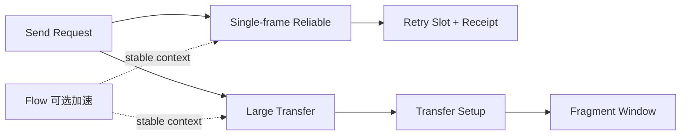
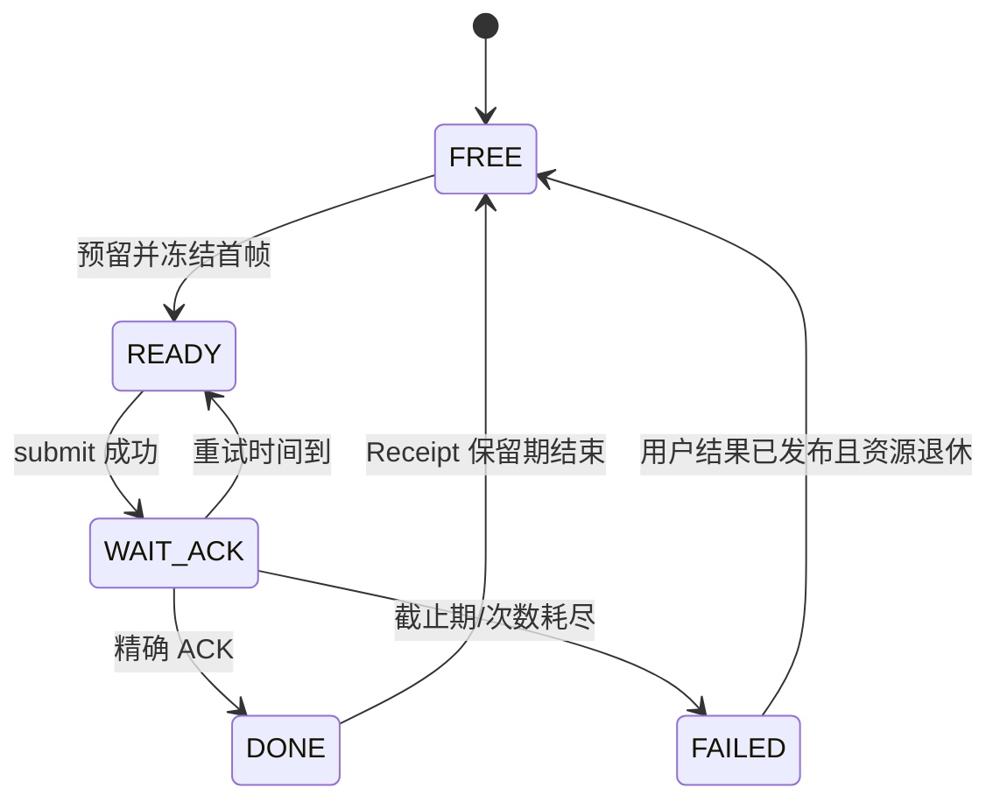

# 17 可靠传输与大消息简化设计

> 状态：`SELF-REVIEWED / EXTERNAL REVIEW REQUIRED`
>
> 目标：用最少对象实现“确认送达”和“超 MTU 数据传输”，不让偶发可靠小消息被迫建立 Flow，也不让大消息逻辑污染普通单帧发送。
>
> 权威关系：本文是实现者首读的简化模型；第 08 篇拥有完整事务/恢复细节，低开销 Wire 文档拥有精确 ACK/Fragment 字节。

## 1. 用户看到什么

用户只选择业务交付语义：

```text
BEST_EFFORT    尽力发送，不等待远端确认
LATEST         只关心同一个 Key 的最新值
RELIABLE       要求远端协议栈确认接收
AUTO           继承 Endpoint 默认值
```

这三种语义互斥：

- `LATEST` 不是弱化版 Reliable；
- `RELIABLE` 不等于业务执行成功；
- `RELIABLE` 不等于写 Flash；
- 首版不自动拼出“可靠且只保留最新”，需要时应另定义完整合同。

## 2. 模块拆分



| 子能力 | 作用 | 是否依赖 Flow |
| --- | --- | --- |
| Single-frame Reliable | 一帧消息重传和 ACK | 否 |
| Large Transfer | Setup、分片、SACK、重组 | 否；但无 Flow 时需要独立 Transport Parent |
| Flow | 高频稳定通信压缩重复上下文 | 可选 |

## 3. 最少对象

```text
ReliableTxSlot
    state
    transaction_key
    sealed_frame_ref
    attempt_count
    retry_at
    absolute_deadline
    expected_ack_source

ReliableRxReceipt
    transaction_key
    canonical_digest
    result
    retention_deadline

TransferTxSlot
    state
    transfer_key
    total_length
    payload_digest
    fragment_size
    next_fragment
    acked_bitmap/window
    deadline

TransferRxSlot
    state
    transfer_key
    expected_length
    expected_digest
    received_bitmap/window
    fixed_buffer_ref
    deadline
```

普通 `BEST_EFFORT` 不分配这些对象。

## 4. 单帧 Reliable 状态机



核心规则：首次构建后冻结 E2E bytes。重传使用同一业务事务键、同一 Origin Sequence 和同一 E2E Tag，不重新解释为新消息。

## 5. 可靠发送伪代码

```text
reliable_send(request, route, security, now):
    require payload fits one selected frame
    reserve one ReliableTxSlot and one base TX slot
    if either fails:
        release both
        return NO_SPACE

    frame = build once using one origin sequence
    protected = security_protect once if required
    freeze transaction_key and exact protected bytes
    publish READY with absolute deadline
    return PENDING
```

```text
reliable_step(slot, now):
    if state == READY and now >= retry_at:
        if attempts == max_attempts or now >= deadline:
            publish FAILED
            return

        submit the exact frozen bytes
        if accepted by Driver:
            attempts += 1
            retry_at = bounded_backoff(now, attempts)
            state = WAIT_ACK

    if state == WAIT_ACK and retry timer expires:
        state = READY
```

Driver `NO_SPACE` 是暂时背压，不得冒充远端拒绝；Link Generation 变化则使旧 Attempt 失效，可在 Request deadline 内用新 Route 创建新的逐跳发送，但 E2E 事务身份不能改变。

## 6. 接收与 ACK

```text
reliable_receive(opened_message, now):
    key = canonical transaction key
    digest = canonical message digest
    receipt = lookup key

    if receipt exists and digest differs:
        return CONFLICT

    if receipt exists and digest matches:
        queue the same ACK again
        do not deliver business twice
        return DUPLICATE

    reserve one receipt before business delivery
    if unavailable:
        return NO_SPACE without ACK

    atomically publish receipt and local delivery obligation
    queue ACK only after the required receipt state is committed:
        RAM receipt for ordinary Reliable
        durable receipt only when Endpoint explicitly requires it
    return NEW
```

ACK 至少绑定：原 Source/Destination、Service、Origin Sequence、Payload digest 和当前安全域。最后一跳 Peer 的 ACK 不能冒充最终目标 ACK。

## 7. ACK 处理

```text
reliable_on_ack(ack, now):
    slot = lookup exact transaction key
    require slot is WAIT_ACK or READY-for-retry
    require source, service, digest and security context match
    atomically mark DONE
    publish requested completion
```

迟到、错误 Source、旧 Session 或 digest 不同的 ACK 都不得释放当前 slot。

## 8. 为什么大消息必须单独建 Transfer

单帧 Reliable 只需要一个 frozen frame。大消息还需要：

- 总长度和摘要；
- Fragment 大小；
- 接收缓存归属；
- 分片窗口；
- SACK/Credit；
- 取消和超时回收。

把这些字段塞进每个普通 TX Slot 会使最小通信长期承担无关 RAM，因此 Transfer 必须是独立 Feature。

## 9. Transfer Setup

```text
transfer_begin(request, selected_path, now):
    compute actual payload budget after selected wire/security overhead
    if payload fits one frame:
        return USE_SINGLE_FRAME

    reserve TransferTxSlot
    allocate checked-next transfer_id in exact parent generation
    compute total_length and canonical payload_digest
    choose fixed fragment_size <= every selected path budget
    send TRANSFER_SETUP
    state = WAIT_SETUP_ACK
```

接收端：

```text
transfer_on_setup(setup, now):
    validate parent, service, delivery, interaction and security
    validate total_length <= configured maximum
    reserve TransferRxSlot and exact fixed buffer
    if no capacity:
        reject without partial state

    publish RECEIVING and send SETUP_ACK
```

没有接收缓存时不能先 ACK 后再寻找内存。

无 Flow 的 C1 Transfer 还必须先建立独立 `TransportParent`。其 Parent Generation 和 Transfer-ID 高水位必须由 Persistence 或等价硬件单调 witness 保证不回绕、不复用；若产品没有这种能力，只关闭 C1 Transfer，普通 C1 和单帧 Reliable 不受影响。已有 Flow 的 Transfer 使用 Flow Owner 分配的父代际，不能借用 Security Session 代替 Transport Parent。

## 10. 分片传输

```text
transfer_tx_step(slot, credit, budget):
    while budget remains and window has credit:
        choose first unacked fragment allowed by window
        build fragment from immutable source buffer
        submit
        remember only bounded fragment state
```

```text
transfer_on_fragment(fragment, now):
    locate exact TransferRxSlot
    validate parent generation, transfer_id, index and exact length
    if bitmap already contains index:
        verify duplicate bytes/digest and resend SACK
        return DUPLICATE

    copy into predetermined offset
    set received bit only after copy succeeds

    if all fragments received:
        verify total payload digest
        if valid:
            publish COMPLETE and deliver once
        else:
            publish FAILED and discard buffer contents
```

## 11. SACK 与重传

```text
SACK = highest_contiguous + bounded_missing_bitmap + credit
```

SACK 只确认已经安全写入接收 Buffer 的片。发送端不得因为“已 submit”就释放源 Buffer；只有全部必要确认、取消完成或 Driver obligation 退休后才能释放。

## 12. Flow 只是优化

偶发消息使用无 Flow 的 Reliable。只有稳定高频通信才建立 Flow，把以下内容移到 Context：

- Source/Destination/Service；
- Delivery/Interaction；
- Security Context；
- Route/Label；
- MTU 和反馈路径；
- 可选 Realtime Policy。

```text
if active compatible Flow exists:
    use compact Flow frame
else:
    use ordinary addressed reliable frame
```

Flow 表满不能让本来可走普通单帧 Reliable 的消息失败，除非用户明确要求固定 Flow。

## 13. 路径变化

```text
on_route_invalid(request):
    stop creating attempts on old route generation
    keep exact E2E transaction identity
    if deadline remains and alternate route satisfies policy:
        create new hop attempt using same sealed E2E bytes
    else:
        fail request
```

大消息切路只有在新路径 MTU、反馈路径、安全域和 parent generation 都兼容时才可继续；否则 Abort 后重新建立新的 Transfer，但业务 Operation ID保持不变。

## 14. Feature OFF

Reliable OFF：

- `BEST_EFFORT`、`LATEST` 仍可工作；
- 请求 `RELIABLE` 明确失败；
- 无 RetrySlot、Receipt 或 ACK 控制流量。

Transfer OFF：

- 单帧消息，包括单帧 Reliable，仍工作；
- 超过当前 payload budget 的消息明确返回 `TOO_LARGE`；
- 无 Transfer Slot、重组 Buffer 或后台扫描。

Flow OFF：

- 普通寻址 Reliable 和 Transfer 仍可按已冻结路径工作；
- 不存在 Flow Context 或周期保活。

## 15. 固定资源

```text
RELIABLE_TX_SLOTS
RELIABLE_RX_RECEIPTS
TRANSFER_TX_SLOTS
TRANSFER_RX_SLOTS
TRANSFER_BUFFER_BYTES
FLOW_SLOTS
```

各资源必须分开配置。Transfer Buffer 满不得阻断不需要 Transfer 的单帧消息；Reliable Receipt 满不得把消息降级成 Best Effort。

## 16. 建议最小接口

```text
reliable_begin()
reliable_on_message()
reliable_on_ack()
reliable_cancel()
reliable_step()

transfer_begin()
transfer_on_setup()
transfer_on_fragment()
transfer_on_feedback()
transfer_cancel()
transfer_step()
```

Flow 只提供 `flow_lookup()/flow_setup()/flow_revoke()/flow_step()`，不让应用直接操作 ACK bitmap。

## 17. 最低验收条件

1. 一帧 Reliable 不依赖 Flow；
2. 重传不会分配新 Origin Sequence/Nonce；
3. Exact duplicate 不重复业务交付；
4. Conflicting duplicate 拒绝且不重发成功 ACK；
5. ACK 必须来自精确目标和安全域；
6. 大消息在 Setup 成功前不发送 Fragment；
7. 重组 Buffer 在任何结束路径都能回收；
8. Transfer OFF 不增加普通 TX Slot 大小；
9. Route 变化只替换 Attempt，不改变业务事务身份。

## 18. 最终效果

```text
小消息 + Best Effort
    → 仍走一个基础 TX Slot

小消息 + Reliable
    → 增加一个 RetrySlot，等待精确 ACK

大消息
    → 自动进入独立 Transfer；普通消息对象不变大

高频稳定流
    → 可选建立 Flow，减少每帧重复字段
```

可靠与大消息因此按需付费，而不是成为所有数据的固定负担。
