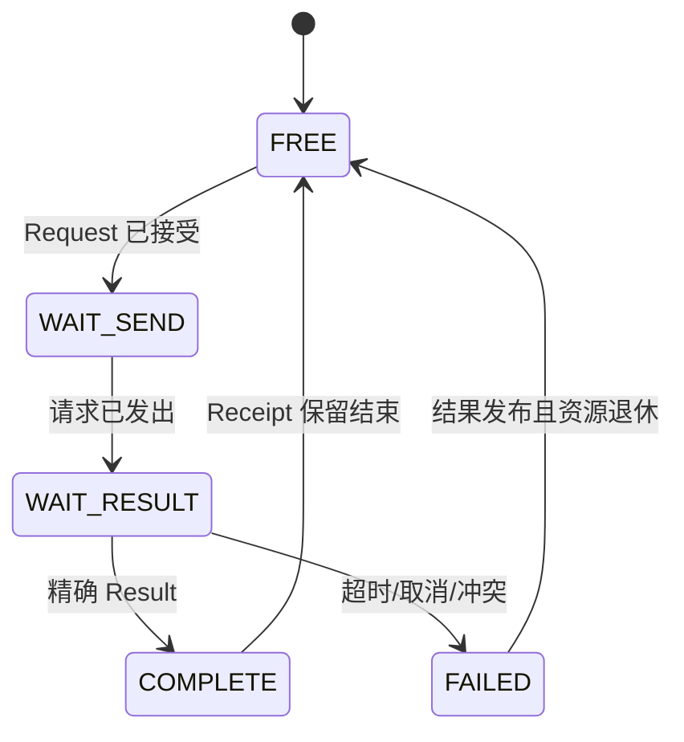
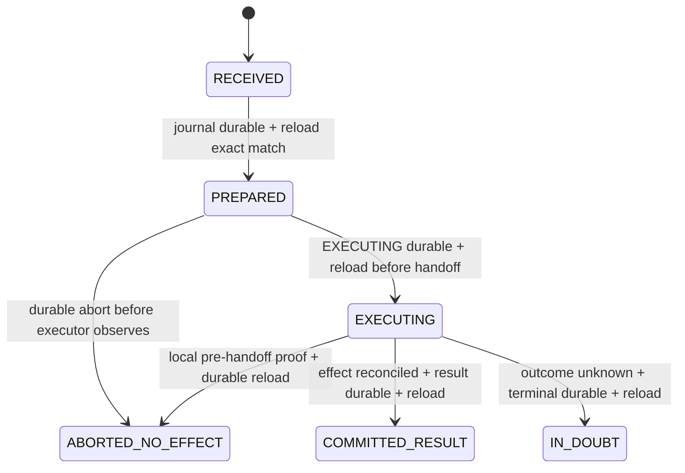

# 18 Service、请求响应与 QoS 简化设计

> 状态：`SELF-REVIEWED / EXTERNAL REVIEW REQUIRED`
>
> 目标：让应用只表达“发数据、发请求、需要什么完成结果”，协议自动选择队列与传输能力；Service、可靠性、持久执行和 QoS 不再混成一个大状态机。
>
> 权威关系：本文是实现者首读的简化模型；第 09 篇拥有完整 Operation/QoS 不变量，第 25 篇统一公共 API/SPI 命名候选。

## 1. 三个独立问题

```text
Service / Interaction：这条消息在业务上是什么？
Delivery：这条消息怎样交付？
QoS：多个待发送消息谁先使用链路？
```

必须允许这些合法组合：

- Best Effort One-Way；
- Reliable One-Way；
- Best Effort Request/Result；
- Reliable Request/Result；
- Latest 状态发布；
- Durable Operation，但仅在 Persistence 与执行器合同成立时。

## 2. 用户 API

普通用户主要使用三个入口：

```text
ucn_publish(target, service, payload, options)
ucn_request(target, service, payload, options)
ucn_respond(request_context, payload, result_code)
```

`options == NULL` 使用 Endpoint Policy。用户默认不指定 Q0～Q3、Wire Contract、Flow、分片或 Route。

```text
options.delivery
options.security
options.realtime
options.completion
options.performance
options.path
```

高级用户可以覆盖允许的选项，但不能越过产品/Endpoint 硬门禁。

## 3. 最小对象

```text
EndpointPolicy
    service_id
    allowed_interactions
    default_delivery
    minimum_security
    default_realtime
    qos_mapping
    max_payload
    acl_ref

ServiceRequestSlot             # 只有 request/result 关联才需要；不同于 Core 的受跟踪 Send Request
    state
    operation_id
    target_principal
    service_id
    expected_result_source
    deadline
    completion_latch

LatestIndex                    # 只有 Latest 开启时存在
    key
    queued_slot

QueueMeta                      # 内嵌在基础 TX Slot，不是第二个生命周期对象
    tx_slot_ref
    traffic_class
    enqueue_order
    optional_deadline
    flow_key
```

基础 TX Slot 是唯一物理消息所有者；`QueueMeta` 是它的内嵌调度字段。各 Class 的固定队列只保存
slot index/generation，不拥有也不复制 Payload。这样未跟踪最小发布仍只有一个生命周期对象。

## 4. Interaction 状态



One-Way 不分配 RequestSlot。Result 必须携带并匹配同一个 Operation ID，不能仅凭 Source+Service 猜属于哪个请求。

## 5. Publish 简化流程

```text
ucn_publish(target, service, payload, options):
    policy = lookup endpoint policy(service)
    intent = merge defaults with allowed options
    validate target, payload and hard policy

    plan = resolve route + delivery + security + realtime
    if strict untracked best-effort publish is eligible:
        reserve exactly one base TX slot
    else:
        reserve the tracked Request/Receipt and plan-specific resources
    copy/take payload according to selected ownership mode
    publish the TX slot's embedded QueueMeta into one scheduler index
    return optional send handle or immediate error
```

Resolver 只决定组合，不修改 Route/Security/Transport 内部状态。缺少依赖时返回 `NEED_*`，由 Runtime 调用对应模块并在完成后重新解析。

## 6. Request/Result

```text
ucn_request(target, service, payload, options):
    preflight RequestSlot, TX/Buffer and all plan-specific resources
    reserve them as one atomic acceptance bundle
    if any reservation fails:
        release the whole bundle and return without accepting
    operation_id = checked_next(operation allocator)
    freeze target principal, service, policy and deadline
    create outgoing message referencing operation_id
    enqueue through the same publish path using the reserved bundle
    return handle
```

```text
service_on_request(opened_message, now):
    validate interaction == REQUEST
    validate service policy, ACL and operation_id
    classify duplicate/conflict
    reserve response/dedup obligation before app callback
    call application once
```

```text
ucn_respond(context, result, code):
    require context is active and not already responded
    build RESULT with the same operation_id
    freeze original requester as destination
    enqueue using response policy
```

```text
service_on_result(opened_message, now):
    slot = lookup exact operation_id
    require source principal, target, service and security match
    publish immutable completion result once
```

## 7. Operation ID 与重复执行

Operation ID 用来关联 Request/Result/Error，并给执行语义提供唯一身份。

```text
REPEATABLE
    重复请求允许应用再次执行

VOLATILE_DEDUP
    本次启动内 exact duplicate 不重复执行

DURABLE_AT_MOST_ONCE
    只有 Persistence 和外部执行器恢复合同成立时允许
```

普通 Request 不写 Flash。只有显式选择 `DURABLE_AT_MOST_ONCE` 才进入第 22 篇的 Operation Journal。

## 8. Durable Operation 简化状态



```text
durable_operation_execute(operation):
    preflight and reserve journal, persistence continuation,
        reply receipt and bounded result storage
    publish immutable PREPARED persistence requirement to Runtime Coordinator
    wait for Coordinator-routed exact reload proof from Persistence Owner
    if current policy/authority rejects before executor observation:
        publish immutable ABORTED_NO_EFFECT persistence requirement to Coordinator
        wait for Coordinator-routed exact reload proof, then publish rejection
    publish immutable EXECUTING persistence requirement to Coordinator
    wait for Coordinator-routed exact reload proof
    only now hand exact Operation Key and reserved result buffer to executor
    reconcile executor outcome
    publish immutable COMMITTED_RESULT, ABORTED_NO_EFFECT or IN_DOUBT
        persistence requirement to Coordinator
    wait for Coordinator-routed exact terminal reload proof before sending Result
```

`IN_DOUBT` 是合法且必须暴露的结果。若外部副作用不能与 Journal 原子提交或查询对账，协议不能承诺重启后一定重放成功结果，也不能冒险再次执行。`ABORTED_NO_EFFECT` 只能表示执行器确定没有观察请求，不能用普通 `ABORTED` 混合“没执行”和“结果未知”。Provider 返回 `PENDING`、同步成功或 RAM 中的执行结果都不能代替 reload proof。

## 9. QoS 的简化目标

QoS 只决定“已通过全部门禁的 TX Slot/Attempt 谁先发”。它不能：

- 绕过 Security；
- 将 Best Effort 升级为 Reliable；
- 将普通数据冒充控制 Authority；
- 因 Deadline 小而跨越 Traffic Class；
- 复制一份新的业务 Payload 队列。

## 10. 自动 Traffic Class

建议保留四类内部队列，但普通用户不直接选择：

| 内部类 | 典型内容 | 说明 |
| --- | --- | --- |
| Q0 | 控制完成、租约、紧急安全控制 | 有严格配额，不能被业务伪造 |
| Q1 | 低延迟控制、ACK、实时小消息 | 低延迟但仍受流配额 |
| Q2 | 普通交互、遥测 | 默认业务类 |
| Q3 | 大数据、日志、Transfer Fragment | 吞吐优先 |

```text
traffic_class = endpoint_policy.qos_mapping(intent, message_kind)
```

用户显式选择只允许在 Endpoint 配置的范围内覆盖，不能把任意业务提升到 Q0。

## 11. 一个物理所有权链


Basic Scheduler 和 Advanced QoS Scheduler 二选一地索引同一 TX Slot；消息所有权始终留在 TX Slot/Attempt。不能出现 Basic Queue、QoS Queue、Adapter Queue 各复制一份 Payload。

## 12. 调度伪代码

```text
qos_enqueue(tx_slot, policy, now):
    derive traffic_class and flow_key
    enforce per-class and per-source quota
    if Latest:
        replace only an older unsent item with the same canonical key
    publish the slot's QueueMeta and one fixed slot reference
```

```text
qos_pick_next(now):
    preserve minimum progress for control completion and retire work

    for class from persistent rotating cursor:
        if class has configured credit:
            choose next eligible flow by round-robin
            within that flow, optionally choose earliest valid deadline
            consume one scheduler credit
            advance and persist the class cursor
            return item

    refill credits from compile-time schedule
    advance and persist the cursor even when the current class is empty
    return NONE
```

Class 权重和保留 credit 表达服务差异，但调度入口不能采用无限严格优先级。`StepBudgetPlan + per-class cap + persistent rotating cursor` 保证每个启用 Class、控制 completion 和 retire 工作在持续高优先级流量下仍有有限等待；空闲份额只能在保证份额之后借用。Deadline 只能在原 Class 和该 Source/Flow 配额内部排序。邻居提供的极小 Deadline 不能侵占其他 Class 的预留份额。

## 13. Latest

```text
latest_enqueue(key, new_item):
    old = lookup LatestIndex(key)
    if old exists and old has not entered Driver ownership:
        replace old payload obligation with new item atomically
        complete old request as SUPERSEDED
    else:
        enqueue new item normally
```

Key 至少绑定目标、Service、Endpoint 定义的业务子键和安全/权限域。不能让两个不同执行器命令因为 Service 相同而互相覆盖。

## 14. 背压与完成语义

同步 API 返回 `OK` 只表示本地已接受并冻结请求，不等于远端收到。用户可选择：

```text
LOCAL_ACCEPTED
LINK_SUBMITTED
REMOTE_INBOX_ACCEPTED # 需要 Reliable 的目标 Inbox receipt
REMOTE_REASSEMBLED    # 需要 Transfer 完整重组 receipt
APPLICATION_RESULT    # 需要 Request/Result
```

每一级只在真实证据产生后完成，不能把低一级成功冒充高一级成功。

## 15. Feature OFF

Service/RPC OFF：

- One-Way Data 仍可发送；
- Request/Result API 明确不可用；
- 无 RequestSlot、Operation allocator 或业务回调上下文。

Advanced QoS OFF：

- 使用固定小型 Basic Scheduler；
- 不声明 Q0～Q3 比例、公平、Latest 或 Deadline 调度保证；
- 不保留高级统计与 Flow quota。

Durable Operation OFF：

- 普通 Request/Result 正常；
- `DURABLE_AT_MOST_ONCE` 明确拒绝；
- 不会因为普通 RPC 而写 Flash。

## 16. 固定资源

```text
REQUEST_SLOTS
RESULT_RECEIPTS
LATEST_INDEX_SLOTS
QUEUE_SLOT_REFS_BY_CLASS       # 只存 slot/generation，不拥有 Payload
FLOW_QUOTA_SLOTS
DURABLE_OPERATION_SLOTS
```

每个深度必须与索引类型匹配并有编译期断言。深度为 0 的能力不进入对象布局。

## 17. 建议最小接口

```text
service_publish()
service_request()
service_respond()
service_on_message()
service_query()
service_cancel()

qos_enqueue()
qos_pick_next()
qos_complete()
qos_step()
```

应用层不直接操作 QueueMeta、队列 slot reference 或 Operation Journal。

## 18. 最低验收条件

1. Delivery 与 Interaction 可以独立组合；
2. One-Way 不占 RequestSlot；
3. 普通 Request 不写 Flash；
4. Result 精确绑定 Operation ID 与原始 Source；
5. Q0 不能由普通用户伪造；
6. Latest 只替换同 Key 且尚未提交给 Driver 的旧项；
7. 多个 Q1/同类 Flow 均有有限等待；
8. QoS OFF 后最小通信仍可用且不保留高级状态；
9. QueueMeta 内嵌在 TX Slot，队列只保存引用且不复制 Payload；
10. `IN_DOUBT` 不被伪装成成功或可安全重试。

## 19. 最终效果

```text
用户：发一条普通传感器状态
协议：按 Endpoint 默认映射为 One-Way + Latest/Q2

用户：发送命令并等待执行结果
协议：自动创建 Operation ID，按策略选择 Reliable Request/Result

用户：上传日志
协议：自动放入 Q3，并使用 Transfer；不会饿死 Q0/Q1
```

用户表达业务目标，Service 和 QoS 在内部自动组合，但每个安全和交付承诺仍有明确证据。
