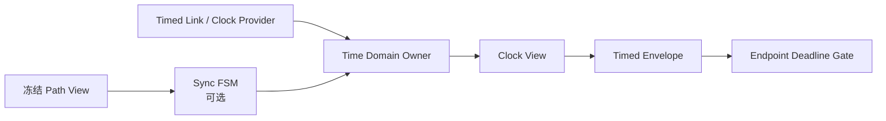
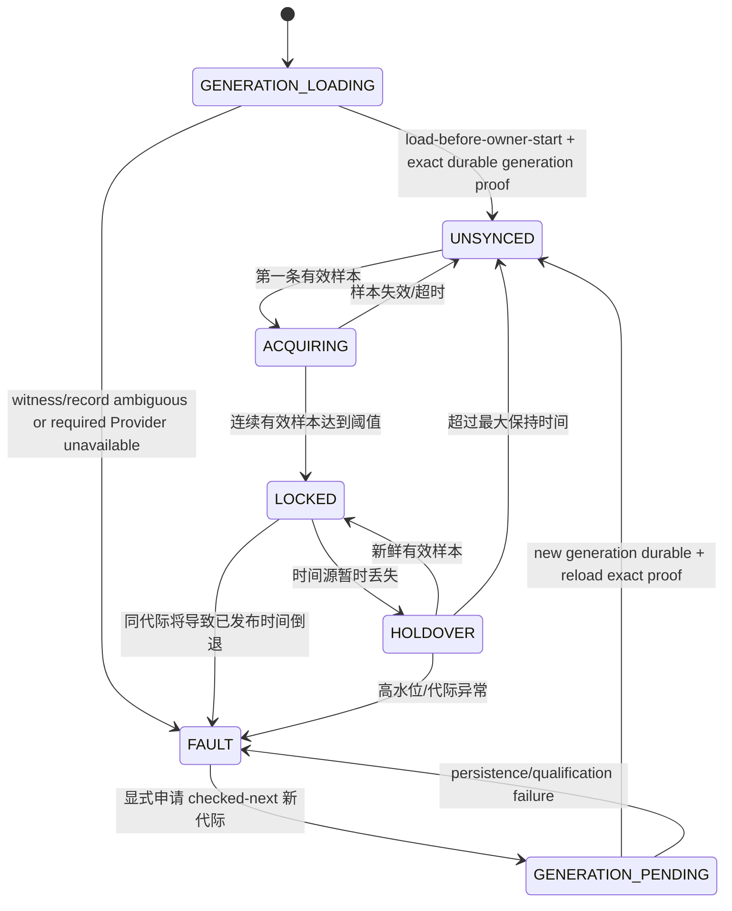

# 19 实时通信与时间同步简化设计

> 状态：`SELF-REVIEWED / EXTERNAL REVIEW REQUIRED`
>
> 目标：普通消息保持零实时元数据；只有明确需要采样时刻、跨节点时间或 Deadline 的 Endpoint 才启用相应能力。
>
> 权威关系：本文是实现者首读的简化模型；第 10 篇拥有完整时间/误差/事件所有权合同，低开销 Wire 文档拥有 Timed Envelope 字节。

## 1. “实时”必须拆成三种能力

| 能力 | 解决什么 | 是否上 Wire |
| --- | --- | --- |
| Local Stamp | 记录本机采样、RX、TX 时刻 | 不一定 |
| Network Time Sync | 让不同节点获得同一 Domain Time 与 uncertainty | 需要同步控制事务 |
| Timed Envelope | 携带采样时刻、有效期或执行时间 | 仅需要的业务消息携带 |

本机超时、Route 租期、重传定时始终使用本地单调时钟，不依赖 Network Time Sync。

## 2. 用户看到什么

```text
NONE            不携带实时元数据
LOCAL_STAMP     只记录发送端本地时间，供本机诊断
SYNCED_STAMP    携带可验证的 Domain capture time
DEADLINE        携带 capture time，并要求在有效期内处理
AUTO            继承 Endpoint Policy
```

普通用户不配置 T1～T4、Clock Offset、Oscillator PPB 或 uncertainty class。

## 3. 模块边界



Realtime 拥有：

- Domain generation；
- Offset/rate/filter 与保守 uncertainty；
- 同步事务；
- 本节点持有的时间戳 event key；
- Timed Envelope 的构建与验证。

Realtime 不拥有 Route、Security Session、QoS Queue、Cluster lease 或 Driver 普通 token。

## 4. Time Domain 状态机



`LOCKED` 是整个 Domain 的状态，不按 Endpoint 分裂。没有可信 path asymmetry 上界的样本只能进入诊断统计，不能推动 Domain 进入 `LOCKED`。

## 5. 最少对象

```text
TimeDomain
    phase
    generation
    generation_high_water
    durability_ref
    offset_us
    rate_ppb
    uncertainty_us
    last_valid_sample_local_us
    last_published_domain_us
    acquisition_window[fixed]

SyncPending
    wire_transaction_key
    frozen_path_handle
    t1_key / t4_key        # Master 本地拥有
    t2_key / t3_key        # Member 本地拥有
    absolute_deadline

TimedRxItem
    complete_frame
    event_key
    captured_timestamp
```

每个节点只取消自己拥有的 event key；对端通过事务超时、Session/Path generation 变化或 Abort 收敛。

## 6. 本地时间戳

```text
local_stamp_capture(source):
    timestamp = monotonic_clock_read()
    uncertainty = configured local capture bound
    return {timestamp, uncertainty, source_generation}
```

如果硬件/驱动不能给出可信 capture bound，返回 `UNKNOWN`；不能用 0 表示“完全精确”。

Local Stamp 可以在 Network Time Sync OFF 时工作，但它只能在本节点时钟域内解释。
Local Stamp 不创建 Network Time Domain Generation，因此不依赖 Persistence。下文 `GENERATION_LOADING/GENERATION_PENDING` 只属于会发布跨节点 Domain Time 的 Network Time Domain。

### 6.1 Network Time Domain 代际

```text
time_domain_start(owner, domain_identity, now):
    require load-before-owner-start completed for TIME_DOMAIN durable domain
    require recovered generation/high-water/witness are unambiguous
    publish UNSYNCED with exact durability_ref; do not publish DOMAIN_TIME_VALID

time_domain_rotate_generation(owner, reason, now):
    fence old Domain immediately
    candidate = checked_next(recovered generation_high_water)
    freeze complete {domain identity, authority identity, candidate, reason, policy digest}
    publish immutable TIME_DOMAIN persistence requirement to Runtime Coordinator
    Coordinator routes it to Persistence Owner; do not call Persistence directly
    remain GENERATION_PENDING and reject Network Time publication

time_domain_on_durable_proof(owner, proof, now):
    require proof exact-matches TIME_DOMAIN domain, candidate and record fingerprint
    require committed Record + witness were reloaded and current Authority/Policy remain valid
    atomically install new generation, empty acquisition/filter state and durability_ref
    publish UNSYNCED; require fresh lock_sample_count before LOCKED
```

Provider 同步成功、RAM 中 `generation++` 或旧 ClockView 都不能代替 reload proof。重启、Time Authority 更换、Domain Identity 更换和明确防回退恢复均只能从持久化高水位 checked-next；Witness/Record 不可判定时只 Fence Network Time Domain，不影响 Local Stamp。

## 7. 四时间戳同步

```text
Master                                Member
  T1 -- SYNC(seq,path) ---------------->
                         capture T2
                         capture T3
      <------------- DELAY_REQ(seq,path)
  capture T4
  -- DELAY_RESP(T1,T4,seq,path) ------->
                         combine T1..T4
                         admit sample
```

Wire 上使用 `{session, domain_generation, sync_sequence, frozen_path}` 形成事务键。本地 T1～T4 event key 不上 Wire，也不能在节点之间互相比较。

## 8. Sync 启动

```text
sync_begin(peer, path, now):
    require path is installed, directional and frozen for transaction
    require security/session policy permits time control
    require credible path delay/asymmetry bounds
    reserve one SyncPending and required local event tokens
    if any reservation fails:
        release all and return NO_SPACE

    allocate non-wrapping sync sequence
    submit SYNC through Timed Link
    publish pending only with exact ownership obligations
```

普通动态 Route 若不能在事务期间冻结，不能启动 Network Time Sync；PREFERRED 请求只能回退到 LOCAL/NONE，而不是用不可信样本推动 LOCKED。

## 9. 样本计算

概念公式：

```text
offset_candidate = ((T2 - T1) - (T4 - T3)) / 2
rounding_bound    = integer division conservative error

sample_uncertainty = checked_sum(
    master_capture_bound,
    member_capture_bound,
    link_timestamp_bound,
    timer_resolution_bound,
    filter_residual_bound,
    path_asymmetry_bound,
    rounding_bound)
```

任一分量未知、为非法零值、加法溢出或超过策略上限，样本只能用于诊断，不能进入有效滤波窗口。

## 10. 样本准入

```text
time_domain_ingest(sample, now):
    validate domain/session/path generations
    validate sequence, freshness and uncertainty_known
    compute conservative candidate clock

    if same generation has published time and candidate would regress:
        enter FAULT immediately
        return STATE

    append sample to fixed acquisition window
    update conservative filter
    if consecutive valid samples >= lock threshold:
        publish LOCKED and ClockView atomically
```

进入 `UNSYNCED` 时清除 acquisition/filter 历史，但同一 generation 的最后发布时间高水位不能清除。只有显式创建更高 Domain Generation 才能按新代际重新建立时间轴。

## 11. Clock View

```text
ClockView
    phase
    domain_generation
    domain_now_us
    uncertainty_us
    source_mode
    holdover_age_us
```

```text
time_get_view(local_now):
    require phase == LOCKED
    # REQUIRED 默认拒绝远端 HOLDOVER；本地策略可显式允许有限诊断
    compute domain_now with checked arithmetic
    enforce domain_now >= last_published_domain_us
    update high-water only with successful publication
    return view
```

## 12. Timed Envelope

普通消息不携带 Envelope。需要时才增加：

```text
TimedEnvelope
    domain_generation
    capture_time_us
    source_uncertainty_class
    flags
    optional_max_age_or_execute_time
```

Envelope 只编码发送端上界 `S`。接收端计算：

```text
U = checked_add(sender_uncertainty, receiver_uncertainty)
accept uncertainty iff U <= endpoint.max_uncertainty_us
```

不能把组合后的 `U` 在发送端编码后，又在接收端重复加本地 uncertainty。

## 13. Deadline 双门禁

接收端执行两次检查：

```text
realtime_prequeue_gate(envelope, receive_view, policy):
    verify security and ACL already passed
    reject future capture outside allowed skew
    age_upper = conservative upper age using U
    require age_upper < effective_max_age
    return admitted metadata
```

```text
realtime_preexecute_gate(admitted, current_view, policy):
    recompute age_upper using current time and uncertainty
    require same domain generation and valid clock view
    require age_upper < effective_max_age
    only then call application or actuator
```

半开区间固定为 `<`；恰好等于 Deadline 即过期。

## 14. 中继怎样处理 Deadline

最简单版本中，中继不解密 E2E Payload，也不读取 Timed Envelope。Deadline 只在 Source 和最终 Destination 生效。

若未来增加逐跳可见 Scheduling Budget，必须满足：

- 有 Hop Authentication；
- 只能减少，不能延长；
- 只在原 Traffic Class 和 per-source/per-flow 配额内排序；
- 不能提升到 Q0 或侵占其他 Class；
- `remaining_budget <= 0`、超出初始预算或更新不满足“只能减少”时唯一结果为 `DROP_EXPIRED`；不得降级为普通调度、不得继续传播，也不得由产品策略改写。

该扩展不是首版 Realtime 必需能力。

## 15. HOLDOVER

本机进入 HOLDOVER 时，uncertainty 必须随 oscillator bound 和 elapsed time 单调增大。

远端发送者只给一个 `SOURCE_HOLDOVER` 标志、却没有可认证 age 证明时：

- REQUIRED 固定拒绝；
- PREFERRED 只能在产品显式信任发送端自检、E2E 和 ACL 同时成立时使用；
- 默认不能把远端自报 HOLDOVER 当作可信时长。

## 16. Event token 释放

```text
sync_release_step(pending):
    key = peek next local release obligation
    result = timed_link_retire(key)
    if result == OK:
        ack/pop obligation
    else:
        keep key for bounded retry
```

禁止 destructive pop 后才尝试 Driver retire，否则一次失败就会永久泄漏 token。

## 17. Feature OFF

Local Stamp OFF：不提供采样时间戳能力。

Network Time Sync OFF：

- 本地单调 timer、Route lease、重传正常；
- 无 SyncPending、滤波窗口或同步控制流量；
- `SYNCED_STAMP/DEADLINE` 若无外部可信 Time Provider 则明确失败。

Persistence OFF：

- Local Stamp 仍可用；
- Network Time Domain/Sync 在 Composition 或首次建立前明确拒绝，不能用易失 generation 冒充；
- 产品直接提供的外部可信 Time Provider 若拥有独立、已审计的 anti-rollback generation，可作为 Persistence Foundation 的 Provider 接入，不能绕开统一 Owner。

Timed Envelope OFF：

- 普通消息字节完全不变；
- Endpoint 要求 Deadline 时发送前失败；
- 接收路径不保留实时元数据。

## 18. 固定资源

```text
TIME_DOMAIN_COUNT
SYNC_PENDING_SLOTS
TIMESTAMP_EVENT_SLOTS
ACQUISITION_WINDOW_SIZE
TIMED_RX_QUEUE_DEPTH
```

所有表固定容量。Realtime 槽满不能阻止不需要时间语义的普通消息。

## 19. 建议最小接口

```text
time_local_capture()
time_sync_begin()
time_sync_on_message()
time_domain_ingest()
time_get_view()
time_build_envelope()
time_check_prequeue()
time_check_preexecute()
time_step()
```

应用不接触 T1～T4 token；只读取 Clock View 或选择 Realtime Requirement。

## 20. 最低验收条件

1. Realtime OFF 时普通帧零额外字节；
2. Local Stamp 不依赖 Network Sync；
3. 未知 uncertainty 分量不能进入有效滤波；
4. 无 asymmetry 证明不能推动 LOCKED；
5. 同代际不能发布时间倒退；
6. Deadline 在入队和业务副作用前各检查一次；
7. `now == deadline` 拒绝；
8. Link/Session/Path generation 变化使 pending 失效；
9. 每个本地 event token 最终退休且可重试；
10. Cluster 和普通本地超时不依赖 Time Domain。

## 21. 最终效果

```text
普通遥测
    → 无实时字段、无同步状态

需要知道采样时刻
    → Endpoint 自动加入 SYNCED_STAMP

必须在 5 ms 内执行的命令
    → 自动加入 Deadline Envelope，并在接收与执行前双检查
```

Realtime 成为按 Endpoint 启用的精确能力，而不是所有节点、所有帧都必须支付的固定成本。
