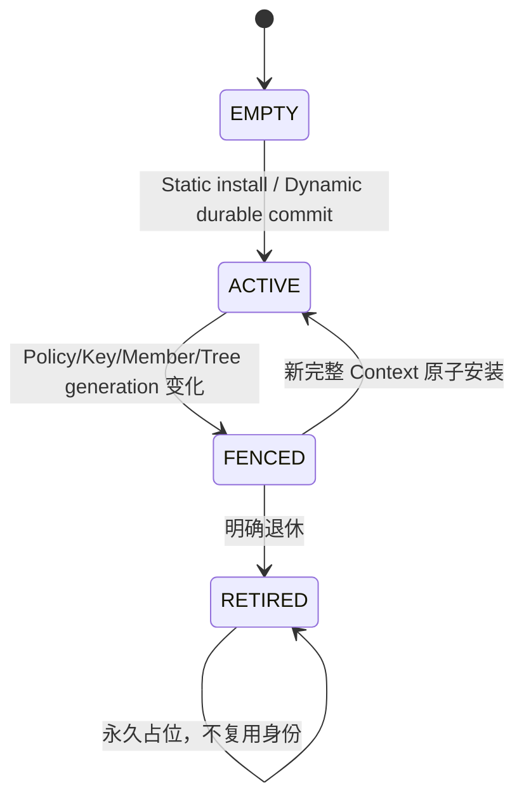
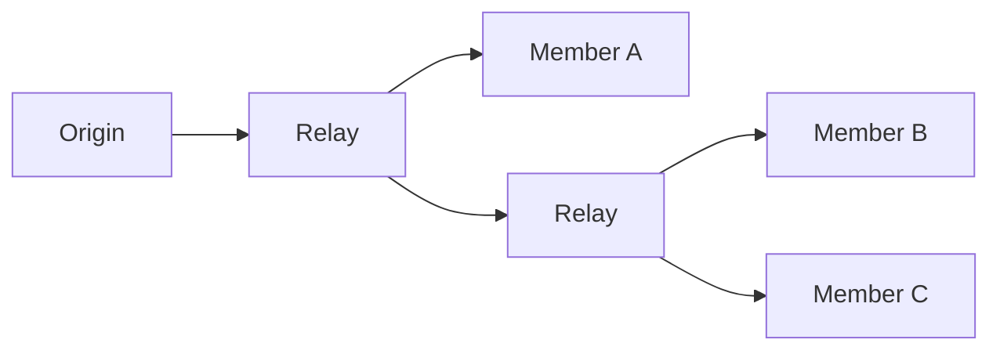

# 20 Group 群组通信简化设计

> 状态：`SELF-REVIEWED / EXTERNAL REVIEW REQUIRED`
>
> 目标：用独立可选模块实现“一次发送给多个目标”，同时保持 Group 不依赖 Cluster、普通单播不承担 Group 字段和成员表成本。
>
> 权威关系：本文是 Group 实现者首读模型；第 11 篇拥有 Group/Cluster 交界不变量，低开销 Wire 文档拥有 Group/Tree 字节。

## 1. Group 与广播、Cluster 的区别

```text
Broadcast    发给某个受限物理/Realm 范围，通常不知道精确成员
Group        发给一个已定义、有限成员集合
Cluster      管理成员配置、选举和 Authority
```

Group 可以完全由产品静态 Manifest 定义，不需要 Cluster。Cluster 可以使用 Group 加速非授权通知，但 Cluster Authority、Vote、Commit 默认仍走可验证的单源控制路径。

## 2. 用户看到什么

```text
group = ucn_group_open("sensor-status")
ucn_publish_group(group, service, payload, options)
```

用户不直接传裸 Group ID、Tree Label、Key ID 或成员 bitmap。Opaque group handle 已绑定 Runtime、Policy Generation 和成员快照来源。

普通用户只关心完成范围：

```text
LOCAL_ONLY
ANY_MEMBER
ALL_MEMBERS
QUORUM
SUBSET
```

该范围必须由 Group Policy 允许，不能逐次任意提升。

完成范围不是“已经展开了多少个发送副本”，而是对冻结成员快照取得了什么证据：

| success scope | 最低可声明证据 |
| --- | --- |
| `LOCAL_ONLY` | 本地已原子接受完整 GroupSend 和 fanout/Tree 计划；不声称任何远端到达 |
| `ANY_MEMBER` | 至少一个冻结成员返回认证、去重、绑定同一 Send ID 的终态 receipt |
| `ALL_MEMBERS` | 冻结快照中的每个成员均返回上述 receipt |
| `QUORUM` | 按冻结 quorum 算法和同一成员快照验证足量 receipt |
| `SUBSET` | Manifest/Request 冻结的明确成员子集全部返回 receipt |

因此 Best-Effort Group 只能完成 `LOCAL_ONLY`；它不能用“已经向多个出口 submit”冒充 ANY、ALL、
QUORUM 或 SUBSET。非本地范围至少要求支持逐成员身份、Reliable delivery receipt 和固定容量
结果记录；缺任一能力时 Resolver 必须在首个发送副作用前拒绝，不能静默降为 `LOCAL_ONLY`。
`ucn_publish_group()` 是 One-Way，只能收集交付 receipt；业务 `APPLICATION_RESULT` 必须使用
独立 `ucn_request_group()` 和同一 Operation ID。

## 3. 两种 Group

| 类型 | 来源 | 运行期是否变化 | 最小依赖 |
| --- | --- | --- | --- |
| Static Group | 产品只读 Manifest | 不变化；退休需产品升级 | Group Core，可选 Security |
| Dynamic Group | Realm Address Authority | 可创建、更新、退休 | Identity + Security + Persistence + 合法 Authority |

两种 Owner 模式由 Realm Manifest 互斥选择，不能同时给同一个 Group Scope 分配 ID。

## 4. 最少对象

```text
GroupContext
    state
    group_id
    group_generation
    policy_generation
    member_snapshot_ref
    delivery_policy
    security_handle
    tree_handle_optional
    sender_mapping

GroupSendSlot
    state
    group_handle
    send_id
    frozen_member_snapshot
    success_scope
    result_bitmap_or_summary
    deadline

TreeContext                 # 只有 Tree 发送方式启用时存在
    generation
    ingress_rule
    fixed_egress_bitmap
    local_labels
```

成员表、Group Key 和密码 Replay Window 不能在 GroupContext 中复制。Group 只保存对应 Owner 的代际 Handle。

## 5. Group Context 状态



`RETIRED` 的静态槽或动态 ID 不能因为删除后看似空闲就复用，避免旧 Group 帧形成 ABA。

## 6. Group ID 与 Generation

简化的有界规则：

- Static Group 使用 Manifest 固定槽；退休后槽永久保留；
- Dynamic Group ID 从持久化单调高水位分配；删除不回退、不扫描历史空洞；
- 普通换钥保持 Group Key ID/slot 不变，只推进 Key Generation；
- Generation 到顶或高水位损坏时进入局部 Fault，不回绕。

因此不需要保存无限增长的“所有历史 ID 集合”。

## 7. 创建 Static Group

```text
group_install_static(manifest_entry):
    validate manifest anti-rollback and layout hash
    validate fixed group slot, members, policy and capacities
    resolve optional static security context
    atomically publish ACTIVE GroupContext
```

Static Group 不调用运行期 Persistence，也没有 Group Authority 选举。

未启用 Group Security 的 Static Group 只允许产品 Manifest 明确标为公开、无 Authority、且部署信任边界成立的业务；要求精确来源、认证或加密时必须建立对应 Security Context，不能因“静态配置”自动放行明文。

## 8. 创建 Dynamic Group

```text
group_prepare_dynamic(request, authority_proof, now):
    verify current Realm Address Authority, lease, quorum and ACL
    reserve GroupContext slot and persistence transaction
    group_id = checked_next(persisted_group_high_water)
    build canonical next context and member snapshot reference
    publish immutable PREPARED persistence requirement to Runtime Coordinator
    wait for Coordinator-routed exact reload proof before sending promise
```

```text
group_commit_dynamic(transaction, now):
    revalidate authority, lease, security and exact prepared digest
    publish immutable atomic COMMITTED-context/high-water requirement to Coordinator
    wait for Coordinator-routed exact reload proof from Persistence Owner
    publish ACTIVE runtime context
```

Cluster Head 不能自报成为第二个 Group Authority；只能向 Manifest 指定的 Realm Authority 提出请求。

## 9. 发送方式自动选择

```text
group_resolve_send(group, intent, resources):
    if active compatible Tree exists:
        return TREE_SEND

    if member_count <= configured_unicast_fanout_limit
       and policy permits bounded fallback:
        return BOUNDED_UNICAST_FANOUT

    return NEED_GROUP_SETUP or NO_CAPABILITY
```

不能把一个万级 Group 默默展开成万条高优先级单播。

Bounded unicast fallback 必须为全部成员保留同一个 Group Send/Operation ID；每条单播只拥有自己的 Attempt/ACK，成员侧按 Group Send/Operation ID 去重，不能把一次 Group 发布变成多次独立业务操作。

## 10. 冻结成员快照

```text
group_send_begin(group, payload, success_scope, now):
    validate group handle and current context generations
    validate requested success scope is allowed
    if success_scope != LOCAL_ONLY:
        require reliable authenticated per-member terminal receipts
        require bounded result capacity for the frozen member snapshot/rule
    reserve GroupSendSlot and bounded result storage
    freeze exact member snapshot for this send
    allocate one send/operation id
    select Tree or bounded unicast plan
    publish SENDING
```

发送开始后的新成员不加入本次成功集合；离开成员如何计算由冻结 policy 决定，不能运行中临时改变 denominator。

## 11. Tree 发送



```text
group_tree_forward(frame, ingress, context):
    verify current Group/Tree/Key generations and hop protection
    verify sender mapping and group opcode policy
    lookup fixed egress bitmap
    reserve all required local egress obligations before the first submit
    if any local egress reservation is unavailable:
        emit no copy and return bounded backpressure
    clone only frame references/obligations, not unbounded business state
    apply each egress hop protection and submit
```

中继不能修改 Origin Principal、Group Generation、Send ID 或业务 Payload。

## 12. 安全与 Sender 身份

共享 Group Key 通常只能证明“来自某个有权持有该 Key 的成员”，不能证明唯一设备。

若 Endpoint ACL 要求精确 Principal，必须使用：

- Sender Slot 对应的独立派生验证子键；或
- Payload 内独立签名；或
- 等价的 `EXACT_PRINCIPAL` 证明。

Group Security 的密码 Replay Window 由 Security Owner 唯一拥有。Group 模块如需业务级重复抑制，可另有独立、明确命名的交付记录，不能复制密码 Replay 状态。

## 13. 成员结果

```text
group_on_member_result(result, now):
    slot = lookup exact group send/operation id
    require member belongs to frozen snapshot
    require source identity and security proof match member slot
    if exact duplicate:
        ignore or resend stable receipt
    else:
        set bounded result bit/status

    if frozen success scope satisfied:
        complete request once
```

成员数量超过详细结果表时，只返回有界聚合计数和 `TRUNCATED` 标志，不能动态增长数组。

## 14. Context 失效

```text
on_group_dependency_change(event):
    fence affected GroupContext before new send/forward
    allow already-submitted Driver obligations to retire
    fail or replan pending GroupSendSlot according to frozen policy
    install new context only after all required Owners agree on generations
```

Key、成员、Tree、Authority 或 Policy 任一代际变化都不能只改一个字段继续使用旧 Context。

## 15. Feature OFF

Group OFF 时：

- 普通单播、自动路由、可靠、实时均不受影响；
- 不安装 Group/Tree/Member result 状态；
- 不发送 Group HELLO；
- `publish_group()` 明确返回 `UCN_ERR_UNSUPPORTED`；
- 不在普通数据帧中保留 Group 字段。

Tree OFF 时：

- 小型 Group 可按显式上限走 bounded unicast；
- 超限 Group 明确需要 Setup/Capability，不能无界展开。

## 16. 固定资源

```text
GROUP_CONTEXT_SLOTS
STATIC_GROUP_SLOTS
DYNAMIC_GROUP_SLOTS
GROUP_MEMBER_SNAPSHOT_BYTES
GROUP_SEND_SLOTS
GROUP_RESULT_RECORDS
TREE_CONTEXT_SLOTS
MAX_GROUP_EGRESS_PER_RELAY
```

满载时不驱逐仍有效的 Context，不复用 RETIRED ID，不阻断不使用 Group 的单播消息。

## 17. 建议最小接口

```text
group_open()
group_send_begin()
group_on_frame()
group_on_result()
group_get_result()
group_revoke()
group_step()
```

动态管理接口与普通发送接口分开：

```text
group_admin_prepare()
group_admin_commit()
group_admin_retire()
```

## 18. 最低验收条件

1. Static Group 不依赖 Cluster 或运行期 Persistence；
2. Dynamic Group 无当前 Authority proof 时零写拒绝；
3. 删除 Group 不复用历史 ID；
4. 发送开始时成员快照冻结；
5. 超大 Group 不自动展开为无限单播；
6. 精确 Principal ACL 不接受共享 Group Key 冒充；
7. Tree/Key/Policy generation 变化立即 Fence；
8. Group OFF 时普通帧、普通对象和符号不增加；
9. Cluster 控制不能因使用 Group 而跳过自身证书验证。

## 19. 最终效果

```text
固定的 4 个传感器状态组
    → Static Group，零动态管理成本

运行期维护的设备组
    → Dynamic Group，只有变更时写持久化状态

大规模高频发布
    → 建立 Tree，数据帧只引用短 Context

Group 未启用
    → 普通单播完全不受影响
```

Group 因而是一项真正独立的“一对多”能力，不是 Cluster 的附属品，也不成为最小通信的固定负担。
