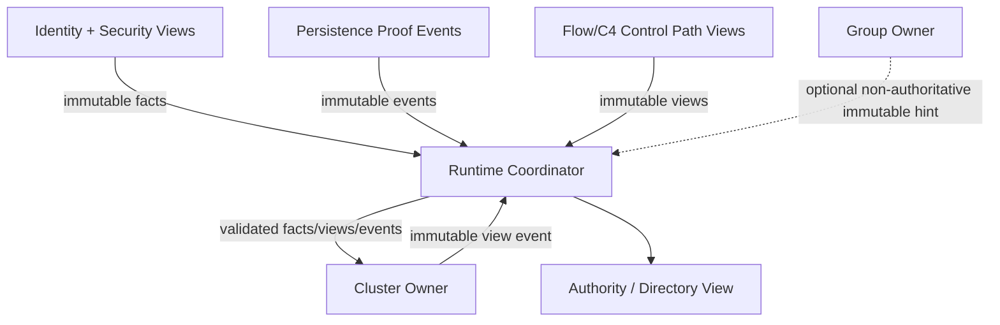
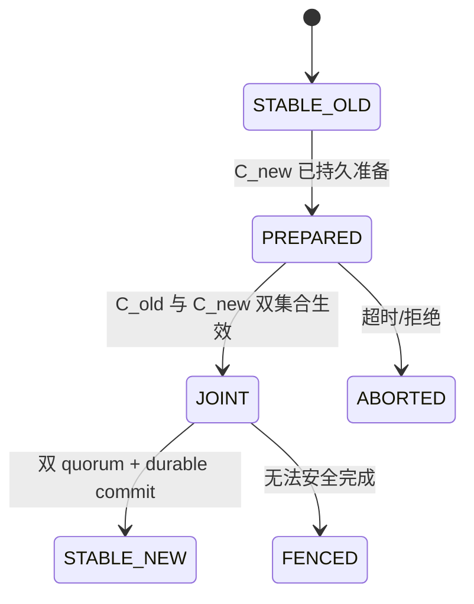

# 21 Cluster 簇管理简化设计

> 状态：`SELF-REVIEWED / EXTERNAL REVIEW REQUIRED`
>
> 目标：把 Cluster 收缩为独立的管理面：维护一个有限成员配置、一个当前 Head Authority 和安全的换届/恢复；普通通信、自动路由和 Group 均不依赖 Cluster。
>
> 权威关系：本文是 Cluster 实现者首读模型；第 11 篇拥有完整配置/权威/切换不变量，低开销 Wire 文档拥有 Cluster/Certificate 字节。Cluster Authority 控制只消费第 24 篇已激活 Flow，不消费基础软路由。

## 1. Cluster 到底解决什么

Cluster 适合解决：

- 大规模网络的管理域划分；
- 一个簇内有限成员配置；
- 当前 Head/Backup 身份；
- 配置变更和双 quorum；
- Head 故障后的接管与恢复；
- 跨簇 Directory/摘要交换。

Cluster 不解决：

- 普通帧怎样编码；
- 下一跳怎样转发；
- 单播可靠重传；
- Group 群发；
- 本地 timer；
- 所有业务权限。

即使 Cluster 失效，允许独立运行的普通 Endpoint 仍应按自己的 Route 和 Security Policy 通信。

## 2. 最小依赖



这些箭头表示不可变 facts/views/events 经 Runtime Coordinator 路由，不表示 Cluster Owner 直接调用 Identity、Security、Persistence、Flow 或 Group Owner。**非依赖关系不画连接边**：Cluster Base 不依赖 Realtime 或 Group。租约使用本地单调时间。Group 只能加速广播，不替代 Vote/Commit 的单源认证和证书验证。

## 3. 最少角色

```text
OBSERVER    能观察簇，但不计入法定人数
MEMBER      属于当前成员集，但不一定有投票权
VOTER       属于当前 committed voter set，计入法定人数
BACKUP      已由当前 Config 确认的 Voter/接管候选
HEAD        当前 Epoch 中唯一允许发布 Authority 的节点
FENCED      已撤权，只能观察或进入 Recovery
```

角色只是运行视图。真正权威来自：

```text
current committed ClusterEpoch
+ current committed Config
+ current live quorum
+ unexpired local authority lease
+ no fence
```

## 4. 核心对象

```text
ClusterEpoch
    cluster_id
    term
    head_principal

ClusterConfig
    config_id
    generation
    voter_set
    member_set
    backup_principal_optional

ClusterRuntime
    role
    committed_epoch
    committed_config
    member_leases[fixed]
    authority_active
    authority_fence

TransitionTxn
    kind
    phase
    transaction_id
    old_epoch / target_epoch
    old_config / target_config
    voter_evidence[fixed]
    absolute_deadline
```

不再为 Takeover、Recovery、Handover 各复制一套 Epoch/Config。它们共享一个 TransitionTxn 结构和不同的合法转换规则。

## 5. Authority Gate

任何 Head 控制发送或权威副作用前都调用同一个门：

```text
cluster_authority_preflight(now, action):
    refresh current member leases using now
    recompute Stable or Joint quorum from live voters

    if role != HEAD:
        return ACCESS
    if authority_fence is set:
        return STATE
    if lease expired or quorum not met:
        clear authority_active immediately
        return LEASE_OR_QUORUM
    if action not allowed by committed config/policy:
        return ACCESS

    authority_active = true
    return AuthorityView bound to epoch/config generations
```

不能只在周期 `step()` 更新一个缓存，然后 RX、Federation 或公开发布入口使用过期的 `authority_active`。

## 6. 成员与租约

```text
cluster_on_member_proof(proof, now):
    verify current epoch/config, identity, capability and security
    locate exact committed member slot
    update that member's local lease deadline
    recompute authority before any dependent action
```

成员失效或重新准入时，旧 session/capability/binding 下的 Vote 证据必须清除。仅保存 voter bitmap 不足以阻止历史票复活。

```text
VoteEvidence
    voter_principal
    voter_binding_generation
    voter_session_generation
    required_capability_generation
    vote_id
    canonical_digest
```

## 7. 配置变更：Stable → Joint → Stable



```text
cluster_config_prepare(c_new, txid, now):
    require current Head Authority
    validate exact checked-next config identity
    reserve TransitionTxn and persistence operation
    build complete PREPARED record binding txid + C_old + C_new + epoch + proposer
    publish immutable PREPARED persistence requirement to Runtime Coordinator
    wait for Coordinator-routed exact reload proof from Persistence Owner
    revalidate current Authority/Policy after proof
    only then send Prepare
```

```text
cluster_config_enter_joint(tx, proof, now):
    revalidate current authority and exact tx digest
    require current old-config authority and exact prepared target evidence
    build complete JOINT record binding the durable PREPARED and both voter sets
    publish immutable JOINT persistence requirement to Runtime Coordinator
    wait for Coordinator-routed exact reload proof from Persistence Owner
    revalidate current authority and both Config identities after proof
    atomically install Joint runtime config
    from this publication onward, every authority/commit edge requires
        both old and new quorum
```

```text
cluster_config_commit(tx, proof, now):
    require runtime is exact durable JOINT
    require current old and new quorum
    require bound Backup gate if policy requires it
    publish immutable new-STABLE/terminal-journal persistence requirement to Coordinator
    wait for Coordinator-routed exact reload proof and verify every bound field
    atomically install new runtime config
```

不能从 `PREPARED` 直接跳到新 Stable Config。

## 8. Backup 同步

Backup 必须拥有当前受保护 voter/member 的完整、规范化镜像后才能 Ready。

```text
backup_sync_begin(snapshot_header):
    validate epoch, config, generation, count and digest
    write into inactive fixed buffer

backup_sync_member(index, member):
    require exact sequence and canonical order
    write one slot in inactive buffer

backup_sync_end(end_marker):
    verify full count, digest and every protected voter present
    atomically swap active/inactive buffer
    publish BACKUP_READY
```

只有显式 `SUSPECT` 可进入有限 grace。受保护 voter 缺条目或 `REMOVED` 必须使本次 assignment 永久 takeover-ineligible，直到新 assignment。

## 9. 接管与 Recovery

统一转换流程：

```text
PROPOSED
→ COLLECTING_VOTES
→ QUORUM
→ EPOCH_DURABLE
→ ACTIVE
```

```text
cluster_transition_vote(tx, vote, now):
    validate tx and current source epoch/config
    validate voter is live now and required capability is current
    validate voter has not cast conflicting vote in this epoch
    build and freeze complete vote evidence (VoteEvidence) before Provider I/O
    publish immutable complete-VoteEvidence persistence requirement to Coordinator
    wait for Coordinator-routed exact reload proof from Persistence Owner
    revalidate voter/session/capability/epoch after durability proof
    only then send TAKEOVER_ACK
```

```text
cluster_transition_commit(tx, certificate, now):
    require phase == QUORUM
    revalidate every VoteEvidence against current live member state
    recompute Stable/Joint quorum
    require target Head/Backup is exactly the certified identity
    publish immutable target-Epoch/certificate/vote-journal requirement to Coordinator
    wait for Coordinator-routed exact reload proof and verify every bound field
    enter EPOCH_DURABLE terminal phase
```

`EPOCH_DURABLE` 是单向终态；迟到票、unreachable 或普通 step 不能把它退回 QUORUM/ABORTED。
任何本地 `persist` 简写、同步 Provider 返回或 RAM 中的 bitmap 都不是 promise 证明；只有 Persistence Owner 生成并由 Coordinator 路由给原请求 Owner、且调用者按当前时间重新验证资格的 exact reload proof，才能允许 ACK、Runtime Joint 安装、Epoch Authority 或其他 Cluster 控制帧。Cluster Owner 不持有或直接调用 Persistence Owner。

## 10. Planned Handover

同簇计划切换与跨簇 Merge 都使用完整双 Epoch 绑定：

```text
old_epoch
target_epoch
target_config
transaction_id
mode
```

简化时序：

```text
Old Head A: PREPARE(target B, full target epoch)
Target B:   验证资格并持久准备
Target B:   READY（此时仍无 Head Authority）
Old Head A: 验证 READY，先撤销/Fence 自身新 Authority
Old Head A: STEPDOWN/COMMIT
Target B:   持久化目标 Epoch，复验 quorum 后取得 Authority
```

`READY` 不是“B 已经是 Head”。A 只有在目标 Authority proof、quorum、capability 和 durable continuation 均可验证时才能永久 Stepdown。

## 11. Recovery 与新簇创建

普通同簇 Term 递增、新 Cluster 创建和 Rekey 必须是三个不同持久化操作：

```text
EPOCH_COMMIT
    同一 Cluster，精确 next Term

CLUSTER_CREATE_COMMIT
    新 Cluster ID，Term=1，满足 lineage/tombstone 规则

REKEY_COMMIT
    明确 predecessor → successor，并产生退休 Tombstone
```

不能用通用 Epoch Commit 绕过 Takeover 证书，也不能删除 Tombstone 后重新使用已退休 Cluster ID。

## 12. Cluster 控制路径

Cluster 基础控制使用可验证的单源 Flow/路由控制路径：

- Vote、ACK、Commit 精确认证 Source；
- 证书过大时使用独立、有序、固定上界分片；
- Joint Config 的 old/new quorum 分开验证；
- Group/C5 只可发送无 Authority 的通知，或携带接收端能独立验证的完整证书。

## 13. 局部 Fence

```text
on_cluster_authority_loss(reason):
    fence only Cluster authority actions
    stop Cluster control publication
    allow completion/cancel/persistence retire to progress
    keep ordinary business communication running
```

Cluster Persistence 故障也不能无条件冻结整个节点的公开遥测，除非该 Endpoint 明确依赖 Cluster Authority。

## 14. Feature OFF

Cluster OFF 时：

- 基础通信、自动路由、安全、可靠、实时、Group 均可独立工作；
- 不编译 Member/Config/Vote/Backup/Tombstone/Directory 状态；
- 不发送 Cluster 控制帧；
- 普通数据帧不携带 Cluster Epoch；
- 请求 Cluster Authority 的 Endpoint 明确失败。

Group OFF 时 Cluster Base 仍可通过单源控制 Flow 工作，只失去 Group 加速。

Realtime OFF 时 Cluster 使用本地单调 lease，不受影响。

## 15. 固定资源

```text
CLUSTER_MEMBER_SLOTS
CLUSTER_VOTER_SLOTS
CLUSTER_TRANSITION_SLOTS
CLUSTER_CERTIFICATE_FRAGMENTS
CLUSTER_SNAPSHOT_BUFFERS = 2
CLUSTER_DIRECTORY_SLOTS
```

所有循环有 step budget。表满时不覆盖当前 Config、活动 Vote 或 Tombstone。

## 16. 建议最小接口

```text
cluster_join_view()
cluster_on_control()
cluster_authority_preflight()
cluster_begin_config_change()
cluster_begin_takeover()
cluster_begin_handover()
cluster_revoke_authority()
cluster_get_view()
cluster_step()
```

内部共享一个：

```text
cluster_transition_begin()
cluster_transition_vote()
cluster_transition_persist()
cluster_transition_commit()
cluster_transition_abort()
```

不向业务应用暴露 bitmap、Term 比较或 Tombstone 修改 API。

## 17. 最低验收条件

1. 普通通信不依赖 Cluster；
2. Authority 每次使用前按当前时间重新验证；
3. Config 必须经过持久化 Joint 和双 quorum；
4. Vote 保存并复验完整 voter 代际证据；
5. Backup 缺受保护 voter 时不能 takeover；
6. EPOCH_DURABLE 不可回退；
7. Handover READY 不能单独授予 Authority；
8. Tombstone 防止退休 Cluster ID 复用；
9. Cluster Fence 只影响依赖 Cluster 的行为；
10. Cluster OFF 后普通对象、符号和帧字段不增加。

## 18. 最终效果

```text
小型普通网络
    → 完全关闭 Cluster，只有基础通信和自动路由

数千节点网络
    → Cluster 管理局部成员和 Head，Directory 减少全网状态

Head 故障
    → 已同步 Backup 用当前 live voter certificate 接管

Cluster 故障
    → 只 Fence 管理 Authority，独立业务仍可按策略通信
```

Cluster 因此保持为“大规模管理能力”，不再反向支配或膨胀协议最小核心。
