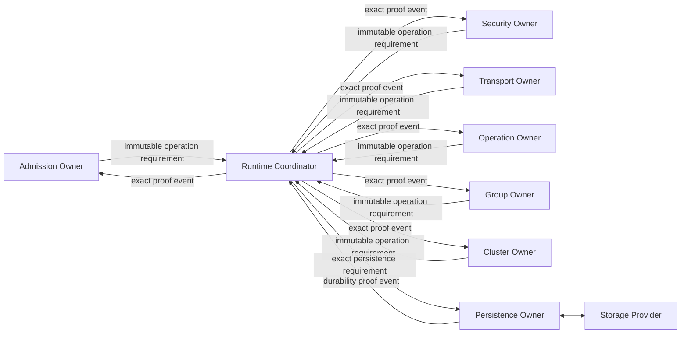
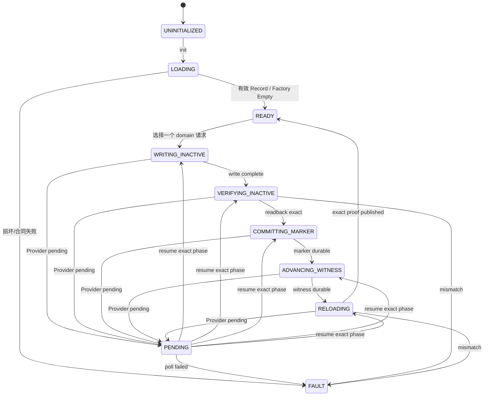

# 22 持久化与掉电恢复简化设计

> 状态：`SELF-REVIEWED / EXTERNAL REVIEW REQUIRED`
>
> 目标：所有需要“重启后仍不能忘记”的承诺共用一个固定内存 Persistence Foundation；普通消息不写 Flash，各业务模块不再复制 Provider I/O、双槽和恢复逻辑。
>
> 权威关系：本文是实现者首读的简化模型；第 12 篇拥有完整 Provider/Journal/Recovery 语义合同；共同 Record/Marker/Provider/Witness 的精确冻结候选见[V6S-00-07 Persistence Foundation 共同合同](../UCN_v6_V6S_00_简化版实施合同冻结/07-Persistence-Foundation共同合同.md)。各业务 Record Body 仍须在对应模块实现前单独冻结。

## 1. 哪些东西需要持久化

典型需要：

- 动态 Address Binding/Generation；
- Security Key/Session 的持久高水位；
- Reliable Transfer Parent/Transfer ID 高水位；
- Durable Operation Journal；
- Dynamic Group ID/Generation；
- Cluster Epoch、Vote、Config、Tombstone。

典型不需要：

- 普通 Best Effort 消息；
- 易失 Route；
- Driver token；
- QoS 队列位置；
- 本地重传 timer；
- Runtime callback 地址。

## 2. 两层证明

```text
Persistence Owner 证明：
    指定 Record/Operation 已提交、读回一致、Schema/CRC/单调关系正确

调用模块证明：
    这个 durable completion 仍属于当前事务，且当前 Authority/Lease/Policy 仍允许发送承诺
```

Flash 写成功不能自动恢复一个已经过期的 Authority。调用模块必须在使用结果前重新验证当前资格。

## 3. 唯一 Owner



只有 Persistence Owner 调用 Provider `load/submit/poll`。业务 Owner 只向 Runtime Coordinator 发布不可变、规范化的 operation/next-state requirement；Coordinator 将 exact requirement 路由给 Persistence Owner，再把 exact durability proof event 路由回原请求 Owner。业务 Owner 不持有 Persistence Owner 指针，不直接调用其 API，也不直接操作 Flash 或 Provider callback。同步 Provider 返回也必须沿同一 `Persistence Owner → Coordinator → requesting Owner` 事件路径收口，不能形成隐藏的同步直连捷径。

## 4. 最少对象

```text
PersistenceOwner
    lifecycle_state
    runtime_generation
    provider_config
    domains[UCN_V6_MAX_PERSIST_DOMAINS]
    io_active_request_ref
    fair_domain_cursor
    io_gate_ref

PersistDomain
    domain_id
    schema_id / schema_version
    owner_instance / domain_generation
    slot_a / slot_b metadata
    current_record_generation
    current_snapshot_ref
    witness_ref
    pending_request_ref
    fault / fence

PersistRequest
    domain_id
    caller_owner
    caller_transaction
    operation_type
    operation_id
    expected_state_fingerprint
    next_state_fingerprint
    canonical_next_snapshot
    continuation_key

DurabilityProof
    domain_id
    owner_generation
    record_generation
    operation_type
    operation_id
    record_fingerprint
```

`current_snapshot_ref`、`pending_request_ref` 和 Fault/Fence 都是 **per-domain** 的；没有一个把所有模块状态混在一起的全局 `current_snapshot`。`continuation_key` 只在当前启动内用于把异步完成送回调用者，不写入 durable Record。重启后从各 Domain Record 创建新的恢复 continuation，绝不复用旧指针或 callback。

唯一 Persistence Owner 可以按固定游标串行化一个不支持并发的 Provider，但不能因为某个 Domain PENDING/Fault 就覆盖、合并或冻结其他 Domain。Provider 支持并发时也必须为每次 I/O 保留 exact `{domain,request,slot,generation}` continuation。

## 5. Provider 最小接口

```text
load_domain(storage, domain_id, slot_set, witness, output)
write_inactive_uncommitted(storage, domain_id, target_slot, canonical_record, operation_id)
read_slot(storage, domain_id, target_slot, output)
publish_commit_marker(storage, domain_id, target_slot, record_generation)
advance_witness(storage, domain_id, committed_generation)
poll(storage, domain_id, operation_id, expected_io_phase)
```

返回状态：

```text
COMMITTED
PENDING
FAILED
INVALID = 0
```

全零 completion/load result 必须无效。同步 Provider 没有 `poll` 却返回 `PENDING` 时失败关闭。

## 6. Owner 状态机



Provider 回调前必须先建立共享、任务/ISR/SMP 安全的 I/O Gate。任何回调重入 init/submit/poll 均返回 `STATE` 且零写入。

## 7. 提交流程

```text
persistence_submit(request):
    validate owner lifecycle READY and no callback/reentry activity
    resolve exact domain and require that domain is not fenced/pending
    require no conflicting Provider I/O; otherwise retain only a pre-reserved bounded queued request or return BUSY with zero writes
    validate request fields, caller generation and domain-specific canonical encoding
    validate expected fingerprint == domain.current_snapshot
    ask operation-specific transition validator
    reserve immutable per-domain staging and target inactive slot inside caller-provided storage

    # Phase 1: write uncommitted inactive slot
    publish IO_ACTIVE plus exact phase WRITING_INACTIVE before callback
    write uncommitted inactive slot
    if PENDING: retain domain/request/slot/operation/phase and return PENDING

    # Phase 2: the written bytes must be read and verified before publication
    read inactive slot under the same gate
    verify schema/domain/generation/operation/fingerprint/CRC and commit_marker == 0
    if mismatch: fault only this domain; do not alter old committed snapshot/witness

    # Phase 3: this is the only publication point
    publish exact phase COMMITTING_MARKER before callback
    atomically publish the slot commit marker
    if PENDING: retain exact phase and return PENDING

    # Phase 4: witness follows the committed record, never precedes it
    publish exact phase ADVANCING_WITNESS before callback
    checked-advance anti-rollback witness
    if PENDING: retain exact phase and return PENDING

    # Phase 5: proof is created only from a fresh read of both durable objects
    reload committed slot and witness
    verify exact committed record, marker, generation, operation and witness relation
    publish only this domain's new current snapshot
    return immutable DurabilityProof
```

所有非法转换必须在 Provider I/O 前拒绝。

## 8. 异步完成

```text
persistence_step(now):
    if no pending request:
        return

    call provider.poll for the exact stored I/O phase under the same gate
    if PENDING:
        keep exact pending state
        return

    if FAILED or malformed:
        fault only the dependent persistence scope
        notify caller failure
        return

    resume only the recorded phase; never infer a later phase from Provider success
    execute the next phase using the same ordered state machine
    after witness completion, reload the exact domain record and witness
    verify domain, operation id, committed marker, generation, state and fingerprint
    publish only that domain's current snapshot and immutable DurabilityProof
```

调用模块收到 Proof 后仍要检查：

```text
same runtime/owner/transaction generation
same expected durable state
current authority/lease/policy still valid
```

然后才能发送 ACK、Advertise、Commit 或执行其他 promise。

## 9. Canonical Record

```text
Record Header
    magic
    schema_version
    layout_hash
    record_generation
    payload_length
    crc/digest

Canonical Domain Payload
    exactly one durable domain identity and owner state
    that domain's operation journal/tombstone/high-water fields
    absent optional fields of this domain encoded as zero
```

Identity/Binding、Security Session、Transport Parent、Operation、Time Domain、Group 和 Cluster 使用相互隔离的 Domain Record、双槽、Witness、Fault/Fence 和 pending。它们可以共享 Provider 物理介质和唯一 I/O Owner，但不得共享一个全模块大 Payload。语义缺省字段必须规范化为零；同一 Domain 内两个语义相同的状态必须产生完全相同的编码和 fingerprint。

旧 schema 在 v6 单一协议分支中明确拒绝；不保留隐式 v4/v5 migration。若产品需要一次性升级工具，应在协议 Runtime 外单独运行并形成可审计产物。

## 10. 双槽与 anti-rollback witness

```text
Slot A: generation N
Slot B: generation N+1
Witness: highest generation that might have been published
```

每个 Domain 的唯一写入顺序：

```text
1. checked-next 生成新 generation
2. 写 inactive slot 的完整 Record，marker 保持 uncommitted
3. 验证 inactive slot 全部字节、schema、CRC/digest 和 canonical fingerprint
4. 按 Provider 合同原子提交 slot marker
5. 推进独立 anti-rollback witness 到该 committed generation
6. reload slot + marker + witness 并逐字段匹配
7. 对调用模块发布 DurabilityProof
```

不得采用“先推进单值 witness、再写 Record”的另一套流程；若产品硬件只能先保留 Generation，必须把 `reserved_generation` 与 `published_generation` 做成两个可判定字段并另行冻结恢复表，不能复用本文的单值 witness 语义。

掉电恢复矩阵固定为：

| 掉电点 | 重启可见状态 | 恢复结果 |
| --- | --- | --- |
| inactive Record 未完整/未验证 | 旧 committed slot + 旧 witness | 忽略未提交槽，恢复旧状态 |
| Record 已验证、marker 未提交 | 新槽仍 uncommitted | 忽略新槽；允许以后使用新的 checked-next，不能把该槽当 promise |
| marker 已提交、witness 尚旧 | 唯一有效新 committed generation = witness+1 | 验证完整新 Record 后推进 witness，再恢复新状态；不得对外承诺前先完成 |
| witness 已推进、reload 尚未完成 | 新 committed slot 与 witness 一致 | reload 精确匹配后恢复新状态 |
| witness 指向的新 generation 损坏/缺失 | 旧槽仍有效但低于 witness | 该 Domain Fault，禁止静默回退 |
| 多个“最新”候选、generation 跳跃无法证明或 witness 损坏 | 无唯一安全结论 | 该 Domain Fault |

若最新已发布槽后来损坏，不能静默回退旧槽并再次使用相同 generation。无法证明安全前进时必须 Fault；允许因明确保留协议产生可证明跳号，不允许回绕或 ABA。

## 11. 启动恢复

```text
persistence_init(config):
    validate Provider API, capacity, alignment and manifest/layout hash
    for each Manifest-declared durable domain within fixed budget:
        load that domain's two slots and witness
        select only its unique provably newest committed record

        if factory empty:
            build that domain's canonical empty snapshot
        elif corruption/rollback ambiguity:
            fence only that domain and record diagnostic
        else:
            decode and validate complete domain snapshot

    rebuild only durable state
    create fresh volatile runtime/continuation generations
    return READY only after all product-required domains are valid;
        optional failed domains remain locally fenced
```

恢复顺序固定：先 Identity/Binding 与全局高水位，再 Security/Transport/Operation/Group/Cluster，最后才允许对应模块发送 promise。

## 12. Operation 掉电窗口

```text
PREPARED
    已记录请求，外部副作用尚未开始

ABORTED_NO_EFFECT
    已用本地证明确认执行器未观察请求；终态已持久化，可安全释放未执行事务

EXECUTING
    执行器可能已经动作

COMMITTED_RESULT
    结果已可可靠重放

IN_DOUBT
    无法证明外部动作是否完成
```

`ABORTED_NO_EFFECT` 只允许来自 `PREPARED`，或来自同一启动中仍持有“尚未 handoff 给执行器”的确切证明；不能用它表示普通执行失败。若执行器不能与 Journal 原子提交，也不能查询对账，`EXECUTING` 后掉电必须恢复为 `IN_DOUBT`。协议只能保证“不再盲目重试”，不能虚构成功结果。

## 13. Journal 表满与 GC

```text
journal_gc(now):
    scan at most configured budget
    retire only terminal entries whose retention and replay windows expired
    never evict PREPARED, EXECUTING or IN_DOUBT
    never reuse operation identity inside its parent generation
```

表满时新 Durable Operation 失败，不得覆盖未知状态，也不得阻止普通非 Durable Request。

## 14. 局部 Fault/Fence

Persistence 故障必须按依赖范围传播：

```text
Cluster record fault
    → Fence Cluster Authority
    → 普通不依赖 Cluster 的消息继续

Durable Operation journal full
    → 拒绝新 Durable Operation
    → 普通 Request/Result 继续

Security high-water fault
    → Fence 相关 Security Context
    → 不允许降级绕过安全要求
```

Provider 退休、取消确认和故障诊断必须继续推进，不能因 Fence 把清理路径一并锁死。

## 15. Feature OFF

Persistence OFF 时：

- 普通 Best Effort、Latest、普通 Reliable、普通 Service 可工作；
- 静态只读 Identity/Group 可工作；
- Dynamic Binding、C1 Transfer durable parent、Durable Operation、Dynamic Group 和生产 Cluster Authority 明确不可用；
- 不编译 Provider I/O、Record staging、Journal 或恢复扫描。

不能用 `VOLATILE_TEST` 证明掉电安全。测试模式只能验证状态机，不构成生产持久化证据。

## 16. 固定资源

```text
PERSIST_RECORD_BYTES
PERSIST_STAGING_BYTES
PERSIST_PENDING_SLOTS       # 简化首版建议为 1
OPERATION_JOURNAL_SLOTS
ANTI_ROLLBACK_WITNESS_BYTES
PERSIST_STEP_BUDGET
```

初始化和提交不得在栈上复制完整 Owner/Snapshot。staging 必须位于调用方静态 Storage，并由状态机独占。

## 17. 建议最小接口

```text
persistence_init()
persistence_submit()
persistence_query()
persistence_step()
persistence_get_snapshot_view()
persistence_fault_scope()
```

Provider 接口仅由 Owner 使用。调用模块只提交 canonical request，并消费 DurabilityProof。

## 18. 最低验收条件

1. 所有 promise 均 persist-before-use；
2. 全零 completion/load result 无效；
3. 非法 transition 在零 Provider I/O 前拒绝；
4. 同步/异步完成都 reload 并验证；
5. Provider 回调重入和并发无数据竞争；
6. 最新槽损坏不能回退重用旧 generation；
7. 语义缺省字段 canonical 为零；
8. 重启不恢复旧 callback/指针/volatile generation；
9. `IN_DOUBT` 不被重复执行或伪装成功；
10. Persistence OFF 不影响普通易失通信；
11. 完整 Owner/Snapshot 不进入公开 API 栈帧。

## 19. 最终效果

```text
普通遥测
    → 不写 Flash

动态入网/换钥/Cluster Commit
    → 共用一个 Persistence Owner，成功落盘后才发承诺

掉电重启
    → 只恢复可证明的 durable state，易失 continuation 全部重新建立

某一持久化域故障
    → 只 Fence 依赖该域的能力，不冻结无关基础通信
```

Persistence 因而是一项共享的安全基础设施，而不是每个高级模块各写一套难以审计的 Flash 状态机。
