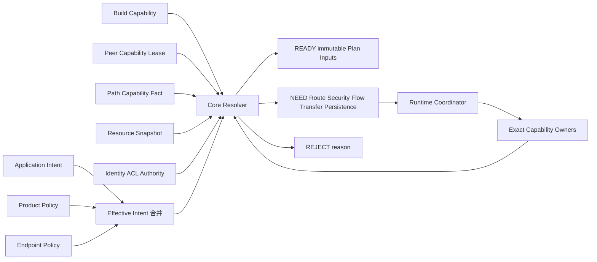

# 23 Capability 与 Contract Resolver 简化设计

> 状态：`SELF-REVIEWED / EXTERNAL REVIEW REQUIRED`
>
> 目标：把“用户想要什么”稳定地转换为“当前能否发送、需要准备什么、应使用哪个 Wire Contract”，同时保持最小构建小、决策可解释、资源有界。
>
> 权威边界：本文唯一负责 Capability View、Effective Intent、Contract 准入和 Resolver 决策顺序；Wire 字节以低开销 Wire 文档为准，用户字段以用户意图文档为准，模块链接与 Feature OFF 以模块化文档为准。

## 1. 为什么需要独立 Resolver

用户不应该选择 `C1/H1/O1`、Fragment 大小或 Label 宽度。用户只表达：

- 目标是单节点、Group 还是本地广播；
- 是 Best Effort、Latest 还是 Reliable；
- 是否要求认证、加密、实时或持久执行；
- 优先低延时、高吞吐、低功耗还是均衡；
- 是否允许分片、批处理、换路和路径回退。

Resolver 是这两种语言之间的唯一转换点。如果没有它，每个模块都会各自实现一套“自动降级”，最终导致相同 Intent 在不同路径上得到不同安全语义。



图中的回边表示 Owner 完成后必须重新读取快照并再次解析，不表示 Resolver 自己可以调用 Driver、Provider 或写 Owner 状态。

## 2. 三层能力事实

### 2.1 Build Capability

由生成的 Build Manifest 给出，只读，生命周期等于产品固件：

```text
BuildCapability
    wire_contract_bits
    feature_bits
    terminate_role_bits
    forward_role_bits
    security_suite_bits
    max_frame_bytes
    max_payload_by_contract[]
    fixed_resource_limits
    manifest_hash
```

它回答“这个二进制有没有这项能力”，不回答当前网络是否可用。

### 2.2 Peer/Path Capability

由已认证会话与路径 Owner 提供：

```text
PeerCapabilityView
    peer_principal
    binding_generation
    session_generation
    advertised_feature_bits
    terminate_role_bits
    expires_at_us
    authenticated

PathCapabilityView
    route_or_flow_ref
    path_generation
    frame_mtu
    payload_budget_by_contract[]
    end_to_end_feature_intersection
    hop_protection_floor
    expires_at_us
    fenced
```

这些 View 只是当前事实的快照。Resolver 可以读取，不能续租、改写或把 View 当作 Authority Handle。

### 2.3 Request-local Resource Capability

由 Runtime 在决策时生成：

```text
ResourceView
    tx_slots_free
    request_slots_free
    route_pending_free
    flow_slots_free
    reliable_receipts_free
    transfer_slots_free
    reassembly_bytes_free
    queue_credit_by_class[]
    adapter_credit_by_link[]
```

它回答“现在能否开始”。资源 View 不是 Reservation，所以 Resolver 返回 `READY` 后，Coordinator 仍要原子预留并在首个外部副作用前复核。

## 3. Capability 不等于权限

```text
Capability = 节点/路径声明并证明“能处理”
Policy     = 产品/用户声明“允许使用”
Authority  = 当前状态证明“有权执行”
Resource   = 当前资源证明“能立即执行”
```

四者必须同时满足。例如节点声明支持 Cluster，不代表它已是 Head；声明支持加密，不代表当前 Key/Session 可用。

## 4. Effective Intent

Resolver 不直接使用用户原始 options，先得到一份已完成默认合并和硬约束求交的 `EffectiveIntent`：

```text
EffectiveIntent
    target_kind
    target_ref
    service
    interaction_role
    delivery_guarantee
    execution_semantics
    completion_level
    security_floor
    realtime_requirement
    traffic_class_ceiling
    max_latency_us
    min_goodput_bytes_per_s
    max_staleness_us
    fragmentation_policy
    batching_policy
    path_policy
    required_feature_bits
    forbidden_feature_bits
    policy_generation_set
```

合并顺序是：

```text
Product/Realm hard policy
  → Link threat policy
  → Endpoint policy
  → Group policy（如适用）
  → per-send constraints
  → static combination validation
```

`AUTO/INHERIT` 只允许从上层默认值补全，不允许降低硬性安全、可靠性或时间要求。

## 5. Contract Candidate

每个候选项是一个完整组合，不是分散的枚举拼接：

```text
ContractCandidate
    core_contract          C1/C2/C3/C4/C5
    origin_security       O0/O1/O2
    hop_protection        H0/H1/H2/H3
    interaction_envelope
    delivery_mechanism
    route_mode            DIRECT/SOFT_ROUTE/FLOW
    transfer_mode         NONE/C1_PARENT/FLOW_PARENT
    group_mode            NONE/C5/FANOUT
    realtime_mode         NONE/LOCAL/TIMED
    exact_frame_bytes
    exact_payload_budget
    setup_cost_bytes
    expected_reuse_count
    immutable_dependency_refs
```

Candidate 不携带可执行指针，不占用线上或 Owner 资源。

## 6. 硬性准入顺序

顺序是合同的一部分，不得先按开销打分后再“尽量补齐”安全：

```text
admit_candidate(intent, candidate, views, now):
    require candidate contract is compiled locally
    require target can terminate exact contract/opcode
    require every relay can forward exact contract
    require policy permits candidate security and route mode
    require current Session/Key/ACL for required origin security
    require current hop context for required hop protection
    require target and path capabilities cover all required bits
    require route/flow reference current, unfenced and unexpired
    require authority proof when opcode has authority side effect
    require exact payload budget >= encoded business/envelope bytes
    require required fixed resources exist
    require realtime domain and uncertainty if timed mode is required
    return ALLOW
```

任一项失败都不进入评分。尤其不得：

- 将 `CONFIDENTIAL` 降为 `AUTHENTICATED/NONE`；
- 将 `RELIABLE` 降为 Best Effort 后仍返回成功；
- 将绝对 Deadline 改为本地优先级；
- 将 Pinned Path 替换成其他路径；
- 因 MTU 不足而去掉 Tag 或安全字段。

## 7. 评分只在合法候选中进行

```text
score(candidate, intent):
    latency_term    = bounded_normalize(candidate.expected_latency)
    goodput_term    = bounded_normalize(candidate.expected_goodput)
    overhead_term   = bounded_normalize(candidate.exact_frame_bytes)
    setup_term      = bounded_normalize(candidate.setup_cost / expected_reuse)
    energy_term     = bounded_normalize(candidate.energy_estimate)
    return saturating_weighted_sum(terms, intent.performance_goal)
```

分数只是优化建议，不是安全证明。相同分数的固定 tie-break：

1. 无 Setup 或已有有效 Execution Binding；
2. 更少的总线上字节；
3. 更少的上下文状态；
4. 更小的 Contract 编号；
5. 更小的 opaque Path stable order；
6. 更小的 Candidate fixture index。

不使用指针地址、Hash table 遍历顺序或未定义的浮点比较作为 tie-break。

## 8. Resolver 结果

```text
READY(plan_inputs)                    已有合法执行绑定，可尝试预留
NEED_DEPENDENCY(DependencyRequirement) 需要一个精确 typed dependency
WAIT_EXISTING(DependencyHandle)       已有相同 dependency transaction
REJECT_UNSUPPORTED     编译或对端/路径不支持
REJECT_POLICY          硬策略冲突
REJECT_RESOURCE        固定资源不足
```

```text
DependencyKind =
    IDENTITY_BINDING
    SECURITY_SESSION
    CAPABILITY_REFRESH
    SOFT_ROUTE
    FLOW
    TRANSFER
    GROUP
    TIME_DOMAIN
    PERSISTENCE

DependencyRequirement
    kind
    runtime_instance
    requester_owner_instance
    policy/config digest
    absolute_deadline
    union exact_requirement_by_kind

DependencyHandle
    runtime_instance
    owner_instance
    kind
    slot
    generation
    requirement_digest
    absolute_deadline
```

`union exact_requirement_by_kind` 的字段由第 26 篇登记：例如 Identity 绑定目标 Principal/Realm，Capability Refresh 绑定已认证 Peer Session，Persistence 绑定 durable domain/operation/fingerprint。未知 kind、非零保留字段或 kind 与 union 分支不一致必须在任何 Owner 写入前拒绝。

`policy/config digest` 与 `requirement_digest` 只用于固定表的查找预筛选，不定义相等性。Owner 的 Pending slot 必须保存完整有界的 canonical requirement；digest 命中后仍逐字段或逐字节精确比较。相同 digest、不同 requirement 必须作为冲突零写拒绝，不能复用旧 Handle、证明、样本、nonce 或 deadline。

同一次 Resolve 只返回一个主结果。多个依赖同时缺失时，使用固定顺序：

```text
IDENTITY/BINDING → SECURITY → CAPABILITY → ROUTE → FLOW → TIME/GROUP
→ PERSISTENCE → TRANSFER → QUEUE/ADAPTER RESOURCE
```

每次依赖完成后从快照重新 Resolve，不沿用准备前的 `READY` 结论。

## 9. 基础路由与高级 Flow 的分界

| 条件 | 允许 `SOFT_ROUTE` | 必须 `FLOW` |
| --- | --- | --- |
| C1 Best Effort/Latest | 是 | 否 |
| C1 Reliable 小消息 | 可，Attempt 冻结路由引用 | 长流/策略可升级 |
| Pinned Path | 否 | 是 |
| C2/C3/C4 | 否 | 是 |
| Network Time Sync | 否 | 是 |
| Cluster Authority control | 否 | 是 |
| 硬资源预留/原子换路 | 否 | 是 |

`SOFT_ROUTE` 只是可过期、非持久、非 Authority 的下一跳提示。它的部分安装是可安全容忍的，因为不能授权、不能作为 durable promise，也不能被实时/Cluster 消费。

## 10. Fast Path 执行绑定

Resolver 不应每包扫描全部 Candidate。稳定通信保存一个不可变 `ExecutionBinding`：

```text
ExecutionBinding
    runtime_instance
    target_binding_ref
    endpoint_policy_generation
    contract
    security_ref
    route_or_flow_ref
    time_or_group_ref
    max_payload_bytes
    traffic_class
    expires_at_us
    binding_generation
```

每次使用是 O(1) 的 exact-ref 检查：

```text
binding_use_preflight(binding, request, now):
    require all owner instances and generations exact match
    require no referenced fence is set
    require now < every required expiry/deadline
    require payload and current request semantics fit frozen contract
    require Endpoint/ACL/current authority still permit use
    require queue and adapter reservation can be acquired
```

任何硬性依赖失效都立即 Fence 该 Binding；仅性能权重变化可以允许 Drain/Grace。

## 11. Resolver 伪代码

```text
resolve(effective_intent, snapshot, now):
    require all snapshot owner instances are current
    require now is valid local monotonic time

    if valid cached execution binding satisfies effective_intent:
        return READY(binding)

    candidates = bounded_generate(effective_intent, snapshot)
    legal = empty fixed candidate array

    for each candidate within compile-time maximum:
        rc = admit_candidate(effective_intent, candidate, snapshot, now)
        if rc == ALLOW:
            append candidate to legal
        else:
            record bounded rejection reason

    if legal not empty:
        best = deterministic_min_score(legal)
        if best needs no setup:
            return READY(best immutable inputs)
        return NEED_DEPENDENCY(exact typed requirement for first missing dependency)

    return explain_no_legal_candidate(effective_intent, snapshot)
```

Resolver 全过程不获取 Driver/Provider callback gate，不调用外部函数，不写 Owner，不分配 Sequence/ID，不创建 pending。

## 12. 自动选择示例

| 用户需求 | 当前事实 | 结果 |
| --- | --- | --- |
| 直连遥测、Best Effort | 直连链路、安全下限 NONE | C1/O0/H0，零 Setup |
| 无路径的普通状态 | Discovery 开启 | `NEED_DEPENDENCY(SOFT_ROUTE)`，获得软路由后 C1 |
| 多跳加密命令 | Session 存在、无 Flow | `NEED_DEPENDENCY(FLOW)`，事务建 C4/O2/H1 |
| 偶发可靠小包 | C1 路径有效 | C1 Reliable，不强制 Flow |
| 高频一跳流 | C2 收益连续达阈值 | 创建 C2 Flow，后续命中 Fast Path |
| 4 KiB 数据 | 单帧不足、允许分片 | `NEED_DEPENDENCY(TRANSFER)` |
| Deadline 命令 | Domain 未锁定 | `NEED_DEPENDENCY(TIME_DOMAIN)` 或策略拒绝，不发普通命令 |
| Cluster Vote | 只有软路由 | `NEED_DEPENDENCY(FLOW)`，不消费软路由 Authority |

## 13. 固定资源与工作量

| 资源 | 编译期上限 | 满载行为 |
| --- | --- | --- |
| Candidate array | `UCN_MAX_RESOLVER_CANDIDATES` | 按固定生成顺序截止；不覆盖已选 Binding |
| Rejection reasons | `UCN_MAX_RESOLUTION_REASONS` | 饱和统计，准入结论不改变 |
| Execution bindings | `UCN_MAX_EXECUTION_BINDINGS` | 新长流拒绝或使用无 Flow 的已定义回退 |
| Snapshot modules | 由 Build Manifest 生成 | 只读固定数组，不运行时扩容 |

单次 Resolve 的最大工作是 O(`UCN_MAX_RESOLVER_CANDIDATES + enabled snapshot count`)；Fast Path 不遍历 Candidate 集。

## 14. Feature OFF

| 模块关闭 | Resolver 行为 |
| --- | --- |
| Discovery OFF | 只使用 Direct/Static/已存在路由；Intent 要求 AUTO_ROUTE 时返回 `REJECT_UNSUPPORTED`，显式 STATIC_ONLY/DIRECT_ONLY 但未命中时返回 `NOT_FOUND` |
| Security OFF | 要求 AUTH/CONFIDENTIAL 的 Intent 零副作拒绝 |
| Flow OFF | 只使用已完整定义的 C1 能力；Pinned/C2/C3/C4 拒绝 |
| Transfer OFF | 超过单帧 Payload Budget 的请求拒绝，不截断 |
| Realtime OFF | SYNCED/DEADLINE 拒绝；NONE 不受影响 |
| Group OFF | Group target 拒绝；Unicast 不受影响 |
| Cluster OFF | Cluster Opcode/Authority 拒绝；Core 通信不受影响 |
| Advanced Planner OFF | 使用固定 Candidate 生成和 tie-break，Core Resolver 仍存在 |

## 15. 对抗测试

- 低开销候选缺少 REQUIRED 安全时，必须选较大合法合同或拒绝；
- `RELIABLE + Flow OFF` 使用已定义 C1 Reliable，不降级 Best Effort；
- `PINNED + 路径失效` 拒绝，不选自动路由；
- Capability 未过期但 Session 已 Fence，候选仍拒绝；
- Generation 相同但 Deadline 已到，Fast Path 立即拒绝；
- MTU 不足时不去掉 Tag，只选等价短 Contract/Transfer 或拒绝；
- Candidate 生成顺序、评分相同时的 tie-break 在 GCC/MSVC/32/64-bit 一致；
- Resolver 返回 NEED_* 后依赖变化，必须重新 Resolve 而不直接发送；
- 空 Candidate 、候选表满、诊断 reason 表满均不改写 Owner；
- Cluster/Realtime 不得消费 `SOFT_ROUTE` 作为权威证明。

## 16. 验收标准

- 同一 Effective Intent + 同一 Snapshot 在所有工具链上得到相同结果；
- Resolver 完全只读，不分配 ID/资源、不发帧、不调 Provider/Driver；
- 任何硬性要求不会被自动降级；
- 基础 C1 路径不被强制升级为 Flow；
- 需要 Authority/实时/固定 Path 的请求不会使用软路由；
- 所有快照和 Execution Binding 都绑定 Owner Instance、Generation、Fence 和 Deadline；
- 资源、扫描次数和诊断输出均有编译期上限。

## 17. 最终效果

普通用户只调用统一发送接口。稳态短消息命中 O(1) 执行绑定；冷启动或依赖变化时才运行有界 Resolver。安全、可靠、实时和 Cluster 需求不会被“为了省字节”而降级，也不会让未使用的高级功能进入普通帧。
