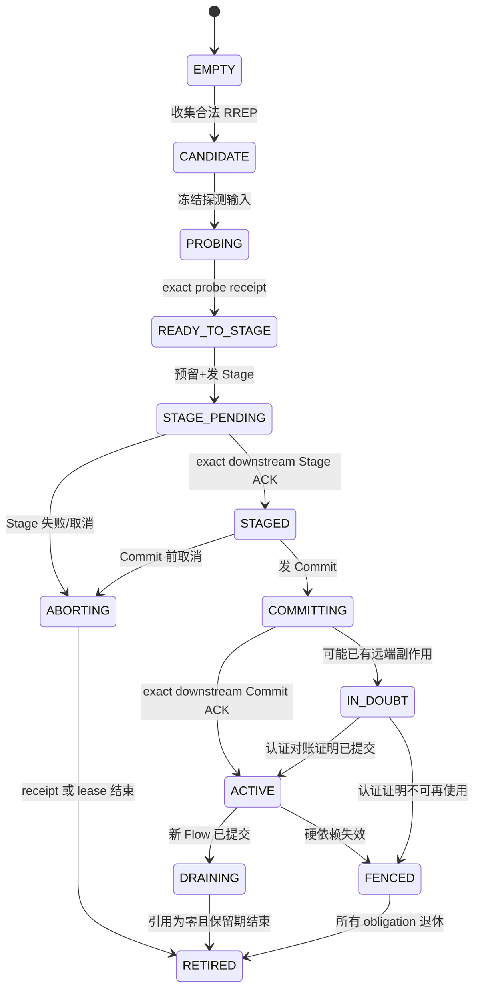

# 24 Advanced Route 与 Flow 简化设计

> 状态：`SELF-REVIEWED / EXTERNAL REVIEW REQUIRED`
>
> 目标：将基础 RREQ/RREP 软路由与需要稳定、可对账路径的高级 Flow 分开，使普通数据不承担两阶段提交开销，而 Reliable 长流、Pinned Path、Realtime 和 Cluster 仍获得安全路径证明。
>
> 权威边界：本文唯一负责高级路径候选、不可变 Proposal、逐跳 Stage/Commit、Flow 快路径和换路生命周期。基础软路由以第 15 篇为准，精确 Opcode/字段以低开销 Wire 文档为准。

## 1. 两种路由对象

| 对象 | 作用 | 是否授权 | 是否持久 | 允许部分安装 |
| --- | --- | --- | --- | --- |
| `SoftRoute` | 为 C1 提供可过期下一跳 | 否 | 否 | 允许，到期自清理 |
| `FlowPath` | 为 C2/C3/C4 提供冻结 Path/Label/能力证明 | 可被上层 Authority 门消费 | 默认易失；不得自称 durable | 不允许冒充 ACTIVE |

`SoftRoute` 可以作为发起 Flow 建立的探测通道，但不是 Flow 证明。

高级 Flow 在线上只使用以下五个事务语义，名称和顺序不得由实现自行缩写或合并：

```text
PATH_ACTIVATE_STAGE
PATH_STAGE_ACK
PATH_ACTIVATE_COMMIT
PATH_COMMIT_ACK
PATH_ACTIVATE_ABORT
```

`PATH_STAGE_ACK` 只证明下游已为同一 ActivationKey 保留 Staged 资源；`PATH_COMMIT_ACK` 只在下游已提交且本节点也完成本地提交后向上游传播；`PATH_ACTIVATE_ABORT` 不能伪造 Commit 已发生路径的回滚。

## 2. 什么时候必须升级为 Flow

任一条件成立就不得直接使用软路由作为最终执行绑定：

- 选择 C2、C3 或 C4 Contract；
- 用户要求 `PINNED` Path；
- 需要稳定的反向 ACK/SACK/Credit Flow；
- 需要 Network Time Sync 的固定定向 Path；
- Cluster Vote、Commit、Handover 或其他 Authority 控制；
- 需要硬资源预留或可对账的原子换路；
- 产品 Policy 明确禁止软路由。

C1 Reliable 偶发小消息可以冻结一个当前软路由引用完成单次 Attempt；若路径失效，该 Attempt 失败或使用同一 Operation ID 建立新 Attempt，不就地改写路径。

## 3. 对象与唯一 Owner

```text
AdvancedRouteOwner
    instance_generation
    candidates[CANDIDATE_MAX]
    transactions[ACTIVATION_MAX]
    flows[FLOW_MAX]
    receipts[RECEIPT_MAX]
    next_candidate_id
    next_route_generation_by_domain[]
    fenced

FlowProposal
    route_domain
    candidate_id
    route_generation
    ingress_reverse_label
    egress_forward_label
    path_profile_id
    source_binding_ref
    destination_binding_ref
    frozen_hop_list_or_chain_digest
    capability_intersection
    frame_mtu
    payload_budget_by_contract[]
    security_context_refs
    proposal_digest
    stage_deadline_us

FlowRecord
    state
    proposal
    owner_generation
    expires_at_us
    fence_reason
    execution_binding_generation
```

Proposal 一旦 Probe 完成、分配 Route Generation 或进入 Stage，全部字段不可变。新 RREP 要改变下一跳、Cost、Hop、MTU、Capability 或 Profile 时，必须分配新 Candidate，不得复用旧 Probe/代际/ACK。

## 4. 路径 Domain 与事务键

```text
RouteDomain = {
    realm,
    origin_principal,
    origin_address,
    origin_binding_generation,
    origin_session_generation,
    destination_principal,
    destination_address,
    destination_binding_generation
}

ActivationKey = {
    RouteDomain,
    c0_transaction_id,
    candidate_id,
    route_generation,
    label_pair,
    path_profile_id,
    proposal_digest
}
```

每个 ACK、Abort、重试和 terminal receipt 都必须 exact-match 整个 `ActivationKey`。外层 Hop/Origin Sequence 用新值防重放，但不改变事务身份。

## 5. 状态机



`IN_DOUBT` 不是“失败后清空”，而是一个有固定容量、保留事务键和对账义务的终端前状态。

## 6. 发起端流程

```text
flow_begin(candidate, requirements, now):
    PRECHECK:
        require candidate belongs to current RouteDomain
        require probe exact success and candidate immutable
        require all capability/session/route facts current
        require requirements fit selected C2/C3/C4 contract
        require candidate/transaction/receipt/label capacity
        require checked stage and commit deadlines
    RESERVE:
        allocate new route_generation by checked-next owner
        freeze FlowProposal and proposal_digest
        reserve transaction, outgoing Stage and terminal receipt
    COMMIT_LOCAL:
        publish STAGE_PENDING, never ACTIVE
    SIDE_EFFECT:
        send PATH_ACTIVATE_STAGE with exact ActivationKey
    CONTINUE:
        wait exact PATH_STAGE_ACK
```

在 `PATH_STAGE_ACK` 前收到更好 RREP 不改写该 Candidate。若需要新路径，另建 Proposal，旧事务按 Abort/超时收敛。

```text
flow_on_stage_ack(tx, ack, now):
    PRECHECK exact ActivationKey, reverse path, source role and deadline
    require Stage was actually submitted
    require dependencies remain current
    reserve Commit output before state change
    COMMIT_LOCAL tx.state = STAGED then COMMITTING
    SIDE_EFFECT send exact PATH_ACTIVATE_COMMIT

flow_on_commit_ack(tx, ack, now):
    PRECHECK exact ActivationKey and Commit was submitted
    require dependencies current and now < commit_deadline
    reserve Active slot/binding and terminal receipt
    COMMIT_LOCAL atomically publish Flow ACTIVE from frozen proposal
    retain receipt before sending/returning success
```

Origin 是整条链最后发布新 Active 的节点。

## 7. Relay/Target 逐跳顺序

```text
relay_stage(message):
    validate exact authenticated transaction and role
    preflight local forward/reverse label capacity
    reserve local STAGE_PENDING and downstream output
    forward downstream
    wait downstream exact STAGE_ACK
    atomically change local state to STAGED
    retain stage receipt
    send upstream STAGE_ACK

relay_commit(message):
    require exact local STAGED record
    reserve local Active publication and terminal receipt
    change to COMMITTING, forward exact Commit
    wait downstream exact COMMIT_ACK
    atomically publish local ACTIVE
    retain terminal receipt
    send upstream COMMIT_ACK
```

严禁的顺序：

- 本地预留成功就向上游发 Stage ACK；
- 下游尚未 Active 就发布本地 Active；
- 先发 ACK，再创建可重发 receipt；
- 使用当前可变 Candidate 而非发 Stage 时的冻结 Proposal。

## 8. Abort、超时和不确定

| 时点 | 处理 |
| --- | --- |
| Stage 未提交且可证明零外部副作用 | 本地回收 |
| Stage 已发送，Commit 尚未可能被接受 | 发 exact Abort，本地/远端靠 receipt 或 stage lease 清理 |
| Commit 可能已被任一节点接受 | 进入 `IN_DOUBT`，不得声称全网回滚 |
| 认证的 terminal receipt 证明已提交 | 收敛为 ACTIVE |
| 认证的租约/代际证明旧事务已不可使用 | Fence 并退休 |

`now == deadline` 视为过期。超时和重试都使用同一事务键、新外层 Sequence；不得刷新原 deadline。

## 9. Active Flow 快路径

```text
flow_use_preflight(flow_ref, request, now):
    require exact owner/runtime/flow generation
    require state == ACTIVE and no fence
    require now < flow expiry and all parent leases
    require target binding/session/path/capability exact current
    require requested interaction/delivery/security/realtime fits proposal
    require payload <= frozen payload budget
    require current Endpoint/ACL/Authority permits opcode
    reserve queue, buffer and adapter credit
    return immutable labels/security refs for encode
```

中继仅查 Label/Generation/Hop Auth/Hop Budget/MTU/QoS，不解析 E2E 加密业务 Payload。

## 10. 换路

```text
replace_flow(old, new_candidate, now):
    keep old ACTIVE
    establish new Flow through complete Stage/Commit
    only after new exact ACTIVE:
        publish new execution binding
        mark old DRAINING
    retire old only after:
        no request/attempt references
        replay/receipt retention ended
        adapter/buffer obligations returned
```

新路径失败不改写旧 Active。旧路径硬失效则立即 Fence，此时无新 Active 就向请求返回失败/重建，不继续使用 Grace。

## 11. 与 Reliable、Transfer、Realtime、Cluster 的边界

| 消费者 | 从 Flow 获取 | 仍需自己验证 |
| --- | --- | --- |
| Reliable | 冻结正/反向路径与 MTU | ACK 事务键、receipt、重试 |
| Transfer | 父 Flow generation、fragment budget、反馈 Flow | Setup/Fragment/SACK/Credit 语义 |
| Realtime | 固定 Path/Direction/租约 | Time Domain、uncertainty、event key |
| Cluster | 当前路径及安全证明 | 成员资格、quorum、durable Epoch/Config/Fence |

Flow 是可达性与路径事务证明，不是这些上层语义的替代品。

## 12. Feature OFF

| 关闭项 | 行为 |
| --- | --- |
| Advanced Route/Flow OFF | C2/C3/C4、Pinned、Network Time Sync 和 Cluster Authority 请求拒绝；C1 基础软路由仍可用 |
| Discovery OFF | 只能从 Direct/Static/已有合法候选建 Flow |
| Security OFF | 不建立要求 Auth/Confidential/Hop protection 的 Flow |
| Persistence OFF | Flow 默认仍可作为易失上下文；需 durable route promise 的产品组合拒绝 |

## 13. 固定资源

| 资源 | 编译期上限 | 满载行为 |
| --- | --- | --- |
| Candidate | `UCN_MAX_FLOW_CANDIDATES` | 不覆盖已 Probe/已冻结项 |
| Activation transaction | `UCN_MAX_FLOW_ACTIVATIONS` | 新 Flow 零发送拒绝 |
| Active/Draining Flow | `UCN_MAX_FLOWS` | 不驱逐 Active/Draining，可拒绝新长流 |
| Labels | `UCN_MAX_FLOW_LABELS` | Stage 前拒绝 |
| Receipt/IN_DOUBT | `UCN_MAX_FLOW_RECEIPTS` | 不驱逐合法未到期 receipt |
| Execution binding | `UCN_MAX_EXECUTION_BINDINGS` | 不影响基础 C1 TX Slot 保留 |

高级 Flow 资源不得借尽基础 TX/RX、Control ACK、Owner cleanup 和 Adapter completion 保留。

## 14. 对抗测试

- RREP 已创建候选，但未 Stage：不得被 Cluster/Realtime 直接消费；
- Probe 完成后同 Candidate ID 换下一跳：必须拒绝或分配新 Candidate；
- Stage 等待 ACK 期间更优 RREP：旧 Proposal 字节不变；
- Relay 未收下游 Stage ACK：不得向上游 ACK；
- Relay 未收下游 Commit ACK：不得发布 Active；
- 错 Route Domain、Generation、Label、Profile 或 digest 的 ACK：状态不写回；
- Stage 发送失败：可回收未发布 reservation；
- Commit 发送结果不确定：进入 `IN_DOUBT`，不删事务键；
- 新 Flow 建立失败：旧 Active 完全不变；
- Link/Session/Capability 过期：使用点立即 Fence，不等待背景扫描；
- Feature OFF：无 Flow 符号/存储时基础 C1 仍能通信。

## 15. 验收标准

- 基础软路由和高级 Flow 不共用可互相冒充的 `ACTIVE` 标志；
- 五个逐跳语义对应唯一 Opcode/字段/Golden；
- 所有 ACK 必须 exact-match 冻结 ActivationKey；
- 外部副作用前全资源预检，部分提交不被描述为本地回滚；
- Origin 最后 Active，Relay 只在下游已确认后逐跳发布；
- 新旧 Flow 换路的 Fence/Drain/receipt/资源退休闭环；
- 基础 C1 路径不因启用高级模块而额外携带 Flow 字段。

## 16. 最终效果

网络实现两条清晰路径：普通数据使用 `RREQ → RREP → SoftRoute → C1`，建路快、状态少；需要稳定证明的数据使用 `Probe → Stage → Commit → Flow → C2/C3/C4`，上层获得可对账的安全路径。两者共用 Discovery 事实，但不混合权威语义。
