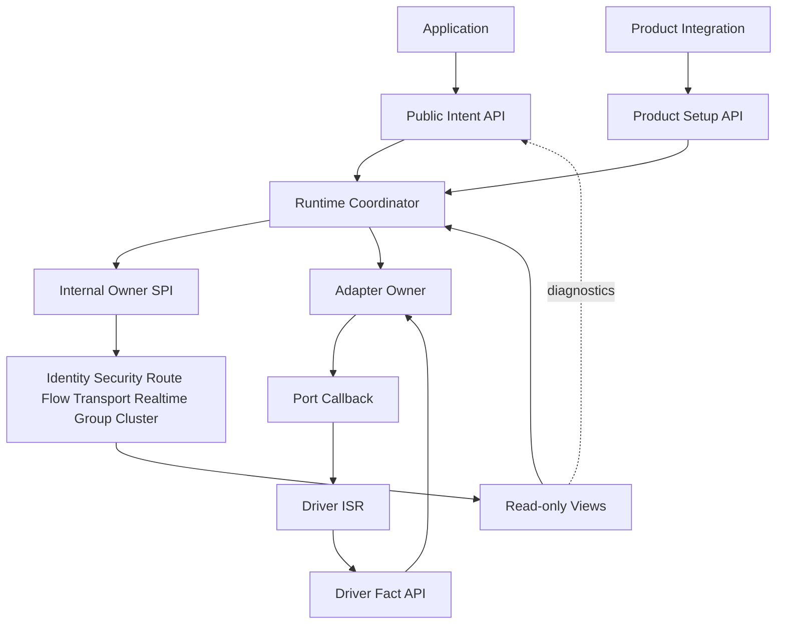

# 25 统一公共 API 与内部 SPI 冻结候选

> 状态：`SELF-REVIEWED / EXTERNAL REVIEW REQUIRED`
>
> 目标：将用户使用面、Driver 事实面、模块 Owner SPI 和诊断面彻底分开，让普通应用只需少量接口，高级能力不再把内部 FSM 暴露给用户。
>
> 本文是未来破坏性简化的 API 合同候选，不声称当前源码已实现这些名称或 ABI。

## 1. 四个边界

| 边界 | 调用者 | 允许做什么 | 禁止做什么 |
| --- | --- | --- | --- |
| Public Intent API | 应用/产品业务 | 配置 Endpoint、提交消息/请求、查询 Completion | 直接建 Route/Session/Flow，填 Wire Contract |
| Product Setup API | 产品集成层 | 绑定 Storage、Port、Provider、Manifest 和静态策略 | 运行中直改 Owner 内部字段 |
| Driver Fact API | ISR/Driver/Port | 发布 RX、TX 结果、Link 状态与时间戳事实 | 解码 Wire、调 Endpoint、改 Route/Security |
| Internal Owner SPI | Runtime Coordinator 与模块 Owner | 只读 View、发起有界 ensure/use/cancel/retire | 跨 Owner 写存储或从回调重入 |

Public header 不应 include 模块 private FSM 类型。Feature OFF 时，统一 Public Intent API 可以保留，但不支持的 Intent 必须在零副作用前返回明确错误。



Public API 只提交意图和读取结果；Driver Fact 只向上报告物理事实；Internal SPI 只在 Runtime Owner 动态范围内使用。三条路径不能互调成环，也不能共享可写 private object。

## 2. 最小公共对象

```c
typedef struct ucn_node ucn_node_t;

typedef struct ucn_handle {
    uint32_t runtime_instance;
    uint16_t owner_instance;
    uint16_t slot;
    uint16_t generation;
    uint8_t object_kind;
    uint8_t reserved_zero;
} ucn_handle_t;

typedef ucn_handle_t ucn_send_handle_t;
typedef ucn_handle_t ucn_endpoint_handle_t;
typedef ucn_handle_t ucn_path_handle_t;
typedef ucn_handle_t ucn_group_handle_t;
typedef ucn_handle_t ucn_time_domain_handle_t;
```

Handle 不包含裸指针、网络 Address 或可由用户猜测的 Owner 内部 ID。`object_kind` 必须与具体 API 要求一致，`reserved_zero` 必须为零；所有入口先验证 Runtime Instance、Owner Instance、kind、slot、generation、fence 和当前生命周期。上述代际均为 no-wrap：耗尽时对应 Runtime/Owner 进入明确 Fault，不能回到零复用。

## 3. 初始化与静态存储

```c
typedef struct ucn_storage {
    UCN_ALIGNAS(UCN_STORAGE_ALIGNMENT)
    unsigned char bytes[UCN_STORAGE_BYTES];
} ucn_storage_t;

ucn_result_t ucn_init(
    ucn_storage_t *storage,
    const ucn_config_t *config,
    const ucn_ports_t *ports,
    ucn_node_t **out_node);

ucn_result_t ucn_start(ucn_node_t *node, uint64_t now_us);
ucn_result_t ucn_step(
    ucn_node_t *node,
    uint64_t now_us,
    uint16_t budget,
    ucn_step_result_t *out_result);
ucn_result_t ucn_stop(ucn_node_t *node);
ucn_result_t ucn_deinit(ucn_node_t *node);
```

### 3.1 初始化前置

`ucn_init()` 在首次写 Storage 前验证：

- `struct_size/api_version`；
- Storage 容量与对齐；
- Build Manifest/Layout Hash；
- Composition/Profile/Policy 组合；
- 必需 Port/Provider 的 size/version/callback 合同；
- 固定容量是否满足所有保留。

失败时 `out_node` 不写回，Storage 不得留下可被 `start()` 误认的半初始化 magic。

### 3.2 生命周期

```text
UNINITIALIZED → INITIALIZED → STARTING → RUNNING
RUNNING → STOPPING → QUIESCENT → UNINITIALIZED
                         ↘ local FAULT → STOPPING/diagnostic
```

Driver callback active、App callback active 和 Provider callback active 是正交门，不是 lifecycle phase。

## 4. Endpoint 和静态路由

```c
ucn_result_t ucn_endpoint_add(
    ucn_node_t *node,
    const ucn_endpoint_config_t *config,
    ucn_endpoint_handle_t *out_endpoint);

ucn_result_t ucn_endpoint_remove(
    ucn_node_t *node,
    ucn_endpoint_handle_t endpoint);

ucn_result_t ucn_static_route_add(
    ucn_node_t *node,
    const ucn_static_route_t *route,
    ucn_path_handle_t *out_path);

ucn_result_t ucn_static_route_remove(
    ucn_node_t *node,
    ucn_path_handle_t path);
```

Endpoint callback 不能重入任何会改变 Runtime/Adapter/Provider 生命周期的公开入口。回调只能返回固定的 `ACCEPT/DROP`；需要异步持有 Payload 时，使用明确 Buffer Claim/Release API。

## 5. 统一发送面

```c
ucn_result_t ucn_publish(
    ucn_node_t *node,
    const ucn_target_t *target,
    const void *payload,
    size_t payload_bytes,
    const ucn_send_options_t *options,
    ucn_send_handle_t *out_handle);

ucn_result_t ucn_request(
    ucn_node_t *node,
    const ucn_target_t *target,
    const void *payload,
    size_t payload_bytes,
    const ucn_send_options_t *options,
    ucn_send_handle_t *out_handle);

ucn_result_t ucn_respond(
    ucn_node_t *node,
    ucn_request_context_t request,
    ucn_result_kind_t kind,
    const void *payload,
    size_t payload_bytes,
    const ucn_send_options_t *options,
    ucn_send_handle_t *out_handle);

ucn_result_t ucn_publish_group(
    ucn_node_t *node,
    ucn_group_handle_t group,
    uint16_t service,
    const void *payload,
    size_t payload_bytes,
    const ucn_send_options_t *options,
    ucn_send_handle_t *out_handle);
```

四个包装函数都进入同一 `submit_intent()` 内部路径。它们不各自实现安全、路由、可靠或分片决策。

`out_handle` 是可选输出，但不是可以静默忽略的请求。只有
`ucn_publish()` 的 `ONE_WAY + operation_id=0 + BEST_EFFORT + COPY + 单帧 + LOCAL_ACCEPTED`、无 callback，且
`out_handle == NULL`、不要求 Group/Latest/Reliable/Transfer/Zero-copy/Operation/dedup/远端结果时，
Resolver 才可选择“一个 TX Slot”的未跟踪最小路径。调用者传入非空 `out_handle`，或使用其他
三个包装函数时，必须在接受前建立受跟踪 Request；资源不足就明确失败。Public API 不增加
`fast/slow` 选择参数，协议按语义自动决定。

### 5.1 同步返回值

```text
UCN_OK              提交已被本地稳定接受；非空 out_handle 已写入有效 Handle
UCN_ERR_ARGUMENT    参数/枚举/长度静态无效
UCN_ERR_POLICY      用户请求与产品/Endpoint 硬策略冲突
UCN_ERR_UNSUPPORTED 编译能力不支持，且无完整定义回退
UCN_ERR_NO_SPACE    所选路径所需 TX Slot 或 Request/Receipt/Copy 的原子本地预留失败
UCN_ERR_STATE       lifecycle/reentry/fence 不允许提交
```

`UCN_OK` 只表示提交已被接受，不默认表示已发到链路、已被远端接收或业务执行成功。未跟踪路径不产生 Handle，后续结果只进入诊断；要求可查询 Completion 时必须传入 `out_handle` 或配置 callback，从而强制受跟踪路径。

## 6. Completion、取消和资源释放

```c
ucn_result_t ucn_send_query(
    const ucn_node_t *node,
    ucn_send_handle_t handle,
    ucn_send_view_t *out_view);

ucn_result_t ucn_send_cancel(
    ucn_node_t *node,
    ucn_send_handle_t handle);

ucn_result_t ucn_send_forget(
    ucn_node_t *node,
    ucn_send_handle_t handle);

ucn_result_t ucn_buffer_release(
    ucn_node_t *node,
    ucn_buffer_claim_t claim);
```

需要分开的事件：

```text
LOCAL_ACCEPTED
LINK_SUBMITTED
REMOTE_INBOX_ACCEPTED
REMOTE_REASSEMBLED
APPLICATION_RESULT
EXECUTION_OUTCOME_UNKNOWN
BUFFER_RELEASED
RECEIPT_RETENTION_ENDED
```

`cancel()` 是“请求停止未发生的后续副作用”，不是证明远端没有收到。Driver 已可能提交时，取消结果可以是 `IN_DOUBT`，直到对账或隔离证明成立。

`ucn_send_view_t` 必须同时、分字段呈现 `admission`、用户 Completion、内部 execution outcome、Buffer release 和当前/最后 Attempt 的 `plan_generation`；这些轴不能压成一个会同时表达“已执行”和“已释放”的 state。它是只读诊断快照，不是内部 Completion Receipt，也不能作为 Route/Security/Authority proof 使用。stale Handle 或任一校验失败时，整个输出保持不写回。

## 7. 诊断与高级观测

```c
ucn_result_t ucn_get_stats(
    const ucn_node_t *node,
    ucn_stats_t *out_stats);

ucn_result_t ucn_plan_preview(
    const ucn_node_t *node,
    const ucn_target_t *target,
    size_t payload_bytes,
    const ucn_send_options_t *options,
    ucn_plan_view_t *out_plan);

ucn_result_t ucn_get_path_view(
    const ucn_node_t *node,
    ucn_path_handle_t path,
    ucn_path_view_t *out_view);
```

诊断 View 不是可执行 Authority。`plan_preview()` 不预留资源，不保证随后提交仍选相同 Plan。所有输出结构均有 `struct_size/api_version`，错误时完全不写回。

## 8. Driver Fact API

```c
ucn_result_t ucn_driver_rx_publish(
    ucn_node_t *node,
    ucn_link_handle_t link,
    const uint8_t *bytes,
    size_t length,
    const ucn_rx_meta_t *meta);

ucn_result_t ucn_driver_tx_complete(
    ucn_node_t *node,
    ucn_driver_token_t token,
    ucn_driver_result_t result,
    const ucn_tx_meta_t *meta);

ucn_result_t ucn_driver_link_event(
    ucn_node_t *node,
    ucn_link_handle_t link,
    ucn_link_event_t event,
    const ucn_link_event_meta_t *meta);
```

Driver 只发布事实：

- RX 字节及其物理事件元数据；
- exact TX token 的提交/未提交/不确定结果；
- Link up/down/reopen 和代际变化；
- 可选的硬件 RX/TX timestamp key。

Driver 不能因为“知道对方”而直接建立 Peer Session，不能将未验证帧投递给 Endpoint。

## 9. Port/Provider 回调

### 9.1 TX Port

```c
typedef struct ucn_tx_port_vtable {
    uint16_t struct_size;
    uint16_t api_version;
    ucn_driver_submit_result_t (*submit)(
        void *context,
        ucn_link_handle_t link,
        const uint8_t *bytes,
        size_t length,
        ucn_driver_token_t token);
    ucn_result_t (*cancel)(void *context, ucn_driver_token_t token);
} ucn_tx_port_vtable_t;
```

### 9.2 Persistence Provider

```c
typedef struct ucn_persistence_provider_vtable {
    uint16_t struct_size;
    uint16_t api_version;
    ucn_persist_load_result_t (*load)(void *context, void *record, size_t bytes);
    ucn_persist_submit_result_t (*submit)(void *context, const void *record, size_t bytes, ucn_persist_token_t token);
    ucn_persist_poll_result_t (*poll)(void *context, ucn_persist_token_t token);
} ucn_persistence_provider_vtable_t;
```

进入任何外部 callback 前必须原子取得对应执行域 Gate，并先发布精确 continuation/token 状态。回调返回和早到 completion latch 在同一合并点处理。

## 10. 内部 Owner SPI

SPI 只对 Runtime Coordinator 可见，格式统一为：

```text
module_view(owner, now, out_view)              # 只读、零副作用
module_ensure(owner, typed_requirement, now, out_dependency_handle)
                                                # 启动/复用有界事务
module_use_preflight(owner, exact_ref, now)    # 使用点复核
module_cancel(owner, exact_handle)             # 请求取消，不伪造回滚
module_on_event(owner, exact_event)            # 由 Owner step 消费事实
module_retire(owner, exact_handle)             # 所有义务完成后退休
module_step(owner, now, budget, out_progress)   # 单轮有界推进
```

所有 SPI 必须共享四条规则：

1. 精确 Handle 绑定 Runtime/Owner Instance 与 Generation；
2. 异常输入在首次写入/发送前失败，输出不写回；
3. `ensure()` 不因为 exact duplicate 重复占槽；digest 只作查找预筛选，命中后必须对完整有界 canonical requirement 逐字段或逐字节精确比较；相同 digest、不同 requirement 的冲突重放拒绝且原槽不变；
4. 一个模块的 Fault 默认只 Fence 依赖它的请求，不冻结无关 Core。

`typed_requirement` 必须是第 23、26 篇定义的 `DependencyRequirement` tagged union；`out_dependency_handle` 在成功创建或复用事务时返回 exact `DependencyHandle`。`now` 是调用方已验证的本地单调时间。Owner 不允许自行调用另一个 Owner 的 `ensure()`：若处理中发现下一依赖，只发布不可变 requirement/event，由 Runtime Coordinator 在下一次有界推进中路由。Capability Owner 只拥有认证 Capability 事实，Resolver 只读生成 requirement，Coordinator 才负责调用 Owner；三者不得合并成一个可写对象。

## 11. Resolver 与 Coordinator 调用顺序

```text
submit_intent(node, intent, payload):
    validate public input and immutable payload ownership
    build EffectiveIntent from product/endpoint/per-send constraints
    run Resolver against read-only snapshots
    if strict untracked publish is eligible and no setup except SoftRoute discovery is needed:
        atomically reserve exactly one TX Slot and copy payload
        publish LOCAL_ACCEPTED and return without handle
    else:
        atomically reserve Request + Receipt + Copy/claim obligation
        publish LOCAL_ACCEPTED and return exact handle when requested

owner_step(node, now, budget):
    validate StepBudgetPlan and load persistent rotating cursor
    reserve a compile-time per-class cap for RX/completion, Timer,
        control TX, active requests, cancel and retire
    while total budget remains and any class has runnable work:
        choose the next eligible class from the persistent rotating cursor
        consume at most one fact/obligation from that class
        advance and persist the cursor even when the selected class is empty
        do not let borrowed spare budget consume another class's guaranteed cap

    for each selected active-request work item:
        resolve current EffectiveIntent again
        if READY:
            atomically reserve exact attempt/queue/adapter resources
            encode and submit
        else if NEED_DEPENDENCY:
            route typed requirement to exactly one Owner
            call module_ensure(owner, requirement, now, out_dependency_handle)
            bind request to the exact returned handle
        else if terminal reject:
            finalize execution outcome once
    retire completed obligations within reserved cleanup budget
```

`StepBudgetPlan + per-class cap + persistent rotating cursor` 是 Runtime/Owner 的唯一调度合同。Driver、Provider、Timer、控制 TX、Request、Cancel 和 Retire 都是工作类别，不存在“固定严格优先级永远先处理某一类”的例外。可以在一轮内借用其他类别未使用的剩余预算，但必须先保留其保证份额；持续 Driver/RX/completion 洪泛时，Timer、控制、取消和退休仍必须在编译期可证明的有限 step 数内获得机会。

已经返回 `UCN_OK + handle` 的受跟踪请求，后续不能把内部失败变成“该次 submit 其实没成功”；它必须通过 Completion 给出结构化 FAILURE/UNKNOWN。未跟踪发布只承诺本地已接受，后续失败写入有界统计/诊断。

## 12. 回调与重入规则

| 当前动态范围 | 允许的入口 |
| --- | --- |
| Driver callback | 仅对约定的 completion latch/ISR publish 函数 |
| Provider callback | 不允许任何可发起新 Provider I/O 的 API |
| Endpoint callback | 允许查询只读 View；发送如需支持必须进入独立有界延迟队列，不递归 Owner |
| Owner step | 不允许另一个 task/ISR 并发进入同 Owner 写路径 |

共享 Gate 必须是调用方持有、任务/ISR/SMP 安全的原子或平台临界区，不得使用未同步的进程静态指针。

## 13. Feature OFF 与头文件可见性

| 类型 | 头文件规则 |
| --- | --- |
| Core Public Intent | 始终安装；不支持的高级 Intent 返回 UNSUPPORTED |
| 可选模块产品配置 API | 只在对应 Feature 启用时安装/暴露，或在 include 时编译期明确拒绝 |
| Internal SPI/private types | 不安装，不进入 umbrella header |
| Diagnostics Views | 可安装的部分只包含稳定快照，不暴露 Owner 布局 |

Feature OFF 不能通过空 stub 返回伪成功，也不能把错误延迟到链接期。

## 14. 从应用到 Driver 的调用树

```text
application
  └─ ucn_publish / ucn_request / ucn_respond / ucn_publish_group
      └─ submit_intent
          ├─ endpoint/policy static validation
          ├─ strict untracked publish → one TX Slot
          ├─ otherwise → request_owner_create
          └─ schedule coordinator progress

protocol owner task
  └─ ucn_step
      ├─ consume driver/provider/timer facts
      ├─ resolver.resolve(read-only snapshots)
      ├─ module.ensure / module.use_preflight
      ├─ wire.encode
      ├─ qos.enqueue / schedule
      └─ coordinator_route_adapter_submit
          └─ port.submit(driver callback)

driver/ISR
  ├─ ucn_driver_rx_publish
  ├─ ucn_driver_tx_complete
  └─ ucn_driver_link_event
```

RX 路径反向经过：`Driver Fact → Adapter claim → strict Wire → Hop/E2E Security → ACL/Opcode → local Endpoint or Forwarder → retire`。

## 15. 最小 API 面验收

- 普通应用只需理解 Node、Endpoint、Target 和 Options；只有需要查询/取消/回调时再使用 Send Handle 与 Completion；
- 不向应用暴露 C0～C5、H0～H3、O0～O2、Route Candidate 或 Security Session FSM；
- 所有发送包装进入同一 Resolver/Coordinator 路径；
- 默认未跟踪 Best-Effort Copy 只占一个 TX Slot；要求 Handle/callback/高级语义时自动进入受跟踪 Request，二者不能事后互相转换；
- 所有 Driver 入口只发布事实，不包含协议决策；
- 模块 SPI 使用统一 View/Ensure/Use/Cancel/Event/Retire/Step 模式；
- 同步接受、异步 Completion、Buffer 归还和 Receipt 保留分开；
- 输出参数在失败时完全不写回；
- Feature OFF 不留存储/符号/伪成功。

## 16. 实现前最后冻结项

外部复审后，只有以下名称/布局需要进入独立 C API RFC：

1. 精确 `ucn_result_t` 数值；
2. 公共 config/options/view 的字段顺序、对齐和 `struct_size`；
3. `UCN_STORAGE_BYTES/ALIGNMENT` 生成规则；
4. Handle 位宽、无效值和回绕/Fault 规则；
5. callback ABI 及可调用子集；
6. Feature 头文件和安装 target 名称。

在此之前，本文函数名是语义候选，不是兼容性承诺。

## 17. 最终效果

应用面少而稳定，模块面按 Composition 裁剪，Driver 面只发布事实，Owner SPI 不越权。内部可以持续优化 Route、Flow、Security 和 Scheduler，而不迫使普通用户了解 Wire 组合或重写业务代码。
