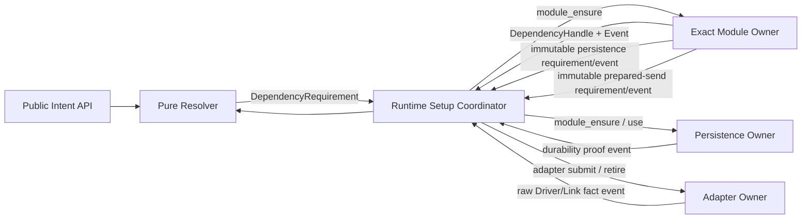
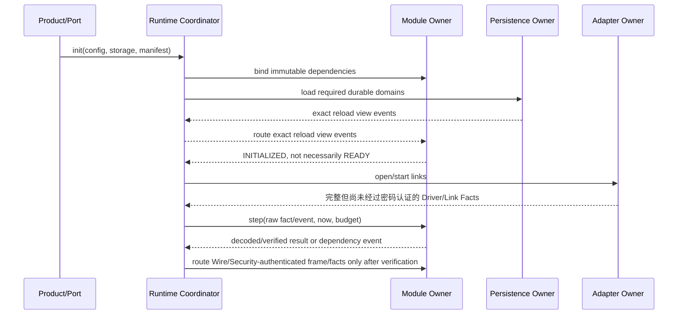

# 26 全局不变量与模块对接登记表

> 状态：`SELF-REVIEWED / EXTERNAL REVIEW REQUIRED`
>
> 作用：把分散在各模块中的跨模块安全合同收敛成唯一登记表，供实现、测试和审计逐项销账。
>
> 边界：本文冻结语义形状，不冻结最终 C ABI、结构体字节数或当前源码已完成状态。

## 1. 为什么需要单独登记

模块内部状态由各自 Owner 唯一拥有，但一次真实发送可能同时需要 Identity、Security、Capability、Route、Flow、Persistence 和 Adapter。若每篇文档自行发明 `NEED_*`、Handle、回调或持久化顺序，就会出现同一能力多套语义。

本文只做三件事：

1. 为跨模块不变量分配稳定 ID；
2. 冻结 Coordinator 与 Owner 之间唯一的 typed requirement/handle/event 形状；
3. 登记当前源码与目标结构之间必须完成的迁移。



Resolver 不修改状态；Coordinator 不拥有模块内部状态；Owner 不能直接调用另一 Owner。所有跨 Owner 的请求、完成和事实都必须以不可变 `Requirement/Event/View` 先交给 Coordinator，再由 Coordinator 路由到精确 Owner；图中的箭头表示事件路由，不表示共享可写对象。Provider/Driver 只能通过唯一门控入口产生事实。

## 2. 全局不变量注册表

以下标记之间的表是机器检查和人工外审共同使用的唯一注册表。

<!-- V6_INVARIANT_REGISTRY_BEGIN -->

| ID | 不变量 | 唯一语义权威 | 首个可见副作用前必须证明 |
| --- | --- | --- | --- |
| `INV-SEC-SESSION-PERSIST` | 受保护 `ACTIVE` Peer Session 的 Session Generation 必须 persist-before-use | 16、22 | exact Session record 已提交、reload 相同、当前 handshake/policy/identity 仍有效 |
| `INV-PERSIST-COMMIT-ORDER` | inactive write/verify 必须先于 commit marker；anti-rollback witness 不得被普通路径提前 | 12、22 | record CRC/schema/fingerprint 正确，marker 原子提交，随后 witness checked-advance |
| `INV-PERSIST-DOMAIN-ISOLATION` | durable domain 各有独立 record、witness、pending、Fault/Fence | 12、22 | 一个 domain 的损坏/满载不会覆盖或冻结无关易失通信 |
| `INV-CLUSTER-DURABLE-BEFORE-PROMISE` | Config、Joint、Vote、Epoch、Handover 的线上承诺都必须在 exact reload proof 后 | 11、21、22 | proof 与当前 tx/config/epoch/voter/authority/fence 完全匹配 |
| `INV-REALTIME-DOMAIN-PERSIST` | Network Time Domain Generation 必须 persist-before-publish；Local Stamp 不需要该记录 | 10、19、22 | generation record reload、同代际单调高水位和当前 time-source 资格有效 |
| `INV-DRIVER-GATE-ORDER` | 任何 Driver 调用都必须通过 Adapter 唯一 `call_driver` 门 | 05、15、25 | shared callback-domain gate、token/continuation、event gate 已在回调前发布 |
| `INV-OWNER-STEP-FAIRNESS` | completion/RX flood 不得永久饿死 Timer、控制 TX、取消或退休 | 01、05、15 | 每类有编译期份额与跨 step 持久 cursor；局部 Fence 在事件发布时立即建立 |
| `INV-RESOLVER-TYPED-DEPENDENCY` | Resolver 只能返回一个精确 typed requirement；Owner 只接受匹配 union 分支 | 01、23、25、本篇 | kind、realm/peer/path/policy/deadline 完整且保留字段为零；digest 只作预筛，复用前精确比较 canonical requirement |
| `INV-HOP-BUDGET-DROP` | Hop Budget 耗尽只能丢弃，不能降级绕过实时或 Traffic Class 合同 | 19、低开销 Wire | `remaining_budget <= consumed_budget` 时零队列写入并记 `DROP_EXPIRED` |
| `INV-RERR-CAUSAL` | RERR 只能失效它证明的 exact Route 代际和因果安装记录 | 07、15、24 | RouteDomain、route generation、causal ID、failed-link generation 全部匹配 |
| `INV-FEATURE-PHYSICAL-ISOLATION` | Feature OFF 必须同时消除符号、依赖、Storage、任务和对应 Wire 状态 | 模块边界、14 | CMake/nm/map/header/manifest/consumer 测试均证明没有隐式拉入 |
| `INV-PERSIST-MIGRATION` | 各模块私有 Store 迁移到统一 Persistence Foundation 期间不得形成双写双真相 | 模块边界、14、22 | 每个 domain 只有一个 writer；旧 adapter 只在隔离迁移测试中存在并最终 denylist 归零 |

<!-- V6_INVARIANT_REGISTRY_END -->

“唯一语义权威”不是说其他文档不能引用规则，而是其他文档只能写使用点和失败结果，不能重新定义字段顺序、提交顺序或另一种例外。

## 3. Typed Dependency 合同

候选的概念结构如下；最终 C ABI 仍需独立冻结：

```c
typedef enum {
    DEP_IDENTITY_BINDING,
    DEP_SECURITY_SESSION,
    DEP_CAPABILITY_REFRESH,
    DEP_SOFT_ROUTE,
    DEP_FLOW,
    DEP_TRANSFER,
    DEP_GROUP,
    DEP_TIME_DOMAIN,
    DEP_PERSISTENCE
} dependency_kind_t;

typedef struct {
    dependency_kind_t kind;
    uint32_t runtime_instance;
    uint32_t requester_owner_instance;
    uint64_t absolute_deadline_us;
    uint64_t policy_digest;
    union {
        identity_requirement_t identity;
        security_requirement_t security;
        capability_requirement_t capability;
        route_requirement_t route;
        flow_requirement_t flow;
        transfer_requirement_t transfer;
        group_requirement_t group;
        time_requirement_t time;
        persistence_requirement_t persistence;
    } exact;
} dependency_requirement_t;

typedef struct {
    dependency_kind_t kind;
    uint32_t runtime_instance;
    uint32_t owner_instance;
    uint16_t slot;
    uint16_t generation;
    uint64_t requirement_digest;
    uint64_t absolute_deadline_us;
} dependency_handle_t;
```

规则：

- `kind` 只允许对应的 union 分支非零；其余分支和保留字节必须为零；
- `policy_digest` 和 `requirement_digest` 必须由完整 canonical requirement 计算，不能只 Hash 指针或槽号；
- 两个 digest 都**只作查找预筛选**，不能作为请求相同、权限相同、证明相同或 Handle 可复用的依据；
- Pending slot 必须保存完整且有界的 canonical requirement（或其固定长度 canonical bytes）；命中相同 digest 后仍必须逐字段或逐字节精确比较；
- 相同 digest 但 canonical requirement 不同属于冲突输入，必须在状态写入、Provider/Driver 调用和 Handle 复用前拒绝，原 Pending slot 保持不变；
- Handle 只表示当前启动内的精确依赖事务，不是 durable identity；
- 相同 Handle 数值在不同 Runtime/Owner Instance 下绝不相等；
- deadline 到达即过期，完成后必须重新 Resolve；
- 多个依赖缺失时每次只返回固定顺序中的第一个，完成后从当前快照重新裁决。

## 4. 模块连接登记表

以下标记之间的表是跨 Owner 连接关系的唯一机器可读权威。每个 Owner 使用冻结的 `OWNER_*` 规范 ID；Mermaid 中可使用短别名和中文显示名，但检查器必须把端点归一化为这些 ID，再逐条核对来源、目标与方向。任何无法归一化的 Owner、表外方向或无法完整解析的 Owner 连线都必须拒绝。

Mermaid 只解释相同关系，不得增加表外连接；含 Owner 的 Mermaid 只允许 `-->`、`<-->`、`.->`、`->>`、`-->>` 五种规范箭头。`<-->` 会展开为两个有向连接分别核对。`-. 不依赖 .-` 等非连接语义不得画成边，应写在图后的正文或 Note 中。

<!-- V6_OWNER_CONNECTION_REGISTRY_BEGIN -->

| Source Owner ID | Target Owner ID |
| --- | --- |
| OWNER_COORDINATOR | OWNER_IDENTITY |
| OWNER_IDENTITY | OWNER_COORDINATOR |
| OWNER_COORDINATOR | OWNER_SECURITY |
| OWNER_SECURITY | OWNER_COORDINATOR |
| OWNER_COORDINATOR | OWNER_CAPABILITY |
| OWNER_CAPABILITY | OWNER_COORDINATOR |
| OWNER_COORDINATOR | OWNER_ROUTE |
| OWNER_ROUTE | OWNER_COORDINATOR |
| OWNER_COORDINATOR | OWNER_FLOW |
| OWNER_FLOW | OWNER_COORDINATOR |
| OWNER_COORDINATOR | OWNER_TRANSPORT |
| OWNER_TRANSPORT | OWNER_COORDINATOR |
| OWNER_COORDINATOR | OWNER_OPERATION |
| OWNER_OPERATION | OWNER_COORDINATOR |
| OWNER_COORDINATOR | OWNER_TIME |
| OWNER_TIME | OWNER_COORDINATOR |
| OWNER_COORDINATOR | OWNER_GROUP |
| OWNER_GROUP | OWNER_COORDINATOR |
| OWNER_COORDINATOR | OWNER_CLUSTER |
| OWNER_CLUSTER | OWNER_COORDINATOR |
| OWNER_COORDINATOR | OWNER_PERSISTENCE |
| OWNER_PERSISTENCE | OWNER_COORDINATOR |
| OWNER_COORDINATOR | OWNER_ADAPTER |
| OWNER_ADAPTER | OWNER_COORDINATOR |
| OWNER_COORDINATOR | OWNER_ADMISSION |
| OWNER_ADMISSION | OWNER_COORDINATOR |
| OWNER_COORDINATOR | OWNER_REQUEST |
| OWNER_REQUEST | OWNER_COORDINATOR |
| OWNER_COORDINATOR | OWNER_SEQUENCE |
| OWNER_SEQUENCE | OWNER_COORDINATOR |
| OWNER_COORDINATOR | OWNER_QOS |
| OWNER_QOS | OWNER_COORDINATOR |
| OWNER_COORDINATOR | OWNER_MODULE |
| OWNER_MODULE | OWNER_COORDINATOR |

<!-- V6_OWNER_CONNECTION_REGISTRY_END -->

`OWNER_MODULE` 只用于不关心具体模块种类的通用时序示例；生产设计和实现应使用 Identity、Security、Capability、Route、Flow、Transport、Operation、Time、Group、Cluster、Admission、Request、Sequence、QoS、Persistence 或 Adapter 的具体 ID。登记两个方向不表示共享可写对象：`OWNER_COORDINATOR → OWNER_X` 只路由 exact requirement/fact，`OWNER_X → OWNER_COORDINATOR` 只发布 immutable event/view。

| 调用者 | 目标 Owner | 输入 | 正常输出 | PENDING/完成 | 失败时必须保持 |
| --- | --- | --- | --- | --- | --- |
| Public API | Resolver | immutable Intent + current views | `READY` 或一个 `DependencyRequirement` | 无；Resolver 纯函数 | 全部 Owner 状态不变 |
| Coordinator | Identity/Security/Capability | exact identity/session/capability requirement | exact Handle/View | typed completion event | 不把自报事实当 Authority |
| Coordinator | Route/Flow/Transport | exact RouteDomain/Proposal/parent context | exact Handle/View | discovery、Stage/Commit 或 fragment completion | 旧 Active 保留；不借用未持久父代际 |
| Coordinator | Operation/Time/Group/Cluster | exact operation/domain/generation/authority requirement | exact Handle/View | typed completion event | 未满足 proof/authority 时不发布承诺 |
| Coordinator | Admission/Request/Sequence/QoS | exact bounded runtime requirement | exact Handle/View/reservation | typed completion event | 不越过容量、ACL、Sequence 或调度门禁 |
| 各 durable Owner | Coordinator | immutable domain/operation/expected/next persistence requirement | routed requirement/event | Coordinator 调用 Persistence 并回送 exact proof | 不持有或直接调用 Persistence Owner |
| Coordinator | Persistence | exact persistence requirement + requester identity | volatile continuation key | durability proof event 回到 Coordinator | 失败只 Fence 请求 domain；不发旧承诺 |
| 各发送 Owner | Coordinator | immutable prepared-send requirement + frame view | routed request/event | Coordinator 调用 Adapter 并回送 exact fact | 不持有或直接调用 Adapter Owner |
| Coordinator | Adapter | prepared token + immutable frame view | submitted/completed raw fact | Driver event 回到 Coordinator | Driver 只经 `call_driver`；不越过 Adapter |

Owner 之间交换的都是由 Coordinator 路由的不可变 requirement、Handle、View 或 Event。不得共享可写内部结构，不得通过“拿到另一个 Owner 指针后直接调用”绕过 Coordinator；Persistence、Adapter 也不例外。若实现为了性能采用静态直接函数调用，调用目标仍只能是 Coordinator 的路由入口，而不是业务 Owner 直接依赖另一 Owner 的 API。

## 5. 初始化与运行顺序



Driver/Adapter 只能证明“哪个 Link 收到或发出了哪些完整字节、物理时间戳和完成状态”，不能证明远端 Principal、Frame 或 Payload 已通过密码认证。只有 Wire 完成结构校验且 Security 完成 suite/key/replay/AAD/Tag 验证后，Coordinator 才能向业务 Owner 发布 `authenticated frame/facts`。对象可被引用不等于网络能力 Ready。建立 Session、Admission 或 Flow 所必需的最小控制入口可以先开放，但任何业务或 Authority 使用点必须等待其精确依赖全部 Ready。

## 6. Feature OFF 与物理裁剪

逻辑上返回 `UNSUPPORTED` 还不够。每个可选模块关闭时必须同时证明：

1. 对应源文件不进入目标；
2. 下游 archive/consumer 没有该符号；
3. public umbrella/header 不承诺不可链接的 API；
4. Storage bytes 和 manifest bits 不包含该模块；
5. Runtime config 不保留该 Owner 指针；
6. 不创建对应任务、Timer、queue 或 Wire pending；
7. 基础 C1/O0/H0 路径的字节和行为不变。

当前源码只部分满足该目标；具体差距和迁移顺序以模块边界文档第 29～31 章为准。在物理裁剪门禁通过前，不得把“Feature 开关存在”写成“模块已解耦”。

## 7. Persistence 迁移的唯一顺序

当前多个模块各有 Store vtable。目标迁移必须按下列顺序进行：

```text
冻结 per-domain record + operation DTO
  → 实现统一 Persistence Owner 和 Provider gate
  → 为一个 domain 接入旧 Store 的隔离 adapter
  → 双槽/掉电/reload 对抗测试通过
  → 该 domain 唯一 writer 切到 Persistence Owner
  → 删除旧 Store API、符号、CMake 边和测试桥
  → 进入下一个 domain
```

禁止生产双写、先写 witness、把所有模块快照合成一个巨型 Record，或在同一进程中允许新旧 Store 都成为 writer。迁移 adapter 只能属于显式测试 Composition，不能进入最终发布面。

## 8. 对抗与冻结门禁

至少需要以下独立反例：

- Session handshake 完成但 durability proof 未到：`ACTIVE`、业务 TX、Session ACK 均为零；
- inactive slot 写完、marker 前掉电；marker 后、witness 前掉电；witness 后、reload 前掉电；
- Persistence domain A 损坏/满载时，无关基础 C1 和 domain B 仍按各自合同运行；
- Cluster Vote/Config/Joint/Epoch 在 proof 到达前不发 ACK/Commit/Stepdown；
- Network Time Domain generation 未 durable 时不发布 `DOMAIN_TIME_VALID`；
- 任意模块直接调用 Driver 或 Provider 的链接/符号扫描必须失败；
- 持续 RX/completion flood 下，Timer、控制 TX、取消和退休在有限 step 内推进；
- dependency kind 与 union 分支错配、过期 Handle、跨 Runtime Handle 均零写拒绝；
- 构造相同 `requirement_digest/policy_digest` 但 canonical requirement 不同的两个输入，第二个不得复用、改写或完成第一个 Pending slot；
- 静态依赖/符号扫描必须证明业务 Owner 没有直接指向 Persistence/Adapter/其他 Owner 的调用边；
- 文档门禁必须扫描 00～26 的全部 Mermaid 与伪代码；把 Security/Cluster 等业务 Owner 直接连到 Persistence/Adapter、把 Persistence reload proof 直接返回 Module Owner、使用 `==>`/`<--`/`-)`/带标签虚线等非规范 Owner 箭头、调用裸 `persistence_*`/`adapter_*`、使用 `persistence.submit()`/`PersistenceOwner.submit()`/`adapter.submit()`、经局部别名或跨行 Owner 成员调用，或写入裸 `persist OPERATION` 的变异 fixture，均必须使检查器自测失败；
- `participant SecurityOwner` 等无 `as` CamelCase/下划线 Owner ID 必须被识别；含 Owner 的连接行若无法完整解析必须拒绝，不能因别名或箭头拼写未知而跳过；
- `V6_OWNER_CONNECTION_REGISTRY` 标记区必须与检查器的冻结有向连接对完全一致；检查器还必须把每条可解析 Owner Mermaid 边归一化成 `{source_owner_id,target_owner_id}` 后逐边查询登记表。删除、增加、改向、遗漏 Cluster 等具体 Owner，或把任一 `Coordinator → Owner` 改成 `Owner → Owner`，均必须由登记表解析自测或文档门禁拒绝；
- Adapter 发布的原始 Driver/Link Fact 在 Wire/Security 成功前不得被标记或消费为 authenticated；
- Hop Budget 耗尽只能 `DROP_EXPIRED`；
- 旧 RERR 的 original traffic RouteDomain、route generation、causal ID 或 failed-link generation 任一与当前 Route 不同，均不得删除新 Route；
- 任一 Feature OFF 组合通过 `nm/map/header/consumer` 证明物理状态为零；
- Store 迁移阶段检测到双 writer 或旧符号残留时构建失败。

只有这些门禁、各模块定向测试和至少一个目标 MCU 的资源测量共同通过，本文才可从 `SELF-REVIEWED` 提升为实现冻结候选。

## 9. 当前结论

本文解决的是“模块怎样连接、怎样解耦、跨模块不变量在哪里”的歧义。它没有证明当前 v6 代码已经完成模块物理拆分，也没有授权生产 Wire 重构。当前允许做的是继续修正文档、建立机器门禁和按 MOD 顺序迁移；每一阶段都必须保持旧主线可验证且不形成双真相。
