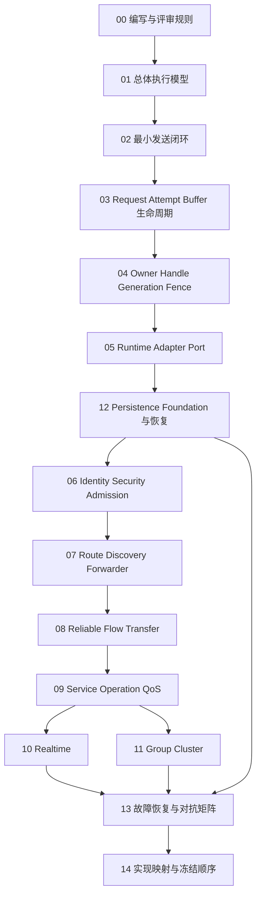
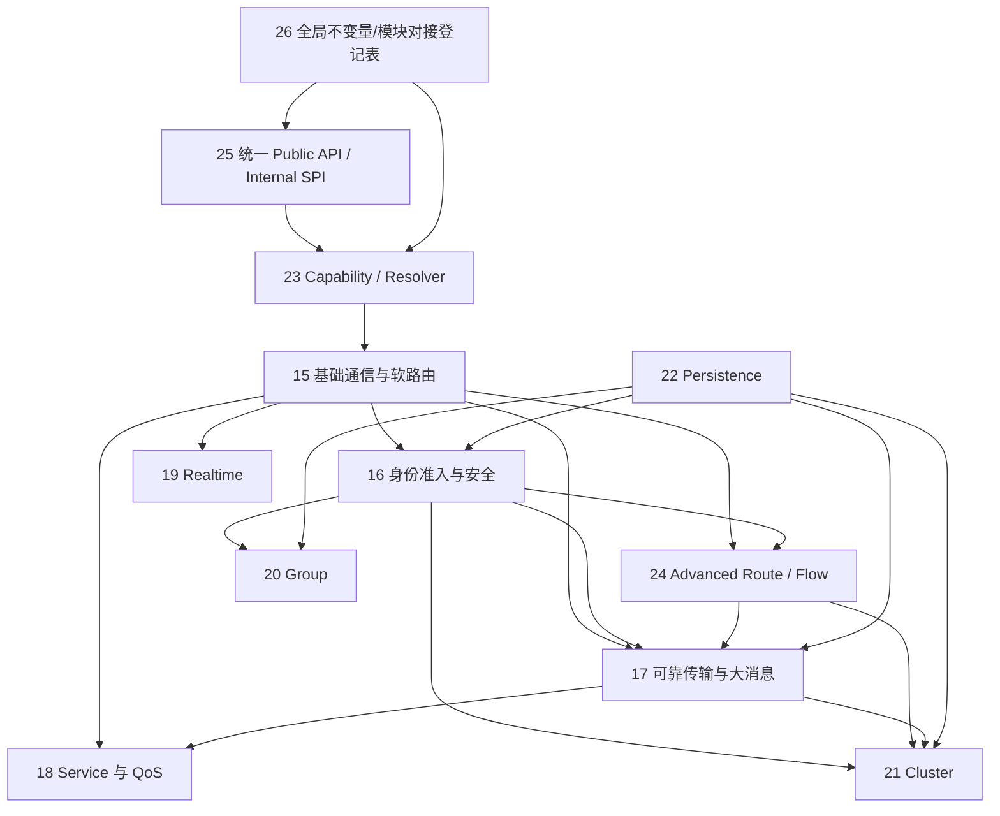

# UCN v6 逻辑模型、伪代码与状态图

> 状态：`SELF-REVIEWED / EXTERNAL REVIEW REQUIRED`，尚未冻结，不代表源码已经按此重构。
> 目标：在继续修改代码前，先把每条正常路径、失败路径、资源所有权和状态转换描述到可以直接实现和审计的程度。

## 1. 为什么拆成文档集

UCN v6 同时包含最小通信、驱动适配、安全、自动寻路、可靠传输、实时、持久化和 Cluster。如果把这些内容放在一篇文档中，会产生三个问题：

1. 一处规则改变时，读者无法判断哪些章节必须同步；
2. 状态所有权、Wire 字段和用户 API 容易混成多个权威来源；
3. 正常路径很容易写清楚，但失败、取消、重启和资源释放被埋在长文档中。

本目录把逻辑按 Owner 和生命周期拆开。`00～14` 是完整合同与对抗附录，`15～26` 是实现者应先读的简化主线。两组文档不是两个可选协议：简化主线定义组件和调用骨架，完整附录只展开同一合同的失败、重启和资源边界。如果两者冲突，必须停止实现并修正文档，不得由开发者自选一套。

## 2. 权威范围

| 文档集 | 唯一负责 | 明确不负责 |
| --- | --- | --- |
| 本目录 | 简化实现主线、状态机、调用顺序、伪代码、副作用边界、失败恢复、跨模块协作 | 精确 Wire 字节、已实现声明；第 25 篇函数名仍是待外审的 API 候选 |
| [模块边界设计](../UCN_v6_可裁剪模块边界依赖资源与静态装配详细设计.md) | 模块职责、依赖、Feature OFF、资源和静态装配 | 每个入口的完整算法 |
| [低开销 Wire 设计](../UCN_v6_低开销统一Wire各Contract字段与运行机制详细设计.md) | 当前唯一的 C0～C5、O0～O2、H0～H3 线上字段候选和协议交互权威 | 本地对象内存布局和调度实现；当前为 `SELF-REVIEWED / EXTERNAL FREEZE REQUIRED`，冻结前不得据此启用生产编码 |
| [用户意图设计](../UCN_v6_面向用户意图的自动传输策略与配置接口详细设计.md) | 用户请求、默认策略、显式覆盖和完成语义 | 模块内部状态布局 |
| [最终协议架构 RFC](../UCN_v6_最终协议架构与破坏性重构_RFC.md) | v6 顶层不变量、版本断代和安全基线 | 本目录每个算法的实现细节；其中旧 6.x Wire 字节合同已 `SUPERSEDED`，不能再作为编码依据 |

若文档冲突，先停止实现并修正文档；不能由开发者自行选择一份规则。

因此当前冻结顺序必须是：先让模块、用户语义和本目录状态机一致，再冻结低开销 Wire；在低开销 Wire 明确标记 `FROZEN FOR IMPLEMENTATION` 前，任何 C0～C5 字段都只能用于设计评审、Golden 候选和离线模型，不能进入生产 Encoder/Decoder。

## 3. 推荐阅读顺序

先读 00～05，能够理解不启用高级模块时一条消息怎样完成。随后应先读 12，把 Provider、Journal、reload、durable identity 与 volatile completion routing 作为公共基础冻结；再按产品实际启用的能力选择 06～11。最后通过 13～14 判断能否进入编码。

上图表达的是**评审和最晚冻结顺序**，不是宣称所有后续模块都有相同 Runtime 依赖。静态 Identity、O0/H0 Policy、普通易失 Request/Result 与 Realtime local-only 不依赖 Persistence；但任何发布受保护 `ACTIVE` Session 的 Security、Dynamic Admission、Durable Operation、C1 Transfer 的 Transport Parent/Transfer-ID 高水位、Network Time Domain Generation、Dynamic/Secure Group 和 Cluster 在定义或实现各自持久化状态前，必须先消费第 12 篇的唯一 Persistence Foundation。Realtime local-only 只提供本地采样/收发时间戳，不依赖 Flow/Persistence；UCN Network Time Sync v1 依赖 Flow/C4，其 Domain Generation 还依赖 Persistence。普通单帧 C1 与 C1 Reliable 不因关闭 Persistence 而消失，关闭的只是需要耐久父代际却没有等价单调 Provider 的能力。

### 3.1 简化主线阅读顺序

如果当前目标是理解和实现简化 v6，优先阅读 15～26，再按需查阅 02～12 的完整合同：

这些箭头表示“某些动态/持久子能力可能需要该基础”，不是所有组合都强制依赖。例如 Local Stamp 不依赖 Persistence，Static Group 不依赖 Cluster 或运行期 Persistence，普通 Reliable 小消息也不依赖 Flow/Persistence。基础 RREP 只建立 SoftRoute；高级路径事务统一在第 24 篇建立 Flow。

## 4. 文档清单

| 编号 | 文档 | 负责回答的问题 | 主要图 |
| --- | --- | --- | --- |
| 00 | [编写、评审与冻结规则](00-编写评审与冻结规则.md) | 伪代码要精确到什么程度，怎样判定可编码 | 文档权威关系图 |
| 01 | [总体执行模型与模块协作](01-总体执行模型与模块协作.md) | 应用调用后，各模块怎样协作且不形成隐式依赖 | 总体组件图、Resolver 循环图 |
| 02 | [最小发送与接收闭环](02-最小发送与接收闭环.md) | 静态直连小消息如何从应用到链路再到目标 Endpoint | 端到端时序图 |
| 03 | [Request、Attempt 与 Buffer 生命周期](03-Request-Attempt-Buffer生命周期.md) | 逻辑请求、一次传输和内存所有权为何必须分开 | 三对象状态图 |
| 04 | [Owner、Handle、Generation 与 Fence](04-Owner-Handle-Generation-Fence.md) | 谁能改状态，缓存何时失效，撤权怎样立即生效 | Owner/Handle 关系图 |
| 05 | [Runtime、Adapter、Port 与事件循环](05-Runtime-Adapter-Port与事件循环.md) | 驱动事件怎样进入唯一 Owner，回调和停止如何安全 | RX/TX/停止时序图 |
| 06 | [Identity、Security 与 Admission](06-Identity-Security-Admission.md) | 静态身份、安全会话和动态入网如何分工 | 会话/入网状态图 |
| 07 | [Route、Discovery 与 Forwarder](07-Route-Discovery-Forwarder.md) | 静态路线、自动发现、转发和切路怎样闭环 | 发现与切路时序图 |
| 08 | [Reliable、Flow 与 Transfer](08-Reliable-Flow-Transfer.md) | 小消息可靠、稳定 Flow 和大消息分片怎样分层 | ACK、Flow、Transfer 状态图 |
| 09 | [Service、Operation 与 QoS](09-Service-Operation-QoS.md) | Request/Result、幂等执行和调度如何保持独立 | RPC 与调度图 |
| 10 | [Realtime 与时间同步](10-Realtime与时间同步.md) | 本地时间戳、网络同步和 Deadline 怎样可选接入 | 四时间戳与门禁时序图 |
| 11 | [Group 与 Cluster](11-Group与Cluster.md) | 群发与簇权威如何建立，为什么不能污染普通通信 | Group/Cluster 依赖图 |
| 12 | [Persistence 与恢复](12-Persistence与恢复.md) | persist-before-promise、完成匹配和重启恢复怎样工作 | 两阶段持久化时序图 |
| 13 | [故障恢复与对抗矩阵](13-故障恢复与对抗矩阵.md) | 丢包、超时、重入、资源满和重启时必须保持什么 | 故障传播图 |
| 14 | [实现映射与冻结顺序](14-实现映射与冻结顺序.md) | 文档怎样逐步转成 API、源码和测试 | 文档到代码门禁图 |
| 15 | [基础通信与自动路由简化设计](15-基础通信与自动路由简化设计.md) | 最小 Best Effort 通信怎样只保留一个 TX Slot，以及 RREQ/RREP/RERR 自动寻路怎样按可选模块接入 | 基础模块图、TX/RX 状态图、自动发现时序图 |
| 16 | [身份、准入与安全简化设计](16-身份准入与安全简化设计.md) | Identity、Dynamic Admission 与 Security Session 怎样分离，安全能力怎样按 Endpoint 启用 | Session 状态图、保护与验证流程 |
| 17 | [可靠传输与大消息简化设计](17-可靠传输与大消息简化设计.md) | 单帧 Reliable、Flow 和 Transfer 怎样按需增加状态而不膨胀普通消息 | Reliable/Transfer 状态图 |
| 18 | [Service、请求响应与 QoS 简化设计](18-Service请求响应与QoS简化设计.md) | One-Way、Request/Result、Durable Operation 与调度怎样保持独立 | Request 状态图、单一队列所有权图 |
| 19 | [实时通信与时间同步简化设计](19-实时通信与时间同步简化设计.md) | Local Stamp、Network Time Sync 与 Timed Envelope 怎样分别启用 | Time Domain 状态图、四时间戳时序图 |
| 20 | [Group 群组通信简化设计](20-Group群组通信简化设计.md) | Static/Dynamic Group、Tree 和 bounded fanout 怎样独立于 Cluster 工作 | Group 状态图、Tree 转发图 |
| 21 | [Cluster 簇管理简化设计](21-Cluster簇管理简化设计.md) | Config、Authority、Backup、Takeover 与 Handover 怎样收敛成统一转换模型 | Authority、Joint、Transition 状态图 |
| 22 | [持久化与掉电恢复简化设计](22-持久化与掉电恢复简化设计.md) | 多个高级模块怎样共用一个 Persistence Owner 并实现 persist-before-promise | Provider 状态图、双槽恢复流程 |
| 23 | [Capability 与 Contract Resolver 简化设计](23-Capability与Contract-Resolver简化设计.md) | 用户 Intent 如何在安全不降级的前提下自动选 Contract | 能力事实分层、准入和决策树 |
| 24 | [Advanced Route 与 Flow 简化设计](24-Advanced-Route与Flow简化设计.md) | 需要稳定 Path 的请求如何逐跳 Stage/Commit、对账和换路 | Flow 状态图、逐跳提交顺序 |
| 25 | [统一公共 API 与内部 SPI 冻结候选](25-统一公共API与内部SPI冻结候选.md) | 用户、产品、Driver 和模块 Owner 分别调哪些接口 | API 分层、完整调用树 |
| 26 | [全局不变量与模块对接登记表](26-全局不变量与模块对接登记表.md) | 哪些安全合同只能有一个权威表达，各模块通过什么 typed requirement/handle/event 对接 | 不变量注册表、依赖事务与事件连接图 |

## 5. 使用方法

设计或修改一个功能时：

1. 在对应 Owner 文档中修改状态和伪代码；
2. 在交叉文档中只增加引用或使用点约束；
3. 更新第 13 篇的对抗用例；
4. 运行文档检查并完成人工审计；
5. 只有对应文档标记为 `FROZEN FOR IMPLEMENTATION` 后才写代码；
6. 代码完成不自动把文档标记为“实现通过”，仍需实现审计和实机证据。

## 6. 当前边界

- 本目录是目标行为模型，不是当前源码状态报告。
- 文档中的函数名是概念名称，冻结前允许调整。
- 所有表、队列和 pending 状态必须在最终实现前落实为编译期固定容量。
- 基础 C1 自动路由只安装 SoftRoute，不使用 Stage/Commit；高级 Flow 的 `STAGE/STAGE_ACK/COMMIT/COMMIT_ACK/ABORT` 五个 C0 Opcode、完整字段与 Golden/Negative 必须先在低开销 Wire 文档冻结。冻结前只允许离线模型，不允许生产编解码或 RX 接线。
- Dynamic Group 必须消费 Realm Manifest 唯一选择的逻辑 Realm Address Authority，以及 Identity、Security 与 Persistence 的完整传递依赖；不能由 Group 或 Cluster 隐式补出/接受委派产生第二个 Authority。
- MCU 节点必须独立运行；Linux、ROS 2、GUI 和 Host 工具不能成为路由、安全或 Cluster 的权威依赖。
- 本目录不提供 v4/v5 兼容路径。
- Runtime 生命周期统一使用 `UNINITIALIZED/INITIALIZED/STARTING/RUNNING/STOPPING/QUIESCENT/FAULT`；Driver/App callback 是正交活动门，不再伪装成 Runtime phase。
- 统一 Public Intent API 内部有两个互斥执行层级：严格受限且 `operation_id=0` 的未跟踪 Best-Effort Copy 只占一个 TX Slot；要求 Handle、callback、Operation/dedup、远端 Completion 或高级生命周期的发送进入完整 Request/Receipt/Attempt 模型。用户不直接选择内部层级。
- `Send Request` 的用户 Completion latch、内部执行 Outcome 和对象资源退休是三个正交维度；`Buffer Released` 是独立所有权事件，不是用户 Completion Level。
- 所有 Driver submit 必须先原子取得 caller-owned callback-domain gate，再在 Adapter event gate
  下发布 `SUBMITTING` token 和精确 continuation，最后才进入回调；门忙时零状态改变。所有 RX
  Item 一经 claim 就必须在成功、拒绝或有界 `RETRY_NOT_CONSUMED` 后显式退休。
