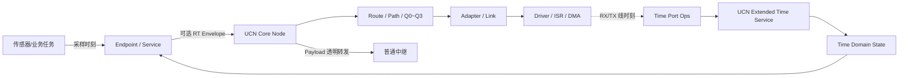

# UCN 可选实时元数据与分布式时间同步详细设计方案

> 文档级别：`PROPOSED DESIGN`

> 实现状态：`RT-00..07 EXTERNAL REVIEW GO / LIMITED EXPERIMENTAL SOFTWARE SCOPE`（RT-A01～A11 已整改并通过外部复审；生产接线与 RT-08/09 实机仍 HOLD）
> 适用基线：UCN Core Wire v5、Q0～Q3、Endpoint/Service、Protocol Owner
> 事实基线：`main@69901bf`，2026-09-03
> 硬件状态：已有默认不链接的 Host 软件实现与模拟，没有 MCU 固件、真实存储、硬件时间戳或实机证据
> 变更边界：本文及实验 archive 不修改当前生产 Wire、Node/Service RX/TX、Storage 或默认 Feature

## 1. 结论先行

UCN 需要补充时间能力，但不应把一个固定时间戳强行塞进所有基础帧。推荐方案是：

1. **保持当前基础 Core Frame 不变**，不需要时间语义的消息继续保持零额外 Wire 字节；Feature 开启后的代码、全局 Domain 状态和查询开销另行计量；
2. 先定义候选固定 16 B 的端到端 `Realtime Envelope v1`，由具体 Endpoint/业务流选择是否携带；在 RT-00A 的代际、误差和队列合同通过外审前不冻结；
3. 把时间模式分成 `NONE / LOCAL_STAMP / SYNCED_STAMP / DEADLINE`，同一节点的不同 Endpoint 可以选择不同模式；
4. 把“是否允许降级”独立分成 `DISABLED / PREFERRED / REQUIRED`，安全或控制业务禁止静默去掉时间信息；
5. 把跨节点时钟同步实现为可选 `UCN-Extended Time Service`，Core 在没有 Cluster、Linux 或 Time Service 时仍可独立运行；
6. ISR/Driver 只负责在最靠近物理收发的位置打点并通知 Owner，滤波、状态机和消息处理留在 Owner；
7. 第一阶段只让源端和目标端解释时间，旧中继透明转发 Payload；只有未来确实需要中继按 Deadline 排队时，才设计新的 Hop-visible Wire 扩展；
8. 时间戳解决“数据多老、事件何时发生、延迟如何测量”，确定性仍依赖固定路径、带宽准入、Q0/Q1 调度、有线介质、任务优先级和本地失联安全。

因此，本文目标不是把 UCN 宣称成 EtherCAT，而是在不破坏 MCU-first、小核心和多介质能力的前提下，为实时传感器、控制命令、分布式采样和延迟诊断建立统一时间合同。

## 2. 为什么需要这项能力

当前 UCN 已经能够区分目标 Node、Endpoint、Traffic Class 和 Route/Path，也能使用 Q1 Latest 避免旧样本无限排队。但是仅凭网络 Sequence 和接收顺序，目标节点仍无法回答以下问题：

- 一条 IMU 数据是什么时候采集的，而不是什么时候进入 UCN 队列的；
- 新路径上的后发数据先到、旧路径上的先发数据后到时，哪条才是更新样本；
- 一条舵机命令到达时是否已经超过业务允许的 5 ms；
- 两个不同 MCU 的传感器样本是否来自同一个采样时刻；
- 延迟来自源任务、排队、中继、介质还是目标任务；
- 多个节点能否在同一个目标时间执行动作。

应用可以各自在 Payload 中定义时间戳，但如果没有统一的字节序、单位、时钟域、同步质量、过期规则和失败语义，不同产品会形成互不兼容的私有实现。更严重的是，两个 MCU 都从开机零点开始计数时，数值相近并不表示时间相同；直接相减会得到看似合理但实际错误的单向延迟。

## 3. 当前实现基线

本文只在以下已经存在的事实之上设计，不把建议写成已实现能力。

| 当前能力 | 当前含义 | 本文要补的部分 |
| --- | --- | --- |
| `ucn_frame_t.sequence` | Frame 去重和会话内顺序，不等于传感器采样序号 | 采样时间、帧龄和时钟域 |
| `ucn_frame_t.session_id` | 区分发送端启动/会话 | 不能代替同步时钟 |
| Q0～Q3 | 重要程度与队列语义 | 不自动给出数据产生时间或到期时刻 |
| Q1 Latest | 同一业务键只保留最新排队值 | 路径乱序时仍应由业务采样序号/时间判新旧 |
| 本机 `now_ms`/Deadline | 驱动 Node、Transfer、Cluster 的本地超时 | 不能跨两个独立 MCU 直接比较 |
| `ucn_service_command_guard_t` | 可选 `issued_at_ms + valid_for_ms` | 仅在产品已定义共享毫秒时间域时有效，不是全局同步协议 |
| Link Metrics 时间 | 说明本地质量样本年龄 | 不随普通业务帧跨节点传播 |
| Event-driven Owner | 有数据时通知 Owner，不等待 Heartbeat | 仍需目标 BSP 证明调度和 Driver 尾延迟 |

当前 Wire v5 的 W0～W3 基础头分别是 17/21/26/30 B。已知 Flags 只覆盖 Route Extension、E2E Protected、Diagnostic 和 Path ID；当前 Decoder 会严格拒绝未知 Flag。基础 `ucn_frame_t` 没有通用时间字段，E2E AAD 也是当前固定合同。因此本文第一阶段不直接占用新 Core Flag，避免旧中继无法解码和安全 AAD 漏绑。

## 4. 目标与非目标

### 4.1 必须达到的目标

- 同一节点能够同时运行无时间、仅本地时间、同步时间和 Deadline 四类流；
- 编译关闭时间 Feature 时不增加时间代码和状态；Feature 开启但 Endpoint 选择 `NONE` 时不增加该消息的 Wire 字节，也不为该消息增加独立时间队列字段；
- 时间模式由 Endpoint/流合同决定，不能由中间路由随意修改；
- REQUIRED 实时业务在时间域、能力或同步质量不足时失败关闭；
- 简单中继无需参与同步，也能透明转发端到端时间 Envelope；
- Nano/Lite/Full 能通过编译期 Feature 控制代码和 RAM；
- 同步状态、时间转换和 Deadline 判断使用固定内存、整数算法和有界循环；
- ISR 不做 Frame 解码、滤波、路由或业务回调；
- 时间服务不成为 Core 自组网、静态路由或 Linux 兼容的运行依赖；
- 所有性能与精度结论必须绑定介质、打点位置、拓扑、Profile 和实测分位数。

### 4.2 明确不解决的事情

- 不把非确定性的 Wi-Fi/ESP-NOW 变成硬实时总线；
- 不把电机电流环、FOC、姿态内环等微秒级闭环迁移到网络；
- 不依赖一个时间戳字段消除排队、重传、退避或任务调度抖动；
- 不要求全网只有一个 Time Master 或所有节点加入同一时钟域；
- 不在第一阶段实现中继按绝对 Deadline 调度；
- 不用 `VOLATILE_TEST` 或软件模拟冒充掉电安全、硬件时间戳和目标板精度；
- 不直接复制 EtherCAT 的固定主从、环形拓扑或专用硬件处理模型。

## 5. 三个相互独立的配置维度

设计必须把“时间内容”“降级策略”“中继行为”分开。把三者压成一个布尔开关，会让普通遥测和安全控制无法表达不同要求。

### 5.1 时间模式 `ucn_time_mode_t`

| 模式 | Wire 内容 | 是否需要共享时钟 | 主要用途 |
| --- | --- | --- | --- |
| `NONE` | 不携带 Envelope | 否 | 温度、普通参数、日志、OTA、非实时业务 |
| `LOCAL_STAMP` | 本地采样时刻 | 否 | 同一源内排序、采样间隔、日志关联 |
| `SYNCED_STAMP` | 同步域采样时刻和误差 | 是 | 单向延迟、跨节点事件排序、分布式采样 |
| `DEADLINE` | 同步时刻、误差和最大帧龄 | 是 | 舵机命令、实时 setpoint、过期即无意义的数据 |

`NONE` 不编码一个“全零时间结构”，而是完全没有 Envelope，保证该消息零额外 Wire 字节。若产品仍编译了 Time Service，其全局代码和静态 Domain 状态不因此消失，必须在资源报告中单列。

### 5.2 要求级别 `ucn_time_requirement_t`

| 要求 | 行为 |
| --- | --- |
| `DISABLED` | 该 Endpoint 禁止时间 Envelope；收到带 Envelope 的 ABI 变体应拒绝 |
| `PREFERRED` | 首选带时间版本；能力不满足时只能走产品明确配置的无时间 Endpoint/降级路径，并向调用者报告降级 |
| `REQUIRED` | 目标、时钟域、路径或同步质量不满足时返回失败；禁止静默改成 `NONE` |

`PREFERRED` 不是“发送函数偷偷删掉 16 B 继续发”。产品必须显式提供 fallback Endpoint、ABI 版本或上层回调，调用者能够知道最终采用哪种语义。

### 5.3 中继模式 `ucn_time_relay_mode_t`

| 模式 | 中继责任 | 第一阶段是否实现 |
| --- | --- | --- |
| `END_TO_END_TRANSPARENT` | 时间 Envelope 在 Payload 内，中继按普通帧转发，不读取时间 | 是，推荐默认 |
| `HOP_AWARE_DEADLINE` | 中继能够看见并验证 Deadline，用于丢弃/调度/选路 | 否，后置到新 Wire/AAD 设计 |

## 6. 总体架构



责任边界如下：

- **业务任务/传感器 Driver**：提供真实采样时刻，决定数据过期后是否仍有意义；
- **Endpoint/Service**：冻结该业务流的时间 ABI、Requirement 和错误处理；
- **Core Node**：保持现有地址、路由、Traffic Class、Sequence 和安全边界；第一阶段不解析端到端 Envelope；
- **Time Service**：维护时钟域、Master、offset、drift、uncertainty 和同步状态；
- **Time Port Ops**：把平台的单调微秒时钟及可选硬件 RX/TX 时间戳映射为统一接口；
- **Adapter/Driver/ISR**：尽可能靠近物理事件打点，只搬运有界数据并通知 Owner；
- **产品安全状态机**：决定过期、失联、未同步时保持、回中、降级还是断能。

## 7. Endpoint 与业务流配置

时间模式应该绑定到 Endpoint 或稳定业务流，而不是绑定到整个 Node。一个 Node 同时运行 IMU、温度、参数、日志和舵机命令时，各流可以不同。

概念配置如下；这不是当前公共 API：

```c
typedef enum ucn_time_mode {
    UCN_TIME_NONE = 0,
    UCN_TIME_LOCAL_STAMP = 1,
    UCN_TIME_SYNCED_STAMP = 2,
    UCN_TIME_DEADLINE = 3
} ucn_time_mode_t;

typedef enum ucn_time_requirement {
    UCN_TIME_DISABLED = 0,
    UCN_TIME_PREFERRED = 1,
    UCN_TIME_REQUIRED = 2
} ucn_time_requirement_t;

typedef struct ucn_time_policy {
    ucn_time_mode_t mode;
    ucn_time_requirement_t requirement;
    uint16_t clock_domain_id;
    uint32_t max_age_us;
    uint32_t max_uncertainty_us;
    uint32_t max_local_holdover_us;
    bool allow_local_holdover;
    bool allow_preferred_remote_holdover;
    bool require_sample_hardware_capture;
    bool require_link_hardware_timestamp;
} ucn_time_policy_t;
```

`max_local_holdover_us/allow_local_holdover` 只约束“运行该 Policy 的本节点”自身 Domain：发送端用它决定是否还可生成 Envelope，接收端用它决定是否还能计算接收时间。它不能被接收端误用为远端 Source 的可验证 holdover age。`allow_preferred_remote_holdover` 只对 PREFERRED 接收生效，并受第 8.4 节的信任边界限制；REQUIRED 固定忽略并拒绝远端 HOLDOVER。

`max_uncertainty_us` 的唯一规范语义是“该本地 Endpoint 允许的端到端组合 uncertainty 上界”，不是单独的发送端上界或接收端上界。接收与执行准入必须使用：

```text
U = checked_add(decoded_sender_uncertainty_upper_us,
                current_receiver_uncertainty_upper_us)
accept_uncertainty = both_known && U <= max_uncertainty_us
```

uncertainty 门限是包含上界：`U == max_uncertainty_us` 接受，`U == max_uncertainty_us + 1` 拒绝；这与 Deadline 的半开时间区间是两个不同合同。发送端可以在自身 uncertainty 已经大于自己的发送 Policy 时提前停止发送，因为任意非负接收端误差只会让 `U` 更大，但该优化不能替代目标端对组合 `U` 的最终判断。若未来需要分别限制 Source/Local，必须新增具名字段，不能赋予当前单字段第二种解释。

Policy 的 canonical 规则是：`SYNCED_STAMP/DEADLINE` 必须配置非零 `max_uncertainty_us`；`NONE/LOCAL_STAMP` 不执行跨节点 uncertainty 准入并要求该字段为 0。组合加法始终提升到 `uint64_t` 后检查，不能用 32-bit 回绕结果作比较。

示例产品表：

| Endpoint | 数据 | Traffic Class | 时间模式 | Requirement |
| --- | --- | --- | --- | --- |
| `IMU_RAW_V1` | 高频 IMU | Q1 | `SYNCED_STAMP` | `REQUIRED` |
| `SERVO_SETPOINT_V1` | 舵机目标 | Q0 | `DEADLINE` | `REQUIRED` |
| `BARO_STATUS_V1` | 气压状态 | Q1 | `LOCAL_STAMP` | `PREFERRED` |
| `PARAM_WRITE_V1` | 参数写入 | Q0/Q2，按产品合同 | `NONE` 或 Command Guard | `DISABLED` |
| `LOG_CHUNK_V1` | 日志 | Q3 | `NONE` | `DISABLED` |
| `OTA_BLOCK_V1` | OTA/文件 | Transfer/Q3 | `NONE` | `DISABLED` |

同一个 Endpoint 的 Wire ABI 必须固定。如果一个产品既允许带时间又允许不带时间，推荐使用两个 Endpoint 版本或在产品 ABI 中显式定义稳定的 discriminant；不能仅凭 Payload 首字节“猜测是否有 Envelope”。

## 8. Realtime Envelope v1

### 8.1 为什么先放在 Payload

第一阶段把 Envelope 放在业务 Payload 最前面，而不是 Core Header，原因是：

1. 当前旧中继已经能透明转发任意业务 Payload；
2. 不需要新增 Core Flag、改变 W0～W3 Header Size 或升级所有中继；
3. Envelope 自动被当前 Frame CRC 覆盖；使用 E2E Protected 时还会作为 Payload 被加密和认证；
4. 未启用的 Endpoint 没有任何额外 Wire 字节；
5. Time Service 可以独立迭代，不增加 Nano Core 的强制状态；
6. 未来如果确实需要中继看见 Deadline，再通过新 Wire 版本和新 AAD 合同单独实现。

### 8.2 固定 16 B 编码

候选编码使用网络大端序：

| Offset | 大小 | 字段 | 规则 |
| ---: | ---: | --- | --- |
| 0 | 1 B | `version_mode` | bits 7..4=`1`；bits 3..2 保留且必须为 0；bits 1..0=`1/2/3` |
| 1 | 1 B | `quality_flags` | bits 7..3=uncertainty class；bit2=`SAMPLE_CAPTURE_HW`；bit1=`DOMAIN_TIME_VALID`；bit0=`SOURCE_HOLDOVER` |
| 2 | 2 B | `clock_domain_id` | 0 表示没有共享域；同步模式必须非 0 |
| 4 | 4 B | `domain_generation` | 同一逻辑 Domain 的时间轴代数；同步模式必须非 0 且禁止回绕复用 |
| 8 | 8 B | `capture_time_us` | 数据实际采集/产生时刻；uint64 微秒 |

候选总大小固定为 16 B。固定大小比可变 TLV 更容易在小 MCU 上验证、计算 MTU 和形成 Golden Vector；但该布局只有在第 10.4 节的 `STATIC_MASTER v1` 防 ABA 合同通过外审后才能冻结。

建议冻结 `clock_domain_id=0` 为“无共享域”、`0xFFFF` 为非法/保留，产品可使用 `1..0xFFFE`。`domain_generation` 使用 `1..0x7FFFFFFF`，达到阈值前必须建立新的 Domain Identity；不得回绕到 1 后继续让旧 Envelope 或同步响应匹配。

### 8.3 uncertainty class

`quality_flags.bits[7:3]` 表示同步误差上界：

```text
0..30  => uncertainty_upper_us = 2^class
31     => unknown / unsynchronized
```

例如 class 0 表示误差上界 1 us，class 10 表示 1024 us，class 14 表示 16384 us。它是发送端声明的保守上界，不是平均误差。接收端先解码该上界，再与自己在接收时刻的本地 uncertainty 上界作检查加法；只有组合值满足第 7 章的 `U <= max_uncertainty_us` 才能通过。

上界不是由 RTT 平均值直接产生。每个同步节点必须先以检查/饱和的 `uint64_t` 算术计算：

```text
sync_uncertainty_upper_us
  = timer_resolution_bound_us
  + link_timestamp_capture_bound_us
  + path_asymmetry_bound_us
  + filter_residual_bound_us
  + ceil(abs(oscillator_rate_bound_ppb) * holdover_age_us / 1,000,000,000)
  + arithmetic_rounding_bound_us

sender_uncertainty_upper_us
  = sync_uncertainty_upper_us
  + sample_capture_bound_us

receiver_uncertainty_upper_us
  = 接收端在 RX 打点/读取 Domain Time 时的 sync_uncertainty_upper_us

end_to_end_uncertainty_upper_us
  = checked_add(decoded_sender_uncertainty_upper_us,
                receiver_uncertainty_upper_us)
```

各项定义如下：

| 分量 | 必须证明的来源 | 无法证明时的处理 |
| --- | --- | --- |
| `timer_resolution_bound_us` | 单调计数器分辨率、读数同步和单位换算的最大量化误差 | unknown |
| `link_timestamp_capture_bound_us` | RX/TX 打点位置到真实线事件的硬件或有界软件误差 | unknown；不得声称硬件时间戳 |
| `path_asymmetry_bound_us` | 产品针对冻结 Path/Bearer/拓扑给出的保守上界，数值必须不小于 `ceil(abs(d_forward-d_reverse)/2)` | 样本只能进入诊断统计；不得进入有效滤波或改变 Domain 状态 |
| `filter_residual_bound_us` | 固定窗口滤波在已接受样本上的最大残差界，不是标准差或平均值 | unknown |
| `oscillator_rate_bound_ppb` | 数据手册温漂上界或目标板实测后向上取整的漂移上界 | HOLDOVER 不可用 |
| `sample_capture_bound_us` | 传感器采样事件到 `capture_time_us` 锁存之间的最大误差 | 仅允许软件打点且 Endpoint 接受时使用已证明的软件上界 |
| `arithmetic_rounding_bound_us` | 整数除法、定点换算和半往返计算的累计向上舍入界 | unknown |

量化算法必须是唯一且向上保守的：

```text
S = sender_uncertainty_upper_us
if 任一必需分量 unknown、发生溢出、或 S > 2^30 us:
    class = 31
else:
    S = max(1 us, S)
    class = 最小的 k∈[0,30]，使 2^k >= S
```

禁止向下取整，例如发送端上界 `S=1025 us` 必须编码为 class 11，不能编码为 class 10。Envelope 只编码发送端的 `S`；目标端解码后再与当前接收端上界做 checked-add 得到组合 `U`，不得把组合 `U` 预先写回 Envelope。class 31 不得参与 Deadline 放行。四时间戳交换必须绑定第 12.4 节定义的 Wire 可见事务键；每个节点再把自己拥有的 T1/T4 或 T2/T3 绑定到本地 Link Instance/event key。任一本地 Path/Link Instance 或 Wire Session/generation 改变时，当前节点只能原子撤销自己的 pending/key，不能声称同步撤销对端对象。

本节所称 Path 只指已经逐跳安装、具有独立 Path ID，且在一次同步事务内不可变的定向 Path，不包含自动路由缓存选出的普通动态 Route。二者采用以下不可混用的准入规则：

- 已安装且事务期间不可变的定向 Path 若没有可信 `max_asymmetry_us`，PREFERRED 可以显式发起四报文诊断事务，但结果必须标记为 `ASYMMETRY_UNKNOWN / DIAGNOSTIC_ONLY`。该结果不进入有效同步滤波窗口、不增加连续有效样本数、不能推动全局 Domain 从 `ACQUIRING` 进入 `LOCKED`、不能设置 `DOMAIN_TIME_VALID`，也不能生成 `SYNCED_STAMP` 或 `DEADLINE` Envelope；PREFERRED 最终只能向调用者返回诊断结果，或显式回退 LOCAL/NONE；
- 普通动态 Route 无论是否能暂时找到下一跳，都不得创建 v1 同步事务。PREFERRED 必须显式回退到 LOCAL/NONE，不能分配 Master/Member sync pending，也不能发送 `TIME_SYNC_V1`、`TIME_FOLLOW_UP_V1`、`TIME_DELAY_REQ_V1` 或 `TIME_DELAY_RESP_V1`；REQUIRED 直接失败关闭；
- 这项限制与当前安全边界一致：Path ID 进入 E2E AAD，而动态 Route Epoch 不进入 E2E AAD，也不是双方共享、可在整个事务期间冻结的身份。未来若希望动态 Route 参与同步，必须设计并外审新的认证事务身份，不能放宽 v1。

`LOCKED`、有效滤波窗口和 Domain uncertainty 都属于每个 Time Domain 的全局状态，不按 Endpoint 的 `PREFERRED/REQUIRED` 各维护一份。Requirement 只决定调用方在缺少有效同步时间时是失败还是显式降级，绝不能改变样本是否可信。只有 Path identity、时间戳、认证、replay、deadline、全部 uncertainty 分量及可信 asymmetry bound 都通过的样本，才能称为 `VALID_SYNC_SAMPLE` 并进入滤波/FSM；任一必需分量 unknown 时仍按 class 31/unknown 处理。

### 8.4 模式的规范组合

| 模式 | `clock_domain_id` | `domain_generation` | `DOMAIN_TIME_VALID` | uncertainty | Deadline 来源 |
| --- | ---: | ---: | ---: | ---: | --- |
| `LOCAL_STAMP` | 0 | 0 | 0 | 31/unknown | 不适用 |
| `SYNCED_STAMP` | 非 0 | 非 0 | 1 | 0..30 | 不执行通用过期门禁 |
| `DEADLINE` | 非 0 | 非 0 | 1 | 0..30 | 目标 Endpoint 本地 `max_age_us` |

`SOURCE_HOLDOVER=1` 表示发送端声明自己在生成该 Envelope 时处于 HOLDOVER；它没有携带可由接收端独立验证的远端 holdover age。因此 v1 采用以下唯一规则：

- 发送端只有在自己的 `allow_local_holdover=true`、本地 holdover age 小于 `max_local_holdover_us`，且本地 uncertainty 已知并未超过自己的发送 Policy 时才可置位并发送；这只是必要的源端早期门禁，目标端仍必须计算组合 `U`；
- REQUIRED 接收端无条件拒绝 `SOURCE_HOLDOVER=1`，不把发送端自检当成远端证明；
- PREFERRED 接收端也默认拒绝；只有 `allow_preferred_remote_holdover=true`、E2E 身份通过专用 ACL，且产品明确接受“信任远端自检而非本地验证”时才可继续；
- 接收端自己的 HOLDOVER 由本地 `allow_local_holdover/max_local_holdover_us` 独立判断，不能与 Source 位混为一个条件；
- 若未来需要 REQUIRED 接收远端 HOLDOVER，必须另行设计可认证的新鲜 lease/age 证明并重开 Wire/控制面外审，不能仅复用当前 1-bit 声明。

`max_age_us` 不由发送端在通用 Envelope 中声明。它是目标 Endpoint 的本地可信策略；否则发送端可以把本应 5 ms 过期的命令自行扩展成 5 s。发送端可以通过已冻结的产品命令 ABI 提供一个更短期限，但接收端最终使用：

```text
effective_max_age = min(local_endpoint_max_age,
                        optional_sender_tighter_age)
```

非法组合必须整体拒绝且 output 不写回，例如：

- Envelope mode 为 0；
- version 不是 1；
- 任一保留位非 0；
- LOCAL_STAMP 声称 `DOMAIN_TIME_VALID`、`SOURCE_HOLDOVER` 或 `SAMPLE_CAPTURE_HW` 与 Endpoint 采样合同冲突；
- LOCAL_STAMP 携带非零 Domain/Generation；
- SYNCED_STAMP 的 domain 为 0；
- 同步模式的 `domain_generation` 为 0、回退或复用；
- DEADLINE Endpoint 的本地 `max_age_us` 为 0 或大于 `INT32_MAX`；
- Endpoint 规定 REQUIRED DEADLINE，但收到 NONE/LOCAL；
- Endpoint 规定 `max_uncertainty_us=100`，收到的 sender class 6 解码为 64 us、接收端本地上界为 37 us，组合 `U=101 us`。

### 8.5 采样时刻，不是发送调用时刻

`capture_time_us` 应表示业务数据产生时刻：

```text
传感器硬件采样
  ↓ capture_time_us 在这里
ISR/DMA
  ↓
传感器任务处理
  ↓
Service/Node 入队
  ↓
Link 真正发送
```

如果发送接口在最后一步才读取当前时间，就会把源任务排队和处理时间隐藏掉，接收端得到的不是数据真实年龄。

`SAMPLE_CAPTURE_HW` 只表示传感器采样事件由硬件锁存到 `capture_time_us`，不表示 Link 的 RX/TX 具有硬件时间戳。后者通过 `TIME_LINK_RX_HW_STAMP` / `TIME_LINK_TX_HW_STAMP` capability 和 Time Port 事件合同单独表达；两者不能互相替代。

### 8.6 复合 Payload 顺序、ABI 与 32 B 预算

第一阶段必须冻结以下组合，禁止接收端猜测前缀：

```text
普通 Endpoint：              Business Payload
普通 Command Endpoint：      Command Guard(12 B) | Business Payload
Timed Endpoint：             Realtime Envelope(16 B) | Business Payload
Timed Command Endpoint：     Realtime Envelope(16 B) | Command Guard(12 B) | Business Payload
```

现有 Command Guard 解码器从 Payload offset 0 读取 12 B，因此在它前面插入 Envelope 必须使用新的 Endpoint/ABI 版本；旧 Endpoint 的布局不得原地改变。Timed 接收顺序固定为：Core 完成 CRC/Security 后，先解析 16 B Envelope，再从 offset 16 解析 Command Guard，最后把 offset 28 之后的业务数据交给 handler。

当前 `UCN_SERVICE_MAX_PAYLOAD_BYTES` 默认为 32 B，组合预算为：

| 组合 | 固定前缀 | 默认剩余业务字节 |
| --- | ---: | ---: |
| 无时间、无 Guard | 0 B | 32 B |
| 仅 Realtime Envelope | 16 B | 16 B |
| 仅 Command Guard | 12 B | 20 B |
| Envelope + Guard | 28 B | 4 B |

产品若需要更大的实时命令，必须在编译期提高 Service Payload 上限并重新测量队列 RAM/MTU，或冻结更紧凑的产品专用 ABI；不能截断、静默移除 REQUIRED Envelope，也不能把 Transfer 当作硬实时 Deadline 的自动替代品。

### 8.7 Timed Command 与 Command Guard 的统一时间合同

现有 Command Guard 的 `issued_at_ms` 是 32-bit 毫秒值，旧验证函数按传入的本地 `now_ms` 做回绕差值；它只能继续服务于旧的非 Timed Endpoint，不能直接用来验证 Domain 微秒时间。Timed Command 使用独立 ABI 和验证 helper，冻结以下规则：

1. `capture_time_us` 对 Timed Command 表示“命令签发时刻”，不是传感器采样或进入发送队列时刻；
2. `guard.issued_at_ms` 必须精确等于 `(uint32_t)(capture_time_us / 1000U)`，即向下量化后的低 32 位；它只用于把 Guard 与同一 Envelope/generation 绑定，不独立计算年龄；
3. 接收端不得把 Domain Time 的低 32 位传给现有 `ucn_service_command_guard_validate()`。Timed helper 先验证 Domain/generation/Envelope，再验证上述低位等式和 Command ID 单调性；
4. `guard.valid_for_ms` 是发送端可选的更严格期限，转换为 `guard_max_age_us = valid_for_ms * 1000U`；乘法以 `uint64_t` 检查执行；
5. 最终期限为 `effective_max_age_us = min(local_endpoint_max_age_us, guard_max_age_us)`；两者都按半开区间判断，`age_upper_us < effective_max_age_us` 才接受，恰好等于即过期；
6. `/1000` 的余数只影响绑定值，不参与年龄计算，所以不会丢失最多 999 us 后又放宽 Deadline；真正年龄始终使用 Envelope 的完整 `uint64_t capture_time_us`；
7. 32-bit 毫秒低位自然回绕不单独比较；Envelope 的 `domain_id + generation + uint64 capture_time_us`、Source Session、Command ID 和 E2E 认证共同消除歧义。

旧非 Timed Command 的 Guard 编码和 `now_ms` 合同保持不变。产品不能在同一个 Endpoint 中根据 Payload 猜测使用旧验证器还是 Timed 验证器。

## 9. 接收端时间与过期判定

### 9.1 LOCAL_STAMP

接收端不能把远端本地 uptime 与自己的 uptime 相减。LOCAL_STAMP 只能用于：

- 同一 Source/Session/Endpoint 内比较先后；
- 检查采样间隔是否异常；
- 与业务 sample sequence 联合检测重复、回退和跳号；
- 记录日志，但必须同时标注 Source 和 Session。

### 9.2 SYNCED_STAMP

只有满足以下全部条件，`rx_age_valid` 才能为真：

1. 接收端当前 Time Domain 为 LOCKED；或者本地 Endpoint 显式 `allow_local_holdover=true`，且接收端自己的 holdover age 小于 `max_local_holdover_us`、本地 uncertainty 仍有可证明上界；
2. Envelope 的 `clock_domain_id` 与本地 Domain 完全一致；
3. Envelope 的 `domain_generation` 与本地当前 generation 完全一致，且 Source Session 没有回退或复用；
4. 发送端与接收端 uncertainty 都有上界，检查加法得到的组合值 `U` 满足 `U <= max_uncertainty_us`；不再分别把同一个字段解释成 Source 或 Local 门限；
5. `capture_time_us` 不在允许的未来误差之外；
6. 计算使用饱和/检查算术，没有 uint64 下溢或溢出。

令 `R=receive_domain_time_us`、`C=capture_time_us`、`U=checked_add(decoded_sender_uncertainty_upper_us,current_receiver_uncertainty_upper_us)`。先拒绝 unknown、加法溢出或 `U > max_uncertainty_us`，再执行下面唯一的 future-skew 和保守年龄公式：

```text
if C > R:
    future_delta = C - R
    if future_delta > U:
        reject FUTURE_TIMESTAMP
    age_upper_us = U - future_delta
else:
    age_upper_us = (R - C) + U
```

当 `future_delta == U` 时两个不确定区间刚好接触，`age_upper_us=0`，future gate 可以通过；`future_delta == U+1` 必须拒绝。任一加法、减法或单位转换溢出都拒绝。对诊断可以同时报告 `max(0,R-C)` 的估计年龄和上述上界；对安全决策只能使用上界。

### 9.3 DEADLINE

```text
accept = age_upper_us < effective_max_age_us
```

其中普通 DEADLINE 的 `effective_max_age_us` 是目标 Endpoint 的本地可信 `max_age_us`；Timed Command 再按第 8.7 节与 Guard 的更短期限取最小值。半开区间与现有 `ucn_deadline_expired()`、Command Guard 的“到达边界即过期”语义保持一致。若超时，目标端应在调用业务 handler 前拒绝，记录 `EXPIRED` reason，并按业务合同选择是否发送 Result。过期命令不能因为队列恢复、路由恢复或重放而重新执行。

若 Endpoint 为 REQUIRED，而时钟未锁定、Domain 不匹配或 uncertainty 超标，应失败关闭，不得把 `age_valid=false` 当成“可能还新鲜”继续执行。

### 9.4 两级 Deadline 门禁与队列所有权

一次“入队时有效”不能证明“执行时仍有效”。DEADLINE 消息必须通过两个独立门禁：

1. **接收准入门**：完成 Core CRC/Security/Replay 和 Endpoint ABI 识别后，在写入 Service Inbox 前计算当前 `age_upper_us`；已过期或时间状态不合格时不占用 Inbox。
2. **执行准入门**：业务 Owner 从 Inbox 取出消息后、产生任何外设写入或业务副作用之前，使用当时的 Domain Time 重新解码并计算 `age_upper_us`；已经过期时丢弃并记录 `EXPIRED_AT_EXECUTION`。

为避免给每个普通消息增加 RAM，Realtime Envelope 必须一直保留在 Service 固定 Payload 数组中，直到执行准入完成；不在 `ucn_service_message_t` 中追加 capture/deadline 字段。`NONE` 消息仍只保存原业务 Payload。Timed Inbox API 只返回对原 Payload 的解析视图和业务区间，不复制 16 B 元数据；失败时 output/view 不写回。

若 `inbox_take` 与真实业务副作用之间还可能被任务调度、Mutex 或外设等待长期阻塞，产品必须在副作用前再次调用同一个执行准入 helper。UCN 不允许缓存一个早先的 `expired=false` 结果无限期使用。Q0 只影响调度优先级，不豁免第二次检查。

对 Timed Command，执行准入顺序为：

```text
重新验证 Realtime Envelope 和 Domain
  -> 重新计算 age_upper/max_age
  -> 验证 Command Guard/幂等与本地安全状态
  -> 仅在全部通过后执行副作用
```

两个门禁分别统计 `expired_at_receive` 和 `expired_at_execution`，用于区分网络迟到与本地任务排队迟到。两者都不得污染 Core 的链路错误统计。

## 10. Time Domain 模型

### 10.1 Time Domain 不是整个 UCN 网络

一个 UCN Network 可以同时存在多个时间域和未同步节点：

```text
Domain 10：飞控 + IMU + 舵机
Domain 20：相机 + 云台 + 伴随计算机
无 Domain：温度、日志、普通执行器
```

路由只回答“如何到达 Node”；Time Domain 回答“双方时间能否比较”。二者不能混成同一 ID。

### 10.2 建议状态机

| 状态 | 含义 | 是否允许 REQUIRED SYNCED/DEADLINE |
| --- | --- | --- |
| `UNSYNCED` | 没有可信 Master/样本 | 否 |
| `ACQUIRING` | 正在收集连续有效样本 | 否 |
| `LOCKED` | offset/drift/uncertainty 满足产品门限 | 是 |
| `HOLDOVER` | 暂时失去同步报文，使用最后频率估计并扩大 uncertainty | 只表示本节点 Domain 是否还能支撑 REQUIRED；远端 `SOURCE_HOLDOVER` 仍按第 8.4 节固定拒绝 |
| `FAULT` | Master 回退、身份冲突、时间跳变或算术异常 | 否，需重新建立 Domain |

建议对象只保存固定状态：

```c
typedef struct ucn_time_domain_state {
    uint16_t domain_id;
    ucn_node_id_t master_node_id;
    ucn_session_id_t master_session_id;
    uint32_t domain_generation;
    uint8_t state;
    int64_t offset_us;
    int32_t rate_ppb;
    uint32_t uncertainty_us;
    uint64_t last_sync_local_us;
    uint8_t consecutive_valid_samples;
} ucn_time_domain_state_t;
```

该结构只是候选形状，正式 API 前必须测量每 Profile 的对齐和实际 `sizeof`。

### 10.3 时间不能倒退

`ucn_time_domain_now_us()` 对外返回的 Domain Time 必须单调不减：

- 首次进入 LOCKED 前允许一次建立 offset；
- `ACQUIRING -> LOCKED` 只统计第 8.3 节定义的 `VALID_SYNC_SAMPLE`；诊断事务、unknown asymmetry、class 31 或任一失败关闭样本既不增加有效样本数，也不更新 offset/drift/filter residual；
- LOCKED 后的小偏差使用 slew/rate correction 渐进修正；
- 会导致时间倒退的修正不得直接 step；
- 大幅跳变、Master generation 回退或身份冲突进入 FAULT/ACQUIRING；
- 最大 HOLDOVER 到期时只销毁 acquisition/filter 状态，不清除同一
  `domain_generation` 已接受样本和已发布时间的高水位；旧或相同本地采样仍按
  replay 拒绝；
- 同 generation 重新 ACQUIRING/LOCKED 后，必须在把 phase 写成 `LOCKED` 之前按
  候选 offset/rate 预计算 Domain Time；若低于已发布高水位，`ingest_sample()`
  当场进入 FAULT、返回错误且不得瞬时暴露 `LOCKED`。首版不做无证明的 clamp 或
  反向 step；
- 只有绑定更大 `domain_generation` 的合法 Master rebind 才能建立新的高水位域。
- Master 重启必须形成新 domain generation，不能沿用旧 replay history；达到 no-wrap 阈值后必须分配新 Domain Identity，不能自然回绕。

### 10.4 `STATIC_MASTER v1` 的 generation 与防 ABA 合同

首版只允许一个产品静态配置并经身份认证的 Master Node。32-bit `domain_generation` 仅在下列全部约束成立时视为足够；任一约束不接受，就必须在 RT-00 重新评审并扩大为更强的 Domain Era/Boot Identity：

- `clock_domain_id` 由产品配置/配网分配，不能由普通入网节点临时自选；同一产品安全域内禁止两个物理 Master 共用相同 Master Identity；
- Master 为每次启动或重新取得 Time Authority 分配严格递增的 generation，范围 `1..0x7FFFFFFF`；达到阈值后停止该 Domain，并通过重新配网取得新的 Domain ID，绝不回绕；
- generation 必须先通过第 10.5 节的独立 high-water witness 原子保留并回读证明，再通过状态双槽/原子 Provider `persist -> reload -> verify`；两层全部完成后 Master 才能发送该 generation 的 SYNC/FOLLOW_UP/DELAY_RESP 或宣称 LOCKED，任一层提交失败、PENDING、损坏或回读不一致均失败关闭；
- 持久记录至少绑定 `{schema, domain_id, master_node_id, last_generation, commissioned, crc}`。产品还必须在该易损记录之外保留可信的“设备/Domain 已配网”标记（例如安全配置区、OTP/eFuse 或受保护的产品状态）；已经投运的 Domain 若记录缺失或损坏，不得把 `FACTORY_EMPTY` 当成 generation 1 重新启动，只能恢复记录，或由操作者重新配网为新的 Domain ID；
- Member 每次启动先进入 `ACQUIRING`，以本次本地 Session/随机 challenge 与配置的 Master Node、Master Session、generation 建立新鲜认证握手。没有新鲜握手时，即使收到结构合法的旧同步序列或业务 Envelope，也不能进入 LOCKED；
- Member 只接受当前认证 Master 的控制报文，并维护 `max_seen_generation`。若产品要求跨自身重启仍抵抗离线重放，则持久化该上界；若不持久化，则必须依赖不可重放的启动 challenge 完成当前 Master 证明后才接受业务时间；
- 同步样本、`WireTimeTxnKey`、capability lease 和业务 Envelope 都绑定当前 generation。generation 改变会让两端各自清空本地旧样本、pending token、滤波状态与协商缓存；旧数据不得在新代际下重新变为有效。

首版明确不支持 `MANUAL_FAILOVER_SET`、多个并行 Master 或分区内自治选主。网络分区只能导致成员进入 HOLDOVER/UNSYNCED，不能让另一个节点复用当前 generation 自行接管。未来若要主备 Master，必须引入持久 Authority/Fence 或更强 Era Identity，并重新审查 16 B Envelope；不能仅靠比较两个 Master 的 generation 数值。

### 10.5 已分配 generation 高水位与损坏恢复

双状态槽只解决撕裂写，不自动证明 anti-rollback。首版 REQUIRED Master 还必须有独立的 `issued_generation_high_water` witness，它表示“已经保留、绝不能再次使用的最大 generation”，无论该 generation 最后是否成功发布。witness 必须绑定 `{schema, domain_id, master_node_id, high_water, crc/auth}`，并由产品提供以下两种能力之一：

1. 硬件单调计数器、OTP/eFuse bitfield 或安全元件计数器；
2. 经单独审计的追加式/冗余 Flash witness Provider，能够证明已提交高水位不会在单槽损坏后回退。

witness 不能与 Domain 状态共用同一对槽、同一个“选最新有效槽”算法或同一个可回退 selector；状态槽损坏不能让 witness 跟随回退。Flash witness 若检测到较新非擦除项损坏、序列空洞或认证失败，也不得静默选择较旧 witness，必须按存储矛盾失败关闭。

若产品只有普通双槽状态、无法提供上述 witness，则遇到任一非擦除坏槽、槽序歧义、两个槽都损坏或无法判断哪个 generation 曾经发布时，必须永久 fail-closed，直到操作者以新的 Domain ID 重新配网；不允许自动选择较旧有效槽后继续递增。

Master 取得新 generation 的唯一顺序是：

```text
1. load + verify witness H
2. 原子保留 H+1，并 reload 证明 witness.high_water == H+1
3. 将 Domain 状态 generation=H+1 写入另一状态槽
4. reload + canonical/journal 校验状态槽
5. 清空旧样本/pending，进入 ACQUIRING
6. 只有完成以上步骤后才允许发布该 generation 的同步控制报文
```

所有可能在同一执行域并发调用 Provider 的 Time Authority 必须引用同一个调用方
持有的 `ucn_time_authority_callback_gate_t`。Gate 通过同一组
`ucn_port_ops_t.enter_critical/exit_critical` 保护逻辑 active owner；不得使用无同步的
进程静态指针，也不得用 `volatile` 冒充 SMP 同步。Gate 在并发开始前初始化，一旦
被 Authority 引用就不得移动或重新初始化。`load/reserve/store/poll` 都必须在调用
外部 Provider 前原子取得 Gate，并在回调返回后精确释放；回调中的递归
`init/start/poll` 或另一 Authority 同时进入时，必须在零二次 Provider I/O 和零对象
写回下失败关闭。Time Authority Provider 当前只允许任务上下文，不提供 ISR 调用
合同。

步骤 2 后任何失败都允许跳过该 generation，但绝不允许复用。重启恢复规则为：

| witness/状态槽 | 处理 |
| --- | --- |
| witness H 有效，最高有效状态槽也是 H | 先保留 H+1，再建立新启动 generation |
| witness H 有效，最高有效状态槽小于 H | 旧槽只可用于诊断/恢复配置，不能发布；直接保留 H+1 并重建 ACQUIRING 状态 |
| witness H 有效，状态槽都损坏 | 仅当产品静态配置和可信 commissioned 标记仍匹配时，保留 H+1 后重建；否则 fail-closed |
| 任一有效状态槽 generation 大于 witness H | 存储矛盾，fail-closed |
| witness 缺失、回退、损坏或无法认证 | fail-closed；不能根据状态槽猜测高水位 |

精确反例 `slot A=10`、`slot B=11` 已验证并发布过、随后 B 损坏时，witness 仍为 11；重启只能保留 12 或失败关闭，绝不能从 A 递增并再次发布 11。若步骤 2 已保留 11、步骤 3 尚未完成就掉电，重启同样跳到 12；浪费一个数值只影响寿命，不影响安全。达到 `0x7FFFFFFF` 后不能继续保留，必须换新 Domain ID。

## 11. Time Master 来源

Time Service 不强制依赖 Cluster，允许产品选择：

| 模式 | Master 来源 | 首版状态 | 适用情况 |
| --- | --- | --- | --- |
| `STATIC_MASTER` | 固定且认证的 Node ID | v1 唯一允许 | 小型飞控、固定布线、最简单 |
| `EXTERNAL_TIME` | GNSS/PPS、PTP Host、外部 RTC | 后续；先作为 STATIC_MASTER 的本地参考源 | 已有可信时间源 |
| `CLUSTER_HEAD_HINT` | Cluster Head 只提供候选 | 后续，不进入 v1 | 启用 Cluster 的网络；仍需 Time Service 自身 generation/Fence |
| `MANUAL_FAILOVER_SET` | 固定优先级 Master 集合 | 后续，必须重审 Domain Era | 主备控制器 |

Cluster Head 不天然等于最优时间源。Cluster 可能因成员/Authority 变化切换，而 GNSS/PPS 节点可能更稳定。即使使用 Head Hint，也必须把 Cluster Epoch 与 Time Domain generation 分开验证。

## 12. 同步报文和四时间戳流程

### 12.1 推荐两步同步

由于软件发送函数调用时刻通常不等于真正的线发送时刻，推荐支持两步 SYNC：

```text
Master                         Member
  |--- SYNC(sync_seq) ---------->|  捕获 T2
  |--- FOLLOW_UP(seq, T1) ------>|
  |<-- DELAY_REQ(seq) -----------|  捕获 T3
  |  捕获 T4                     |
  |--- DELAY_RESP(seq, T4) ----->|
```

- `T1`：Master 的 SYNC 实际线发送时刻；
- `T2`：Member 的 SYNC 实际线接收时刻；
- `T3`：Member 的 DELAY_REQ 实际线发送时刻；
- `T4`：Master 的 DELAY_REQ 实际线接收时刻。

在链路近似对称的前提下：

```text
mean_path_delay = ((T2 - T1) + (T4 - T3)) / 2
clock_offset    = ((T2 - T1) - (T4 - T3)) / 2
```

实现必须使用检查过的 64-bit 整数差值；输入乱序、跨 generation、超时、未来时间或范围溢出时整组样本拒绝。

### 12.2 单步优化

只有当硬件能够在发送帧时原位写入 T1，或者 Driver 能证明 API 返回前已经获得属于该帧的准确 T1，才允许省略 FOLLOW_UP。软件 `send()` 入口时间不能冒充线时间。

### 12.3 候选默认参数

以下仅用于第一版 Host/实机标定，不是当前产品默认：

| 参数 | 候选值 | 说明 |
| --- | ---: | --- |
| SYNC interval | 1000 ms | 普通有线起点；高速协作可缩短 |
| 连续有效样本 | 3 | 进入 LOCKED 前避免单样本误判 |
| 样本窗口 | 5 | 固定数组，不动态分配 |
| request timeout | 250 ms | 必须按最慢 Bearer/跳数重新预算 |
| HOLDOVER 起点 | 3 个周期未更新 | 开始扩大 uncertainty |
| HOLDOVER 最大时长 | 5 s | 超过后回 UNSYNCED，产品可覆盖 |
| Master generation no-wrap | 明确阈值前轮换 | 禁止自然回绕复用身份 |

同步周期越短，控制流量和功耗越高；周期越长，晶振漂移导致 uncertainty 增长更快。最终值必须由目标晶振、温度、介质和控制需求测定。

### 12.4 同步控制面的承载与容量合同

首版同步控制面冻结为 UCN Extended 的四个静态 Endpoint ABI，而不是新增 Core Message Type 或 Flag：

| 符号 | 候选固定 Endpoint | 方向 | Traffic Class | 队列语义 |
| --- | ---: | --- | --- | --- |
| `TIME_SYNC_V1` | `0xBC` | Master -> Member | Q1 | 每 Peer 只保留最新 sync sequence |
| `TIME_FOLLOW_UP_V1` | `0xBD` | Master -> Member | Q1 | 与最新 SYNC 精确匹配 |
| `TIME_DELAY_REQ_V1` | `0xBE` | Member -> Master | Q1 | 每 Peer 只允许一个 pending |
| `TIME_DELAY_RESP_V1` | `0xBF` | Master -> Member | Q1 | 与 Wire 事务键精确匹配，且 Master 本地 T4 已完成 |

这些编号目前只是 RT-00 冻结候选；在代码实现前必须同步修改 Endpoint 编号规范并检查产品冲突。在此之前 `0xBC..0xBF` 仍不能被称为已发布保留号。四类消息均为单播；广播 SYNC 与集中式 DELAY_REQ 风暴不进入 v1。每条消息都必须使用 E2E 认证、独立 replay window 和第 12.1 节的 `sync_seq`。

跨节点只共享并认证一个 `WireTimeTxnKey`。它不含任何一端的本地 timestamp token 或 Link Instance generation：

```text
domain_id + generation + sync_seq
master Node ID + master Session
member Node ID + member Session
forward Path Identity  = owner Node + owner Session + Path ID + destination
reverse Path Identity  = owner Node + owner Session + Path ID + destination
```

上述完整键必须由四个控制报文的 Payload/外层 Path 字段共同携带并受 E2E 认证；每个报文还必须校验自己的 message role。当前四个候选 Endpoint 尚未冻结具体 Payload，RT-00 必须为“当前方向的外层 Path Identity”和“反方向的回显 Identity”分配确定字节并形成 Golden Vector。首版四报文同步只允许使用两条已安装、在事务期间不可变的定向 Path。缺少可信非对称上界时，PREFERRED 最多完成一次显式诊断事务；诊断结果必须与 `VALID_SYNC_SAMPLE` 分流，不能更新滤波、有效样本计数或全局 Domain 状态，也不能为任何 Endpoint 生成有效同步时间。普通动态 Route 的本地 Route Epoch 不是双方共享身份，也不受当前 E2E AAD 保护，任何 Requirement 都不得用它创建 v1 同步事务；PREFERRED 只能显式回退 LOCAL/NONE，且不得分配 pending 或发送四类时间同步控制帧，或等待未来另行审计的新 Wire/诊断 ABI。

RT-00 冻结时必须按下面的最小可执行映射编码，不能只写“实现自行关联”：

| 消息 | 建立/核对 Wire 事务的要求 |
| --- | --- |
| `TIME_SYNC_V1` | 外层必须命中 forward Path；Payload 携带 Domain/generation/`sync_seq`、Member Session 和完整 reverse Path Identity，用于一次性建立完整 `WireTimeTxnKey`；Master 在提交前原子保留 T1_TX key，T1 在该帧实际发送时完成 |
| `TIME_FOLLOW_UP_V1` | 外层 forward Path、Domain/generation/`sync_seq` 必须与既有键完全一致；发送前 Master 本地 T1 必须完成 |
| `TIME_DELAY_REQ_V1` | 外层必须命中键中已冻结的 reverse Path，Domain/generation/`sync_seq` 必须一致；发送前 Member 本地 T2 已完成且 T3_TX key 已原子保留，T3 在该帧实际发送时完成 |
| `TIME_DELAY_RESP_V1` | 外层 forward Path、Domain/generation/`sync_seq` 必须一致；发送前 Master 本地 T4 必须完成，Payload 只携带 T4 等 Wire 数据，不携带 Member token；Member 只有本地 T3 也完成后才能计算样本 |

Source Node/Session 由当前方向的认证外层身份提供；缺少的对端 Session 必须在建立消息中显式携带。任何为节省字节而改用 hash/短引用的方案，都必须先冻结碰撞域、canonical 输入和失败关闭规则，不能默认把有碰撞的 32-bit 摘要当作完整身份。若该映射无法在选定 Profile/MTU 内用单帧表达，RT-00 必须回退重新设计，不能用 Transfer 或多片重组冒充实时同步控制帧。

`sync_seq` 由 Master 在当前 `{domain_id,generation,member}` 域内以 checked-next 分配，有效范围固定为 `1..0x7FFFFFFF`；0 非法，到顶后必须停止并建立新 generation，新 generation 才可从 1 重新开始。Path Identity 变化必须使用新的 `sync_seq`；Member 只有在完整认证的新 SYNC 使用严格更新的 sequence 时，才可原子撤销自己的旧 MemberPending 并建立新项。完全相同的 SYNC 重放只能幂等忽略，不能延长 deadline；其他角色、旧 sequence 或字段不完整的报文都不能淘汰现有 pending。

T1～T4 是四个不同节点/方向的物理事件，不能共享一个 token。分布式事务固定映射为：

| 时间戳 | 物理事件 | event key 的本地拥有者 |
| --- | --- | --- |
| T1 | Master 发送 `TIME_SYNC_V1` 的 TX 线时刻 | Master 的 `T1_TX` key |
| T2 | Member 接收同一 `TIME_SYNC_V1` 的 RX 线时刻 | Member 的 `T2_RX` key |
| T3 | Member 发送 `TIME_DELAY_REQ_V1` 的 TX 线时刻 | Member 的 `T3_TX` key |
| T4 | Master 接收同一 `TIME_DELAY_REQ_V1` 的 RX 线时刻 | Master 的 `T4_RX` key |

event key 只在本节点 Driver/Time Owner 内关联物理事件，不跨节点比较，也不放入 Wire。FOLLOW_UP 携带 Master 在本地 `T1_TX` key 完成后得到的 T1；DELAY_RESP 携带 Master 在本地 `T4_RX` key 完成后得到的 T4；Member 只在自己的 pending 中保存 T2/T3。对端只验证消息的 `WireTimeTxnKey`、角色、认证和 replay，不得尝试匹配发送端的本地 token。

Master 与 Member 使用不同的本地 pending 形状：

```text
MasterPending = WireTimeTxnKey + T1_TX key/state + T4_RX key/state + deadline
MemberPending = WireTimeTxnKey + T2_RX key/state + T3_TX key/state + deadline
```

每个 pending 槽必须保存 `{expected_event_role,WireTimeTxnKey,event_key}`；一个 event key 在其生命周期内只属于 T1/T2/T3/T4 中的一个角色，不能跨角色复用。Master 从不保存或取消 Member 的 T2/T3 key，Member 也从不保存或取消 Master 的 T1/T4 key。

失效只在单节点本地原子发生：本节点发现本地 Path 失效、Link close/reopen、Link Instance generation 改变、Domain/Session 改变或 deadline 到达时，撤销自己拥有的 pending/event key，并把当前 `sync_seq` 标记为已消费，绝不能再用迟到回调生成控制报文。另一个节点的 pending 不会被远程内存操作取消，只能通过以下可验证事件收敛：收到认证且严格更新的 Session/generation/Path Identity/`sync_seq`、收到 RT-00 后续可能冻结的认证 Abort subtype，或者本地 transaction/sync-lease timeout。若 v1 不分配 Abort subtype，timeout 是强制恢复路径，任何远端变化都不能让本地无限保持 LOCKED。

迟到的本地 timestamp event 必须因旧 Link Instance generation/event key 被拒绝且不写状态；迟到的 Wire 报文必须按旧 `WireTimeTxnKey`、replay window 和 deadline 裁决。已在旧 Path 上完成全部本地打点并在切换前发出的合法响应可以按原事务完成；切换后才到达的旧硬件回调不能复活事务。任何节点都不能把“我已撤销”推导成“对端也已撤销”。即使两条 Path Identity 不变，也只有产品给出可信 `max_asymmetry_us` 才能把样本标记为 `VALID_SYNC_SAMPLE` 并供整个 Time Domain 使用；不存在“仅供 PREFERRED 使用的有效同步样本”。缺少该证明的结果始终只是诊断数据。

Master 按 Node ID 的确定性顺序轮询成员，并以 `hash(domain_id, member_node_id) mod sync_interval` 分散首轮相位；不允许所有节点启动后同时请求。每 Peer 固定一个 pending slot，slot 满不淘汰旧事务，新请求返回 `BUSY/NO_SPACE`；Master 每个 Owner step 最多提交一条同步控制帧，并受每 Link token bucket 与最小发送间隔约束。候选默认 `UCN_TIME_SYNC_MAX_PEERS=4`、每 Peer 1 个 pending、`5 ms` 最小控制帧间隔；产品扩大 Peer 数前必须重新计算 RAM、Q1 等待上界和最慢多跳链路容量。Q1 只是及时且可合并的控制队列选择，不是 Deadline 保证；REQUIRED 产品必须单独证明同步控制流与业务流共同负载下的最大排队时间。

## 13. Adapter、Port、ISR 与 Owner

### 13.1 不直接破坏现有 Port API

当前 `ucn_link_ops_t.send()`、`ucn_adapter_rx_item_t` 和 `ucn_protocol_owner_rx_enqueue()` 都不携带 timestamp token，因此仅增加两个 `read_*_timestamp(token)` 回调无法把时间戳与具体帧关联。RT-00 必须先冻结独立、带 `struct_size/api_version` 的可选扩展，而不是继续向现有结构尾部追加字段或让 Driver 返回“最近一次时间戳”。候选形状如下：

```c
typedef struct ucn_time_event_key {
    uint8_t link_id;
    uint8_t direction;
    uint32_t link_instance_generation;
    uint32_t event_token;
} ucn_time_event_key_t;

typedef struct ucn_time_link_ops {
    size_t struct_size;
    uint16_t api_version;
    ucn_result_t (*reserve_tx_token)(void *context,
                                     const ucn_time_event_key_t *key);
    ucn_result_t (*submit_timestamped)(void *context,
                                       const ucn_time_event_key_t *key,
                                       const uint8_t *frame,
                                       size_t length);
    ucn_result_t (*cancel_tx_token)(void *context,
                                    const ucn_time_event_key_t *key);
    ucn_result_t (*quiesce)(void *context);
} ucn_time_link_ops_t;

typedef struct ucn_time_tx_timestamp_event {
    ucn_time_event_key_t key;
    uint64_t timestamp_us;
    uint8_t quality;
    ucn_result_t completion;
} ucn_time_tx_timestamp_event_t;

typedef struct ucn_time_timed_rx_item {
    ucn_link_t *ingress_link;
    ucn_time_event_key_t key;
    uint64_t timestamp_us;
    uint8_t quality;
    uint16_t length;
    uint8_t data[UCN_MAX_FRAME_BYTES];
} ucn_time_timed_rx_item_t;
```

TX 使用两阶段所有权：Time Owner 先取得唯一 token 并在固定 pending 表中登记，再把 `{完整 Time Sync 控制帧,event key}` 作为一个不可拆分的发送项进入专用有界队列；不能把 frame 与 key 分别写入两个队列后依赖顺序配对。Driver 只有原子接受同一发送项后才能使 TX-complete 事件可见。这样即使完成回调很快，也不会在 pending 建立前产生无法关联的事件。普通 `ucn_link_ops_t.send()` 及普通 Node/Service Queue 不增加 token 字段。

专用发送路径不能绕过 UCN 的地址、Pinned Path、Security、Replay 或 Profile/MTU 检查。RT-04 需要提供一个独立的 timed-control send owner：它让 Core 构造并认证标准 Endpoint Frame，在已冻结 Path 上选定源端 egress Link 后，把 `{frame,event key}` 原子交给该 Link 的 `submit_timestamped()`。只有源 Master/Member 的第一跳 egress 和目标端最后一跳 ingress 参与 T1～T4 打点；中间透明中继仍走普通 `send()`，不创建 timestamp token。

RX 不能使用“普通 frame Ring + 独立 timestamp sidecar Ring 再按顺序配对”。timestamp-capable Source 必须原子写入一个完整 `ucn_time_timed_rx_item_t`；只有整条记录成功复制后才推进 queue head 并通知 Time Owner。任一容量不足都整项丢弃并计数，绝不能出现 frame 已入队、timestamp 丢失或反向情况。普通 `ucn_adapter_rx_item_t` 保持不变；无法原子提供 Timed RX Item 的 Adapter 不得发布 `TIME_LINK_RX_HW_STAMP`。

token 合同必须满足：

- token 命名空间按 `{Link Instance, direction}` 隔离，0 非法，活动 token 不得复用；
- Link Instance generation 和 event token 都使用 `1..0x7FFFFFFF`；0 非法，二者都按 checked-next 严格递增；
- Link 每次 close/reopen 都先撤销旧 pending/event，再递增 `link_instance_generation`；达到阈值时进入 Time Link FAULT，不能在原对象中回绕或清零复用；
- 只有硬件控制器/DMA/回调源已停止、所有事件队列已清空、Time Owner 重新初始化且 Node 建立新 Session 后，产品才可创建新的 Link Instance 命名空间；
- event token 达到阈值时停止分配；不得只清空 pending 后从 1 重新开始；
- TX timestamp event ring、原子 Timed RX Ring 或 pending 表满时返回 `NO_SPACE` 并计数，不覆盖旧项；
- REQUIRED 硬件时间戳路径在 token/时间戳缺失时失败关闭，不能静默改用软件时间；PREFERRED 只有 Endpoint 明确允许且报告降级时才可改用有界软件打点；
- 同一个 key 的重复 completion 只允许幂等丢弃，冲突 timestamp/completion 进入 FAULT；
- 以上结构仅在 `UCN_FEATURE_TIME_HW_TIMESTAMP` 打开时实例化，不改变普通 Adapter Queue 的 RAM 布局。

RT-04 实际候选进一步把本地 key 生命周期冻结为固定 reservation：

```text
allocate/reserve -> RESERVED -> submit success -> SUBMITTED
RESERVED         -> cancel success             -> FREE
SUBMITTED TX     -> completion                  -> FREE
RESERVED RX      -> completion                  -> FREE
RESERVED/SUBMITTED -> Owner retire              -> FREE
```

同一 key 不得重复 submit；提交后的 TX 不能通过普通 cancel 撤回，只能由完成事件或
Owner 的显式 retire 消费。Driver callback 期间的控制 API Fence 不是无同步的进程
静态变量，而是调用者拥有的执行域共享对象：所有可并发 Timed Link 必须引用同一个
gate，其 task/ISR 回调必须保护同一物理锁，并且在任何 Link 引用后不得重新初始化或
移动。任何 Driver callback 活动期间，另一 Link 的任务 TX/RX 与 ISR RX 分配都必须
失败且不能先消耗 token。若 gate 与 per-Link 锁复用同一原语，该原语必须支持
`gate → Link` 的固定嵌套顺序。

Time Sync 的 pending 不能直接 `memset` 丢弃未完成的 T1/T3。超时、较高 sequence
替换和 Path switch/Abort 必须先记录到固定 release-obligation 队列；Owner 必须按
`peek → Timed Link retire → exact ack/pop` 顺序处理。retire 失败时 obligation 仍在
队首，下一轮继续重试；错误 key 不能 ACK 或移除队首。release 队列满时保持原事务并
失败关闭，不能为了回收 pending 而泄漏 Driver reservation。

### 13.2 ISR 允许与禁止的工作

ISR/Driver Callback 可以：

- 读取硬件捕获寄存器或本地单调计数器；
- 把完整 TX timestamp event 或原子 Timed RX Item 写入各自固定 Ring；
- 搬运 DMA/Driver 数据所有权；
- 通知 Protocol Owner/Time Owner。

ISR 不可以：

- 解码 UCN Frame；
- 执行四时间戳计算和滤波；
- 修改 Time Domain FSM；
- 查路由、调用 Endpoint 或打印同步日志；
- 阻塞等待 TX 完成或获取任务上下文 Mutex。

### 13.3 Owner 顺序

一次事件唤醒建议按有界预算执行：

```text
1. drain TX timestamp event ring（不超过本轮事件预算）
2. drain 原子 Timed RX Item ring（不超过本轮 RX 预算）
3. 按 T1_TX/T2_RX/T3_TX/T4_RX 角色，把本节点拥有的完整 event key 关联到本地 pending
4. 处理 Time Service 控制报文并校验完整 `WireTimeTxnKey`；不得读取或猜测对端 event key
5. 更新 Domain 状态/uncertainty
6. 处理普通 Node/Service/Transfer 工作
7. 计算下一 deadline 并重新等待
```

连续流量必须受最大轮数/时间预算约束，避免 Time Service 或某个高速 UART 独占 MCU。

## 14. 中继节点怎么处理

### 14.1 第一阶段：透明中继

Envelope 位于业务 Payload 内。B、C 中继执行当前完整 Frame 校验、Hop/Route/Path 处理后，按 Payload 原样转发：

```text
A（同步源） → B（不同步） → C（不同步） → D（同步接收端）
```

B、C 不需要保存 offset、drift 或 Time Domain，也不需要知道 Payload 是 IMU 还是温度。使用 E2E Protected 时，中继甚至看不到 Envelope 明文。

该模式能够解决目标端帧龄、跨节点采样和日志关联，但不能让 B、C 根据 Deadline 抢占自己的发送队列。

### 14.2 后续：Hop-aware Deadline

若未来要求中继执行“已经来不及就不再转发”或 Deadline-aware 排队，必须单独设计 Hop-visible 元数据。该字段至少需要：

- 明确的新 Core Wire 版本或受协商的 Header Extension；
- Header Size、MTU、CRC 和严格长度的新 Golden Vector；
- E2E AAD v2，把不可修改的 Deadline/Domain 字段纳入认证；
- 若有中继可修改 residence/budget 字段，还需要逐跳认证和只减不增规则；
- 路径上的每个中继都声明并证明 `HOP_DEADLINE_V1`；
- 旧中继不能被当作透明支持者；
- 与路由切换、多 Bearer、加密 Gateway 和重放窗口联合审计。

在生产安全 S02 和新 Wire 审计完成前，不应在当前 v5 Flags 中直接塞入一个未认证的可变 Deadline。

## 15. 能力发现与协商

建议将能力分成以下独立位，不使用一个模糊的 `REALTIME_SUPPORTED`：

```text
TIME_META_V1          能编解码 16 B Envelope
TIME_SYNC_CLIENT_V1   能作为同步客户端
TIME_SYNC_MASTER_V1   能作为同步 Master
TIME_SAMPLE_HW_CAPTURE 有传感器采样事件硬件锁存
TIME_LINK_RX_HW_STAMP 有 Link RX 线时刻
TIME_LINK_TX_HW_STAMP 有 Link TX 线时刻
TIME_HOP_DEADLINE_V1  能处理未来 Hop-visible Deadline
```

端到端透明模式只要求源和目标支持 `TIME_META_V1`；中继不需要该位。Hop-aware 模式要求整条 Path 上所有节点支持。

协商结果应绑定：

```text
destination Node
destination Session
Endpoint/ABI version
time mode
clock domain
required capabilities
Path ID / Route Epoch（若要求固定路径）
lease/deadline
```

目标重启、Session 变化、Path 切换、Domain generation 变化或 capability lease 到期后，旧结果必须失效。REQUIRED 流在重新证明前停止，不得使用陈旧协商缓存继续发送。

## 16. QoS、路由与实时性的关系

时间模式不替代 Traffic Class：

| 概念 | 回答的问题 |
| --- | --- |
| Q0～Q3 | 当前消息相对其他消息多重要、采用什么队列语义 |
| Timestamp | 数据何时产生 |
| Sequence/sample sequence | 数据是否比上一条更新 |
| Max Age/Deadline | 数据最晚何时还有业务意义 |
| Route/Path | 消息走哪条路 |
| Link Cost | 哪条路当前质量更好 |
| Time Domain | 两个时间是否可以直接比较 |

实时流建议：

- Q0 控制命令使用预建或 `PINNED_STRICT` Path，避免首次发送临时寻路；
- Q1 传感器流保持 Latest，Payload 同时带业务 sample sequence；
- 自动负载均衡不应把同一实时流逐帧散到延迟差异很大的路径；
- 路径切换时保留时间和 sample sequence，由目标端拒绝迟到旧值；
- Cost 可以使用 RTT/队列压力选择路径，但不能把“平均 Cost 低”当作 Deadline 必达证明；
- REQUIRED Deadline 流需要单独做带宽准入，不能只依赖 6:3:2:1 软件权重。

## 17. 安全合同

### 17.1 端到端 Envelope

Envelope 放在 Payload 前缀时：

- 普通未保护帧只有 CRC，能发现随机损坏，不能抵抗恶意篡改；
- E2E Protected 帧对 Envelope 与业务数据一起加密/认证；
- 中继不能修改 capture time、domain、generation 或 uncertainty；max age 来自接收端可信 Endpoint Policy，不在通用 Envelope 中；
- 接收端的 Endpoint Policy 是本地可信配置，发送端不能通过修改 Envelope 把 REQUIRED 降为 OPTIONAL；
- `capture_time_us`、Source、Session、Endpoint 和业务 Command ID 应共同进入产品重放/幂等判断。

### 17.2 Time Service 控制面

SYNC/FOLLOW_UP/DELAY 报文必须绑定：

- Network ID、Source Node、Session；
- Domain ID、Master generation、sync sequence；
- 消息方向和角色；
- 请求与响应对应的完整 `WireTimeTxnKey`、消息角色和 sync sequence；本地 event key 不上 Wire，也不作为远端认证输入；
- 产品级身份认证和 replay window；
- 速率限制和固定 pending slot。

未认证节点不能通过宣称更精确的 uncertainty 成为 Time Master。Master 切换必须先失效旧 generation，再建立新样本，不能把两个时间轴直接拼接。生产 REQUIRED SYNCED/DEADLINE Endpoint 必须使用 E2E Protected 与 Endpoint ACL；未保护 Envelope 只能用于明确的诊断/实验或由产品另行证明为可信隔离的物理域，不能作为安全执行依据。即使消息通过认证，UCN 也只能证明“哪个被授权 Source 声明了什么时间”，不能防止已经受信任但故障/恶意的传感器虚报采样时刻，产品仍需源端健康监测。

## 18. Profile 与资源边界

推荐的默认 Feature 组合：

| Build Profile | Envelope | 透明转发 | Sync Client | Sync Master | Hop-aware |
| --- | --- | --- | --- | --- | --- |
| Nano | 可选编解码 | 天然支持 Payload 转发 | 默认关 | 关 | 关 |
| Lite | 可选编解码与帧龄判断 | 支持 | 可选小状态 | 默认关 | 关 |
| Full | 完整 Envelope/Domain/诊断 | 支持 | 可选 | 可选 | 后续 Feature |
| Host | 完整 | 支持 | 可选 | 可选外部时间源 | 后续 Feature |

建议编译期开关：

```text
UCN_FEATURE_TIME_METADATA
UCN_FEATURE_TIME_SYNC_CLIENT
UCN_FEATURE_TIME_SYNC_MASTER
UCN_FEATURE_TIME_HW_TIMESTAMP
UCN_FEATURE_TIME_HOP_DEADLINE
```

资源必须在实现后由编译器测量。设计阶段只给预算目标：

| 能力 | 静态 RAM 预算目标 | 说明 |
| --- | ---: | --- |
| Envelope Codec | 0～16 B 常驻状态 | Codec 应可在调用者对象上工作 |
| 单 Time Domain Client | 48～96 B | offset、rate、样本窗口、状态和统计 |
| 单 Master/每 Peer | 32～64 B/Peer | 必须固定最大 Peer 数 |
| TX Timestamp Event Ring | 配置决定 | 每项完整 event key+timestamp+quality+completion，满时丢弃并统计，不能覆盖未消费项 |
| Atomic Timed RX Ring | 配置决定 | 每项原子保存完整 frame+event key+timestamp；只由启用硬件时间戳的 Link 创建，普通 Adapter Queue 不增加字段 |
| Domain State Persistence | Provider/双槽决定 | 保存当前 Domain 状态并 reload 证明；双槽本身不承担 anti-rollback |
| Generation High-water Witness | Provider/硬件决定 | REQUIRED STATIC_MASTER 必需；独立证明已保留 generation 的单调高水位，不能由普通双槽状态替代 |

所有对象禁止动态内存。低 RAM 产品可以只启用 Metadata Codec，完全不创建 Time Domain 或样本窗口。Envelope 保留在现有 Payload 数组意味着不新增逐消息时间字段；但若产品为了补偿 16/28 B 前缀而提高 `UCN_SERVICE_MAX_PAYLOAD_BYTES`，所有相关固定队列项都会随上限增大，不能继续宣称“零 RAM 增量”。

## 19. Wire 与吞吐开销

启用 Envelope 的消息固定增加 16 B Payload：

| 原业务 Payload | 额外 16 B 相对业务数据开销 |
| ---: | ---: |
| 16 B | 100% |
| 32 B | 50% |
| 64 B | 25% |
| 128 B | 12.5% |
| 224 B | 7.1% |

Envelope 计入当前 Frame/Service 的 Payload 上限：

```text
max_business_payload
  = min(endpoint_binding_limit,
        selected_profile_and_mtu_payload_limit)
  - 16 B
```

结果小于业务数据长度时必须在拥有队列前返回 `TOO_LARGE`，或者由产品选择更大 MTU/批量/Transfer；不得截断业务 Payload，也不得因为放不下就静默去掉 REQUIRED Envelope。

因此高频 IMU 不一定每个 12 B 样本发一帧。可以在 Deadline 允许范围内每帧批量 2～8 个样本，并让每个样本拥有相对第一个 capture time 的小偏移。批量提高效率，但会增加最早样本等待批次形成的时间，必须计入 max age。

Time Sync 控制流量取决于周期和 Peer 数。若每个成员每秒执行一次四报文同步，必须把 Header、安全 Tag、重传和多跳重复占用计入控制预算，不能只按 16 B 时间字段计算。

## 20. 建议公共 API 形状

以下为候选 API，用于说明所有权和调用顺序，不代表已冻结名称。

### 20.1 Metadata Codec

```c
ucn_result_t ucn_time_metadata_encode(
    const ucn_time_metadata_t *metadata,
    uint8_t output[UCN_TIME_METADATA_V1_BYTES]);

ucn_result_t ucn_time_metadata_decode(
    const uint8_t input[UCN_TIME_METADATA_V1_BYTES],
    ucn_time_metadata_t *metadata);
```

失败时 output 不写回；函数不分配内存、不读取全局时钟。

### 20.2 Domain

```c
ucn_result_t ucn_time_domain_now_us(
    const ucn_time_domain_t *domain,
    uint64_t local_monotonic_us,
    uint64_t *domain_time_us,
    uint32_t *uncertainty_us);
```

UNSYNCED/FAULT 时返回 `UCN_ERR_STATE` 且 output 不写回。

### 20.3 Timed Send

```c
ucn_result_t ucn_service_send_timed_ex(
    ucn_service_router_t *router,
    const ucn_service_send_request_t *request,
    const ucn_time_send_options_t *time_options,
    ucn_service_send_result_t *result);
```

现有 `ucn_service_send_ex()` 保持等价于 `TIME_NONE`。新函数先验证 Endpoint Policy、Domain 和 MTU，再一次性拥有消息；失败前不得部分入队。

### 20.4 Receive View

```c
typedef struct ucn_time_receive_view {
    bool metadata_present;
    bool age_valid;
    ucn_time_mode_t mode;
    uint16_t clock_domain_id;
    uint64_t capture_time_us;
    uint64_t estimated_age_us;
    uint64_t age_upper_us;
    bool expired;
    ucn_time_reject_reason_t reason;
} ucn_time_receive_view_t;
```

业务 handler 只在 Policy admission 通过后获得消息；诊断接口可以看到被拒原因，但不得让已过期 Q0 进入执行队列。

执行前必须复用同一套纯校验函数，而不是信任入队时生成的 view：

```c
ucn_result_t ucn_service_timed_execution_admit(
    const ucn_service_message_t *message,
    const ucn_time_policy_t *policy,
    const ucn_time_domain_t *domain,
    uint64_t local_monotonic_us,
    ucn_time_receive_view_t *view,
    const uint8_t **business_payload,
    size_t *business_length);
```

该函数从排队 Payload 重新解析 Envelope/Guard、重新读取 Domain 状态并计算年龄；任何失败保持所有 output 哨兵不写回。它不拥有消息、不执行 handler。若业务任务取出消息后还会等待，必须在产生副作用前再次调用。

### 20.5 当前默认关闭候选的实际接口边界

RT-01～RT-07 的实验 archive 已实现与上述形状等价但名称更明确的接口。当前实现
以 `ucn_realtime_*`、`ucn_time_domain_*`、`ucn_timed_link_*` 和
`ucn_time_sync_*` 为前缀；它们尚未成为生产 Node/Service API。需要特别注意：

- `ucn_realtime_uncertainty_aggregate()` 只聚合同步固定分量与 Path asymmetry；
  `sample_capture_bound_us` 由发送 Policy 在生成 Envelope 前另行 checked-add；
- `ucn_realtime_clock_view_t.uncertainty_known`、
  `ucn_time_sync_sample_t.uncertainty_known` 和 Domain 配置的
  `oscillator_uncertainty_known` 都必须显式为真，零值不代表零误差；
- `ucn_timed_link_complete_event()` 只处理正常完成，
  `ucn_timed_link_retire_event()` 处理超时/切路后的 Owner 回收；
- `ucn_time_sync_master_peek_released_event()` / `member_peek` 只查看但不移除
  obligation；Owner 成功调用 Timed Link retire 后，才以对应的
  `*_ack_released_event()` 精确移除队首，失败则保留到下一轮重试；
- REQUIRED 接收同时要求 E2E 和 `source_acl_authorized`，二者不是替代关系。

这些接口仍处于外审 HOLD，不能被本节文字理解为生产 ABI 已冻结。

## 21. 完整发送与接收流程

### 21.1 发送端

```text
1. Sensor/Task 取得真实 capture_time
2. 查询 Endpoint 的 Time Policy
3. NONE：按当前 API 发送
4. LOCAL：用本地单调时间构造 Envelope
5. SYNCED/DEADLINE：读取 Domain view 和 uncertainty
6. 检查 REQUIRED/PREFERRED、max uncertainty、MTU 和目标 capability
7. 按固定 ABI 序列化 `16 B Envelope + 可选 12 B Command Guard + 业务 Payload`
8. 交给现有 Service/Node/Q0～Q3/Route/Path
9. 记录最终采用模式；降级必须显式返回
```

### 21.2 中继

```text
1. 当前 Core 完整收帧、CRC/Security/Replay/Route 检查
2. 不解析业务 Envelope
3. 更新 Hop/Route 可变字段
4. Payload 原样转发
```

### 21.3 目标端

```text
1. Core 完成现有 Frame/Security/Endpoint admission
2. Endpoint binding 决定是否期望 Realtime Envelope
3. 严格解码版本、模式、保留位和字段组合
4. 读取接收端 Domain Time 与 uncertainty
5. 计算接收时的 age_upper
6. 检查 Mode、Requirement、Domain、HOLDOVER、组合 `U <= max_uncertainty_us` 和 max age
7. 失败：统计 reason，可选返回 Result，不写 Inbox
8. 成功：保留完整前缀并写入 Inbox
9. 业务 Owner 在任何副作用前重新解码并计算执行时 age_upper
10. 第二次失败：记录 `EXPIRED_AT_EXECUTION`，不调用业务 handler；成功后才暴露业务区间
```

## 22. 异常与恢复规则

| 异常 | REQUIRED 行为 | PREFERRED 行为 |
| --- | --- | --- |
| 目标不支持 Metadata v1 | 发送失败 | 走显式 fallback Endpoint，并报告降级 |
| Time Domain 未锁定 | 不入队/不执行 | 可转 LOCAL/NONE，但必须由产品允许且报告 |
| 接收端本地 HOLDOVER | 仅本地 Policy 明确允许，且本地 holdover age、uncertainty 与消息 age 全部合格时继续 | 同样必须显式允许并报告当前状态 |
| 远端 `SOURCE_HOLDOVER=1` | 固定拒绝；v1 没有可验证的发送端 holdover age 证明 | 默认拒绝；仅产品显式信任发送端自检、启用 E2E 认证与 ACL 时允许，并报告该信任降级 |
| Domain ID 不匹配 | 拒绝 | 不把远端时间用于年龄计算 |
| 组合 `U` 超过本地 Endpoint 的 `max_uncertainty_us` | 拒绝 | 标记 age invalid 或显式降级；不得改成只检查 Source/Local 单项 |
| 消息已过期 | 目标 handler 前丢弃 | 同样丢弃；过期不是可降级条件 |
| Master 重启/generation 变化 | 旧样本失效，重新 ACQUIRING | LOCAL 流不受影响 |
| Path 切换 | 业务时间元数据仍端到端保留；本节点立即撤销自己的未完成 pending/event，旧 Wire 事务由新认证键、可选 Abort 或超时在对端收敛 | 相同 |
| Timestamp Ring 满 | 丢弃时间样本并统计，不覆盖旧 pending token | 可继续普通数据，但不能伪造 HW 标志 |
| 计数器/算术异常 | FAULT/fail-closed | 不输出有效 age |
| 控制面认证失败 | 不更新 Domain/lease/filter | 丢弃并限速统计 |

## 23. 两个具体示例

### 23.1 IMU：同一节点同时有实时和普通流

节点 A 同时产生：

```text
IMU_RAW_V1       Q1 + SYNCED_STAMP + REQUIRED
TEMPERATURE_V1   Q1 + NONE
LOG_CHUNK_V1     Q3 + NONE
```

IMU 每个批次携带 16 B Envelope，目标 C 计算 age upper 并只保留最新 sample sequence。温度和日志沿用当前帧格式，不承担任何时间字节。中继 B 没有 Time Service，也能转发三类数据。

若 A 的 Time Domain 进入 UNSYNCED，IMU 发送返回失败或进入产品本地安全策略；温度和日志继续工作。时间功能故障不能拖垮整个 Node。

### 23.2 舵机命令：过期失败关闭

控制器 A 在 Domain 10 的 `1,000,000 us` 生成命令；目标 D 的 Endpoint Policy 固定 `max_age_us=5,000`。目标 D 收到时：

```text
receive_domain_time = 1,004,200 us
sender uncertainty = 200 us
receiver uncertainty = 300 us

age_upper = 4,200 + 200 + 300 = 4,700 us
```

`4,700 < 5,000`，可以进入舵机任务；舵机任务仍要检查限位、模式和故障。

若第二条迟到命令的 `age_upper=6,100 us`，UCN Endpoint admission 在业务 handler 前拒绝，并可通过 Result Endpoint 返回 EXPIRED。不能因为它是 Q0 就执行过期命令。

## 24. 与 EtherCAT 的边界

EtherCAT 的确定性来自固定通信结构、周期调度、专用硬件在帧经过时读写数据和分布式时钟共同作用。本文能够逐步为 UCN补充：

- 可比较的采样时刻；
- 同步误差上界；
- 过期拒绝；
- 跨节点协同触发；
- 延迟诊断与路径标定。

但 UCN 仍有动态路由、存储转发、多种 Bearer、软件队列和 RTOS 调度，因此不能只因实现本方案就宣称 EtherCAT 级硬实时。若产品需要确定性，还要另外证明：

```text
固定/预建 Path
+ 每跳最坏序列化时间
+ 队列和带宽准入
+ Driver/DMA 最坏响应
+ Owner/任务最大调度间隔
+ 重传和故障策略
+ 目标执行器本地安全状态机
```

## 25. RT-00A 冻结前合同缺口与整改结论

本章记录 2026-09-03 五轮外部设计审计提出的合同缺口及当前整改。它是 RT-00 的前置门禁，不是“留到编码时决定”的备忘录；R15 已实现为诊断/有效样本硬分流并通过模块全体自审，但外部复审签字前，16 B Envelope 和候选 Time Endpoint 仍不得作为生产 ABI 冻结。

| ID | 已核实的缺口 | 本文整改 | 当前状态 |
| --- | --- | --- | --- |
| `RT-00A-01` | uncertainty class 没有可证明的组成和向上量化算法 | 第 8.3 节冻结分量、unknown、饱和求和和 ceil-log2；第 12.4 节要求认证的双向 `WireTimeTxnKey` 和可信 asymmetry bound | 文档自审通过，待外审 |
| `RT-00A-02` | 只在 Inbox 前检查 Deadline，不能阻止排队后过期执行 | 第 9.4 节冻结接收准入和执行准入两级门禁；Envelope 保留在现有 Payload 中，NONE 不增加队列字段 | 文档自审通过，待外审 |
| `RT-00A-03` | 当前 Link/RX/Owner API 无法让 token 与真实帧一一绑定 | 第 13 章冻结可选 timed Link 扩展、两阶段 TX token、原子 Timed RX Item、Link Instance/no-wrap/Ring 满合同 | 文档自审通过，待外审 |
| `RT-00A-04` | `domain_generation` 缺少分配、持久化、掉电和防 ABA 规则 | 第 10.4 节把 32-bit 字段限制在单一 STATIC_MASTER v1，并要求 persist-before-sync、reload 证明和新鲜启动握手 | 文档自审通过，待外审 |
| `RT-00A-05` | HOLDOVER、复合 Payload、硬件采样/链路打点和控制流量合同不统一 | 第 7～15、18～22 章统一 Policy、ABI 顺序、能力位、四 Endpoint 单播控制面和固定 pending/错峰预算 | 文档自审通过，待外审 |
| `RT-00A-R06` | 普通双槽无法证明损坏的较新槽从未发布，恢复后可能回退并复用 generation | 第 10.5 节新增独立 generation high-water witness；无法证明时永久 fail-closed/换新 Domain，禁止回退旧槽继续递增 | 第二轮整改自审通过，待外审 |
| `RT-00A-R07` | Timed Command Envelope 与现有 32-bit uptime Guard 时钟域不一致，Deadline 边界和 future-skew 未冻结 | 第 8.7、9.2、9.3 节规定 `capture_time_us` 是签发时刻、Guard 只作量化绑定、两个年龄上限取最小值、半开区间与 future-skew 唯一公式 | 第二轮整改自审通过，待外审 |
| `RT-00A-R08` | 接收端无法仅凭 1-bit `SOURCE_HOLDOVER` 验证发送端 holdover age | 第 8.4 节规定 REQUIRED 固定拒绝远端 HOLDOVER；PREFERRED 仅在显式信任、E2E 认证与 ACL 下例外 | 第二轮整改自审通过，待外审 |
| `RT-00A-R09` | T1～T4 共用单一 token、RX 双 Ring 顺序配对和 Link generation 回绕会产生错配/ABA | 第 12.4、13.1 节冻结四个独立 event key、原子 Timed RX Item、checked-next/no-wrap；第三轮再由 R11 分离 Wire 与本地所有权 | 第三轮补强自审通过，待外审 |
| `RT-00A-R10` | `max_uncertainty_us` 可被解释成 Source、Local 或组合门限 | 第 7、8.3、9.2 节冻结唯一组合公式 `U=sender+receiver`，目标端按 `U <= max` 闭区间判断，单项只允许做不改变结论的早期拒绝 | 第三轮整改自审通过，待外审 |
| `RT-00A-R11` | Wire Path Contract 错误包含双方本地 Link generation，并声称一个节点原子取消四个 event key | 第 12.4 节拆分 `WireTimeTxnKey`、Master/Member 本地 pending；节点只撤销自有 key，对端通过认证的新键、可选 Abort 或 timeout 收敛 | 第三轮整改自审通过，待外审 |
| `RT-00A-R12` | 舵机示例仍使用 `<=`，与半开 Deadline 合同冲突 | 第 23.2 节改为 `4,700 < 5,000`，并保持 uncertainty 门限的 `<=` 与 Deadline 的 `<` 明确分离 | 第三轮整改自审通过，待外审 |
| `RT-00A-R13` | “多跳动态路径可用于 PREFERRED”与“动态 Route 不得进入 v1 同步事务”互相矛盾 | 第 8.3、12.4 节把已安装且事务内不可变的 Path 与普通动态 Route 分开：前者可受限诊断；后者任何 Requirement 都不创建 v1 事务，PREFERRED 只回退 LOCAL/NONE | 外部复审 GO |
| `RT-00A-R14` | uncertainty class 示例把发送端编码值误写为组合 `U` | 第 8.3 节统一使用发送端 `S=1025 us`，并明确 Envelope 编码 `S`、目标端才计算组合 `U` | 外部复审 GO |
| `RT-00A-R15` | 无可信 asymmetry 的 PREFERRED 样本可能推动全局 Domain `LOCKED`，或遗漏 unknown 分量后生成有效 Envelope | 第 8.3、10.2、12.4 节把诊断结果与 `VALID_SYNC_SAMPLE` 强制分流；诊断不进滤波、不增加有效样本、不改变 Domain、不置 `DOMAIN_TIME_VALID`、不产生 SYNCED/DEADLINE Envelope | 第五轮整改自审通过，待外审 |

RT-00A 外审前保持以下硬边界：

- 16 B 仍是候选布局，不是已冻结 Wire ABI；
- `0xBC..0xBF` 仍是候选保留 Endpoint，未修改当前 Endpoint 规范或代码；
- 用户已明确授权完成默认不链接的 RT-01～RT-07 软件候选；这些 archive 和 Host 测试不得接入生产 RX/TX、固件或默认产品链接；
- 不把当前 Command Guard、本机 Deadline 或 Link Metrics 描述成已经拥有跨节点时间语义；
- 若外审否决单 Master 持久 generation 的假设，先重开字段宽度/Domain Era 设计，再进入 RT-00。

## 26. 分阶段实施任务

以下任务已进入主任务表。RT-01～RT-07 完成的是默认不链接的软件候选和 Host 验证；RT-08/09/10 仍保持后置。

| ID | 实施内容 | 依赖 | 完成门禁 |
| --- | --- | --- | --- |
| RT-00A | 冻结组合 uncertainty、双 Deadline gate、Timed Command 时钟域、Wire 事务与四类本地 timestamp event、generation anti-rollback witness、HOLDOVER 信任边界、Path/Route 准入、诊断/有效样本分流和控制面容量合同 | 五轮设计整改 | R01～R15 全部外审通过；16 B/Endpoint 候选才能进入最终冻结 |
| RT-00 | 冻结术语、Mode、Requirement、16 B Envelope、安全边界和 Time Endpoint 注册 | RT-00A 外审 GO | RFC/字段表/Golden Vector/Endpoint 编号与组合 ABI 外审通过 |
| RT-01 | 实现独立 Metadata Codec | 用户授权的 RT-00 software-freeze candidate | 全字段正负向、无写回、跨编译器、三 Profile；只允许默认不链接的实验 archive，不得接生产路径 |
| RT-02 | 增加 Endpoint/Service Time Policy 与 timed send/receive view | RT-01 | 同节点混合 NONE/LOCAL/SYNCED/DEADLINE；REQUIRED 不降级 |
| RT-03 | 实现 Local Domain、64-bit 时间转换和状态机骨架 | RT-01 | 回绕、倒退、溢出、Master restart、固定内存 |
| RT-04 | 实现独立 Timed Link 扩展、原子 Timed RX Source 和 Host Fake Timestamp Source | RT-03、RT-00A token 合同 | T1～T4 event key 精确匹配、Link Instance/no-wrap、ISR/Task 边界、队列满失败关闭 |
| RT-05 | 实现 SYNC/FOLLOW_UP/DELAY_REQ/DELAY_RESP | RT-04、安全控制面前置 | offset/delay、乱序、重复、丢包、非对称、replay 模拟 |
| RT-06 | 接入 capability、Session/Domain generation 和 Path 约束 | RT-02/05 | 重启/切路/缓存过期/必需能力门禁 |
| RT-07 | Host 多节点漂移与故障模拟 | RT-05/06 | 多域、Master 切换、holdover、并发流和资源极限 |
| RT-08 | ESP32 UART/ESP-NOW 实机标定 | RT-07 | GPIO/逻辑分析仪、p50/p95/p99/max、CPU/RAM/栈/功耗 |
| RT-09 | CAN/CAN-FD/USB 与硬件时间戳验证 | RT-07 | 各控制器分别签字，不外推 |
| RT-10 | 评估 Hop-aware Wire/AAD v2 | S02、RT-08/09 | 新 Wire RFC、全路径 capability、安全与迁移外审 |

## 27. 测试设计

### 27.1 单元与合同测试

- 16 B Golden Vector，大端序逐字节断言；
- 三种有效模式和所有保留位/非法组合；
- Endpoint Policy 的 `max_age_us=0/1/INT32_MAX/INT32_MAX+1`；
- Policy canonical 覆盖 NONE/LOCAL 的非零 `max_uncertainty_us` 拒绝，以及 SYNCED/DEADLINE 的零值拒绝；
- uncertainty class 0/30/31；
- uncertainty 每个组成分量 unknown/边界/溢出、`1/2/3/1024/1025/2^30/2^30+1 us` 向上量化；
- 组合门限 helper 在 `max_uncertainty_us=100` 时覆盖 Source/Local `60+60` 拒绝、`40+60=100` 接受、`40+61=101` 拒绝；Wire 集成另覆盖 sender class 6 解码为 64 后与 Local 36/37 组合得到 100/101；同时证明只检查任一单项的实现会失败；
- uint64 时间边界和检查算术；
- 非法输入时 output 完整哨兵不变；
- NONE Endpoint 保持原 Payload 和帧长度；
- Envelope、Command Guard 和 Business 的四种组合逐字节布局及默认 `32 B` 容量门禁；
- receive gate 通过但 execution gate 重新计算后满足 `age_upper_us == effective_max_age_us` 或更大时拒绝，完整 Inbox 消息保持可审计且不执行副作用；
- Timed Command 覆盖 Guard 毫秒量化绑定、低 32-bit 回绕不参与年龄计算、`min(endpoint,guard)`、`R-C` 检查算术，以及 future-skew 的 `C-R == U` 接受、`C-R == U+1` 拒绝边界；
- T1/T2/T3/T4 分别覆盖 TX reserve/submit/complete 和原子 Timed RX Item；测试 role/key/`WireTimeTxnKey` mismatch、重复、Ring 满、Link reopen、token/link generation no-wrap 与同步回调重入；断言任一节点对象中不存在对端 event key；
- uncertainty 编码单独覆盖发送端 `S=1025 us -> class 11`，并断言发送端不会把接收端分量或组合 `U` 编入 Envelope；目标端再覆盖 `U=sender+receiver` 的 checked-add、门限相等接受和加一拒绝；
- generation 首次配网、同步/异步提交、状态双槽撕裂写、witness 保留、保留后掉电跳号、重启递增、记录损坏、Factory Empty 误复用和旧握手重放；精确覆盖 `A=gen10`、已发布 `B=gen11` 后 B 损坏时只能保留 12 或 fail-closed；
- 两个 Authority 使用独立 Provider、共享同一 caller-owned Gate 的双线程并发；一个
  Provider 回调保持活动时，另一个 Authority 必须零 I/O、零状态变化地返回
  `UCN_ERR_STATE`，并在 TSan 下无数据竞争；
- E2E Protected 篡改时间字段必须认证失败；
- 旧中继透明转发 Envelope 的完整 `memcmp`。

### 27.2 Host 多节点模拟

- 固定 offset、正负 drift、温度式 drift 变化；
- 对称/非对称链路延迟；
- SYNC 丢包、重复、乱序和延迟尖峰；
- Master 重启、Session 改变、generation 回退和 ABA；
- LOCKED→HOLDOVER→UNSYNCED→重新 ACQUIRING；
- 多 Time Domain 同网共存；
- Path 切换后迟到旧样本；
- 分别注入 Master 单边 reopen/切路和 Member 单边 reopen/切路：变化节点只原子撤销自己的 pending/key；对端通过认证的新 `WireTimeTxnKey`、可选 Abort 或 timeout 收敛，迟到旧本地事件与旧 Wire 报文均不能复活事务；
- 分别使用“有可信 asymmetry 的固定 Path”“无可信 asymmetry 的固定 Path”和“普通动态 Route”启动 PREFERRED：第一类提供有效样本正向对照；第二类允许四报文诊断事务，但断言有效样本数、滤波窗口、offset/drift 与 Domain 状态均不改变，`DOMAIN_TIME_VALID=0`，SYNCED/DEADLINE Envelope 生成数为零；第三类必须零 pending、四类同步帧发送计数均为零，并明确回退 LOCAL/NONE；
- 多 Peer 同时启动时按 Node ID 错峰，单 Peer slot 满不淘汰，控制流量不超过 Owner/token budget；
- REQUIRED 与 PREFERRED 的不同失败路径；
- REQUIRED 固定拒绝 `SOURCE_HOLDOVER`，PREFERRED 默认拒绝及显式可信例外；本地 HOLDOVER age 与远端声明分别测试；
- TX Timestamp Event Ring、Atomic Timed RX Ring 或 Sync pending slot 满载；
- Q0/Q1/Q2/Q3 和 Transfer 并发下的 Owner 公平。

### 27.3 实机测量

实机不能只比较两块 MCU 的软件日志时间。推荐：

1. 源节点在真实采样/发送事件翻转 GPIO；
2. 目标节点在 Endpoint admission/任务执行翻转 GPIO；
3. 逻辑分析仪或示波器测量真实端到端差值；
4. 同时保存 UCN Envelope 估计值，比较误差；
5. 记录 p50/p95/p99/max、deadline miss、同步状态、uncertainty、CPU、栈、RAM 和功耗；
6. 分别测试 UART、CAN/CAN-FD、USB、ESP-NOW/Wi-Fi，不从一个介质外推另一个；
7. 分别测试 1/2/3/5 Hop、路径切换、断链、Master 重启和持续背景流量。

## 28. 发布与文档门禁

只有满足以下条件，才能把某一层从建议升级为当前能力：

### Metadata v1 软件能力

- RFC 和 Golden Vector 冻结；
- Full/Lite/Nano Debug/Release、MSVC/GCC、Sanitizer/Analyzer 通过；
- 公开 API 链接测试和 Feature OFF 不导出/Stub 合同明确；
- 与 Service、Security、Transfer、MTU、Profile 和旧中继联合测试；
- 独立外审没有 P0/P1。

### Time Sync 软件能力

- 状态机、身份、generation、replay、回绕和 fail-closed 完整；
- STATIC_MASTER 的状态双槽、独立 generation high-water witness、persist-before-sync、reload 证明和 Factory Empty/损坏迁移合同完整；
- Host Fake 能注入精确 drift/delay/fault；
- 同步 Provider/Driver 回调重入和异步完成合同明确；
- `WireTimeTxnKey` 与两端 caller-owned pending 明确分离；T1～T4 独立 event key 与真实帧一一绑定，RX 为原子 Timed Item，单边 Path/Link 变化、token 与 Link Instance no-wrap 无 ABA；
- 不依赖 Cluster 或 Linux 才能运行静态 Master 模式。

### 产品实时能力

- 目标 BSP 提供真实 timestamp 位置说明；
- 逻辑分析仪/示波器与软件估计交叉验证；
- 发布文档写明介质、拓扑、负载、Profile 和尾延迟；
- 不使用平均值替代 p99/max/deadline miss；
- 未达到硬实时认证前，只能写“在指定配置下实测达到某范围”。

## 29. 评审时需要确认的决策

开始代码前需要对以下内容签字：

| # | 决策 | 本轮建议状态 |
| ---: | --- | --- |
| 1 | 第一阶段 Envelope 在 Payload，Core Header/Flags/AAD 不变 | 接受 |
| 2 | 固定 16 B，而不是可变 TLV | 有条件接受；仅限第 10.4 节单 Master 防 ABA 合同 |
| 3 | `capture_time_us` 统一为 uint64 微秒 | 接受 |
| 4 | uncertainty 使用 5-bit 二进制上界 Class | 有条件接受；必须使用第 8.3 节唯一向上算法 |
| 5 | 同一 Endpoint 固定时间 ABI，fallback 使用独立 Endpoint/显式协商 | 接受；Timed Command 固定 `Envelope | Guard | Business` |
| 6 | 第一版只实现 STATIC_MASTER，不立即绑定 Cluster Head/主备选举 | 接受 |
| 7 | REQUIRED 的 HOLDOVER 行为 | 修改后接受：本地 HOLDOVER 仅按本地 Policy 与可验证 age/uncertainty 判断；远端 `SOURCE_HOLDOVER` 在 v1 固定拒绝 |
| 8 | Hop-aware Deadline 后置到 S02 和新 Wire/AAD | 接受，保持硬门禁 |
| 9 | `max_uncertainty_us` 的唯一语义 | 接受：目标端只按组合 `U=decoded sender + current receiver` 与 `U <= max` 判断，不复用成单项门限 |
| 10 | v1 时间同步对 Path/Route 的准入 | 接受：只有已安装且事务期间不可变的双向 Path 可创建事务；普通动态 Route 在 PREFERRED 下也只能回退 LOCAL/NONE 且零同步控制帧 |
| 11 | 无可信 asymmetry 的固定 Path 如何处理 | 接受：只允许显式诊断事务；结果永远不进入有效滤波、全局 Domain FSM 或 Timed Envelope 生成路径 |

## 30. 推荐决策

本文推荐按第 29 章的条件接受项和直接接受项推进。RT-00A 与 RT-01～RT-07 已形成默认不链接的软件候选并完成全体自审，但仍不能把它解释成 RT-00 最终外审冻结、生产接线或实时硬件能力完成。后续顺序为：

```text
RT-00A + RT-01～RT-07 全体外审
    → Metadata RFC/Golden Vector 生产冻结
    → 受控生产集成方案
    → Driver 硬件时间戳
    → 多介质实测
    → 最后评估 Hop-aware Wire
```

这条路线能最早获得“数据新鲜度、跨节点排序和延迟诊断”收益，同时把 Wire 破坏、全网升级、时间 Master、硬件打点和中继 Deadline 调度拆成独立可审计阶段。普通 Endpoint 保持零额外时间 Wire 字节；若产品编译 Time Feature，仍要单独报告静态 RAM、Flash、运行时间和持久化开销。Core 自组网继续保持无 Linux 依赖。

## 31. 相关当前事实与历史建议

- 当前时间与 Deadline 合同：[时间参数、维护周期与 Deadline 预算](../../official/08-配置与资源/06-时间参数、维护周期与Deadline预算.md)
- 当前实时业务使用原则：[实时传感器流与控制消息使用原则](../../official/04-传输与服务/08-实时传感器流与控制消息使用原则.md)
- 当前 Core 时间边界：[Hop、TTL、时间与错误模型](../../official/02-核心协议/09-Hop、TTL、时间与错误模型.md)
- 当前 Wire v5：[Wire v5 W0 至 W3 帧格式](../../official/02-核心协议/02-Wire-v5-W0至W3帧格式.md)
- 被本文细化的早期建议：[跨节点时间同步与确定性时延建议](../../05-传输与服务/UCN_跨节点时间同步与确定性时延建议.md)
