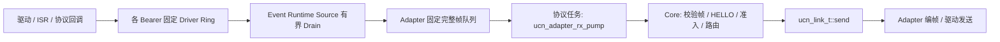

# UCN 多介质 Adapter 契约

> 状态：T13 已完成公共接口、固定收包队列、物理地址绑定与内存模拟；V5-58 已增加 SDK 无关多 Source Event Runtime；V5-59 已增加 Stream Source；V5-60 已增加独立 CAN/CAN-FD Frame Source 与经典 CAN Carrier。本文仍不是 ESP-IDF、Zephyr、NuttX、RT-Thread 或 Linux 的具体驱动实现。

## 1. 目的与边界

Adapter 的作用是把某一种物理介质变成 `ucn_link_t`，而不是把 WiFi、CAN、蓝牙或 Linux 的专有概念带进 UCN-Core。



Core 不读取 MAC、RSSI、CAN ID、串口号、蓝牙连接句柄或 Linux socket。业务层也只使用 Node ID、消息类型和 QoS；介质地址只保留在 Adapter 私有映射表中。

## 2. 必须遵守的执行模型

1. 驱动 ISR 或 WiFi/BLE 回调不得执行 `ucn_node_receive()`、路由、准入 Provider 或应用回调。
2. 回调优先只将字节/物理帧放入该 Bearer 自己的**有上限** Driver Ring，并调用 `ucn_event_runtime_signal_source[_from_isr]()`；已经持有完整小帧的 Packet Adapter 也可直接提交公共完整帧队列。
3. 单一协议任务调用 `ucn_adapter_rx_pump()`，再由它调用 `ucn_node_receive()`；Core 的 Node 状态因此不需要并发访问。
4. 生产 Adapter 的 `send()` 只允许做有界复制并写入固定 TX Queue，随后立即返回；不得等待 UART DMA、无线 ACK、LoRa 空口发送或 Socket 完整写完，也不得自行改写 UCN 源/目的 Node ID、TTL、序号或路由。仅测试用同步虚拟 Link 可以在调用栈内直接投递。
5. TX Queue 满返回 `UCN_ERR_NO_SPACE`，Driver 已明确 Down 返回 `UCN_ERR_LINK_DOWN`；Core 对一次 `send()` 失败不在调用栈内自旋或重试。产品必须记录队列容量、队列满统计和 `send()` 最坏执行时间。RX 队列满也必须丢弃并计数，不能使用无上限 RAM。

公共队列默认 `UCN_ADAPTER_RX_QUEUE_DEPTH=2`，占用约 `2 × UCN_MAX_FRAME_BYTES` 原始帧缓存（默认约 512 B），可在编译期设为 1。任务/Owner 生产者调用 `ucn_adapter_rx_enqueue()`，使用 `enter_critical/exit_critical`；ISR 直接提交完整帧时必须调用 `ucn_adapter_rx_enqueue_from_isr()`，并在同一个 `ucn_port_ops_t` 中提供成对的 `enter_critical_from_isr()` / `exit_critical_from_isr(token)`。ISR 入口绝不会回退成任务锁：缺少该对回调返回 `UCN_ERR_CONFIG`。FreeRTOS 产品应把 `taskENTER_CRITICAL_FROM_ISR()` 返回的 mask 作为 token 并用同一个 token 恢复。仍优先建议 ISR 写 BSP 自己的固定 ring，由 Protocol Task 解码/入队；这会减少 ISR 时间与锁顺序风险。

当前 `ucn_adapter_rx_pump()` 只负责“已入队帧 → `ucn_node_receive()`”，不会自动调用 `ucn_link_ops_t::poll_rx`。轮询型真实 Adapter 必须在自己的任务中执行 `poll_rx` 并调用 `ucn_adapter_rx_enqueue()`，随后再 Pump；这能保证所有介质采用同一 Core 入口。

V5-58 的标准入口是 `ucn_event_runtime_t`：启动期用 `ucn_event_runtime_bind_source()` 为每个物理实例绑定固定 Source ID；Task/ISR 只置 RX/TX/STATUS Pending 位，唯一 Owner 按 Source/Round 预算调用 `ucn_event_source_service_fn`。Source 在 Owner 上下文从自己的 Ring/描述符 Drain，成功得到完整帧后调用 `ucn_event_runtime_submit_frame()`。事件只表示“可能有工作”，允许合并；通知本身绝不能承载或计数真实数据。等待超时的 `FALLBACK_SCAN` 只处理漏通知、定时维护和无中断兼容路径。

Source 返回 `pending_events` 表示 Ring 仍有工作；Runtime 在预算内继续。公共 RX Queue 满时 Carrier 不应提交并遗失下一个完整帧，而应保留/回滚 Driver Ring 的消费位置，返回 RX Pending，等待 Owner 先 Pump 后再试。现有 `ucn_<platform>_port_*` 继续作为单 Queue 兼容接口；同一 Node 只能选择 Event Runtime 或一个兼容 Port 作为 Owner，不能二者并行调用 Node。

V5-59 的标准字节流入口是 `ucn_stream_source_t`。产品为每个 UART/RS-485/USB CDC 实例提供独立 `ring_storage[]` 与 `frame_storage[]`，调用 `ucn_stream_source_init()` 绑定固定 Source ID；驱动 Task/ISR 分别把收到的**整块字节**交给 `ucn_stream_source_write()` / `ucn_stream_source_write_from_isr()`。库在 Owner 上下文完成 COBS+`0x00` 定界。整块写入空间不足时全部拒绝并记录真实缺口位置：缺口前已完整入 Ring 的 Carrier 仍先交付，只有缺口后的字节才丢弃到下一个分隔符。公共 RX Queue 满时已解码帧留在 Source 内重试，不继续吃下一个 Carrier。

V5-60 的标准 CAN 入口是 `ucn_can_source_t`。每个控制器使用独立固定 Frame Ring、Source ID 和静态 CAN ID→Link Resolver。CAN-FD 直接携带一个 UCN 帧，发送端向合法 DLC 向上取整并零填充，接收端从 v5 Header 恢复真实长度并拒绝非零 Padding。经典 CAN 使用 `C1/C2 + Transfer ID + Segment Index` 的 8 B Carrier，固定 Slot 严格顺序重组并由回绕安全 Deadline 回收。`BUS_OFF/RECOVERING` 会清空 Ring/重组状态并拒绝新帧，硬件恢复和 Link `is_up` 仍由产品驱动负责。

## 3. 物理地址不是设备身份

`ucn_adapter_address_t` 只表示 Adapter 的物理端点（最长 8 字节）：ESP-NOW/BLE MAC、LoRa EUI、CAN 的本地端点编号、RS485 站号或 UART 端口地址。它**不是** UCN Node ID，也不能代替身份认证。

Adapter 为每个已看到的物理端点从静态 Link 池取一个 `ucn_link_t`，初始设置：

```text
physical address → Candidate Link (peer_node_id = 0)
```

随后将收到的帧与这个 Candidate Link 一起入队。v5 HELLO 的 Payload 长度严格为 0；Core 只使用已校验 Header 的 `source` 绑定 `link->peer_node_id`，并记录该帧声明的固定 Wire Profile 上限，再按 `Manual`、`Open` 或 `Provider` 策略处理。旧 4 B HELLO 会被拒绝。生产系统应使用 `Provider` 将签名/AEAD/ACL 与出厂身份绑定；MAC 伪造或 BLE 随机地址都不应被当作入网成功。

公共辅助接口：

| 接口 | 作用 |
| --- | --- |
| `ucn_adapter_bind_peer()` | 将一个物理地址固定绑定到静态 Link；同地址试图改绑到另一个 Link 会报配置冲突。 |
| `ucn_adapter_find_peer()` | 由收到的物理地址找 Candidate/已知 Link。 |
| `ucn_adapter_rx_enqueue()` | Task/Owner 上下文复制一帧到固定队列；满时返回 `UCN_ERR_NO_SPACE` 并计数。 |
| `ucn_adapter_rx_enqueue_from_isr()` | ISR 上下文复制一帧；必须有 ISR token 临界区对，否则返回 `UCN_ERR_CONFIG`。不执行 Pump、路由或业务回调。 |
| `ucn_adapter_rx_pump()` | 在协议任务中 FIFO 出队、调用 Core；格式/安全/准入失败也会出队并记 `rejected_by_core`，不会堵塞后续帧。 |
| `ucn_event_runtime_bind_source()` | 启动期为一个 UART/CAN/USB/无线实例绑定固定 Source ID 和 Owner-only `service()`。 |
| `ucn_event_runtime_signal_source[_from_isr]()` | 合并 Source 事件并通知 Owner；不读取 Ring、不运行 Carrier/Core。 |
| `ucn_event_runtime_submit_frame()` | Source/Task 得到完整 UCN 帧后入公共 RX Queue并置位 Owner RX 工作。 |
| `ucn_event_runtime_task_cycle()` | RTOS Owner 有 Pending 立即 Drain，否则有界等待；超时才执行 FALLBACK。 |
| `ucn_stream_source_init()` | 绑定一个调用者存储的 UART/RS-485/USB CDC Stream Source；不初始化硬件。 |
| `ucn_stream_source_write[_from_isr]()` | 整块写入原始字节 Ring并立即通知 Runtime；无空间全拒绝并进入有序重同步。 |
| `ucn_stream_carrier_encode()` | 把一个完整 UCN Frame 编成 COBS+尾随 `0x00`；产品 TX Queue 必须原子接收返回的完整 Carrier。 |
| `ucn_can_source_init()` | 为一个 CAN 控制器绑定固定 Frame Ring、可选经典 CAN 重组区、Source ID 和 CAN ID→Link Resolver。 |
| `ucn_can_source_write[_from_isr]()` | 将一个 SDK 无关的完整物理 CAN/CAN-FD 帧全入或全拒，并立即通知 Owner；ISR 缺 token 锁失败关闭。 |
| `ucn_can_fd_carrier_encode()` | 把不超过 64 B 的完整 UCN 帧补齐到最小合法 CAN-FD 数据长度，Padding 固定为零。 |
| `ucn_can_classic_carrier_encode_segment()` | 按固定 8 B Carrier 生成一个经典 CAN 段；产品有界 TX Queue负责逐段发送。 |
| `ucn_can_source_set_bus_state[_from_isr]()` | 显式报告 Active/Error-Passive/Bus-Off/Recovering；不替产品自动恢复控制器。 |
| `ucn_adapter_hello_scheduler_init()` | 为一个 Adapter 初始化固定状态的 HELLO 调度器；Port 随机 Seed 与非零 Adapter Token 共同形成独立序列。 |
| `ucn_adapter_hello_scheduler_step()` | 在 Protocol Task 中推进 Initial Jitter、有限 Fast Retry、指数 Backoff 和准入后 Slow/Stop；到期只返回一次 `hello_due`。 |
| `ucn_adapter_hello_scheduler_restart()` | Adapter 重启时用新的 Port Seed 重建初始抖动；不会动态分配或形成无限快速重试。 |

`ucn_node_broadcast_hello()` 用于完全未知 Node ID 时的物理广播；`ucn_node_probe_neighbor()` 用于 Adapter 已知对端 Node ID 时的定向 HELLO。广播 HELLO 只做一跳身份发现，Core 不转发、也不交给应用。

### 3.1 S17 HELLO 调度契约

HELLO 的发送时机属于 Adapter，不进入 `ucn_node_t`。每个动态发现介质持有一个 `ucn_adapter_hello_scheduler_t`，从产品 Port 取得一次随机 Seed，并配置不同的非零 `adapter_token`；即使 WiFi 与 UART 同时启动，也不会共用一个全局 Deadline。状态路径为：

```text
INITIAL_JITTER
  → 最多 max_fast_retries 次 FAST_RETRY
  → BACKOFF（指数增长到固定上限）
  → 本 Adapter 出现已准入 Bearer：ADMITTED_SLOW 或 ADMITTED_STOP
  → 本 Adapter 不再有已准入 Bearer：重新进入 INITIAL_JITTER
```

`SLOW` 在准入后先按 Fast Retry 间隔发一次互相确认 HELLO，随后才进入低频恢复广播；Heartbeat 负责已准入邻居的存活判断。动态广播介质通常应使用 `SLOW`，因为 `STOP` 可能让只完成单向 HELLO 的对端等不到回包；`STOP` 只适合静态预准入、外部保证双向发现或其他明确产品流程。静态 CAN/UART 点对点 Profile 可以把 `enabled=false`，但必须由产品配置完成 Link 注册、Peer Node ID 与准入，不能把“关闭 HELLO”误解成还能自动发现。

所有间隔必须在 `1..INT32_MAX ms`，重试抖动最大 500‰，配置还会检查抖动后的最坏间隔。Scheduler 每次到期先安装下一个 Deadline 再返回，不自旋、不睡眠、不发送帧；调用方只在 `hello_due=true` 时调用该 Adapter 对应 Link 的 `ucn_node_broadcast_hello()`。一个 Scheduler 是固定小对象，没有队列、malloc 或随节点数增长的状态。

### 每 Link 存活档位

动态发现与已准入存活是两套职责：HELLO Scheduler 负责发现/恢复，Core Heartbeat 负责已准入 Bearer 的静默判断。Adapter 在注册 Link 前可设置 `link->liveness_profile`：

| 档位 | Heartbeat | SUSPECT | DOWN/回收 | 典型用途 |
| --- | ---: | ---: | ---: | --- |
| `UCN_LINK_LIVENESS_DEFAULT` | 1000 ms | 3000 ms | 4000 ms | Wi-Fi、ESP-NOW、一般动态介质 |
| `UCN_LINK_LIVENESS_FAST` | 250 ms | 1250 ms | 2000 ms | 板间 UART、RS-485 等低时延有线链路 |

零初始化等于 DEFAULT；未知值在 Link 注册时返回 `UCN_ERR_CONFIG`。周期 Heartbeat 由固定 Link/Bearer 数和档位节拍独立约束，不消耗通用 RREQ/Probe/Activate Token；入站 Heartbeat Request 仍受每 Peer 固定预算。若 Adapter 有 DCD/CTS/GPIO、Bus-Off 等更直接的物理状态，应由 `get_status()` 更早报告 Down，而不是等待 Heartbeat。普通 TTL UART 的 TX 成功只表示本地 Driver 接受字节，不能当作对端收到。

## 4. 标准 Adapter 流程

```text
启动 Adapter
  → 建立静态 Link 池 + 物理地址绑定表 + 有界收包队列
  → 发现物理端点（MAC / 总线地址 / 已建立连接）
  → 分配 Candidate Link，peer_node_id = 0
  → Adapter HELLO Scheduler：初始抖动、有限快重试、指数退避
  → 到期才物理广播 HELLO（或收到对端 HELLO）
  → 收包回调：find/bind Link → enqueue(frame)
  → 协议任务：pump → Core 校验 HELLO → Provider/策略准入
  → 成功：Admitted Link 可参与 DATA、RREQ/RREP、转发；HELLO 转 Slow/Stop
  → 链路掉线：Adapter 更新 get_status/metrics；后续 T15 决定移除、重试与审计策略
```

一个物理端点只允许对应一个活动 Candidate/Admitted Link。Link 池满时 Adapter 必须拒绝新端点，不能覆盖已接纳节点；候选淘汰和已接纳节点撤销的产品策略留待 T15 结合真实身份与业务安全设计。

## 5. Link 回调契约

| 回调 | Adapter 必须做什么 | 不得做什么 |
| --- | --- | --- |
| `open` | 初始化/激活物理对端资源。 | 分配无上限资源或隐式信任对端。 |
| `send` | 将一个完整 UCN 帧有界复制进固定 TX Queue；成功仅表示 Adapter 接受该副本。队列满返回 `UCN_ERR_NO_SPACE`，Driver Down 返回 `UCN_ERR_LINK_DOWN`。 | 等待物理发送完成、无限阻塞/重试，或改写 UCN 帧的身份/路由字段。 |
| `poll_rx` | 可选：在非回调驱动中拉取原始帧并入队。 | 直接运行 Core 路由。 |
| `get_status` | 返回 up/down、实际 MTU 和错误计数。 | 用“最后一次成功”伪造当前连通。 |
| `get_metrics` | 可选：将介质质量归一成非零、越小越好的 `route_cost`。 | 将 RSSI/SNR/CAN 专有字段加入 UCN 帧。 |
| `close` | 释放该 Link 的物理资源。 | 擅自清除 Core 路由或邻居表。 |

## 6. 各介质的映射

| 介质 | 物理地址/发现 | 收包与发送要点 | 建议的 Cost 输入 |
| --- | --- | --- | --- |
| ESP-NOW / WiFi | MAC、广播发现。 | WiFi 回调只入队；Node ID 以后续 HELLO/Provider 为准。 | RSSI、丢包、重传、发送队列。 |
| BLE | 连接句柄与 MAC/EUI。 | 随机 MAC 不可当身份；连接事件只改变 Link 状态。 | RSSI、连接间隔、重传。 |
| LoRa | EUI/节点地址。 | 限制广播频率和空口时间，严控候选表。 | SNR、空口时间、丢包。 |
| RS485 / UART / USB CDC | 站号、端口、USB Endpoint 或点对点通道。 | 可复用公共 Stream Source 完成 COBS 定界；产品仍负责 DMA/流控/方向控制和有界 TX Queue。 | 超时、Carrier 错误、队列积压。 |
| CAN-FD / CAN | 硬件 Filter 后的 CAN ID 由静态 Resolver 映射 Link。 | CAN-FD 直接帧+DLC 零填充；经典 CAN 使用固定 Slot Carrier；控制器状态显式上报。 | Bus-Off、TEC/REC、错误帧、总线负载、仲裁等待、Source Queue 压力。 |

## 7. MTU 基线（必须先冻结）

Core 不拆分一个已经编码好的 UCN 帧。一个参与 Mesh 的 Link 必须满足：

```text
当前实际 encoded_frame_bytes ≤ 当前 Link 有效 MTU
```

`UCN_MAX_FRAME_BYTES` 是编译期上限，不表示每个帧都填满。ESP-NOW v1 的单包上限为 250 B，CAN-FD 逻辑 MTU 为 64 B；Node 会按静态/动态 MTU拒绝过大的实际帧。可选 `ucn_transfer` 能把 T128～T8K 逻辑消息拆成多个正常 UCN 帧，软件测试已覆盖 64/128/250/256 B MTU；但每个 Fragment 本身仍必须放入 Link MTU。v5 基础头按 W0～W3 为 17/21/26/30 B，Transfer 另加 14 B 信封且要求至少 16 B 分片数据。经典 CAN 通过 V5-60 Carrier 可在同一物理 Link 上有界承载最多 `min(UCN_MAX_FRAME_BYTES,1278)` 的完整 UCN 帧；产品仍应按时延和总线负载选择更小逻辑 MTU。

Adapter Carrier 分段不是 Transfer：Carrier 负责让一条物理链路承载一个 UCN 帧；Transfer 负责把一个逻辑业务消息变成多个 UCN 帧。两层不共用序号、重组槽或超时状态。经典 CAN TX 必须调用公共 Segment Encoder 并写入有界 Driver TX Queue，仍不得在 `Link.send()` 内阻塞等待全部段发完。

## 8. 已验证与未验证边界

- 已验证：固定 RX 队列 FIFO/满队列计数、Task/ISR token、物理地址绑定、HELLO/业务；Stream Host 测试覆盖 COBS/缺口/背压；CAN Host 测试覆盖双控制器、全部 CAN-FD DLC 边界、Padding、过滤、经典 CAN 正常/乱序/丢段超时/槽满、Bus-Off/恢复、Ring/Queue 背压和 ISR 失败关闭。
- 未验证：公共 Source 在真实 UART DMA、USB CDC、RS-485、CAN/CAN-FD 控制器和各 RTOS ISR 下的 WCET、Cache/DMA 一致性、硬件过滤、仲裁/Bus-Off 实际时序、收发器电气、长稳、CPU/栈/功耗；ESP-NOW、BLE、LoRa 驱动也仍需分别实测。

T14 才负责指定 ESP32/ESP-IDF 的实际 Adapter；T15 才接入生产身份 Provider、撤销/淘汰与压力验证。
