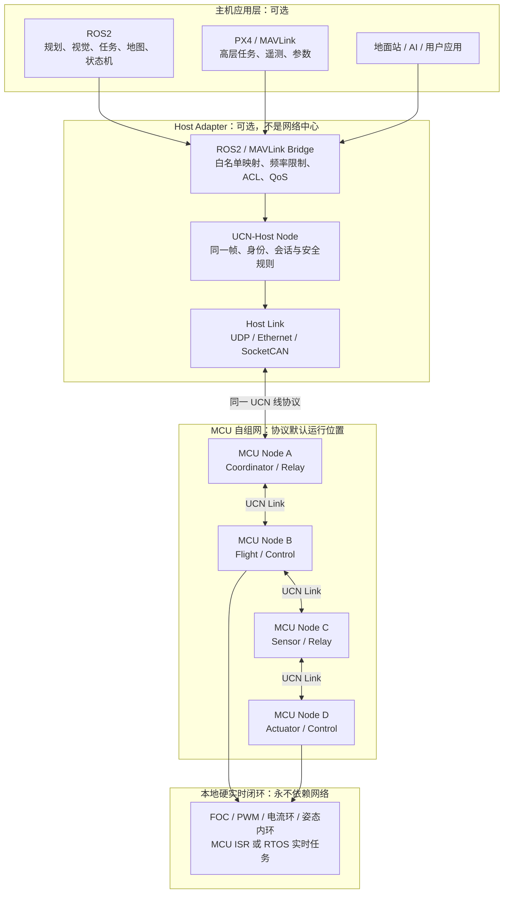

# UCN × ROS2 协同整体架构

> 状态：系统集成目标；当前仓库只验证到虚拟 Host 边界（2026-08-04）  
> 日期：2026-08-04  
> 前提：`UCN-Core` 是 MCU 自组网协议栈；ROS2 是上层机器人应用生态；二者通过受控 Bridge 协作，不互相替代。

相关基础文档：[UCN 整体架构设计](UCN_整体架构设计.md) · [UCN 协议分层与配置档案](UCN_协议分层与配置档案.md)

## 1. 最终系统关系



这张图表达的唯一主从关系是：**ROS2 消费和产生高层业务，UCN 负责安全传递，MCU 负责本地执行。**

- Host 存在时，ROS2 能看到、控制和记录网络中的受授权服务。
- Host 不存在时，MCU A-D 仍完成认证、路由、转发与本地控制。
- FOC、PWM、姿态内环永远不经过 ROS2、Bridge 或 UCN 多跳路径。

## 当前实现边界

| 能力 | 当前状态 |
| --- | --- |
| MCU Core、邻居、AODV-Lite、Q0/Q1、虚拟多跳 | 已由 C99 源码和内存虚拟 Link 测试验证。 |
| Host 作为普通节点、Host 断开不破坏 MCU 路径 | 已由虚拟 Host 集成测试验证。 |
| Linux UDP/Ethernet/SocketCAN Adapter | 尚未实现。 |
| ROS2/MAVLink Bridge、白名单映射与 ACL | 尚未实现。 |
| 生产 AEAD、真实 ESP-NOW/FreeRTOS 驱动、实机时延 | 尚未实现或验证。 |

因此本文件中的 ROS2/Host 图和 Bridge 配置示例是目标架构，不应被理解为仓库已经提供的可运行 ROS2 Bridge。当前 Adapter API 与收包模型见 [UCN Adapter 契约](UCN_Adapter_契约.md)。

## 2. 每一层负责什么

| 层 | 主要责任 | 输入/输出 | 不能做什么 |
| --- | --- | --- | --- |
| ROS2 / 上层应用 | 规划、导航、视觉、任务状态机、用户交互。 | Topic、Service、Action、地图、轨迹、高层命令。 | 负责 MCU 入网、无线路由或 PWM/FOC 闭环。 |
| ROS2-UCN Bridge | 将有限的 ROS2/MAVLink 业务映射为 UCN 消息；做类型转换、ACL、频率和截止时间检查。 | ROS 消息 ↔ UCN 业务负载。 | 自动桥接整个 ROS Graph，或绕过安全策略。 |
| UCN-Host Node | 像普通节点一样加入网络，执行帧、会话、AEAD、QoS 与 Link 收发。 | UCN 帧 ↔ UDP/Ethernet/SocketCAN。 | 成为 MCU 路由中心、唯一 Coordinator 或特权节点。 |
| UCN-Core（MCU） | 认证入网、可信邻居、AODV-Lite、逐跳转发、Q0/Q1 和失联事件。 | UCN 帧 ↔ MCU 本地消息。 | 理解 ROS Topic 名称、DDS Discovery 或大数据语义。 |
| MCU 本地控制 | 执行器驱动、飞控状态机、限幅、看门狗、失联安全。 | 高层目标 ↔ 本地控制输出。 | 依赖无线消息按时抵达才保持安全。 |
| 物理 Link | 承载帧收发，如无线、CAN-FD、RS485、UART、UDP。 | 字节/帧。 | 处理 UCN 身份、路由或 ROS2 业务。 |

## 3. Bridge 是边界，不是透传器

Bridge 的职责是把两套语义明确地接起来，而不是把 ROS2 数据“原样塞进 UCN”。每条映射必须显式配置：

| 映射字段 | 作用 |
| --- | --- |
| ROS Topic / Service / MAVLink 类型 | 明确主机侧业务入口。 |
| 方向 | `host_to_mcu`、`mcu_to_host` 或受限双向。 |
| UCN Destination Node / Group | 明确发给哪个节点或授权组。 |
| UCN Message Type | MCU 应用能理解的固定业务类型。 |
| Traffic Class | Q0/Q1/Q2/Q3；默认不能把任意 ROS 流量放进 Q0。 |
| Deadline / 最大频率 | 过期即丢弃，限制 ROS 或主机异常时的灌包。 |
| Reliability | `best_effort`、`latest_value` 或 Extended 的 `reliable`。 |
| ACL / Role | 哪个 Host 身份能调用该映射，目标 MCU 是否接受。 |

桥接规则示意：

```yaml
mapping: flight_target
ros_input: /mission/target_setpoint
direction: host_to_mcu
ucn_destination: FLIGHT_CONTROLLER_NODE
ucn_message_type: FLIGHT_TARGET
traffic_class: Q1
reliability: latest_value
max_rate_hz: configured_per_target
deadline_ms: configured_per_target
required_role: operator
```

上例只说明结构，不规定具体数值。数值必须根据飞控、Link、跳数与风险评估冻结。

## 4. 三类关键数据流

### 4.1 ROS2 下发高层任务

```text
ROS2 任务/规划节点
  ↓
Bridge：白名单、身份、ACL、频率、deadline 校验
  ↓
UCN-Host：封装为目标 Node 的 Q1 业务帧
  ↓
MCU Mesh：认证邻居 → 已缓存路径多跳转发
  ↓
目标飞控 MCU：验证会话/ACL/截止时间
  ↓
本地飞控任务：将高层目标转为本地控制状态
  ↓
本地 ISR/RTOS：姿态与执行器闭环
```

ROS2 只能给出高层目标，例如任务、航点、模式或限速；MCU 必须独立验证来源、范围、时效和本地安全条件。

### 4.2 MCU 上报状态到 ROS2

```text
传感器 / 飞控 MCU
  ↓ Q1 latest_value
UCN Mesh：多跳转发
  ↓
UCN-Host：验证会话并解封装
  ↓
Bridge：UCN Message Type → 固定 ROS Topic
  ↓
ROS2：可视化、规划、记录、AI 或地面站
```

状态流默认使用 `latest_value`：Host 或 ROS2 拥塞时应丢弃旧状态，而不是把过期数据堆积回 MCU Mesh。

### 4.3 Host 消失或 Bridge 崩溃

```text
Host / ROS2 断开
  ↓
UCN-Host 对应会话和 Link 失效
  ↓
MCU 节点仅清理通往 Host 的相关路径/服务可达性
  ↓
MCU 之间的邻居、会话、Route Cache 和本地业务继续运行
  ↓
需要主机命令的应用按自身超时进入安全状态
```

Host 断线不是 MCU Mesh 整体故障；但某个业务若明确依赖主机持续命令，飞控/执行器仍需在本地执行超时和失联安全策略。

## 5. QoS 与实时性边界

| 类型 | 典型内容 | 所在位置 | 规则 |
| --- | --- | --- | --- |
| Q0 | 急停、失控保护、本地关键控制。 | MCU Core + 本地控制。 | 不等待路由发现；优先本地硬件安全动作。Host 不能把一般 ROS Topic 直接升级为 Q0。 |
| Q1 | 高层飞行目标、IMU/控制状态、快速反馈。 | MCU Core；Bridge 可受限映射。 | `latest_value`、截止时间、缓存路径优先。 |
| Q2 | 参数、配置、普通服务。 | UCN-Extended / Host。 | 可确认和限次重传，不进入 Core 默认路径。 |
| Q3 | 视频、日志、文件、地图、OTA。 | Host 或资源充足的 Extended 节点。 | 限速、可暂停，绝不挤占 Q0/Q1。 |

ROS2 自己具有可靠性、历史、Deadline 等 QoS 配置；UCN 不复制这些语义，而是把 Bridge 映射到 MCU 可执行的固定队列、帧截止时间和资源上限。两边的 QoS 配置必须一起评审，不能各自默认。

## 6. 无 Linux 时的运行形态

当没有 Linux、ROS2 或地面站时，系统缩为：

```text
MCU 应用
  ↕
UCN-Core：入网 / 邻居 / AODV-Lite / Q0-Q1 / 安全
  ↕
无线 / CAN-FD / RS485 / UART
  ↕
其他 MCU 节点
```

这仍是完整网络。预配置的 MCU Coordinator 处理新节点授权；普通 MCU 可担任业务节点或中继；本地控制环不因 Host 缺失而停止。

## 7. 资源与部署原则

### 7.1 MCU

- 每个 MCU 至少部署 `UCN-Core`，采用静态配置、无 `malloc`、固定邻居/路由/队列表；生产会话表取决于后续安全 Provider。
- `UCN-Extended` 只给必要的 MCU 编译；分片、Q3、服务目录必须使用独立预算。
- 可用 RAM 由目标硬件决定：当前通过 `UCN_MAX_NEIGHBORS`、`UCN_MAX_ROUTES`、`UCN_MAX_FRAME_BYTES`、Q0/Q1 与 Adapter 队列等编译期宏配置；目标板专用 `ucn_config.h` 与实测资源报告尚未提供。

### 7.2 Host

- Host 可使用丰富的 Linux/ROS2 能力，不向 MCU 反向施加 DDS、动态发现、动态分配或大消息负担。
- Bridge 单独进程或故障隔离单元；其崩溃不能带垮 UCN-Host 的会话、也不能影响 MCU Mesh。
- Host 只映射业务白名单，不建立“全量 ROS2 ↔ UCN”自动桥。

## 8. 推荐的未来代码边界

```text
ucn/
├── core/                MCU 必需：packet、session、neighbor、route、qos_q0q1、health
├── security/            MCU 必需：identity、join、aead、replay
├── transport/           MCU 必需：radio、canfd、rs485、uart
├── port/                MCU 必需：baremetal、freertos、zephyr
├── extended/            按需：service、qos_q2q3、fragment、time
└── host/                可选：linux Link、ucn-host runtime、IPC
    └── bridge/
        ├── ros2/        Topic/Service 白名单映射
        ├── mavlink/     MAVLink/PX4 白名单映射
        └── tools/       地面站、诊断、抓包、性能测试
```

这是目标项目组织，并非当前仓库目录；当前仓库采用 `include/ucn/`、`src/`、`tests/` 和 `docs/` 的小型 C99 结构。无论后续是否按此拆目录，`host/bridge/ros2` 都不得被 Core 引用；MCU 编译 Core 时不应包含 ROS2 头文件、DDS、C++ 运行时或 Linux socket 依赖。

## 9. 实施与验收顺序

1. **先验证 MCU Mesh。** 三个 MCU 无 Linux 完成认证、两跳 Q1 通信、路由错误与修复、本地失联安全。
2. **再验证 Host 原始接入。** Linux 作为普通 UCN 节点收发固定 UCN 消息；Host 断开不影响 MCU Mesh。
3. **最后验证 Bridge。** 只选择一个 ROS2 Topic 和一个 MCU 状态消息，完成双向白名单映射、限频、ACL 和 deadline 测试。
4. **最后扩展生态。** 再按需要加入 MAVLink/PX4、参数服务、日志、Q2/Q3 和可视化。

验收时要故意模拟 ROS2 进程退出、Host 网络断开、Bridge 灌包、重复命令和过期命令，确认这些问题不会破坏 MCU 自组网与本地安全。

## 10. 最终定位

UCN 是 MCU 网络的“神经传导层”；ROS2 是主机上的“任务与认知层”。两者通过受控 Bridge 协作：ROS2 不进入路由和安全核心，UCN 也不重新实现 ROS2 的 Topic、Service、Action、可视化与工具生态。

这使系统同时具备两件事：**MCU 在没有 Linux 时仍能独立可靠运行；Linux/ROS2 接入后又能获得完整机器人软件生态。**
