# UCN V5 Cluster 当前实际状态机（Current Implementation FSM）

> 分支：`codex/v5-adaptive-wire`  
> 状态：**严格按当前代码实现还原，不代表理想设计**  
> 对照文档：`UCN_V5_Cluster_FSM_Design.md`（Target / 理想目标状态机）  
> 主要源码：
>
> - `include/ucn/ucn_cluster.h`
> - `src/extended/ucn_cluster.c`
> - `tests/test_cluster.c`
>
> 本文档的目的不是“修正协议”，而是回答：
>
> **当前 v5 代码实际上是怎么跑的？**
>
> 因此，当前实现中存在的非理想跳转、布尔状态叠加、重放校验缺口、Term wrap、Backup/Recovery 不完整等行为，本文都按实际代码保留。

---

# 1. 先给结论：当前实现不是一个纯粹的单层 FSM

当前公开 Role 一共有 9 个：

```c
typedef enum ucn_cluster_role {
    UCN_CLUSTER_ROLE_DISABLED = 0,
    UCN_CLUSTER_ROLE_DETACHED = 1,
    UCN_CLUSTER_ROLE_JOIN_PENDING = 2,
    UCN_CLUSTER_ROLE_MEMBER = 3,
    UCN_CLUSTER_ROLE_CANDIDATE = 4,
    UCN_CLUSTER_ROLE_HEAD = 5,
    UCN_CLUSTER_ROLE_BACKUP = 6,
    UCN_CLUSTER_ROLE_STEPPING_DOWN = 7,
    UCN_CLUSTER_ROLE_RECOVERY_HEAD = 8
} ucn_cluster_role_t;
```

但是，真实运行状态还依赖大量字段：

```text
backup_ready
backup_syncing
backup_assign_pending
backup_takeover_active
backup_takeover_announce_active

head_grace_deadline_ms

recovery_eligible
recovery_backoff_deadline_ms
recovery_cooldown_until_ms

stepdown_deadline_ms

backup_primary_deadline_ms
backup_primary_lease_deadline_ms

backup_resync_deadline_ms
backup_sync_cursor
membership_sequence
```

所以当前状态机实际是：

```text
Role 主状态
+
Role 内的 bool/deadline 隐式子状态
```

而不是：

```text
唯一 phase
```

---

# 2. 当前状态结构

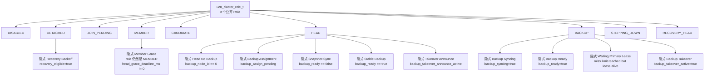

---

# 3. 当前真实总 Role 状态机

下面这张图只画**真正修改 `cluster->role` 的状态迁移**。

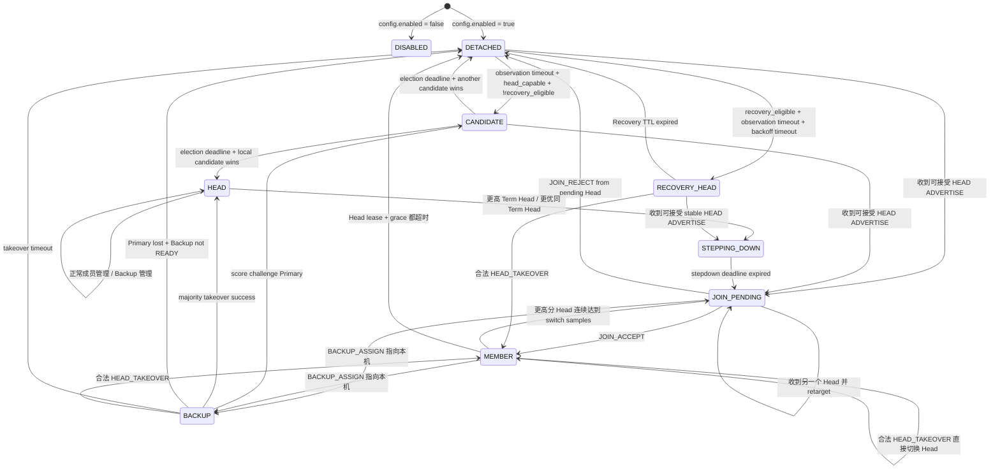

注意：

**这张图仍然不完整。**

因为：

```text
MEMBER Grace
BACKUP Syncing
BACKUP Ready
BACKUP Takeover
HEAD Backup Assignment
HEAD Snapshot Sync
DETACHED Recovery Backoff
```

都没有独立 `role`。

下面继续展开这些“代码里的真实隐式状态”。

---

# 4. 初始化

`ucn_cluster_init()` 当前行为：

```text
config.enabled == false
    -> role = DISABLED

config.enabled == true
    -> role = DETACHED
    -> observation_deadline = now + observation_ms
    -> next_nonce = 1
    -> token bucket 初始装满
```

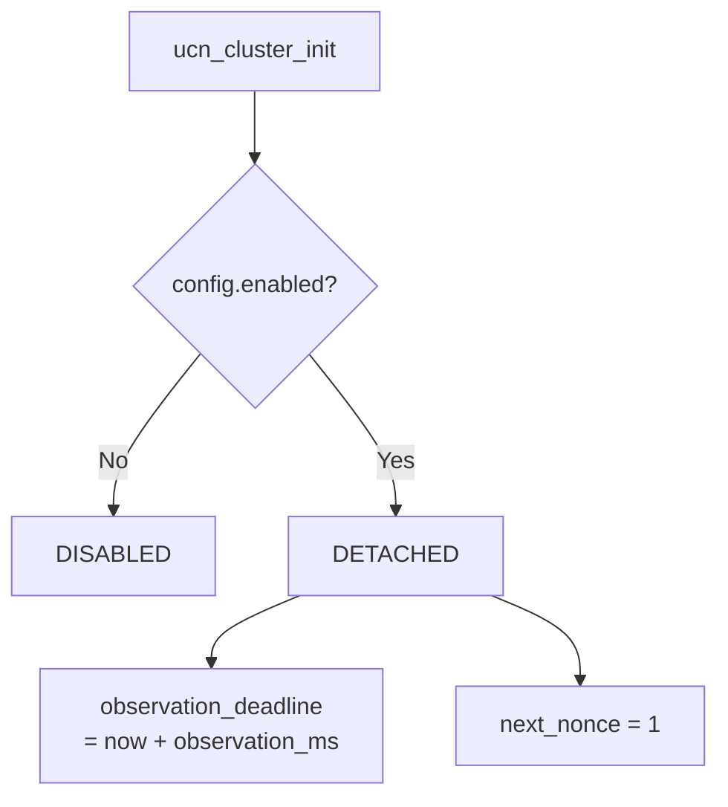

当前初始化**没有**：

```text
last_cluster_id
max_seen_term
CommittedVoterSet
Persistent vote epoch
唯一 phase
```

---

# 5. DETACHED 当前实际逻辑

`set_detached()` 会直接清：

```text
cluster_id = 0
term = 0
head_node_id = 0
current_head_score = 0

pending_head_node_id = 0
pending_cluster_id = 0
pending_term = 0
pending_head_score = 0

known_backup_node_id = 0
known_backup_generation = 0

head_lease_expires_at_ms = 0
head_grace_deadline_ms = 0
election_deadline_ms = 0
```

然后：

```text
role = DETACHED
observation_deadline = now + observation_ms
```

但是它**不会统一清理所有 Backup / Recovery 字段**。

因此 `DETACHED` 仍可能携带：

```text
recovery_eligible = true
recovery_cooldown_until_ms
recovery_nonce
known_recovery_source
...
```

---

# 6. DETACHED 隐式子状态

当前 DETACHED 至少实际包含：

```text
DETACHED_NORMAL_OBSERVE
DETACHED_RECOVERY_COOLDOWN
DETACHED_RECOVERY_OBSERVE
DETACHED_RECOVERY_BACKOFF
```

但代码没有 enum 区分。

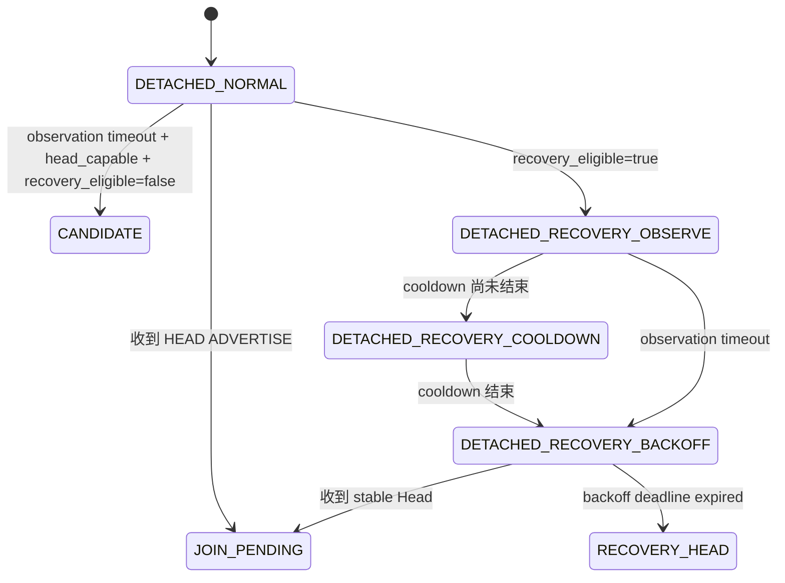

真实判断在 `ucn_cluster_step()`：

```c
if (role == DETACHED &&
    head_capable &&
    observation_deadline expired) {

    if (recovery_eligible &&
        cooldown active) {
        // 什么都不做，继续 DETACHED
    }
    else if (recovery_eligible) {
        if (recovery_backoff_deadline == 0)
            start_recovery_backoff();
        else if (backoff expired)
            declare_recovery_head();
    }
    else {
        start_election();
    }
}
```

---

# 7. Candidate / Election 当前逻辑

## 7.1 普通 start_election()

当前：

```c
role = CANDIDATE;

cluster_id = local_node_id;

term =
    term == UINT32_MAX
    ? 1
    : term + 1;

if (term == 0)
    term = 1;

head_node_id = local_node_id;
current_head_score = local head score;

election_deadline =
    now + election_window;

next_advertise = now;
```

由于 `set_detached()` 通常已经：

```text
term = 0
```

所以普通 Detached Election 通常形成：

```text
cluster_id = local_node_id
term = 1
```

---

## 7.2 Candidate 排名

```text
candidate better if:

candidate_score > current_score

OR

candidate_score == current_score
AND candidate_node_id < current_node_id
```

即：

```text
score DESC
node_id ASC
```

---

## 7.3 Election 完成

```mermaid
flowchart TD
    C[CANDIDATE] --> ED{election_deadline expired}
    ED --> SCAN[扫描 candidates[] 中仍存活的 CANDIDATE]
    SCAN --> BEST{best_node == local?}
    BEST -->|Yes| H[role = HEAD]
    BEST -->|No| D[set_detached]
```

注意：

当前 Candidate 输掉 election 后：

```text
不会立即 JOIN winner
```

而是：

```text
CANDIDATE
-> DETACHED
-> 等 winner 后续以 HEAD ADVERTISE
-> JOIN_PENDING
```

---

# 8. Candidate 收到 Head ADVERTISE

Candidate 的 `consider_head_offer()`：

```text
如果 candidate.available_capacity == 0：
    ignore

否则：
    CANDIDATE -> JOIN_PENDING
```

所以当前 Candidate 看见一个已经成立的 Head：

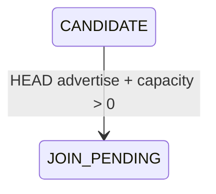

---

# 9. Head Offer 统一处理的当前真实逻辑

所有 `ADVERTISE / HEAD_DECLARE`：

```text
先 observe_candidate()
```

只有：

```text
message.role == HEAD
```

才进入：

```text
consider_head_offer()
```

Candidate Advertise 只进入 candidate table，不触发 Join。

---

# 10. consider_head_offer() 按当前 Role 展开

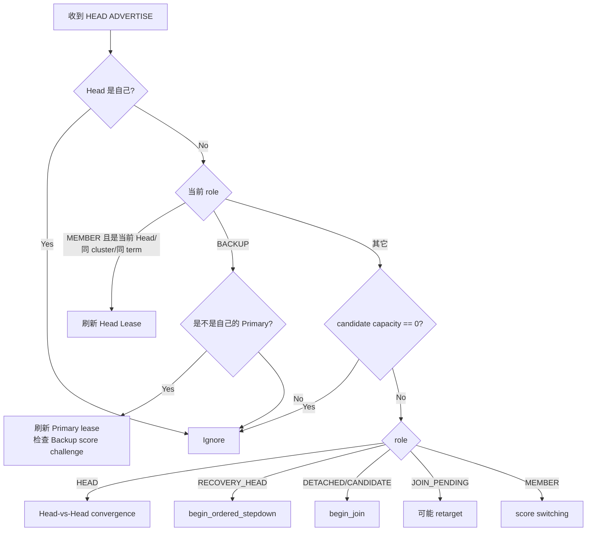

这个顺序非常重要：

```text
capacity == 0
```

位于 Head / Recovery / Detached / Candidate / JoinPending / Member 的多数逻辑之前。

BACKUP 和当前 Member lease refresh 是提前特殊处理。

---

# 11. MEMBER 当前 Head Lease 刷新

当前 Member 收到：

```text
source == current head
cluster_id == current cluster
term == current term
```

则：

```text
head_lease_expires_at = now + config.lease_ms
head_grace_deadline = 0
current_head_score = candidate score
```

Role 保持：

```text
MEMBER
```

---

# 12. MEMBER 自动切换到更高分 Head

这是当前实现中真实存在的行为。

对于“不是当前 Head”的 Head candidate：

```text
candidate.available_capacity > 0

并且：

candidate_score
>= current_head_score * (1 + switch_improvement_percent)

连续达到：
switch_required_samples
```

Member 会：

```text
先向旧 Head 发送 LEAVE
stats.head_switches++

begin_join(new candidate)
```

因此：

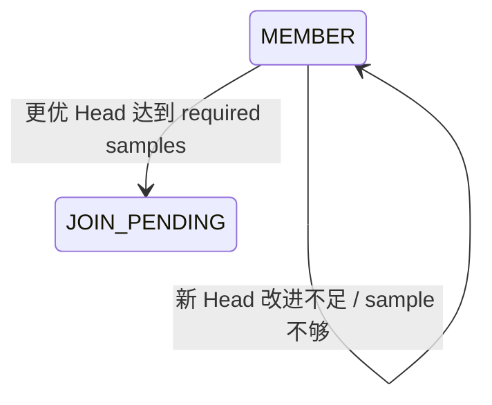

伪代码：

```c
if (!score_improves_by(candidate_score,
                       current_head_score,
                       improvement_percent)) {
    better_samples = 0;
    return;
}

better_samples++;

if (better_samples >= required_samples) {

    send LEAVE(old_head);

    stats.head_switches++;

    begin_join(candidate);
}
```

当前 Member 会自行“跳槽”，不是由两个 Head 统一迁移成员。

---

# 13. Member Head Lease 超时：当前不是独立状态

Member Lease 到期后：

```text
role 仍然 = MEMBER
```

只是：

```text
head_grace_deadline_ms != 0
```

所以当前实际存在隐式：

```text
MEMBER_NORMAL
MEMBER_GRACE
```

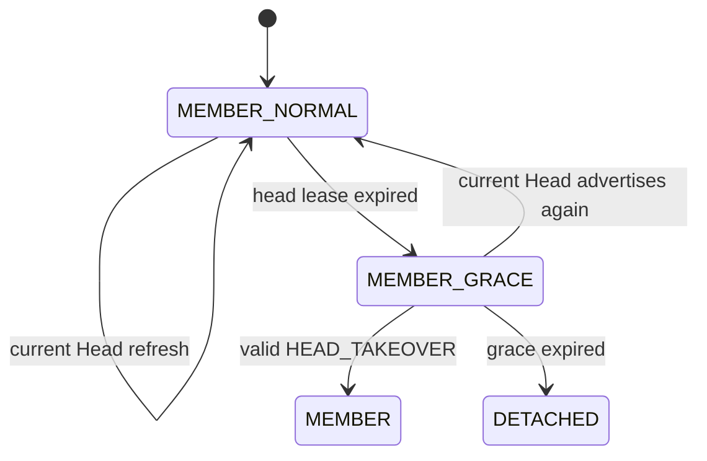

当前 Grace 时长：

```text
keepalive_interval_ms
```

第一次发现 Head lease expired：

```text
head_grace_deadline =
    now + keepalive_interval
```

Grace 也超时：

```text
recovery_eligible = true
set_detached(... recovery_observation_ms)
```

---

# 14. Member Takeover 投票当前逻辑

`TAKEOVER_PREPARE` 只要求当前 Role：

```text
MEMBER
```

并验证：

```text
message.cluster_id == current cluster_id
message.term == current term
message.head_node_id == current head_node_id

source == known_backup_node_id

message.backup_generation ==
known_backup_generation
```

然后：

```text
if member_voted_term == current term:
    return OK
```

否则：

```text
发送 TAKEOVER_ACK
member_voted_term = current term
```

当前代码**不要求**：

```text
Head Lease 已过期
Member 已进入 Grace
```

所以只要其它校验满足：

```text
正常 MEMBER 状态也可以投 Takeover ACK
```

---

# 15. JOIN_PENDING 当前真实状态

`begin_join()`：

```text
role = JOIN_PENDING

pending_head_node_id
pending_cluster_id
pending_term
pending_head_score

next_join_retry = now
```

但是不会立即覆盖：

```text
cluster_id
term
head_node_id
```

所以 JOIN_PENDING 实际同时可能保存：

```text
旧 Active 信息
+
Pending Target 信息
```

---

# 16. JOIN_REQUEST 当前流程

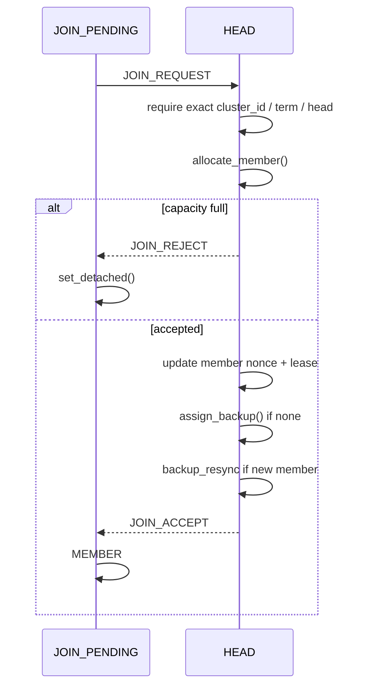

JOIN_REQUEST 每：

```text
join_retry_ms
```

重复发送。

当前没有独立 `join_txid`。

---

# 17. JOIN_ACCEPT 当前逻辑

一般情况：

```text
JOIN_PENDING -> MEMBER
```

验证：

```text
source == pending_head
message.head_node_id == source
message.cluster_id == pending_cluster_id
message.term == pending_term
```

然后：

```text
role = MEMBER
cluster_id = message.cluster_id
term = message.term
head_node_id = source
head lease = now + message.lease
```

---

# 18. 特殊路径：JOIN_PENDING 可以先变 BACKUP 再收 JOIN_ACCEPT

当前 `BACKUP_ASSIGN` 可以对：

```text
MEMBER
JOIN_PENDING
BACKUP
```

发送。

如果：

```text
JOIN_PENDING
收到 BACKUP_ASSIGN
并且 sync_token == local_node_id
```

当前节点会：

```text
JOIN_PENDING
-> BACKUP
```

而且设置：

```text
backup_syncing = true
backup_ready = false
```

之后如果 JOIN_ACCEPT 才到：

```text
handle_join_accept()
```

允许：

```text
role == BACKUP && backup_syncing
```

继续接受 JOIN_ACCEPT，同时保持：

```text
role = BACKUP
```

所以当前真实存在：

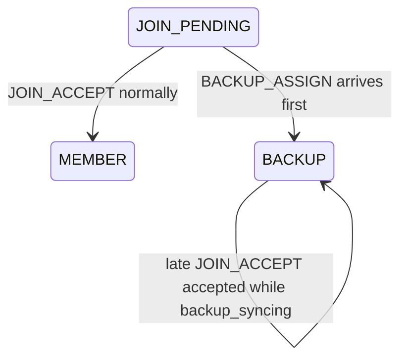

这是当前实现为了应对丢包/乱序专门支持的路径。

---

# 19. JOIN_REJECT 当前实际逻辑

只判断：

```text
role == JOIN_PENDING
source == pending_head_node_id
```

满足就：

```text
set_detached()
```

没有进一步验证：

```text
message.cluster_id
message.term
nonce / txid
```

状态：

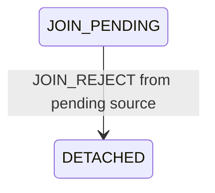

---

# 20. HEAD 当前不是单一内部状态

公开：

```text
role = HEAD
```

实际至少存在：

```text
HEAD_NO_BACKUP

HEAD_BACKUP_SELECTED
HEAD_BACKUP_ASSIGNING
HEAD_BACKUP_SNAPSHOT
HEAD_BACKUP_READY

HEAD_TAKEOVER_ANNOUNCING

HEAD_STEPPING_DOWN
```

其中前五个并没有独立 Role。

---

# 21. HEAD 隐式子状态图

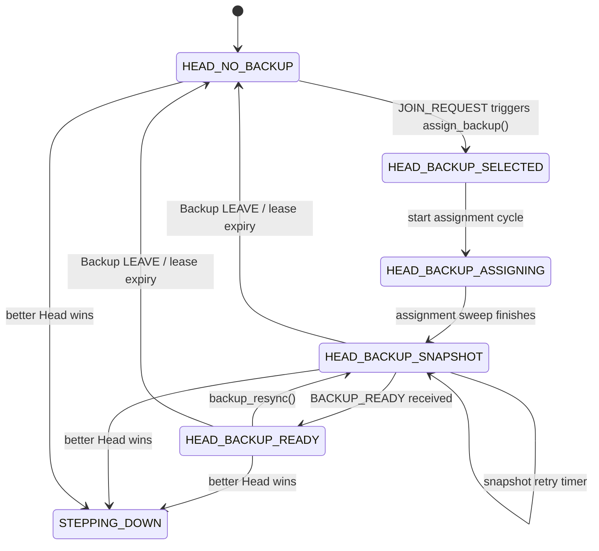

注意：

```text
HEAD_NO_BACKUP -> 选择 Backup
```

当前主要由：

```text
handle_join_request() -> assign_backup()
```

触发。

Backup 后续掉线时**不会自动重新调用 `assign_backup()`**。

---

# 22. Head 接受 JOIN_REQUEST

条件：

```text
role == HEAD
message.head_node_id == local
message.cluster_id == cluster_id
message.term == term
```

`allocate_member()`：

```text
如果成员已存在：
    返回原 slot

否则：
    member_count >= member_capacity
    -> fail

否则：
    新建 member slot
```

成功后：

```text
检查 JOIN_REQUEST nonce
更新 member.last_nonce
更新 member lease

assign_backup()

如果是新 member：
    backup_resync()
    queue_backup_assignment_for_member()

发送 JOIN_ACCEPT
```

---

# 23. Backup 当前如何被选择

`assign_backup()`：

```text
只有 backup_node_id == 0 时才执行
```

它遍历：

```text
members[]
```

对每个 Member：

```text
find_candidate(member node id)
```

只有 candidate table 里存在该节点才视为 head-capable candidate。

排序：

```text
head_score DESC
node_id ASC
```

找到以后：

```text
backup_node_id = selected

backup_generation =
    UINT32_MAX ? 1 : generation + 1

backup_ready = false
membership_sequence = 0
backup_sync_cursor = 0

start_backup_assignment_cycle()
```

---

# 24. Head Backup Assignment 当前流程

Head 会把：

```text
BACKUP_ASSIGN
```

发送给**所有当前 Member**。

消息中：

```text
backup_generation
sync_token = selected backup node id
```

所有 Member 都记录：

```text
known_backup_node_id
known_backup_generation
```

被选中的节点：

```text
role -> BACKUP
backup_syncing = true
backup_ready = false
```

---

# 25. BACKUP Role 当前隐式子状态机

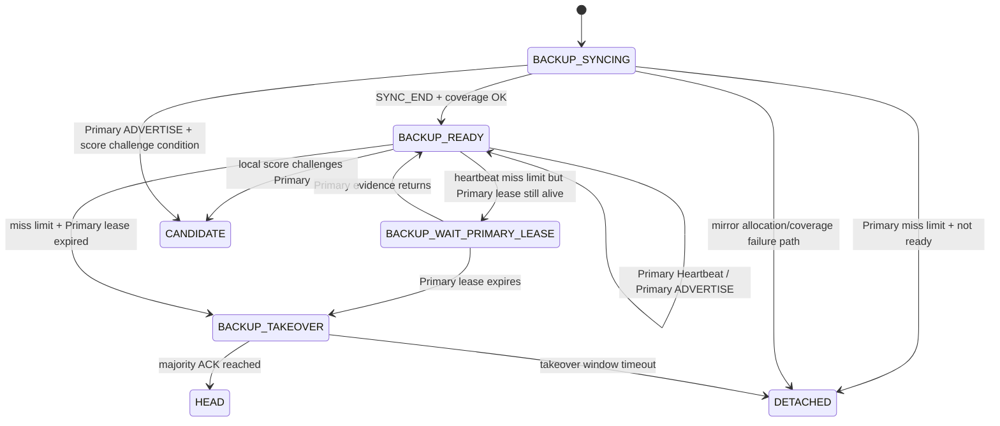

这里：

```text
BACKUP_SYNCING
BACKUP_READY
BACKUP_WAIT_PRIMARY_LEASE
BACKUP_TAKEOVER
```

都不是 enum Role。

代码里 Role 始终：

```text
BACKUP
```

直到变：

```text
HEAD
CANDIDATE
DETACHED
MEMBER
```

---

# 26. BACKUP_ASSIGN 当前接收逻辑

允许当前节点 Role：

```text
MEMBER
JOIN_PENDING
BACKUP
```

expected Head：

```text
MEMBER:
    current head_node_id

JOIN_PENDING:
    pending_head_node_id

BACKUP:
    backup_primary_node_id
```

接收方先按当前角色选择的 Active / Pending Epoch 校验：

```text
MEMBER / BACKUP:
    message.cluster_id / term == active Epoch

JOIN_PENDING:
    message.cluster_id / term == pending Epoch
```

`backup_generation` 必须非零且未到 serial rotation 阈值。校验失败时不写入
`known_backup_*`，直接按 REPLAY 拒绝。

如果：

```text
sync_token != local_node_id
```

仅在全部校验通过后记录 `known_backup_node_id/generation`，不切 Role。

如果本机是 Backup：

```text
generation 相同 -> OK
generation 不同 -> REPLAY
```

如果本机不是 Backup 且：

```text
head_capable == true
sync_token == local
```

则先完成合法的 `JOIN_PENDING/MEMBER -> BACKUP` transition；**仅当
transition 成功**才一起提交：

```text
role = BACKUP

cluster_id = message.cluster_id
term = message.term
head_node_id = message.head_node_id

backup_syncing = true
backup_ready = false

backup_primary_node_id = source
backup_generation = message.backup_generation

membership_sequence = 0
```

并清理上一轮 Backup takeover 的 deadline、ACK、announce cursor 和 active
标志。若 transition 失败，不提交任何 Assignment 结果；这保证重入和失败路径
不会留下半更新的 known-backup 或 takeover 状态。

---

# 27. Backup Snapshot 当前线格式

当前 Type 12：

```text
member_node_id        32 bit
member_lease_ms       32 bit
membership_sequence   wire 16 bit
member_nonce          wire 16 bit
```

内存中：

```text
membership_sequence = uint32_t
member.last_nonce    = uint32_t
```

发送时实际：

```c
message.membership_sequence = (uint16_t)next_sequence;
message.member_nonce = cluster->members[index].last_nonce;
```

Wire codec 会把：

```text
membership_sequence
member_nonce
```

编码成 16 bit。

---

# 28. Backup Snapshot 当前状态流程

Head：

```text
SYNC_BEGIN
Member 1
Member 2
...
Member N
SYNC_END
```

每帧成功发送后：

```text
membership_sequence++
backup_sync_cursor++
```

Token Bucket 发送失败：

```text
sequence/cursor 不推进
稍后重发同一帧
```

---

# 29. Backup 接收 Snapshot

## SYNC_BEGIN

当前先校验 incoming sequence 非零且未到 rotation 阈值，然后：

```text
clear_members()

membership_sequence =
    incoming sequence

backup_syncing = true
backup_ready = false

refresh primary heartbeat/lease deadline
```

所以 SYNC_BEGIN 会立即清掉旧 mirror。

---

## 普通 Member Record

要求：

```text
incoming membership_sequence
==
cluster_serial_next_checked(local membership_sequence)
```

不允许用裸 `+ 1` 产生或接受回绕值。校验失败时：

```text
backup_syncing = true
backup_ready = false
membership_sequence = 0
return REPLAY
```

---

## SYNC_END

`SYNC_END` 使用其已通过 checked-next 验证的 incoming sequence；接收方不再
自行执行 `membership_sequence++`。发送方同样先通过
`cluster_serial_next_checked()` 生成下一序列，并且只在物理发送成功后提交
该 sequence/cursor。

随后：

```text
backup_covers_all_members()
```

成功：

```text
backup_syncing = false
backup_ready = true

send BACKUP_READY
```

失败：

```text
backup_clear_sync()
```

而 `backup_clear_sync()`：

```text
backup_syncing = false
backup_ready = false
backup_primary_node_id = 0
backup_generation = 0
membership_sequence = 0
clear_members()

set_detached(recovery_observation_ms)
```

---

# 30. 当前 Backup Coverage 判断

当前检查：

```text
每个 mirrored member
是否 find_peer(member_id) != NULL
```

但 peer table 同时保存：

```text
ADMITTED
SUSPECT
```

Coverage 不再次判断：

```text
neighbor_state == ADMITTED
```

所以当前实际：

```text
SUSPECT peer 也可满足 coverage
```

---

# 31. BACKUP_READY 当前 Head 处理

当前 Handler：

```c
if (role != HEAD ||
    source != backup_node_id)
    ACCESS ERROR;

backup_ready = true;
```

它**不检查消息里的**：

```text
cluster_id
term
membership_sequence
backup_generation
```

甚至：

```text
(void)message;
```

直接忽略 message 内容。

---

# 32. Primary Heartbeat 当前 Backup 处理

Head 发送：

```text
PRIMARY_HEARTBEAT
cluster_id
term
head_node_id
membership_sequence
```

Backup 接收时仅判断：

```text
role == BACKUP
source == backup_primary_node_id
```

然后：

```text
backup_primary_deadline =
    now + keepalive_interval

backup_primary_lease_deadline =
    now + lease_ms

backup_missed_heartbeats = 0
```

消息内容同样：

```text
(void)message;
```

没有进一步校验。

---

# 33. Backup 同时还把 Primary ADVERTISE 当作活性证据

如果 BACKUP 收到：

```text
candidate.source == backup_primary_node_id
candidate.cluster_id == cluster_id
candidate.term == term
```

会：

```text
backup_primary_lease_deadline =
    now + lease_ms
```

所以：

```text
PRIMARY_HEARTBEAT
+
HEAD_ADVERTISE
```

都可以延长 Primary Lease。

---

# 34. Backup Score Challenge 当前逻辑

BACKUP 收到当前 Primary 的 Head ADVERTISE 时：

如果：

```text
local head_score
比 Primary score 改善达到
switch_improvement_percent

并且：

role tenure >= head_min_tenure_ms
```

则：

```text
backup_challenge()
```

实际变化：

```text
backup_ready = false
backup_syncing = false
backup_primary_node_id = 0

backup_takeover_active = false

role = CANDIDATE

cluster_id 保持原 Cluster
term = term + 1（UINT32_MAX 时 wrap 到 1）
head_node_id = local
```

所以：

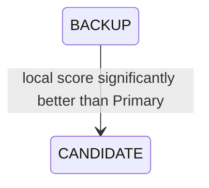

这是**同 Cluster 内 Backup 主动发起的新 Term election challenge**。

---

# 35. Primary 失效判定当前逻辑

Backup 有两个 deadline：

```text
backup_primary_deadline_ms
backup_primary_lease_deadline_ms
```

第一个：

```text
每 keepalive interval 检一次 heartbeat miss
```

每次到期：

```text
backup_missed_heartbeats++
```

达到：

```text
UCN_CLUSTER_BACKUP_MISS_LIMIT
```

之后分情况。

---

# 36. Primary Lost + Backup READY

如果：

```text
backup_ready == true
backup_takeover_active == false
missed >= limit
```

还要检查：

```text
backup_primary_lease_deadline expired?
```

如果没过期：

```text
继续 role=BACKUP
等待
```

如果过期：

```text
start_takeover()
```

---

# 37. Primary Lost + Backup NOT READY

如果：

```text
missed >= limit
backup_ready == false
backup_takeover_active == false
```

当前：

```text
stats.head_leases_expired++

recovery_eligible = true

backup_clear_sync()
```

然后：

```text
BACKUP -> DETACHED
```

此时 Detached 后会走 Recovery 路径。

---

# 38. Backup Takeover 当前实际状态

`start_takeover()`：

```text
role 仍然 = BACKUP

backup_takeover_active = true
backup_takeover_ack_count = 0
backup_takeover_acked bitmap = 0
prepare_cursor = 0

takeover_deadline =
    now + TAKEOVER_WINDOW
```

所以：

```text
BACKUP_TAKEOVER
```

是隐式状态。

---

# 39. Takeover Prepare

Backup 遍历 mirror `members[]`：

跳过：

```text
空 slot
local self
已经 ACK 的 member
```

逐个发送：

```text
TAKEOVER_PREPARE

cluster_id = current
term = current
head_node_id = old Primary
backup_generation = current
```

---

# 40. 当前 Takeover Majority 算法

收到 ACK 时：

```c
active = member_count_u16(cluster);
majority = active / 2 + 1;
```

然后：

```text
ACK source 必须存在于 mirror members[]
```

每个 slot 用 bitmap 防重复计数。

达到：

```text
backup_takeover_ack_count >= majority
```

执行：

```text
complete_takeover()
```

当前 Backup 自己：

```text
没有自动 self vote
```

但 `member_count_u16()` 可能包含 Backup 自身 mirror slot。

---

# 41. Takeover 成功

`complete_takeover()`：

```text
role = HEAD

term =
    UINT32_MAX ? 1 : term + 1

head_node_id = local

backup_takeover_active = false
backup_syncing = false
backup_ready = false

backup_node_id = 0
backup_primary_node_id = 0

known_backup_node_id = 0
known_backup_generation = 0
```

继承 mirror members：

```text
如果 member == local self：
    删除

其它：
    lease = now + lease_ms
```

然后通过：

```text
HEAD_TAKEOVER
```

逐个通知继承成员。

---

# 42. Takeover 成功时序

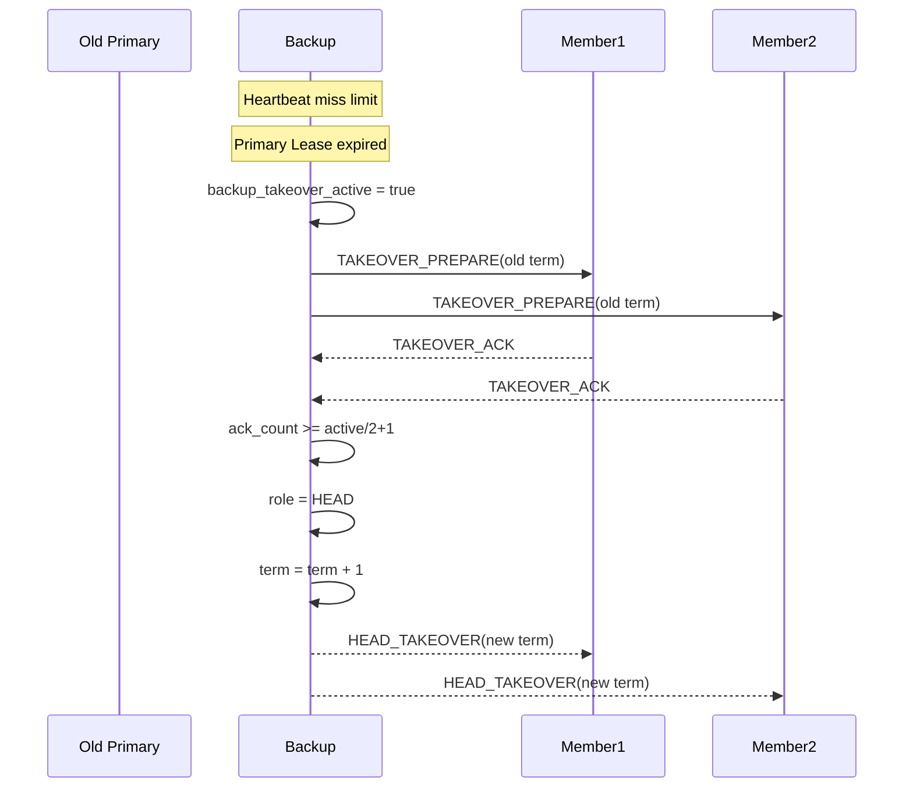

---

# 43. Takeover 超时当前行为

如果：

```text
backup_takeover_active
&& takeover_deadline expired
```

当前：

```text
stats.head_leases_expired++
backup_clear_sync()
return
```

即：

```text
BACKUP -> DETACHED
```

但是这里**没有显式**：

```text
recovery_eligible = true
```

所以如果该字段之前还是 false：

```text
DETACHED observation timeout
-> 普通 start_election()
```

而不是 Recovery。

这与“Backup not READY 时 Primary lost”的路径不同。

---

# 44. HEAD_TAKEOVER 当前 Member 接收

允许当前 Role：

```text
MEMBER
BACKUP
JOIN_PENDING
RECOVERY_HEAD
```

一般 Role 必须：

```text
message.cluster_id == current cluster_id
```

`RECOVERY_HEAD` 的例外也不是任意 foreign Cluster：仅当 incoming
`cluster_id == last_cluster_id`、`last_stable_head != 0` 时，才进入该已记录
稳定历史域。

所有 Role 都还要求：

```text
source == known_backup_node_id

message.backup_generation ==
known_backup_generation
```

以及：

```text
same active identity:
    message.term > current term

Recovery historical identity:
    message.term > max_seen_term
```

因此 foreign Cluster 的 Term 永不与 Recovery local Term 直接比较；同时
`message.head_node_id` 必须等于来源节点。

成功后直接：

```text
role = MEMBER
cluster_id = message.cluster_id
term = message.term
head_node_id = source

清 Backup / Recovery 部分状态
```

---

# 45. Head 成员 Lease 当前逻辑

HEAD 每次 `ucn_cluster_step()`：

```text
expire_members()
```

过期 Member：

```text
从 members[] 删除
stats.member_leases_expired++
```

如果过期成员就是 Backup：

```text
backup_node_id = 0
backup_ready = false
```

然后如果成员有变化：

```text
backup_resync()
```

但是：

```text
backup_node_id == 0
```

时 `backup_resync()` 直接返回。

当前不会：

```text
立即 assign_backup()
```

---

# 46. Member KEEPALIVE 当前 Head 处理

KEEPALIVE：

```text
require HEAD
require message.cluster_id == cluster
require message.term == term
require message.head_node_id == local
```

找到 Member：

```text
message.nonce > member.last_nonce
```

成功：

```text
member.last_nonce = message.nonce
member.lease = now + config.lease
```

但是当前：

```text
KEEPALIVE 不触发 backup_resync()
```

所以 Backup mirror 的：

```text
member nonce
```

不会随普通 KEEPALIVE 实时更新。

---

# 47. LEAVE 当前 Head 处理

收到 LEAVE：

```text
require role == HEAD
require cluster_id same
require term same
```

然后：

```text
remove_member(source)
```

没有检查：

```text
LEAVE nonce
```

remove_member：

```text
清 member slot

如果是 Backup：
    backup_node_id = 0
    backup_ready = false

backup_resync()
```

---

# 48. HEAD 当前没有 Majority/Fencing 状态

当前 HEAD 的 `ucn_cluster_step()` 主要做：

```text
expire_members
advertise
Backup assignment
Primary heartbeat
Takeover announce
Backup snapshot
Snapshot retry
```

当前没有：

```text
Head Quorum
Authority Lease
HEAD_FENCED
```

所以：

```text
HEAD 不会因为自己只剩少数派而主动失去 Authority
```

它只会因为：

```text
收到另一个 Head Offer
并满足 current convergence 条件
```

进入 Stepdown。

---

# 49. Head-to-Head 当前收敛

收到另一个 Head candidate 前先：

```text
candidate.available_capacity == 0
-> ignore
```

容量不为 0 后：

### 对方 Term 更大

```text
begin_ordered_stepdown()
```

立即让位。

### 对方 Term 更小

```text
ignore
```

### Term 相同

需要：

```text
candidate score 比自己高 improvement threshold

连续 better_samples >= switch_required_samples

并且 local Head tenure >= head_min_tenure_ms
```

才：

```text
begin_ordered_stepdown()
```

---

# 50. 当前 Head-to-Head 图

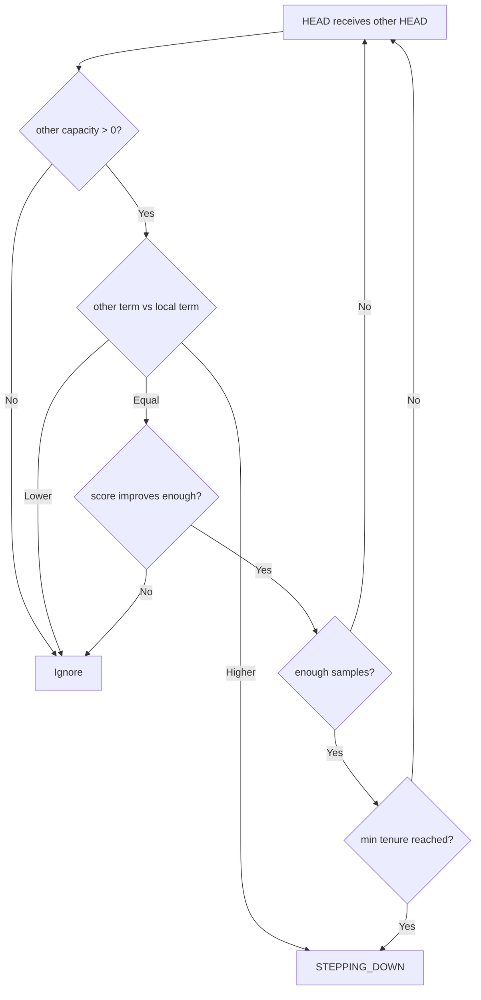

这里当前代码没有先要求：

```text
candidate.cluster_id == local cluster_id
```

所以 Head Branch 的 Term 比较实际上可能发生在：

```text
不同 cluster_id
```

之间。

---

# 51. Ordered Stepdown 当前逻辑

`begin_ordered_stepdown()`：

先：

```text
send_head_stepdown() 给所有 members[]
```

然后：

```text
role = STEPPING_DOWN
stepdown_deadline =
    now + keepalive_interval

pending target =
    candidate head/cluster/term/score
```

---

# 52. HEAD_STEPDOWN 当前消息

当前消息仍使用 legacy Type 9 字段：

```text
cluster_id = old Head cluster
term = old Head term
head_node_id = old Head
head_score = old Head score
nonce
```

**消息本身没有包含 target Head。**

Member 收到：

```text
HEAD_STEPDOWN
```

当前仅允许：

```text
role == MEMBER
OR role == JOIN_PENDING

并且：
source == cluster->head_node_id
```

成功：

```text
set_detached()
```

它不会从 HEAD_STEPDOWN 得知：

```text
Head 想让自己去哪个 target
```

---

# 53. Backup 不处理 HEAD_STEPDOWN

当前 dispatch：

```text
HEAD_STEPDOWN
```

允许：

```text
MEMBER
JOIN_PENDING
```

不允许：

```text
BACKUP
```

所以 Head Ordered Stepdown 时：

```text
普通 Member -> DETACHED
Backup -> 仍然 BACKUP
```

---

# 54. STEPPING_DOWN 当前行为

进入后：

```text
不再走 HEAD 的 advertise/member/backup step
```

到：

```text
stepdown_deadline expired
```

执行：

```text
clear_members()

role = JOIN_PENDING
role_since = now
next_join_retry = now
stepdown_deadline = 0
```

这里 Head 自己保存的：

```text
pending_head_node_id
pending_cluster_id
pending_term
pending_head_score
```

来自 `begin_ordered_stepdown()`，因此它自己知道目标。

---

# 55. Ordered Stepdown 时序

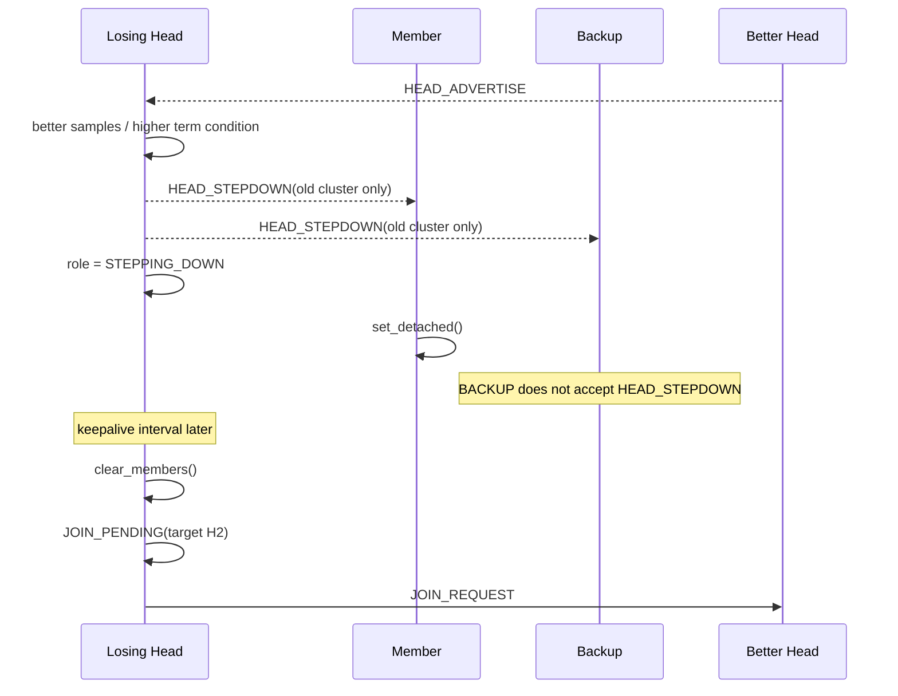

---

# 56. RECOVERY 当前逻辑不是独立 Election Role

当前公开只有：

```text
RECOVERY_HEAD
```

没有：

```text
RECOVERY_OBSERVE
RECOVERY_ELECTION
RECOVERY_CANDIDATE
```

这些都隐含在：

```text
DETACHED
+
recovery_eligible
+
recovery_backoff_deadline
+
recovery_cooldown
```

---

# 57. Recovery 进入路径

当前主要路径 1：

```text
MEMBER Head lease expired
-> Member Grace
-> Grace expired
-> recovery_eligible = true
-> DETACHED(recovery observation)
```

路径 2：

```text
BACKUP Primary lost
-> Backup not READY
-> recovery_eligible = true
-> backup_clear_sync
-> DETACHED
```

路径 3：

```text
RECOVERY_HEAD TTL expired
-> set_detached
-> recovery_eligible 保持 true
```

Takeover timeout：

```text
BACKUP -> DETACHED
```

但并不在该路径显式设置：

```text
recovery_eligible=true
```

---

# 58. Recovery Backoff

`start_recovery_backoff()`：

```text
recovery_nonce = next_nonce()

recovery_backoff_deadline =
    now + local_node_id % recovery_backoff_max_ms
```

当前 Backoff 只使用：

```text
node_id % max
```

没有 Candidate Table / quorum 决策。

---

# 59. declare_recovery_head()

Backoff 到期且 quorum 满足时，先向 Cluster ID Provider 申请一个新的
Recovery identity；Provider 拒绝或返回保留/父簇 ID 时保持在 Recovery
Election 并返回错误。成功后：

```text
role = RECOVERY_HEAD

recovery_cluster_id = make_cluster_id(
    RECOVERY, parent_cluster_id, parent_term, incarnation, round)

cluster_id = recovery_cluster_id
term = 1
head_node_id = local_node_id
current_head_score = local score

recovery_deadline =
    now + recovery_head_ttl

send RECOVERY_DECLARE
```

不需要：

```text
ACK
多数派
其他 candidate 同意
```

---

# 60. Recovery Head 当前形成流程

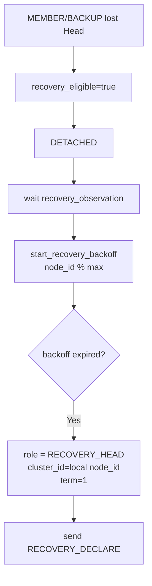

---

# 61. RECOVERY_DECLARE 当前接收

允许当前 Role：

```text
MEMBER
BACKUP
DETACHED
```

Member 如果 Head Lease 还没过期：

```text
拒绝
```

否则：

```text
如果相同 recovery_nonce + source 已 ACK：
    return OK

recovery_nonce = message.recovery_nonce
known_recovery_source = source

send RECOVERY_ACK
```

但它**不会**：

```text
role = MEMBER
cluster_id = recovery cluster
head_node_id = recovery source
```

所以 ACK 节点不会真正加入 Recovery Head。

---

# 62. RECOVERY_ACK 当前作用

Recovery Head：

```text
检查：
role == RECOVERY_HEAD
message.cluster_id == recovery_cluster_id
message.head_node_id == local
```

然后：

```text
recovery_ack_count++
```

注释明确：

```text
ACK informational only
does not gate Recovery Head establishment
```

所以：

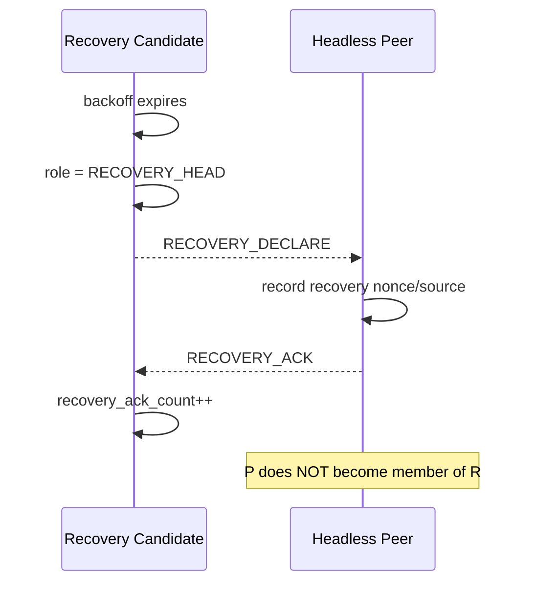

---

# 63. RECOVERY_HEAD TTL

当前：

```text
recovery_deadline expired
```

立即：

```text
stepdown_recovery_head()
```

它会：

```text
recovery_cooldown_until =
    now + recovery_observation

清部分 recovery state

保留：
recovery_eligible

set_detached()
```

所以之后：

```text
DETACHED
-> cooldown
-> backoff
-> 再次 RECOVERY_HEAD
```

---

# 64. Recovery Head 看到 Stable Head

通过普通：

```text
HEAD ADVERTISE
```

进入 `consider_head_offer()`。

但是在处理 Recovery Head 之前仍然有：

```text
candidate.available_capacity == 0
-> return
```

容量非零：

```text
RECOVERY_HEAD
-> begin_ordered_stepdown()
-> STEPPING_DOWN
```

---

# 65. Recovery Head 接受 HEAD_TAKEOVER

`handle_head_takeover()` 特殊允许：

```text
role == RECOVERY_HEAD
```

而且 Recovery Head 只允许接收其已记录的稳定历史：

```text
incoming cluster_id == last_cluster_id
last_stable_head != 0
```

随后仍要求：

```text
source == known_backup_node_id
backup_generation == known_backup_generation
incoming term > max_seen_term
```

普通 active identity 仍是同 Cluster 的 `incoming term > current term`。
两种域均要求 `message.head_node_id == source`；任意其它 Cluster identity
一律拒绝，不能用数值更大的 foreign Term 触发 takeover。

成功：

```text
RECOVERY_HEAD -> MEMBER
```

---

# 66. ADVERTISE 当前 Role 行为汇总

| 当前 Role | 收到 HEAD ADVERTISE 当前行为 |
|---|---|
| DISABLED | receive 通常不会用于 disabled object |
| DETACHED | capacity>0 时 `begin_join()` |
| CANDIDATE | capacity>0 时 `begin_join()` |
| JOIN_PENDING | target 不同或 Term 更高时 retarget |
| MEMBER/current Head | 刷新 lease |
| MEMBER/other Head | score improvement samples 后主动 LEAVE + Join |
| HEAD | 比 Term/score/tenure，可能 Stepdown |
| BACKUP/current Primary | 刷 Primary lease；可能 score challenge |
| BACKUP/other Head | ignore |
| STEPPING_DOWN | 对原 pending Head 的重复/更旧 offer 保持 ordered grace；同簇更高 Term 重新定向 pending Epoch 并进入 JOIN_PENDING |
| RECOVERY_HEAD | capacity>0 时 ordered stepdown |

---

# 67. 当前 `ucn_cluster_receive()` 总入口

收到任何 Cluster frame，先：

```text
1. cluster enabled?
2. source 合法且不是自己?
3. protected_control 满足配置?
4. source 必须在 peer table
5. peer state 必须 ADMITTED
6. decode 28-byte v3
7. message validity
8. 特定消息检查 head_node_id/source
9. switch(message.type)
```

---

# 68. 当前 Message Dispatch

```mermaid
flowchart TD
    RX[ucn_cluster_receive] --> SEC[Security + ADMITTED peer]
    SEC --> DEC[Decode v3]
    DEC --> TYPE{Message Type}

    TYPE --> ADV[ADVERTISE / HEAD_DECLARE<br/>observe_candidate + consider_head_offer]
    TYPE --> HT[HEAD_TAKEOVER<br/>handle_head_takeover]
    TYPE --> JR[JOIN_REQUEST<br/>handle_join_request]
    TYPE --> JA[JOIN_ACCEPT<br/>handle_join_accept]
    TYPE --> JJ[JOIN_REJECT<br/>JOIN_PENDING -> DETACHED]
    TYPE --> KA[KEEPALIVE<br/>Head member lease]
    TYPE --> LV[LEAVE<br/>Head remove member]
    TYPE --> SD[HEAD_STEPDOWN<br/>Member/JoinPending -> DETACHED]
    TYPE --> BA[BACKUP_ASSIGN]
    TYPE --> BR[BACKUP_READY]
    TYPE --> BS[BACKUP_MEMBER_SYNC]
    TYPE --> PH[PRIMARY_HEARTBEAT]
    TYPE --> TP[TAKEOVER_PREPARE]
    TYPE --> TA[TAKEOVER_ACK]
    TYPE --> RD[RECOVERY_DECLARE]
    TYPE --> RA[RECOVERY_ACK]
```

---

# 69. 当前 `ucn_cluster_step()` 的真实执行顺序

这是理解当前状态机非常关键的一点。

当前代码是**一串按顺序执行的 if**，不是：

```text
switch(role) {
  case ...
}
```

大致顺序：

```text
1. MEMBER Head Lease / Grace
2. HEAD member expiry + advertisement + Backup work
3. BACKUP heartbeat miss / takeover trigger
4. BACKUP takeover timeout
5. BACKUP takeover prepare
6. DETACHED observation -> election/recovery
7. CANDIDATE election completion
8. RECOVERY_HEAD TTL
9. STEPPING_DOWN deadline
10. CANDIDATE advertise
11. JOIN_PENDING join retry
12. MEMBER/BACKUP keepalive
```

---

# 70. 当前 Step 伪代码（按代码实际结构）

```c
step()
{
    now = cluster_now();

    if (role == MEMBER && head_lease_expired) {
        if (head_grace_deadline == 0) {
            head_grace_deadline =
                now + keepalive_interval;
        }
        else if (grace_expired) {
            recovery_eligible = true;
            set_detached(recovery_observation);
        }
    }

    if (role == HEAD) {
        expire_members();

        if (advertise_due)
            send_next_advertisement();

        if (backup exists &&
            assignment timer due)
            start_backup_assignment_cycle();

        send_backup_heartbeat();
        send_takeover_announce_step();
        send_backup_assignment_step();
        send_backup_snapshot_step();

        if (backup exists &&
            !backup_ready &&
            snapshot finished &&
            resync deadline expired) {
            backup_resync();
        }
    }

    if (role == BACKUP &&
        heartbeat_check_deadline expired) {

        missed_heartbeats++;

        if (missed >= limit) {

            if (backup_ready &&
                !takeover_active) {

                if (primary_lease_expired)
                    start_takeover();
            }
            else if (!takeover_active) {
                recovery_eligible = true;
                backup_clear_sync();
                return;
            }
        }

        restart heartbeat check deadline;
    }

    if (role == BACKUP &&
        takeover_active &&
        takeover_deadline expired) {

        backup_clear_sync();
        return;
    }

    if (role == BACKUP &&
        takeover_active) {

        send_takeover_prepare_step();
    }

    if (role == DETACHED &&
        head_capable &&
        observation expired) {

        if (recovery_eligible &&
            recovery cooldown active) {
            // wait
        }
        else if (recovery_eligible) {

            if (recovery_backoff == 0)
                start_recovery_backoff();
            else if (recovery_backoff expired)
                declare_recovery_head();
        }
        else {
            start_election();
        }
    }

    if (role == CANDIDATE &&
        election_deadline expired) {

        complete_election();
    }

    if (role == RECOVERY_HEAD &&
        recovery TTL expired) {

        stepdown_recovery_head();
        return;
    }

    if (role == STEPPING_DOWN &&
        stepdown deadline expired) {

        clear_members();
        role = JOIN_PENDING;
        next_join_retry = now;
    }

    if (role == CANDIDATE &&
        advertise due)
        send_advertise();

    if (role == JOIN_PENDING &&
        join retry due)
        send_join_request();

    if ((role == MEMBER ||
         role == BACKUP) &&
        keepalive due)
        send_keepalive();
}
```

---

# 71. 当前 Role + bool 有效状态矩阵

下面是当前代码中实际能表达的典型状态。

| Role | 关键字段 | 实际含义 |
|---|---|---|
| DETACHED | `recovery_eligible=false` | 普通观察 |
| DETACHED | `recovery_eligible=true` | Recovery 等待 |
| DETACHED | `recovery_backoff_deadline!=0` | Recovery backoff |
| JOIN_PENDING | pending target | 正在 Join |
| MEMBER | `head_grace_deadline=0` | 正常 Member |
| MEMBER | `head_grace_deadline!=0` | Head Lease 已过期的 Grace |
| HEAD | `backup_node_id=0` | 没有 Backup |
| HEAD | backup exists + `backup_assign_pending=true` | 广播 Backup Assignment |
| HEAD | backup exists + `backup_ready=false` | Snapshot/等待 Ready |
| HEAD | `backup_ready=true` | Backup Ready |
| HEAD | `backup_takeover_announce_active=true` | takeover 后逐成员宣布 |
| BACKUP | `backup_syncing=true, ready=false` | Syncing |
| BACKUP | `backup_ready=true, takeover=false` | Ready |
| BACKUP | `backup_ready=true` + Primary miss | 等 Primary lease |
| BACKUP | `backup_takeover_active=true` | Takeover |
| STEPPING_DOWN | `stepdown_deadline!=0` | 等待转 Join |
| RECOVERY_HEAD | `recovery_deadline!=0` | 临时 Recovery Head |

---

# 72. 当前 Term 行为

当前有三个地方会增长 Term。

## 普通 Election

```text
start_election():
term = UINT32_MAX ? 1 : term + 1
```

由于 Detached 通常 term=0：

```text
新 Cluster -> term 1
```

---

## Backup Challenge

```text
保持 cluster_id
term++
```

---

## Backup Takeover

```text
保持 cluster_id
term++
```

---

三个地方都允许：

```text
UINT32_MAX -> 1
```

---

# 73. 当前 Nonce 行为

`next_nonce()`：

```text
如果 nonce == 0
或 nonce == UINT32_MAX

则：
    nonce = 1

next_nonce = nonce + 1
```

所以 nonce 也会：

```text
... UINT32_MAX-1
-> 1
```

不是单调永久不回绕。

---

# 74. 当前 Candidate Replay 保护

Candidate table 对：

```text
same candidate source
same cluster_id
same term
```

要求：

```text
message.nonce > candidate.last_nonce
```

否则：

```text
REPLAY
```

如果：

```text
cluster_id 或 term 改变
```

则旧 `last_nonce` 不阻止新 Epoch。

---

# 75. 当前 Member Replay 保护

Head 对：

```text
JOIN_REQUEST
KEEPALIVE
```

使用：

```text
member.last_nonce
```

要求递增。

但当前：

```text
LEAVE
```

不检查 Member nonce。

---

# 76. 当前 Takeover Vote 保护

Member 只记录：

```text
member_voted_term
```

判断：

```text
if member_voted_term == current term:
    已经 ACK
```

没有保存：

```text
cluster_id
backup_generation
backup source
snapshot identity
```

---

# 77. 当前 Backup Generation

Head 选新 Backup：

```text
generation =
    UINT32_MAX
    ? 1
    : generation + 1
```

但是 `remove_member()` / backup loss：

```text
backup_node_id = 0
backup_ready = false
```

generation 仍可能保留，后续 `assign_backup()` 再递增。

Backup `backup_clear_sync()` 则：

```text
backup_generation = 0
```

---

# 78. 当前 Cluster / Recovery Cluster ID

Recovery Head：

```text
recovery_cluster_id = Provider / default derived ID
cluster_id = recovery_cluster_id
term = 1
```

普通 Election 在默认 `incarnation == 0` 的**第一轮**仍保持：

```text
cluster_id = local_node_id
```

之后的普通 Election、所有 Recovery，以及配置了非零 incarnation 的首轮
Election，均通过同一 Provider/default generator 分配不同 ID：

```text
make_cluster_id(purpose, parent_cluster_id, parent_term,
                incarnation, round)
```

Core 拒绝 `0`、broadcast 与父簇 ID 重用。默认生成器只保证同一个对象内的
round 不复用；产品若要求跨重启也不复用，必须提供：

```text
boot incarnation
持久化 boot counter / RNG / 自定义 Provider
```

M04 才会把这些承诺持久化；当前并不宣称掉电后保持 identity lineage。

---

# 79. 当前成员表的双重用途

`members[]` 在 HEAD：

```text
当前真实 Member Table
```

在 BACKUP：

```text
Primary Snapshot Mirror
```

同一个结构复用。

当前没有：

```text
runtime_members
committed_voter_set
staging_members
committed_mirror
```

的明确分离。

---

# 80. 当前 Neighbor Table 行为

`ucn_cluster_sync_neighbors()`：

先：

```text
memset(peers, 0)
```

然后复制：

```text
ADMITTED
SUSPECT
```

超过：

```text
UCN_CLUSTER_MAX_PEERS
```

时：

```text
return NO_SPACE
```

此时前面已经复制的部分保留。

不是临时表成功后再 atomic commit。

---

# 81. 当前 Token Bucket 对状态机的影响

所有发送都经过：

```text
cluster_transmit()
-> token_bucket_take()
```

如果没有 token：

```text
UCN_ERR_NO_SPACE
```

部分发送状态机专门保证：

```text
发送失败时 cursor/sequence 不推进
```

例如：

```text
Backup Snapshot
Backup Assignment
Takeover Announce
```

所以这些属于：

```text
可重试隐式发送状态
```

---

# 82. 当前 Message Format v3

固定：

```text
28 Bytes
```

公共前 16 B：

```text
version
type
role
flags
cluster_id
term
head_node_id
```

后 12 B 根据 Type 重解释。

消息 Type：

```text
1  ADVERTISE
2  JOIN_REQUEST
3  JOIN_ACCEPT
4  JOIN_REJECT
5  KEEPALIVE
6  LEAVE
7  HEAD_DECLARE
8  HEAD_TAKEOVER
9  HEAD_STEPDOWN
10 BACKUP_ASSIGN
11 BACKUP_READY
12 BACKUP_MEMBER_SYNC
13 PRIMARY_HEARTBEAT
14 TAKEOVER_PREPARE
15 TAKEOVER_ACK
16 RECOVERY_DECLARE
17 RECOVERY_ACK
```

---

# 83. 当前状态迁移总表

| 当前 Role | 事件/条件 | 当前代码动作 | 下一 Role |
|---|---|---|---|
| DISABLED | - | 不运行 Cluster step | DISABLED |
| DETACHED | 收到可接受 HEAD | `begin_join()` | JOIN_PENDING |
| DETACHED | observation timeout + normal | `start_election()` | CANDIDATE |
| DETACHED | recovery backoff expired | `declare_recovery_head()` | RECOVERY_HEAD |
| CANDIDATE | 收到可接受 HEAD | `begin_join()` | JOIN_PENDING |
| CANDIDATE | election win | set `role=HEAD` | HEAD |
| CANDIDATE | election lose | `set_detached()` | DETACHED |
| JOIN_PENDING | JOIN_ACCEPT | commit Head | MEMBER |
| JOIN_PENDING | BACKUP_ASSIGN(self) | setup Backup | BACKUP |
| JOIN_PENDING | JOIN_REJECT from pending source | `set_detached()` | DETACHED |
| JOIN_PENDING | another acceptable Head | retarget pending | JOIN_PENDING |
| MEMBER | current Head advertise | refresh lease | MEMBER |
| MEMBER | better Head enough samples | LEAVE old + `begin_join()` | JOIN_PENDING |
| MEMBER | BACKUP_ASSIGN(self) | setup Backup | BACKUP |
| MEMBER | Head lease first expiry | start grace | MEMBER |
| MEMBER | grace expiry | recovery eligible + detach | DETACHED |
| MEMBER | valid HEAD_TAKEOVER | switch active Head | MEMBER |
| MEMBER | HEAD_STEPDOWN from current Head | detach | DETACHED |
| HEAD | member JOIN | add member; maybe assign Backup | HEAD |
| HEAD | member KEEPALIVE | update member lease | HEAD |
| HEAD | LEAVE | remove member | HEAD |
| HEAD | member timeout | remove member | HEAD |
| HEAD | higher Term Head | ordered stepdown | STEPPING_DOWN |
| HEAD | better same-Term Head | samples + tenure -> stepdown | STEPPING_DOWN |
| BACKUP | snapshot complete | bool ready=true | BACKUP |
| BACKUP | Primary heartbeat | refresh deadline | BACKUP |
| BACKUP | Primary advertise | refresh lease | BACKUP |
| BACKUP | score challenge | same cluster, term++ election | CANDIDATE |
| BACKUP | Primary lost + not ready | recovery eligible + clear | DETACHED |
| BACKUP | Primary lost + ready | start takeover bool | BACKUP |
| BACKUP | takeover majority | `complete_takeover()` | HEAD |
| BACKUP | takeover timeout | clear sync | DETACHED |
| BACKUP | valid HEAD_TAKEOVER | switch | MEMBER |
| STEPPING_DOWN | same Cluster higher-Term Head | retarget pending Epoch | JOIN_PENDING |
| STEPPING_DOWN | deadline | clear members, pending target preserved | JOIN_PENDING |
| RECOVERY_HEAD | TTL | stepdown recovery | DETACHED |
| RECOVERY_HEAD | stable Head advertise | ordered stepdown | STEPPING_DOWN |
| RECOVERY_HEAD | valid HEAD_TAKEOVER | stable Member | MEMBER |

---

# 84. 当前“实际状态机”与 Target FSM 的核心差异

下面只用于对照，不改变前面的 Current 描述。

| 主题 | 当前实现 | Target FSM |
|---|---|---|
| 内部状态 | `role + bool + deadline` | 唯一 `phase` |
| Member Grace | Role 仍是 MEMBER | `MEMBER_TAKEOVER_GRACE` |
| Head Backup 状态 | HEAD + 多字段 | `HEAD_NO_BACKUP / ASSIGNING / SYNCING / STABLE` |
| Head Fencing | 没有 | `HEAD_FENCED` |
| Backup Sync | BACKUP + bool | `BACKUP_SYNCING` |
| Backup Ready | BACKUP + bool | `BACKUP_READY` |
| Backup Takeover | BACKUP + bool | `BACKUP_TAKEOVER` |
| Recovery Election | DETACHED + bool/deadline | `RECOVERY_OBSERVE / ELECTION` |
| Head Authority quorum | 没有 | 必须有 |
| Takeover quorum denominator | `members[]` | `CommittedVoterSet` |
| Backup self vote | 没有 | 明确定义 |
| Vote identity | 只记 Term | 完整 Vote Epoch |
| Snapshot | 单表直接清空 | staging/committed 双缓冲 |
| Snapshot identity | sequence | generation + snapshot_id + sequence |
| Member nonce wire | 16 bit | 32 bit |
| Membership sequence wire | 16 bit | 32 bit |
| Backup Ready 验证 | 主要只验 source | 完整 Epoch/Snapshot |
| Primary heartbeat 验证 | 主要只验 source | 完整 Backup Epoch |
| Backup lost | 可能长期无 Backup | 立即重新选择 |
| Member 主动跳 Head | 当前允许 | Target 建议由 Head Merge 控制 |
| HEAD_STEPDOWN | target 不在线上传 | target 明确携带 |
| Backup 处理 Stepdown | 不处理 | 必须处理 |
| Term wrap | `MAX -> 1` | 禁止同 Cluster wrap |
| Detached | 清 cluster/term | 保留安全历史 |
| Recovery ACK | informational only | Recovery membership/election 完整化 |
| Head lost majority | 仍可能继续 HEAD | FENCE |
| Different cluster Term | 当前 Head 路径可能直接比较 | Target 不直接比较 |
| Cluster ID | 常等于 node_id | Target 建议 incarnation/epoch 唯一化 |

---

# 85. Current -> Target 状态映射

```mermaid
flowchart LR
    CM["Current MEMBER<br/>head_grace=0"] --> TM["Target MEMBER_ACTIVE"]
    CMG["Current MEMBER<br/>head_grace!=0"] --> TMG["Target MEMBER_TAKEOVER_GRACE"]

    CH0["Current HEAD<br/>backup_node_id=0"] --> TH0["Target HEAD_NO_BACKUP"]
    CHA["Current HEAD<br/>backup_assign_pending"] --> THA["Target HEAD_BACKUP_ASSIGNING"]
    CHS["Current HEAD<br/>backup_ready=false"] --> THS["Target HEAD_BACKUP_SYNCING"]
    CHR["Current HEAD<br/>backup_ready=true"] --> THR["Target HEAD_STABLE"]

    CBS["Current BACKUP<br/>backup_syncing"] --> TBS["Target BACKUP_SYNCING"]
    CBR["Current BACKUP<br/>backup_ready"] --> TBR["Target BACKUP_READY"]
    CBT["Current BACKUP<br/>takeover_active"] --> TBT["Target BACKUP_TAKEOVER"]

    CRD["Current DETACHED<br/>recovery_eligible"] --> TRO["Target RECOVERY_OBSERVE"]
    CRB["Current DETACHED<br/>recovery backoff"] --> TRE["Target RECOVERY_ELECTION"]

    CHEAD["Current HEAD<br/>no quorum concept"] --> TF["Target HEAD_FENCED<br/>when quorum lost"]
```

---

# 86. 如果后续逐步修改，最适合的对照方式

建议以后每改一块都按：

```text
CURRENT
↓
明确当前字段和 Handler
↓
TARGET
↓
把隐式状态变成明确 phase
↓
补测试
```

例如 Backup：

```text
CURRENT:

role = BACKUP
backup_syncing = true
backup_ready = false
backup_takeover_active = false

↓

TARGET:

phase = BACKUP_SYNCING
```

再比如 Member Grace：

```text
CURRENT:

role = MEMBER
head_grace_deadline_ms != 0

↓

TARGET:

phase = MEMBER_TAKEOVER_GRACE
```

Head：

```text
CURRENT:

role = HEAD
backup_node_id != 0
backup_ready = true

↓

TARGET:

phase = HEAD_STABLE
```

---

# 87. 当前实现最应该重点关注的“状态组合”

为了后续修正，建议优先针对这些组合写测试：

```text
1. MEMBER + head_grace_deadline != 0
2. BACKUP + backup_syncing=true
3. BACKUP + backup_ready=true
4. BACKUP + backup_takeover_active=true
5. HEAD + backup_node_id=0
6. HEAD + backup_assign_pending=true
7. HEAD + backup_ready=false + snapshot cursor finished
8. DETACHED + recovery_eligible=true
9. DETACHED + recovery_backoff_deadline!=0
10. RECOVERY_HEAD + known_backup fields
11. STEPPING_DOWN + Backup 仍未收到有效 stepdown
```

这些就是当前实现最接近“隐式 Phase”的地方。

---

# 88. 当前测试文件实际覆盖的主要状态

`tests/test_cluster.c` 当前包含：

```text
codec/security
v3 codec
backup sync
takeover guard
recovery head
stable switchback
backup challenge
timing profiles
election/join/failover
capacity bounded
neighbor summary API
```

其中端到端 failover 测试确认当前期望：

```text
Node 1 = Head
Node 2 = Backup
Node 3/4 = Members

Node 1 down

Node 2 takeover

cluster_id 保持 1
term 1 -> 2
Node 2 becomes HEAD
Node 3/4 switch to Node 2
```

---

# 89. 当前测试确认的 Recovery 行为

当前 Recovery 测试明确期待：

```text
Primary + Backup gone

head-capable Member:
    Head Lease Grace
    -> Detached Recovery Observation
    -> Recovery Backoff
    -> RECOVERY_HEAD

Recovery Head:
    cluster_id = local node_id
    term = 1

收到至少一个 Recovery ACK

TTL expired:
    -> DETACHED

之后可重新声明 Recovery Head
```

Recovery ACK 数量只作为测试中的信息结果，不作为成为 Recovery Head 的前置条件。

---

# 90. 当前测试确认的 Backup Challenge

当前测试明确期待：

```text
Backup score = 9500
Primary score = 6000

Backup tenure >= head_min_tenure

收到 Primary ADVERTISE

-> BACKUP -> CANDIDATE

cluster_id 保持原值
term 1 -> 2
head_node_id = Backup self
```

---

# 91. 当前实现的最简抽象

当前 Cluster 状态机可以压缩成：

```mermaid
flowchart TD
    START[Init] --> D[DETACHED]

    D --> C[CANDIDATE]
    C --> H[HEAD]
    C --> J[JOIN_PENDING]

    D --> J
    J --> M[MEMBER]

    M --> B[BACKUP]
    M --> D
    M --> J

    H --> SD[STEPPING_DOWN]
    SD --> J

    B --> H
    B --> C
    B --> D
    B --> M

    D --> RH[RECOVERY_HEAD]
    RH --> D
    RH --> SD
    RH --> M

    H -. "内部 bool" .-> HB["Backup Assign / Sync / Ready"]
    B -. "内部 bool" .-> BB["Sync / Ready / Takeover"]
    M -. "deadline" .-> MG["Head Grace"]
    D -. "bool+deadline" .-> RG["Recovery Observe/Backoff"]
```

---

# 92. 最重要的一句话

**这份 Current FSM 描述的是现在代码真实存在的状态。**

当前实现本质上是：

```text
9 个公开 Role
+
多个 bool
+
多个 deadline
+
多个 cursor
+
同一个 members[] 在 Head/Backup 下复用
```

而上一份 Target FSM 的核心方向则是：

```text
把这些隐式状态展开成唯一、互斥、可证明的 Phase。
```

所以后续修改时，不建议直接按照 Target 一次性重写全部代码。

更稳妥的是：

```text
第一步：
把 Current 隐式状态逐个显式化，但先保持行为不变。

第二步：
用测试证明 Current -> Explicit Current 行为一致。

第三步：
再按 Target 修正 Quorum / Fencing / Epoch / Recovery / Replay。

第四步：
逐个删除旧 bool 组合。
```

这样最容易避免“大改状态机以后不知道到底改坏了哪一条路径”。

---

# 93. 建议后续文件关系

```text
UCN_V5_Cluster_CURRENT_FSM.md
    ↑
    当前代码真实行为
    本文档

UCN_V5_Cluster_FSM_Design.md
    ↑
    理想 Target FSM

UCN_V5_Cluster_CURRENT_TO_TARGET.md
    ↑
    后续可以继续整理：
    每个函数
    每个字段
    每个状态
    每条消息
    应该如何从 Current 迁移到 Target
```
