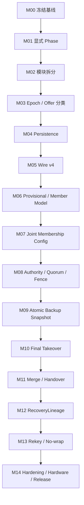

# UCN V5 Cluster：从 Current `a571853` 迁移到 Target FSM v2 的详细修改方案与任务表

> **Current 基线**：`a5718534ef4014f240bbe8b1640dde0328eb8669`（代码语义基线；后续仅注释/文档类提交不影响基线）  
> **Current 文档**：`UCN_V5_Cluster_CURRENT_FSM_a571853.md`  
> **Target 文档**：`UCN_V5_Cluster_FSM_Design_v2.md`  
> **任务总数**：154  
> **原则**：测试先行、一次只改一种协议语义、每个里程碑都能独立回归、Safety 优先于 Availability。  
>
> **执行状态（CLV2-00-08）**：
>
> | 里程碑 | 状态 | 完成提交 | 审计 |
> |---|---|---|---|
> | M00 冻结基线 | DONE | 6bea852 + M00.1(6206ce2) + M00.2(2b222b7) | 用户正式签字 PASS（2026-08-15），授权进入 M01 |
> | M01 显式 Phase | DONE | 01-01..01-04f 全部闭环（OP-203..210） | 用户正式签字 PASS（2026-08-16，ab53b31）：01-01~03 + 01-04a..f 全序列 PASS；全文件断言达成（无正常路径 phase change 绕过 cluster_transition()）；Shadow-Guard 纪律全站成立；M01.0.2 组合保留；Golden 等价；observed 35/0；cluster_bytes 1096。授权进入 M02（纯结构性重构，不得顺手优化 FSM） |
> | M02 模块拆分 | DONE | 02-01..02-06 + approved scope adjustments 02-07/08（OP-211..216 + M02.1 对齐） | ucn_cluster.c 6216→1667 行；6 模块 + internal header（codec/fsm/membership/backup[+takeover 合并]/recovery/merge）；字节级等价（函数体未动，仅 de-static + 前向声明）；FULL/ASan/LITE/NANO 全绿；observed 35/0；golden 逐字节不变；cluster_bytes 1096；Core 不反向依赖；whole-Cluster EXCLUDE_FROM_ALL 按需链接（per-module trim deferred）；02-07 internal storage contract DONE / opaque split → CLV2-14-02 |
> | M03 Epoch 分类 | DONE / R10 EXTERNAL RE-REVIEW PASS（受限软件范围） | 03-01..03-09 + R01..R10 | 外部逐提交复审已确认 JOIN_PENDING 仅按 Epoch relation 处理：foreign 不读 Term，同簇只按分类处理；R10 的本轮 HOLD 已解除，既有 M03 签字范围恢复。 |
> | M04 Persistence | DONE（软件范围） | 04-01..10 + R17..R23 代码整改完成（未提交） | 外部复审已签署 R23 PASS：旧版合法 Record v1 `PREPARED` 可在受控启动时原子 abort + replay incarnation，M04 软件范围解除 AUDIT HOLD，授权进入 M05。真实 Flash Provider、掉电和 MCU 实机仍未验证，不得误称生产发布。 |
> | M05 Wire v4 | AUDIT HOLD / MAJOR-A 等待外审 | 05-01..12 均已受限签字；`CLV2-05-MAJOR-A` 已自审通过，等待优化级 padding 输出整改的外部复核 | 默认产品仍不得接入 Head/Backup 选择、生产 RX/TX/FSM 或 v4 发送。Release O1/O2/O3（MSVC O1/O2）门禁已通过，但未经外审不得把 Debug 或自审绿灯当作 M05 结案证据。 |
> | M06 Provisional | DONE / 外部复审 GO（受限软件范围） | 06-01..09 与 R01 已完成；外审确认 production RX 在任何状态/计时/统计/shadow 写入前拒绝 v3 Backup/Takeover authority frame，且 legacy bridge 为 target-private。M05 05-01..12 的 codec/contract 子项均已受限签字，但 M05 顶层仍 AUDIT HOLD | 当前明确产品姿态：v3 仅临时 non-voting，10 s 清扫，不得成为 Backup/failover；v3 keepalive 不得续期 provisional deadline。不得据此接入 production v4 RX/TX/FSM、Authority 或 Adapter，也不构成实机、Flash/掉电或互通放行。 |
> | M07 Joint Config | DONE / 外部复审 GO（受限实验软件范围） | 07-00..12 + R24..R30 已完成；外审确认 R25/R26 最终旁路已关闭，未发现新的 P0/P1 | 只签实验 Config/Joint/Persistence 软件范围；M05 顶层 AUDIT HOLD 不解除，默认产品仍不启用 v4 encoder、production v4 RX/TX/FSM、Authority、Adapter，真实 Flash/掉电/MCU/互通也未验收。 |
> | M08 Authority/Fence | SELF-AUDIT PASS / WAIT EXTERNAL | 08-01..12、R31/R32 已完成（已提交 `5a237a0`） | Authority Fence 负责即时撤销数据面 Authority；`TERM_CONFLICT_WAIT` 保留为控制面安全等待，两者并存。M05 顶层 `AUDIT HOLD` 不解除。 |
> | M09 Backup 双缓冲 | AUDIT HOLD / BLOCKED BY M08 WAIT EXTERNAL（R01 外审 GO，受限实验软件范围） | 09-01..11 已完成分项和全量自审；R01 已获外审 GO，但 M08 仍为 SELF-AUDIT PASS / WAIT EXTERNAL，M05 顶层 AUDIT HOLD 不解除 | 仅建立独立 Backup mirror/同步合同与 production-archive 单元测试；不接入 v4 production RX/TX/FSM、Authority 或 Takeover 提交。 |
> | M10 Final Takeover | AUDIT HOLD / R31–R34 SELF-AUDIT PASS / WAIT EXTERNAL RE-REVIEW（受控实验范围） | 外审确认的通用 EPOCH bypass、durable terminal、连续接管与覆盖声明四项缺陷均已整改并完成矩阵自审；尚未获得本轮外部复审签字 | 默认产品仍不接入 v4 RX/TX/FSM、Authority、encoder 或实机结论；M10 实验 archive 也不得视为可放行，待 R31–R34 独立复审。 |
> | M11 Merge/Handover | DONE / EXTERNAL RE-REVIEW PASS / LIMITED EXPERIMENTAL GO | R01–R08-B 全部获外审签字；R08-A 关闭同槽 ABA，R08-B 关闭 expiry 删除 replay-history / hold-down 的生命周期旁路。 | 仅限 caller-owned、default-OFF 实验 archive。M05 顶层 `AUDIT HOLD`、M08 `WAIT EXTERNAL`、M10 外审等待仍不解除；M12 不因此获授权，且不得把 M11 接入 production v4 RX/TX/FSM、Authority、Adapter 或实机结论。 |
> | M12 RecoveryLineage | AUDIT HOLD / M12.3 SELF-AUDIT PASS / WAIT EXTERNAL | 12-01..12-08、12-10 的运行期软件范围已实现；12-09 仍 PARTIAL。M12.2 lineage-adoption 保留，M12.3 关闭运行期缺口，并把 Record scope、allocation history 与 Recovery no-wrap 三项结构阻断转交 `13-11..13`；这些转交项现已在 M13 实验范围实现并自审。 | M13 的后续实现不构成 M12 外审追认；M12 原签字范围与 `AUDIT HOLD` 不变，仍不得接入 v4/Authority/Adapter 生产路径。 |
> | M13 Rekey/No-wrap | CODE COMPLETE / SELF-AUDIT PASS / WAIT EXTERNAL REVIEW（受限实验软件范围） | 候选提交 `5c23078`；`CLV2-13-01..13` 已连续完成，每项均有独立自审报告，并完成一次跨事务、持久化、no-wrap、Profile 与默认产品隔离的全体自审。 | 仅允许 default-OFF 实验 archive 与受控测试；M05 顶层 `AUDIT HOLD`、production v4 RX/TX/FSM/Authority/Adapter/default encoder 继续冻结。 |
> | M14 收敛/发布 | TODO | — | — |
>
> 状态取值：TODO / IN_PROGRESS / BLOCKED / AUDIT HOLD / DONE（DONE 须审计后由人更新）。每个任务完成时在 `docs/01-项目操作记录.md` 记录提交、测试证据与操作编号。
>
> 本文是后续 Cluster 重构的执行计划，不是新的理想状态机说明。它回答：
>
> 1. 从当前代码的哪个位置开始；
> 2. 为什么必须按这个依赖顺序；
> 3. 每个文件、函数和数据结构怎么改；
> 4. 每一步需要哪些测试和合并门禁；
> 5. 最终怎样收敛到理想 Target v2，而不破坏 UCN Core / Adapter / Routing 架构。

---

# 1. 当前基线与最终差距

当前 `a571853` 已具备：

```text
32 B Cluster Format v3
Type 1-19
Join txid fencing
Stepdown nonce fencing
Backup generation/sequence fencing
Full Snapshot + Delta gap resync
Backup Reject / candidate cooldown
Takeover self vote
Recovery 真实成簇与双候选仲裁
Atomic Neighbor snapshot commit
```

但内部仍然是：

```text
9 个 public Role
+
大量 bool/deadline/cursor 隐式子状态
```

最终 Target v2 还需要：

```text
Unique Phase
Persistent StableEpoch
Same-cluster Authority / Foreign-cluster Merge 分离
MEMBER_PROVISIONAL
Committed / Joint Membership Config
authority_active
HEAD_QUORUM_GRACE
HEAD_FENCED
Committed/Staging Backup Mirror
Frozen Config Majority Takeover
Persistent Vote / Epoch / Config
RecoveryLineage
Merge Hysteresis + Handover
Cluster Rekey + Tombstone
No-wrap Serial
Timer Algebra + Neighbor Anti-flap
```

---

# 2. 不能破坏的 UCN 架构规则

整个迁移期间必须满足：

```text
Extended -> Core             允许
Core -> Extended             禁止

Cluster -> Core API          允许
Cluster -> Adapter SDK       禁止
Cluster -> Driver/HAL        禁止

Cluster 只负责 Control Plane
普通业务 Data Plane 仍由 Routing / Path 决定

Cluster OFF：
    Core-only 产品不增加 Cluster RAM/BSS

ISR / Driver callback：
    不直接写 Cluster state

状态修改：
    只发生在唯一 Protocol Owner 上下文

固定表 / bounded queue：
    保持 MCU-first
    禁止为方便引入动态内存
```

---

# 3. 为什么必须按这个顺序

不能从当前代码直接先加 Quorum/Fence，原因是：

```text
当前没有 CommittedVoterSet
当前 JOIN_ACCEPT 立即成为 MEMBER
当前 members[] 同时充当 Head runtime table 和 Backup mirror
当前 Term/Vote 没有 Persistence
当前不同 cluster_id 的 Term 仍存在混用路径
```

如果先加 Head Quorum：

```text
quorum denominator 仍会在 Join/Leave 时直接变化
Primary 和 Backup 可能按不同集合计算
结果比当前实现更危险
```

正确顺序：



---

# 4. 统一开发规则

## 4.1 每个行为修改必须遵守

```text
先写失败测试
-> 修改实现
-> 原有测试全绿
-> 新测试全绿
-> 静态分析
-> 更新任务状态和操作记录
```

## 4.2 禁止一个提交同时做

```text
Wire 格式升级
+
状态机重写
+
Persistence
+
Quorum 语义
```

这些必须分开，否则回归无法定位。

## 4.3 合并门禁

每个任务组至少通过：

```text
ctest --output-on-failure
ASan/UBSan Host
-fanalyzer
Nano/Lite/Full compile
Cluster OFF compile
Codec negative tests
对应 Fault Injection
```

涉及协议安全时再加：

```text
partition
restart
storage failure
duplicate/replay/reorder
```

---

# 5. 最先应该执行的 10 个提交

这是实际开始时的推荐顺序：

| 顺序 | 提交内容 | 允许改变协议行为？ |
|---:|---|---:|
| 1 | 固定 `a5718534ef4014f240bbe8b1640dde0328eb8669`、测试/尺寸/工具链基线 | 否 |
| 2 | 增加 Transition Trace 和可重放 Fault Fixture | 否 |
| 3 | 增加 `ucn_cluster_phase_t`，Shadow 映射 | 否 |
| 4 | 增加 `cluster_transition()`，先迁 Detach/Join/Election | 否 |
| 5 | 迁移 Backup/Takeover/Recovery 到显式 Phase | 否 |
| 6 | `ucn_cluster_step()` 改 Phase switch | 否 |
| 7 | 拆 Codec/FSM/Membership/Backup/Recovery 文件 | 否 |
| 8 | 增加 Epoch comparator，修 foreign Term 比较 | **是，单一语义** |
| 9 | 增加 Persistence Provider 骨架与 Host fake | 否，先不启用 |
| 10 | 提交 Cluster Wire v4 RFC + golden vectors | 否，先设计冻结 |

在完成前 10 个提交前，不建议进入 Joint Config 或 Head Quorum。

---

# 6. 里程碑总表

| 里程碑 | 目标 | 依赖 | 完成门禁 |
|---|---|---|---|
| M00 | 冻结基线与建立不可回退门禁 | 无 | 所有现有测试、规模模拟、静态分析结果可重复；生成基线清单和状态迁移 Trace。 |
| M01 | 把隐式状态等价显式化为唯一 Phase | M00 | Golden Trace 与 a571853 等价；生产代码不再直接随意写 Role，所有状态迁移经过统一函数。 |
| M02 | 拆分 3000 行单文件并建立内部边界 | M01 | 模块拆分前后 Golden Trace、Wire 字节和资源结果一致；Core 不反向依赖 Extended。 |
| M03 | 建立 Epoch、Authority Offer 分类和安全 Serial Helper | M02 | 不同 cluster_id 的 Term 永不直接比较；同簇 higher-term、same-term conflict 有统一全局处理入口。 |
| M04 | Persistence Provider 与重启安全 | M03 | persist-before-promise 已成为强制路径；存储失败时不发送 Advertise/ACK/Commit。 |
| M05 | 冻结 Cluster Wire v4 与能力协商 | M04 | v4 RFC、golden vectors、双版本解码和混合版本策略全部通过，之后才允许实现 Joint Config。 |
| M06 | 重建成员数据模型并引入 Provisional Member | M05 | JOIN_ACCEPT 不再自动成为 voter；Runtime Member、Committed Voter 与 Backup Mirror 不再混为同一概念。 |
| M07 | 实现 Committed / Joint Membership Reconfiguration | M06 | 任何 voter 增删都必须 C_old -> C_joint -> C_new；Head/Backup 对 Active Config 的理解始终一致。 |
| M08 | 启用 Head Authority Quorum、立即撤权、Grace 与永久 Fence | M07 | Safety：`authority_active => active config quorum`；检测失去 quorum 的同一 Step 内立即变 false。 |
| M09 | Backup 双缓冲、SnapshotEpoch、Coverage Grace 与无回绕 | M08 | SYNC_BEGIN 不再清 committed mirror；BACKUP_READY 只对应原子提交后的 exact SnapshotEpoch/Config。 |
| M10 | 最终 Majority Takeover、持久投票与可验证证书 | M09 | Backup 只有冻结 Config quorum + 持久新 Term 后才能成为 Head；普通 ACTIVE Member 不得提前投票。 |
| M11 | 分离同簇 Authority 收敛与跨簇 Merge，并实现有序 Handover | M10 | 不同 cluster_id 只走 Merge；同 cluster higher Term 只走 Authority；Merge 不会 score 乒乓。 |
| M12 | RecoveryLineage、唯一 Recovery ID 与有界退避 | M11 | Recovery 使用新 cluster_id；同 lineage 先比较 parent term/config；连续失败退避升级。 |
| M13 | Cluster Rekey、Serial Exhaustion 与 Tombstone | M12 | 同一上层 Epoch 内所有安全 serial 无回绕；达到阈值只能 rotate/rekey 或 fail-closed。 |
| M14 | 最终收敛、删兼容债务、模型验证与实机门禁 | M13 | Target v2 Safety/Liveness、资源、规模、实机和文档全部闭环；Current/Target 文档重新生成。 |

---

# M00：冻结基线与建立不可回退门禁

**目标：** 先把 a571853 的行为、资源和测试证据固定下来；本阶段禁止改变协议语义。

**依赖：** 无

**里程碑门禁：** 所有现有测试、规模模拟、静态分析结果可重复；生成基线清单和状态迁移 Trace。

| 任务 ID | 优先级 | 依赖 | 主要文件/位置 | 具体修改任务 | 完成定义 / 测试 |
|---|---:|---|---|---|---|
| `CLV2-00-01` | P0 | — | Git / docs | 把 `a5718534ef4014f240bbe8b1640dde0328eb8669` 标记为迁移基线；创建 `cluster-v2-migration` 分支或等价长期分支，并在任务记录中固定完整 Hash，后续文档不得只写浮动分支名。 | 基线 Hash、构建命令、编译器版本、测试结果均进入 `docs/results/cluster_v2_baseline.md`。 |
| `CLV2-00-02` | P0 | 00-01 | CMakeLists.txt、CI | 建立 DEFAULT、FAST_FIXED、NANO/LITE/FULL、Cluster ON/OFF 构建矩阵；保留当前 v3/32 B Wire 测试目标，禁止后续提交只在单一 Full 配置上通过。 | 矩阵全部编译；Core-only 构建不链接任何 Cluster 新模块。 |
| `CLV2-00-03` | P0 | 00-01 | tests/test_cluster.c | 冻结当前所有行为测试，并为当前 9 Role + 隐式子状态生成 Golden Transition Trace。Trace 至少记录 time、node、old state、event、new state、cluster_id、term、backup_generation、sequence。 | 相同 seed 下 Trace 字节级一致；后续“等价重构”阶段必须保持一致。 |
| `CLV2-00-04` | P0 | 00-03 | tests/cluster_test_fixture.[ch] | 把测试中直接写 `cluster.role/term/members[]/backup_ready` 的场景逐步改为测试夹具 API；保留少量白盒注入函数，但集中在一个 test-only 文件，不允许每个测试任意改结构体。 | 现有测试通过；新增测试不再直接依赖生产结构体布局。 |
| `CLV2-00-05` | P1 | 00-02 | tools/size_report、docs/results | 记录 `sizeof(ucn_cluster_t)`、`.text/.rodata/.bss`、最大栈使用和每个 Feature Profile 的 RAM；后续每个里程碑输出增量。 | CI 生成可比较报告；任何超过既定预算的提交必须写明原因。 |
| `CLV2-00-06` | P0 | 00-02 | tests / sanitizers | 增加 Host ASan、UBSan、`-fanalyzer`、严格告警和 Codec fuzz smoke；把当前 32 B Codec、Type 1-19 parser 作为回归种子。 | 零 sanitizer 错误、零新增 analyzer 告警、负向 parser 样本全部拒绝。 |
| `CLV2-00-07` | P0 | 00-03 | tests/cluster_fault_model | 扩展虚拟网络：支持定向丢包、复制、延迟、乱序、分区/恢复、节点重启、存储失败、Owner Step 超限和 Neighbor flapping；事件必须可用固定 seed 重放。 | 能够稳定复现：双候选、旧帧、Delta gap、Primary/Backup 同时故障和分区恢复。 |
| `CLV2-00-08` | P1 | 00-01 | docs/UCN_V5_Cluster_CURRENT_TO_TARGET_v2_任务表.md | 把本文档放进仓库并增加状态字段：TODO / IN_PROGRESS / BLOCKED / DONE；每个任务必须绑定提交、测试证据和操作记录编号。 | 任务表成为唯一迁移入口，禁止另建互相矛盾的临时计划。 |

## 本里程碑禁止事项
- 禁止顺手修协议行为。
- 禁止改变 Wire 字节。
- 禁止删除旧测试。

---

# M01：把隐式状态等价显式化为唯一 Phase

**目标：** 先只改变状态表达，不改变 Wire、选举、Join、Backup、Takeover、Recovery 的当前行为。

**依赖：** M00

**里程碑门禁：** Golden Trace 与 a571853 等价；生产代码不再直接随意写 Role，所有状态迁移经过统一函数。

| 任务 ID | 优先级 | 依赖 | 主要文件/位置 | 具体修改任务 | 完成定义 / 测试 |
|---|---:|---|---|---|---|
| `CLV2-01-01` | P0 | M00 | include/ucn/ucn_cluster.h 或内部头 | 新增 `ucn_cluster_phase_t`：DISABLED、DETACHED_OBSERVE、ELECTION、JOIN_PENDING、MEMBER_ACTIVE、MEMBER_TAKEOVER_GRACE、HEAD_NO_BACKUP、HEAD_BACKUP_ASSIGNING、HEAD_BACKUP_SYNCING、HEAD_STABLE、BACKUP_SYNCING、BACKUP_READY、BACKUP_TAKEOVER、STEPPING_DOWN、RECOVERY_OBSERVE、RECOVERY_ELECTION、RECOVERY_HEAD。此时先不加入 Quorum/Fence/Config/Rekey Phase。 | 枚举有静态合法性测试；每个当前隐式组合都有唯一映射。 |
| `CLV2-01-02` | P0 | 01-01 | src/extended/ucn_cluster.c | 新增 `cluster_phase_from_legacy_state()`，把当前 `role + bool + deadline` 映射为 Phase；在 Shadow 模式每次 Step 末尾比较 `phase` 与旧字段推导结果。 | 随机故障模型运行时无 Phase/Legacy 不一致。 |
| `CLV2-01-03` | P0 | 01-01 | 内部 FSM | 新增 `ucn_cluster_transition_reason_t`，每次迁移记录原因，例如 JOIN_ACCEPT、HEAD_LEASE_EXPIRED、BACKUP_ASSIGN、SNAPSHOT_READY、TAKEOVER_QUORUM、RECOVERY_WIN。 | Trace 中每条迁移都有非 UNKNOWN reason。 |
| `CLV2-01-04` | P0 | 01-02,01-03 | `cluster_transition()` | 建立唯一迁移入口：校验 old->new 合法性，执行 exit action、公共字段提交、entry action、统计和 Trace；非法迁移在 Debug 断言，在 Release 返回 `UCN_ERR_STATE` 并 fail-closed。 | 全量状态迁移表单元测试覆盖允许/禁止边。 |
| `CLV2-01-05` | P0 | 01-04 | `set_detached`、`begin_join`、`start_election`、`complete_election` | 把 DETACHED/JOIN/CANDIDATE/HEAD 的直接 `role=` 改为 `cluster_transition()`；`set_detached` 暂时保持旧字段清理语义，只改调用路径。 | 普通选举、Join、Reject、超时 Trace 与基线一致。 |
| `CLV2-01-06` | P0 | 01-04 | `handle_backup_assign`、Snapshot END、`start_takeover`、`complete_takeover`、`backup_clear_sync` | 显式映射 BACKUP_SYNCING、BACKUP_READY、BACKUP_TAKEOVER、HEAD_NO_BACKUP；旧 bool 暂时作为兼容镜像，由 entry/exit action 统一维护。 | Backup 全生命周期 Golden Trace 等价。 |
| `CLV2-01-07` | P0 | 01-04 | `ucn_cluster_step` Member lease 路径 | 把 `MEMBER + head_grace_deadline` 改为真正 `MEMBER_TAKEOVER_GRACE`；Grace 进入/恢复/超时只经状态迁移，不再靠同一 Role 内判断。 | Member Grace 现有行为和时序不变。 |
| `CLV2-01-08` | P0 | 01-04 | Recovery 路径 | 把 `DETACHED + recovery_eligible/backoff` 显式为 RECOVERY_OBSERVE / RECOVERY_ELECTION；`declare_recovery_head` 只负责提交 Recovery 状态，不直接散写 Role 和字段。 | 双候选与 Recovery 成簇测试保持通过。 |
| `CLV2-01-09` | P0 | 01-05..08 | `ucn_cluster_step` | 把当前串行 if 链改为 `switch(phase)`；公共高优先级检查放在 switch 前，Phase handler 一次最多执行一个明确阶段，避免同一 Step 连续跨越多个状态。 | 每次 Step 最多一条非显式 chained transition；测试可精确预测状态。 |
| `CLV2-01-10` | P1 | 01-09 | Public View/API | 保留 `ucn_cluster_get_role()` 作为粗粒度兼容映射，新增 `ucn_cluster_get_phase()` 和 phase 字符串诊断；文档明确 Role 不再是内部真实状态。 | 旧调用方源码兼容；诊断能够区分 Syncing/Ready/Takeover/Grace。 |

> **CLV2-01-04a.1 ITEM 4 注**：`RECOVERY_ELECTION` 入口**必须由调用方提供** `backoff_deadline`（`start_recovery_backoff` 显式写入），`cluster_transition()` 不再自动铸币（auto-mint）backoff；`apply_legacy` 的 RECOVERY_ELECTION 分支只提交 `role=RECOVERY_ELECTION` 与 `recovery_eligible=true`，不写 backoff、不写 cooldown。
>
> **CLV2-01-04b 接线规则（评审 A）**：`complete_election` 接线时必须按调用方保留的 `backup_*` 状态分发目标子阶段——`backup_node_id==0` → HEAD_NO_BACKUP；否则按 `assign_pending/ready` → ASSIGNING/SYNCING/STABLE；`cluster_transition()` 不接受复合对。
>
> **CLV2-01-04b 注（评审 A NIT）**：接线开始时，为调用方提供字段的目标（HEAD_* 子阶段、RECOVERY_ELECTION）增加 debug-only post-commit 断言 `derive(post)==new_phase`。

## 本里程碑禁止事项
- 禁止同时引入 Quorum/Persistence。
- 禁止一次删除所有兼容 bool。
- 禁止用 Phase 名称掩盖行为变化。

---

# M02：拆分 3000 行单文件并建立内部边界

**目标：** 在行为等价状态下拆模块，防止后续 Epoch、Config、Authority、Backup 继续堆入一个文件。

**依赖：** M01

**里程碑门禁：** 模块拆分前后 Golden Trace、Wire 字节和资源结果一致；Core 不反向依赖 Extended。

| 任务 ID | 优先级 | 依赖 | 主要文件/位置 | 具体修改任务 | 完成定义 / 测试 |
|---|---:|---|---|---|---|
| `CLV2-02-01` | P1 | M01 | src/extended/cluster/ucn_cluster_internal.h | 建立 Cluster 私有头：Phase、Event、Epoch helper、member table helper、transition API、模块间最小接口；禁止暴露 Adapter/SDK 类型。 | 依赖图保持 Extended -> Core，Core 源文件不 include Cluster 私有头。 |
| `CLV2-02-02` | P1 | 02-01 | ucn_cluster_codec_v3.c | 把当前 32 B Format v3 encode/decode、flags/type-role 校验和 byte offset 从 `ucn_cluster.c` 移出；输出字节必须完全一致。 | 所有现有 Codec golden vectors 字节级一致。 |
| `CLV2-02-03` | P1 | 02-01 | ucn_cluster_fsm.c | 移动 transition framework（`cluster_transition`/validate/preflight/apply_legacy）、legacy derive、reason table、Shadow mirror、DIRECT/OBSERVED matrix 与状态不变量。**已批准范围调整（M02.1）**：Step/RX orchestration（`ucn_cluster_step_inner`/`ucn_cluster_receive_inner`/election dispatch）保留在 `ucn_cluster.c` facade；domain module 保留自己的 transition site，FSM 集中 transition policy/validation——这是实际架构（比原"Phase 写只存在于 FSM"更合理）。 | 生产代码内 Phase 写入只经 cluster_transition()/preflight（经 internal header 暴露给各模块）。 |
| `CLV2-02-04` | P1 | 02-01 | ucn_cluster_membership.c | 移动 Join、Keepalive、Leave、member allocation/expiry、member query；当前语义先不变。 | Join/Lease/Replay 测试全部通过。 |
| `CLV2-02-05` | P1 | 02-01 | ucn_cluster_backup.c | 移动 Backup selection/assignment/snapshot/delta/heartbeat/reject/resync 与 Takeover prepare/ACK/complete。**已批准范围调整（M02.1）**：Backup 与 Takeover 合并为单个 `ucn_cluster_backup.c` 模块（二者耦合紧密：takeover 由 backup 生命周期触发、共享 mirror/epoch 字段）；后续如出现独立可裁剪边界再拆。 | Backup 与 Takeover 测试无行为差异。 |
| `CLV2-02-06` | P1 | 02-01 | ucn_cluster_recovery.c、ucn_cluster_merge.c | 移动 Recovery quorum/declaration/arbitration/TTL 与当前 Head offer/stepdown/score switch；先不引入 Target 新语义。 | Recovery、Head convergence、switchback 测试保持通过。 |
| `CLV2-02-07` | P1 | 02-03..06 | src/extended/cluster/ucn_cluster_internal.h | Internal storage boundary staging / internal ownership contract（**已批准范围调整，M02.1**）：`ucn_cluster_internal.h` 只允许 Extended 内部使用（Core 禁止 include），public read-only view/API 作为应用访问边界。**真正 opaque/storage split（public handle/storage 分离、应用禁止直接读写内部 member/backup/epoch、API version bump）DEFER → CLV2-14-02**。 | internal header 仅 src/extended 使用；Core 不反向依赖。 |
| `CLV2-02-08` | P1 | 02-02..07 | CMakeLists.txt / profile build | Cluster 继续是按需 Extended 静态库（whole-Cluster opt-in / `EXCLUDE_FROM_ALL`）；Core-only 产品零 Cluster 成本（Cluster OFF 构建验证 `libucn_cluster.a` absent）。**已批准范围调整（M02.1）**：fine-grained per-module Feature trimming（如 `UCN_CLUSTER_ENABLE_BACKUP=0`）DEFER——等 v3 compatibility/Recovery/Backup 具备安全可裁剪边界再做，避免未经验证的协议组合。 | Cluster OFF 二进制与基线尺寸一致或差异可解释；Core-only 零 Cluster 成本。 |

## 本里程碑禁止事项
- 禁止 Core include Cluster 私有头。
- 禁止拆文件时修改 Wire/Timer。
- 禁止引入动态内存。

---

# M03：建立 Epoch、Authority Offer 分类和安全 Serial Helper

**目标：** 先修正同簇/跨簇的根本比较语义，为后续 Persistence、Merge、Fence 和 Rekey 建基础。

**依赖：** M02

**里程碑门禁：** 不同 cluster_id 的 Term 永不直接比较；同簇 higher-term、same-term conflict 有统一全局处理入口。

| 任务 ID | 优先级 | 依赖 | 主要文件/位置 | 具体修改任务 | 完成定义 / 测试 |
|---|---:|---|---|---|---|
| `CLV2-03-01` | P0 | M02 | ucn_cluster_epoch.[ch] | 新增 `ucn_cluster_epoch_t {cluster_id,term,head_id}`、`ucn_cluster_epoch_relation_t` 和纯函数 comparator。 | 边界测试覆盖 same/lower/higher/conflict/foreign。 |
| `CLV2-03-02` | P0 | 03-01 | Cluster state | 本阶段建立 `ucn_cluster_active_epoch_get()` 读边界，新的比较逻辑禁止继续手写 `cluster_id/term/head_node_id` 组合；物理存储收拢与唯一写入口属于 `CLV2-14-02` opaque split，不能在 M03 临时改变公共对象布局。 | Epoch 比较路径经 accessor；物理收拢在 M14 以兼容性审计和完整迁移单独验收。 |
| `CLV2-03-03` | P0 | 03-01 | `consider_head_offer` | 拆成：`classify_same_cluster_authority()` 与 `classify_foreign_cluster_merge()`；当前 HEAD 跨簇直接按 Term 让位的行为必须删除。 | 新增测试：Cluster A Term 2 不因 Cluster B Term 100 自动让位。 |
| `CLV2-03-04` | P0 | 03-01 | Global RX pre-dispatch | 任意 Active Phase 收到 same-cluster higher Term 时走统一 `process_higher_authority()`；不要在 Member、Backup、Head 各写一套。 | 每个 Phase 的 higher-term 测试均走同一 reason/code path。 |
| `CLV2-03-05` | P0 | 03-01 | Term conflict | same cluster + same term + different head 标记 `TERM_CONFLICT`；当前阶段先停止相关优化和投票，进入安全等待状态，M08 再接入正式 Fence。 | 冲突时不得按 score 覆盖 Head。 |
| `CLV2-03-06` | P0 | 03-02 | Detach state | 新增 `last_cluster_id/max_seen_term/last_stable_head` 安全历史；`set_detached` 只清 Active/Pending，不再清安全历史。 | Detach/rejoin 后仍能拒绝旧 Term。 |
| `CLV2-03-07` | P0 | 03-01 | serial helper | 新增 `cluster_serial_next_checked()` 和 `UCN_CLUSTER_SERIAL_ROTATION_THRESHOLD`；替换 `MAX ? 1 : +1`。在 Rekey 未实现前，达到阈值返回 EXHAUSTED 并 fail-closed，绝不回绕。 | CI grep 禁止 Cluster 代码出现 `UINT32_MAX ? 1`。 |
| `CLV2-03-08` | P1 | 03-06 | Cluster ID provider interface | 新增可选 `make_cluster_id`/incarnation hook；普通新簇、Recovery、Rekey 不再永久假设 `cluster_id == local_node_id`。本阶段可提供确定性 Host 默认实现。 | 同一节点不同 boot/round 可生成不同 ID；0 和 broadcast 永远非法。 |
| `CLV2-03-09` | P0 | 03-03..08 | tests | 新增 Epoch property test：随机 cluster/term/head 组合满足反对称、传递性和 foreign-term 不可比；加入 serial exhaustion 测试。 | 所有性质通过固定 seed 与随机 seed。 |

## M03 当前执行进度（2026-08-20）

- **已完成（工作区待提交，等待 M03 审阅）**：`03-01` Epoch comparator、`03-02` active epoch 访问器、`03-03` HEAD foreign-domain 截断、`03-04` global higher-authority pre-dispatch、`03-05` same-Term conflict 安全等待、`03-06` Detach 安全历史、`03-07` checked serial exhaustion、`03-08` Cluster ID Provider/incarnation、`03-09` reproducible property gate。
- **03-04 语义**：受认证、已准入来源的 `ADVERTISE/HEAD_DECLARE` 在候选 replay 接纳后，若 `compare(local, remote) == LOWER`（同簇且远端 Term 更高），统一进入 `process_higher_authority()`；Head/Recovery Head 有序让位，Member/Backup 进入 Join Pending，全部以 `HIGHER_AUTHORITY` 记录原因。FOREIGN、SAME、CONFLICT 不进入该入口；`HEAD_TAKEOVER` 保留其独立的已知 Backup / generation 证明处理，不以普通 Head offer 降级处理。
- **03-04 补充（MAJOR 合并审计）**：已持有同簇 Election Epoch 的 Candidate 收到 `compare(local, remote) == HIGHER`（本地 Term 更高）的旧 Head offer 时，必须在 role-local join 前静默丢弃；只有远端 `LOWER`（远端 Term 更高）才能经全局入口重定向到 `JOIN_PENDING`。该序列由专门回归固定。
- **03-05 语义**：若 `compare(local, remote) == CONFLICT`（同 `cluster_id`、同 Term、不同 Head），普通受保护 Head offer 在全局 RX gate 先进入本地 `TERM_CONFLICT_WAIT`。此本地角色绝不编码到 v3 wire：停止 advertise/keepalive/join/election/takeover，拒绝普通控制帧；同 Term 的重复 offer 只保持等待，只有同簇更高 Term 的正常 Head offer 才转 `JOIN_PENDING`。因此 Score 与 Node ID 不再能裁决此类 split-brain；M08 Fence 负责即时撤销数据面 Authority，但不取代该控制面安全等待，二者保持双保险。
- **03-06 语义**：新增 RAM-only 的 `last_cluster_id/max_seen_term/last_stable_head`，并在 Election 胜出、Join Accept、Backup Assign/Takeover、受认证的同簇 higher-Term offer 等稳定 Epoch 确认点单调记录。`set_detached()` 仅清 Active/Pending；它只可补记当前稳定 Epoch，绝不将已观察的更高 Term 覆盖回旧值。对最近历史簇，低于 `max_seen_term` 的 offer、以及相同 Term 但不同 Head 的 detached offer 均在普通 handler 前以 `UCN_ERR_REPLAY` 拒绝；仅当前仍活跃于同 Epoch 的双 Head 例外放行到 03-05 `TERM_CONFLICT_WAIT`。跨簇 Term 仍不可比。该历史在掉电后不保证保留，M04 Provider 将接管持久化承诺。
- **03-07 语义**：新增 `UCN_CLUSTER_SERIAL_ROTATION_THRESHOLD`（默认 `UINT32_MAX - 1024`）与唯一的 `cluster_serial_next_checked()`。当当前 serial 已达到阈值，函数返回新公开的 `UCN_ERR_EXHAUSTED`，不再生成**同一 Cluster identity** 中的后继值；Term 选举、Backup 分数挑战、quorum takeover、Backup generation 和 membership sequence 均经此入口，Cluster 代码不存在 `UINT32_MAX ? 1 : ...` 回绕路径。03-08 后，Detach 后的普通新簇会先取得不同 Cluster ID，再从 Term 1 开始；这不是同 identity Term 回退，也不是 M13 Rekey。仍在同一 identity 内的各条 Term 路径到阈值即返回错误且不 transition/不发送，generation 不分配新 Backup，membership mirror step 不发送 wrapped 帧。
- **03-08 语义**：公共配置追加可选 `make_cluster_id(context, request, out)`、`cluster_id_context` 与 `cluster_id_incarnation`，不破坏旧位置初始化。请求固定携带 purpose（Election/Recovery/Rekey）、本地 Node ID、父簇 `(cluster_id, term)`、产品 incarnation 与本对象单调 round；回调和 Host 默认值都由 Core 统一拒绝 `0`、广播 ID 与非零父簇 ID 重用，验证失败不消耗 round、不改变 FSM。零 incarnation 的默认策略只保留**首个**普通 Election 使用 `local_node_id` 的旧行为；之后每一个 round、Recovery 或非零 incarnation 都派生确定性新 ID。产品若要求跨重启也不同，必须提供 boot counter/RNG/安全存储 incarnation 或 Provider；M04 才提供 persist-before-promise。Recovery 在 transition 前申请新 ID，声明/成员加入均使用该 ID；M13 的 quorum Rekey 尚未实现，当前 `REKEY` purpose 只是预留接口，不能误称已支持 rekey。
- **03-09 语义**：以一个固定 master seed 派生 8 条独立 xorshift 流，每流 1024 组随机 Epoch 对和三元严格 Term 链，验证同簇 LOWER/HIGHER 的反对称、SAME/CONFLICT 的对称、同域严格顺序传递、以及任意 foreign cluster 的 Term 永不参与比较。另以 8×96 组随机 parent/term/provider 输出走**公开 Step 路径**，验证 `0`、broadcast、parent-reuse 必然返回 `UCN_ERR_CONFIG` 且不消耗 round/不 transition，合法输出得到 Candidate/Term 1；03-07 的五类 serial exhaustion 回归保留为同一门禁的一部分。所有随机流均为常量 seed，可逐例重放。
- **已验证（含 2026-08-21 复审整改）**：03-04 的 10 个成员/权威 Phase 均经真实 decode → replay admission → pre-dispatch 路径覆盖；03-05 进一步覆盖 12 个本地活跃 Phase；03-06 新增真实 `HEAD_STEPDOWN → Detach → ADVERTISE` 回归；03-07 覆盖 Election/Challenge/Takeover/generation/sequence 的耗尽边界；03-08 覆盖 Provider 请求参数、父簇继承、无历史的第二轮 Election、`0`/broadcast/parent ID 拒绝且不改状态、以及 Recovery 两轮新 ID；03-09 覆盖 8192 组随机 Epoch 链与 768 组随机 Provider 输入。复审新增 Assignment atomicity/Epoch fencing、Recovery historical takeover、Type 12 无回绕、Locator cache 单调性和 `STEPPING_DOWN` higher-authority 回归；fixed-seed fast impaired 的 group=2/4/8 均以真实逐组断言输出 `m03_isolation=passed`。当前 GCC Full、Lite、Nano 均为 14/14，配置契约 27/27，WSL ASan/UBSan 24/24，WSL GCC `-fanalyzer` 24/24；`cluster_bytes == 1136`（相对 03-07 固定 +32 B，无动态分配）。跨簇受损规模场景不再错误要求立即合并为单 Head，而检查 M03 隔离语义和控制预算；跨簇实际 Merge/Handover 仍归 M11。
- **里程碑结论（2026-08-21）**：功能审计确认 `GO`。`CLV2-03-R01..R07` 已闭环，`R08` 按已批准的 M14 边界保留逻辑读访问器实现；M03 正式标记 `DONE`。后续进入 `CLV2-04-01` Persistence Provider 公共接口，任何 M04 代码不得绕过 persist-before-promise 门禁。

## M03 复审整改任务（2026-08-21）

> 来源：`UCN_V5_Cluster_M03与理想协议架构对照复审报告_2026-08-21.md`。各项均已按当前源码和可复现命令核实；R01..R07 已修复并通过门禁，R08 依既定 M14 边界保留。

| 任务 ID | 优先级 | 核实结果 | 修改任务 | 完成定义 / 测试 |
|---|---|---|---|---|
| `CLV2-03-R01` | P0 | 已修复、验证通过 | 修复 `BACKUP_ASSIGN(self)` 从旧 Backup/Takeover 遗留状态再入时的 `backup_takeover_active` 污染；Transition 成功后才提交全部 Assignment 结果。 | 固定 seed `fast-fixed/impaired/group=2` 不再断言；单测覆盖遗留 takeover 标志的重新分配。 |
| `CLV2-03-R02` | P0 | 已修复、验证通过 | `HEAD_TAKEOVER` 仅在同 active Cluster，或 Recovery 的已记录稳定历史 Cluster 内比较 Term；foreign Cluster 不得与 Recovery local Term 直接比较。 | 历史域内较新 takeover 接纳；foreign Cluster 高 Term 拒绝；旧历史 Term replay。 |
| `CLV2-03-R03` | P1 | 已修复、验证通过 | Type 12 接收侧对 `membership_sequence` 增加非零/阈值和 checked-next 校验，禁止 `+1` 回绕。 | DELTA、普通 snapshot、SYNC_BEGIN 的 0、越阈值、阈值边界全部回归。 |
| `CLV2-03-R04` | P1 | 已修复、验证通过 | `BACKUP_ASSIGN` 按 Member/Join Pending/Backup 当前 Epoch 校验；所有接收者仅在校验成功后更新 known-backup；self 分配 Transition 失败时零 Assignment 写入。 | stale/foreign assignment 与 shadow 拒绝均保持完整字段不变。 |
| `CLV2-03-R05` | P1 | 已修复、验证通过 | Federation Locator cache 对未过期条目实行同 identity 的 `(term, record_nonce)` 单调更新；不同 identity 必须等待 cache lease 到期。 | 延迟旧 Reply 不得回滚 locator 或 next-cluster；过期后可接受新 identity。 |
| `CLV2-03-R06` | P1 | 已修复、验证通过 | 模拟器实现逐 Group 的实际 M03 isolation invariant，并将 fixed-seed fast impaired 的 group=2/4/8 纳入 CTest。 | 输出只在 invariant 真通过时为 `m03_isolation=passed`；任一跨 Group authority 指向失败。 |
| `CLV2-03-R07` | P2 | 已修复、验证通过 | `STEPPING_DOWN` 收到同 Cluster 更高 Term 时直接进入已有 `JOIN_PENDING` 目标并重定向 pending Epoch。 | 该 Phase 走 `HIGHER_AUTHORITY` 单测，不再等待旧 pending Head。 |
| `CLV2-03-R08` | P2 | 已确认、暂不改代码 | `active_epoch` 当前是 M03 的逻辑读边界，不修改 public `ucn_cluster_t` 布局；统一 commit/clear 和物理 opaque storage 收拢移交 `CLV2-14-02`，M04 再以持久化提交路径约束关键写入。 | M14 前不得宣称已完成物理收拢；本表与 API 注释保持一致。 |
| `CLV2-03-R09` | P2 | 已确认、发布动作 | M03 修复和全量门禁通过后形成候选提交，再进行最终审计签字。 | 本轮不擅自提交；由用户要求后执行 Git 提交/推送。 |
| `CLV2-03-R10` | P0 | **DONE / EXTERNAL RE-REVIEW PASS（受限软件范围）** | **JOIN_PENDING Epoch-domain residual closure**：重定向已构造 pending/remote Epoch 并只使用 `ucn_cluster_epoch_compare()`。FOREIGN 统一走显式 foreign retarget 策略、不读取/比较 Term；同簇只接受 remote `LOWER`（较新）或 `CONFLICT`（不同 Head 同 Term）重定向，`HIGHER`（远端陈旧）和 `SAME` 均 no-write。 | 外部逐提交复审确认 `A/100/H → B/1/H` 与 `A/1/H → B/100/H` 为相同 foreign retarget；`A/2/H → A/3/H` 重定向，`A/3/H → A/2/H` 保持完整 pending 状态；源码扫描无 JOIN_PENDING 裸 Term 比较。 |

## 本里程碑禁止事项
- 禁止 foreign cluster 直接比较 Term。
- 禁止任何安全 serial 回绕。
- 禁止 Detach 清 max_seen_term。

---

# M04：Persistence Provider 与重启安全

**目标：** 在启用真正 Quorum/Takeover/Config 前，先保证 Term、Vote、Config 承诺不会因掉电回退。

**依赖：** M03

**里程碑门禁：** persist-before-promise 已成为强制路径；存储失败时不发送 Advertise/ACK/Commit。

## M04 当前执行进度（2026-08-21）

- **04-01/02 独立复审 GO**：独立对抗复审已签署 R01..R16 PASS；Record v1 当前源码 SHA256 为 `75D2745C33CECB8D03553C890D655C525D3816E0550E774AE57B1C9BF3BB4508`。已确认 retired Tombstone 不可被普通新簇创建抹除、普通 Epoch/新簇创建/Replay incarnation 的操作边界分离。
- **04-03 独立复审 GO**：配置级 `REQUIRED / VOLATILE_TEST` 门禁已独立签署 PASS。默认 `REQUIRED` 缺少兼容 Provider 时 init fail-closed；`VOLATILE_TEST` 仅供测试/模拟使用，并在 view/stats 中显式可见。Full Host x64 `cluster_bytes` 为 `1144 B`，相对 M03 的 `1136 B` 增加 `8 B`，已录入资源增量记录。
- **04-04..10 + R17..R23 外部复审 GO**：`REQUIRED` 在计时器、角色和任何发送路径建立前同步 `load()`；受控启动再以 `REPLAY_INCARNATION` 建立唯一 boot incarnation。运行期 Bridge 对每个承诺写入执行 `submit → PENDING/poll → load → journal match`，只有重新读到完全匹配的完成 journal 后，才允许改变 FSM 或发送对外承诺。外部复审已复跑 R23 的旧 Record Config/Rekey `PREPARED` encode/decode→restart/init 反例并签署 PASS；M04 软件范围解除 `AUDIT HOLD`，可进入 M05。
- **已接线的安全承诺点**：普通 Election/Recovery 新 Epoch、Backup challenge、Takeover Head promotion、Member `TAKEOVER_ACK` 都在 durable Epoch/Vote 之后继续。M07/M13 的 Prepare 恢复、Commit 及 runtime continuation 未就绪，因此 Config/Rekey 的四个公共 Hook 都在 Provider I/O 前明确拒绝；新的 runtime 不会写入 orphaned `PREPARED`。为避免 R20 前已落盘的合法 Record v1 永久阻断启动，R23 仅在 controlled REQUIRED boot 原子清除该 `PREPARED` payload 并严格递增 incarnation；不能以 `ACTION_NONE` 把新 durable contract 或 retired Epoch 留在旧 RAM/FSM。
- **R17/R18 I/O 与旧 authority 边界**：每次 Provider `load/submit/poll` 的**调用前**建立 `persistence_io_active`。回调同步重入的 `step/RX/poll` 只能返回 busy/state，不能推进或发送；初始 load 同样受此规则覆盖。Config/Rekey Commit 在 M07/M13 runtime continuation 未实现时于 Provider I/O 前拒绝，故不存在 durable successor 与旧 RAM Head 并存并发送 retired Epoch 的窗口。
- **R19 背压边界**：已 durable 的 Vote 首次 `TAKEOVER_ACK` 若遇 `UCN_ERR_NO_SPACE`，只建立有界 retry continuation；对象不 fault，普通 TX/RX 继续被冻结，下一次 step 重新 load/prove durable Vote 后重发。真实 Provider 失败、非法 completion 或 “COMMITTED 但 reload 未看到同一 journal”仍 sticky fail-closed。Head/Recovery Head 正常路径转换为 wire-silent `TERM_CONFLICT_WAIT`；Member 禁止投票、Backup 禁止完成 Takeover。
- **明确后置范围**：M04 未实现板级 Flash Provider/掉电实测；M05 才定义 Join Epoch 的 wire/install，故 REQUIRED Member 对 RAM authority 与 durable active Epoch 不相符时拒绝 `TAKEOVER_ACK`（安全优先的可用性降级）。Recovery Head 的创建已接入 persistence，但接收端 Recovery Join/`RECOVERY_ACK` 仍是 M05 前的 RAM 路径，不能表述为“全部 Recovery 均已持久化”。M07/M13 仍负责 Config/Rekey 的真正协议事务和 wire 语义；在重新开放新的 `PREPARED` 前，必须先完成 `CLV2-07-00` 的 Record 来源区分，R23 绝不能清理未来事务。

### M04 连续实施与自审规则（用户授权，2026-08-21）

- `CLV2-04-05` 至 `CLV2-04-10` 连续实施；不再把每一个小项作为等待外部审计的停点。
- 每一个小项结束都必须先完成一次**独立自审**：逐条对照该任务的安全合同、检查所有生产调用点、添加正/负向测试，并至少运行受影响 Profile 的构建与测试。自审结论、发现项与证据写入 `01-项目操作记录.md`。
- 全部 04-05..10 结束后，再进行一次**M04 全量交叉自审**：重扫所有 Head/ACK/Commit 发送路径、Provider `submit/poll` 状态机、失败/重启/崩溃矩阵、Profile 裁剪、Sanitizer/Analyzer、资源变化与文档一致性。
- 只有全量自审通过后，才将 M04 标为 `CODE COMPLETE / 待外部审计` 并提交给外部审计；在那以前不得称为生产完成或擅自进入 M05。

| 任务 ID | 优先级 | 依赖 | 主要文件/位置 | 具体修改任务 | 完成定义 / 测试 |
|---|---:|---|---|---|---|
| CLV2-04-01 | P0 | M03 | include/ucn/ucn_cluster_persist.h | **DONE / 独立复审 PASS**：Provider v1 已有 invalid-zero-safe load/completion、request finalize/validate/admit、完整 VoteId 与 transaction contract；新增显式 `CLUSTER_CREATE_COMMIT`，并收紧 Vote 单投、Epoch 单调、Config serial、Rekey/Tombstone retain 与 Replay-only incarnation contract。 | R01..R16 负向门禁及跨 Profile 回归、独立复审均已签署通过。 |
| CLV2-04-02 | P0 | 04-01 | src/extended/cluster/ucn_cluster_persist.c | **DONE / 独立复审 PASS**：Record v1 维持 280 B canonical layout；同簇 Epoch / 新簇创建分离验证、非 Replay 操作 boot incarnation 不变式，以及 Rekey/Tombstone source 的 create fail-closed 边界均已签署。 | R02/R03/R04/R07..R16、Sanitizer/Analyzer 与独立对抗复审均通过。 |
| `CLV2-04-03` | P0 | 04-01 | Cluster config | **DONE / 独立复审 PASS**：`persistence_mode` 已提供 REQUIRED、VOLATILE_TEST；生产 Strict Profile 缺 Provider 时 init 失败。VOLATILE 在 view/stats 中明显标识，不能宣称跨重启安全。 | 默认 REQUIRED、非法 mode、不兼容 Provider、显式 VOLATILE、view/stats 一致性均已独立覆盖；未调用 load、未接线任何承诺帧。 |
| `CLV2-04-04` | P0 | 04-01、04-03 | Init/load | **DONE / 外部复审 PASS**：`ucn_cluster_init` 在计时器、角色和发送路径前同步 `load()`；随后 replay incarnation 成功才解除启动门。Factory/READY/损坏/全零结果均 fail-closed，不在对象中复制完整 280 B Record。R23 允许合法 legacy `PREPARED` 通过原子 abort + replay 迁移而非永久拒绝启动。 | Factory/READY/CRC/非法 load、同步/异步 boot replay、Config/Rekey legacy `PREPARED` Record encode/decode→restart/init、双槽半写后重试均由 `test_cluster_persist` 覆盖并经外部复审。 |
| `CLV2-04-05` | P0 | 04-01 | Election/Head transition | **DONE / 外部复审 PASS**：Election/Recovery 新 Epoch、Backup challenge、Takeover promotion 均经 `submit → reload journal` 后才进入 Candidate/Head/Recovery Head；PENDING 保持原子事务与原角色。 | PENDING、reload 不可见、poll fail 的正/负例保证无 Advertise/Head promotion 泄漏。 |
| `CLV2-04-06` | P0 | 04-01 | Takeover vote | **DONE / 外部复审 PASS**：Member 在 `TAKEOVER_ACK` 前持久完整 VoteId；精确 durable Vote 可重发 ACK，候选/generation 冲突拒绝；RAM Epoch 与 durable Epoch 不同拒绝 ACK。 | 同步/异步、精确重放、冲突、Epoch 不匹配、poll failure 均断言 ACK 数量。 |
| `CLV2-04-07` | P0 | 04-01 | Config/Rekey hooks | **DONE / 外部复审 PASS**：M07/M13 的 Prepare reset recovery、Commit 与 runtime continuation 未实现，Config/Rekey 四个公共 Hook 全部在 Provider I/O 前返回 `UCN_ERR_CONFIG`；不允许 orphaned `PREPARED` 或 `ACTION_NONE` 解冻旧 runtime contract。 | Config/Rekey 同步/异步 Provider 下的 Prepare/Commit fail-before-I/O、Prepare 后 reset/init 可用、事务状态保持 NONE；M07/M13 才开放各自真正事务。 |
| `CLV2-04-08` | P0 | 04-01 | Persistence failure handler | **DONE / 外部复审 PASS**：PENDING/FAILED/伪 COMMITTED 一律 fail-closed；Head/Recovery Head 进入 wire-silent containment，Member/Backup 被全局 progress/TX gate 冻结，failure 统计可见。 | Election/Vote/Takeover/Head Config 的失败例覆盖；发送路径源码复扫确认全经 `cluster_transmit` 门。 |
| `CLV2-04-09` | P1 | 04-02 | Boot incarnation / replay epoch | **DONE / 外部复审 PASS**：每次 REQUIRED 受控 init 先持久严格递增 incarnation，形成 `(node_id, incarnation, nonce)` replay 域；不要求每帧写 Flash。 | Factory boot=1、下一启动=2、异步 boot pending gate 覆盖。 |
| `CLV2-04-10` | P1 | 04-01..09 | Host fake + crash matrix | **DONE / 外部复审 PASS**：双槽 Host fake 基于真实 Record v1 codec 模拟写前失败、半写、写满后故障、CRC 损坏与重启选择。 | 老 slot 保留或新 slot完整提交；重启后 exact retry 幂等，无 half-old state。 |

## M04 04-01/02 复审整改任务（2026-08-21）

> 独立复审已对 R01..R16 作出 **PASS** 签字；下表“完成定义/测试”栏中
> 保留的“待独立复审”是整改执行时的历史措辞，不再表示当前状态。

| 任务 ID | 优先级 | 核实结果 | 修改任务 | 完成定义 / 测试 |
|---|---|---|---|---|
| CLV2-04-R01 | P0 | 已签署 PASS | completion/load state 增加 INVALID=0，禁止零初始化被视为 COMMITTED 或 FACTORY_EMPTY；公共 fake 也 canonical factory-empty。 | 全零 completion/load result 均无效；Provider 无 poll 却返回 PENDING 被 owner-admission helper 拒绝。 |
| CLV2-04-R02 | P1 | 已签署 PASS | 统一持久化 Epoch/serial 验证：Cluster/Head ID 禁止 0/broadcast；Term、Config/Rekey generation、incarnation、transaction/operation ID 必须在 no-wrap 域。 | 广播 ID、越阈值 Term/serial 的 encode、decode、request admission 已覆盖并拒绝。 |
| CLV2-04-R03 | P1 | 已签署 PASS | Record encode 对 absent Epoch/Vote/Config/Rekey/Tombstone/journal 字段强制零化；decode 要求这些保留字节为零。 | 脏 absent state 产生同一 canonical record；脏 record 即使 CRC 重算也拒绝。 |
| CLV2-04-R04 | P0 | 已签署 PASS | Config/Rekey 增加持久事务 phase、transaction ID、staging/committed reference；Tombstone 绑定 Rekey transaction；持久 last_completed_operation journal。此前只保存“标签”，没有证明合法转换。 | transition validator 已证明 Prepare/Commit 的 txid、staging/committed identity、原子 Tombstone 均匹配；重启后不可 Config Skip；待独立复审。 |
| CLV2-04-R05 | P1 | 已签署 PASS | Provider request finalize/validate/admit 已固定 PENDING、多轮 poll、同步 provider 无 poll 的 fail-closed 基础语义；operation 幂等现同时受 R08 的状态转换约束。 | 连续 PENDING、多轮 poll、无 poll、failed/committed terminal、replay 与非法转换均覆盖；待独立复审。 |
| CLV2-04-R06 | P1 | 已签署 PASS | 扩展 Host fake 和 public-header tests，覆盖上述全部负向场景与 canonical Record v1。此前未覆盖协议级非法事务转换。 | 已新增 Prepare-A/Commit-B、txid 冲突、双 PREPARE、提前 Tombstone、VoteId generation 重启恢复、Rekey successor mismatch 等反例；待独立复审。 |
| CLV2-04-R07 | P0 | 已签署 PASS | 完整持久化 VoteId：`last_vote` 已含 `(cluster_id, term, voted_for_node_id, backup_generation)`；Record codec round-trip 全字段。 | 重启后同 generation 的重复 Vote 拒绝；不同 generation 可区分；越阈值 generation 拒绝；待独立复审。 |
| CLV2-04-R08 | P0 | 已签署 PASS | 新增基于 `committed_state + operation + next_state` 的 transition validator；Config Commit 匹配同 txid 的 staging Config，Rekey Commit 匹配同 txid 的 staging successor；禁止请求改写无关事务状态。 | Prepare-A/Commit-B、txid conflict、Config/Rekey 双 PREPARE、非法并入变化和 standalone Tombstone 均拒绝；待独立复审。 |
| CLV2-04-R09 | P1 | 已签署 PASS | Rekey reference 持久化 predecessor epoch/config 与 successor epoch；Rekey Commit 把 successor Active/Max Epoch、committed Rekey、transaction journal 和 Tombstone 作为一个 next snapshot。 | PREPARE/COMMIT 重启后恢复 exact successor；缺旧 config、缺 successor、successor 非 Term 1 或复用旧 cluster id 均拒绝；待独立复审。 |
| CLV2-04-R10 | P1 | 已签署 PASS | Record v1 物理布局为 280 B（尚未发布，不承担兼容）；保持全字段 canonical/CRC/域校验。 | 全 Profile、codec dirty-byte、ASan/UBSan、`-fanalyzer` 已重新通过；04-03 继续冻结待独立审计。 |
| CLV2-04-R11 | P0 | 已签署 PASS | 收紧 Vote admission：同一 Active Epoch 只允许一个 durable VoteId；相同请求走既有 operation-journal 幂等路径，candidate 或 backup_generation 不同的一律视为冲突。 | generation/candidate conflict、重启后相同 Vote 重试、Active Epoch 严格推进后的新 Vote 均已回归；待独立复审。 |
| CLV2-04-R12 | P0 | 已签署 PASS | 收紧 Epoch admission：active/max 必须同一完整 Epoch；普通 EPOCH_COMMIT 仅允许当前 identity 的 exact-next Term，不得用该 operation 换 Cluster identity 或回退/跳过 max Term。 | Term 5→2、same-term different Head、active/max mismatch、新 Cluster Term 1 bypass 均拒绝；5→6 唯一通过；待独立复审。 |
| CLV2-04-R13 | P0 | 已签署 PASS | 收紧 Config Prepare：Config txid、config_id、generation 均是 no-wrap serial。首次为 1；后继请求必须精确 `+1`，Commit 仍仅接受已持久 PREPARE 的同 txid/staging。 | txid reuse、txid skip、Config ID/generation rollback/skip、重启后旧 Prepare replay 均拒绝；合法连续事务通过；待独立复审。 |
| CLV2-04-R14 | P0 | 已签署 PASS | 新增独立 `CLUSTER_CREATE_COMMIT`：普通 `EPOCH_COMMIT` 保持 same-Cluster/exact-next-Term；新簇创建只允许有效新 ID、Term=1、与即时父 Cluster ID 不同，并原子写入 active/max。该转换保留 node boot incarnation 与 operation journal，清除父簇 Vote/Config；Rekey/Tombstone source 由 R16 拒绝而非清除。Record v1 是 current-state bounded，调用方必须已在运行时 FSM 完成 Detach，04-05 才负责发送前接线。 | Factory Empty 必须先 Replay 再建首簇；Detach 后、Record reload 后再次新建簇通过；父 ID 重用、Term 非 1、携带父簇 Config 状态、以 EPOCH_COMMIT 换簇均拒绝；待独立复审。 |
| CLV2-04-R15 | P0 | 已签署 PASS | `boot_incarnation` 的唯一变更操作为 `REPLAY_INCARNATION`，且必须严格单调递增；所有其他 operation 必须保持已持久 incarnation 完全相同，未建立 replay domain 的 Factory Empty 不得创建 Cluster 或提交普通 Epoch。 | Epoch 内夹带 incarnation 回退/前进均拒绝；Replay 可单独前进、但携带 Epoch 变化拒绝；Host fake 覆盖 Replay→Create→Epoch 的真实顺序；待独立复审。 |
| CLV2-04-R16 | P0 | 已签署 PASS | 在 Record v1 尚无退休 identity 集合/lineage 的 M04 阶段，`CLUSTER_CREATE_COMMIT` 遇到已提交的 Rekey、Rekey transaction 或 Tombstone 必须 fail-closed；不得通过清空这些字段“创建新簇”。M12 定义并验证有界 lineage 后，才可另行设计安全的放行策略。 | A→B Rekey 后重建 retired A、创建 fresh C、以及 encode/decode 重启后的 fresh C 均拒绝；拒绝后 Tombstone 的 retired A→replacement B 与 committed Rekey 均保持不变；待独立复审。 |

## M04 最终外部审计整改任务（2026-08-21，外部复审 PASS）

> 外部审计确认常规门禁全部通过，但 Provider callback 的同步重入、Rekey
> completion 与临时发送背压没有被既有回归覆盖。以下三项均为本轮阻断；
> R17/R18 已在本轮外部复审确认 PASS；R19 的“新异步 Vote + NO_SPACE”主路径
> 也确认 PASS，但重放和 Link Down 分支未闭环，另新增 R20..R23。全部整改、全
> Profile/ASan/Analyzer 重跑及 R23 外部复审均已完成，M04 软件范围已签署放行。

| 任务 ID | 优先级 | 核实结果 | 修改任务 | 完成定义 / 测试 |
|---|---:|---|---|---|
| `CLV2-04-R17` | P0 | **外部复审 PASS** | **Rekey completion fencing**：Config/Rekey 不得以 `ACTION_NONE` 直接解冻旧 Cluster FSM。M13 successor continuation 尚未存在时，Config/Rekey Commit 均在 API 层、Provider I/O 前返回 `UCN_ERR_CONFIG`；同步与异步都不可能让 retired Epoch 发送。 | 外部复审确认两个 Commit 均 fail-before-I/O，原旧 Epoch 泄漏已封堵。 |
| `CLV2-04-R18` | P0 | **外部复审 PASS** | **Provider I/O reentrancy gate**：在调用 `load/submit/poll` 前先建立不可重入门；回调内同步进入 Cluster step/RX 或递归 poll 返回 `UCN_ERR_STATE`，且绝不能在门建立前发送旧 Epoch。 | 外部复审确认门在 callback 前建立，step/RX/递归 poll 与发送门均正确阻断。 |
| `CLV2-04-R19` | P1 | **DONE / 外部复审 PASS** | **Durable Vote 与临时 ACK 背压分离**：新异步 Vote、durable replay 与 Link Down 都统一进入 retry dispatcher。 | R21/R22 已补齐边分支，R19 整体经外部复审通过。 |
| `CLV2-04-R20` | P0 | **DONE / 外部复审 PASS** | **orphaned Prepare boot safety**：M07/M13 未实现 Prepare 的 reset recovery、Resume/Abort/Commit 时，Config/Rekey Prepare 也必须与 Commit 一样 fail-before-I/O；不得留下会阻断下一次 `REPLAY_INCARNATION` 的 durable `PREPARED`。 | 同步与 async-capable Provider 下，Config/Rekey Prepare/Commit 均不写 Record、不留 pending；随后 reset/init 成功、boot incarnation 前进、事务均为 NONE。 |
| `CLV2-04-R21` | P1 | **DONE / 外部复审 PASS** | **durable Vote replay ACK retry**：预置或重启恢复的相同 durable Vote 不能绕过 `send_takeover_ack_after_persistence()`；`NO_SPACE` 必须建立 retry，并在下一 Step reload/prove 后重发。 | 预置 exact durable Vote、首次 replay ACK `NO_SPACE`、`retry=true/faulted=false`、下一 Step ACK 成功。 |
| `CLV2-04-R22` | P1 | **DONE / 外部复审 PASS** | **ACK Link Down classification**：async Vote 已 durable 后的 `UCN_ERR_LINK_DOWN` 是传输结果，不是 Provider failure；它与 `NO_SPACE` 一样建立 retry，不能增加 `persistence_failures` 或 sticky fault。 | async Vote poll 完成→首次 ACK Link Down→`retry=true/faulted=false/persistence_failures=0`→链路恢复后下一 Step ACK 成功。 |
| `CLV2-04-R23` | P0 | **DONE / 外部复审 PASS** | **legacy PREPARED boot migration**：R20 阻止未来公共 Hook 写入 `PREPARED`，但已存在的 canonical Record v1 仍合法。仅 controlled REQUIRED boot 可提交 `LEGACY_PREPARED_ABORT`：保持 Epoch/Vote/Config/Rekey/Tombstone 其余字段不变，清除唯一 `PREPARED` transaction，并在同一 Record 写入严格递增 boot incarnation；写入/PENDING/load-proof 失败仍 fail-closed。 | Config 与 Rekey 的 finalized PREPARED Record 均执行 encode/decode→同步/异步 restart/init；generic Replay 仍拒绝 PREPARED；非法 authority mutation 被 validator 拒绝；双槽半写后旧 PREPARED 保留并可在下一次启动完成迁移。 |

## 本里程碑禁止事项
- 禁止先发 ACK/Advertise 后写存储。
- 禁止存储失败继续可写。
- 禁止每个 heartbeat 写 Flash。

---

# M05：冻结 Cluster Wire v4 与能力协商

**目标：** 在增加 Config、Handover、Rekey 前先冻结可表达所有 Target 字段的 bounded Wire；保持 Core Wire 不变。

**依赖：** M04

**里程碑门禁：** v4 RFC、golden vectors、双版本解码和混合版本策略全部通过，之后才允许实现 Joint Config。

| 任务 ID | 优先级 | 依赖 | 主要文件/位置 | 具体修改任务 | 完成定义 / 测试 |
|---|---:|---|---|---|---|
| `CLV2-05-01` | P0 | M04 | docs/UCN_Cluster_Wire_v4.md | **DONE / 外部冻结复审 GO**：固定 40 B，公共 16 B + 六个 u32 type payload；不修改 W0/W1/W2/W3 Core 头。RFC4 已冻结，明确网络字节序、保留位、Type 1..33 的合法 Role/flags、Capability、双模式 Handover 与 mode-bound READY 角色、可分片 Takeover Certificate、anchor Config/CRC 绑定、固定 pending cache 与 v3/v4 严格分派。 | RFC 复审通过；后续任何字节修改必须升 Cluster Format。 |
| `CLV2-05-02` | P0 | 05-01 | Format/version | **DONE / 外部复审 GO（受限范围）**：Cluster Format 与 Core Protocol Version 分开；已增加隔离 v4 decoder、测试专用 encoder 与严格 32B/v3、40B/v4 分派，保留 v3 decoder，不允许同一消息被模糊解释。生产库 v4 encoder 默认关闭，未接入生产发送/FSM。R06 helper 要求 receiver-side source/frozen-Config admission context，raw frame 不能自行占 slot；R06-B 固定“未准入分片不得借 `now==deadline` 触发 lazy expiry”。 | v3/v4 golden/negative vectors 独立；严格长度/版本/type/role/flags/reserved 字段失败无副作用；R06 source mismatch、未获 frozen-Config admission、Stable/Joint Config mismatch，含 `now==deadline` 三个边界反例，均保持 slot/deadline/fragment mask 不变；外部复审确认 GCC Full 28/28，签署 GO。仅授权进入受限 05-03，M05 整体仍为 AUDIT HOLD。 |
| `CLV2-05-03` | P0 | 05-01 | Type-specific structs/builders | **DONE / 外部复审 GO（受限范围）**：已在隔离 v4 codec 内建立 private tagged semantic message（Common Header + Type-specific payload union）与 raw-frame 双向 builder；`to_frame` 必先清零 raw frame、只映射 active Type 的规范字段，最后复用既有 raw structural validator。RFC4 字节、v3 生产路径与 default-disabled encoder 未改。 | Type `1..33` raw→semantic→raw 全量字节回环；9 条 frozen vector 同样经过 semantic builder；inactive payload storage 污染不影响 Wire；invalid raw/semantic 输出保持不写回；外部独立 GCC Full 28/28 与生产隔离复扫通过。仅授权进入受限 05-04，M05 整体仍为 AUDIT HOLD。 |
| `CLV2-05-04` | P0 | 05-01、05-03 | v4 Snapshot payload | **DONE / 外部复审 GO（受限范围）**：private codec 层的 Type 12 完整 Snapshot 对象与 helper 已获外审；完整绑定 Common Header Epoch、generation、snapshot ID、sequence、member ID、nonce、lease 与 marker/delta kind。 | 合法 `UINT32_MAX-1` ID/nonce、serial threshold、最大安全 lease round-trip；超域 serial/duration、marker 成员字段、缺失任一 Epoch 字段和错 Type 拒绝且 output 不变；外审独立 GCC Full 28/28，确认无生产接线。仅授权进入受限 05-05；M05 整体仍 AUDIT HOLD。 |
| `CLV2-05-05` | P0 | 05-01、05-02、05-03 | v4 Takeover payload | **DONE / 外部复审 GO（受限范围）**：private codec 的 Type 8 `HEAD_TAKEOVER` 与 Type 33 fragment 完整、固定大小语义对象及双向 builder 已获外审。每个对象绑定 proposed Epoch、backup generation、snapshot、anchor/fragment Config、txid、required set、CRC carrier、fragment index/count 与 bitmap word；Stable/Joint 的 `C_old/C_new` 显式依赖 admission context。 | 外审确认 Stable 两片/Joint OLD+NEW 回环、伪造 key/Config/set、缺片、越界和输出/slot 无副作用均通过；CRC、VoteId、voter order、bitmap 上界、quorum、Authority 明确保留 M10；无生产调用、encoder default-disabled。仅授权进入受限 05-06；M05 整体仍 AUDIT HOLD。 |
| `CLV2-05-06` | P0 | 05-01、05-02、05-03 | 新 Message Types | **DONE / 外部复审 GO（受限范围）**：独立 fixture table 已取代低区分 `make_valid_frame()` 样本。每个 Type 20..33 都以合法且可区分的 P0..P5 输入，分别固定 raw→semantic 的具名字段和 semantic→raw 的精确 P0..P5；未修改 Wire、codec 实现、v4 production encoder 或 RX/TX/FSM。 | 外审确认 parser/builder 同时交换字段也会被独立的具名字段断言发现；numeric/role/flag/zero-tail gate 保留，生产路径仍为零。该受限 GO 不放行 M05 整体。 |
| `CLV2-05-07` | P0 | 05-01、05-02、05-03 | Capability negotiation | **DONE / 外部复审 GO（受限范围）**：private codec 已将 RFC4 `wire_offer`（ADVERTISE.P3、JOIN_REQUEST.P1、HEAD_DECLARE.P3）和 `selected_wire_offer`（JOIN_ACCEPT.P4）收敛为 typed value、严格 word 转换和无状态 capability intersection/requirement helper；固定 BACKUP、TAKEOVER、JOINT_CONFIG、PERSISTENCE、RECOVERY_LINEAGE、REKEY 六位。未接入 Head/Backup 选择、生产 RX/TX/FSM 或 v4 encoder。 | 外审确认六个 capability 位、严格校验、最高共同 format、共同 capability 集与四个字段归属均正确；无 production RX/TX/FSM 引用，encoder 只在定向测试开启。该受限 GO 不放行 M05 整体或 Head/Backup eligibility。 |
| `CLV2-05-08` | P0 | 05-07 | Mixed-version policy | **DONE / 外部复审 GO（受限范围）**：已按 `UCN_V5_Cluster_M05_08_混合版本策略实施计划_2026-08-22.md` 建立 Strict v4 / explicit legacy 的私有、无状态判定合同。Strict v4 禁止 v3 节点成为 Head、Backup 或 voter；可选模式仅允许 `v3 + non-voting + zero required bits`。v4 只校验调用方显式要求的 capability 子集，不能静默降低 Safety；不接入生产资格决策或 FSM。自审与外审结论见 `UCN_V5_Cluster_M05_08_混合版本策略自审报告_2026-08-22.md`。 | 混合版本矩阵覆盖 Strict 拒绝、explicit legacy 降级、v4 required-capability pass/fail 与非法参数 fail-closed；外审复跑 Windows Full `2/2`、WSL ASan/UBSan `25/25` 通过。production v4 RX/TX/FSM 仍为零调用，encoder 默认关闭；该受限 GO 不放行 M05 整体。 |
| `CLV2-05-09` | P1 | 05-02 | Message bytes migration | **DONE / 外部复审 GO（受限范围）**：v3 精确 32 B、v4 精确 40 B 与 dual-version max 40 B 合同已冻结；Stream/CAN-FD/Classic CAN 的 40 B 回归精确 `memcmp`。CAN-FD 精确验证 57→64 的 7 B zero padding，篡改 padding 后 source 拒绝且 endpoint 无交付。 | 外审独立复跑 Windows Full 2/2、WSL ASan/UBSan 25/25；确认生产 v3、default-disabled encoder 与 production isolation 不变。该 GO 不放行 M05 整体。 |
| `CLV2-05-10` | P0 | 05-02..06 | Parser negative/fuzz | **DONE / 外部复审 GO（受限范围）**：独立 RFC4 fixture table 固定 Type `1..33` 的 sender Role、flag contract 与 P0..P5 规则；全 Role 枚举、全部 flag byte、每个受 codec 约束的 payload 字段都分别在 raw decode / strict dispatch / semantic parser 走无写回反例。 | 外审确认 Type 12 marker、同簇 `HANDOVER_READY` Backup 分支与 4096 次 fixed-seed fuzz；独立 Windows Full 2/2、WSL ASan/UBSan 25/25 通过。`HEAD_TAKEOVER.P5` CRC carrier、Certificate.P5 bitmap raw carrier 与 selected-offer peer-intersection 仍留 M05-07/M10；production v4 RX/TX/FSM 仍为零调用。该 GO 不放行 M05 整体。 |
| `CLV2-05-11` | P1 | 05-01..10 | Versioned diagnostics | **DONE / 外部复审 GO（受限范围）**：private、caller-owned 的 version/capability diagnostic view、reason 与 saturating stats 已外审通过；严格复用 05-08，v3+offer/required bit 仍为参数错误；没有 `ucn_cluster_t` 写入或 v4 RX Owner。实施与自审见 `UCN_V5_Cluster_M05_11_版本诊断实施计划_2026-08-22.md`、`UCN_V5_Cluster_M05_11_版本诊断自审报告_2026-08-22.md`。 | 外审复跑 Windows Full `2/2`、WSL ASan/UBSan `25/25`；确认 Strict/legacy、v4 offer、无写回和统计饱和均可解释，production v4 RX/TX/FSM 仍为零调用。该 GO 不放行真实资格、Authority 或 M05 整体。 |
| `CLV2-05-12` | P0 | 05-02..11 | Compatibility gate | **DONE / 外部复审 GO（受限范围）**：外审确认 Host 双格式 dispatcher 与测试宏隔离正确；默认 encoder-closed 回归保存完整 40 B 哨兵副本并精确 `memcmp`，锁住 fail-closed 分支零 output 写入。未改 encoder 或生产路径。完成 M07-M10 后再把 Strict v4 设为推荐配置。 | 外审独立复跑 Windows Full `3/3`、WSL ASan/UBSan `26/26`；生产 Cluster/Adapter 仍无 v4 API 接线，encoder 宏只在两个测试 target。详见 `UCN_V5_Cluster_M05_12_外审P1整改计划_2026-08-22.md` 与自审报告。该 GO 不放行 M05、生产 v4 RX/TX/FSM、Authority 或实机兼容性宣称。 |
| `CLV2-05-MAJOR-A` | P0 | 05-07、05-12 | Optimized typed-offer output gate | **CODE COMPLETE / SELF-AUDIT PASS / WAIT EXTERNAL**：typed `wire_offer` / `selected_wire_offer` 成功路径先写入零化的局部对象、再完整复制给 caller，消除 ABI padding 依赖；新增 opt-in、test-only O1/O2/O3（MSVC O1/O2）Codec CTest gate。 | GCC Release O1/O2/O3 `3/3`、MSVC Release O1/O2 `2/2`、Windows GCC Full/Lite `37/37`、Nano `27/27`、Service OFF `13/13`、MSVC Debug `24/24`、WSL ASan `27/27`、WSL `-fanalyzer -Werror` `16/16` 通过。等待外部复审；详见 `UCN_V5_Cluster_M05_MajorA_ReleaseGate_整改自审报告_2026-08-23.md`。 |

## M05-01 RFC 外部审计整改任务（2026-08-21，AUDIT HOLD）

| 任务 ID | 优先级 | 核实结果 | 整改任务 | 完成定义 / 测试 |
|---|---:|---|---|---|
| `CLV2-05-R01` | P0 | **外部复审已确认 PASS** | **Handover 双 Epoch 合同**：Type 26..29 Common Header 固定为 Losing Head 的 old Epoch；payload 固定编码 handover txid 与 target `{cluster_id, term, head_id}`。`HANDOVER_READY` 必须由 Winning Head 发送，outer source 精确匹配 target Head；`HEAD_STEPDOWN` 携带完整 target Epoch + nonce。 | A→B 的 Prepare/READY/撤权/Stepdown/Commit vector 与负例均获外部复核；仍须随 R05 一并进行 RFC3 最终冻结复审。 |
| `CLV2-05-R02` | P0 | **外部复审已确认 PASS** | **可验证 Takeover/Joint Certificate**：Type 33 fragment；Voter set 以 Node ID 排序且覆盖 `MAX_MEMBERS+1`，Type 8 仅引用完整 Certificate。定义 stable/old/new set flag、fragment index/count、VoteId、joint 双 quorum 与 canonical CRC32。 | 33 voter 至少两片；Joint old/new 双证书；缺片、重复冲突、越界 bit、伪造/错误 CRC、非法 voter、任一 quorum 不足均拒绝。 |
| `CLV2-05-R03` | P1 | **外部复审已确认 PASS** | **HEAD_DECLARE 协商字段统一**：Type 7 的 `P3` 统一为 `wire_offer`，P4/P5 强制零；其 min/max/capability 位布局与 ADVERTISE/JOIN_REQUEST 完全一致。 | 复用 ADVERTISE 的 wire_offer vector；拆分旧 capability/range、非零 P4/P5、保留 capability 位、非法 range 均拒绝。 |
| `CLV2-05-R04` | P1 | **外部冻结复审 PASS** | **Type 8 Certificate Anchor**：`HEAD_TAKEOVER.P2` 固定为 Certificate anchor Config ID：Stable=`C_old`，Joint=`C_new`；它必须与 Fragment、frozen Config 和 canonical CRC 同时绑定。 | Stable/Joint anchor 映射、P2 篡改、P2/fragment 不同、P2/CRC 不同均拒绝；规范 vector CRC 为 `0x12D221F9`。 |
| `CLV2-05-R05` | P1 | **外部冻结复审 PASS** | **双模式 Handover**：跨 Cluster 只作 identity/config 绑定且禁止跨簇 Term 比较；同 Cluster Planned Leadership Transfer 必须 exact `old_term + 1`、不同 Head、同一 frozen Config，且只可由 old authoritative Head 的完整事务证明。 | 两种模式的正/负向 vector；同簇跳 term/同 Head/Config 改写、跨簇数值比较或无旧 Authority 的假 transfer 均拒绝。 |
| `CLV2-05-R06` | P1 | **外部复审 GO** | **Certificate-pending 静态资源与准入上下文**：独立、固定 1-slot codec helper 强制调用者传入非 wire 的 `certificate_admission`（outer source、source-admitted、frozen-config-admitted、`C_old`、可选 `C_new`）。helper 自己绑定 source=head、Stable `C_old=Type8.P2`、Joint `C_new=Type8.P2`、Type33 OLD/NEW=`C_old/C_new`；不匹配只拒绝且不碰现有 slot/deadline。后续 v4 Cluster owner 必须只持有一个实例。 | 先 fragment、slot-full、冲突 fragment、超时、active Epoch 变化、source mismatch、未获 frozen-Config admission、Stable/Joint Config mismatch 与零 Authority 副作用均由隔离测试覆盖；外审确认通过。把 slot 绑定进未来 v4 RX owner 归后续已授权 FSM 任务，不能提前接线。 |
| `CLV2-05-R06-B` | P1 | **外部复审 GO** | **pending deadline 边界无副作用**：`pending_accept_fragment()` 先执行 admission、pending key 与 frozen Config set 的只读校验；只有完全匹配的候选才允许执行 lazy expiry。未准入、source 不匹配或 Config 不匹配的 Type33 不得成为 timeout eviction primitive。未来 RX owner 仍必须周期调用公开 `pending_expire()` 完成时间驱动回收。 | 在 `now_ms == deadline_ms` 分别注入 source mismatch、`frozen_config_admitted=false`、fragment Config mismatch，三例均断言 slot occupied、deadline 和 fragment mask 不变；随后直接 `pending_expire()` 才释放 slot；外审已签署 GO。 |
| `CLV2-05-R07` | P0 | **外部冻结复审 PASS** | **同 Cluster READY 角色时序**：Type 27 按模式严格分派：跨 Cluster Merge 只能由 target `HEAD` 发送；同 Cluster Planned Transfer 只能由 old Config 已确认的 target `BACKUP` 发送。Backup READY 仅表示 ready-to-commit，持久化 target Epoch 并完成正式 Head 转换前禁止任何 Head Authority 帧/写入。 | 同簇 `PREPARE → BACKUP READY → STEPDOWN` 40 B 正向 vector；同簇 READY role=HEAD、跨簇 READY role=BACKUP、source/target 不匹配和 Commit 前 Authority 帧均拒绝。 |
| `CLV2-05-R08` | P1 | **外部冻结复审 PASS** | **READY/Stepdown 验证责任分离**：A 本地匹配 READY 后才撤权/发 Stepdown；B 收 Commit 时匹配自己发出的 READY；成员只验证 old Authority、Stepdown txid/nonce、完整 target Epoch 与模式，不能要求见过单播 READY。 | 同簇成员只收 Stepdown 的正例通过；成员伪造 READY 缓存要求、A 无 READY 发 Stepdown、B 无 READY 收 Commit 均拒绝且零 Authority 副作用。 |

## 本里程碑禁止事项
- 禁止改 Core W0-W3。
- 禁止 v3 节点静默成为 v4 voter。
- 禁止未冻结 RFC 就实现 Config。

---

# M06：重建成员数据模型并引入 Provisional Member

**目标：** 把“已 Join”和“已经进入受保护 Quorum Config”分开，为 Joint Config 提供稳定数据结构。

**依赖：** M05

**里程碑门禁：** JOIN_ACCEPT 不再自动成为 voter；Runtime Member、Committed Voter 与 Backup Mirror 不再混为同一概念。

**当前状态：** **DONE / 外部复审 GO（受限软件范围）**。06-01..09 已连续完成并逐项自审；外审随后发现的生产 RX v3 Backup/Takeover 控制帧 P0 已由 `CLV2-06-R01` 在生产入口整体 fail-closed，并签署复审 GO。historical Host simulator 与 `ucn_tests` 的 v3 bridge 继续是 target-private；production archive 保持 v3 `PROVISIONAL/non-voting`。完整证据见 `UCN_V5_Cluster_M06_全量自审报告_2026-08-22.md` 与 `UCN_V5_Cluster_M06_R01_v3BackupReceiveAuthority_整改自审报告_2026-08-22.md`。**M05 顶层仍为 `AUDIT HOLD`；本状态不授权 production v4 RX/TX/FSM、Authority 或 Adapter 接线。**

| 任务 ID | 优先级 | 依赖 | 主要文件/位置 | 具体修改任务 | 完成定义 / 测试 |
|---|---:|---|---|---|---|
| `CLV2-06-01` | P0 | M05 | `ucn_cluster_membership.h`、`ucn_cluster_membership.c` | **DONE / 外部复审 GO（受限范围；06-06 已有意收紧 legacy bridge）**：已定义 `NONE/PROVISIONAL/COMMITTED/REMOVING`、record 合法域与显式转换表。06-01 原始 v3 committed/voting bridge 只作为过渡基线；06-06 已将产品 v3 Join 收紧为 non-voting provisional。 | 独立模型、真实 v3 Join/Backup/Recovery 基线及外部矩阵当时通过；本项后续语义以 06-06/06-09 和 M06 final 自审/外审为准。production v4 RX/TX/FSM、Authority、Adapter 引用仍为零。 |
| `CLV2-06-02` | P0 | 06-01 | Member table | **DONE / 外部复审 GO（受限软件范围）**：按 `UCN_V5_Cluster_M06_02_成员表封装实施计划_2026-08-22.md` 把当前 `members[]` 抽象为 `ucn_cluster_member_table_t primary_members`；Head 使用 Runtime table，Backup 使用 committed mirror；后续另加 staging table。 | 独立模型、v3 Cluster/Federation 回归、Full/Lite/Nano、Service OFF、用户配置、Sanitizer/Analyzer、资源和 production-v4 隔离均通过；本项不授予 v4 production 或 Authority。 |
| `CLV2-06-03` | P0 | 06-01 | Voter set | **DONE / 外部复审 GO（受限软件范围）**：有界 `ucn_cluster_voter_set_t` 保存 canonical 升序 Node ID、count、config_id、FNV-1a hash；最大 voter = `MAX_MEMBERS + 1`，使用 64-bit logical bitmap 覆盖 Head 在内的全容量。当前仅为数据模型，未接入 legacy takeover 或 Authority。 | `ucn_tests` 与 membership model 均通过；覆盖排序/hash/contains/quorum、最大位、重复/非法/篡改和无写回。production v4/Adapter 隔离扫描通过。见 `UCN_V5_Cluster_M06_03_VoterSet_自审报告_2026-08-22.md`。 |
| `CLV2-06-04` | P0 | 06-01 | JOIN_ACCEPT flow | **DONE / 外部复审 GO（受限软件范围）**：新增与 wire codec 解耦的、post-validation v4 provisional-admission helper；Head 只写 `PROVISIONAL/non-voting/v4` Runtime record，`active_voter_set`、Backup、takeover 与 Authority 均不变。 | 模型证明旧 voter `{2,7,11}` 接纳 node 21 后仍为 count=3/quorum=2，node 21 不进入旧 quorum；幂等、非 Head、非法 ID、容量耗尽、无写回及 M05 隔离扫描通过。见 `UCN_V5_Cluster_M06_04_ProvisionalAdmission_自审报告_2026-08-22.md`。 |
| `CLV2-06-05` | P0 | 06-04 | Provisional timeout | **DONE / 外部复审 GO（受限软件范围）**：`provisional_timeout_ms` 独立于 post-commit lease；provisional record 使用 armed absolute deadline，首个 admission 建立、重复 admission 不延期；Head 到期只清理 provisional Runtime entry。 | 定向模型覆盖 deadline 前/边界/后、容量复用、committed 不被删除与 canonical record；Full 定向回归及 M05 隔离扫描通过。见 `UCN_V5_Cluster_M06_05_ProvisionalDeadline_自审报告_2026-08-22.md`。 |
| `CLV2-06-06` | P1 | 06-04 | Legacy v3 member | **DONE / 外部复审 GO（受限软件范围）**：产品 v3 Join 生成 bounded `PROVISIONAL/non-voting` record；Backup 选择、takeover vote/prepare 与 Recovery mirror quorum 只接受 `COMMITTED + voting + v4` protected voter。 | production archive 模型验证 v3 不能选 Backup，而 canonical v4 committed voter 可选；`ucn_tests` 只经 test-hook bridge 保持旧基线。见 `UCN_V5_Cluster_M06_06_LegacyV3_自审报告_2026-08-22.md`。 |
| `CLV2-06-07` | P1 | 06-01 | Public summaries | **DONE / 外部复审 GO（受限软件范围）**：member summary 增加 status/voting/config_id，但保持只读 Owner-context API；`config_id` 仅为 canonical active voter set 的诊断投影，未安装时为 0。 | 两种 summary API 字段一致；caller-side 修改无法写回 owner table；失败路径不写 output。见 `UCN_V5_Cluster_M06_07_PublicSummary_自审报告_2026-08-22.md`。 |
| `CLV2-06-08` | P0 | 06-02..07 | Capacity semantics | **DONE / 外部复审 GO（受限软件范围）**：`member_capacity` 是 remote Runtime slot 上限；新增包含 Head 的 `voter_capacity` 与只读 view。provisional admission 只报告 Runtime 压力；future M07 commit 只有无副作用 voter-capacity preflight，不改 voter/status。 | Runtime 满、Voter 满、重复 Join、Head-inclusive count、细化 reason、view 无写回均已模型覆盖。见 `UCN_V5_Cluster_M06_08_CapacitySemantics_自审报告_2026-08-22.md`。 |
| `CLV2-06-09` | P0 | 06-01..08 | Current behavior bridge | **DONE / 外部复审 GO（受限软件范围）**：`UCN_CLUSTER_ENABLE_TEST_HOOKS` 只属于 `ucn_tests` 自编译 membership copy；`UCN_CLUSTER_LEGACY_V3_TEST_BRIDGE` 只属于 historical Host simulator copy。两者才保留旧 v3 auto-commit regression，production archive 与 model target 无宏，严格生成 v3 provisional/non-voting。 | CMake target 隔离、两种测试副本 committed 分支、production archive provisional 分支、旧回归与 v4/Adapter 扫描均通过；M07-12 必须删除 bridge。见 `UCN_V5_Cluster_M06_09_TestOnlyBridge_自审报告_2026-08-22.md` 与 M06 全量自审报告。 |
| `CLV2-06-R01` | P0 | M06 外审发现 | Production v3 Backup/Takeover RX | **DONE / 外部复审 GO（受限软件范围）**：生产 `ucn_cluster_receive_inner()` 在 v3 decode/source 校验后、`now/stats/shadow` 与 handler 前，拒绝 Type 8、10..15、18、19。故 v3 不可建立或消费 Backup、mirror、liveness、vote 或 Head takeover 权威。 | 无 bridge 的 production archive model 通过公开 `ucn_cluster_receive()` 构造 self/non-self Type10、完整 Type12 BEGIN/data/END、Type8 与其它受限类型；每例断言 `UCN_ERR_ACCESS` 且整个 `ucn_cluster_t` 无写回。外审复跑 Full/Lite/Nano、产品配置并确认 bridge 为 target-private。测试 bridge 仍仅服务 Host 回归；M07 真实 committed-v4 Config owner 才可取代此临时 fence。 |

## 本里程碑禁止事项
- 禁止 JOIN_ACCEPT 直接 voting=true。
- 禁止 Runtime Member 与 VoterSet 继续共用含义。
- 禁止 v3 legacy 成为 Backup。

---

# M07：实现 Committed / Joint Membership Reconfiguration

**目标：** 让 Quorum denominator 本身成为受保护、可持久化、可恢复的协议状态。

**依赖：** M06

**里程碑门禁：** 任何 voter 增删都必须 C_old -> C_joint -> C_new；Head/Backup 对 Active Config 的理解始终一致。

**连续实施与外审规则（2026-08-22）：** 先完成并自审 `CLV2-07-00`，随后连续实施 `07-01..12`；每项必须留有自审报告、定向测试和失败回退证据。全部完成后才做 M07 全量自审并统一送外部审计。M05 的默认产品边界不变；M07 仅可通过明确命名的测试/实验 target 验证 Config/Joint/Persistence 联动，不得启用默认 v4 encoder、production v4 RX/TX/FSM、Authority 或 Adapter 接线，亦不得把 `VOLATILE_TEST` 当作掉电安全证明。

| 任务 ID | 优先级 | 依赖 | 主要文件/位置 | 具体修改任务 | 完成定义 / 测试 |
|---|---:|---|---|---|---|
| `CLV2-07-00` | P2 | M05、M04 R23 | Record schema / migration | **DONE / 外审并入 M07 final；当前 writer 已由 M13 supersede 为 schema v4**：M07 当时将 writer 升级为 schema v2，M10 以 append-only v3 取代，M13 又以 append-only v4/388 B 增加 Epoch scope、Recovery/Tombstone 与 allocation-history fingerprint。v1/v2/v3 均只读，decode provenance 保留在 `record_schema_version`，`LEGACY_PREPARED_ABORT` 的历史语义仍只针对 v1。 | 历史 provenance 与 legacy-abort 回归保留；M10 的 v3 292 B Vote 证明测试继续有效，M13 另覆盖 v4 writer、旧 schema 只读及 current-schema Rekey proof。见 M07、M10 与 M13 全体自审报告。 |
| `CLV2-07-01` | P0 | M06 | config state | **CODE COMPLETE / SELF-AUDIT PASS；外审并入 M07 final**：新增独立 `ucn_cluster_config_state_t {config_id,phase,old_set,new_set,old/new hashes}`、Stable/Joint value constructor、纯 promote、hash 与固定 canonical serialization。Stable 时 old/new 是同一 set；Joint 仅允许 C_old 的 checked-next C_new。 | 无 wire/FSM/Authority 副作用的 production archive test 覆盖排序 canonical、Stable/Joint/promote、hash/serialization 确定性、threshold/no-write 与结构损坏；Full/Lite/Nano、WSL ASan/UBSan 各 `5/5`。见 `UCN_V5_Cluster_M07_01_ConfigState_自审报告_2026-08-23.md`。 |
| `CLV2-07-02` | P0 | 07-01 | config transaction | **CODE COMPLETE / SELF-AUDIT PASS；外审并入 M07 final**：新增独立固定容量 `ucn_cluster_config_tx_t`，封装 transaction ID、add/remove proposal、C_old/C_new ACK bitmap、deadline、retry 与 persist-stage；canonical IDLE 之外只允许一个 active transaction。 | production archive 测试覆盖 stable→joint 开始、并发 begin 无写回拒绝、old/new 双 bitmap、非 voter/重复 ACK 无写回、deadline/retry/exhaust 与位图损坏；Full/Lite/Nano、WSL ASan/UBSan 各 `6/6`。见 `UCN_V5_Cluster_M07_02_ConfigTransaction_自审报告_2026-08-23.md`。 |
| `CLV2-07-03` | P0 | 07-01 | Addition proposal | **CODE COMPLETE / SELF-AUDIT PASS；外审并入 M07 final**：新增独立 Addition planner，只接受已验证的 v4 `PROVISIONAL/non-voting` member；从 Stable C_old 生成 checked-next Joint C_new，并在 single `config_tx` 内记录 Head self ACK。Config identity 固化在 transaction 的 C_old/C_new，wire 广播仍严格后置。 | production archive 测试覆盖 Stable `{1,4,9}`→Joint `{1,4,9,21}`、Head self ACK、非法 Head/v3 candidate/capacity 无写回；输入 Runtime member `memcmp` 不变，故新增成员直到后续 Commit 前仍是 provisional/non-voting。Full/Lite/Nano、WSL ASan/UBSan 各 `7/7`。见 `UCN_V5_Cluster_M07_03_AdditionProposal_自审报告_2026-08-23.md`。 |
| `CLV2-07-04` | P0 | 07-01 | Removal proposal | **CODE COMPLETE / SELF-AUDIT PASS；外审并入 M07 final**：新增 v4 committed voter 的 `REMOVING` value transition；removal planner 只接受标记后的 member，保留其 C_old/voting 身份并生成排除它的 checked-next C_new。Head removal 在本 planner fail-closed。 | production archive 回归覆盖 C_old `{1,4,9}` 到 C_new `{1,4}`、被删 member 仍在 old denominator、Head self ACK、未标记/删 Head 无写回拒绝。Full/Lite/Nano、WSL ASan/UBSan 各 `7/7`。见 `UCN_V5_Cluster_M07_04_RemovalProposal_自审报告_2026-08-23.md`。 |
| `CLV2-07-05` | P0 | 07-01 | Joint quorum helper | **CODE COMPLETE / SELF-AUDIT PASS；外审并入 M07 final**：新增纯 `joint_quorum_reached`，针对同一 config_tx 的 C_old/C_new canonical bitmap 独立计数。transaction start 同时收紧为 add/remove 均必须是恰好一个 Node ID 的受控 delta，拒绝多节点隐式改组。 | Head self vote、old 满/new 不满、new 满/old 不满、越界 bitmap 与 multi-node delta 均被定向覆盖；不产生 Commit/Authority。Full/Lite/Nano、WSL ASan/UBSan 各 `8/8`。见 `UCN_V5_Cluster_M07_05_JointQuorum_自审报告_2026-08-23.md`。 |
| `CLV2-07-06` | P0 | 07-02 | Config voting persistence | **CODE COMPLETE / SELF-AUDIT PASS；外审并入 M07 final**：新增显式、未接入产品 FSM 的实验 Config persistence owner：Prepare/Commit 均经 submit completion 后 `load + exact journal` proof；Prepare 是 future CONFIG_ACK 的 durable gate，Commit 额外强制 Joint quorum。 | sync、PENDING→poll、submit fail、无 quorum commit 均覆盖；`durable=false` 从不代表 ACK/Commit permission，失败不改 durable state。Full/Lite/Nano、WSL ASan/UBSan 各 `9/9`。见 `UCN_V5_Cluster_M07_06_ConfigPersistence_自审报告_2026-08-23.md`。 |
| `CLV2-07-07` | P0 | 07-02 | Backup involvement | **CODE COMPLETE / SELF-AUDIT PASS；外审并入 M07 final**：新增 Backup staging gate。绑定 v4 committed backup 后，C_new digest/txid 必须先 stage、再由 exact Backup ACK；无 Backup 仅在 policy 不要求 HA 时给出 commit-allowed + `ha_ready=false`，否则 fail-closed。 | 错来源、错 digest/txid ACK 不写回；无 Backup 和 require-backup 两支、staged 未 ACK、exact ACK→ha_ready 均覆盖。Full/Lite/Nano、WSL ASan/UBSan 各 `10/10`。见 `UCN_V5_Cluster_M07_07_BackupStaging_自审报告_2026-08-23.md`。 |
| `CLV2-07-08` | P0 | 07-02 | CONFIG_JOINT | **CODE COMPLETE / SELF-AUDIT PASS；外审并入 M07 final**：新增实验 Joint runtime gate；仅在 dual quorum 与当时 Record v2 中 `committed C_old + PREPARED exact C_new/txid` 共同证明后进入 Joint，并将 local tx 标为 `JOINT_DURABLE`。当前 writer 已由 M10 append-only 升级为 v3，Joint 语义不变。 | 无 quorum 或缺 durable prepare 时 runtime 逐字节不变；成功进入后 active Config 必是 exact C_new。Full/Lite/Nano、WSL ASan/UBSan 各 `11/11`。完整 Config body 双槽/掉电恢复留 07-11，Authority/Takeover 不提前启用。见 `UCN_V5_Cluster_M07_08_DurableJoint_自审报告_2026-08-23.md`。 |
| `CLV2-07-09` | P0 | 07-02 | CONFIG_COMMIT/ABORT | **CODE COMPLETE / SELF-AUDIT PASS；外审并入 M07 final**：实验 owner 的 Commit/Abort 都必须先完成 M04 submit→load exact proof。Commit 由 Stable(C_new) durable ref 绑定后才使 ADD→COMMITTED/voting、REMOVE→canonical empty；deadline Abort 以 `CONFIG_ABORT` 保留 C_old/txid 后才恢复本地 runtime，ADD 保持 provisional、REMOVE 复原 committed/voting。 | ADD/REMOVE Commit/Abort、sync/async Abort、Stable(C_new) ref 一致性、终态重复 Commit/Abort（无二次 submit/无写回）均定向覆盖；Full/Lite/Nano、WSL ASan/UBSan 各 `11/11`。见 `UCN_V5_Cluster_M07_09_CommitAbort_自审报告_2026-08-23.md`。 |
| `CLV2-07-10` | P1 | 07-02 | Config ID no-wrap | **CODE COMPLETE / SELF-AUDIT PASS；外审并入 M07 final**：Stable Config 达到 reserved serial threshold 时公开 `rekey_required`；M13 尚未实现时 Add/Remove planner 统一返回 `UCN_ERR_EXHAUSTED`，不创建下一 Joint、更不回绕为 1。 | `threshold-1 → threshold` 是唯一最后合法推进；threshold Stable 无 Joint、Add/Remove 均 no-write exhausted。Full/Lite/Nano、WSL ASan/UBSan 各 `11/11`。见 `UCN_V5_Cluster_M07_10_ConfigIdNoWrap_自审报告_2026-08-23.md`。 |
| `CLV2-07-11` | P0 | 07-01..10 | Crash/restart matrix | **CODE COMPLETE / SELF-AUDIT PASS；外审并入 M07 final**：新增 caller-owned CRC32 双槽 Config body format；实验 owner 在 Prepare 前持久化 Stable(C_new) body，所有 submit/poll reload 与 restart 都由 M04 committed/staging ref 验证。PREPARED 恢复只激活 C_old、C_new 仅 staged；Commit 持久化后只恢复 C_new；body 缺失/撕裂 fail-closed。 | proposing、prepared Joint、Commit-before-local/broadcast、Commit-after-local、独立 reader replacement 与 torn staging 都覆盖；必要 body 缺失不写 output。Windows Full/Lite/Nano、WSL ASan/UBSan 各 `12/12`。真实 Flash/掉电与 M09 mirror 仍后置。见 `UCN_V5_Cluster_M07_11_ConfigBodyRecovery_自审报告_2026-08-23.md`。 |
| `CLV2-07-12` | P0 | 07-01..11 | 删除 auto-commit | **CODE COMPLETE / SELF-AUDIT PASS；外审并入 M07 final**：删除 `UCN_CLUSTER_LEGACY_V3_TEST_BRIDGE` 与 simulator 的自编译 override；simulator 改为直接链接 production archive。历史 v3 Backup/Takeover failover CTest 被移除，等待 M10 frozen-Config v4 certificate 替代。所有 v4 voter 变更继续只走 Config transaction。 | production archive 公共 RX 回归验证 v3 JOIN_REQUEST 只生成 `PROVISIONAL/non-voting`，不进入 voter set/Backup；bridge 名称 grep 无匹配；启用 simulator 的 Windows Full `23/23`。见 `UCN_V5_Cluster_M07_12_NoAutoCommit_自审报告_2026-08-23.md`。 |
| `CLV2-07-R24` | P0 | 07-06..09 | Durable Joint barrier | **DONE / M07 外部复审 GO（受限实验软件范围）**：新增 `CONFIG_JOINT` 持久化 operation。只有 exact `PREPARED(C_new,txid)` 已经 `submit → load + journal proof` 后，runtime 才能进入 Joint；Commit 同时要求此 durable journal 和已进入的 exact Joint runtime。 | 双 ACK 但无 Joint、重启后只有 PREPARED、或 Joint runtime/C_new 不匹配时均在 Provider I/O 前拒绝、state 不写回；完整 `Prepare → Joint proof → runtime enter → Commit` 通过。 |
| `CLV2-07-R25` | P0 | 07-07, R24 | Backup pre-submit gate | **SUPERSEDED BY R29**：原整改将 gate 移到 submit 前，但 gate 仍只读 `staged/acknowledged`，不能把 ACK 绑定到当前 tx/C_new/Backup。 | R29 取代本条的完整授权条件；本条的缺 Backup/未 stage/未 ACK 零 submit 仍由回归保留。 |
| `CLV2-07-R26` | P0 | M04 R18 | Config Owner provider reentrancy | **SUPERSEDED BY R30**：原 `io_active` 已覆盖 prepare/joint/commit/abort/poll，但 `owner_init()` 不能读取未初始化对象门，Provider load 内递归 init 可绕过。 | R30 用对象外 callback scope 完成 init/load/submit/poll 的统一动态范围保护。 |
| `CLV2-07-R27` | P1 | 07-02 | Deadline serial wrap | **DONE / M07 外部复审 GO（受限实验软件范围）**：Config Tx expiry 复用公共 `ucn_deadline_expired()` 的模 32 位时间比较，不再直接 `now >= deadline`。 | `UINT32_MAX → 0 → deadline` 三段断言证明跨回绕不提前 Abort。 |
| `CLV2-07-R28` | P1 | 07-09 | Abort C_new binding | **DONE / M07 外部复审 GO（受限实验软件范围）**：Abort admission 与 terminal replay 均绑定 txid、C_old 和 exact C_new；v2 terminal Config journal 保留该 immutable C_new ref。此前未发布的终态 v2 record 缺少此 ref 时 fail-closed。 | 同 txid、不同 C_new 的 Abort 被零 submit 拒绝；合法 Abort/replay 与 Record codec 回归通过。 |
| `CLV2-07-R29` | P0 | R25, 07-07, R24 | Exact Backup ACK admission | **DONE / M07 外部复审 GO（受限实验软件范围）**：新增 `commit_allowed_for_tx()`；存在 Backup 时，Commit 和 runtime apply 同时核验 active tx 的 `transaction_id`、由该 tx 推导的 exact C_new ref、bound Backup ID 与实际 ACK source。原无上下文 helper 降为诊断用途，不能授权 Commit。 | 旧 ACK/错误 tx、相同 txid 不同 C_new、ACK source 与当前 Backup 不同均 fail-before-submit；runtime apply 的错绑 gate 不写 runtime/member。合法 exact gate 才允许一次 Commit submit。 |
| `CLV2-07-R30` | P0 | R26, M04 R18 | Init callback reentrancy | **DONE / M07 外部复审 GO（受限实验软件范围）**：Provider callback 前建立对象外 `provider_callback_owner` 动态范围门，避免 `owner_init()` 读取未初始化 `bool`；init/load/submit/poll 的任何同步嵌套 Provider I/O 都 fail-closed。 | fake Provider 在 init-load、submit、poll 三种回调中递归 init/Prepare/Joint/Commit/Abort/Poll，全部 `UCN_ERR_STATE`；递归 init 前后 owner 逐字节不变、无第二 submit。 |

## 本里程碑禁止事项
- 禁止直接缩小 quorum denominator。
- 禁止多个 config_tx 并发。
- 禁止用 authority_grace 掩盖配置提交。

---

# M08：启用 Head Authority Quorum、立即撤权、Grace 与永久 Fence

**目标：** 真正关闭网络分区中的旧 Head 写权限；Grace 只保留身份恢复机会，不保留 Authority。

**依赖：** M07

**里程碑门禁：** Safety：`authority_active => active config quorum`；检测失去 quorum 的同一 Step 内立即变 false。

| 任务 ID | 优先级 | 依赖 | 主要文件/位置 | 具体修改任务 | 完成定义 / 测试 |
|---|---:|---|---|---|---|
| `CLV2-08-01` | P0 | M07 | Phase enum/state | **CODE COMPLETE / SELF-AUDIT PASS**：追加 `HEAD_RECONFIGURING`、`HEAD_QUORUM_GRACE`、`HEAD_FENCED`，且与 M01 frozen `shadow_phase` 分离；保存 resume/loss/restore/dissolve 状态。 | Stable/Joint、Grace、Fence、Recovery/Join cleanup 的实际状态迁移回归通过。 |
| `CLV2-08-02` | P0 | 08-01 | authority_active | **CODE COMPLETE / SELF-AUDIT PASS**：新增独立 `authority_active`、phase/fence public view 与 Authority Owner 查询；显式未安装 Owner 一律不返回 Authority。 | `role==HEAD` 与 authority 分离、view 输出及无 Owner fail-closed 回归通过。 |
| `CLV2-08-03` | P0 | M07 | Quorum calculator | **CODE COMPLETE / SELF-AUDIT PASS**：Stable 及 Joint 的 old/new 集合独立 quorum；只读取 canonical Config 与 explicit voter keepalive lease，忽略 Neighbor `SUSPECT`。 | self vote、lease 到期、Joint 一侧不足、3/4/5/6 分区组合回归通过。 |
| `CLV2-08-04` | P0 | 08-02,08-03 | Immediate revoke | **CODE COMPLETE / SELF-AUDIT PASS**：Owner step 先清 `authority_active`，再进入 Grace；`ucn_cluster_step()` 在所有 legacy Head send 前调用 Owner。 | 同一步 Authority=false/Grace/TX denied trace 回归通过。 |
| `CLV2-08-05` | P0 | 08-04 | TX permission matrix | **CODE COMPLETE / SELF-AUDIT PASS**：集中 gate 覆盖 Head advertise/declare/join/stepdown/backup-sync/primary heartbeat 与 Backup ready/prepare/resync；拒绝发生在 token 前。 | Grace/Fenced 全矩阵拒绝、普通 Member keepalive 保留、Directory 入口集成回归通过。 |
| `CLV2-08-06` | P0 | 08-04 | Quorum restore hold | **CODE COMPLETE / SELF-AUDIT PASS**：Grace 中 quorum 必须连续保持 `quorum_restore_hold_ms` 才恢复保存的 operational Head phase。 | lease flapping 首次恢复不激活、完整 hold 后才激活回归通过。 |
| `CLV2-08-07` | P0 | 08-04 | Permanent Fence | **CODE COMPLETE / SELF-AUDIT PASS**：Grace 超时、same-term conflict、higher-term observation、持久化 fault 与 Owner 调度超预算均 Fence；`fence_latched` 不允许相同实例再次激活。 | 每个原因与 quorum 恢复后仍 inactive 的反例回归通过。 |
| `CLV2-08-08` | P0 | 08-07 | Fenced cleanup | **CODE COMPLETE / SELF-AUDIT PASS**：仅 future M10/M11 验证后的 higher Stable Authority 可走 `JOIN_PENDING`；旧 v3 higher Term 仅 Fence，超时进入 Recovery Observe。 | verified/unverified 两分支和 dissolve 后无 Authority TX 回归通过。 |
| `CLV2-08-09` | P0 | 08-02 | Federation/Directory integration | **CODE COMPLETE / SELF-AUDIT PASS**：已安装 Owner 的 Federation Head view 必须 active；Grace/Fenced 不刷新、不注册、不撤销 Locator，也不发布 handover。 | production archive Federation fixture 验证旧 Head 无新增 Directory write。 |
| `CLV2-08-10` | P0 | M00,08-04 | Timer budget model | **CODE COMPLETE / SELF-AUDIT PASS**：从 owner/network/retry/jitter/drift/margin 计算 control window、voter lease、Grace/restore/dissolve；Owner 调度超预算 Fence。 | 零/溢出预算与 lease 小于 profile 均 `UCN_ERR_CONFIG/ARGUMENT` 且 no-write。 |
| `CLV2-08-11` | P0 | 08-10 | Member Takeover Grace | **CODE COMPLETE / SELF-AUDIT PASS**：公开公式 `max(0,backup_lease-member_lease)+takeover_window+control_window`，输出无写回失败语义。 | lease 差、极限小/大关系和非法 duration 回归通过；M10 实际 Member takeover FSM 仍后置。 |
| `CLV2-08-12` | P0 | 08-01..11 | Partition suite | **CODE COMPLETE / SELF-AUDIT PASS**：枚举 3/4/5/6 voter Head-containing partition，只有到达 quorum 的 Head active；少数派同一步进入 Grace 并拒绝 Authority TX。 | 3..6 所有 mask property 回归通过。 |
| `CLV2-08-R31` | P0 | 08-03..05 | Authority current-time preflight | **CODE COMPLETE / SELF-AUDIT PASS**：新增 `preflight(now_ms)`；Cluster TX、RX 的本地 Head 写入门，以及 Federation step/query/public handover 入口均在当前时刻刷新 Owner，且位于 token、成员/lease 或 Directory 写入之前。 | voter lease/Owner budget 过期后先 TX、先 `JOIN_REQUEST`、先 Federation handover/locator 均无 send、token、member 或 Directory 写。 |
| `CLV2-08-R32` | P0 | 08-03..06 | Atomic Config install revoke | **CODE COMPLETE / SELF-AUDIT PASS**：`install_config(..., now_ms)` 先在候选 Stable/Joint Config 上计算 quorum，再原子撤销旧授权；新集合无 quorum 时立即进入 Grace，绝不保留旧 `authority_active`。 | active→无 quorum Joint 与 active→无 quorum Stable 均即时 inactive，Head/Backup Authority TX 全拒绝。 |

## 本里程碑禁止事项
- 禁止 Grace 内继续 Authority 写。
- 禁止 Neighbor SUSPECT 直接减票。
- 禁止 Fenced same-term 恢复。

---

# M09：Backup 双缓冲、SnapshotEpoch、Coverage Grace 与无回绕

**目标：** 让 Backup 在刷新中保留最后一份已提交镜像，并把 Snapshot 与 Config 精确绑定。

**依赖：** M08

**状态：** **AUDIT HOLD / BLOCKED BY M08 WAIT EXTERNAL（M09-R01 已获外部复审 GO）**。09-01..11 已完成；外审发现的 Coverage 缺失 protected voter 借用 grace 问题已由 R01 修复并签署 GO（受限范围）。M08 仍为 `WAIT EXTERNAL`，故 M09 不构成产品演进放行；用户随后仅明确授权 M10 作为独立、默认关闭的实验实现，M05 `AUDIT HOLD` 仍不解除。

**里程碑门禁：** SYNC_BEGIN 不再清 committed mirror；BACKUP_READY 只对应原子提交后的 exact SnapshotEpoch/Config。

| 任务 ID | 优先级 | 依赖 | 主要文件/位置 | 具体修改任务 | 完成定义 / 测试 |
|---|---:|---|---|---|---|
| `CLV2-09-01` | P0 | M08 | Backup state | **CODE COMPLETE / SELF-AUDIT PASS（受限 value-model）**：新增 committed/staging mirror、`committed_valid`、`staging_active`、canonical reset/validity 与 Role-state union。模型暂不接入旧 v3 Backup handler，避免在 09-02..04 的 SnapshotEpoch/Config/coverage 证明完成前改变 production 控制语义。 | 断言 begin/abort 只清 staging、committed 逐字节保持、invalid state 无写回、Role union 不大于 Backup pair；Full/Lite `38/38`、Nano `28/28`、Service OFF `14/14`。见 `UCN_V5_Cluster_M09_01_BackupMirrorState_自审报告_2026-08-23.md`。 |
| `CLV2-09-02` | P0 | 09-01 | SnapshotEpoch | **CODE COMPLETE / SELF-AUDIT PASS（受限 value-model）**：新增 exact `BackupEpoch={cluster,term,head,backup,generation}` 与 `SnapshotEpoch={BackupEpoch,snapshot_id,config_id,config_phase,config_hash}`；Config ref 从 canonical ConfigState 派生，staging 必须用 exact Epoch，已 committed 时只接受同 BackupEpoch 的严格递增 snapshot。 | 配置错绑、旧 snapshot、active staging overwrite、脏 Epoch 均 fail-closed/no-write；Full/Lite/Nano/Service OFF 各 `14/14`。见 `UCN_V5_Cluster_M09_02_SnapshotEpoch_自审报告_2026-08-23.md`。 |
| `CLV2-09-03` | P0 | 09-01 | SYNC_BEGIN | **CODE COMPLETE / SELF-AUDIT PASS（受限 sync owner）**：新增 wire-agnostic snapshot receiver owner；只在 source=assigned Head、BackupEpoch exact、Snapshot Config ref=active canonical Config 且 `BEGIN.sequence==0` 时允许 begin。begin 仅开启/清 staging，永不写 committed；新 assignment 初始化原子丢弃旧本地 mirror。 | wrong source/Epoch/Config、nonzero BEGIN、active overwrite 均 no-write；刷新中 committed 字节保持。Full/Lite/Nano 各 `16/16`，Service OFF `37/37`。见 `UCN_V5_Cluster_M09_03_SyncBegin_自审报告_2026-08-23.md`。 |
| `CLV2-09-04` | P0 | 09-01 | SYNC_MEMBER/END | **CODE COMPLETE / SELF-AUDIT PASS（受限 sync owner）**：严格固定单 Snapshot 控制序列：`BEGIN=0`、`MEMBER=1..N`、`END=N+1`。Member 必须 exact source/Epoch/active Config、unique Node ID、valid nonzero nonce；END 同时核对 final sequence、count、padding-free FNV hash 与 coverage，全部通过后才 atomic staging→committed swap。 | 乱序、把最后 Member sequence 当 END、空 Snapshot END=0、缺失、hash/Config/coverage 错误均保留 committed、staging 可显式 abort。见 `UCN_V5_Cluster_M09_04-11_分项自审报告_2026-08-23.md`。 |
| `CLV2-09-05` | P0 | 09-04 | BACKUP_READY | **CODE COMPLETE / SELF-AUDIT PASS（pure verifier）**：READY 绑定 sender=assigned Backup、exact committed SnapshotEpoch、final sequence、hash 和 active Config；无任何字段写回。 | wrong sender/sequence/snapshot/config/hash 与延迟 READY 均 `REPLAY`。见 M09 04-11 分项报告。 |
| `CLV2-09-06` | P0 | 09-02 | Delta | **CODE COMPLETE / SELF-AUDIT PASS（受限 sync owner）**：Delta 只更新 exact committed SnapshotEpoch/Config/hash 下的**既有成员动态 freshness 字段**（nonce/lease/keepalive），且 sequence 必须连续；禁止新增成员、改变 static membership/eligibility 或 nonce 回退。stale 无写回，gap 保留 committed 并置 `resync_required`，staging 时拒绝 Delta。 | sequence/config/hash/snapshot/gap、unknown member、static-field mutation、nonce rollback 矩阵覆盖。见 M09 04-11 分项报告。 |
| `CLV2-09-07` | P0 | 09-01 | Coverage initial | **CODE COMPLETE / SELF-AUDIT PASS（pure coverage predicate）**：Active Stable/Joint Config 的 old/new protected voter sets 全部必须在 canonical Core-peer view 为 `ADMITTED`；non-voter/provisional legacy 不参与首次 READY predicate。 | `SUSPECT/REMOVED`、缺 entry、乱序/脏 tail 均拒绝 atomic commit。见 M09 04-11 分项报告。 |
| `CLV2-09-08` | P1 | 09-07 | Coverage grace | **DONE / 外部复审 GO（受限范围）**：committed 后**只有明确的**受保护 voter `SUSPECT` 才启动 wrap-safe grace；grace 内恢复保持 eligible，deadline 到期将该 assignment 永久标记 `takeover_ineligible`。已 Core 确认的 `REMOVED` **或缺失的 protected-voter coverage entry** 都立即清 grace、永久失去资格，后续 ADMITTED 也不能复活，直到新 Backup assignment。 | SUSPECT flap、REMOVED immediate fence、Stable/Joint missing voter、ADMITTED-after-missing no-revive、`UINT32_MAX` 回绕 deadline 覆盖；R01 外审已签署 GO。见 `UCN_V5_Cluster_M09_R01_Coverage缺失整改自审报告_2026-08-23.md`。 |
| `CLV2-09-09` | P0 | 09-02 | Snapshot/generation no-wrap | **CODE COMPLETE / SELF-AUDIT PASS（pure serial gate）**：新 snapshot 到 rotation threshold 前 fail-closed；显式 `next_generation()` 只能严格递增并从 snapshot 1 重新 full sync；generation 接近阈值返回 `EXHAUSTED`，指向 M13 Rekey。 | threshold/no-write/new-generation 与 delta serial 边界覆盖。见 M09 04-11 分项报告。 |
| `CLV2-09-10` | P1 | 09-01..09 | Backup capability/profile | **CODE COMPLETE / SELF-AUDIT PASS（pure profile gate）**：Strict Backup 必须 Runtime member、committed/eligible、Head-capable、Core ADMITTED、无 cooldown/blacklist、v4 + Backup/Joint/Persistence capability、足够 mirror capacity，且 score 合法；确定性排序为 `head_score DESC, node_id ASC`。失败提供 reason 且 output 无写回。 | 每项资格 reject、v3、缺 capability、容量不足、score 越界、score/node tie-break、混合候选和无候选矩阵覆盖。见 M09 04-11 分项报告。 |
| `CLV2-09-11` | P0 | 09-01..10 | Failure matrix | **CODE COMPLETE / SELF-AUDIT PASS；R01 外审 GO 已并入**：BEGIN、Member N、END、旧 READY、bad Delta、Config refresh、REMOVED/missing immediate fence 与 Profile reject 边界均验证保留 last committed 或原子清空进入安全 Recovery；staging 从不进入 committed/M10 input。M09 整体仍受 M08 `WAIT EXTERNAL` 阻断。 | Windows GCC Full/Lite/Nano 各 `16/16`、Service OFF `37/37`；Release `37/37`、WSL ASan/UBSan `37/37`、Windows GCC analyzer `37/37`。见 R01 报告与全量自审报告。 |

## 本里程碑禁止事项
- 禁止 BEGIN 清 committed mirror。
- 禁止 staging 未完成参与 Takeover。
- 禁止 generation/snapshot 回绕。

---

# M10：最终 Majority Takeover、持久投票与可验证证书

**目标：** 把当前 ACK count 升级为基于冻结 Config 的、可重启、可验证的接管事务。

**依赖：** M09

**状态：** **AUDIT HOLD / R31–R34 SELF-AUDIT PASS / WAIT EXTERNAL RE-REVIEW（受控实验范围）**。外审确认的通用 `EPOCH_COMMIT` complete-Vote bypass、`EPOCH_DURABLE` 非单向终态、历史 Vote 阻塞连续接管、10-11 测试覆盖不足均已整改并纳入正式 CTest；本轮尚未取得外部复审签字。M09-R01 已获外审 GO，但 M08 仍为 `WAIT EXTERNAL`、M05 顶层仍为 `AUDIT HOLD`。整改期间继续禁止把 M10 接入 `ucn_cluster_t`、默认 v4 RX/TX/FSM、Authority 或发送路径。

**里程碑门禁：** Backup 只有冻结 Config quorum + 持久新 Term 后才能成为 Head；普通 ACTIVE Member 不得提前投票。

| 任务 ID | 优先级 | 依赖 | 主要文件/位置 | 具体修改任务 | 完成定义 / 测试 |
|---|---:|---|---|---|---|
| `CLV2-10-00` | P0 | 用户授权 | docs / CMake | **CODE COMPLETE / SELF-AUDIT PASS**：新增 `UCN_BUILD_CLUSTER_TAKEOVER_EXPERIMENTAL=OFF` 默认开关；M10 源码物理位于独立 archive，owner caller-owned，生产 Cluster/Adapter 不得引用。 | 默认 `libucn_cluster.a` archive 不含 takeover object；实验 archive 才包含两对象；默认 encoder=0、`ucn_cluster.c`/Adapter 无 M10 API 引用。 |
| `CLV2-10-01` | P0 | M09 | Takeover transaction | **CODE COMPLETE / SELF-AUDIT PASS**：从 M09 committed mirror 冻结 ConfigState、BackupEpoch、snapshot_id、checked-next proposed term 与 txid；staging 只可并存，不可替代输入。 | runtime/staging 变化不影响 frozen denominator；错 staging Config 不写 output。 |
| `CLV2-10-02` | P0 | 10-01 | VoteId | **CODE COMPLETE / SELF-AUDIT PASS**：VoteId 为 `{cluster,old_term,proposed_term,config_id,backup_id,generation,snapshot_id}`；M10 当时由 schema v3 292 B append-only 持久化完整身份，当前 writer 已由 M13 schema v4/388 B 取代；v1/v2 partial Vote 仍永不作为 M10 proof。 | 同 Term 的 config/snapshot 冲突、CRC 损坏、partial v1/v2 均拒绝；M13 v4 round-trip 保持完整 VoteId。 |
| `CLV2-10-03` | P0 | M08,10-02 | Member vote gate | **CODE COMPLETE / SELF-AUDIT PASS**：remote Vote 只接受 caller 已证明的 committed v4 voter、Takeover grace、old Head lease expired 与 exact durable VoteId；ACTIVE/provisional/v3 均拒绝。 | 失败输出/transaction 无写回；self vote 仅可经 persistence owner 的 reload proof 计入。 |
| `CLV2-10-04` | P0 | 10-01 | Quorum | **CODE COMPLETE / SELF-AUDIT PASS**：Stable 使用单 frozen quorum；Joint 同时检查 old/new，Backup self 必须属于每个计数集合。 | 覆盖 `1..UCN_CLUSTER_MAX_VOTERS` 和 Joint 双 quorum/错 set。 |
| `CLV2-10-05` | P0 | 10-01 | Vote bitmap/certificate | **CODE COMPLETE / SELF-AUDIT PASS**：按 canonical voter order 保存双 bitmap；certificate 有 domain-bound CRC、严格 fragment/key、range/duplicate 与 quorum verifier。 | 伪造、非法 voter、重复、缺 fragment、超范围 bit 与错 CRC 全拒绝/no-write。 |
| `CLV2-10-06` | P0 | M04,10-01 | Persist new Epoch | **CODE COMPLETE / SELF-AUDIT PASS**：Vote、proposed Epoch 都经 `submit → completion → load + exact journal/record`；async/reentrant/failure fail-closed，epoch durable 后才产生实验 Head-ready 状态。 | PENDING/失败/重入不产生 self vote、epoch result、Authority 或 announce。 |
| `CLV2-10-07` | P0 | 10-06 | Old Primary recovery | **CODE COMPLETE / SELF-AUDIT PASS**：old Primary fence 仅接受同 Cluster、exact old Epoch、higher successor Term 和完整 certificate；一经接受永久 Fence/Join intent。 | 低/错/迟到 epoch 与错误 certificate 无写回；无 score/node-id 抢回路径。 |
| `CLV2-10-08` | P0 | 10-01 | Refresh-in-progress takeover | **CODE COMPLETE / SELF-AUDIT PASS**：只使用 exact committed SnapshotEpoch + Active Config；staging 可同时存在但不参与 VoteId/certificate。 | staging Config mismatch 直接拒绝并保持 transaction output。 |
| `CLV2-10-09` | P0 | 10-01 | Provisional/legacy handling | **CODE COMPLETE / SELF-AUDIT PASS**：Vote proof 强制 committed v4、voting、grace 和 expired lease；v3/provisional/ACTIVE 永不进 frozen bitmap。 | 门控组合负例覆盖，不会借降 denominator 或补位计票。 |
| `CLV2-10-10` | P0 | 10-01 | Timeout/impossible | **CODE COMPLETE / SELF-AUDIT PASS**：frozen denominator 下 unreachable 与 vote bitmap 不能重叠；可达票数不足立即 abort，wrap-safe deadline 超时进入 Recovery intent。 | 少数派不能缩小 denominator；不复用 txid；`UINT32_MAX` 边界覆盖。 |
| `CLV2-10-11` | P0 | 10-01..10 | Crash/property tests | **CODE COMPLETE / SELF-AUDIT PASS（软件故障模型）**：覆盖同步/异步 Provider、reload exact proof、重复/冲突 operation、乱序/重复 Vote/fragment、reentrant callback、CRC 损坏和 voter-count property。 | 逻辑 crash/reorder safety 覆盖通过；真实 Flash 断电、双槽撕裂和 MCU 实测仍留外审/实机阶段。 |
| `CLV2-10-R31` | P0 | 10-02,10-06 | generic Epoch transition | **CODE COMPLETE / SELF-AUDIT PASS / WAIT EXTERNAL RE-REVIEW**：通用 `EPOCH_COMMIT` 在 committed Active Epoch 已有 complete M10 VoteId 时于 admission 拒绝；只有 `TAKEOVER_EPOCH_COMMIT` 能将该 VoteId 精确指定的 Backup successor 落盘。 | 回归构造 complete Vote 后通用任意 Head/Term+1 request，断言 `REJECTED`、durable state 逐字节不变；尚待外部复审。 |
| `CLV2-10-R32` | P0 | 10-06 | terminal transaction | **CODE COMPLETE / SELF-AUDIT PASS / WAIT EXTERNAL RE-REVIEW**：`EPOCH_DURABLE` 是单向终态；`step` 无副作用成功，迟到 remote vote/unreachable 零写拒绝，exact durable-epoch replay 幂等成功。 | durable 后未到期/到期 step、迟到 vote/unreachable、重复 epoch apply 均逐字节断言 transaction/head-ready 不变；尚待外部复审。 |
| `CLV2-10-R33` | P1 | 10-02,10-06 | vote rotation | **CODE COMPLETE / SELF-AUDIT PASS / WAIT EXTERNAL RE-REVIEW**：仅 current Active Epoch 的已有 Vote 阻止新的 M10 vote；历史 Epoch Vote（含 legacy v1/v2 partial）可在新的 full Vote operation 中原子替换。 | 覆盖首次 M10 epoch commit → 新 snapshot → 第二次 M10，以及历史 legacy Vote 的首次 M10；current Epoch Vote 仍拒绝；尚待外部复审。 |
| `CLV2-10-R34` | P1 | R31–R33 | regression truthfulness | **CODE COMPLETE / SELF-AUDIT PASS / WAIT EXTERNAL RE-REVIEW**：外审四类反例已转为正式 CTest；R32 额外固定 `step(150)` 未到期 no-op 与未投票节点 `1` 的 unreachable terminal gate，不能再由旧 deadline/bitmap-overlap 逻辑误通过；10-11 现在明确只覆盖软件 fault/reorder 子集。 | Full/Lite/Nano/Release/ASan/analyzer 矩阵重跑；外审材料明确首轮自审覆盖结论已撤回，尚待外部复审。 |

> **KNOWN CURRENT DEFICIENCY（M01.0.2 记录，非 M01 修复范围）：** 当前 Backup 进入 takeover 后，迟到的旧 Primary 同 generation Type12（如 SYNC_BEGIN）仍会执行 `clear_members()` + 重设 `backup_syncing`，可修改/清空 takeover 正在使用的 mirror（`handle_backup_member_sync()` 无 takeover guard）。M01 Shadow 如实表达该组合（BACKUP_TAKEOVER + syncing 可达且合法），此缺陷由 **M09 committed/staging mirror + M10 frozen TakeoverConfig（10-01/10-08）** 最终解决；届时 `BACKUP_TAKEOVER` 进入时冻结 committed mirror，迟到 Primary Snapshot 不得触碰 takeover 输入。

## 本里程碑禁止事项
- 禁止普通 MEMBER_ACTIVE 提前投票。
- 禁止未持久化新 Term 就宣布 Head。
- 禁止超时后降低 denominator。

---

# M11：分离同簇 Authority 收敛与跨簇 Merge，并实现有序 Handover

**目标：** 删除跨簇 Term 比较和 Member 自主跳槽，使用带迟滞的 Head-to-Head 事务迁移。

**依赖：** M10。当前 M10 尚待外部复审，但用户明确授权 M11 连续实施；因此本阶段仅在 default-OFF experimental archive 建模/验证，并同步撤除默认产品的旧 v3 自主 score 切换，不提前接通 v4 production RX/TX/FSM。

**状态：** **DONE / EXTERNAL RE-REVIEW PASS / LIMITED EXPERIMENTAL GO（受控实验范围）**。R01–R08-B 已获各自受限范围外审 GO；R08-A 的 D1→D2→D1 同槽 ABA 与 R08-B 的 `candidate_expire()` history / hold-down 生命周期均已闭环。M11 自身不再保持 audit hold；但 M12 仍受 M10 外审等待及 M05 顶层 `AUDIT HOLD` 约束，未获授权启动。完整计划、分项/全量自审和外部审计入口见 `UCN_V5_Cluster_M11_MergeHandover_连续实施计划_2026-08-23.md`、`UCN_V5_Cluster_M11_分项与全量自审报告_2026-08-23.md`、`UCN_V5_Cluster_M11_外部审计材料_2026-08-23.md`。

**里程碑门禁：** 不同 cluster_id 只走 Merge；同 cluster higher Term 只走 Authority；Merge 不会 score 乒乓。

| 任务 ID | 优先级 | 依赖 | 主要文件/位置 | 具体修改任务 | 完成定义 / 测试 |
|---|---:|---|---|---|---|
| `CLV2-11-01` | P0 | M10 | Offer classifier | **DONE / SELF-AUDIT PASS**：独立 classifier 只以 Cluster ID 分类；foreign Term 不进入 authority 比较。 | `A/T2` 对 `B/T100` 为 FOREIGN_MERGE；默认 v3 Head 分支仍先按 Epoch 分类。 |
| `CLV2-11-02` | P1 | 11-01 | Merge candidate state | **DONE / SELF-AUDIT PASS**：固定 4 槽保存 foreign identity、score samples、cluster size、capacity、capabilities、tenure、hold-down/replay。 | nonce replay、满槽和过期均有 no-write/有界回归。 |
| `CLV2-11-03` | P1 | 11-02 | Merge hysteresis | **DONE / SELF-AUDIT PASS**：实现 improvement、连续样本、minimum tenure、hold-down；不把安全 authority 输入接入该迟滞。 | 阈值、样本不足、hold-down 和反向 score 定向回归通过。 |
| `CLV2-11-04` | P0 | 11-02 | Feasibility | **DONE / SELF-AUDIT PASS**：READY 前精确检查容量、wire=v4、`BACKUP|JOINT_CONFIG|PERSISTENCE`、target Config 与 Backup policy。 | capacity/format/capability 拒绝不产生 READY；保持双簇。 |
| `CLV2-11-05` | P0 | 11-04 | Handover protocol | **DONE / 外部复审 GO（受限实验范围）**：caller-owned Prepare/Ready/Commit 只绑定 RFC4 实际承载的 `{old_epoch,target_epoch,txid,target_config,mode,source}`；Type 26..28 的 nonce 固定为零，Type 9/29 才携带撤权后生成的 nonce。所有 Term、Config ID、txid 和 transaction deadline 走 checked serial/duration；撤权会写入不可由 public reset 清除的 re-entry Fence。 | duplicate Prepare/Ready/Commit 幂等；伪造 nonce、越阈值 serial、非法 duration、冲突消息，以及 Reset→Begin 均零写拒绝。 |
| `CLV2-11-06` | P0 | 11-05 | Authority ordering | **DONE / SELF-AUDIT PASS**：trace 固定 `READY → revoke → Stepdown → Commit`；撤权后超时只进入 Observe，绝不恢复旧 Authority。 | 越序、未 READY、赢家/旧 Head故障均有定向回归。 |
| `CLV2-11-07` | P0 | 11-05 | HEAD_STEPDOWN v4 | **DONE / SELF-AUDIT PASS**：Stepdown 绑定 old/target Epoch、txid/nonce；按 RFC4 Type 9 不携带目标 Config，禁止借此改 Config。 | Member/Provisional/Backup 可转 Join target；目标丢失转 Observe；伪造 Config 字段拒绝且 output 不写回。 |
| `CLV2-11-08` | P1 | 11-05 | Remove Member autonomous switch | **DONE / SELF-AUDIT PASS**：默认 v3 Member 的 foreign/same score 样本只清候选计数，不再 `LEAVE/Join`。 | foreign `B/T100` 重复样本后 Member 仍停留 `A/T2`，无 queue/role 写入。 |
| `CLV2-11-09` | P1 | 11-05 | Live Backup leadership optimization | **DONE / SELF-AUDIT PASS**：旧 `backup_challenge()` 及其异步 continuation 已删除/封闭为 no-write `UCN_ERR_UNSUPPORTED`；同簇优化只能走实验 Planned Transfer。 | exact next Term、confirmed Backup、same frozen Config、Backup READY 无 Authority；失败保持旧 Head。 |
| `CLV2-11-10` | P0 | 11-01..09 | Merge suite | **DONE / EXTERNAL RE-REVIEW PASS（受限实验范围）**：组合覆盖双簇 capacity、抖动、retry/replay、赢家/撤权后旧 Head故障、Backup/Provisional 和 Stepdown，并新增 RFC typed 对照、duration/serial、target commit deadline/no-fake-durable、transaction corruption、撤权 transaction 的 Begin/Reset→Begin，以及 R07 连续合格、R08-A replay-namespace/ABA 和 R08-B expiry-history 反例。 | 外审确认 candidate replay/hysteresis 链闭环；结果仍仅限 default-OFF 实验软件模型。 |
| `CLV2-11-R01` | P0 | 11-05、RFC4 §6.1 | Type 26..28 nonce 边界 | **DONE / 外部复审 GO（受限实验范围）**：Prepare/Ready/Commit 的 typed `stepdown_nonce` 必为零且不加入 identity；nonce 仅由 Losing Head 在 READY 后撤权时生成，并仅写入 Type 9/29。 | raw/typed 对照覆盖 Type 26/27/28 零 nonce、伪造 nonce 零写拒绝，以及 Type 9 保留非零 fence nonce。 |
| `CLV2-11-R02` | P1 | 11-02..05 | duration / serial 域 | **DONE / 外部复审 GO（受限实验范围）**：policy 的所有时间字段调用 `ucn_duration_is_valid()`；Epoch Term、Config ID、txid 使用 `UCN_CLUSTER_SERIAL_ROTATION_THRESHOLD` checked 域。 | `INT32_MAX+1` duration、threshold 以外 Term/Config/txid 全部拒绝，deadline 与 transaction 不写。 |
| `CLV2-11-R03` | P1 | 11-05、M04 | Target durable contract | **DONE / 外部复审 GO（受限实验范围）**：`TARGET_COMMITTED` 纳入 deadline；M11 无 Provider `submit→reload` 证明时 `mark_target_epoch_durable()` fail-closed，`target_authority_ready()` 恒为 false。 | unexpired fake Epoch、expired commit/mark、step deadline 均不能授予 Authority；超时只进 Observe/Abort。 |
| `CLV2-11-R04` | P1 | 11-05 | Public transaction validity | **DONE / 外部复审 GO（受限实验范围）**：每个 transaction 入口先做 bounded structure validation；`trace_count <= 8`、trace enum、state/role/nonce/config/deadline 均 fail-closed。 | corrupt public transaction 不越界读取，所有 output/transaction 均保持不写。 |
| `CLV2-11-R05` | P1 | 11-10 | Audit-proof coverage | **DONE / 外部复审 GO（受限实验范围）**：把上述 P0/P1 对抗输入转为正式 `ucn_cluster_handover_tests` 回归，并在 Debug/Release/跨 Profile 重新执行。 | 仅签 M11 实验 archive，不改变 M05/M08/M10 或任何 production 边界。 |
| `CLV2-11-R06` | P0 | 11-05、11-06 | Revoked transaction re-begin fence | **DONE / 外部复审 GO（受限实验范围）**：`transaction_begin()` 只接受显式 reset 的零 transaction；参数合法但 object 为 active/terminal/non-reset 时在写入前返回 `UCN_ERR_STATE`（其它参数错误仍 no-write）。不得清除已撤权 trace 或重新写入 `local_authority_active=true`。 | Begin→Ready→Revoke 后，以及 Stepdown-sent、Commit-sent 三阶段重复 Begin 均逐字节不写、保持无 Authority；默认产品仍无 M11 接线。 |
| `CLV2-11-R06-B` | P0 | R06 | Public reset re-entry bypass | **DONE / 外部复审 GO（受限实验范围）**：`revoke_authority()` 写入 implementation-owned、不可逆的 Authority re-entry Fence；任何非零 Fence 的 transaction 调用 public `transaction_reset()` 必须 no-op，随后 Begin 仍只能返回 `UCN_ERR_STATE`。Fence 同时纳入 public transaction 的结构合法性，伪造非零值 fail-closed。 | `Revoke→Reset→Begin`、`Stepdown→Reset→Begin`、`Commit→Reset→Begin` 均逐字节 no-write、保持 `local_authority_active=false`；伪造 Fence 的 Reset/输出同样 no-write；默认产品仍无 M11 接线。 |
| `CLV2-11-R07` | P1 | 11-02、11-03 | Consecutive qualifying score samples | **DONE / EXTERNAL RE-REVIEW PASS（受限实验范围）**：`score_samples` 只计入同一迟滞 context、同一 local score、improvement percent、required samples 与 required capabilities 输入下连续达到 threshold 的 fresh offer；不合格 score 或这些 qualification 输入改变都会清零，不能累计普通 fresh packet。eligible 判定也必须精确匹配当前 inputs。 | 外部复审确认 `870→890`（required=2）仍不可 eligible；`890→870` 清零；`890→870→890→890` 仅最后一帧 eligible；阈值边界为 `>=`；已累积后本地 score/qualification 输入改变也立即不可 eligible。 |
| `CLV2-11-R08` | P1 | 11-02、R07 | Candidate proposal/replay domain | **SUPERSEDED BY R08-A**：旧设计把 full Epoch、Config 与可逆的 size/capacity/capabilities/wire/Backup-policy 一并作为 nonce reset 域；外审确认这会在 D1→D2→D1 时遗失 D1 high-water nonce，不能签字。 | R08 的 Epoch/Config low-nonce 正向回归保留，但不再代表完整 replay 安全。 |
| `CLV2-11-R08-A` | P0 / MAJOR | R08 | Replay namespace / ABA closure | **DONE / EXTERNAL RE-REVIEW PASS（受限实验范围）**：replay namespace 只能是不可回退的 full Epoch + Config ID/hash；仅严格前进的 Epoch/Config 可从低 nonce 新建 namespace。cluster size/capacity/capabilities/wire/Backup-policy 是 hysteresis context：任一变化仅清连续样本/first-seen，仍要求 nonce 严格大于本 namespace high-water。 | 外审确认 D1 `nonce100`→D2（capacity 变化）`nonce101`→旧 D1 `nonce50/51` 均 `REPLAY` 且表逐字节不写；size/capacity/capability/wire/Backup-policy 全字段变更 reset samples；新 Epoch/Config `nonce1` 合法，旧 namespace 即使较大 nonce 也不可复活。 |
| `CLV2-11-R08-B` | P0 / MAJOR | R08-A | Expiry replay-history / hold-down lifecycle | **DONE / EXTERNAL RE-REVIEW PASS（受限实验范围）**：candidate activity 允许按 expiry 失活，但 Epoch/Config nonce high-water 与 hold-down 转入固定容量、无时间淘汰的 replay tombstone；tombstone 满时保留失活 candidate，并在 history 占满 slots 后以 `UCN_ERR_NO_SPACE` fail-closed，禁止为了回收容量清 replay history。 | 外审确认 D1 `100/101`→expiry 后 `50/51` 仍 `REPLAY` 且 table 不写；`102` 重启样本为 1；已 armed hold-down 经 expiry/re-activate 前不提前失效；tombstone 满且 candidate history 占满时新 identity `NO_SPACE`、旧 nonce 仍拒绝。 |
| `CLV2-11-NIT-01` | NIT | R08-B | Tombstone strict-forward direct regression | **DEFERRED / NON-BLOCKING**：production integration 前补 D1/T100/C10 `nonce100`→expiry tombstone→D2/T101/C1 `nonce1` 接收→旧 D1/T100/C10 `nonce101` 拒绝的直接回归，锁定 strict-forward 跨 tombstone lifecycle。 | 不阻塞 R08-B 签字；R08-A / R08-B 现有组合逻辑与外审已确认正确。 |
| `CLV2-11-NIT-02` | NIT | R08-B | Privileged candidate table reset | **DEFERRED / PRODUCTION-INTEGRATION GATE**：`candidate_table_reset()` 只能由初始化/销毁生命周期调用；未来真实 Owner 不得把它用作运行期 capacity recovery，否则会主动清除 replay proof。 | 当前 header 已明确契约；不阻塞 default-OFF 实验 archive 签字。 |

## 本里程碑禁止事项
- 禁止跨簇比 Term。
- 禁止 Member 自主 score 跳槽。
- 禁止未 READY 就广播 Stepdown。

---

# M12：RecoveryLineage、唯一 Recovery ID 与有界退避

**目标：** 把当前临时岛升级为可追溯、可排序、不会自旋且不继承旧 Authority 的 Recovery 控制域。

**依赖：** M11

**当前状态（2026-08-24 全体复审后）：** `AUDIT HOLD / M12.3 SELF-AUDIT PASS / WAIT EXTERNAL`。M12.2 的 lineage adoption 已保留；M12.3 另关闭运行期 Recovery 域退出、严格身份、成员生命周期与 Stable Backup 优先级缺口。`12-09` 仍为 PARTIAL；默认 32-bit ID 生成器只提供确定性 best-effort，硬唯一性须由 Provider/分配历史保证，均不得写成生产已闭环。

**里程碑门禁：** Recovery 使用新 cluster_id；同 lineage 先比较 parent term/config；连续失败退避升级。

| 任务 ID | 优先级 | 依赖 | 主要文件/位置 | 具体修改任务 | 完成定义 / 测试 |
|---|---:|---|---|---|---|
| `CLV2-12-01` | P0 | M11 | Recovery state | 新增 `parent_cluster_id/term/config_id/recovery_round/recovery_cluster_id`；在 Member/Backup/Head Fence 离开旧簇前捕获 lineage。 | Detach 不丢 parent 信息。 |
| `CLV2-12-02` | P0 | M03,M04,12-01 | Recovery ID | 通过 cluster ID provider 生成 `hash(parent,term,config,round,node,boot_incarnation)` 或等价唯一 ID；禁止等于 parent/0。 | 同节点不同 round/boot ID 不复用。 |
| `CLV2-12-03` | P1 | 12-01 | Recovery round/backoff | 实现 bounded exponential observe/backoff + deterministic jitter；TTL/选举失败 round++，稳定加入 Stable Cluster 持续一段时间后才 reset。 | 分区抖动不会高频自旋。 |
| `CLV2-12-04` | P0 | 12-01 | Recovery rank | 同 parent cluster：parent_term DESC、parent_config_id DESC、score DESC、node_id ASC；不同 parent 走普通 Merge。 | T9 island 不被 T8 高 score 压制。 |
| `CLV2-12-05` | P0 | 12-01 | Authority scope | Recovery Head 只能拥有 recovery-local authority；禁止发布为 parent Stable Authority，禁止对旧 cluster_id 执行 takeover/config commit。 | Federation/Directory 标记 Recovery scope。 |
| `CLV2-12-06` | P1 | 12-01 | Recovery membership | 保留当前 Declare/ACK 真成簇能力，但消息绑定 lineage/round；旧 round declare/ack replay。 | 成员 lease 与重复 ACK 幂等。 |
| `CLV2-12-07` | P0 | 12-01 | Stable precedence | 任意合法 Stable Head 优先于 Recovery；Recovery Head/Member 有序 Join Stable Head，不比较 score 阻止。 | Stable reclaim 测试。 |
| `CLV2-12-08` | P1 | 12-01 | Isolation policy | 产品可配置 `min_recovery_peers`；默认禁止完全孤立自封。普通 Member 和带 mirror Backup 的门槛分别明确，不混称 old quorum。 | 1/2/多节点 island 测试。 |
| `CLV2-12-09` | P0 | 12-01 | Persistence | persist recovery round/lineage 或至少 persist boot incarnation + tombstone，避免重启后复用旧 Recovery ID/nonce。 | 重启 replay 测试。 |
| `CLV2-12-10` | P0 | 12-01..09 | Recovery suite | Primary+Backup 同死、多候选、两个同/不同 lineage island、TTL 循环、Stable reclaim、节点重启。 | Safety-4 与 Liveness-4/5 满足。 |
| `CLV2-12.2-01` | P0 / MAJOR | M12.1 | Recovery Head lineage adoption | 接受 lineage-aware `RECOVERY_DECLARE` 时，在所有 rank/phase/transition 校验通过后、join 状态写入前，采用可信 `parent_cluster_id` 与 forward-only `parent_term`；未知 parent 采用 ID/Term（不伪造 Config），同 parent 仅提高 Term，不同 parent 保持原有 fail-closed。 | **SELF-AUDIT PASS：** parentless late survivor 先加入 H1/A/T9 后记录 A/T9；迟到同 parent loser H2 不得再把它拉走；已知 A/T8 切换 A/T9 后 lineage 必为 T9。 |
| `CLV2-12.2-02` | P1 | 12-06 | Declare/ACK exact Term binding | 同源同 nonce lease refresh 必须同时精确匹配 recovery cluster、Term、parent；Recovery Head 接受 ACK 必须精确匹配 cluster、Term、Head、nonce、parent。 | **SELF-AUDIT PASS：** wrong-Term DECLARE/ACK 均拒绝且不写 lease/member/ACK/Recovery 身份（replay 统计允许增加）；正确 current round 仍可 refresh/idempotent。 |
| `CLV2-12.2-03` | P0 | 12.2-01,12.2-02 | Focused self-audit | 仅复测 lineage-adoption、winner fencing、Term exact binding 及全既有 M12/M04/M05 边界；核对 M12.1 原 4 MAJOR + 1 MINOR 保持关闭。 | **SELF-AUDIT PASS：** Full Debug/Release、Lite/Nano/Service-Off、ASan/UBSan、analyzer、Golden/OBSERVED、`diff --check` 与 production-v4 isolation 全部记录；仍须外审。 |
| `CLV2-12.3-01` | P0 | 12.2 | Recovery domain exit / timer ownership | Stable `JOIN_ACCEPT` 必须清除 Recovery ID、nonce、source、deadline、ACK 状态；Stable lineage-reset timer 不得在直接 Recovery join 后继续运行。 | **SELF-AUDIT PASS / WAIT EXTERNAL：** delayed old DECLARE 不刷新 Stable lease；Recovery join 后旧 reset timer 不清新 lineage。 |
| `CLV2-12.3-02` | P0 | 12-06 | Exact Recovery identity / wire validity | 一个 Recovery ID 只能绑定一个 `{Head,Term,parent,nonce}`；Type16/17 严格角色、非零 nonce、非 broadcast ID，Recovery ID 不得等于 parent；exact redeclare 重发 ACK。 | **SELF-AUDIT PASS / WAIT EXTERNAL：** identity collision、wrong role/zero/broadcast/parent reuse 全拒绝；首个 ACK 丢失可由重声明恢复。 |
| `CLV2-12.3-03` | P0 | 12-06,12-07 | Membership round / Stable Backup fence | 新 Recovery identity 与 stepdown 都清旧成员表；Recovery Head 的 v3 provisional member 按 Recovery lease 过期；活跃 Stable Backup 与 takeover-active Backup 拒绝 Recovery DECLARE。 | **SELF-AUDIT PASS / WAIT EXTERNAL：** 旧轮成员不跨 ID；生产 archive provisional member 可过期；Stable Backup 完整对象无写回。 |
| `CLV2-12.3-04` | P1 | 12-02,12-03,12-09 | Honest limits / M13 handoff | 删除“32-bit hash 绝不碰撞”“round 无回绕风险”“zero ACK 兼容”等过度承诺；登记 Recovery scope 持久化歧义、ID allocation history、nonce/round no-wrap 为 M13 阻断。 | **SELF-AUDIT PASS / WAIT EXTERNAL：** 文档与代码一致；M12 保持 HOLD，不以测试矩阵代替未实现 schema/allocator。 |

## 本里程碑禁止事项
- 禁止 Recovery 使用 parent cluster_id。
- 禁止忽略 parent term/config。
- 禁止 TTL 后固定间隔自旋。

---

# M13：Cluster Rekey、Serial Exhaustion 与 Tombstone

**目标：** 彻底删除 Term/Generation/Config/Snapshot 的 MAX->1 复用，并提供全簇安全迁移。

**依赖：** M12

**里程碑门禁：** 同一上层 Epoch 内所有安全 serial 无回绕；达到阈值只能 rotate/rekey 或 fail-closed。

**当前状态：** `CODE COMPLETE / SELF-AUDIT PASS / WAIT EXTERNAL REVIEW（受限实验软件范围）`。M05 顶层 `AUDIT HOLD` 不变；不授权 production v4 RX/TX/FSM、默认 encoder、实机或掉电结论。

| 任务 ID | 优先级 | 依赖 | 主要文件/位置 | 具体修改任务 | 完成定义 / 测试 |
|---|---:|---|---|---|---|
| `CLV2-13-01` | P0 | M12、CLV2-07-00 | Phase/state | **CODE COMPLETE / SELF-AUDIT PASS**：追加不可由 Current FSM 到达的 `HEAD_REKEYING`；新增 default-OFF `ucn_cluster_rekey_experimental` 与 bounded `rekey_tx`。发起入口在写事务前执行 M08 preflight，并精确核对 Stable Head Authority、实时 quorum、current schema-v4 active/max Epoch、committed Config 和无 PREPARED/Tombstone。 | 合法入口通过；Joint/过期 quorum/legacy Record/已有 PREPARED/serial 非法与二次 begin 均拒绝且事务不写。MSVC 定向 `2/2`，默认 archive 构建与生产引用扫描通过。见 `UCN_V5_Cluster_M13_13-01_PhaseState_自审报告_2026-08-24.md`。 |
| `CLV2-13-02` | P0 | 13-01 | Thresholds | **CODE COMPLETE / SELF-AUDIT PASS**：新增纯 threshold router；Term、Config ID、Backup generation 到 reserved threshold 置 Rekey trigger。Snapshot ID 单独到阈值只请求 generation rotation；Backup generation 同时耗尽时 Rekey 优先。缺失字段必须 canonical zero，越阈值拒绝且输出不写。 | 阈值前不触发、三个 Rekey trigger、Snapshot-first rotation、Rekey 优先和非法输入全部覆盖；M13 定向测试通过，旧 `UINT32_MAX→1` 模式扫描为零。见 `UCN_V5_Cluster_M13_13-02_Thresholds_自审报告_2026-08-24.md`。 |
| `CLV2-13-03` | P0 | M03,M04,13-01 | New Cluster ID | **CODE COMPLETE / SELF-AUDIT PASS**：Rekey 强制使用产品 `make_cluster_id` Provider，不接受 default best-effort mix。请求绑定 purpose、parent Epoch/Config、boot incarnation 与 checked round；成功事务包含 old Epoch/Config、successor ID/Term=1/Config=1、txid/nonce 和完整 M04 Rekey ref。 | 0/broadcast/parent ID、无 Provider、round 耗尽均拒绝且不消费 round；合法 ID 进入可持久化 staging identity。硬 collision history 仍由 13-12 闭环。见 `UCN_V5_Cluster_M13_13-03_NewClusterId_自审报告_2026-08-24.md`。 |
| `CLV2-13-04` | P0 | M05,13-01 | Wire | **CODE COMPLETE / SELF-AUDIT PASS**：在 default-OFF owner 内实现 Type30/31/32 decoded-raw bridge。PREPARE/COMMIT 精确携带 old Epoch、new Epoch、txid、old/new Config、nonce；ACK 额外绑定 outer source、role、persistence generation 与 member nonce。v3 或缺 Persistence/Rekey capability profile fail-closed。COMMIT 必须回读 exact successor durable state/Tombstone。 | 跨 txid、新 ID、旧 Epoch、source/profile/persistence generation 错配均 replay/access 拒绝且输出不写；未启用 byte encoder、production dispatcher/FSM。见 `UCN_V5_Cluster_M13_13-04_Wire_自审报告_2026-08-24.md`。 |
| `CLV2-13-05` | P0 | 13-01 | Quorum | **CODE COMPLETE / SELF-AUDIT PASS**：发起时冻结 old Stable Config 及逐 voter profile；所有 voter 必须 v4+Persistence+Rekey。只有 exact durable PREPARED 后才进入 collection 并计 Head self-vote；远端 ACK 按 frozen old Config canonical bitmap 计数。Joint/Config PREPARED 在 begin 前拒绝。 | v3/缺 capability Config、非 voter、跨 tx、旧 nonce、重复 ACK 均覆盖；无 old quorum 不进入 `QUORUM`。见 `UCN_V5_Cluster_M13_13-05_Quorum_自审报告_2026-08-24.md`。 |
| `CLV2-13-06` | P0 | M04,13-01 | Persistence ordering | **CODE COMPLETE / SELF-AUDIT PASS**：独立 owner 强制 history durable proof→REKEY_PREPARE submit/reload→旧 quorum→Authority revoke/Fence→successor+Tombstone COMMIT submit/reload→Wire output；同步/异步/多次 Pending 与回调重入均 fail-closed。 | failure/reload mismatch/超时均不产生承诺；详见 `UCN_V5_Cluster_M13_13-06_PersistenceOrdering_自审报告_2026-08-24.md`。 |
| `CLV2-13-07` | P0 | 13-01 | Tombstone | **CODE COMPLETE / SELF-AUDIT PASS**：同一 durable Commit 保存 retired Epoch、replacement ID 与 txid；退休 Cluster ID 的 Type1..33 永久按 identity replay，不比较跨 Cluster Term。 | Record 重启后及更大数值 Term 的旧帧仍拒绝；详见 `UCN_V5_Cluster_M13_13-07_TombstoneReplay_自审报告_2026-08-24.md`。 |
| `CLV2-13-08` | P1 | 13-01 | State reset | **CODE COMPLETE / SELF-AUDIT PASS**：exact durable successor + Authority revoked 后一次性 materialize 新 Epoch/Stable Config/voter/member/Backup 和合法 serial 初值；PREPARE 后 RAM Backup 变化不能改写冻结结果。 | 输出是不可分割候选值，不接 production FSM/Authority；详见 `UCN_V5_Cluster_M13_13-08_SuccessorMaterialize_自审报告_2026-08-24.md`。 |
| `CLV2-13-09` | P0 | 13-01 | No-wrap CI | **CODE COMPLETE / SELF-AUDIT PASS**：新增专项静态脚本，扫描 Cluster safety serial 的直接增减和 MAX wrap idiom，并注册到所有 CTest Profile。 | gate 零命中；详见 `UCN_V5_Cluster_M13_13-09_NoWrapCI_自审报告_2026-08-24.md`。 |
| `CLV2-13-10` | P0 | 13-01..09 | Rekey suite | **CODE COMPLETE / SELF-AUDIT PASS**：覆盖 threshold、ID/history durable gate、ACK 丢失/错绑、旧 quorum 不足、Provider sync/async/reentry/failure、restart、Backup 冻结、Tombstone replay。 | Host safety suite 与全构建矩阵通过；详见 `UCN_V5_Cluster_M13_13-10_RekeySafetySuite_自审报告_2026-08-24.md`。 |
| `CLV2-13-11` | P0 | 12-09,13-03 | Persisted Epoch scope / Recovery tombstone | **CODE COMPLETE / SELF-AUDIT PASS**：writer 升级为 schema v4/388 B；显式 Stable/Recovery scope、Recovery lineage/round/nonce/ID-round 与 retired-ID Tombstone；v1/v2 280 B、v3 292 B 只读。 | Recovery create→restart 不污染 Stable history；旧 Recovery replay 与撕裂 CRC fail-closed；详见 `UCN_V5_Cluster_M13_13-11_EpochScopeRecoveryTombstone_自审报告_2026-08-24.md`。 |
| `CLV2-13-12` | P0 | 12-02,13-11 | Cluster ID allocation history | **CODE COMPLETE / SELF-AUDIT PASS**：8-entry/280 B canonical collision-history Record；ID↔identity 一一映射。Rekey 先停在 `ID_HISTORY_DURABLE_REQUIRED`；完整 history generation/body exact reload 后才可 PREPARE，generation+fingerprint 同时绑定主 Record v4。 | 固定 collision、换 round、重启、错 body/generation、空/满 history、CRC/零尾均覆盖；满载安全停机。详见 `UCN_V5_Cluster_M13_13-12_AllocationHistory_自审报告_2026-08-24.md`。 |
| `CLV2-13-13` | P0 | 12-03,12-06,13-02 | Recovery serial exhaustion | **CODE COMPLETE / SELF-AUDIT PASS**：Recovery round/nonce/Cluster-ID round 统一 checked-next；Record v4 持久恢复，阈值处 `EXHAUSTED`，不回到 0/1。 | 阈值前进/拒绝、失败不消费、重启不回退与旧 identity replay 通过；详见 `UCN_V5_Cluster_M13_13-13_RecoverySerialNoWrap_自审报告_2026-08-24.md`。 |

## 本里程碑禁止事项
- 禁止 MAX->1。
- 禁止无旧 quorum 继续 Rekey。
- 禁止 Commit 前删除旧 tombstone 保护。

---

# M14：最终收敛、删兼容债务、模型验证与实机门禁

**目标：** 删除迁移期 Shadow/Legacy 路径，把 Strict v4 设为理想实现，并完成资源与硬件验收。

**依赖：** M13

**里程碑门禁：** Target v2 Safety/Liveness、资源、规模、实机和文档全部闭环；Current/Target 文档重新生成。

| 任务 ID | 优先级 | 依赖 | 主要文件/位置 | 具体修改任务 | 完成定义 / 测试 |
|---|---:|---|---|---|---|
| `CLV2-14-01` | P0 | M13 | Legacy state cleanup | 删除由 Phase 可推导的 `role+bool` 镜像、Shadow mapper 和所有直接 role 写；Role 只由 `phase_to_role()` 生成。 | grep/CI 确认唯一 Phase source of truth。 |
| `CLV2-14-02` | P1 | 14-01 | Public storage/API | 完成 public handle/storage 分离；应用不得访问内部 member/backup/epoch；API version bump 并要求全量重编译。 | 示例产品只 include 正确 public/storage 头。 |
| `CLV2-14-03` | P1 | M05 | v3 compatibility | Strict v4 成为推荐默认；v3 decoder 作为可裁剪兼容模块，不能参与 voter/Backup safety。若产品不需要则完全不链接。 | v3 OFF 尺寸报告和 v3 ON 混合测试。 |
| `CLV2-14-04` | P0 | M08..13 | Invariant engine | 每次 Step Debug 检查 Target Safety-1~10：Authority、Config、Vote、Snapshot、Recovery、No-wrap、Persistence。 | Fault model 运行无 invariant violation。 |
| `CLV2-14-05` | P0 | M00 | Property/model test | 增加随机状态机 property test；建议再建立 TLA+/PlusCal 或精简状态模型，验证 Single Authority、Joint Config、Takeover/Fence。 | 模型探索无反例，或所有反例均修复/记录。 |
| `CLV2-14-06` | P0 | M05 | Codec fuzz | 对 v3/v4 decoder、type-specific parser、stateful replay 做长时间 fuzz；输入不得崩溃、越界或越权改变状态。 | Sanitizer/fuzzer gate。 |
| `CLV2-14-07` | P0 | M08..13 | Scale simulation | 64/256/1000 Node clean/impaired、分区/恢复、Config churn、Backup churn、Recovery/Rekey；输出收敛时间与控制流量。 | 结果进入 docs/results，未达到边界不宣称支持。 |
| `CLV2-14-08` | P0 | M08..13 | Real hardware C07.7+ | 至少 4 板合格一跳 Backup 覆盖拓扑：正常、Primary fault、Backup fault、抖动、掉电重启、持久化、Wire v4；再扩 UART/CAN/ESP-NOW Bearer。 | 实机日志、固件 Hash、拓扑和重复轮次可复现。 |
| `CLV2-14-09` | P1 | M00 | Resource gate | 比较每 Profile RAM/Flash/栈和控制流量；Feature OFF 不付费，Full 增量有明确预算；无动态内存。 | CI size threshold。 |
| `CLV2-14-10` | P0 | M00 | Docs | 更新 CURRENT_FSM、TARGET_FSM、Wire v4、Persistence、Config、Timer Algebra、API migration、调用关系树和操作记录。 | 文档与代码 message/phase/task ID 自动检查一致。 |
| `CLV2-14-11` | P0 | M00 | Final safety review | 逐条关闭本文任务、Target v2 10 条 Safety、5 条 Liveness；未完成项必须降级声明，不以测试数量替代协议证据。 | 签署 review checklist。 |
| `CLV2-14-12` | P1 | 14-01..11 | Release gate | 建立 Cluster v4/Target v2 release tag；保存 baseline->final diff、兼容矩阵和 rollback 指南。 | 发布包可从空构建环境复现。 |

## 本里程碑禁止事项
- 禁止用测试数量代替 Safety 证明。
- 禁止未完成实机门禁就宣称闭环。
- 禁止保留两个状态 source of truth。

---

# 7. 推荐最终目录结构

```text
include/ucn/
    ucn_cluster.h
    ucn_cluster_storage.h
    ucn_cluster_persist.h
    ucn_cluster_wire.h

src/extended/cluster/
    ucn_cluster.c                 # public facade / init / views
    ucn_cluster_internal.h
    ucn_cluster_fsm.c
    ucn_cluster_codec_v3.c        # optional compatibility
    ucn_cluster_codec_v4.c
    ucn_cluster_epoch.c
    ucn_cluster_membership.c
    ucn_cluster_authority.c
    ucn_cluster_backup.c
    ucn_cluster_takeover.c
    ucn_cluster_merge.c
    ucn_cluster_recovery.c
    ucn_cluster_rekey.c
    ucn_cluster_persist.c
    ucn_cluster_diag.c

tests/
    test_cluster_codec_v3.c
    test_cluster_codec_v4.c
    test_cluster_phase.c
    test_cluster_membership.c
    test_cluster_authority.c
    test_cluster_backup.c
    test_cluster_takeover.c
    test_cluster_merge.c
    test_cluster_recovery.c
    test_cluster_rekey.c
    test_cluster_persistence.c
    test_cluster_property.c
    cluster_test_fixture.[ch]
```

不要求一次性创建所有文件；按 M02 后续功能逐步加入。

---

# 8. 推荐最终核心结构

## 8.1 Cluster 顶层状态

```c
typedef struct
{
    ucn_cluster_phase_t phase;
    ucn_cluster_role_t public_role;

    ucn_cluster_epoch_t active_epoch;
    ucn_cluster_epoch_t pending_epoch;

    uint32_t last_cluster_id;
    uint32_t max_seen_term;

    bool authority_active;
    ucn_cluster_phase_t head_resume_phase;

    ucn_cluster_config_state_t config_state;
    ucn_cluster_config_tx_t config_tx;

    ucn_cluster_backup_state_t backup;
    ucn_cluster_takeover_state_t takeover;
    ucn_cluster_recovery_lineage_t recovery;
    ucn_cluster_rekey_state_t rekey;

    ucn_cluster_member_table_t primary_members;

    /*
     * Backup 角色使用 staging；
     * Head 角色不需要时可通过 union/feature profile 节省 RAM。
     */
    ucn_cluster_member_table_t staging_members;

    ucn_cluster_persist_runtime_t persist;
    ucn_cluster_timer_state_t timers;
    ucn_cluster_stats_t stats;
} ucn_cluster_storage_t;
```

## 8.2 Public Role 与 Authority 分离

```text
public_role == HEAD
```

只表示：

```text
本节点保留 Head 身份上下文
```

真正可写必须：

```text
view.authority_active == true
```

应用和 Federation 不得再用：

```c
if (role == HEAD) {
    authority_write();
}
```

必须：

```c
if (ucn_cluster_authority_active(cluster)) {
    authority_write();
}
```

---

# 9. Cluster Wire v4 推荐布局

建议固定：

```text
40 Bytes
```

公共 16 B：

```text
0      version
1      type
2      sender role/class
3      flags
4-7    cluster_id
8-11   term
12-15  head_node_id
```

Type payload 24 B：

```text
16-19  word0
20-23  word1
24-27  word2
28-31  word3
32-35  word4
36-39  word5
```

M05-01 已将上述“建议字段”收敛为唯一**冻结规范**：[`UCN-CL-WIRE-4-RFC4`](UCN_Cluster_Wire_v4.md)。该 RFC 明确 40 B 固定布局、Type 1..33、每 Type 的 role/flags/六个 word、统一 `wire_offer`、双模式 Handover 与 mode-bound READY、可分片 Takeover/Joint Certificate、anchor Config/CRC 绑定、固定 pending cache、严格 v3/v4 分派和 golden vector。05-02..05-12 均已获各自受限外部 GO：05-06 使用独立、可区分的 Type 20..33 fixture table 固定具名 parser 字段与精确 builder P0..P5；05-07 只处理 ADVERTISE.P3、JOIN_REQUEST.P1、HEAD_DECLARE.P3 和 JOIN_ACCEPT.P4 的 private capability 语义；05-08 的 private mixed-version precondition 在 Strict v4 拒绝所有 v3，explicit legacy 仅允许 v3 non-voting + zero required bits；05-09 证明普通 Stream/CAN Carrier 能完整承载 40 B 而不接进 production Cluster；05-10 以独立 RFC4 表固定所有 Type 的 Role/flags/P0..P5 raw 负向合同与 fixed-seed fuzz；05-11 已外审通过 caller-owned version/capability diagnostic view、reason 与 stats；05-12 已外审通过 Host dual-stack 的交替 v3/v4 strict dispatcher、默认 encoder 关闭的完整 40 B 无写回以及 production isolation。以上均不接入生产发送/FSM，也不将 Capability 变成 Head/Backup eligibility；M05-05 不计算 CRC/quorum/Authority。

---

# 10. Timer 配置建议

不要让产品直接手算所有 Lease。推荐：

```c
typedef struct
{
    uint32_t owner_step_budget_ms;
    uint32_t one_way_network_budget_ms;
    uint32_t retry_budget_ms;
    uint32_t scheduler_jitter_ms;
    uint32_t clock_drift_budget_ms;
    uint32_t safety_margin_ms;
} ucn_cluster_timing_budget_t;
```

派生：

```text
Member Head Lease
Backup Primary Lease
Head Authority Lease
Member Takeover Grace
Authority Grace
Quorum Restore Hold
Coverage Grace
```

其中：

```text
Authority Grace 不提供 Authority 写权限。
```

Owner 实际 Step 超过契约：

```text
stats.owner_step_violations++
Strict Head:
    authority_active=false
```

---

# 11. 最终测试层次

## 11.1 单元

```text
Epoch compare
VoterSet / Joint quorum
Phase transitions
Serial no-wrap
Type parser
Hash / bitmap
Timer derivation
Persistence record
```

## 11.2 事务

```text
Join -> Provisional -> Config Commit
Add/Remove Config
Initial Backup Sync
Refresh Snapshot
Takeover
Handover
Recovery
Rekey
```

## 11.3 故障注入

```text
packet drop/duplicate/reorder
partition/heal
Neighbor flap
node restart
storage failure
Owner step violation
serial threshold
```

## 11.4 Property

每一步检查：

```text
Single Writable Authority
No Authority Without Quorum
No Config Skip
No Conflicting Persistent Vote
No Old Snapshot Commit
Recovery New ID
No Serial Reuse
Persist Before Promise
```

## 11.5 实机

```text
4 板一跳覆盖
Primary fault
Backup fault
Storage restart
UART/CAN/ESP-NOW
短抖动与长期断链
多轮重复
```

---

# 12. 最终完成定义

只有同时满足以下条件，才可以宣布 Current 已迁移为 Target v2：

- [ ] 所有状态以唯一 `phase` 为真实来源。
- [ ] `role` 只是兼容视图。
- [ ] 不同 `cluster_id` 的 Term 永不直接比较。
- [ ] Term、Generation、Config ID、Snapshot ID 无回绕复用。
- [ ] 安全状态支持 Persistence，且 promise 前先持久化。
- [ ] JOIN_ACCEPT 只产生 Provisional Member。
- [ ] 所有 voter 变化走 C_old -> C_joint -> C_new。
- [ ] `authority_active` 丢 quorum 同 Step 关闭。
- [ ] Grace/Fenced 不发送 Authority 消息。
- [ ] Backup 使用 committed/staging 双缓冲。
- [ ] Takeover 使用冻结 Config、持久 Vote 和可验证证书。
- [ ] Member 只在 Takeover Grace 投票。
- [ ] Merge 有 threshold/samples/tenure/hold-down。
- [ ] HEAD_STEPDOWN 携带明确 target。
- [ ] Recovery 具有 lineage、round、唯一 ID、bounded backoff。
- [ ] Rekey 和 tombstone 完成 serial exhaustion 闭环。
- [ ] Core-only 构建不承担 Cluster RAM。
- [ ] Host property/scale 与实机门禁完成。
- [ ] CURRENT_FSM、TARGET_FSM、Wire/API 文档与代码一致。

---

# 13. 执行时的优先级结论

真正的 P0 主链：

```text
M00 基线
-> M01 唯一 Phase
-> M03 Epoch 分类
-> M04 Persistence
-> M05 Wire v4
-> M06/M07 Membership Config
-> M08 Authority/Fence
-> M09/M10 Backup/Takeover
```

这条链完成以前：

```text
不能宣称网络分区下 Single Writable Authority 已闭环。
```

M11-M13：

```text
Merge
RecoveryLineage
Rekey
```

决定的是最终协议完整性、长稳性和生命周期闭环。

M14：

```text
决定能否发布，而不是“以后再补的文档工作”。
```

---

# 14. 一句话执行策略

```text
先把当前行为显式化，
再把安全状态持久化，
再让 Membership Config 可提交，
然后才启用 Quorum/Fence，
最后收口 Backup、Takeover、Merge、Recovery 和 Rekey。
```

这是从 `a571853` 走到 Target v2 风险最低、回归最清楚、最符合 UCN MCU-first 架构的迁移路径。
