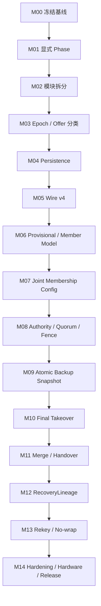

# UCN V5 Cluster：从 Current `a571853` 迁移到 Target FSM v2 的详细修改方案与任务表

> **Current 基线**：`a5718534ef4014f240bbe8b1640dde0328eb8669`（代码语义基线；后续仅注释/文档类提交不影响基线）  
> **Current 文档**：`UCN_V5_Cluster_CURRENT_FSM_a571853.md`  
> **Target 文档**：`UCN_V5_Cluster_FSM_Design_v2.md`  
> **任务总数**：154  
> **原则**：测试先行、一次只改一种协议语义、每个里程碑都能独立回归、Safety 优先于 Availability。  
>
> **执行状态（CLV2-00-08）**：
>
> | 里程碑 | 状态 | 完成提交 | 审计 |
> |---|---|---|---|
> | M00 冻结基线 | DONE | 6bea852 + M00.1(6206ce2) + M00.2(2b222b7) | 用户正式签字 PASS（2026-08-15），授权进入 M01 |
> | M01 显式 Phase | IN_PROGRESS | 01-01~03 已审计关闭；01-04a 完成待审计 | Shadow Phase 已落地：枚举+映射+reason 推断；Phase 未驱动协议；01-04a cluster_transition 框架+迁移矩阵（67 允许/22 排除，T-A 实测 35 对）已过双评审待终审 |
> | M02 模块拆分 | TODO | — | — |
> | M03 Epoch 分类 | TODO | — | — |
> | M04 Persistence | TODO | — | — |
> | M05 Wire v4 | TODO | — | — |
> | M06 Provisional | TODO | — | — |
> | M07 Joint Config | TODO | — | — |
> | M08 Authority/Fence | TODO | — | — |
> | M09 Backup 双缓冲 | TODO | — | — |
> | M10 Final Takeover | TODO | — | — |
> | M11 Merge/Handover | TODO | — | — |
> | M12 RecoveryLineage | TODO | — | — |
> | M13 Rekey/No-wrap | TODO | — | — |
> | M14 收敛/发布 | TODO | — | — |
>
> 状态取值：TODO / IN_PROGRESS / BLOCKED / AUDIT HOLD / DONE（DONE 须审计后由人更新）。每个任务完成时在 `docs/01-项目操作记录.md` 记录提交、测试证据与操作编号。
>
> 本文是后续 Cluster 重构的执行计划，不是新的理想状态机说明。它回答：
>
> 1. 从当前代码的哪个位置开始；
> 2. 为什么必须按这个依赖顺序；
> 3. 每个文件、函数和数据结构怎么改；
> 4. 每一步需要哪些测试和合并门禁；
> 5. 最终怎样收敛到理想 Target v2，而不破坏 UCN Core / Adapter / Routing 架构。

---

# 1. 当前基线与最终差距

当前 `a571853` 已具备：

```text
32 B Cluster Format v3
Type 1-19
Join txid fencing
Stepdown nonce fencing
Backup generation/sequence fencing
Full Snapshot + Delta gap resync
Backup Reject / candidate cooldown
Takeover self vote
Recovery 真实成簇与双候选仲裁
Atomic Neighbor snapshot commit
```

但内部仍然是：

```text
9 个 public Role
+
大量 bool/deadline/cursor 隐式子状态
```

最终 Target v2 还需要：

```text
Unique Phase
Persistent StableEpoch
Same-cluster Authority / Foreign-cluster Merge 分离
MEMBER_PROVISIONAL
Committed / Joint Membership Config
authority_active
HEAD_QUORUM_GRACE
HEAD_FENCED
Committed/Staging Backup Mirror
Frozen Config Majority Takeover
Persistent Vote / Epoch / Config
RecoveryLineage
Merge Hysteresis + Handover
Cluster Rekey + Tombstone
No-wrap Serial
Timer Algebra + Neighbor Anti-flap
```

---

# 2. 不能破坏的 UCN 架构规则

整个迁移期间必须满足：

```text
Extended -> Core             允许
Core -> Extended             禁止

Cluster -> Core API          允许
Cluster -> Adapter SDK       禁止
Cluster -> Driver/HAL        禁止

Cluster 只负责 Control Plane
普通业务 Data Plane 仍由 Routing / Path 决定

Cluster OFF：
    Core-only 产品不增加 Cluster RAM/BSS

ISR / Driver callback：
    不直接写 Cluster state

状态修改：
    只发生在唯一 Protocol Owner 上下文

固定表 / bounded queue：
    保持 MCU-first
    禁止为方便引入动态内存
```

---

# 3. 为什么必须按这个顺序

不能从当前代码直接先加 Quorum/Fence，原因是：

```text
当前没有 CommittedVoterSet
当前 JOIN_ACCEPT 立即成为 MEMBER
当前 members[] 同时充当 Head runtime table 和 Backup mirror
当前 Term/Vote 没有 Persistence
当前不同 cluster_id 的 Term 仍存在混用路径
```

如果先加 Head Quorum：

```text
quorum denominator 仍会在 Join/Leave 时直接变化
Primary 和 Backup 可能按不同集合计算
结果比当前实现更危险
```

正确顺序：



---

# 4. 统一开发规则

## 4.1 每个行为修改必须遵守

```text
先写失败测试
-> 修改实现
-> 原有测试全绿
-> 新测试全绿
-> 静态分析
-> 更新任务状态和操作记录
```

## 4.2 禁止一个提交同时做

```text
Wire 格式升级
+
状态机重写
+
Persistence
+
Quorum 语义
```

这些必须分开，否则回归无法定位。

## 4.3 合并门禁

每个任务组至少通过：

```text
ctest --output-on-failure
ASan/UBSan Host
-fanalyzer
Nano/Lite/Full compile
Cluster OFF compile
Codec negative tests
对应 Fault Injection
```

涉及协议安全时再加：

```text
partition
restart
storage failure
duplicate/replay/reorder
```

---

# 5. 最先应该执行的 10 个提交

这是实际开始时的推荐顺序：

| 顺序 | 提交内容 | 允许改变协议行为？ |
|---:|---|---:|
| 1 | 固定 `a5718534ef4014f240bbe8b1640dde0328eb8669`、测试/尺寸/工具链基线 | 否 |
| 2 | 增加 Transition Trace 和可重放 Fault Fixture | 否 |
| 3 | 增加 `ucn_cluster_phase_t`，Shadow 映射 | 否 |
| 4 | 增加 `cluster_transition()`，先迁 Detach/Join/Election | 否 |
| 5 | 迁移 Backup/Takeover/Recovery 到显式 Phase | 否 |
| 6 | `ucn_cluster_step()` 改 Phase switch | 否 |
| 7 | 拆 Codec/FSM/Membership/Backup/Recovery 文件 | 否 |
| 8 | 增加 Epoch comparator，修 foreign Term 比较 | **是，单一语义** |
| 9 | 增加 Persistence Provider 骨架与 Host fake | 否，先不启用 |
| 10 | 提交 Cluster Wire v4 RFC + golden vectors | 否，先设计冻结 |

在完成前 10 个提交前，不建议进入 Joint Config 或 Head Quorum。

---

# 6. 里程碑总表

| 里程碑 | 目标 | 依赖 | 完成门禁 |
|---|---|---|---|
| M00 | 冻结基线与建立不可回退门禁 | 无 | 所有现有测试、规模模拟、静态分析结果可重复；生成基线清单和状态迁移 Trace。 |
| M01 | 把隐式状态等价显式化为唯一 Phase | M00 | Golden Trace 与 a571853 等价；生产代码不再直接随意写 Role，所有状态迁移经过统一函数。 |
| M02 | 拆分 3000 行单文件并建立内部边界 | M01 | 模块拆分前后 Golden Trace、Wire 字节和资源结果一致；Core 不反向依赖 Extended。 |
| M03 | 建立 Epoch、Authority Offer 分类和安全 Serial Helper | M02 | 不同 cluster_id 的 Term 永不直接比较；同簇 higher-term、same-term conflict 有统一全局处理入口。 |
| M04 | Persistence Provider 与重启安全 | M03 | persist-before-promise 已成为强制路径；存储失败时不发送 Advertise/ACK/Commit。 |
| M05 | 冻结 Cluster Wire v4 与能力协商 | M04 | v4 RFC、golden vectors、双版本解码和混合版本策略全部通过，之后才允许实现 Joint Config。 |
| M06 | 重建成员数据模型并引入 Provisional Member | M05 | JOIN_ACCEPT 不再自动成为 voter；Runtime Member、Committed Voter 与 Backup Mirror 不再混为同一概念。 |
| M07 | 实现 Committed / Joint Membership Reconfiguration | M06 | 任何 voter 增删都必须 C_old -> C_joint -> C_new；Head/Backup 对 Active Config 的理解始终一致。 |
| M08 | 启用 Head Authority Quorum、立即撤权、Grace 与永久 Fence | M07 | Safety：`authority_active => active config quorum`；检测失去 quorum 的同一 Step 内立即变 false。 |
| M09 | Backup 双缓冲、SnapshotEpoch、Coverage Grace 与无回绕 | M08 | SYNC_BEGIN 不再清 committed mirror；BACKUP_READY 只对应原子提交后的 exact SnapshotEpoch/Config。 |
| M10 | 最终 Majority Takeover、持久投票与可验证证书 | M09 | Backup 只有冻结 Config quorum + 持久新 Term 后才能成为 Head；普通 ACTIVE Member 不得提前投票。 |
| M11 | 分离同簇 Authority 收敛与跨簇 Merge，并实现有序 Handover | M10 | 不同 cluster_id 只走 Merge；同 cluster higher Term 只走 Authority；Merge 不会 score 乒乓。 |
| M12 | RecoveryLineage、唯一 Recovery ID 与有界退避 | M11 | Recovery 使用新 cluster_id；同 lineage 先比较 parent term/config；连续失败退避升级。 |
| M13 | Cluster Rekey、Serial Exhaustion 与 Tombstone | M12 | 同一上层 Epoch 内所有安全 serial 无回绕；达到阈值只能 rotate/rekey 或 fail-closed。 |
| M14 | 最终收敛、删兼容债务、模型验证与实机门禁 | M13 | Target v2 Safety/Liveness、资源、规模、实机和文档全部闭环；Current/Target 文档重新生成。 |

---

# M00：冻结基线与建立不可回退门禁

**目标：** 先把 a571853 的行为、资源和测试证据固定下来；本阶段禁止改变协议语义。

**依赖：** 无

**里程碑门禁：** 所有现有测试、规模模拟、静态分析结果可重复；生成基线清单和状态迁移 Trace。

| 任务 ID | 优先级 | 依赖 | 主要文件/位置 | 具体修改任务 | 完成定义 / 测试 |
|---|---:|---|---|---|---|
| `CLV2-00-01` | P0 | — | Git / docs | 把 `a5718534ef4014f240bbe8b1640dde0328eb8669` 标记为迁移基线；创建 `cluster-v2-migration` 分支或等价长期分支，并在任务记录中固定完整 Hash，后续文档不得只写浮动分支名。 | 基线 Hash、构建命令、编译器版本、测试结果均进入 `docs/results/cluster_v2_baseline.md`。 |
| `CLV2-00-02` | P0 | 00-01 | CMakeLists.txt、CI | 建立 DEFAULT、FAST_FIXED、NANO/LITE/FULL、Cluster ON/OFF 构建矩阵；保留当前 v3/32 B Wire 测试目标，禁止后续提交只在单一 Full 配置上通过。 | 矩阵全部编译；Core-only 构建不链接任何 Cluster 新模块。 |
| `CLV2-00-03` | P0 | 00-01 | tests/test_cluster.c | 冻结当前所有行为测试，并为当前 9 Role + 隐式子状态生成 Golden Transition Trace。Trace 至少记录 time、node、old state、event、new state、cluster_id、term、backup_generation、sequence。 | 相同 seed 下 Trace 字节级一致；后续“等价重构”阶段必须保持一致。 |
| `CLV2-00-04` | P0 | 00-03 | tests/cluster_test_fixture.[ch] | 把测试中直接写 `cluster.role/term/members[]/backup_ready` 的场景逐步改为测试夹具 API；保留少量白盒注入函数，但集中在一个 test-only 文件，不允许每个测试任意改结构体。 | 现有测试通过；新增测试不再直接依赖生产结构体布局。 |
| `CLV2-00-05` | P1 | 00-02 | tools/size_report、docs/results | 记录 `sizeof(ucn_cluster_t)`、`.text/.rodata/.bss`、最大栈使用和每个 Feature Profile 的 RAM；后续每个里程碑输出增量。 | CI 生成可比较报告；任何超过既定预算的提交必须写明原因。 |
| `CLV2-00-06` | P0 | 00-02 | tests / sanitizers | 增加 Host ASan、UBSan、`-fanalyzer`、严格告警和 Codec fuzz smoke；把当前 32 B Codec、Type 1-19 parser 作为回归种子。 | 零 sanitizer 错误、零新增 analyzer 告警、负向 parser 样本全部拒绝。 |
| `CLV2-00-07` | P0 | 00-03 | tests/cluster_fault_model | 扩展虚拟网络：支持定向丢包、复制、延迟、乱序、分区/恢复、节点重启、存储失败、Owner Step 超限和 Neighbor flapping；事件必须可用固定 seed 重放。 | 能够稳定复现：双候选、旧帧、Delta gap、Primary/Backup 同时故障和分区恢复。 |
| `CLV2-00-08` | P1 | 00-01 | docs/UCN_V5_Cluster_CURRENT_TO_TARGET_v2_任务表.md | 把本文档放进仓库并增加状态字段：TODO / IN_PROGRESS / BLOCKED / DONE；每个任务必须绑定提交、测试证据和操作记录编号。 | 任务表成为唯一迁移入口，禁止另建互相矛盾的临时计划。 |

## 本里程碑禁止事项
- 禁止顺手修协议行为。
- 禁止改变 Wire 字节。
- 禁止删除旧测试。

---

# M01：把隐式状态等价显式化为唯一 Phase

**目标：** 先只改变状态表达，不改变 Wire、选举、Join、Backup、Takeover、Recovery 的当前行为。

**依赖：** M00

**里程碑门禁：** Golden Trace 与 a571853 等价；生产代码不再直接随意写 Role，所有状态迁移经过统一函数。

| 任务 ID | 优先级 | 依赖 | 主要文件/位置 | 具体修改任务 | 完成定义 / 测试 |
|---|---:|---|---|---|---|
| `CLV2-01-01` | P0 | M00 | include/ucn/ucn_cluster.h 或内部头 | 新增 `ucn_cluster_phase_t`：DISABLED、DETACHED_OBSERVE、ELECTION、JOIN_PENDING、MEMBER_ACTIVE、MEMBER_TAKEOVER_GRACE、HEAD_NO_BACKUP、HEAD_BACKUP_ASSIGNING、HEAD_BACKUP_SYNCING、HEAD_STABLE、BACKUP_SYNCING、BACKUP_READY、BACKUP_TAKEOVER、STEPPING_DOWN、RECOVERY_OBSERVE、RECOVERY_ELECTION、RECOVERY_HEAD。此时先不加入 Quorum/Fence/Config/Rekey Phase。 | 枚举有静态合法性测试；每个当前隐式组合都有唯一映射。 |
| `CLV2-01-02` | P0 | 01-01 | src/extended/ucn_cluster.c | 新增 `cluster_phase_from_legacy_state()`，把当前 `role + bool + deadline` 映射为 Phase；在 Shadow 模式每次 Step 末尾比较 `phase` 与旧字段推导结果。 | 随机故障模型运行时无 Phase/Legacy 不一致。 |
| `CLV2-01-03` | P0 | 01-01 | 内部 FSM | 新增 `ucn_cluster_transition_reason_t`，每次迁移记录原因，例如 JOIN_ACCEPT、HEAD_LEASE_EXPIRED、BACKUP_ASSIGN、SNAPSHOT_READY、TAKEOVER_QUORUM、RECOVERY_WIN。 | Trace 中每条迁移都有非 UNKNOWN reason。 |
| `CLV2-01-04` | P0 | 01-02,01-03 | `cluster_transition()` | 建立唯一迁移入口：校验 old->new 合法性，执行 exit action、公共字段提交、entry action、统计和 Trace；非法迁移在 Debug 断言，在 Release 返回 `UCN_ERR_STATE` 并 fail-closed。 | 全量状态迁移表单元测试覆盖允许/禁止边。 |
| `CLV2-01-05` | P0 | 01-04 | `set_detached`、`begin_join`、`start_election`、`complete_election` | 把 DETACHED/JOIN/CANDIDATE/HEAD 的直接 `role=` 改为 `cluster_transition()`；`set_detached` 暂时保持旧字段清理语义，只改调用路径。 | 普通选举、Join、Reject、超时 Trace 与基线一致。 |
| `CLV2-01-06` | P0 | 01-04 | `handle_backup_assign`、Snapshot END、`start_takeover`、`complete_takeover`、`backup_clear_sync` | 显式映射 BACKUP_SYNCING、BACKUP_READY、BACKUP_TAKEOVER、HEAD_NO_BACKUP；旧 bool 暂时作为兼容镜像，由 entry/exit action 统一维护。 | Backup 全生命周期 Golden Trace 等价。 |
| `CLV2-01-07` | P0 | 01-04 | `ucn_cluster_step` Member lease 路径 | 把 `MEMBER + head_grace_deadline` 改为真正 `MEMBER_TAKEOVER_GRACE`；Grace 进入/恢复/超时只经状态迁移，不再靠同一 Role 内判断。 | Member Grace 现有行为和时序不变。 |
| `CLV2-01-08` | P0 | 01-04 | Recovery 路径 | 把 `DETACHED + recovery_eligible/backoff` 显式为 RECOVERY_OBSERVE / RECOVERY_ELECTION；`declare_recovery_head` 只负责提交 Recovery 状态，不直接散写 Role 和字段。 | 双候选与 Recovery 成簇测试保持通过。 |
| `CLV2-01-09` | P0 | 01-05..08 | `ucn_cluster_step` | 把当前串行 if 链改为 `switch(phase)`；公共高优先级检查放在 switch 前，Phase handler 一次最多执行一个明确阶段，避免同一 Step 连续跨越多个状态。 | 每次 Step 最多一条非显式 chained transition；测试可精确预测状态。 |
| `CLV2-01-10` | P1 | 01-09 | Public View/API | 保留 `ucn_cluster_get_role()` 作为粗粒度兼容映射，新增 `ucn_cluster_get_phase()` 和 phase 字符串诊断；文档明确 Role 不再是内部真实状态。 | 旧调用方源码兼容；诊断能够区分 Syncing/Ready/Takeover/Grace。 |

## 本里程碑禁止事项
- 禁止同时引入 Quorum/Persistence。
- 禁止一次删除所有兼容 bool。
- 禁止用 Phase 名称掩盖行为变化。

---

# M02：拆分 3000 行单文件并建立内部边界

**目标：** 在行为等价状态下拆模块，防止后续 Epoch、Config、Authority、Backup 继续堆入一个文件。

**依赖：** M01

**里程碑门禁：** 模块拆分前后 Golden Trace、Wire 字节和资源结果一致；Core 不反向依赖 Extended。

| 任务 ID | 优先级 | 依赖 | 主要文件/位置 | 具体修改任务 | 完成定义 / 测试 |
|---|---:|---|---|---|---|
| `CLV2-02-01` | P1 | M01 | src/extended/cluster/ucn_cluster_internal.h | 建立 Cluster 私有头：Phase、Event、Epoch helper、member table helper、transition API、模块间最小接口；禁止暴露 Adapter/SDK 类型。 | 依赖图保持 Extended -> Core，Core 源文件不 include Cluster 私有头。 |
| `CLV2-02-02` | P1 | 02-01 | ucn_cluster_codec_v3.c | 把当前 32 B Format v3 encode/decode、flags/type-role 校验和 byte offset 从 `ucn_cluster.c` 移出；输出字节必须完全一致。 | 所有现有 Codec golden vectors 字节级一致。 |
| `CLV2-02-03` | P1 | 02-01 | ucn_cluster_fsm.c | 移动 `cluster_transition`、Phase handler、Step dispatch、状态不变量和 Role 映射；`ucn_cluster.c` 只保留 public facade/init/view。 | 生产代码内 Phase 写入只存在于 FSM 模块。 |
| `CLV2-02-04` | P1 | 02-01 | ucn_cluster_membership.c | 移动 Join、Keepalive、Leave、member allocation/expiry、member query；当前语义先不变。 | Join/Lease/Replay 测试全部通过。 |
| `CLV2-02-05` | P1 | 02-01 | ucn_cluster_backup.c、ucn_cluster_takeover.c | 移动 Backup selection/assignment/snapshot/delta/heartbeat/reject/resync 与 Takeover prepare/ACK/complete。 | Backup 与 Takeover 测试无行为差异。 |
| `CLV2-02-06` | P1 | 02-01 | ucn_cluster_recovery.c、ucn_cluster_merge.c | 移动 Recovery quorum/declaration/arbitration/TTL 与当前 Head offer/stepdown/score switch；先不引入 Target 新语义。 | Recovery、Head convergence、switchback 测试保持通过。 |
| `CLV2-02-07` | P1 | 02-03..06 | include/ucn/ucn_cluster_storage.h | 将可变内部存储布局从主 public API 分离：`ucn_cluster.h` 暴露类型/API，唯一 Owner 若需静态分配则 include storage header；应用禁止直接读写内部字段。 | 所有产品目标全量重编译；测试通过 test fixture，而不是 public ABI 访问字段。 |
| `CLV2-02-08` | P1 | 02-02..07 | CMakeLists.txt / profile build | Cluster 继续是按需 Extended 静态库；每个子模块可按 Feature 裁剪，但禁止 Core-only 产品增加 RAM/BSS。 | Cluster OFF 二进制与基线尺寸一致或差异可解释。 |

## 本里程碑禁止事项
- 禁止 Core include Cluster 私有头。
- 禁止拆文件时修改 Wire/Timer。
- 禁止引入动态内存。

---

# M03：建立 Epoch、Authority Offer 分类和安全 Serial Helper

**目标：** 先修正同簇/跨簇的根本比较语义，为后续 Persistence、Merge、Fence 和 Rekey 建基础。

**依赖：** M02

**里程碑门禁：** 不同 cluster_id 的 Term 永不直接比较；同簇 higher-term、same-term conflict 有统一全局处理入口。

| 任务 ID | 优先级 | 依赖 | 主要文件/位置 | 具体修改任务 | 完成定义 / 测试 |
|---|---:|---|---|---|---|
| `CLV2-03-01` | P0 | M02 | ucn_cluster_epoch.[ch] | 新增 `ucn_cluster_epoch_t {cluster_id,term,head_id}`、`ucn_cluster_epoch_relation_t` 和纯函数 comparator。 | 边界测试覆盖 same/lower/higher/conflict/foreign。 |
| `CLV2-03-02` | P0 | 03-01 | Cluster state | 把散落的 `cluster_id/term/head_node_id` 收拢为 `active_epoch`；保留兼容访问宏只作为过渡，禁止新代码继续直接组合比较。 | grep 不再出现手写 `cluster_id == ... && term > ...` 的业务判定。 |
| `CLV2-03-03` | P0 | 03-01 | `consider_head_offer` | 拆成：`classify_same_cluster_authority()` 与 `classify_foreign_cluster_merge()`；当前 HEAD 跨簇直接按 Term 让位的行为必须删除。 | 新增测试：Cluster A Term 2 不因 Cluster B Term 100 自动让位。 |
| `CLV2-03-04` | P0 | 03-01 | Global RX pre-dispatch | 任意 Active Phase 收到 same-cluster higher Term 时走统一 `process_higher_authority()`；不要在 Member、Backup、Head 各写一套。 | 每个 Phase 的 higher-term 测试均走同一 reason/code path。 |
| `CLV2-03-05` | P0 | 03-01 | Term conflict | same cluster + same term + different head 标记 `TERM_CONFLICT`；当前阶段先停止相关优化和投票，进入安全等待状态，M08 再接入正式 Fence。 | 冲突时不得按 score 覆盖 Head。 |
| `CLV2-03-06` | P0 | 03-02 | Detach state | 新增 `last_cluster_id/max_seen_term/last_stable_head` 安全历史；`set_detached` 只清 Active/Pending，不再清安全历史。 | Detach/rejoin 后仍能拒绝旧 Term。 |
| `CLV2-03-07` | P0 | 03-01 | serial helper | 新增 `cluster_serial_next_checked()` 和 `UCN_CLUSTER_SERIAL_ROTATION_THRESHOLD`；替换 `MAX ? 1 : +1`。在 Rekey 未实现前，达到阈值返回 EXHAUSTED 并 fail-closed，绝不回绕。 | CI grep 禁止 Cluster 代码出现 `UINT32_MAX ? 1`。 |
| `CLV2-03-08` | P1 | 03-06 | Cluster ID provider interface | 新增可选 `make_cluster_id`/incarnation hook；普通新簇、Recovery、Rekey 不再永久假设 `cluster_id == local_node_id`。本阶段可提供确定性 Host 默认实现。 | 同一节点不同 boot/round 可生成不同 ID；0 和 broadcast 永远非法。 |
| `CLV2-03-09` | P0 | 03-03..08 | tests | 新增 Epoch property test：随机 cluster/term/head 组合满足反对称、传递性和 foreign-term 不可比；加入 serial exhaustion 测试。 | 所有性质通过固定 seed 与随机 seed。 |

## 本里程碑禁止事项
- 禁止 foreign cluster 直接比较 Term。
- 禁止任何安全 serial 回绕。
- 禁止 Detach 清 max_seen_term。

---

# M04：Persistence Provider 与重启安全

**目标：** 在启用真正 Quorum/Takeover/Config 前，先保证 Term、Vote、Config 承诺不会因掉电回退。

**依赖：** M03

**里程碑门禁：** persist-before-promise 已成为强制路径；存储失败时不发送 Advertise/ACK/Commit。

| 任务 ID | 优先级 | 依赖 | 主要文件/位置 | 具体修改任务 | 完成定义 / 测试 |
|---|---:|---|---|---|---|
| `CLV2-04-01` | P0 | M03 | include/ucn/ucn_cluster_persist.h | 定义 Provider：load、submit/store epoch、vote、config、rekey、tombstone、replay incarnation；支持同步 OK、异步 PENDING、失败 ERROR。 | API 不依赖文件系统/Flash SDK；Host fake 和 MCU 产品均可实现。 |
| `CLV2-04-02` | P0 | 04-01 | Persisted record schema | 记录包含 magic、schema version、record size、monotonic record generation、CRC；安全记录至少含 active/max epoch、last vote、config commit、rekey tombstone、boot incarnation。 | 损坏/旧版本记录可检测并按配置 fail-closed 或 factory-empty。 |
| `CLV2-04-03` | P0 | 04-01 | Cluster config | 增加 `persistence_mode`：REQUIRED、VOLATILE_TEST；生产 Strict Profile 缺 Provider 时 init 失败。VOLATILE 模式必须在 view/stats 中明显标识，不能宣称跨重启安全。 | Strict 模式无 Provider 返回 `UCN_ERR_CONFIG`。 |
| `CLV2-04-04` | P0 | 04-01 | Init/load | `ucn_cluster_init` 先 load 安全记录，再建立 Phase；恢复 max_seen_term、vote、config/tombstone，禁止先发 Advertise 后加载。 | 掉电重启测试不会回到旧 Term。 |
| `CLV2-04-05` | P0 | 04-01 | Election/Head transition | Election win、Backup challenge、Takeover commit 在对外发送新 Term Head 消息前必须持久化 Epoch；PENDING 时保持原 Phase 子事务并暂停承诺。 | 注入 store failure 时不出现新 Head Advertise。 |
| `CLV2-04-06` | P0 | 04-01 | Takeover vote | Member 在 TAKEOVER_ACK 前 persist 完整 VoteId；重复相同 Vote 可重发 ACK，冲突 Vote 必须拒绝。 | 在 persist 完成前网络队列中不存在 ACK。 |
| `CLV2-04-07` | P0 | 04-01 | Config/Rekey hooks | 先建立 `persist_config_prepare/commit`、`persist_rekey_prepare/commit` 调用骨架，M07/M13 接入；禁止后续协议绕过 Provider。 | 接口和失败语义有单元测试。 |
| `CLV2-04-08` | P0 | 04-01 | Persistence failure handler | 异步失败作为最高优先级 Event：Head 撤销承诺，Member 停止投票，Backup 禁止完成 Takeover；记录 fail-closed reason。 | 每一种 pending operation 均有失败状态测试。 |
| `CLV2-04-09` | P1 | 04-02 | Boot incarnation / replay epoch | 每次受控启动取得唯一 incarnation；高频 nonce 形成 `(node_id,incarnation,nonce)`，不要求每帧写 Flash。 | 重启后 nonce 从小值开始也不会与旧 boot 混淆。 |
| `CLV2-04-10` | P1 | 04-01..09 | Host fake + crash matrix | 提供双槽 fake provider，模拟在 write-before/after、CRC、部分写、重启时崩溃；测试所有安全承诺点。 | Crash matrix 中 Safety 属性不被破坏。 |

## 本里程碑禁止事项
- 禁止先发 ACK/Advertise 后写存储。
- 禁止存储失败继续可写。
- 禁止每个 heartbeat 写 Flash。

---

# M05：冻结 Cluster Wire v4 与能力协商

**目标：** 在增加 Config、Handover、Rekey 前先冻结可表达所有 Target 字段的 bounded Wire；保持 Core Wire 不变。

**依赖：** M04

**里程碑门禁：** v4 RFC、golden vectors、双版本解码和混合版本策略全部通过，之后才允许实现 Joint Config。

| 任务 ID | 优先级 | 依赖 | 主要文件/位置 | 具体修改任务 | 完成定义 / 测试 |
|---|---:|---|---|---|---|
| `CLV2-05-01` | P0 | M04 | docs/UCN_Cluster_Wire_v4.md | 先写 Wire RFC：建议固定 40 B，公共 16 B + 六个 u32 type payload；不修改 W0/W1/W2/W3 Core 头。明确网络字节序、保留位、每 Type 合法 Role/flags。 | RFC 评审通过后才改常量。 |
| `CLV2-05-02` | P0 | 05-01 | Format/version | 把 Cluster Format 与 Core Protocol Version 分开；增加 v4 decoder/encoder，保留可选 v3 decoder，不允许同一消息被模糊解释。 | v3/v4 golden vectors 独立。 |
| `CLV2-05-03` | P0 | 05-01 | Type-specific structs/builders | 停止让一个巨大 `ucn_cluster_message_t` 同时承载所有字段；建立内部 tagged payload 或每 Type builder，encode 前执行 type-specific validation。 | 未初始化无关字段不影响 Wire；parser 无交叉字段漏洞。 |
| `CLV2-05-04` | P0 | 05-01 | v4 Snapshot payload | 确保一帧可绑定 generation、snapshot_id、sequence、member_id、member_nonce 和 lease/flags；不得再次截断或省略 Epoch。 | 边界值 UINT32_MAX-1 round-trip。 |
| `CLV2-05-05` | P0 | 05-01 | v4 Takeover payload | 可表达 generation、snapshot/config identity、proposed term、certificate/vote bitmap 或其分片；联合配置证书必须可验证。 | 伪造/缺字段证书被拒绝。 |
| `CLV2-05-06` | P0 | 05-01 | 新 Message Types | 预留并冻结 CONFIG_BEGIN/MEMBER/PREPARE/ACK/COMMIT/ABORT、HANDOVER_PREPARE/READY/COMMIT、HEAD_WITHDRAW、REKEY_PREPARE/ACK/COMMIT；编号只增不复用。 | Type enum、parser table、文档一致。 |
| `CLV2-05-07` | P0 | 05-01 | Capability negotiation | Advertise/Join 携带 min/max Cluster Wire、capability bitmap：BACKUP、TAKEOVER、JOINT_CONFIG、PERSISTENCE、RECOVERY_LINEAGE、REKEY。 | 选 Head/Backup 时只选择能力满足者。 |
| `CLV2-05-08` | P0 | 05-07 | Mixed-version policy | Strict v4 Cluster 禁止 v3 节点成为 Head、Backup 或 voter；可选允许 v3 作为 non-voting legacy member。兼容模式必须显式，不能静默降低 Safety。 | 混合版本矩阵测试覆盖拒绝/降级路径。 |
| `CLV2-05-09` | P1 | 05-02 | Message bytes migration | 所有 Adapter/测试队列/bench 使用 `UCN_CLUSTER_MESSAGE_BYTES`，不得硬编码 32；检查 CAN/Stream Carrier 的 payload/fragment 行为。 | 40 B Cluster payload 在支持的 Carrier 上可发送或明确分片。 |
| `CLV2-05-10` | P0 | 05-02..06 | Parser negative/fuzz | 为每个 Type 建合法 Role/flags/zero/nonzero/epoch 表；未知版本、未知 Type、组合 flags、保留位、非法 Node ID 全部 fail-closed。 | Codec fuzz 不崩溃；非法输入不改变状态。 |
| `CLV2-05-11` | P1 | 05-01..10 | Versioned diagnostics | View/trace/stat 记录 peer wire version 与 capability；遇到降级时输出可诊断 reason。 | 实机日志能解释为何节点不可成为 Backup/voter。 |
| `CLV2-05-12` | P0 | 05-02..11 | Compatibility gate | v4 encoder 默认关闭，先在 Host dual-stack 测试；完成 M07-M10 后再把 Strict v4 设为推荐配置。 | 中间提交不破坏现有 v3 实机。 |

## 本里程碑禁止事项
- 禁止改 Core W0-W3。
- 禁止 v3 节点静默成为 v4 voter。
- 禁止未冻结 RFC 就实现 Config。

---

# M06：重建成员数据模型并引入 Provisional Member

**目标：** 把“已 Join”和“已经进入受保护 Quorum Config”分开，为 Joint Config 提供稳定数据结构。

**依赖：** M05

**里程碑门禁：** JOIN_ACCEPT 不再自动成为 voter；Runtime Member、Committed Voter 与 Backup Mirror 不再混为同一概念。

| 任务 ID | 优先级 | 依赖 | 主要文件/位置 | 具体修改任务 | 完成定义 / 测试 |
|---|---:|---|---|---|---|
| `CLV2-06-01` | P0 | M05 | ucn_cluster_membership.h | 定义 member status：PROVISIONAL、COMMITTED、REMOVING；成员记录增加 joined_at、last_keepalive、capabilities、wire_version、voting 标志。 | 状态转换表和非法状态测试齐全。 |
| `CLV2-06-02` | P0 | 06-01 | Member table | 把当前 `members[]` 抽象为 `ucn_cluster_member_table_t primary_members`；Head 使用 Runtime table，Backup 使用 committed mirror；后续另加 staging table。 | Head/Backup 不再通过含义不明的全局 helper 混用表。 |
| `CLV2-06-03` | P0 | 06-01 | Voter set | 新增有界 `ucn_cluster_voter_set_t`，保存排序稳定的 Node ID、count、hash；最大 voter 数包含 Head，bitmap 宽度必须覆盖 `MAX_MEMBERS + 1`。 | 集合排序/hash/contains/quorum 单元测试。 |
| `CLV2-06-04` | P0 | 06-01 | JOIN_ACCEPT flow | v4 Join 成功后进入 `MEMBER_PROVISIONAL`；Head 添加 PROVISIONAL Runtime Member，不立即修改 Active voter set。 | Head 在 Join 后立刻故障时，新节点不被算入旧 takeover quorum。 |
| `CLV2-06-05` | P0 | 06-04 | Provisional timeout | 增加 bounded provisional deadline；未收到 CONFIG_COMMIT 的节点离开并重新观察，Head 清理未提交 provisional entry。 | 丢 CONFIG 消息不会永久占满容量。 |
| `CLV2-06-06` | P1 | 06-04 | Legacy v3 member | 兼容模式下 v3 Join 只能成为 non-voting provisional/legacy member；不得成为 Backup 或 Head candidate。 | Mixed-version 安全测试通过。 |
| `CLV2-06-07` | P1 | 06-01 | Public summaries | member summary 增加 status/voting/config_id，但保持只读 Owner-context API；应用不能直接改内部表。 | 诊断能区分 provisional/committed/removing。 |
| `CLV2-06-08` | P0 | 06-02..07 | Capacity semantics | 明确 Runtime capacity 与 Voter capacity；Provisional 占 Runtime slot，只有 commit 后占 Voter slot；拒绝原因细化。 | 容量边界和重复 Join 测试。 |
| `CLV2-06-09` | P0 | 06-01..08 | Current behavior bridge | 在 Joint Config 尚未启用的过渡构建中，使用 test-only auto-commit 开关维持旧测试；生产 Strict v4 禁止 auto-commit。 | 过渡开关有删除任务，不能成为最终默认。 |

## 本里程碑禁止事项
- 禁止 JOIN_ACCEPT 直接 voting=true。
- 禁止 Runtime Member 与 VoterSet 继续共用含义。
- 禁止 v3 legacy 成为 Backup。

---

# M07：实现 Committed / Joint Membership Reconfiguration

**目标：** 让 Quorum denominator 本身成为受保护、可持久化、可恢复的协议状态。

**依赖：** M06

**里程碑门禁：** 任何 voter 增删都必须 C_old -> C_joint -> C_new；Head/Backup 对 Active Config 的理解始终一致。

| 任务 ID | 优先级 | 依赖 | 主要文件/位置 | 具体修改任务 | 完成定义 / 测试 |
|---|---:|---|---|---|---|
| `CLV2-07-01` | P0 | M06 | config state | 实现 `ucn_cluster_config_state_t {config_id,phase,old_set,new_set,hashes}`；Stable 时 old/new 归一为单一集合。 | 序列化和 hash 确定性测试。 |
| `CLV2-07-02` | P0 | 07-01 | config transaction | 实现单一有界 `config_tx`：ID、proposal、ACK bitmap、deadline、retry、persist state；同一时刻只允许一个成员配置事务。 | 并发 Join/Leave 被排队、合并或明确拒绝，不覆盖事务。 |
| `CLV2-07-03` | P0 | 07-01 | Addition proposal | PROVISIONAL Join 生成 C_new；Head self vote；发送 CONFIG_BEGIN/MEMBER 或等价有界描述，所有 voter 获得 config identity。 | 新成员在 Commit 前始终 provisional。 |
| `CLV2-07-04` | P0 | 07-01 | Removal proposal | LEAVE/lease timeout 先标记 REMOVING；在 C_new Commit 前节点仍属于 C_old denominator，不得直接清 voter。 | 连续两个成员失联时不会偷偷降低 quorum。 |
| `CLV2-07-05` | P0 | 07-01 | Joint quorum helper | `joint_quorum_reached = quorum(C_old) && quorum(C_new)`；使用统一 voter ordering/bitmap，并包含 Head self vote。 | old有/new无、new有/old无均不得 Commit。 |
| `CLV2-07-06` | P0 | 07-02 | Config voting persistence | Member/Backup 对 CONFIG_ACK 的安全承诺先持久化；Head 对 CONFIG_COMMIT 先持久化新 Config，再广播。 | 存储失败不 ACK/Commit。 |
| `CLV2-07-07` | P0 | 07-02 | Backup involvement | 若存在 HA Backup，C_new 完整配置必须先进入 Backup staging 并 ACK；无 Backup 时允许安全但非 HA 的 Config Commit，明确 `ha_ready=false`，产品可配置 require_backup_for_config。 | 无 Backup 不冒充可 takeover；有 Backup 时双方 config 一致。 |
| `CLV2-07-08` | P0 | 07-02 | CONFIG_JOINT | Prepare quorum 达到后持久化 Joint 状态，再进入 CONFIG_JOINT；Joint 期间 Authority 和后续 Takeover 都按 old+new 双 quorum。 | Head 在 Joint 阶段掉电，Backup 能恢复同一 Joint Config。 |
| `CLV2-07-09` | P0 | 07-02 | CONFIG_COMMIT/ABORT | Commit C_new 后更新 member status：新增->COMMITTED，删除->释放；超时只 Abort 未 Commit 的 proposal，继续使用 C_old。 | 重复 Commit/Abort 幂等。 |
| `CLV2-07-10` | P1 | 07-02 | Config ID no-wrap | config_id 使用 checked serial；达到阈值触发 M13 Rekey，M13 前 fail-closed，不允许 MAX->1。 | 边界测试。 |
| `CLV2-07-11` | P0 | 07-01..10 | Crash/restart matrix | 覆盖 proposing、joint persisted、commit persisted、commit broadcast 前后、Backup 替换期间掉电。 | 重启后只恢复一个合法 Active Config。 |
| `CLV2-07-12` | P0 | 07-01..11 | 删除 auto-commit | 移除 M06 test bridge 的生产路径；所有 v4 voter 变更强制走 Config transaction。 | grep/CI 确认不存在 JOIN_ACCEPT 直接 voting=true。 |

## 本里程碑禁止事项
- 禁止直接缩小 quorum denominator。
- 禁止多个 config_tx 并发。
- 禁止用 authority_grace 掩盖配置提交。

---

# M08：启用 Head Authority Quorum、立即撤权、Grace 与永久 Fence

**目标：** 真正关闭网络分区中的旧 Head 写权限；Grace 只保留身份恢复机会，不保留 Authority。

**依赖：** M07

**里程碑门禁：** Safety：`authority_active => active config quorum`；检测失去 quorum 的同一 Step 内立即变 false。

| 任务 ID | 优先级 | 依赖 | 主要文件/位置 | 具体修改任务 | 完成定义 / 测试 |
|---|---:|---|---|---|---|
| `CLV2-08-01` | P0 | M07 | Phase enum/state | 加入 HEAD_RECONFIGURING、HEAD_QUORUM_GRACE、HEAD_FENCED；保存 `head_resume_phase`、quorum_loss_deadline、restore_since、fenced_dissolve_deadline。 | Phase 合法迁移测试。 |
| `CLV2-08-02` | P0 | 08-01 | authority_active | 新增独立 `authority_active`，不再用 `role==HEAD` 判断写权限；public view 增加 authority state 和 fence reason。 | 应用/扩展层可可靠查询。 |
| `CLV2-08-03` | P0 | M07 | Quorum calculator | Stable Config 计算单 quorum；Joint Config 同时计算 old/new；活性来自 Cluster Keepalive/lease，不直接用瞬时 Neighbor SUSPECT。 | 所有集合尺寸、self vote、失联组合测试。 |
| `CLV2-08-04` | P0 | 08-02,08-03 | Immediate revoke | 任何 operational Head Phase 首次发现 quorum 不足时，先 `authority_active=false`、停止 Authority TX/Directory 写，再进入 HEAD_QUORUM_GRACE。 | 同一 Step 的 trace 顺序证明先撤权后迁移。 |
| `CLV2-08-05` | P0 | 08-04 | TX permission matrix | 集中实现 `cluster_tx_allowed(phase,type)`；Grace/Fenced 禁止 HEAD_ADVERTISE、PRIMARY_HB、JOIN_ACCEPT、Backup/Config Authority TX，可选只发一次 HEAD_WITHDRAW。 | 每个 Phase/Type 组合表驱动测试。 |
| `CLV2-08-06` | P0 | 08-04 | Quorum restore hold | Grace 内 quorum 恢复必须连续稳定 `quorum_restore_hold_ms`，且未见 higher term/conflict、Persistence 健康，才能恢复保存的 Head Phase。 | flapping 不反复开关 Authority。 |
| `CLV2-08-07` | P0 | 08-04 | Permanent Fence | Grace 到期、same-term conflict、higher authority 或 persistence fault 进入 HEAD_FENCED；同 cluster+term 即使 quorum 恢复也不得重新 active。 | same-term reactivation 测试必须失败。 |
| `CLV2-08-08` | P0 | 08-07 | Fenced cleanup | 收到 valid higher Stable Authority -> JOIN_PENDING；否则到 `fenced_dissolve_ms` 保存 lineage 后进入 Recovery Observe。 | Fenced 节点不会无限发旧 Head 消息。 |
| `CLV2-08-09` | P0 | 08-02 | Federation/Directory integration | 所有 Directory/Locator Authority 发布入口检查 `authority_active`；Grace/Fenced 立即停止续租和写入。 | 集成测试：分区旧 Head 无法继续发布 Authority record。 |
| `CLV2-08-10` | P0 | M00,08-04 | Timer budget model | 增加 owner step、network、retry、clock drift、scheduler jitter、margin 预算；用公式派生 Head/Member/Backup lease，而不是只检查 interval<=lease/3。 | 无效 profile init 返回 CONFIG。 |
| `CLV2-08-11` | P0 | 08-10 | Member Takeover Grace | 按 `max(0,backup_lease-member_lease)+takeover_window+delay budgets` 校验/派生；保证 Member 不早于 Backup 完成投票窗口进入 Recovery。 | 极限调度/延迟测试不误杀健康 Takeover。 |
| `CLV2-08-12` | P0 | 08-01..11 | Partition suite | 3/4/5/6 节点所有多数派切分；验证只有多数派一侧可 writable，少数派 Head 同 Step 撤权。 | Safety-1/2 property 全绿。 |

## 本里程碑禁止事项
- 禁止 Grace 内继续 Authority 写。
- 禁止 Neighbor SUSPECT 直接减票。
- 禁止 Fenced same-term 恢复。

---

# M09：Backup 双缓冲、SnapshotEpoch、Coverage Grace 与无回绕

**目标：** 让 Backup 在刷新中保留最后一份已提交镜像，并把 Snapshot 与 Config 精确绑定。

**依赖：** M08

**里程碑门禁：** SYNC_BEGIN 不再清 committed mirror；BACKUP_READY 只对应原子提交后的 exact SnapshotEpoch/Config。

| 任务 ID | 优先级 | 依赖 | 主要文件/位置 | 具体修改任务 | 完成定义 / 测试 |
|---|---:|---|---|---|---|
| `CLV2-09-01` | P0 | M08 | Backup state | 新增 committed mirror、staging mirror、committed_valid、staging_active；利用 Role-state union 控制 RAM，避免 Head 同时持有无用双表。 | size report 符合预算；初次 Sync 与刷新可区分。 |
| `CLV2-09-02` | P0 | 09-01 | SnapshotEpoch | 每次 full snapshot 分配 `snapshot_id`，绑定 BackupEpoch + config_id/config_phase；Delta 也绑定 committed snapshot/config。 | 旧 snapshot/delta/ready 全部 replay。 |
| `CLV2-09-03` | P0 | 09-01 | SYNC_BEGIN | 只清 staging，committed 保持；若 committed config 仍是 Active Config，Primary 在刷新中故障时 Backup 仍可用 committed mirror takeover。 | 刷新中故障的可用性测试。 |
| `CLV2-09-04` | P0 | 09-01 | SYNC_MEMBER/END | 严格 sequence、count、hash、member nonce、config hash、coverage 校验；全部成功后 atomic swap。 | 任一记录缺失/乱序/篡改都不污染 committed。 |
| `CLV2-09-05` | P0 | 09-04 | BACKUP_READY | 绑定 source、cluster、term、backup id、generation、snapshot_id、final sequence、config_id/phase/hash。 | 延迟 READY 不会完成新的 sync。 |
| `CLV2-09-06` | P0 | 09-02 | Delta | Delta 只更新与 committed snapshot/config 相符的 mirror；gap 触发 full resync，stale ignore，不能直接跨 sequence。 | 现有 gap test 扩展 snapshot/config 维度。 |
| `CLV2-09-07` | P0 | 09-01 | Coverage initial | 首次 READY 要求 required committed members 在 Core peer 中为 ADMITTED；明确哪些非 voter/provisional 是否需要一跳覆盖。 | 覆盖定义表驱动测试。 |
| `CLV2-09-08` | P1 | 09-07 | Coverage grace | 已 READY 后 ADMITTED->SUSPECT 启动 `backup_coverage_grace_ms`，短抖动不立刻失效；持续 SUSPECT/REMOVED 后标记 takeover_ineligible 并重选 Backup。 | Neighbor flapping 测试。 |
| `CLV2-09-09` | P0 | 09-02 | Snapshot/generation no-wrap | snapshot_id 到阈值先 rotate generation 并 full sync；generation 到阈值触发 M13 Rekey；禁止回绕。 | 边界和 CI grep。 |
| `CLV2-09-10` | P1 | 09-01..09 | Backup capability/profile | 只有支持 v4、Persistence、Joint Config、足够 mirror capacity 的节点可成为 Strict Backup；Reject reason 可诊断。 | 能力不足时确定性选择下一候选。 |
| `CLV2-09-11` | P0 | 09-01..10 | Failure matrix | Primary 在 BEGIN、Member N、END、Ready、Delta、Config refresh 每个边界故障；验证使用最后 committed snapshot 或安全 Recovery。 | 无部分镜像 takeover。 |

## 本里程碑禁止事项
- 禁止 BEGIN 清 committed mirror。
- 禁止 staging 未完成参与 Takeover。
- 禁止 generation/snapshot 回绕。

---

# M10：最终 Majority Takeover、持久投票与可验证证书

**目标：** 把当前 ACK count 升级为基于冻结 Config 的、可重启、可验证的接管事务。

**依赖：** M09

**里程碑门禁：** Backup 只有冻结 Config quorum + 持久新 Term 后才能成为 Head；普通 ACTIVE Member 不得提前投票。

| 任务 ID | 优先级 | 依赖 | 主要文件/位置 | 具体修改任务 | 完成定义 / 测试 |
|---|---:|---|---|---|---|
| `CLV2-10-01` | P0 | M09 | Takeover transaction | 进入 BACKUP_TAKEOVER 时冻结 committed ConfigState、BackupEpoch、snapshot_id、proposed term；后续成员变化不得修改 denominator。 | 事务期间 remove/add 不影响 frozen config。 |
| `CLV2-10-02` | P0 | 10-01 | VoteId | 扩为 `{cluster,old_term,proposed_term,config_id,backup_id,generation,snapshot_id}`；Member 持久化完整身份。 | 不同 snapshot/config 的同 Term 投票不混淆。 |
| `CLV2-10-03` | P0 | M08,10-02 | Member vote gate | 只有 MEMBER_TAKEOVER_GRACE 且 old Head lease expired 才处理 PREPARE；MEMBER_ACTIVE 直接拒绝。 | 当前提前投票路径被测试锁死。 |
| `CLV2-10-04` | P0 | 10-01 | Quorum | Stable Config 用单 quorum；Joint Config 同时检查 old/new；Backup self vote 计入对应集合。 | 边界 1/2/3/4/5 voter 测试。 |
| `CLV2-10-05` | P0 | 10-01 | Vote bitmap/certificate | 按 Config 中确定性 voter order 记录 bitmap；HEAD_TAKEOVER 携带可验证 certificate 或分片，Member 本地验证 quorum，而非只信 source。 | 伪造票数、非法 voter、重复 bitmap 被拒绝。 |
| `CLV2-10-06` | P0 | M04,10-01 | Persist new Epoch | 达到 quorum 后先 persist proposed StableEpoch，再 `authority_active=true` 和发送 HEAD_TAKEOVER/ADVERTISE。 | 存储失败时仍是 Backup/Recovery，不成为 Head。 |
| `CLV2-10-07` | P0 | 10-06 | Old Primary recovery | 旧 Primary 收到 same-cluster higher Term + certificate 立即永久 Fence 并 Join；score/node_id 不允许抢回。 | 旧 Primary restart/late packet 测试。 |
| `CLV2-10-08` | P0 | 10-01 | Refresh-in-progress takeover | Backup 正在 staging refresh 时，若 committed snapshot 与 Active Config 一致，允许使用 committed 版本 takeover；否则禁止。 | 不会使用未完成 staging。 |
| `CLV2-10-09` | P0 | 10-01 | Provisional/legacy handling | Provisional 和 v3 legacy non-voter 不进入 frozen quorum；Takeover 后通过重新 Join/Config 恢复。 | 不会静默计票。 |
| `CLV2-10-10` | P0 | 10-01 | Timeout/impossible | 提前判断 quorum impossible；超时清事务并进入 RecoveryLineage，不降低 denominator 重试。 | 分区少数派永不接管旧 cluster_id。 |
| `CLV2-10-11` | P0 | 10-01..10 | Crash/property tests | 在 vote persist、ACK、quorum reached、epoch persist、announce 前后逐点掉电；随机 packet reorder/duplicate。 | Safety-1/3/5/10 全部满足。 |

> **KNOWN CURRENT DEFICIENCY（M01.0.2 记录，非 M01 修复范围）：** 当前 Backup 进入 takeover 后，迟到的旧 Primary 同 generation Type12（如 SYNC_BEGIN）仍会执行 `clear_members()` + 重设 `backup_syncing`，可修改/清空 takeover 正在使用的 mirror（`handle_backup_member_sync()` 无 takeover guard）。M01 Shadow 如实表达该组合（BACKUP_TAKEOVER + syncing 可达且合法），此缺陷由 **M09 committed/staging mirror + M10 frozen TakeoverConfig（10-01/10-08）** 最终解决；届时 `BACKUP_TAKEOVER` 进入时冻结 committed mirror，迟到 Primary Snapshot 不得触碰 takeover 输入。

## 本里程碑禁止事项
- 禁止普通 MEMBER_ACTIVE 提前投票。
- 禁止未持久化新 Term 就宣布 Head。
- 禁止超时后降低 denominator。

---

# M11：分离同簇 Authority 收敛与跨簇 Merge，并实现有序 Handover

**目标：** 删除跨簇 Term 比较和 Member 自主跳槽，使用带迟滞的 Head-to-Head 事务迁移。

**依赖：** M10

**里程碑门禁：** 不同 cluster_id 只走 Merge；同 cluster higher Term 只走 Authority；Merge 不会 score 乒乓。

| 任务 ID | 优先级 | 依赖 | 主要文件/位置 | 具体修改任务 | 完成定义 / 测试 |
|---|---:|---|---|---|---|
| `CLV2-11-01` | P0 | M10 | Offer classifier | 最终删除所有 foreign cluster Term 比较；same-cluster authority 与 foreign merge 使用独立函数、统计和 Trace reason。 | 测试 Cluster B Term 100 不压制 Cluster A Term 2。 |
| `CLV2-11-02` | P1 | 11-01 | Merge candidate state | 为 foreign Head 保存 score samples、cluster size、capacity、capabilities、tenure、hold-down；不复用普通 election candidate 的 same-cluster 语义。 | 数据过期和 replay 处理明确。 |
| `CLV2-11-03` | P1 | 11-02 | Merge hysteresis | 实现 improvement threshold、required samples、head_min_tenure、merge_hold_down；Safety/higher authority 不受 hold-down 限制。 | 阈值附近抖动不触发迁移。 |
| `CLV2-11-04` | P0 | 11-02 | Feasibility | Winner 必须确认容量、v4 capability、Config/Backup 策略可承接 losing cluster；capacity=0 不阻断发现，但阻断 HANDOVER_READY。 | 无法承接时保持两个稳定簇。 |
| `CLV2-11-05` | P0 | 11-04 | Handover protocol | 实现 HANDOVER_PREPARE/READY/COMMIT transaction id、retry、replay fencing；Winner READY 后 Losing Head 才开始撤权。 | 旧/重复 Handover 消息幂等。 |
| `CLV2-11-06` | P0 | 11-05 | Authority ordering | Losing Head 收到 READY 后先 `authority_active=false`，再向成员发送带 target 的 HEAD_STEPDOWN，最后 COMMIT/Join。 | Trace 证明不存在撤权后仍写 Authority。 |
| `CLV2-11-07` | P0 | 11-05 | HEAD_STEPDOWN v4 | 携带 old epoch、target epoch、stepdown txid/nonce；Member、Provisional、Backup 可直接 JOIN target，不再先盲目 DETACHED。 | 目标丢失时回到 Observe，不使用旧 Head。 |
| `CLV2-11-08` | P1 | 11-05 | Remove Member autonomous switch | 删除 `MEMBER` 因 score 直接 LEAVE/Join；Member 只刷新 current Head 或响应 Stepdown/Takeover/Lease failure。 | 不同成员看到不同 score 时 Cluster 不被撕裂。 |
| `CLV2-11-09` | P1 | 11-05 | Live Backup leadership optimization | 把当前 `backup_challenge()` 的 term++ election 改为同簇 Planned Leadership Transfer/Handover；避免活 Primary 下制造竞争 Term。 | 优化失败时原 Head 保持稳定。 |
| `CLV2-11-10` | P0 | 11-01..09 | Merge suite | 双簇容量、score 抖动、Handover 丢包、Winner 故障、Backup/Provisional 成员、hold-down 反向 score。 | 最终确定性单 winner 或安全保持双簇。 |

## 本里程碑禁止事项
- 禁止跨簇比 Term。
- 禁止 Member 自主 score 跳槽。
- 禁止未 READY 就广播 Stepdown。

---

# M12：RecoveryLineage、唯一 Recovery ID 与有界退避

**目标：** 把当前临时岛升级为可追溯、可排序、不会自旋且不继承旧 Authority 的 Recovery 控制域。

**依赖：** M11

**里程碑门禁：** Recovery 使用新 cluster_id；同 lineage 先比较 parent term/config；连续失败退避升级。

| 任务 ID | 优先级 | 依赖 | 主要文件/位置 | 具体修改任务 | 完成定义 / 测试 |
|---|---:|---|---|---|---|
| `CLV2-12-01` | P0 | M11 | Recovery state | 新增 `parent_cluster_id/term/config_id/recovery_round/recovery_cluster_id`；在 Member/Backup/Head Fence 离开旧簇前捕获 lineage。 | Detach 不丢 parent 信息。 |
| `CLV2-12-02` | P0 | M03,M04,12-01 | Recovery ID | 通过 cluster ID provider 生成 `hash(parent,term,config,round,node,boot_incarnation)` 或等价唯一 ID；禁止等于 parent/0。 | 同节点不同 round/boot ID 不复用。 |
| `CLV2-12-03` | P1 | 12-01 | Recovery round/backoff | 实现 bounded exponential observe/backoff + deterministic jitter；TTL/选举失败 round++，稳定加入 Stable Cluster 持续一段时间后才 reset。 | 分区抖动不会高频自旋。 |
| `CLV2-12-04` | P0 | 12-01 | Recovery rank | 同 parent cluster：parent_term DESC、parent_config_id DESC、score DESC、node_id ASC；不同 parent 走普通 Merge。 | T9 island 不被 T8 高 score 压制。 |
| `CLV2-12-05` | P0 | 12-01 | Authority scope | Recovery Head 只能拥有 recovery-local authority；禁止发布为 parent Stable Authority，禁止对旧 cluster_id 执行 takeover/config commit。 | Federation/Directory 标记 Recovery scope。 |
| `CLV2-12-06` | P1 | 12-01 | Recovery membership | 保留当前 Declare/ACK 真成簇能力，但消息绑定 lineage/round；旧 round declare/ack replay。 | 成员 lease 与重复 ACK 幂等。 |
| `CLV2-12-07` | P0 | 12-01 | Stable precedence | 任意合法 Stable Head 优先于 Recovery；Recovery Head/Member 有序 Join Stable Head，不比较 score 阻止。 | Stable reclaim 测试。 |
| `CLV2-12-08` | P1 | 12-01 | Isolation policy | 产品可配置 `min_recovery_peers`；默认禁止完全孤立自封。普通 Member 和带 mirror Backup 的门槛分别明确，不混称 old quorum。 | 1/2/多节点 island 测试。 |
| `CLV2-12-09` | P0 | 12-01 | Persistence | persist recovery round/lineage 或至少 persist boot incarnation + tombstone，避免重启后复用旧 Recovery ID/nonce。 | 重启 replay 测试。 |
| `CLV2-12-10` | P0 | 12-01..09 | Recovery suite | Primary+Backup 同死、多候选、两个同/不同 lineage island、TTL 循环、Stable reclaim、节点重启。 | Safety-4 与 Liveness-4/5 满足。 |

## 本里程碑禁止事项
- 禁止 Recovery 使用 parent cluster_id。
- 禁止忽略 parent term/config。
- 禁止 TTL 后固定间隔自旋。

---

# M13：Cluster Rekey、Serial Exhaustion 与 Tombstone

**目标：** 彻底删除 Term/Generation/Config/Snapshot 的 MAX->1 复用，并提供全簇安全迁移。

**依赖：** M12

**里程碑门禁：** 同一上层 Epoch 内所有安全 serial 无回绕；达到阈值只能 rotate/rekey 或 fail-closed。

| 任务 ID | 优先级 | 依赖 | 主要文件/位置 | 具体修改任务 | 完成定义 / 测试 |
|---|---:|---|---|---|---|
| `CLV2-13-01` | P0 | M12 | Phase/state | 加入 HEAD_REKEYING 和 `rekey_tx`，只允许 authority-active 且当前 Config quorum 正常的 Stable Head 发起。 | 非法 Phase 发起被拒绝。 |
| `CLV2-13-02` | P0 | 13-01 | Thresholds | Term、backup_generation、config_id 接近阈值触发 Cluster Rekey；snapshot_id 可先 rotate generation，generation 再触发 Rekey。 | 所有旧 wrap 代码删除。 |
| `CLV2-13-03` | P0 | M03,M04,13-01 | New Cluster ID | Provider 生成新 ID；RekeyTxn 包含 old epoch/config、新 ID、新 term=1、txid。 | 新 ID 唯一且可持久化。 |
| `CLV2-13-04` | P0 | M05,13-01 | Wire | 实现 REKEY_PREPARE/ACK/COMMIT，绑定 old epoch/config 和 new epoch；v3/无 REKEY capability voter 不允许进入需 Rekey 的 Strict Config。 | 旧/跨事务消息 replay。 |
| `CLV2-13-05` | P0 | 13-01 | Quorum | Rekey 必须获得当前 Active Config quorum；Joint Config 时先完成/abort config 事务，不与 Rekey 并发。 | 无 quorum 不创建 continuation。 |
| `CLV2-13-06` | P0 | M04,13-01 | Persistence ordering | persist REKEY_PREPARE；quorum 后 persist new Epoch + tombstone，再广播 COMMIT；任何失败撤销 Authority 并 Fence。 | Crash matrix。 |
| `CLV2-13-07` | P0 | 13-01 | Tombstone | 保存 old cluster_id、max old term、rekey txid；旧 Cluster 控制帧永久 replay，不能重新形成旧 continuation。 | 重启后仍拒绝旧帧。 |
| `CLV2-13-08` | P1 | 13-01 | State reset | 新 cluster 下 term/config/generation/snapshot 从合法初值开始；成员、Backup、Config 通过 Commit 原子迁移。 | 没有一部分节点停留旧 ID 却被计入新 quorum。 |
| `CLV2-13-09` | P0 | 13-01 | No-wrap CI | 静态脚本扫描 Cluster 代码：禁止 `MAX -> 1`、未经 helper 的 `++term/generation/config/snapshot`。 | CI gate。 |
| `CLV2-13-10` | P0 | 13-01..09 | Rekey suite | 阈值、ACK 丢失、旧 quorum 不足、persist failure、Commit 后旧 frame、节点重启、Backup 替换。 | Safety-7/9/10 满足。 |

## 本里程碑禁止事项
- 禁止 MAX->1。
- 禁止无旧 quorum 继续 Rekey。
- 禁止 Commit 前删除旧 tombstone 保护。

---

# M14：最终收敛、删兼容债务、模型验证与实机门禁

**目标：** 删除迁移期 Shadow/Legacy 路径，把 Strict v4 设为理想实现，并完成资源与硬件验收。

**依赖：** M13

**里程碑门禁：** Target v2 Safety/Liveness、资源、规模、实机和文档全部闭环；Current/Target 文档重新生成。

| 任务 ID | 优先级 | 依赖 | 主要文件/位置 | 具体修改任务 | 完成定义 / 测试 |
|---|---:|---|---|---|---|
| `CLV2-14-01` | P0 | M13 | Legacy state cleanup | 删除由 Phase 可推导的 `role+bool` 镜像、Shadow mapper 和所有直接 role 写；Role 只由 `phase_to_role()` 生成。 | grep/CI 确认唯一 Phase source of truth。 |
| `CLV2-14-02` | P1 | 14-01 | Public storage/API | 完成 public handle/storage 分离；应用不得访问内部 member/backup/epoch；API version bump 并要求全量重编译。 | 示例产品只 include 正确 public/storage 头。 |
| `CLV2-14-03` | P1 | M05 | v3 compatibility | Strict v4 成为推荐默认；v3 decoder 作为可裁剪兼容模块，不能参与 voter/Backup safety。若产品不需要则完全不链接。 | v3 OFF 尺寸报告和 v3 ON 混合测试。 |
| `CLV2-14-04` | P0 | M08..13 | Invariant engine | 每次 Step Debug 检查 Target Safety-1~10：Authority、Config、Vote、Snapshot、Recovery、No-wrap、Persistence。 | Fault model 运行无 invariant violation。 |
| `CLV2-14-05` | P0 | M00 | Property/model test | 增加随机状态机 property test；建议再建立 TLA+/PlusCal 或精简状态模型，验证 Single Authority、Joint Config、Takeover/Fence。 | 模型探索无反例，或所有反例均修复/记录。 |
| `CLV2-14-06` | P0 | M05 | Codec fuzz | 对 v3/v4 decoder、type-specific parser、stateful replay 做长时间 fuzz；输入不得崩溃、越界或越权改变状态。 | Sanitizer/fuzzer gate。 |
| `CLV2-14-07` | P0 | M08..13 | Scale simulation | 64/256/1000 Node clean/impaired、分区/恢复、Config churn、Backup churn、Recovery/Rekey；输出收敛时间与控制流量。 | 结果进入 docs/results，未达到边界不宣称支持。 |
| `CLV2-14-08` | P0 | M08..13 | Real hardware C07.7+ | 至少 4 板合格一跳 Backup 覆盖拓扑：正常、Primary fault、Backup fault、抖动、掉电重启、持久化、Wire v4；再扩 UART/CAN/ESP-NOW Bearer。 | 实机日志、固件 Hash、拓扑和重复轮次可复现。 |
| `CLV2-14-09` | P1 | M00 | Resource gate | 比较每 Profile RAM/Flash/栈和控制流量；Feature OFF 不付费，Full 增量有明确预算；无动态内存。 | CI size threshold。 |
| `CLV2-14-10` | P0 | M00 | Docs | 更新 CURRENT_FSM、TARGET_FSM、Wire v4、Persistence、Config、Timer Algebra、API migration、调用关系树和操作记录。 | 文档与代码 message/phase/task ID 自动检查一致。 |
| `CLV2-14-11` | P0 | M00 | Final safety review | 逐条关闭本文任务、Target v2 10 条 Safety、5 条 Liveness；未完成项必须降级声明，不以测试数量替代协议证据。 | 签署 review checklist。 |
| `CLV2-14-12` | P1 | 14-01..11 | Release gate | 建立 Cluster v4/Target v2 release tag；保存 baseline->final diff、兼容矩阵和 rollback 指南。 | 发布包可从空构建环境复现。 |

## 本里程碑禁止事项
- 禁止用测试数量代替 Safety 证明。
- 禁止未完成实机门禁就宣称闭环。
- 禁止保留两个状态 source of truth。

---

# 7. 推荐最终目录结构

```text
include/ucn/
    ucn_cluster.h
    ucn_cluster_storage.h
    ucn_cluster_persist.h
    ucn_cluster_wire.h

src/extended/cluster/
    ucn_cluster.c                 # public facade / init / views
    ucn_cluster_internal.h
    ucn_cluster_fsm.c
    ucn_cluster_codec_v3.c        # optional compatibility
    ucn_cluster_codec_v4.c
    ucn_cluster_epoch.c
    ucn_cluster_membership.c
    ucn_cluster_authority.c
    ucn_cluster_backup.c
    ucn_cluster_takeover.c
    ucn_cluster_merge.c
    ucn_cluster_recovery.c
    ucn_cluster_rekey.c
    ucn_cluster_persist.c
    ucn_cluster_diag.c

tests/
    test_cluster_codec_v3.c
    test_cluster_codec_v4.c
    test_cluster_phase.c
    test_cluster_membership.c
    test_cluster_authority.c
    test_cluster_backup.c
    test_cluster_takeover.c
    test_cluster_merge.c
    test_cluster_recovery.c
    test_cluster_rekey.c
    test_cluster_persistence.c
    test_cluster_property.c
    cluster_test_fixture.[ch]
```

不要求一次性创建所有文件；按 M02 后续功能逐步加入。

---

# 8. 推荐最终核心结构

## 8.1 Cluster 顶层状态

```c
typedef struct
{
    ucn_cluster_phase_t phase;
    ucn_cluster_role_t public_role;

    ucn_cluster_epoch_t active_epoch;
    ucn_cluster_epoch_t pending_epoch;

    uint32_t last_cluster_id;
    uint32_t max_seen_term;

    bool authority_active;
    ucn_cluster_phase_t head_resume_phase;

    ucn_cluster_config_state_t config_state;
    ucn_cluster_config_tx_t config_tx;

    ucn_cluster_backup_state_t backup;
    ucn_cluster_takeover_state_t takeover;
    ucn_cluster_recovery_lineage_t recovery;
    ucn_cluster_rekey_state_t rekey;

    ucn_cluster_member_table_t primary_members;

    /*
     * Backup 角色使用 staging；
     * Head 角色不需要时可通过 union/feature profile 节省 RAM。
     */
    ucn_cluster_member_table_t staging_members;

    ucn_cluster_persist_runtime_t persist;
    ucn_cluster_timer_state_t timers;
    ucn_cluster_stats_t stats;
} ucn_cluster_storage_t;
```

## 8.2 Public Role 与 Authority 分离

```text
public_role == HEAD
```

只表示：

```text
本节点保留 Head 身份上下文
```

真正可写必须：

```text
view.authority_active == true
```

应用和 Federation 不得再用：

```c
if (role == HEAD) {
    authority_write();
}
```

必须：

```c
if (ucn_cluster_authority_active(cluster)) {
    authority_write();
}
```

---

# 9. Cluster Wire v4 推荐布局

建议固定：

```text
40 Bytes
```

公共 16 B：

```text
0      version
1      type
2      sender role/class
3      flags
4-7    cluster_id
8-11   term
12-15  head_node_id
```

Type payload 24 B：

```text
16-19  word0
20-23  word1
24-27  word2
28-31  word3
32-35  word4
36-39  word5
```

示例映射：

| Type | word0 | word1 | word2 | word3 | word4 | word5 |
|---|---|---|---|---|---|---|
| JOIN_REQUEST | join_txid | capability | current config | incarnation | score/capacity | nonce |
| JOIN_ACCEPT | join_txid | target config | lease | member flags | backup capability | nonce |
| CONFIG_PREPARE | config_id | old_hash | new_hash | old_count/new_count | txid | nonce |
| CONFIG_ACK | config_id | txid | voter slot | phase | persist generation | nonce |
| SYNC_MEMBER | generation | snapshot_id | sequence | member_id | member_nonce | lease/flags |
| BACKUP_READY | generation | snapshot_id | final seq | config_id | config_hash | nonce |
| TAKEOVER_PREPARE | generation | snapshot_id | config_id | proposed_term | txid | nonce |
| HEAD_TAKEOVER | generation | config_id | proposed_term | bitmap_lo | bitmap_hi | certificate hash |
| RECOVERY_DECLARE | parent cluster | parent term | parent config | recovery round | recovery nonce | ttl |
| REKEY_PREPARE | new cluster | new term | rekey txid | old config | new config | nonce |

这只是任务执行建议；真正实现前以 M05 RFC 评审结果为准。

---

# 10. Timer 配置建议

不要让产品直接手算所有 Lease。推荐：

```c
typedef struct
{
    uint32_t owner_step_budget_ms;
    uint32_t one_way_network_budget_ms;
    uint32_t retry_budget_ms;
    uint32_t scheduler_jitter_ms;
    uint32_t clock_drift_budget_ms;
    uint32_t safety_margin_ms;
} ucn_cluster_timing_budget_t;
```

派生：

```text
Member Head Lease
Backup Primary Lease
Head Authority Lease
Member Takeover Grace
Authority Grace
Quorum Restore Hold
Coverage Grace
```

其中：

```text
Authority Grace 不提供 Authority 写权限。
```

Owner 实际 Step 超过契约：

```text
stats.owner_step_violations++
Strict Head:
    authority_active=false
```

---

# 11. 最终测试层次

## 11.1 单元

```text
Epoch compare
VoterSet / Joint quorum
Phase transitions
Serial no-wrap
Type parser
Hash / bitmap
Timer derivation
Persistence record
```

## 11.2 事务

```text
Join -> Provisional -> Config Commit
Add/Remove Config
Initial Backup Sync
Refresh Snapshot
Takeover
Handover
Recovery
Rekey
```

## 11.3 故障注入

```text
packet drop/duplicate/reorder
partition/heal
Neighbor flap
node restart
storage failure
Owner step violation
serial threshold
```

## 11.4 Property

每一步检查：

```text
Single Writable Authority
No Authority Without Quorum
No Config Skip
No Conflicting Persistent Vote
No Old Snapshot Commit
Recovery New ID
No Serial Reuse
Persist Before Promise
```

## 11.5 实机

```text
4 板一跳覆盖
Primary fault
Backup fault
Storage restart
UART/CAN/ESP-NOW
短抖动与长期断链
多轮重复
```

---

# 12. 最终完成定义

只有同时满足以下条件，才可以宣布 Current 已迁移为 Target v2：

- [ ] 所有状态以唯一 `phase` 为真实来源。
- [ ] `role` 只是兼容视图。
- [ ] 不同 `cluster_id` 的 Term 永不直接比较。
- [ ] Term、Generation、Config ID、Snapshot ID 无回绕复用。
- [ ] 安全状态支持 Persistence，且 promise 前先持久化。
- [ ] JOIN_ACCEPT 只产生 Provisional Member。
- [ ] 所有 voter 变化走 C_old -> C_joint -> C_new。
- [ ] `authority_active` 丢 quorum 同 Step 关闭。
- [ ] Grace/Fenced 不发送 Authority 消息。
- [ ] Backup 使用 committed/staging 双缓冲。
- [ ] Takeover 使用冻结 Config、持久 Vote 和可验证证书。
- [ ] Member 只在 Takeover Grace 投票。
- [ ] Merge 有 threshold/samples/tenure/hold-down。
- [ ] HEAD_STEPDOWN 携带明确 target。
- [ ] Recovery 具有 lineage、round、唯一 ID、bounded backoff。
- [ ] Rekey 和 tombstone 完成 serial exhaustion 闭环。
- [ ] Core-only 构建不承担 Cluster RAM。
- [ ] Host property/scale 与实机门禁完成。
- [ ] CURRENT_FSM、TARGET_FSM、Wire/API 文档与代码一致。

---

# 13. 执行时的优先级结论

真正的 P0 主链：

```text
M00 基线
-> M01 唯一 Phase
-> M03 Epoch 分类
-> M04 Persistence
-> M05 Wire v4
-> M06/M07 Membership Config
-> M08 Authority/Fence
-> M09/M10 Backup/Takeover
```

这条链完成以前：

```text
不能宣称网络分区下 Single Writable Authority 已闭环。
```

M11-M13：

```text
Merge
RecoveryLineage
Rekey
```

决定的是最终协议完整性、长稳性和生命周期闭环。

M14：

```text
决定能否发布，而不是“以后再补的文档工作”。
```

---

# 14. 一句话执行策略

```text
先把当前行为显式化，
再把安全状态持久化，
再让 Membership Config 可提交，
然后才启用 Quorum/Fence，
最后收口 Backup、Takeover、Merge、Recovery 和 Rekey。
```

这是从 `a571853` 走到 Target v2 风险最低、回归最清楚、最符合 UCN MCU-first 架构的迁移路径。
