# UCN V5 Cluster 理想目标状态机完整设计 v2

> 适用分支：`codex/v5-adaptive-wire`  
> 文档类型：**Target / Correctness-Oriented FSM Specification**  
> 状态：v2，已吸收上一轮 17 条设计评审意见，并补充 Membership Reconfiguration Safety。  
> 目的：给后续 `Current FSM -> Target FSM` 重构提供可以直接实现、测试和审计的目标规格。  
>
> 本文不是当前 `ucn_cluster.c` 的实际行为复刻。当前实际状态请参见：
>
> `UCN_V5_Cluster_CURRENT_FSM.md`

---

# 0. 规范性关键词

本文使用：

```text
MUST        必须
MUST NOT    禁止
SHOULD      强烈建议
SHOULD NOT  强烈不建议
MAY         可选
```

所有涉及：

```text
Authority
Term
Vote
CommittedVoterSet
Membership Config
Backup Generation
Snapshot
Recovery lineage
Replay state
```

的规则，默认属于协议安全规则，而不是普通实现建议。

---

# 1. 设计目标

最终 Cluster FSM 必须满足：

1. 同一个 Stable Cluster 在任一时刻最多只有一个可写 `Authority Head`。
2. 同一 `cluster_id` 内 Term 永不回退、永不直接回绕。
3. 旧 Term、旧 Backup Generation、旧 Snapshot、旧事务消息不能改变新状态。
4. Backup 只有获得当前安全配置定义的多数派才能接管旧 Cluster。
5. Head 一旦检测到自己没有多数派，必须立即停止 Authority 写权限。
6. Head 的“身份仍在 Grace 中”与“当前仍拥有写 Authority”必须分开。
7. Membership Config 自身也必须安全提交，不能靠延长 timer 掩盖 quorum 变化。
8. Recovery Head 必须使用新的 `cluster_id`，不能冒充旧 Stable Cluster。
9. 跨 Cluster Merge 必须确定性且带迟滞，避免评分抖动导致乒乓。
10. 邻居层短暂 flapping 不应直接触发 Cluster 故障切换。
11. 所有状态写入由唯一 FSM Owner 串行执行。
12. 所有安全关键持久化必须遵守 write-before-advertise / write-before-vote。
13. 同样的已提交状态和输入集合必须得到确定性相同决策。
14. 所有“隐式 bool 状态”必须被唯一 `phase` 取代或被严格定义为阶段内部数据。

---

# 2. 核心对象

整个协议围绕五类 Epoch/Config 工作：

```text
StableEpoch
ConfigEpoch
BackupEpoch
SnapshotEpoch
RecoveryLineage
```

---

## 2.1 StableEpoch

```text
StableEpoch = {
    cluster_id,
    term,
    head_node_id
}
```

规则：

```text
同 cluster_id：
    term 大者绝对优先。

同 cluster_id + 同 term：
    head_node_id 必须唯一。

若发现：
    cluster_id 相同
    term 相同
    head_node_id 不同

=> TERM_CONFLICT
=> 本地立即撤销 Authority Write
=> 不允许通过 score 直接选一个
=> 必须通过更高 Term / 有效 Takeover / Rekey 收敛
```

---

## 2.2 ConfigEpoch

```text
ConfigEpoch = {
    cluster_id,
    config_id,
    phase,
    old_voter_set_hash,
    new_voter_set_hash
}
```

其中：

```text
phase =
    CONFIG_STABLE
    CONFIG_JOINT
```

稳定配置：

```text
CommittedVoterSet
```

决定：

```text
Head Authority Quorum
Backup Takeover Quorum
Membership Config Commit Quorum
```

---

## 2.3 BackupEpoch

```text
BackupEpoch = {
    cluster_id,
    term,
    head_node_id,
    backup_node_id,
    backup_generation
}
```

规则：

```text
backup_generation == 0
    => invalid

每次 Backup 被重新指定：
    generation 必须严格递增。

同 generation 内：
    backup_node_id 不允许变化。

禁止 generation 回绕复用。
```

---

## 2.4 SnapshotEpoch

```text
SnapshotEpoch = {
    BackupEpoch,
    snapshot_id
}
```

Snapshot 内：

```text
membership_sequence
```

只表示：

```text
本次 snapshot 的帧顺序
```

而不是跨所有 Snapshot 永久递增。

---

## 2.5 RecoveryLineage

```text
RecoveryLineage = {
    parent_cluster_id,
    parent_term,
    parent_config_id,
    recovery_round,
    recovery_cluster_id
}
```

Recovery Cluster：

```text
recovery_cluster_id != parent_cluster_id
```

必须成立。

---

# 3. 十条绝对安全规则

## Rule 1：Stable Epoch 单调

```text
same cluster_id:
    new_term < current_term
        => REPLAY

    new_term == current_term
    and head_id != current_head_id
        => TERM_CONFLICT

    new_term > current_term
    and authority_proof valid
        => Higher Authority
```

---

## Rule 2：Head 丢失 quorum 时立即失去 Authority

不能：

```text
quorum lost
-> 等 authority_grace
-> 期间继续写
```

必须：

```text
quorum lost
-> authority_active = false
-> 停止 Authority TX/Write
-> HEAD_QUORUM_GRACE
```

Grace 的含义只是：

```text
“Head 身份是否还能恢复”
```

不是：

```text
“继续拥有写 Authority 的宽限期”
```

---

## Rule 3：Backup Takeover 必须 Majority

```text
TakeoverVoterSet =
    takeover 开始瞬间冻结的 ActiveQuorumConfig
```

Backup self vote：

```text
计 1 票
```

但必须满足：

```text
votes >= quorum(TakeoverVoterSet)
```

---

## Rule 4：Recovery 不能继承旧 Authority

Backup：

```text
没有安全 quorum
```

就不能：

```text
old cluster_id + term+1
```

只能：

```text
新建 Recovery Cluster
```

---

## Rule 5：Membership Config 自身必须安全提交

不能：

```text
成员刚 JOIN/LEAVE
-> 直接改 quorum denominator
```

必须：

```text
C_old
-> C_joint
-> C_new
```

详见 §12。

---

## Rule 6：所有 replay serial 禁止无定义回绕

必须明确：

```text
term
backup_generation
snapshot_id
config_id
stepdown_nonce
rekey_txid
```

的 exhaustion 行为。

不能：

```text
UINT32_MAX -> 1
```

然后继续同一 Epoch。

---

## Rule 7：安全状态必须持久化后才能发出外部承诺

例如：

```text
persist new Term
    BEFORE HEAD_ADVERTISE(new term)

persist Takeover Vote
    BEFORE TAKEOVER_ACK

persist Config Commit
    BEFORE CONFIG_COMMIT

persist Rekey Commit
    BEFORE REKEY_COMMIT
```

持久化失败：

```text
fail-closed
```

---

## Rule 8：邻居瞬时状态不能直接等同 Cluster Authority

```text
Neighbor SUSPECT
!=
立即失去 Cluster Authority
```

Quorum 使用：

```text
协议层 Lease / ACK
```

Backup 已 READY 后的 coverage 允许有限 grace。

---

## Rule 9：Recovery / Merge 必须有防抖

必须存在：

```text
required_samples
min_tenure
hold_down
bounded backoff
```

不能让动态 score 每次变化都直接改变 Authority 拓扑。

---

## Rule 10：FSM Owner 唯一写状态

任何：

```text
RX callback
Timer
Neighbor callback
Business API
ISR
```

都不能直接修改 Cluster phase/epoch/config。

统一：

```text
Event Queue
-> Cluster FSM Owner
```

---

# 4. Witness 说明

两节点 Cluster：

```text
Head + Backup
N = 2
Quorum = 2
```

因此一台故障时另一台无法安全接管。

如果业务未来需要：

```text
2 个业务节点
+
任意单点故障自动切换
```

可以增加：

```text
第三方 Witness
```

但：

> **Witness 不属于当前 v2 Target FSM 的协议范围。**

当前文档只将其作为理论扩展方向，不定义：

```text
WITNESS phase
Witness messages
Witness lease
Witness persistence
```

因此实现 v2 时不得因为 §4 而临时造一个未定义 Witness Role。

---

# 5. 内部唯一 Phase

```c
typedef enum
{
    CL_PHASE_DISABLED = 0,

    CL_PHASE_DETACHED_OBSERVE,
    CL_PHASE_ELECTION,
    CL_PHASE_JOIN_PENDING,

    CL_PHASE_MEMBER_PROVISIONAL,
    CL_PHASE_MEMBER_ACTIVE,
    CL_PHASE_MEMBER_TAKEOVER_GRACE,

    CL_PHASE_HEAD_NO_BACKUP,
    CL_PHASE_HEAD_BACKUP_ASSIGNING,
    CL_PHASE_HEAD_BACKUP_SYNCING,
    CL_PHASE_HEAD_STABLE,
    CL_PHASE_HEAD_RECONFIGURING,
    CL_PHASE_HEAD_REKEYING,

    CL_PHASE_HEAD_QUORUM_GRACE,
    CL_PHASE_HEAD_FENCED,

    CL_PHASE_BACKUP_SYNCING,
    CL_PHASE_BACKUP_READY,
    CL_PHASE_BACKUP_TAKEOVER,

    CL_PHASE_STEPPING_DOWN,

    CL_PHASE_RECOVERY_OBSERVE,
    CL_PHASE_RECOVERY_ELECTION,
    CL_PHASE_RECOVERY_HEAD,

} ucn_cluster_phase_t;
```

内部不能再依赖类似：

```text
role == BACKUP
+
backup_syncing
+
backup_ready
+
takeover_active
```

去表达三个互斥阶段。

---

# 6. Phase Predicate 必须精确定义

## 6.1 Head Identity Phase

```c
bool is_head_identity_phase(phase)
{
    return phase == CL_PHASE_HEAD_NO_BACKUP
        || phase == CL_PHASE_HEAD_BACKUP_ASSIGNING
        || phase == CL_PHASE_HEAD_BACKUP_SYNCING
        || phase == CL_PHASE_HEAD_STABLE
        || phase == CL_PHASE_HEAD_RECONFIGURING
        || phase == CL_PHASE_HEAD_REKEYING
        || phase == CL_PHASE_HEAD_QUORUM_GRACE
        || phase == CL_PHASE_HEAD_FENCED;
}
```

表示：

```text
这个节点仍携带/保留本地 Head 身份上下文
```

不表示：

```text
它当前具有 Authority
```

---

## 6.2 Authority Active Phase

```c
bool is_authority_capable_phase(phase)
{
    return phase == CL_PHASE_HEAD_NO_BACKUP
        || phase == CL_PHASE_HEAD_BACKUP_ASSIGNING
        || phase == CL_PHASE_HEAD_BACKUP_SYNCING
        || phase == CL_PHASE_HEAD_STABLE
        || phase == CL_PHASE_HEAD_RECONFIGURING
        || phase == CL_PHASE_HEAD_REKEYING;
}
```

同时还必须：

```text
authority_active == true
```

才允许 Authority Write。

---

## 6.3 FENCED / QUORUM_GRACE

```text
HEAD_QUORUM_GRACE:
    Head identity 仍保留
    authority_active = false

HEAD_FENCED:
    Head identity 仅用于识别旧 Epoch
    authority_active = false
    同 Term 不允许重新激活
```

---

# 7. 总状态机

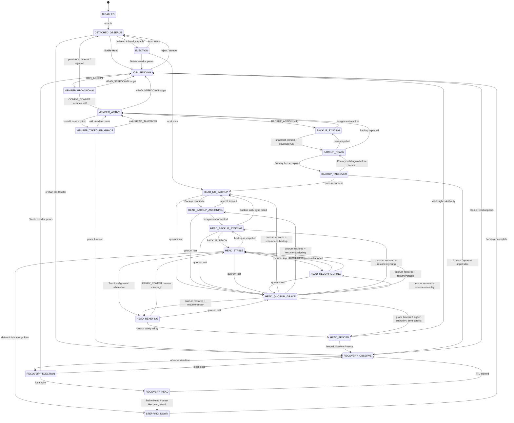

---

# 8. 全局高优先级迁移

Event Priority 中的：

```text
Higher Term / Higher Authority
```

必须被写成**全局迁移规则**，不能只在 `HEAD_STABLE` 里出现。

---

## 8.1 Same Cluster + Higher Term

任意 Active Phase 收到：

```text
msg.cluster_id == active.cluster_id
msg.term > active.term
authority_proof valid
```

优先于普通 phase handler。

### Head 身份 Phase

```text
立即：
    authority_active = false
    stop Authority TX
    persist max_seen_term

然后：
    如果 msg 是可 Join 的 Stable Head
        -> JOIN_PENDING
    否则
        -> HEAD_FENCED
```

### Member / Backup

```text
如果消息证明新的 Stable Authority：
    更新 pending target
    -> JOIN_PENDING / MEMBER switch
```

---

## 8.2 Same Cluster + Same Term + Different Head

```text
TERM_CONFLICT
```

处理：

```text
authority_active = false
stop Authority TX

if is_head_identity_phase:
    -> HEAD_FENCED

if Member/Backup:
    不为任一新 candidate 提供新的写承诺
    等待更高 Term Authority
```

不能：

```text
按 head_score 直接覆盖
```

---

## 8.3 Different Cluster

```text
term 不直接比较
```

进入：

```text
Merge / Recovery precedence
```

逻辑。

---

# 9. Event Driven Owner

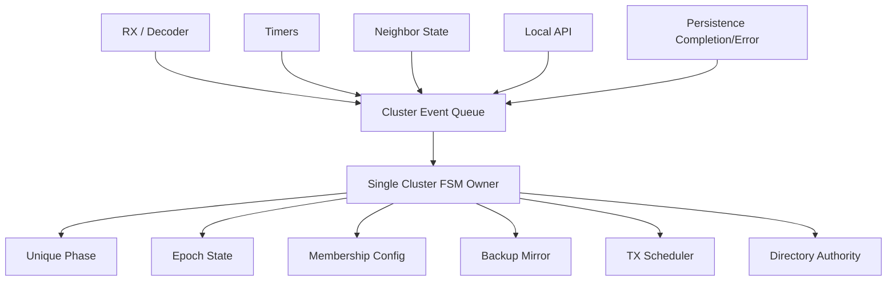

禁止：

```text
RX ISR 修改 phase
Neighbor callback 修改 quorum
Timer callback 直接 become_head()
业务线程直接 remove_member()
```

---

# 10. Event 处理优先级

每个 Poll：

```text
1. Persistence failure / local safety fault
2. Security / parser / malformed / replay reject
3. Same-cluster Higher Term / Term Conflict
4. Stable Authority evidence
5. Current Primary / Head valid liveness
6. Takeover / Stepdown / Rekey / Config Commit
7. Lease timeout / Quorum loss
8. Election / Recovery timers
9. Backup Snapshot / Assignment
10. Merge optimization
11. Ordinary advertisement
```

必须：

```text
先消费已排队 RX / Persistence Event
再执行 timeout 判断
```

---

# 11. Persistence Provider

这是 Target v2 的安全依赖。

```c
typedef struct
{
    int (*load)(void *ctx,
                ucn_cluster_persisted_state_t *out);

    int (*store_epoch)(void *ctx,
                       const ucn_cluster_epoch_t *epoch);

    int (*store_vote)(void *ctx,
                      const ucn_takeover_vote_id_t *vote);

    int (*store_config)(void *ctx,
                        const ucn_cluster_config_record_t *cfg);

    int (*store_stepdown_nonce)(void *ctx,
                                uint64_t nonce);

    int (*store_rekey_record)(void *ctx,
                              const ucn_rekey_record_t *record);

    int (*store_replay_epoch)(void *ctx,
                              const ucn_replay_epoch_t *epoch);

} ucn_cluster_persistence_provider_t;
```

---

## 11.1 Persist-before-advertise

```c
int become_head_new_term(cluster_t *c, uint32_t new_term)
{
    ucn_cluster_epoch_t next = c->active;

    next.term = new_term;
    next.head_id = c->node_id;

    if (persist_epoch(&next) != UCN_OK) {
        enter_fail_closed(c);
        return UCN_ERR_PERSIST;
    }

    c->active = next;

    /* 只有 persist 成功以后才能对外宣称 */
    send_head_advertise(c);

    return UCN_OK;
}
```

---

## 11.2 Persist-before-vote

```c
int grant_takeover_vote(cluster_t *c,
                        takeover_vote_id_t vote)
{
    if (persist_vote(&vote) != UCN_OK) {
        /* 禁止 ACK */
        return UCN_ERR_PERSIST;
    }

    c->last_vote = vote;

    return send_takeover_ack(c, &vote);
}
```

---

## 11.3 持久化失败

安全字段写失败：

```text
MUST fail-closed
```

例如：

```text
Head:
    authority_active=false
    -> HEAD_FENCED

Member:
    不再投票
    不确认新 Config Commit

Backup:
    不完成 takeover
```

---

# 12. Membership Reconfiguration Safety

这是 v2 相比上一版最重要的新增章节。

---

## 12.1 三类成员

### PROVISIONAL

```text
已收到 JOIN_ACCEPT
但尚未进入 Committed Config
```

它可以：

```text
接收业务
发送 KEEPALIVE
接收 Config Prepare
```

但：

```text
不参与当前旧配置 quorum
不保证在立即发生的 Takeover 中被保留
```

---

### COMMITTED

```text
存在于当前 ActiveQuorumConfig
```

参与：

```text
Authority quorum
Takeover quorum
Config quorum
```

---

### REMOVING

在 Joint Config 中：

```text
存在于 old set
不一定存在于 new set
```

直到新 Config 正式 Commit 前：

```text
不能简单从 quorum denominator 删除
```

---

## 12.2 为什么不能“等 Backup resync 后直接替换 VoterSet”

错误：

```text
C_old = {H,B,M1,M2,M3}

M3 LEAVE

Runtime = {H,B,M1,M2}

Backup snapshot READY

直接：
CommittedVoterSet = Runtime
```

如果 Primary/Backup 在边界时刻看到不同配置，可能：

```text
一边按 N=5 算
另一边按 N=4 算
```

因此 Membership Config 也必须提交。

---

## 12.3 配置事务

```text
C_old
    ↓
C_new proposed
    ↓
Backup 持久化 C_new snapshot
    ↓
CONFIG_JOINT
    ↓
C_joint active
    ↓
CONFIG_COMMIT
    ↓
C_new stable
```

---

## 12.4 Joint Config Quorum

在：

```text
CONFIG_JOINT
```

阶段，一个操作要获得 Authority/Commit，必须同时满足：

```text
votes_from_old >= quorum(C_old)
AND
votes_from_new >= quorum(C_new)
```

函数：

```c
bool joint_quorum_reached(config_t *old_cfg,
                          config_t *new_cfg,
                          vote_set_t *votes)
{
    return count_votes(old_cfg, votes) >= quorum(old_cfg)
        && count_votes(new_cfg, votes) >= quorum(new_cfg);
}
```

---

## 12.5 Reconfiguration 状态机

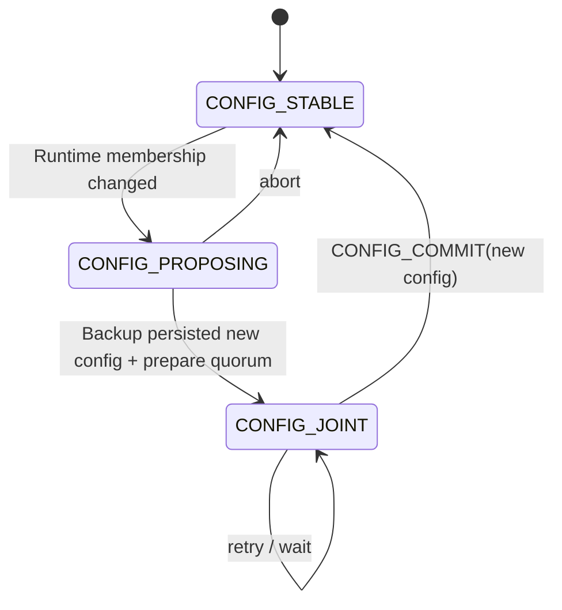

Head Phase：

```text
HEAD_STABLE
-> HEAD_RECONFIGURING
-> HEAD_STABLE
```

---

## 12.6 Addition

新节点：

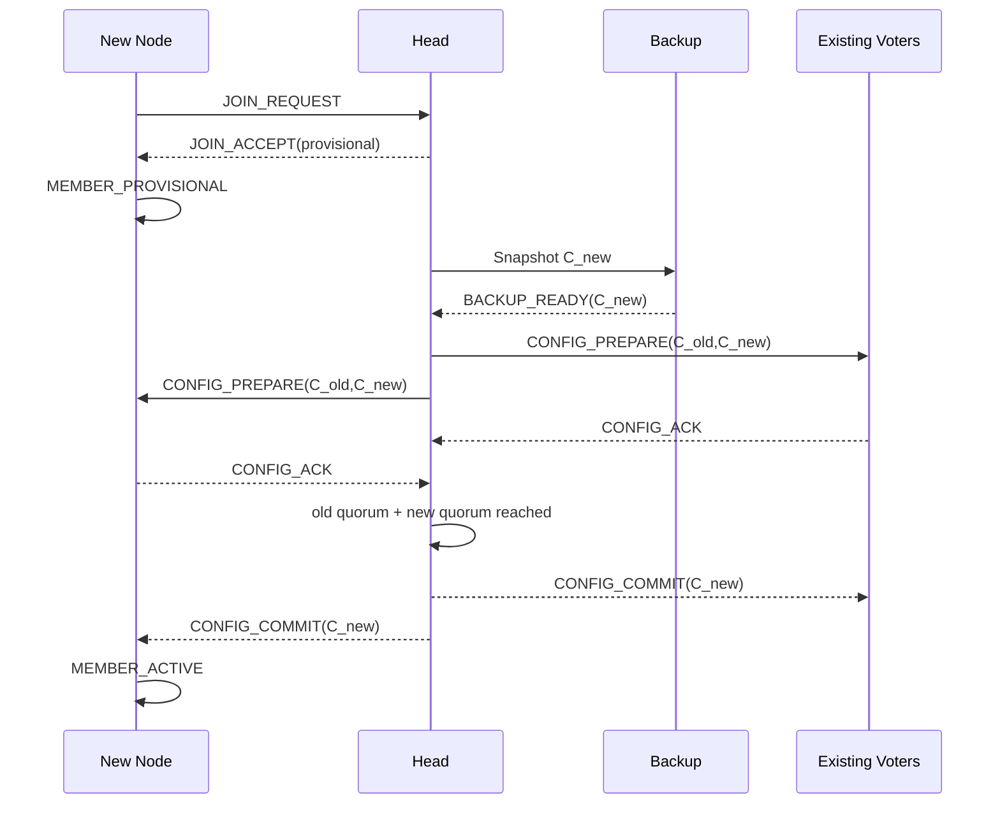

---

## 12.7 Removal

成员 LEAVE/Timeout：

```text
RuntimeMembers 先标记 pending remove
但 ActiveQuorumConfig 仍保持 C_old

完成 Joint Config 后：
    才从 C_new 删除
```

所以：

> `authority_grace_ms` 不需要也不应该覆盖 Backup resync 时间。

旧配置未安全提交前：

```text
quorum denominator 不变
```

如果因此失去 old quorum：

```text
Head 应立即失去 Authority
```

这是安全行为，不是误 FENCE。

---

## 12.8 Takeover 遇到 Joint Config

若 Primary 在：

```text
CONFIG_JOINT
```

阶段失效，Backup 必须从 committed mirror 读取：

```text
config_phase
C_old
C_new
```

并使用：

```text
joint quorum
```

完成 takeover。

不能：

```text
擅自只选 old
或只选 new
```

---

# 13. Join 状态机

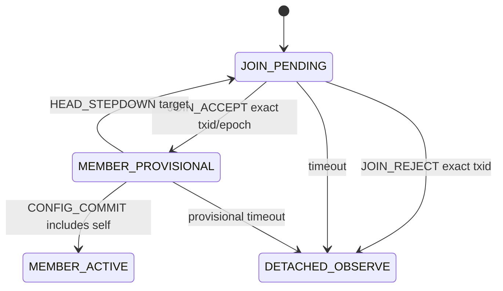

---

## 13.1 JoinTxId

```text
JoinTxn = {
    target_cluster_id,
    target_term,
    target_head_id,
    join_txid
}
```

旧：

```text
JOIN_ACCEPT
JOIN_REJECT
```

没有精确 txid：

```text
MUST NOT 改变新 Join
```

---

## 13.2 Begin Join

```c
void begin_join(cluster_t *c,
                const head_offer_t *head)
{
    c->phase = CL_PHASE_JOIN_PENDING;

    c->pending.cluster_id = head->cluster_id;
    c->pending.term = head->term;
    c->pending.head_id = head->node_id;
    c->pending.join_txid = next_txid(c);

    c->pending.deadline =
        now_ms() + c->cfg.join_timeout_ms;

    send_join_request(c);
}
```

---

## 13.3 JOIN_ACCEPT

```c
void on_join_accept(cluster_t *c,
                    const join_accept_t *msg)
{
    REQUIRE(c->phase == CL_PHASE_JOIN_PENDING);

    REQUIRE(msg->source == c->pending.head_id);
    REQUIRE(msg->cluster_id == c->pending.cluster_id);
    REQUIRE(msg->term == c->pending.term);
    REQUIRE(msg->join_txid == c->pending.join_txid);

    c->active.cluster_id = msg->cluster_id;
    c->active.term = msg->term;
    c->active.head_id = msg->source;

    c->head_lease_deadline =
        now_ms() + msg->lease_ms;

    c->phase = CL_PHASE_MEMBER_PROVISIONAL;
}
```

---

# 14. Member 状态机

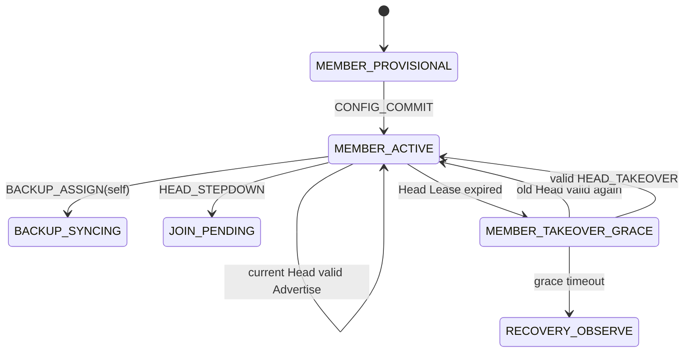

---

## 14.1 Member 不主动跳 Head

普通 Member 不允许：

```text
看到另一个 score 更高的 Head
-> 自行 LEAVE
-> JOIN 对方
```

不同 Member 看到的链路质量可能不同，容易把 Cluster 撕裂。

跨 Cluster 优化统一由：

```text
HEAD <-> HEAD Merge
```

完成。

---

## 14.2 Member Head Lease

只有：

```text
source == active.head_id
cluster_id == active.cluster_id
term == active.term
```

才能刷新。

---

# 15. Member Takeover Grace 与定时器约束

Member Head Lease 到期：

```text
MEMBER_ACTIVE
-> MEMBER_TAKEOVER_GRACE
```

不能立即 Recovery。

---

## 15.1 Grace 下界

定义：

```text
T_member_head_lease
T_backup_primary_lease
T_takeover_window
T_net_budget
T_step_budget
T_drift_budget
```

至少：

```text
MEMBER_TAKEOVER_GRACE
>=
max(0, T_backup_primary_lease - T_member_head_lease)
+
T_takeover_window
+
2 * T_net_budget
+
T_step_budget
+
T_drift_budget
```

否则可能：

```text
Member 已进入 Recovery
但 Backup 才刚达到合法 takeover 时间
```

从而健康接管凑不到票。

---

## 15.2 TAKEOVER_PREPARE

Member 只有在：

```text
phase == MEMBER_TAKEOVER_GRACE
```

才允许投票。

不能普通 MEMBER_ACTIVE 状态直接 ACK。

---

# 16. Head Authority 状态机

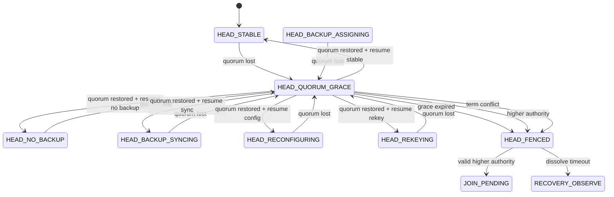

---

# 17. Authority Quorum

如果：

```text
ConfigPhase == CONFIG_STABLE
```

则：

```text
Head self
+
有效 lease 的 committed voters
>= quorum(C_stable)
```

如果：

```text
ConfigPhase == CONFIG_JOINT
```

则必须：

```text
quorum(C_old)
AND
quorum(C_new)
```

---

## 17.1 Head 立即撤销 Authority

```c
void head_check_authority(cluster_t *c,
                          uint64_t now)
{
    if (active_config_quorum_reached(c, now)) {

        if (c->phase == CL_PHASE_HEAD_QUORUM_GRACE) {
            quorum_restore_step(c, now);
        }

        return;
    }

    if (c->phase != CL_PHASE_HEAD_QUORUM_GRACE) {

        c->head_resume_phase = c->phase;

        /*
         * 关键：
         * 失去 quorum 的这一刻就失去写 Authority。
         */
        c->authority_active = false;

        stop_authority_tx(c);
        directory_disable_owner_write();

        c->phase =
            CL_PHASE_HEAD_QUORUM_GRACE;

        c->quorum_grace_deadline =
            now + c->cfg.authority_grace_ms;

        c->quorum_restore_since = 0;
    }
}
```

---

## 17.2 Grace 恢复

为了避免 quorum flapping：

```text
不能一看到 quorum 瞬间恢复就立即重新写
```

必须连续稳定：

```text
quorum_restore_hold_ms
```

```c
void quorum_restore_step(cluster_t *c,
                         uint64_t now)
{
    if (!active_config_quorum_reached(c, now)) {
        c->quorum_restore_since = 0;
        return;
    }

    if (c->quorum_restore_since == 0) {
        c->quorum_restore_since = now;
        return;
    }

    if (now - c->quorum_restore_since <
        c->cfg.quorum_restore_hold_ms) {
        return;
    }

    if (higher_term_seen(c))
        return enter_head_fenced(c);

    if (term_conflict_seen(c))
        return enter_head_fenced(c);

    c->authority_active = true;

    resume_previous_head_phase(c);
}
```

---

# 18. HEAD_FENCED 线上行为

FENCE 后：

```text
MUST stop:
    HEAD_ADVERTISE
    PRIMARY_HEARTBEAT
    JOIN_ACCEPT
    BACKUP_ASSIGN
    CONFIG_PREPARE
    CONFIG_COMMIT
    Authority Directory writes
    stable cluster mutations
```

可以：

```text
继续 RX
继续监听 Higher Authority
发送一次非权威 HEAD_WITHDRAW/FENCE_NOTICE（可选）
```

安全性不能依赖：

```text
FENCE_NOTICE 一定送达
```

Member 的最终判断仍依赖：

```text
Head Lease
```

---

## 18.1 Fenced Cleanup

定义：

```text
fenced_dissolve_ms
```

状态：

```text
HEAD_FENCED
```

如果：

```text
收到 valid higher Authority
    -> JOIN_PENDING
```

否则 deadline 到：

```text
保存 old lineage
-> RECOVERY_OBSERVE
```

一旦进入：

```text
HEAD_FENCED
```

同一个：

```text
cluster_id + term
```

不得因为 quorum 又恢复就直接重新启用 Authority。

---

# 19. Head Backup 子状态

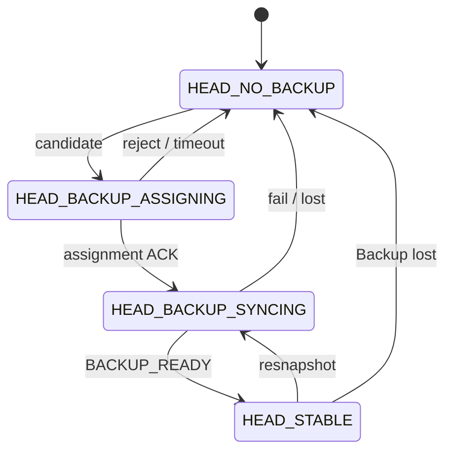

Backup 丢失后：

```text
MUST 立即选择下一个 candidate
```

而不是：

```text
等待新 Member JOIN
```

---

# 20. Backup Candidate 选择

Eligibility：

```text
Runtime Member
Committed or eligible provisional
head_capable
Core Neighbor == ADMITTED
not backup cooldown
not blacklist
```

排序：

```text
BackupRank = (
    head_score DESC,
    node_id ASC
)
```

选择必须确定性。

---

# 21. Backup Assignment

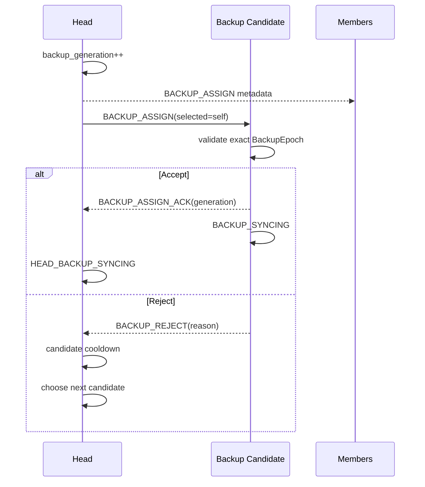

---

# 22. Backup Generation / Snapshot 回绕规则

## 22.1 snapshot_id

```text
snapshot_id:
    uint32_t
    0 invalid
```

同一个 `backup_generation`：

```text
1,2,3,...UINT32_MAX
```

禁止：

```text
UINT32_MAX -> 1
```

如果即将耗尽：

```text
rotate backup_generation
snapshot_id = 1
完整 resync
```

---

## 22.2 backup_generation

同一 Cluster 内：

```text
generation MUST NOT wrap
```

即将耗尽：

```text
触发 Cluster Rekey
```

不能同 Cluster：

```text
MAX -> 1
```

---

## 22.3 membership_sequence

定义为单次 Snapshot 内部 sequence：

```text
SYNC_BEGIN seq=0
SYNC_MEMBER seq=1..N
SYNC_END seq=N+1
```

因为：

```text
N <= max_cluster_members
```

必须静态保证：

```text
N + 1 < UINT32_MAX
```

因此 sequence 不存在正常 wrap。

---

# 23. Snapshot 双缓冲

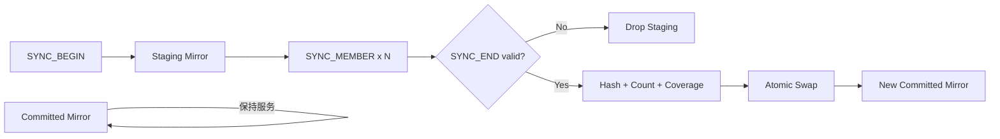

不能：

```text
SYNC_BEGIN
-> clear committed mirror
```

---

## 23.1 SYNC_BEGIN

```c
void on_sync_begin(cluster_t *c,
                   const sync_begin_t *msg)
{
    REQUIRE(exact_backup_epoch(c, msg));

    if (msg->snapshot_id <=
        c->backup.last_committed_snapshot_id) {
        return reject_replay(msg);
    }

    clear_staging(c);

    c->backup.staging_snapshot_id =
        msg->snapshot_id;

    c->backup.expected_sequence = 1;

    c->phase = CL_PHASE_BACKUP_SYNCING;
}
```

---

## 23.2 SYNC_END

必须检查：

```text
BackupEpoch exact
snapshot_id exact
sequence exact
member_count exact
snapshot_hash exact
config_id/config_phase exact
coverage valid
```

然后：

```text
atomic commit
```

---

# 24. BACKUP_READY

Head 必须验证：

```text
source
cluster_id
term
head_id
backup_id
backup_generation
snapshot_id
final_sequence
config_id
config_phase
config_hash
```

任何一个不一致：

```text
REPLAY / STALE / MALFORMED
```

不能只看 source。

---

# 25. Backup Coverage 与邻居 flapping

## 25.1 新 Backup 首次 READY

首次 READY：

```text
所有 required committed members
MUST 在本地 Neighbor 表为 ADMITTED
```

SUSPECT 不算首次 readiness。

---

## 25.2 已 READY Backup

Backup READY 后，某成员：

```text
ADMITTED -> SUSPECT
```

不能立即：

```text
Backup invalid
Head resync
Takeover fail
```

而是：

```text
start backup_coverage_grace
```

如果 SUSPECT 在 grace 内恢复 ADMITTED：

```text
保持 BACKUP_READY
```

如果：

```text
SUSPECT 持续超时
或 Core 已 REMOVED
```

则：

```text
coverage degraded
-> Backup 不再 eligible for future takeover
-> Head 重新选择/同步 Backup
```

---

## 25.3 Authority Quorum 不直接使用瞬时 Neighbor State

Authority：

```text
看 KEEPALIVE/lease
```

而不是：

```text
一变 SUSPECT 就减票
```

Core Neighbor State 是：

```text
链路信息
```

Cluster Lease 是：

```text
Authority 活性信息
```

不能混成一个状态。

---

# 26. Primary Heartbeat

Heartbeat 必须携带：

```text
cluster_id
term
head_id
backup_generation
snapshot_id
config_id
config_phase
nonce
```

Backup 只接受：

```text
exact current BackupEpoch
```

---

# 27. Backup Takeover

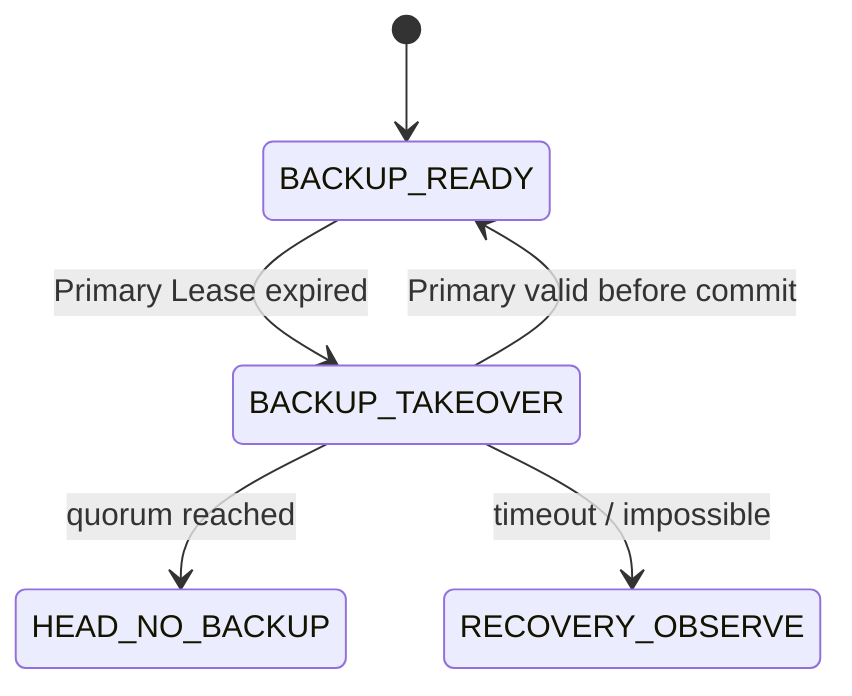

---

## 27.1 TakeoverVoterSet 冻结

进入：

```text
BACKUP_TAKEOVER
```

立即：

```text
TakeoverConfig =
    current committed ConfigState snapshot
```

直到：

```text
Takeover success
Takeover abort
```

之间：

```text
MUST NOT 修改 Takeover denominator
MUST NOT 接受“临时新增 voter”
MUST NOT 删除 voter 让 quorum 变小
```

---

## 27.2 VoteId

```text
TakeoverVoteId = {
    cluster_id,
    old_term,
    proposed_term,
    config_id,
    backup_node_id,
    backup_generation,
    snapshot_id
}
```

Member 必须：

```text
persist VoteId BEFORE ACK
```

---

## 27.3 Start Takeover

```c
void start_takeover(cluster_t *c)
{
    REQUIRE(c->phase == CL_PHASE_BACKUP_READY);
    REQUIRE(primary_lease_expired(c));
    REQUIRE(committed_snapshot_valid(c));

    c->phase = CL_PHASE_BACKUP_TAKEOVER;

    freeze_takeover_config(c);

    c->takeover.proposed_term =
        checked_next_term(c);

    clear_votes(c);

    add_vote(c, c->node_id); /* self vote */

    broadcast_takeover_prepare(c);

    c->takeover.deadline =
        now_ms() + c->cfg.takeover_window_ms;
}
```

---

## 27.4 Member 投票

```c
void on_takeover_prepare(cluster_t *c,
                         const takeover_prepare_t *msg)
{
    REQUIRE(c->phase ==
            CL_PHASE_MEMBER_TAKEOVER_GRACE);

    REQUIRE(exact_old_epoch(c, msg));
    REQUIRE(exact_known_backup(c, msg));
    REQUIRE(msg->proposed_term ==
            checked_term_plus_one(c->active.term));

    takeover_vote_id_t vote =
        make_vote_id(msg);

    if (same_vote_as_persisted(c, &vote)) {
        resend_ack(c, msg);
        return;
    }

    if (conflicting_vote_already_persisted(c,
                                           &vote)) {
        reject_vote(msg);
        return;
    }

    if (persist_vote(&vote) != UCN_OK) {
        /* fail closed */
        return;
    }

    c->last_vote = vote;

    send_takeover_ack(c, msg);
}
```

---

# 28. Takeover Quorum

Stable Config：

```text
votes >= quorum(C_stable)
```

Joint Config：

```text
votes_old >= quorum(C_old)
AND
votes_new >= quorum(C_new)
```

---

## 28.1 Takeover 成功

必须先：

```text
persist new StableEpoch
```

成功后：

```text
term = proposed_term
head = self
authority_active = true
phase = HEAD_NO_BACKUP
```

然后：

```text
HEAD_TAKEOVER
```

广播。

---

# 29. 网络分区安全性

例：

```text
C = {H,B,M1,M2,M3}
N=5
Q=3
```

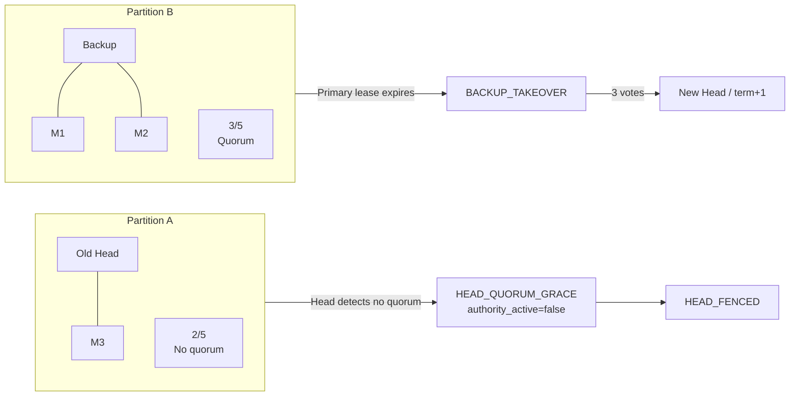

关键：

```text
旧 Head 在 Backup takeover 之前就已经停止 Authority Write。
```

---

# 30. Merge 防抖

不同 Cluster：

```text
term 不直接比较
```

先确定：

```text
MergeFeasible
```

再比较：

```text
MergeRank
```

---

## 30.1 Merge Rank

```text
MergeRank = {
    head_score,
    node_id
}
```

最终确定性 tie-break：

```text
score DESC
node_id ASC
```

但不能一次 sample 就 Handover。

---

## 30.2 Merge Hysteresis

必须配置：

```text
merge_improvement_percent
merge_required_samples
head_min_tenure_ms
merge_hold_down_ms
```

只有：

```text
candidate score
>= local score * (1 + improvement)

连续 samples >= required_samples

local tenure >= min_tenure

now >= merge_hold_down_until
```

才允许启动 Handover。

---

## 30.3 Merge Hold-down

每次 Merge 完成后：

```text
winner / joined nodes
```

都设置：

```text
merge_hold_down_until
```

在 hold-down 内：

```text
禁止因为普通 score 重新反向 Merge
```

Higher Stable Authority / safety conflict 不受 hold-down 限制。

---

# 31. Head-to-Head Handover

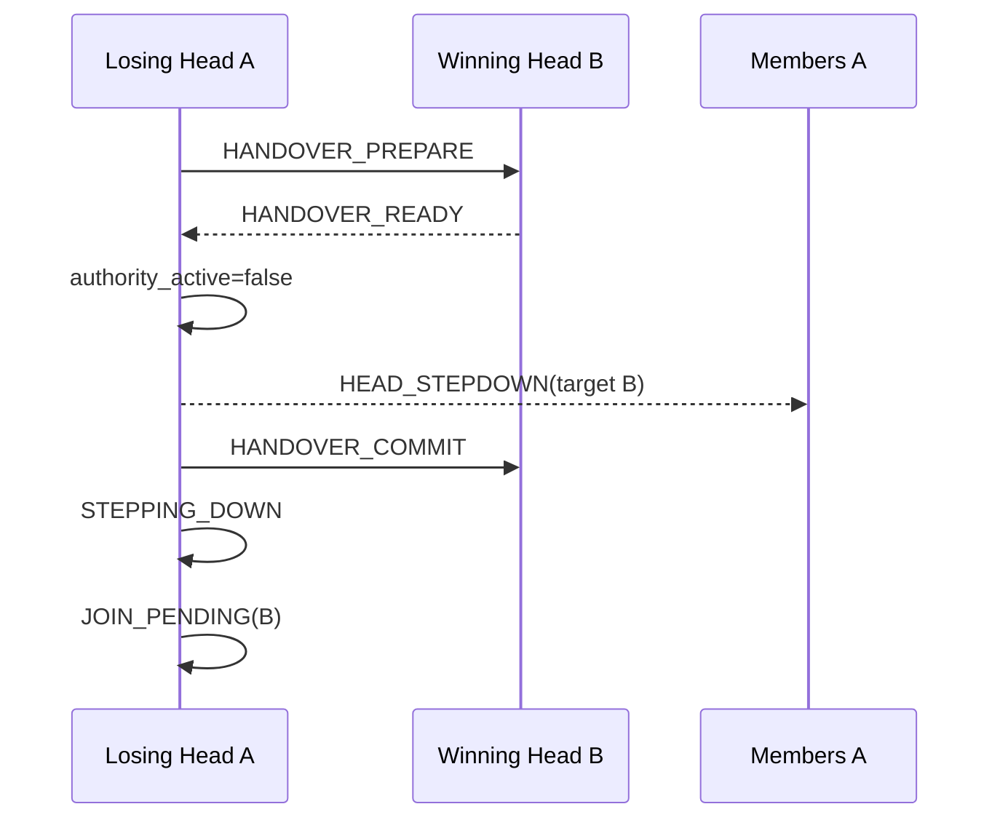

在发送：

```text
HEAD_STEPDOWN
```

之前：

```text
losing Head MUST stop Authority Write
```

---

# 32. HEAD_STEPDOWN

```text
HeadStepdown = {
    old_cluster_id,
    old_term,
    old_head_id,

    target_cluster_id,
    target_term,
    target_head_id,

    stepdown_nonce
}
```

Member、Provisional Member、Backup 都必须接受当前合法 Head 的 Stepdown。

---

# 33. Recovery 进入规则

Member：

```text
Head Lease expired
-> MEMBER_TAKEOVER_GRACE
-> no valid takeover
-> RECOVERY_OBSERVE
```

Backup：

```text
Primary Lease expired
-> BACKUP_TAKEOVER
-> no quorum / timeout
-> RECOVERY_OBSERVE
```

Backup 未 READY：

```text
Primary lost
-> 禁止 takeover old cluster
-> RECOVERY_OBSERVE
```

---

# 34. Recovery Backoff / Cooldown

Recovery 不能：

```text
TTL
-> Observe
-> 同一节点立即再赢
-> TTL
-> 无限自旋
```

必须：

```text
recovery_round++
```

并应用 bounded backoff。

---

## 34.1 Observe Window

```text
observe(round) =
min(
    recovery_observe_base << min(round, shift_cap),
    recovery_observe_max
)
```

---

## 34.2 Deterministic Jitter

```text
jitter =
hash(
    parent_cluster_id,
    parent_term,
    recovery_round,
    node_id
)
% recovery_jitter_max
```

最终：

```text
recovery_deadline =
now
+ observe(round)
+ jitter
```

---

## 34.3 稳定收敛后清 Round

只有：

```text
加入 Stable Cluster
并稳定持续 stable_reset_ms
```

后：

```text
recovery_round = 0
```

避免短暂稳定马上又从最小 backoff 重试。

---

# 35. Recovery Rank

如果两个 Recovery Island：

```text
parent_cluster_id 相同
```

先比较：

```text
parent_term DESC
parent_config_id DESC
```

然后：

```text
head_score DESC
node_id ASC
```

即：

```text
RecoveryRankSameLineage = (
    parent_term DESC,
    parent_config_id DESC,
    head_score DESC,
    node_id ASC
)
```

不能让：

```text
parent=T8 的高 score Island
```

压过：

```text
parent=T9 的较低 score Island
```

---

## 35.1 不同 Parent Cluster

如果：

```text
parent_cluster_id 不同
```

它们不是同一 lineage。

按：

```text
普通跨 Cluster Merge
```

处理，不直接比较 parent_term。

---

# 36. Recovery Head

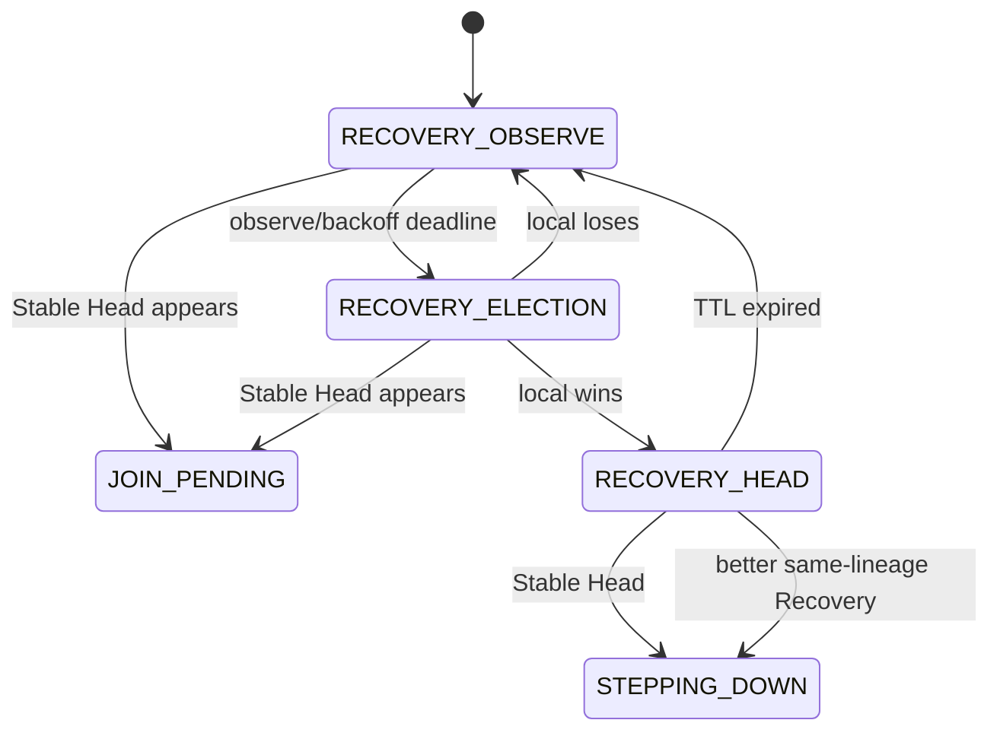

Authority Priority：

```text
Stable Head
>
Recovery Head
>
Candidate
>
Detached
```

Recovery Head 看见合法 Stable Head：

```text
MUST Stepdown
```

---

# 37. Recovery Cluster ID

建议：

```text
recovery_cluster_id =
hash64(
    parent_cluster_id,
    parent_term,
    parent_config_id,
    recovery_round,
    node_id,
    boot_incarnation
)
```

要求：

```text
!= 0
!= parent_cluster_id
```

---

# 38. Term Exhaustion / Cluster Rekey

上一版只写：

```text
Term MAX -> 封存旧 Cluster
```

但没有成员迁移。

v2 明确定义：

```text
CLUSTER_REKEY
```

---

## 38.1 触发

如果：

```text
term >= TERM_REKEY_THRESHOLD
```

例如：

```text
UINT32_MAX - 1024
```

Head 不再允许继续普通 Term bump。

必须：

```text
HEAD_STABLE -> HEAD_REKEYING
```

---

## 38.2 Rekey Tx

```text
RekeyTxn = {
    old_cluster_id,
    old_term,
    old_config_id,

    new_cluster_id,
    new_term = 1,

    rekey_txid
}
```

---

## 38.3 Rekey 时序

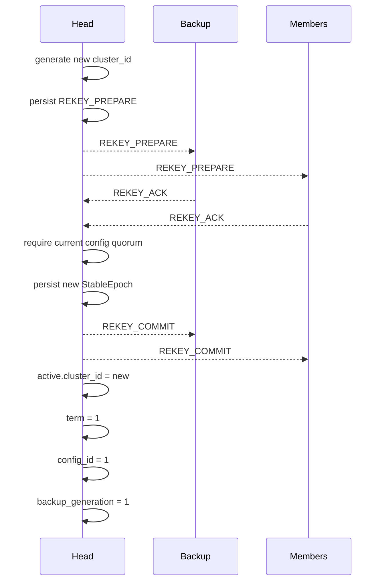

---

## 38.4 Rekey 失败

如果不能获得旧配置的安全 quorum：

```text
MUST NOT wrap Term
MUST NOT declare new cluster_id as continuation
```

而是：

```text
authority_active=false
-> HEAD_FENCED
```

---

## 38.5 Old Cluster Tombstone

所有节点 Commit Rekey 后保存：

```text
Tombstone = {
    old_cluster_id,
    max_old_term,
    rekey_txid
}
```

收到旧 Cluster 的控制帧：

```text
REPLAY
```

---

# 39. Replay Counter / Incarnation

对于高频 nonce：

```text
建议 64 bit
```

如果 Wire 必须保持 32 bit：

必须同时绑定：

```text
sender_incarnation
```

形成：

```text
ReplayEpoch = {
    sender_node_id,
    sender_incarnation,
    nonce32
}
```

`sender_incarnation` 必须持久化递增或来自不可重复 Boot ID。

---

# 40. Timer Budget 模型

不能只写：

```text
Lease >= 3 * heartbeat
```

必须显式计入调度、网络和时钟预算。

定义：

```text
T_step =
    Protocol Owner 最大 step 间隔
    即 UCN_MAX_STEP_INTERVAL_MS 或等价契约

T_net =
    单向最大控制帧延迟预算

T_retx =
    允许的最大重传等待

T_drift =
    Lease 窗口内双端时钟漂移预算

T_sched =
    RTOS / event queue 调度 jitter

T_margin =
    工程安全余量
```

---

## 40.1 Member Head Lease

```text
MEMBER_HEAD_LEASE
>=
K_head * HEAD_ADVERTISE_INTERVAL
+
T_step
+
T_net
+
T_retx
+
T_drift
+
T_sched
+
T_margin
```

其中：

```text
K_head >= 3
```

---

## 40.2 Backup Primary Lease

```text
BACKUP_PRIMARY_LEASE
>=
K_backup * PRIMARY_HEARTBEAT_INTERVAL
+
T_step
+
T_net
+
T_retx
+
T_drift
+
T_sched
+
T_margin
```

---

## 40.3 Head Authority Lease

```text
HEAD_AUTHORITY_LEASE
>=
K_member * MEMBER_KEEPALIVE_INTERVAL
+
T_step
+
T_net
+
T_retx
+
T_drift
+
T_sched
+
T_margin
```

---

## 40.4 Member Takeover Grace

```text
MEMBER_TAKEOVER_GRACE
>=
max(
    0,
    BACKUP_PRIMARY_LEASE - MEMBER_HEAD_LEASE
)
+
TAKEOVER_WINDOW
+
2*T_net
+
T_step
+
T_drift
+
T_sched
+
T_margin
```

---

## 40.5 Authority Grace

`authority_grace_ms`：

```text
不提供写权限。
```

它只决定 Head Identity 还能否恢复。

应满足：

```text
AUTHORITY_GRACE
>=
QUORUM_RESTORE_HOLD
+
T_step
+
T_net
+
T_sched
+
T_margin
```

它**不需要**覆盖 Membership Snapshot/Reconfiguration 时延。

---

# 41. Neighbor / Cluster 层契约

Core Neighbor State：

```text
ADMITTED
SUSPECT
REMOVED
```

Cluster 层定义：

### JOIN / New Backup

```text
必须 ADMITTED
```

### Existing Member Liveness

```text
由 Cluster Lease 决定
```

### Existing READY Backup Coverage

```text
ADMITTED -> healthy
SUSPECT  -> start coverage grace
REMOVED  -> degraded
```

所以：

```text
Core 自己的 suspect hysteresis
+
Cluster coverage grace
```

共同阻止短暂无线/有线抖动直接拆簇。

---

# 42. Phase TX 权限矩阵

| Phase | HEAD_ADVERTISE | PRIMARY_HB | JOIN_ACCEPT | CONFIG TX | Takeover TX | Authority Write |
|---|---:|---:|---:|---:|---:|---:|
| HEAD_NO_BACKUP | Yes | N/A | Yes | Yes | No | Yes |
| HEAD_BACKUP_ASSIGNING | Yes | Optional | Yes | No new commit | No | Yes |
| HEAD_BACKUP_SYNCING | Yes | Yes | Provisional only | No final commit | No | Yes |
| HEAD_STABLE | Yes | Yes | Yes | Yes | No | Yes |
| HEAD_RECONFIGURING | Yes | Yes | Provisional | Yes | No | Yes, subject to active config quorum |
| HEAD_REKEYING | Restricted | Yes | No | No membership change | No | Yes until rekey quorum lost |
| HEAD_QUORUM_GRACE | **No** | **No** | **No** | **No** | No | **No** |
| HEAD_FENCED | **No** | **No** | **No** | **No** | No | **No** |
| BACKUP_SYNCING | No | RX only | No | No | No | No |
| BACKUP_READY | No | RX only | No | No | No | No |
| BACKUP_TAKEOVER | No | No | No | No | Yes | No until commit |
| RECOVERY_HEAD | Recovery Advertise only | No | Recovery-local only | No Stable Config | No old-cluster takeover | No old Stable Authority |

---

# 43. Main Poll

```c
void ucn_cluster_poll(cluster_t *c)
{
    uint64_t now = now_ms();

    /*
     * 1. Consume safety/persistence/RX events first.
     */
    while (!event_queue_empty(&c->events)) {

        cluster_event_t e =
            event_queue_pop(&c->events);

        if (e.type == EVENT_PERSIST_FAILURE) {
            handle_persistence_failure(c, &e);
            continue;
        }

        if (e.type == EVENT_RX) {

            rx_result_t vr =
                validate_cluster_rx(c, &e.rx.msg);

            if (vr != RX_OK)
                continue;

            if (same_cluster_term_conflict(c,
                                           &e.rx.msg)) {
                handle_term_conflict(c,
                                     &e.rx.msg);
                continue;
            }

            if (contains_higher_authority(c,
                                          &e.rx.msg)) {
                process_higher_authority(c,
                                         &e.rx.msg);
                continue;
            }
        }

        dispatch_cluster_event(c, &e);
    }

    /*
     * 2. Apply Neighbor snapshot atomically.
     */
    apply_pending_neighbor_snapshot(c);

    /*
     * 3. Authority/quorum check before ordinary timers.
     */
    if (is_authority_capable_phase(c->phase)
        || c->phase == CL_PHASE_HEAD_QUORUM_GRACE) {
        head_check_authority(c, now);
    }

    /*
     * 4. Current phase timers.
     */
    switch (c->phase) {

    case CL_PHASE_DISABLED:
        break;

    case CL_PHASE_DETACHED_OBSERVE:
        detached_step(c, now);
        break;

    case CL_PHASE_ELECTION:
        election_step(c, now);
        break;

    case CL_PHASE_JOIN_PENDING:
        join_pending_step(c, now);
        break;

    case CL_PHASE_MEMBER_PROVISIONAL:
        member_provisional_step(c, now);
        break;

    case CL_PHASE_MEMBER_ACTIVE:
        member_active_step(c, now);
        break;

    case CL_PHASE_MEMBER_TAKEOVER_GRACE:
        member_takeover_grace_step(c, now);
        break;

    case CL_PHASE_HEAD_NO_BACKUP:
        head_no_backup_step(c, now);
        break;

    case CL_PHASE_HEAD_BACKUP_ASSIGNING:
        head_backup_assigning_step(c, now);
        break;

    case CL_PHASE_HEAD_BACKUP_SYNCING:
        head_backup_syncing_step(c, now);
        break;

    case CL_PHASE_HEAD_STABLE:
        head_stable_step(c, now);
        break;

    case CL_PHASE_HEAD_RECONFIGURING:
        head_reconfig_step(c, now);
        break;

    case CL_PHASE_HEAD_REKEYING:
        head_rekey_step(c, now);
        break;

    case CL_PHASE_HEAD_QUORUM_GRACE:
        head_quorum_grace_step(c, now);
        break;

    case CL_PHASE_HEAD_FENCED:
        head_fenced_step(c, now);
        break;

    case CL_PHASE_BACKUP_SYNCING:
        backup_syncing_step(c, now);
        break;

    case CL_PHASE_BACKUP_READY:
        backup_ready_step(c, now);
        break;

    case CL_PHASE_BACKUP_TAKEOVER:
        backup_takeover_step(c, now);
        break;

    case CL_PHASE_STEPPING_DOWN:
        stepping_down_step(c, now);
        break;

    case CL_PHASE_RECOVERY_OBSERVE:
        recovery_observe_step(c, now);
        break;

    case CL_PHASE_RECOVERY_ELECTION:
        recovery_election_step(c, now);
        break;

    case CL_PHASE_RECOVERY_HEAD:
        recovery_head_step(c, now);
        break;
    }

    assert_cluster_invariants(c);
}
```

---

# 44. Invariants

```c
void assert_cluster_invariants(cluster_t *c)
{
    /*
     * Epoch identity.
     */
    if (c->phase == CL_PHASE_MEMBER_ACTIVE ||
        c->phase == CL_PHASE_MEMBER_PROVISIONAL ||
        c->phase == CL_PHASE_MEMBER_TAKEOVER_GRACE) {

        ASSERT(c->active.cluster_id != 0);
        ASSERT(c->active.term != 0);
        ASSERT(c->active.head_id != 0);
        ASSERT(c->active.head_id != c->node_id);
    }

    if (is_head_identity_phase(c->phase)) {

        ASSERT(c->active.cluster_id != 0);
        ASSERT(c->active.term != 0);
        ASSERT(c->active.head_id == c->node_id);
    }

    /*
     * Authority invariant.
     */
    if (c->authority_active) {

        ASSERT(is_authority_capable_phase(c->phase));

        ASSERT(active_config_quorum_reached(
            c,
            now_ms()));

        ASSERT(c->phase !=
               CL_PHASE_HEAD_QUORUM_GRACE);

        ASSERT(c->phase !=
               CL_PHASE_HEAD_FENCED);
    }

    if (c->phase ==
        CL_PHASE_HEAD_QUORUM_GRACE) {
        ASSERT(!c->authority_active);
    }

    if (c->phase ==
        CL_PHASE_HEAD_FENCED) {
        ASSERT(!c->authority_active);
    }

    /*
     * Backup.
     */
    if (c->phase == CL_PHASE_BACKUP_READY ||
        c->phase == CL_PHASE_BACKUP_SYNCING ||
        c->phase == CL_PHASE_BACKUP_TAKEOVER) {

        ASSERT(c->backup.node_id == c->node_id);
        ASSERT(c->backup.generation != 0);
    }

    if (c->phase ==
        CL_PHASE_BACKUP_TAKEOVER) {

        ASSERT(primary_lease_expired(c));
        ASSERT(c->takeover.config_frozen);
    }

    /*
     * Recovery.
     */
    if (c->phase ==
        CL_PHASE_RECOVERY_HEAD) {

        ASSERT(c->active.cluster_id !=
               c->recovery.parent_cluster_id);
    }

    /*
     * Config.
     */
    if (c->config.phase ==
        CONFIG_JOINT) {

        ASSERT(c->config.old_set_valid);
        ASSERT(c->config.new_set_valid);
    }

    /*
     * Serial numbers.
     */
    ASSERT(c->backup.generation != 0
           || !backup_epoch_active(c));
}
```

---

# 45. 状态迁移总表

| 当前状态 | 事件 | 条件 | 动作 | 下一状态 |
|---|---|---|---|---|
| DISABLED | enable | config valid | init | DETACHED_OBSERVE |
| DETACHED_OBSERVE | Stable Head | valid | begin_join | JOIN_PENDING |
| DETACHED_OBSERVE | observe timeout | head_capable | election | ELECTION |
| DETACHED_OBSERVE | old lineage orphan | recovery allowed | recovery | RECOVERY_OBSERVE |
| ELECTION | Stable Head | valid | cancel election | JOIN_PENDING |
| ELECTION | deadline | local wins | persist epoch | HEAD_NO_BACKUP |
| ELECTION | deadline | local loses | restart observe | DETACHED_OBSERVE |
| JOIN_PENDING | JOIN_ACCEPT | exact txid | provisional join | MEMBER_PROVISIONAL |
| JOIN_PENDING | JOIN_REJECT | exact txid | clear | DETACHED_OBSERVE |
| JOIN_PENDING | timeout | - | clear | DETACHED_OBSERVE |
| MEMBER_PROVISIONAL | CONFIG_COMMIT | includes self | committed | MEMBER_ACTIVE |
| MEMBER_PROVISIONAL | timeout | not committed | detach | DETACHED_OBSERVE |
| MEMBER_ACTIVE | BACKUP_ASSIGN | exact/self | backup sync | BACKUP_SYNCING |
| MEMBER_ACTIVE | HEAD_STEPDOWN | exact target | join target | JOIN_PENDING |
| MEMBER_ACTIVE | Head Lease expired | - | start grace | MEMBER_TAKEOVER_GRACE |
| MEMBER_TAKEOVER_GRACE | old Head valid | same epoch | refresh | MEMBER_ACTIVE |
| MEMBER_TAKEOVER_GRACE | HEAD_TAKEOVER | proof valid | switch Head | MEMBER_ACTIVE |
| MEMBER_TAKEOVER_GRACE | timeout | - | recovery | RECOVERY_OBSERVE |
| HEAD_NO_BACKUP | Backup candidate | eligible | generation++ | HEAD_BACKUP_ASSIGNING |
| HEAD_BACKUP_ASSIGNING | ACK | exact | start snapshot | HEAD_BACKUP_SYNCING |
| HEAD_BACKUP_ASSIGNING | reject/timeout | - | next candidate | HEAD_NO_BACKUP |
| HEAD_BACKUP_SYNCING | BACKUP_READY | exact snapshot/config | commit backup | HEAD_STABLE |
| HEAD_BACKUP_SYNCING | fail/lost | - | invalidate | HEAD_NO_BACKUP |
| HEAD_STABLE | runtime membership change | - | config transaction | HEAD_RECONFIGURING |
| HEAD_RECONFIGURING | config commit | joint safety satisfied | commit C_new | HEAD_STABLE |
| HEAD_RECONFIGURING | abort | no commit | keep C_old | HEAD_STABLE |
| HEAD_STABLE | backup resnapshot | - | snapshot | HEAD_BACKUP_SYNCING |
| HEAD_STABLE | Backup lost | - | invalidate | HEAD_NO_BACKUP |
| HEAD_* operational | quorum lost | immediate | authority=false | HEAD_QUORUM_GRACE |
| HEAD_QUORUM_GRACE | quorum stable restored | hold satisfied, no higher term | authority=true | saved resume phase |
| HEAD_QUORUM_GRACE | grace timeout | - | permanent fence | HEAD_FENCED |
| HEAD_QUORUM_GRACE | higher term/conflict | valid | permanent fence | HEAD_FENCED |
| HEAD_FENCED | higher Stable Authority | valid | join | JOIN_PENDING |
| HEAD_FENCED | dissolve timeout | no authority | new recovery lineage | RECOVERY_OBSERVE |
| HEAD_STABLE | Merge lose | hysteresis satisfied | handover | STEPPING_DOWN |
| HEAD_STABLE | serial near exhaustion | quorum valid | Rekey | HEAD_REKEYING |
| HEAD_REKEYING | REKEY_COMMIT | old config quorum | new cluster epoch | HEAD_STABLE |
| HEAD_REKEYING | cannot commit | - | stop authority | HEAD_FENCED |
| BACKUP_SYNCING | SYNC_END | exact/hash/coverage | atomic commit | BACKUP_READY |
| BACKUP_SYNCING | revoked | - | clear backup | MEMBER_ACTIVE |
| BACKUP_READY | new snapshot | valid | staging | BACKUP_SYNCING |
| BACKUP_READY | Primary Lease expired | - | freeze config + vote | BACKUP_TAKEOVER |
| BACKUP_TAKEOVER | quorum | stable/joint quorum | persist new term | HEAD_NO_BACKUP |
| BACKUP_TAKEOVER | Primary valid before commit | exact old epoch | cancel | BACKUP_READY |
| BACKUP_TAKEOVER | timeout/impossible | - | no old Authority | RECOVERY_OBSERVE |
| STEPPING_DOWN | handover complete | - | join target | JOIN_PENDING |
| RECOVERY_OBSERVE | Stable Head | valid | join | JOIN_PENDING |
| RECOVERY_OBSERVE | backoff deadline | - | election | RECOVERY_ELECTION |
| RECOVERY_ELECTION | local wins | deterministic | new recovery cluster | RECOVERY_HEAD |
| RECOVERY_ELECTION | local loses | - | round/backoff | RECOVERY_OBSERVE |
| RECOVERY_HEAD | Stable Head | valid | stepdown | STEPPING_DOWN |
| RECOVERY_HEAD | better same-lineage Recovery | rank+hysteresis | stepdown | STEPPING_DOWN |
| RECOVERY_HEAD | TTL expired | - | round++ | RECOVERY_OBSERVE |

---

# 46. 明确禁止的直接跳转

```text
MEMBER_ACTIVE -> HEAD
MEMBER_PROVISIONAL -> HEAD
DETACHED -> BACKUP
MEMBER_ACTIVE -> RECOVERY_HEAD
BACKUP_READY -> HEAD
BACKUP_READY -> RECOVERY_HEAD
HEAD_FENCED -> active same-term Head
RECOVERY_HEAD -> old cluster_id Stable Head
CONFIG_STABLE(old) -> CONFIG_STABLE(new) without Joint Commit
Term MAX -> 1 in same cluster
Backup Generation MAX -> 1 in same cluster
```

正确：

```text
BACKUP_READY
-> BACKUP_TAKEOVER
-> HEAD_NO_BACKUP
```

---

# 47. 关键数据结构

```c
typedef struct
{
    uint64_t cluster_id;
    uint32_t term;
    uint64_t head_id;
} ucn_cluster_epoch_t;
```

```c
typedef enum
{
    UCN_CONFIG_STABLE = 0,
    UCN_CONFIG_JOINT  = 1,
} ucn_config_phase_t;
```

```c
typedef struct
{
    uint32_t config_id;
    ucn_config_phase_t phase;

    voter_set_t old_set;
    voter_set_t new_set;

    uint64_t old_hash;
    uint64_t new_hash;
} ucn_cluster_config_state_t;
```

```c
typedef struct
{
    uint64_t node_id;
    uint32_t generation;

    uint32_t current_snapshot_id;
    uint32_t last_committed_snapshot_id;

    uint64_t primary_lease_deadline_ms;
    uint64_t coverage_grace_deadline_ms;

    member_table_t committed_members;
    member_table_t staging_members;

    ucn_cluster_config_state_t committed_config;
    ucn_cluster_config_state_t staging_config;

} ucn_backup_state_t;
```

```c
typedef struct
{
    uint64_t cluster_id;
    uint32_t old_term;
    uint32_t proposed_term;

    uint32_t config_id;

    uint64_t backup_id;
    uint32_t backup_generation;
    uint32_t snapshot_id;

} ucn_takeover_vote_id_t;
```

```c
typedef struct
{
    uint64_t parent_cluster_id;
    uint32_t parent_term;
    uint32_t parent_config_id;

    uint32_t recovery_round;
    uint64_t recovery_cluster_id;

} ucn_recovery_lineage_t;
```

---

# 48. Replay / Fencing 字段总表

| 流程 | 身份/防重放字段 |
|---|---|
| JOIN | `cluster + term + head + join_txid + sender replay epoch` |
| KEEPALIVE | `cluster + term + member replay epoch` |
| LEAVE | `cluster + term + member replay epoch` |
| HEAD_STEPDOWN | `old epoch + target epoch + stepdown_nonce` |
| CONFIG | `cluster + term + config_id + config phase/hash` |
| Backup Assign | `BackupEpoch` |
| Snapshot | `BackupEpoch + snapshot_id + sequence` |
| BACKUP_READY | `BackupEpoch + snapshot_id + config_id + hash` |
| Primary Heartbeat | `BackupEpoch + snapshot_id + config_id + nonce` |
| Takeover | `TakeoverVoteId` |
| Recovery | `RecoveryLineage + sender replay epoch` |
| Rekey | `old epoch + old config + new cluster + rekey_txid` |

---

# 49. Safety Properties

## Safety-1：Single Writable Authority

```text
对同一个 Stable cluster_id，
任何时刻最多一个节点：
authority_active == true
```

---

## Safety-2：No Authority Without Quorum

```text
authority_active == true
=>
ActiveQuorumConfig satisfied
```

---

## Safety-3：Takeover Majority

```text
Backup 只有达到冻结的 TakeoverConfig quorum，
才能使用 old cluster_id + higher term 成为 Head。
```

---

## Safety-4：Recovery Isolation

```text
Recovery Head 永远使用新的 cluster_id。
```

---

## Safety-5：Persistent Vote

```text
同一个 TakeoverVote scope，
Member 最多持久化一个 conflicting candidate vote。
```

---

## Safety-6：Config Safety

```text
CommittedVoterSet 不允许从 C_old
无 Joint Commit 直接跳到 C_new。
```

---

## Safety-7：Replay Isolation

```text
旧 Term / Generation / Snapshot / Config / Tx
不能修改更新后的状态。
```

---

## Safety-8：Fence Before Split Brain

```text
Head 检测 quorum 丢失的同一状态周期内：
authority_active 必须先变 false，
然后才能进入等待恢复的 Grace。
```

---

## Safety-9：No Serial Reuse

```text
同一个上层 Epoch 内，
安全 serial 不允许回绕复用。
```

---

## Safety-10：Persist Before Promise

```text
所有会让远端依赖本节点承诺的安全状态，
必须先持久化再发送 ACK/Advertise/Commit。
```

---

# 50. Liveness Properties

Safety 优先，但在网络稳定且存在合法多数派时：

```text
Liveness-1:
    一个稳定 Majority 最终能形成 Stable Head。

Liveness-2:
    READY Backup + Majority 最终能完成 Takeover。

Liveness-3:
    两个可互联 Cluster 且容量允许时最终收敛到确定 winner。

Liveness-4:
    无 Stable Authority 的 island 最终可以形成 Recovery Cluster。

Liveness-5:
    Recovery Island 看见 Stable Head 后最终让位。
```

---

# 51. 测试矩阵

## 51.1 Authority / Fence

```text
quorum 刚丢失：
    authority_active 必须立即 false

quorum 在 grace 内恢复：
    必须经过 quorum_restore_hold 才重新 active

quorum grace 到期：
    HEAD_FENCED

FENCED 后 quorum 恢复：
    不得 same-term reactivate

FENCED 收到 higher term：
    JOIN_PENDING
```

---

## 51.2 Timer Algebra

测试：

```text
Owner step delay = 0
Owner step delay = UCN_MAX_STEP_INTERVAL_MS
网络延迟接近预算
连续丢 2 个 heartbeat
clock drift 正/负边界
```

验证：

```text
健康链路不误 failover
真正故障在最大时限内收敛
```

---

## 51.3 Member Grace / Takeover

```text
Member Head Lease 先过期
Backup Primary Lease 后过期

Member 必须仍处于 TAKEOVER_GRACE
直到 Backup 完成 Prepare/ACK。
```

---

## 51.4 Membership Config

```text
add one member
remove one member
连续 add/remove
Head 在 CONFIG_PROPOSING 时死
Head 在 CONFIG_JOINT 时死
Backup 在 Config Snapshot 中死
Joint old quorum 有/new quorum 无
Joint new quorum 有/old quorum 无
```

任何边界：

```text
Primary/Backup 必须使用相同 ActiveQuorumConfig 规则。
```

---

## 51.5 Provisional Member

```text
JOIN_ACCEPT 后 Head 立即死
```

预期：

```text
节点仍是 PROVISIONAL
不应错误认为自己属于 takeover voter set
```

---

## 51.6 Backup

```text
Backup LEAVE
Backup Neighbor SUSPECT 短暂恢复
Backup Neighbor REMOVED
Backup coverage grace timeout
Backup snapshot replay
旧 BACKUP_READY
旧 Primary heartbeat
snapshot_id rollover threshold
generation rollover threshold
```

---

## 51.7 Takeover

```text
self vote
duplicate ACK
conflicting vote
persist vote failure
joint config takeover
takeover timeout
Primary 恢复 before commit
Primary 恢复 after higher term commit
```

---

## 51.8 Merge

```text
score 在 threshold 附近抖动
sample 不足
tenure 不足
hold-down 内反向 score
higher Authority during hold-down
容量不足
```

---

## 51.9 Neighbor Flapping

```text
ADMITTED -> SUSPECT -> ADMITTED
小于 coverage grace

ADMITTED -> SUSPECT
超过 grace

ADMITTED -> REMOVED
```

验证：

```text
短抖动不拆簇
长期失联最终触发正确恢复
```

---

## 51.10 Recovery

```text
Primary + Backup 同时死
多个 Recovery Candidate
连续 Recovery TTL
round backoff 递增
两个同 lineage Island：parent T8 vs T9
两个不同 parent_cluster Island
Recovery Head 遇 Stable Head
稳定后 recovery_round reset
```

---

## 51.11 Rekey

```text
term 接近 threshold
REKEY_PREPARE replay
REKEY_ACK duplicate
old quorum 不足
persist new epoch fail
REKEY_COMMIT 后旧 Cluster frame replay
```

---

## 51.12 Persistence

```text
store_epoch fail
store_vote fail
store_config fail
store_rekey fail
掉电发生在：
    persist before TX
    TX before remote ACK
    config joint
    takeover commit
```

重启后：

```text
不能重复 vote
不能回到旧 Term Authority
```

---

# 52. Model / Property Test 建议

除了普通 unit test，建议增加状态机 property test。

例如：

```text
随机事件：
    packet delay
    packet duplicate
    packet replay
    node restart
    neighbor flap
    clock skew
    storage failure
    partition/heal
```

每一步都检查：

```text
Safety-1 ... Safety-10
```

特别是：

```text
assert:
    对同 cluster lineage，
    不存在两个 authority_active Stable Heads。
```

---

# 53. 推荐实现顺序

## P0-1：显式 Phase

先把 Current：

```text
role + bool + deadline
```

机械转换为：

```text
唯一 phase
```

但第一阶段尽量保持行为一致。

---

## P0-2：Authority / Quorum / Fence

加入：

```text
HEAD_QUORUM_GRACE
HEAD_FENCED
authority_active
quorum_restore_hold
TX 权限矩阵
```

这是 split-brain Safety 的核心。

---

## P0-3：Persistence

加入：

```text
ClusterPersistenceProvider
persist-before-vote
persist-before-advertise
fail-closed
```

---

## P0-4：Membership Reconfiguration

加入：

```text
MEMBER_PROVISIONAL
ConfigEpoch
C_old -> C_joint -> C_new
Joint Quorum
```

---

## P0-5：Backup Epoch

加入：

```text
backup_generation
snapshot_id
staging/committed mirror
完整 BACKUP_READY
coverage grace
```

---

## P0-6：Takeover

加入：

```text
frozen TakeoverConfig
self vote
full VoteId
joint quorum
```

---

## P0-7：Timer Algebra

将所有：

```text
lease
grace
takeover
```

和：

```text
UCN_MAX_STEP_INTERVAL_MS
网络预算
漂移
重试
```

统一计算。

---

## P1-1：Recovery

加入：

```text
RecoveryLineage
parent_term precedence
bounded backoff
recovery_round
```

---

## P1-2：Merge

加入：

```text
merge threshold
samples
tenure
hold-down
```

---

## P1-3：Rekey

完成：

```text
Term exhaustion
Generation exhaustion
Cluster tombstone
```

---

## P1-4：Neighbor Anti-flap

加入：

```text
coverage grace
Core/Cluster 层契约
```

---

# 54. Current -> Target 关键映射

```text
Current:
role=MEMBER
head_grace_deadline!=0

Target:
MEMBER_TAKEOVER_GRACE
```

```text
Current:
JOIN_ACCEPT -> MEMBER

Target:
JOIN_ACCEPT
-> MEMBER_PROVISIONAL
-> CONFIG_COMMIT
-> MEMBER_ACTIVE
```

```text
Current:
role=HEAD
backup_node_id=0

Target:
HEAD_NO_BACKUP
```

```text
Current:
role=HEAD
backup_ready=false

Target:
HEAD_BACKUP_SYNCING
```

```text
Current:
role=HEAD
backup_ready=true

Target:
HEAD_STABLE
```

```text
Current:
没有 quorum state

Target:
HEAD_* operational
-> HEAD_QUORUM_GRACE
-> HEAD_FENCED
```

```text
Current:
role=BACKUP + backup_syncing

Target:
BACKUP_SYNCING
```

```text
Current:
role=BACKUP + backup_ready

Target:
BACKUP_READY
```

```text
Current:
role=BACKUP + takeover_active

Target:
BACKUP_TAKEOVER
```

```text
Current:
DETACHED + recovery_eligible/backoff

Target:
RECOVERY_OBSERVE
RECOVERY_ELECTION
```

---

# 55. 上一轮 17 条评审意见处理结果

| # | 问题 | v2 处理 |
|---:|---|---|
| 1 | Grace 与 invariant 矛盾 | 新增 `HEAD_QUORUM_GRACE`；quorum 丢失立即 `authority_active=false` |
| 2 | Witness 悬空 | 明确标记 Out of Scope |
| 3 | Term 封存无迁移 | 新增 `CLUSTER_REKEY` |
| 4 | Higher Authority 缺全局迁移 | 新增 §8 全局高优先级规则 |
| 5 | snapshot_id 回绕 | 明确 no-wrap + generation rotate |
| 6 | Member Grace vs Takeover | 新增 timer algebra 下界 |
| 7 | authority grace vs resync | 不用 timer 掩盖；新增 Joint Membership Config |
| 8 | Core step/clock budget | 新增 §40 Timer Budget |
| 9 | Merge 无迟滞 | threshold + samples + tenure + hold-down |
| 10 | Neighbor flapping | 新增 coverage grace + layer contract |
| 11 | Recovery 无退避 | recovery_round + bounded backoff |
| 12 | 二等成员语义 | 新增 `MEMBER_PROVISIONAL` |
| 13 | FENCED 线上行为 | 新增 TX 权限矩阵 |
| 14 | Takeover voter set freeze | 明确 `TakeoverConfig` immutable |
| 15 | Persistence Provider | 新增完整 Provider + fail-closed |
| 16 | Recovery parent term 排序 | same-lineage rank 先比 parent term/config |
| 17 | `is_head_phase()` 不清楚 | 拆成 identity/capable predicate |

---

# 56. 最终架构图

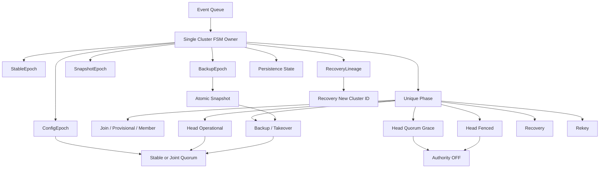

---

# 57. 最终协议公式

Target v2 可以压缩成：

```text
Unique Phase
+
Stable Epoch
+
Persistent Safety State
+
Committed / Joint Membership Config
+
Immediate Authority Revocation on Quorum Loss
+
Head Quorum Grace / Permanent Fence
+
Backup Epoch + Atomic Snapshot
+
Frozen Majority Takeover
+
Timer Algebra
+
Neighbor Anti-Flap
+
Merge Hysteresis
+
Recovery Lineage + Backoff
+
No-Wrap Rekey
=
可确定、可审计、可故障注入验证的 UCN Cluster FSM
```

---

# 58. 最终结论

这版设计的安全优先级是：

```text
Safety > Availability
```

具体表现：

```text
没有 quorum：
    不写。

没有安全 Membership Config：
    不改 quorum denominator。

没有持久化成功：
    不投票、不升 Term、不发承诺。

Backup 没有 Majority：
    不接管旧 Cluster。

Recovery：
    使用新 cluster_id。

serial 即将耗尽：
    Rekey，不 wrap。

短暂 Neighbor 抖动：
    grace/hysteresis，不立即拆簇。

动态 score 抖动：
    samples + tenure + hold-down，不乒乓。
```

因此后续实现时，任何“为了更快恢复”而绕过：

```text
Quorum
Persistence
Config Commit
Epoch Fencing
```

的优化都应视为协议安全回退，必须经过重新设计评审。
