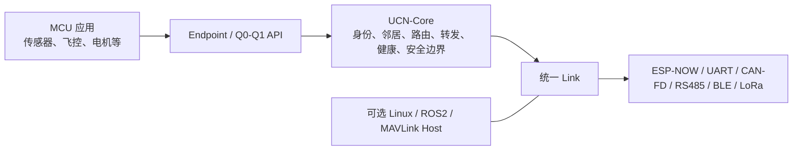

# UCN v4 协议核心说明：主要做什么、怎么做

> 状态：**基于 UCN v4 C99 Core 源码快照（2026-08-09）**。本文重点解释协议目标与运行机制；已实现的 C99/虚拟拓扑能力、真实硬件验证和后续设计严格分开。
> 关联：[整体架构设计](UCN_整体架构设计.md) · [协议分层与配置档案](UCN_协议分层与配置档案.md) · [Adapter 契约](UCN_Adapter_契约.md) · [v4 节点快照诊断](UCN_v4_节点快照诊断.md) · [任务表](00-任务表.md)

## 1. 一句话定位

UCN v4 是一个以 **MCU 为中心** 的轻量通信与自组网 Core。它的目标不是重写 WiFi、CAN、Linux 或 ROS2，而是在这些不同底层之上，让 MCU 节点能用同一套规则完成：

```text
我是谁 → 谁和我直连 → 目标在哪里 → 下一跳交给谁 → 断开后如何恢复 →
同一目标中的哪类数据 → 是否需要端到端保护 → 如何按需诊断网络
```

因此，多个 MCU 即使没有 Linux，也能组成有限多跳网络；Linux/ROS2/MAVLink 只是可选的业务接入端或网关，不是路由中心，也不是网络存在的前提。

## 2. UCN 解决的核心问题

| 问题 | UCN v4 的做法 | 不做什么 |
| --- | --- | --- |
| 不同底层怎样统一通信 | 应用只面对 Node ID、Endpoint、QoS 和发送 API；ESP-NOW、UART、CAN 等由 Link/Adapter 接入。 | 不实现 WiFi MAC、CAN 控制器、TCP/IP 或厂商无线协议。 |
| 没有 Linux 怎样自组网 | MCU 中的 Core 发现一跳邻居、维护路由缓存、按需寻路并转发。 | 不依赖固定 Linux 主机、云端或中心服务器。 |
| 数据怎样去目标节点 | 直连优先；无路由时受限 `ROUTE_REQ/REPLY` 建立 AODV-Lite Route Cache；之后业务帧只走当前下一跳。 | 不让每个节点常驻保存全网完整拓扑，也不让每帧重新泛洪寻路。 |
| 目标节点有多类数据怎样区分 | `Endpoint` 区分 IMU、温度、命令等业务入口；一条 Node 间路径可承载多个 Endpoint。 | 不把业务分类与物理链路、MAC 地址或 CAN ID 绑定。 |
| 链路质量变化怎么办 | Adapter 把本介质指标归一成 `route_cost`；Core 在寻路/候选路径，以及同对端 Bearer 的受控切换中比较 Cost。 | Core 不直接读取 RSSI、SNR、Bus-Off 等介质专用字段。 |
| 需要保密但中继不应看到内容 | 业务帧可端到端受保护；中继按路由头透明转发密文，目标节点才解密。 | 当前 Core 不自带生产 AEAD、密钥发放或证书体系。 |

## 3. 协议的最小运行闭环



Core 只依赖抽象的 `Link`、时间/随机数/临界区等 Port 接口；它不依赖 ESP32 SDK、Linux Socket 或某一种无线技术。这样同一份协议逻辑可以先在虚拟 Link 中测试，再接到不同硬件 Adapter。

一个典型 MCU 网络的实际逻辑如下：

1. 应用在启动前提供稳定的 `Node ID`、Network ID 和策略配置。Node ID 的来源可以是编译期固定值、Flash/NVS、出厂分配或身份 Provider；这属于产品启动层，不应写死在 Core 内。
2. Adapter 发现物理对端后建立 Candidate Link，Core 通过一跳 `HELLO` 绑定对端 Node ID，并按 Manual/Open/Provider 策略决定是否准入。
3. 已准入的直连邻居进入 Neighbor Table。业务有直连出口或有效 Route Cache 时，直接向选定下一跳发送。
4. 目标未知时，Q1 Endpoint 可在固定等待槽内受限发起 `ROUTE_REQ`；`ROUTE_REPLY` 沿反向路径返回并建立缓存。Q0 不等待寻路，避免控制面阻塞紧急业务。
5. 中继节点只需知道“该帧的下一跳”，而不必保存源到目标的完整路径。转发时 TTL 递减；链路失效时清理相关路由并按需回送 `ROUTE_ERROR`。
6. 后续业务复用 Route Cache，而不是每次传输都寻路。缓存/候选路径维护与业务转发分开进行。

## 4. Core 内部每一块做什么

| Core 模块 | 主要职责 | 当前 v4 实现边界 |
| --- | --- | --- |
| Frame | 固定头、版本、Network ID、源/目的 Node ID、TTL、消息类型、CRC、Route Epoch 和可选 Path ID 编解码。 | 协议版本为 4；基础头 32 B，Route Extension 为 36 B，Path 业务帧为 40 B；受保护业务额外带 16 B Tag；旧 v3、未知 Flag/头尺寸会拒绝。 |
| Identity / Neighbor | 用 HELLO 发现并绑定一跳对端，维护 Candidate、Admitted、Suspect、Removed 等邻居状态。 | HELLO 不转发；生产 `JOIN_REQ/CHALLENGE/ACCEPT` 状态机和出厂身份格式仍未实现。 |
| Health / Bearer | 用一跳 Heartbeat 和有效业务帧刷新邻居存活；同一 Node ID 的固定 Bearer 各自保活，超时后局部回收 Link 和动态路由。 | Heartbeat 只在直连邻居之间收发，不做全网心跳广播；质量 Probe 复用它的 8 B request/ACK，不新增业务帧字段。 |
| Route / Forward | Route Cache、受限 AODV-Lite、`ROUTE_REQ`、`ROUTE_REPLY`、`ROUTE_ERROR`、TTL 与去重。 | 固定 Active/Candidate 表；不是全网拓扑数据库，也没有无限制泛洪。 |
| Path switch | 在旧 Active 路径仍传业务时，探测 Candidate，确认后 Activate。 | 使用 Candidate/Probe/Activate、Cost 比较、Route Epoch 与 Current/Previous 短暂 grace，降低切换期间在途帧混淆；真实空口无缝指标尚未测量。 |
| Policy / Path / quality | 为按业务策略选 Path 准备固定 Policy、当地 Path、Q1 Flow、Link 质量与线上 Path 转发表。 | T22.1 已完成固定表、500 ms/25% EWMA 和质量查询；T22.2 已完成 40 B Path ID、逐跳安装/撤销、Path 范围 RERR 和 E2E AAD；T22.3 已使 `PINNED_STRICT`/`PINNED_FAILOVER` 生效；T22.4 已使 `AUTO_BALANCE` 按 Q1 Flow 租约选择最多两条已验证 Path，并仅在持续拥塞/Down/租约边界重绑。 |
| Endpoint / QoS | 把“发给哪个 Node”与“Node 内哪类数据”分开；调度 Q0/Q1。 | 静态业务 Endpoint 为 `0x40..0xBF`；Q0 为普通尽力而为，Q1 为最新值优先。Q2/Q3、可靠确认和大包分片尚未实现。 |
| Node 内任务通信 | 让同一 MCU 上的多个业务任务使用同一 Endpoint 语义。 | T25.3 已在 ESP32 产品 Port 静态接入固定 Service Router、Q0/Q1 Inbox、唯一 Protocol Task→Core Bridge、1 B Endpoint 事件 Queue 与业务 Task 通知；C99 Core 不含 FreeRTOS，真实任务资源/时延仍待实测，不把任务变为独立 Node。 |
| Security boundary | 发送/接收策略、Session/Counter、授权与可插拔 `seal/open` Provider。 | 支持按 Node/Endpoint 选择明文或端到端受保护、目标解密和中继透明转发；生产密钥、审计过的 AEAD、轮换/撤销和产品 ACL 表仍待接入。 |
| Diagnostics | 只在需要时查询网络状态。 | 已有按需路径追踪 `PATH_TRACE_REQ/REPLY`、按需节点快照 `NODE_SNAPSHOT_REQ/REPLY` 和受授权的单 Node 策略诊断 `POLICY_DIAGNOSTIC_REQ/REPLY`；均独立限流、固定表项，默认不维护永久全网地图。 |

## 5. 路由、质量与切换是怎样协同的

UCN 不会在每次业务发送前重新寻找完整路径。正常流程是“**缓存发送，后台受限维护，故障优先恢复**”：

```text
已有 Active 路由
  → 业务帧只沿 Active 的下一跳转发
  → Adapter 持续提供已平滑的 route_cost / Link 状态
  → Core 在允许的刷新窗口发现或检查 Candidate
  → Candidate 先 Probe，确认后 Activate
  → 新旧 Route Epoch 短暂并存，之后回收旧路径

链路硬故障 / 邻居离网
  → 立即使本地相关出口失效
  → 业务命中失效路径时按需 RERR 与重新发现
```

`route_cost` 是跨介质的统一抽象：WiFi Adapter 可以综合 RSSI、丢包、重试；CAN Adapter 可以综合错误、拥塞或 Bus-Off；UART 可以综合 CRC、超时和队列压力。采样、平滑和防抖属于 Adapter，Core 只比较最终 Cost，因此不会把 WiFi 特有逻辑带入 CAN/UART。

当前已实现的是固定容量的 Active/Candidate 控制闭环和虚拟拓扑验证；Cost 的实机采样周期、抖动窗口、吞吐与切换丢包上限必须在具体 Adapter 和多板环境中测量后冻结。

同一下一跳同时存在 WiFi/UART/CAN Bearer 时，T21.3 会先保持健康 Primary。候选 Bearer 只有比 Primary 低至少 20%、连续 3 个 500 ms 窗口成立，且在自己的直连 Link 上取得 2 次 `HEARTBEAT` ACK（最多 3 次、100 ms 间隔）才成为新的 Primary；硬 Down 仍直接切健康 Backup。该 Probe 不经中继、不改线格式：它不会在每次业务发送时抢占 Q0/Q1，但连续业务达到默认 4 帧且 Probe 已到期时可使用一个必要维护槽，避免长期饥饿。数值均为可覆盖的编译期宏。两块 S3 已实测 ESP-NOW 与 UART 以两个独立 Core Link 合并为同一 Neighbor；UART Cost 5 为 Primary、ESP-NOW Cost 10 为 Backup，远端 UART 停止后仍保留 Wi-Fi Neighbor，恢复后再合并。物理拔线切换时延、功耗、持续业务丢失/乱序与多跳仍须测量。

## 6. 对外接口与对内接口的边界

### 对应用：统一业务接口

应用应关注 Node ID、Endpoint、QoS 和安全策略，而不是“这次从 WiFi 还是 UART 到达”。主要接口围绕：

- `ucn_node_send_endpoint()`：向指定 Node 的指定 Endpoint 发送业务数据；
- `ucn_node_discover_route()`：显式发起按需寻路；
- `ucn_node_install_local_path()` / `ucn_node_send_path_install()`：受授权地配置本地或远端逐跳 Path 表；
- `ucn_node_send_path()`：以已安装 Path ID 发送一帧业务，用于受控配置、诊断和 T22.2 验证；
- `ucn_node_set_route_policy()` / `ucn_node_set_policy_path()`：配置 Endpoint 的 Primary/Backup 本地句柄及其线上 Path ID；之后仍用 `ucn_node_send_endpoint()` 发业务；
- `ucn_node_request_path_trace()`：按需查询一条到目标的实际经过节点；
- `ucn_node_request_node_snapshot()`：按需收集当前网络可见节点的诊断快照。
- `ucn_node_request_policy_diagnostic()`：经目标显式授权后查询其一个 Policy/Path/Flow/质量槽位或统计页；请求在普通 Q0/Q1 之后低优先级发送。

同一 MCU 内的业务任务现在可调用 Core 外的 `ucn_service_send()`：发给本机 Node 时直接投入静态 Inbox，发给远端 Node 时先进入固定 Remote TX 队列。T25.2 的 `ucn_service_protocol_bridge_step()` 只能由唯一 Protocol Task 有界出队并调用 `ucn_node_send_endpoint()`，目标 Endpoint callback 再投递 Router；T25.3 才会映射 FreeRTOS 静态 Queue/通知。因此不能把当前实现误认为完整的板级任务通信；详见[节点内任务通信建议](UCN_节点内任务通信建议.md)。

### 对介质：统一 Adapter/Link 接口

物理驱动负责把“收到的字节和对端物理地址”转换成 Candidate Link，并放入有界 RX 队列；协议任务再通过 `ucn_adapter_rx_pump()` 将帧交给 Core。WiFi/串口/CAN 的中断或回调不应直接执行路由和应用回调。

这种分层的价值是：增加一个新介质时，通常只需要写该介质的 Adapter、地址映射和 Cost 归一化，不需要把应用业务或路由算法分别重写一遍。

## 7. V4 相比 V3 新增的重点

V4 不是推翻 V3 的重新设计，而是在既有“邻居—寻路—转发—安全边界”闭环上，升级协议版本并新增 **按需节点快照诊断**：

- 管理节点显式发起一次受限 Snapshot 请求；
- 节点只在短窗口内处理/转发一次，并沿临时 Reverse 回送自己的简要状态；
- 源节点在窗口结束时汇总固定容量结果；
- 默认拒绝远端请求，且独立限流；
- 不建立永久全网拓扑表，不给正常 Q0/Q1 业务帧增加字段。

它适合多板调试、安装验收和网络诊断；它不是常驻路由协议，也不是业务转发依赖。

## 8. 资源与适用范围

UCN Core 的设计原则接近 FreeRTOS 风格的小内核：固定帧、固定数组、编译期容量、无动态拓扑表、无隐藏后台线程。RAM/Flash 预算不先承诺一个统一数字，而由目标 MCU 的 RAM、节点数量、最大 Link/Neighbor/Route、队列深度、是否启用安全和诊断功能共同决定。

适合的场景包括：多 MCU 传感器/执行器网络、飞行器或机器人内部网络、ESP32 多板实验、WiFi/UART/CAN 混合接入，以及需要以后接入 Linux 监控或 ROS2 的设备网络。

不应把 UCN 误认为以下系统的直接替代品：

- 它不替代 WiFi Mesh/802.11s 的 WiFi MAC 与空口调度；WiFi 只是一种可接入的 Bearer。
- 它不替代 DroneCAN 的具体 CAN 生态和设备数据类型；它可在上层统一不同介质，但经典 CAN 仍需要 Carrier 分段。
- 它不替代 Linux 网络栈、DDS、ROS2 或 MAVLink；这些更适合作为 Host/业务层接入。
- 它不是文件传输、OTA 或高吞吐大数据协议；这些需要后续 Extended 的可靠与分片能力。

## 9. 当前已经证明与尚未证明的边界

| 范围 | 当前结论 |
| --- | --- |
| 已由代码与虚拟拓扑验证 | v4 帧与版本拒绝、HELLO/邻居、Heartbeat、同对端固定双 Bearer 准入/保活/硬 Down 备链切换、5% 抖动保持、Probe ACK 丢失保持及成功质量切换、A→B→C 下 Active/Candidate Probe/Activate 随 Backup 发送、下游 RERR 经 Backup 回传、全 Down 动态清理及静态 Route 保留边界、AODV-Lite、Q0/Q1、Endpoint、Route Epoch、透明密文转发、T22.2 的 40 B Path ID/显式授权控制面/双路径中继/Path 范围 RERR、T22.3 Strict 不回退/主备硬故障切换/Q1 显式 RREQ 回退/Q0 不寻路、T22.4 同 Flow 固定/拥塞与 Down 重绑/租约到期、T22.5 单 Bearer 保持 Path ID/全 Bearer Down 的限定 Path 撤销与上游 Path RERR，以及 T22.6 授权/限频/固定表/Q0 优先的策略诊断；路径追踪、节点快照。 |
| 已构建且已有两板实机证据 | T21.5 已完成 ESP32-S3 单/双 Bearer 静态比较：第二条 Bearer 增加 256 B RAM、496 B Flash；ESP-WROOM-32 也构建通过。T21.6.1 真实 ESP-NOW+UART 双 Link 已在两块 S3 上完成合并/恢复控制实验；`bearer_diag` 空闲镜像 RAM 42,892 B、Flash 579,423 B，并输出 Heap/`loopTask` 栈水位。T22.7.1 已将当前 Core 独立重配进四个 CTest Profile（均 1/1），并构建 S3 Node A/B（RAM 44,540 B、Flash 591,371 B）和 WROOM（RAM 46,680 B、Flash 617,807 B）；本轮未烧录。物理拔线时延、持续负载、无线覆盖、功耗、驱动任务栈、多跳 Path 和真实控制授权仍待测试。 |
| 后续实现 | 生产 JOIN/身份、经审计 AEAD 和密钥生命周期、经典 CAN Carrier 分段、Adapter Cost 标定和真实双介质验收、T22.7.2 多板故障注入/性能验收、T25.3 FreeRTOS Port（[T25 详细执行方案](UCN_T25_节点内任务通信详细执行方案.md)）、Q2/Q3、可靠传输、分片与服务目录。 |

所以，V4 当前最准确的描述是：**一个已经具备 MCU 独立组网核心闭环、固定资源约束和虚拟测试证据的 C99 Core；真实介质与生产安全正在通过后续 Adapter 和多板测试逐步落地。**
