# UCN 协议状态机总览与审计

> 状态：依据 v5 工作树源码（`src/node/ucn_node.c`、`src/extended/ucn_transfer.c`、
> `src/extended/ucn_cluster.c`、`src/service/*`、`src/node/ucn_duplicate_internal.h`）
> 逐函数核对后编写的**状态机图 + 伪代码 + 静态审计**（2026-08）。
> 声明：本文审计结论来自**代码静态阅读**，未做动态注入验证；每条发现都标注置信度，
> 需要动测试/修复的项应先在 `tests/` 或 Host 模拟器里复现。
> 配套阅读：[协议核心逻辑伪代码](UCN_协议核心逻辑伪代码.md)、[调用关系树](calltree/README.md)。

---

## 0. 为什么 UCN 适合用状态机描述

1. **状态有限**：所有表/队列/窗口都是编译期定长宏，整个 `ucn_node_t` 的状态空间有限；
2. **迁移确定**：唯一 Protocol Owner 串行执行，给定（帧序列 + 时间序列）输入，演化确定；
3. **可分解**：协议由一组**正交子状态机**组成，每个只有 2~6 个状态、各自的 deadline 驱动。

本文把整个协议拆成 **17 个子状态机**，逐个给出：状态图（Mermaid）、转移表、伪代码；
然后给出子状态机之间的耦合关系；最后做一次覆盖性审计并列出发现的问题。

### 图例与约定

- `事件[条件]/动作`：有条件的转移标注条件；
- 时间驱动转移（`step` 里的 `expire_*`/`send_due_*`）标为 `到期/动作`；
- "吞掉"指无转移、静默忽略；UCN 纪律要求**要么处理、要么显式报错**，审计专门核对这一点。

### 子状态机清单

| 编号 | 状态机 | 归属 | 状态数 | 主要定时器 |
| --- | --- | --- | --- | --- |
| SM-01 | 邻居条目 Neighbor Entry | `ucn_node.c` | 7 | Suspect 3s / Remove 4s / Candidate 超时 |
| SM-02 | 邻居 Bearer | `ucn_node.c` | 4 | 同上 + 质量探测周期 + 切换保持 3s |
| SM-03 | 路由发现槽 Discovery Slot | `ucn_node.c` | 2(有效/空闲)+环级 | 环 250ms / 总 1s |
| SM-04 | 路由条目 Route Entry | `ucn_node.c` | 3(+Previous) | 寿命 30s / 提前刷新 6s / Grace 1s |
| SM-05 | 候选路由 Candidate | `ucn_node.c` | 3 | 候选超时 / Probe RTT |
| SM-06 | TX 队列项（Q0/Q1） | `ucn_node.c` | 4 | 绝对 deadline / 背压重试 5ms |
| SM-07 | Pending Q1 | `ucn_node.c` | 3 | 固定 1s |
| SM-08 | 去重窗口 Duplicate Window | `ucn_duplicate_internal.h` | 2 | 源超时 |
| SM-09 | RREQ Cache | `ucn_node.c` | 2 | 缓存超时 |
| SM-10 | 控制令牌桶 ×3 类 | `ucn_node.c` | 计数 | 各 refill 周期 |
| SM-11 | Path 转发条目 | `ucn_path.c` | 3 | 租约 |
| SM-12 | Transfer TX Slot | `ucn_transfer.c` | 5 | ACK 超时 / 档位 deadline |
| SM-13 | Transfer RX Slot | `ucn_transfer.c` | 4 | RX 超时 / 完成保持 |
| SM-14 | 安全会话与序号 | `ucn_node.c` | 2 | 轮换阈值 |
| SM-15 | Service Bridge Q0 Pending + Replay | `ucn_service_bridge.c` | 3 | deadline / 重试 |
| SM-16 | Cluster 角色 | `ucn_cluster.c` | 9 | 观察窗/租约/心跳/退避 |
| SM-17 | 全局调度 step | `ucn_node.c` | 调度序 | 见 §17 |

---

## 1. SM-01 邻居条目（Neighbor Entry）

### 状态图

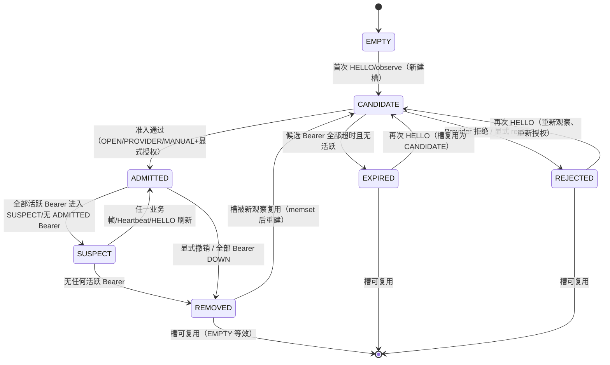
```mermaid
stateDiagram-v2
    [*] --> EMPTY
    EMPTY --> CANDIDATE : 首次 HELLO/observe（新建槽）
    CANDIDATE --> ADMITTED : 准入通过（OPEN/PROVIDER/MANUAL+显式授权）
    CANDIDATE --> REJECTED : Provider 拒绝 / 显式 reject
    CANDIDATE --> EXPIRED : 候选 Bearer 全部超时且无活跃
    ADMITTED --> SUSPECT : 全部活跃 Bearer 进入 SUSPECT/无 ADMITTED Bearer
    SUSPECT --> ADMITTED : 任一业务帧/Heartbeat/HELLO 刷新
    SUSPECT --> REMOVED : 无任何活跃 Bearer
    ADMITTED --> REMOVED : 显式撤销 / 全部 Bearer DOWN
    REJECTED --> CANDIDATE : 再次 HELLO（重新观察、重新授权）
    EXPIRED --> CANDIDATE : 再次 HELLO（槽复用为 CANDIDATE）
    REMOVED --> CANDIDATE : 槽被新观察复用（memset 后重建）
    REMOVED --> [*] : 槽可复用（EMPTY 等效）
    EXPIRED --> [*] : 槽可复用
    REJECTED --> [*] : 槽可复用
```

### 转移表（关键事件 × 状态）

| 事件 \ 状态 | EMPTY | CANDIDATE | ADMITTED | SUSPECT | REJECTED/EXPIRED/REMOVED |
| --- | --- | --- | --- | --- | --- |
| HELLO（observe） | →CANDIDATE | 刷新，尝试准入 | 刷新 Bearer | 刷新 | 槽重建/回 CANDIDATE，重新授权 |
| 业务帧（touch） | 不可能（Link 未注册） | 无（Link 未注册被拒） | 刷新 last_seen，SUSPECT→ADMITTED | →ADMITTED | 无 |
| Heartbeat | 同上 | 同上 | 刷新 | 刷新 | 无 |
| Provider 拒绝 | — | →REJECTED | 清 Bearer | — | 保持 |
| Bearer 全 DOWN（step） | — | 候选超时→EXPIRED | →REMOVED | →REMOVED | — |

### 伪代码

```
observe_neighbor(node, link, now):
    expire_neighbor_candidates(node, now)          // 先回收超时候选
    entry = find_neighbor(link.peer_node_id)
    if entry == NULL:
        entry = allocate_neighbor_slot()           // 复用 EMPTY/REMOVED/REJECTED/EXPIRED 槽
        if entry == NULL: return UCN_ERR_NO_SPACE  // 表满显式拒绝
        新建 entry: state=CANDIDATE, bearer[0]=CANDIDATE(link)
    else:                                          // 已存在：刷新/重建 Bearer
        bearer = find_bearer(entry, link)
        if bearer 活跃: bearer→ADMITTED; entry→ADMITTED; select_primary; return
        if bearer==CANDIDATE 且 entry∈{REJECTED,EXPIRED,REMOVED}: entry→CANDIDATE
        elif bearer==NULL: 分配新 CANDIDATE bearer（entry∈{ADMITTED,SUSPECT,CANDIDATE}）
        elif entry∈{REJECTED,EXPIRED,REMOVED} 无 bearer 槽: 重建 entry→CANDIDATE
    // 准入策略（顺序：MANUAL 直接等产品显式授权）
    if join_policy == MANUAL: return OK             // 只观察，不准入
    if join_policy == PROVIDER:
        if !neighbor_authorize(...): entry→REJECTED（或清 Bearer）; return 拒绝
    return admit_neighbor_entry(node, entry)        // 把 CANDIDATE Bearer→ADMITTED

maintain_neighbor_liveness(node, now):             // step 每轮
    for entry ∈ {ADMITTED, SUSPECT}:
        for bearer 活跃:
            if !link_is_usable: bearer→DOWN（主 Bearer 摘除）
            if ADMITTED 且 now-last_seen ≥ Suspect 门限: bearer→SUSPECT
            if SUSPECT 且 now-last_seen ≥ Remove 门限: bearer→DOWN
        refresh_neighbor_liveness_state(entry):
            if 有 ADMITTED bearer: entry→ADMITTED; select_primary
            elif 有活跃 bearer:   entry→SUSPECT（记录 suspect_since）; select_primary
            else: remove_neighbor_entry(entry)      // →REMOVED：撤销 Path/路由/注册/预算
```

---

## 2. SM-02 邻居 Bearer（含主备切换与质量探测）

### 状态图

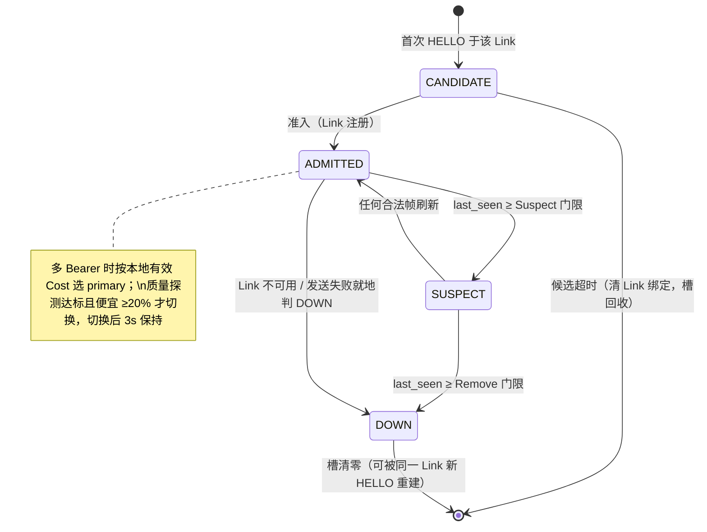
```mermaid
stateDiagram-v2
    [*] --> CANDIDATE : 首次 HELLO 于该 Link
    CANDIDATE --> ADMITTED : 准入（Link 注册）
    CANDIDATE --> [*] : 候选超时（清 Link 绑定，槽回收）
    ADMITTED --> SUSPECT : last_seen ≥ Suspect 门限
    SUSPECT --> ADMITTED : 任何合法帧刷新
    SUSPECT --> DOWN : last_seen ≥ Remove 门限
    ADMITTED --> DOWN : Link 不可用 / 发送失败就地判 DOWN
    DOWN --> [*] : 槽清零（可被同一 Link 新 HELLO 重建）
    note right of ADMITTED : 多 Bearer 时按本地有效 Cost 选 primary；\n质量探测达标且便宜 ≥20% 才切换，切换后 3s 保持
```

### 伪代码

```
select_neighbor_bearer(node, entry):
    if 当前 primary 是 ADMITTED 且 Cost 可用: 保持（重映射 egress）; return
    候选 = 所有 ADMITTED Bearer 中 Cost 最低（同分取 link_id 小者）
    if 无: 候选 = 任一 SUSPECT Bearer（保证单 Bearer 宽限窗口内有路可走）
    if 候选: primary = 候选; remap_neighbor_egress_references(...)   // 路由表 egress 重指
    else: primary = NONE

evaluate_bearer_quality(node, now):                    // step 每轮
    for entry:
        for 非 primary 的 ADMITTED bearer:
            按周期发 Heartbeat 质量探测（带 probe_id）
            ACK 计数达标 且 Cost 比 primary 低 ≥ UCN_BEARER_SWITCH_IMPROVEMENT_PERCENT:
                switch_neighbor_primary(entry, bearer)   // 切换 + 3s 保持 + 探测复位
```

> 主备语义：**切换只在同一邻居的 Bearer 集合内进行**，不改变端到端路由；
> 端到端换路（跨路径）由 SM-05 Candidate + Path Probe/Activate 负责，两者互不越界。

---

## 3. SM-03 路由发现槽（Discovery Slot）

### 状态图

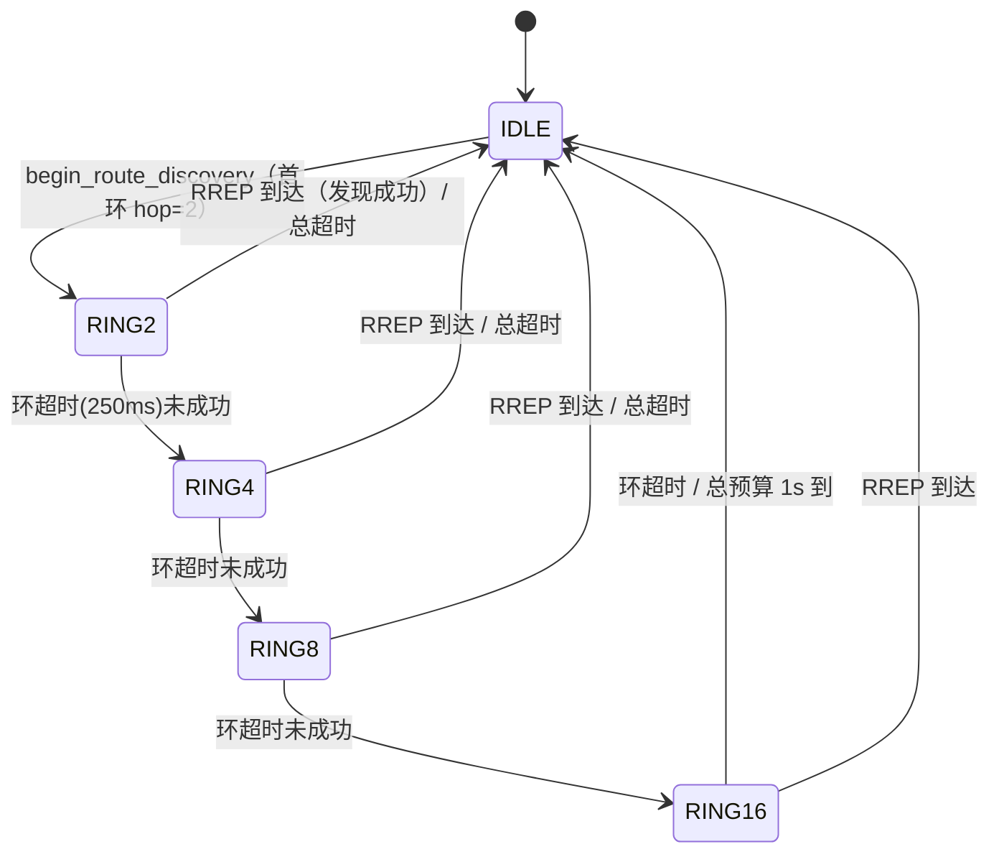
```mermaid
stateDiagram-v2
    [*] --> IDLE
    IDLE --> RING2 : begin_route_discovery（首环 hop=2）
    RING2 --> RING4 : 环超时(250ms)未成功
    RING4 --> RING8 : 环超时未成功
    RING8 --> RING16 : 环超时未成功
    RING16 --> IDLE : 环超时 / 总预算 1s 到
    RING2 --> IDLE : RREP 到达（发现成功）/ 总超时
    RING4 --> IDLE : RREP 到达 / 总超时
    RING8 --> IDLE : RREP 到达 / 总超时
    RING16 --> IDLE : RREP 到达
```

### 伪代码

```
begin_route_discovery(node, dst, now, is_candidate, max_hop, ...):
    if 同 dst 活跃槽存在 且 !restart_active: 复用（更新约束/候选属性）
    if 槽满(UCN_MAX_ROUTE_DISCOVERIES=4): return UCN_ERR_NO_SPACE
    slot.active=true; slot.destination=dst; slot.request_id=next_id++
    slot.overall_started_at=now; slot.current_hop_limit=2; slot.maximum_hop_limit=max_hop
    send_route_discovery_ring(slot, hop=2)      // 发首环（构造 RREQ，广播）

send_route_discovery_ring(slot, hop):
    if !take_control_token(node): return UCN_ERR_NO_SPACE   // 本机控制预算
    slot.request_id = 新 ID（每环新 ID → 新 Epoch）
    slot.deadline = now + 250ms
    构造 RREQ（dst=广播、payload={target,request_id,cost=0,hop=0,flags}）
    先把自己 flood 记入 RREQ Cache（防多 Bearer 回灌学成自路由）
    forward_route_request(NULL)                // 向所有注册 Link 泛洪

// step 维护段：
send_due_route_discovery_ring(node, now):
    for slot 活跃:
        if 环 deadline 到 且 current < maximum: 扩圈发下一环; return
// step 过期段：
expire_dynamic_state(node, now):
    for slot 活跃:
        if now-overall_started ≥ 1s 或 (环超时 且 已是最大环): slot.active=false
```

---

## 4. SM-04 路由条目（Route Entry，含 Epoch）

### 状态图

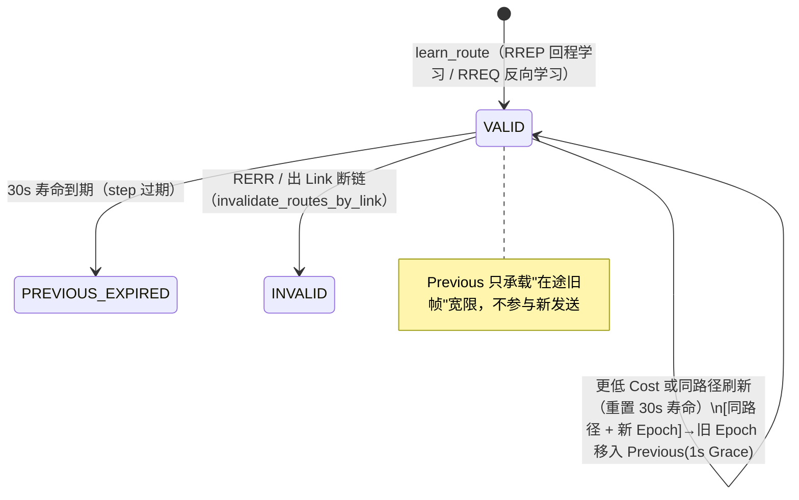
```mermaid
stateDiagram-v2
    [*] --> VALID : learn_route（RREP 回程学习 / RREQ 反向学习）
    VALID --> VALID : 更低 Cost 或同路径刷新（重置 30s 寿命）\n[同路径 + 新 Epoch]→旧 Epoch 移入 Previous(1s Grace)
    VALID --> PREVIOUS_EXPIRED : 30s 寿命到期（step 过期）
    VALID --> INVALID : RERR / 出 Link 断链（invalidate_routes_by_link）
    note right of VALID : Previous 只承载"在途旧帧"宽限，不参与新发送
```

### 伪代码

```
learn_route(node, dst, egress, cost, hop, epoch):
    if hop==0 或 hop>default_hop_limit: return UCN_ERR_TTL
    if dst 非法 或 epoch==0 或 egress 未注册: return UCN_ERR_ARGUMENT
    route = find(dst)
    if route 存在 且 非静态:
        if cost 更低 或 (同 cost 同 hop 同 egress 的同路径刷新):
            if 同路径刷新 且 epoch 变化:
                previous = {旧 egress, 旧 epoch, 1s Grace}   // 扩圈新 Epoch 保护在途帧
            更新 egress/cost/hop/epoch; 更低 cost 时清 verified_rtt
        route.expires_at = now + 30s
    else if 有空槽: 新建（epoch/egress/cost/hop，verified_rtt 无效）
    else: return UCN_ERR_NO_SPACE        // 表满显式拒绝

start_due_route_refresh(node, now):      // step：到期前 6s 且距上次刷新 ≥5s → begin_route_discovery(restart)
route_epoch_is_accepted(node, src, frame):
    route = find_active_route(src)
    return frame.epoch == route.epoch ||
           (frame.epoch == route.previous_epoch 且 在 1s Grace 内)
```

---

## 5. SM-05 候选路由（Candidate）

### 状态图

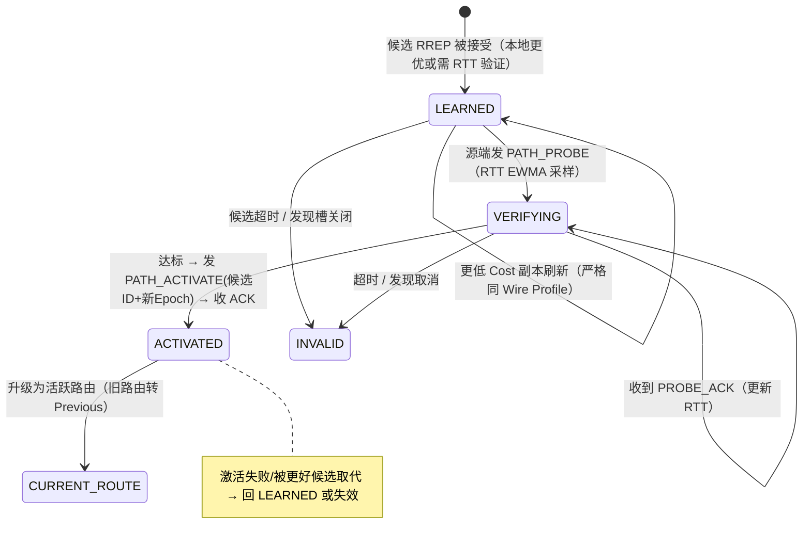
```mermaid
stateDiagram-v2
    [*] --> LEARNED : 候选 RREP 被接受（本地更优或需 RTT 验证）
    LEARNED --> LEARNED : 更低 Cost 副本刷新（严格同 Wire Profile）
    LEARNED --> VERIFYING : 源端发 PATH_PROBE（RTT EWMA 采样）
    VERIFYING --> VERIFYING : 收到 PROBE_ACK（更新 RTT）
    VERIFYING --> ACTIVATED : 达标 → 发 PATH_ACTIVATE(候选ID+新Epoch) → 收 ACK
    LEARNED --> INVALID : 候选超时 / 发现槽关闭
    VERIFYING --> INVALID : 超时 / 发现取消
    ACTIVATED --> CURRENT_ROUTE : 升级为活跃路由（旧路由转 Previous）
    note right of ACTIVATED : 激活失败/被更好候选取代 → 回 LEARNED 或失效
```

### 伪代码

```
learn_candidate_route(node, dst, candidate_id, egress, cost, hop, profile, originated):
    slot = find(dst, candidate_id)
    if slot: 校验 Wire Profile 一致；更低 cost 才更新 egress/hop；刷新超时
    else: 有空槽则新建（候选超时 = UCN_ROUTE_CANDIDATE_TIMEOUT_MS）
    无槽 → UCN_ERR_NO_SPACE

handle_path_probe(node, frame):        // 目标侧：回 ACK
    if dst==自己 且 合法: 回 PATH_PROBE_ACK
handle_path_probe_ack(node, frame):    // 源端：EWMA RTT
    更新候选 verified_rtt; 达标后进入可激活状态
handle_path_activate(node, frame):     // 沿途/目标：绑定候选→路由 Epoch 迁移
handle_path_activate_ack(node, frame): // 源端：activate_candidate_route → 活跃路由
```

---

## 6. SM-06 TX 队列项（Q0/Q1 生命周期）

### 状态图

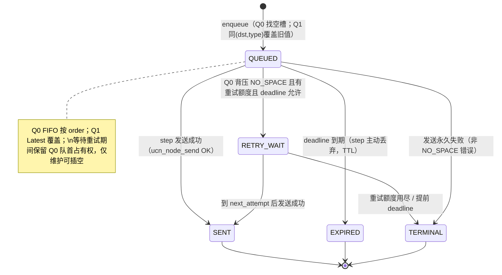
```mermaid
stateDiagram-v2
    [*] --> QUEUED : enqueue（Q0 找空槽；Q1 同(dst,type)覆盖旧值）
    QUEUED --> SENT : step 发送成功（ucn_node_send OK）
    QUEUED --> RETRY_WAIT : Q0 背压 NO_SPACE 且有重试额度且 deadline 允许
    RETRY_WAIT --> SENT : 到 next_attempt 后发送成功
    RETRY_WAIT --> TERMINAL : 重试额度用尽 / 提前 deadline
    QUEUED --> EXPIRED : deadline 到期（step 主动丢弃，TTL）
    QUEUED --> TERMINAL : 发送永久失败（非 NO_SPACE 错误）
    SENT --> [*]
    EXPIRED --> [*]
    TERMINAL --> [*]
    note right of QUEUED : Q0 FIFO 按 order；Q1 Latest 覆盖；\n等待重试期间保留 Q0 队首占有权，仅维护可插空
```

### 伪代码

```
ucn_node_enqueue(node, request):
    校验 class∈{Q0,Q1}、非控制帧、delivery 合法
    if Q1 && delivery==LATEST_VALUE: slot = 同(dst,message_type) 已占槽（覆盖）
    else: slot = 第一个空槽（无则 UCN_ERR_NO_SPACE）
    写入 payload/deadline/order; retries=0; occupied=true

// step 内的发送节拍（见 SM-17）：
item = find_next_item(q0) 或（q0 空）find_next_item(q1)   // order 最小者
if deadline 过期: 丢弃; return UCN_ERR_TTL
if RETRY_ON_BACKPRESSURE 且 未到 next_attempt: 只做必要维护; return
result = ucn_node_send(item...)
if OK: 释放槽
if NO_SPACE 且 可重试型 Q0: retries<上限 且 deadline 允许 → next_attempt=now+5ms; return
else: 终态失败释放
```

---

## 7. SM-07 Pending Q1（路由等待队列）

### 状态图

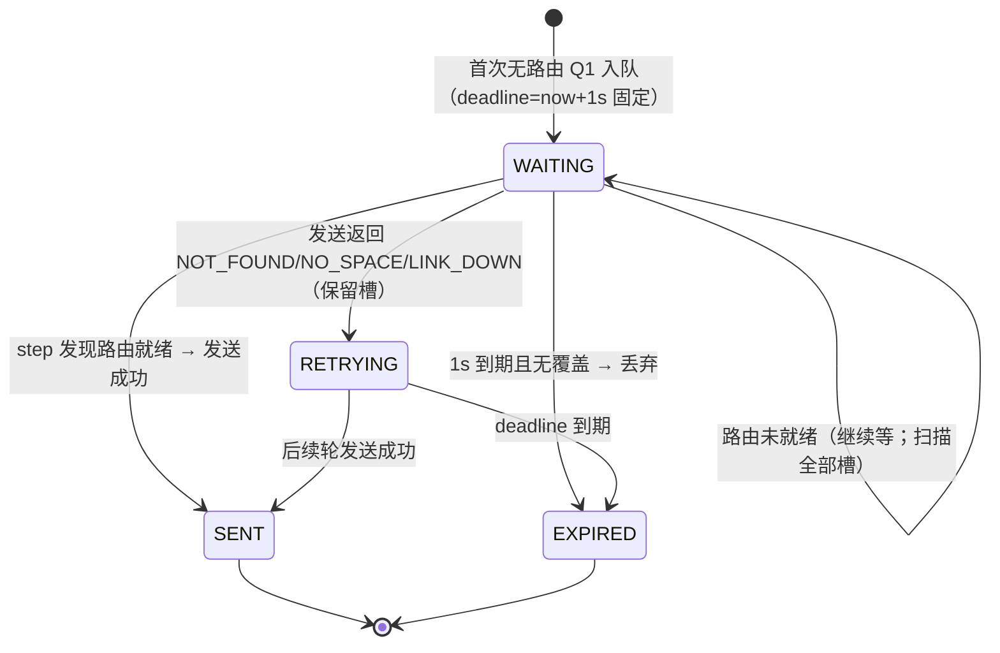
```mermaid
stateDiagram-v2
    [*] --> WAITING : 首次无路由 Q1 入队（deadline=now+1s 固定）
    WAITING --> WAITING : 同(dst,endpoint)新值覆盖（deadline 刷新）
    WAITING --> SENT : step 发现路由就绪 → 发送成功
    WAITING --> WAITING : 路由未就绪（继续等；扫描全部槽）
    WAITING --> RETRYING : 发送返回 NOT_FOUND/NO_SPACE/LINK_DOWN（保留槽）
    WAITING --> EXPIRED : 1s 到期且无覆盖 → 丢弃
    RETRYING --> SENT : 后续轮发送成功
    RETRYING --> EXPIRED : deadline 到期
    SENT --> [*]
    EXPIRED --> [*]
```

### 伪代码

```
queue_pending_q1(node, dst, type, payload):
    slot = 同(dst,type) 已占槽（覆盖，overwrite 计数）或第一个空槽
    无槽 → UCN_ERR_NO_SPACE
    slot.deadline = now + UCN_PENDING_Q1_TIMEOUT_MS(1s)   // 固定超时，非业务 deadline

send_pending_q1_if_ready(node, now):      // step：Q0/Q1 空时检查
    for slot 占位:
        if deadline 过期: 丢弃; return UCN_ERR_TTL
        if find_link(dst) != NULL:         // 路由就绪
            result = 发送（Endpoint 路径或普通发送）
            if OK: 释放; return OK
            if 可重试类错误: return result   // 保留下轮再试
            else: 释放; return result        // 永久失败
    return UCN_ERR_NOT_FOUND
```

---

## 8. SM-08 去重窗口（Duplicate Window）

### 状态图

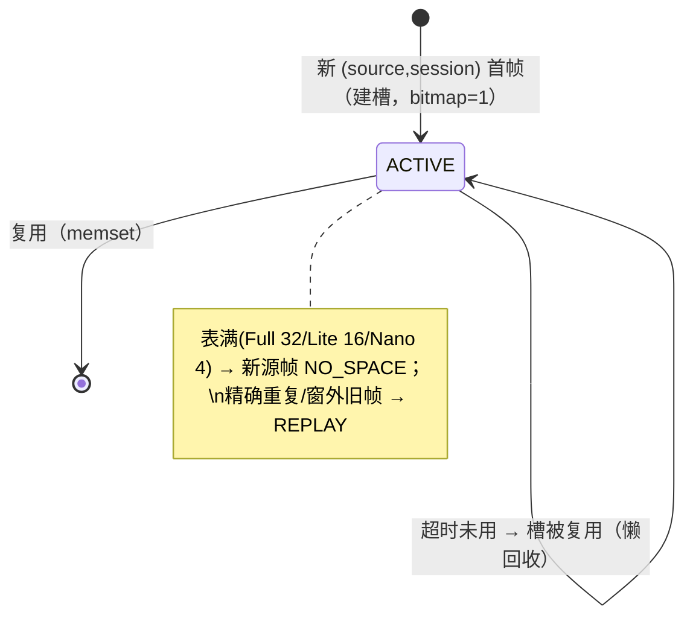
```mermaid
stateDiagram-v2
    [*] --> ACTIVE : 新 (source,session) 首帧（建槽，bitmap=1）
    ACTIVE --> ACTIVE : seq 前进（bitmap 滑动）/ 乱序新 bit
    ACTIVE --> ACTIVE : 超时未用 → 槽被复用（懒回收）
    ACTIVE --> [*] : 复用（memset）
    note right of ACTIVE : 表满(Full 32/Lite 16/Nano 4) → 新源帧 NO_SPACE；\n精确重复/窗外旧帧 → REPLAY
```

### 伪代码

```
duplicate_accept_frame(node, frame):
    slot = find(source, session_id)
    if slot:
        delta = seq - slot.highest
        if delta > 0:  bitmap = (delta≥位宽)?1:(bitmap<<delta)|1; highest=seq; 刷新时间; return OK
        if delta == 0: return UCN_ERR_REPLAY
        age = -delta
        if age ≥ 位宽 或 bit 已置: return UCN_ERR_REPLAY
        置 bit[age]; return OK
    else:
        空闲槽（含超时未用）→ 新建; return OK
        无 → UCN_ERR_NO_SPACE      // 显式，不静默
```

---

## 9. SM-09 RREQ Cache

### 状态图

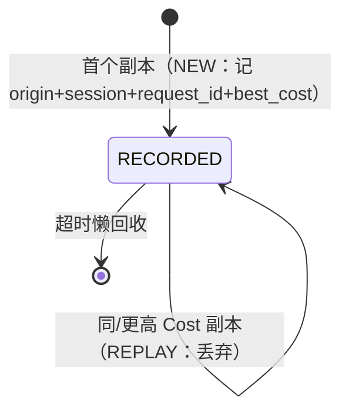
```mermaid
stateDiagram-v2
    [*] --> RECORDED : 首个副本（NEW：记 origin+session+request_id+best_cost）
    RECORDED --> RECORDED : 更低 Cost 副本（BETTER：更新 best，重新处理）
    RECORDED --> RECORDED : 同/更高 Cost 副本（REPLAY：丢弃）
    RECORDED --> [*] : 超时懒回收
```

### 伪代码

```
classify_route_request(node, frame, cost):
    slot = find(origin, session, request_id)
    if slot: return cost < best ? BETTER : REPLAY
    可复用槽（无效或超时）→ NEW；无 → FULL
commit_route_request(...): 写入/更新 best_cost、last_observed
// 语义：同一 RREQ 只沿"更优路径"重复传播一次；源端发环前先自记防回灌
```

---

## 10. SM-10 控制令牌桶（三类）

### 结构

| 桶 | 容量 | 补充 | 作用 |
| --- | --- | --- | --- |
| 本机控制 `control_tokens` | 4 | 1/100ms | 本节点发起 RREQ/诊断的总预算 |
| 每 Peer RX（`control_rx_peer_budgets`，按邻居表容量） | RREQ 5 / Heartbeat 4 / Trace 1 | RREQ 1/200ms、Heartbeat 1/100ms、Trace 1/1s | 防单个故障 Peer 刷爆本节点 |
| Path 管理源（`path_control_source_budgets`，固定深度） | 每操作 4 | 1/1000ms | PATH_INSTALL/REVOKE 按认证 (source,session) 限速 |

### 伪代码

```
take_control_token(node):                    // 桶 1
    refill(elapsed/100ms 个，封顶 burst)
    if tokens==0: return false
    tokens--; return true

take_control_rx_token(node, link, type):     // 桶 2（RREQ/Heartbeat 请求/Trace 请求）
    budget = find_control_rx_peer_budget(peer_node_id)
    refill 该类型; tokens==0 → 拒绝（计数）; tokens--
    // 邻居被 REMOVED 时 release_control_rx_peer_budget 回收

take_path_control_source_token(node, frame, op):   // 桶 3
    budget = find_path_control_source_budget(source, session_id)
    // 同 source 新 session → 复用槽（密钥轮换不泄漏槽位）
    // 空闲源超时懒回收；无槽 → SOURCE_FULL（NO_SPACE）
    refill(1/1000ms); 无 token → RATE_LIMITED; tokens--
```

---

## 11. SM-11 Path 转发条目

### 状态图

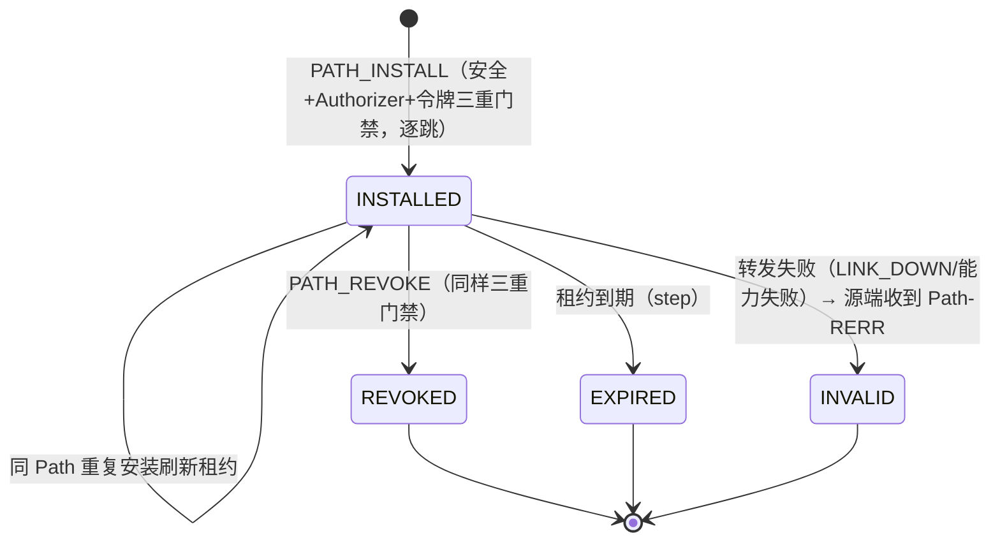
```mermaid
stateDiagram-v2
    [*] --> INSTALLED : PATH_INSTALL（安全+Authorizer+令牌三重门禁，逐跳）
    INSTALLED --> INSTALLED : 同 Path 重复安装刷新租约
    INSTALLED --> REVOKED : PATH_REVOKE（同样三重门禁）
    INSTALLED --> EXPIRED : 租约到期（step）
    INSTALLED --> INVALID : 转发失败（LINK_DOWN/能力失败）→ 源端收到 Path-RERR
    REVOKED --> [*]
    EXPIRED --> [*]
    INVALID --> [*]
```

### 伪代码

```
handle_path_install(node, ingress, frame):      // dst 必须是自己
    校验 Schema（基础 8/11/14/17B 或能力 11/14/17/20B；REVOKE 2/4/6/8B）
    校验 path_id/dst/next_hop/remaining_hops/lease 语义
    if !authorize_path_control(...): 计数拒绝; return UCN_ERR_ACCESS   // 产品 Authorizer
    budget = take_path_control_source_token(INSTALL)
    if budget==SOURCE_FULL/RATE_LIMITED: return UCN_ERR_NO_SPACE
    install_path_forward_entry(...)            // 写 {owner, session, path_id, dst,
                                               //      next_hop, remaining_hops, lease}
    表满 → UCN_ERR_NO_SPACE（计数）

// 转发路径一致性（receive 内）：
if 非控制帧 && has_path_id:
    path = find_active_path(source, session, path_id, dst)
    if !path 或 terminal/remaining 与 hop_limit 不一致:
        send_path_route_error(...); return UCN_ERR_NOT_FOUND
// 发送失败处理：
if LINK_DOWN 或 能力失败: revoke_path_and_mark_local_policy(...); send Path-RERR
```

---

## 12. SM-12 Transfer TX Slot

### 状态图

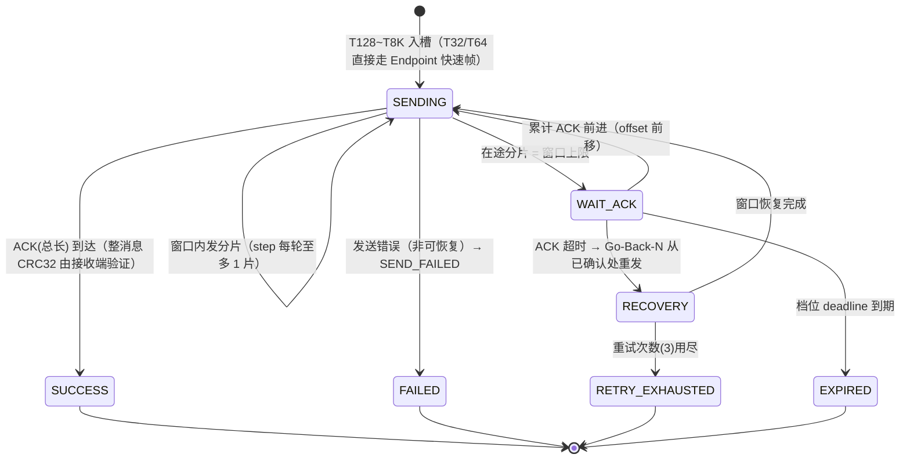
```mermaid
stateDiagram-v2
    [*] --> SENDING : T128~T8K 入槽（T32/T64 直接走 Endpoint 快速帧）
    SENDING --> SENDING : 窗口内发分片（step 每轮至多 1 片）
    SENDING --> WAIT_ACK : 在途分片 = 窗口上限
    WAIT_ACK --> SENDING : 累计 ACK 前进（offset 前移）
    WAIT_ACK --> RECOVERY : ACK 超时 → Go-Back-N 从已确认处重发
    RECOVERY --> SENDING : 窗口恢复完成
    RECOVERY --> RETRY_EXHAUSTED : 重试次数(3)用尽
    SENDING --> SUCCESS : ACK(总长) 到达（整消息 CRC32 由接收端验证）
    SENDING --> FAILED : 发送错误（非可恢复）→ SEND_FAILED
    WAIT_ACK --> EXPIRED : 档位 deadline 到期
    SUCCESS --> [*]
    FAILED --> [*]
    RETRY_EXHAUSTED --> [*]
    EXPIRED --> [*]
```

### 伪代码

```
ucn_transfer_send(transfer, dst, endpoint, class, data, len):
    if class ≤ T64: return ucn_node_send_endpoint(Q1)   // 快速帧，无端到端确认
    if 该 Peer 活跃槽 ≥ Peer 最大并发: return UCN_ERR_NO_SPACE
    slot = 空槽: {dst, endpoint, class, transfer_id, data, total_length,
                  window=min(本机,Peer 能力,默认1), crc32, deadline=now+档位期限}
    // 数据在调用者处，Slot 只存指针与状态——不在 Slot 里复制 8KiB

ucn_transfer_step(transfer):                  // step 每轮调用
    expire_transfer_state()                   // 超时 TX/RX 回收
    slot = 轮转选择第一个活跃槽
    if resend_active: 发重发片; return
    if awaiting_ack 且 ack 超时:
        if !begin_window_recovery(slot): return NOT_FOUND   // 重试耗尽 → RETRY_EXHAUSTED
        发重发片（从 acknowledged_offset）
    elif 在途分片数 < window 且 未发完: 发新分片
    else: return NOT_FOUND                     // 本轮无事
    // 每轮至多 1 片：天然限速，不挤占 Core Q0/Q1

handle_ack(transfer, frame):
    decode {transfer_id, endpoint, acked_length, code}
    if OK: acknowledged_offset = max(现值, acked_length)
           若 = total_length → complete(SUCCESS)
    else: complete(对应终态失败)
```

---

## 13. SM-13 Transfer RX Slot

### 状态图

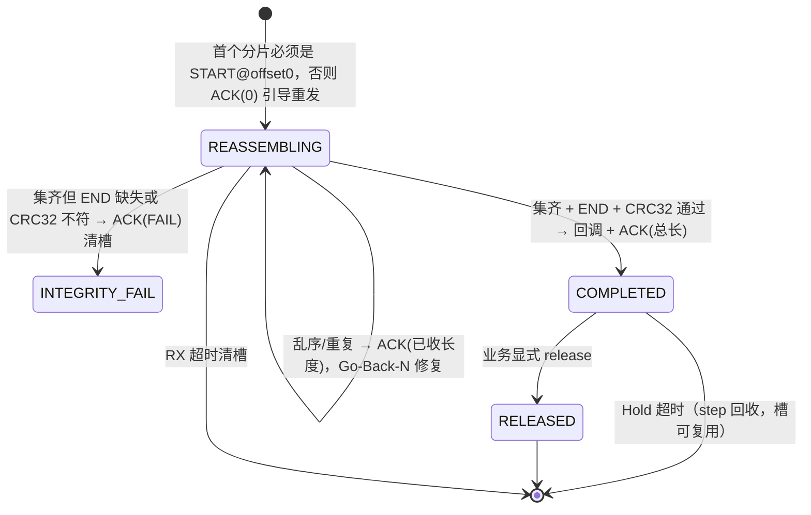
```mermaid
stateDiagram-v2
    [*] --> REASSEMBLING : 首个分片必须是 START@offset0，否则 ACK(0) 引导重发
    REASSEMBLING --> REASSEMBLING : 顺序分片追加，回累计 ACK
    REASSEMBLING --> REASSEMBLING : 乱序/重复 → ACK(已收长度)，Go-Back-N 修复
    REASSEMBLING --> INTEGRITY_FAIL : 集齐但 END 缺失或 CRC32 不符 → ACK(FAIL) 清槽
    REASSEMBLING --> COMPLETED : 集齐 + END + CRC32 通过 → 回调 + ACK(总长)
    COMPLETED --> RELEASED : 业务显式 release
    COMPLETED --> [*] : Hold 超时（step 回收，槽可复用）
    RELEASED --> [*]
    REASSEMBLING --> [*] : RX 超时清槽
```

### 伪代码

```
handle_fragment(transfer, frame):
    decode; binding 校验（class 上限/总长/E2E 要求）失败 → ACK(REJECTED)
    if 近期已完成表命中: ACK(总长); return          // 迟到重复分片
    slot = find_rx_slot
    if !slot:
        if !(START 且 offset==0): ACK(0); return    // 丢 START：让对端 Go-Back-N
        slot = allocate 或 ACK(NO_SLOT)             // 固定 RX 槽满显式拒
    元数据不一致 → ACK(BAD_FORMAT)
    offset != received → ACK(received_length); return
    追加数据; received += len; 刷新 RX deadline
    未集齐 → ACK(received_length)
    END 缺失 或 crc32 不符 → ACK(INTEGRITY_FAIL); 清槽
    完成 → remember_completion; ACK(total); handler(rx_handle)

ucn_transfer_release_received(transfer, handle):   // 业务释放，槽回池
```

---

## 14. SM-14 安全会话与序号

### 状态图

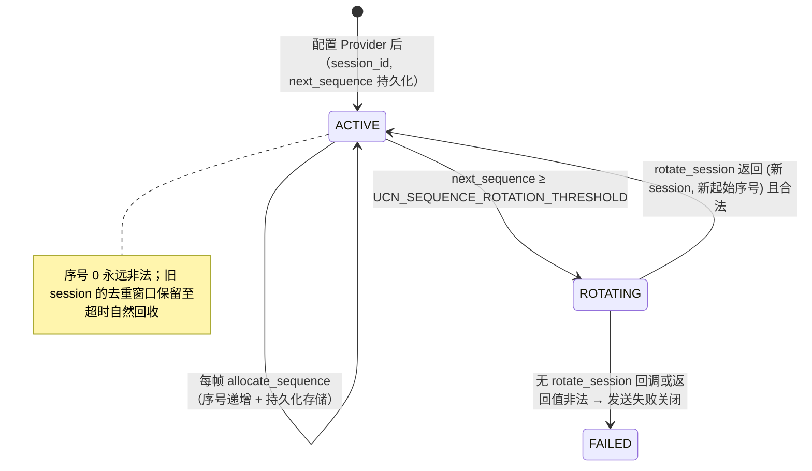
```mermaid
stateDiagram-v2
    [*] --> ACTIVE : 配置 Provider 后（session_id, next_sequence 持久化）
    ACTIVE --> ACTIVE : 每帧 allocate_sequence（序号递增 + 持久化存储）
    ACTIVE --> ROTATING : next_sequence ≥ UCN_SEQUENCE_ROTATION_THRESHOLD
    ROTATING --> ACTIVE : rotate_session 返回 (新 session, 新起始序号) 且合法
    ROTATING --> FAILED : 无 rotate_session 回调或返回值非法 → 发送失败关闭
    note right of ACTIVE : 序号 0 永远非法；旧 session 的去重窗口保留至超时自然回收
```

### 伪代码

```
allocate_sequence(node):
    if next_sequence == 0: return UCN_ERR_SECURITY
    if next_sequence ≥ 轮换阈值:
        if !security_ops.rotate_session: return UCN_ERR_SECURITY
        (new_sid, new_seq) = rotate_session(ctx, old_sid)
        非法（0/相同/超档位范围/未回退）→ UCN_ERR_SECURITY
        session_id = new_sid; next_sequence = new_seq; 统计++
    seq = next_sequence++
    if security_ops: store_next_sequence(next)     // 持久化，掉电不回绕
```

---

## 15. SM-15 Service Bridge Q0 Pending 与命令防重放

### 状态图

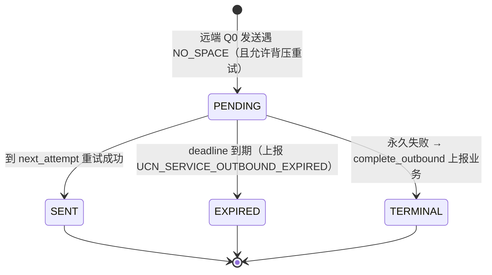
```mermaid
stateDiagram-v2
    [*] --> PENDING : 远端 Q0 发送遇 NO_SPACE（且允许背压重试）
    PENDING --> SENT : 到 next_attempt 重试成功
    PENDING --> EXPIRED : deadline 到期（上报 UCN_SERVICE_OUTBOUND_EXPIRED）
    PENDING --> TERMINAL : 永久失败 → complete_outbound 上报业务
    SENT --> [*]
    EXPIRED --> [*]
    TERMINAL --> [*]
```

### 伪代码

```
ucn_service_protocol_bridge_step_at(bridge, now, max_requests):
    while count < max_requests:
        if q0_pending.occupied:                 // 重试项优先
            deadline 过期 → EXPIRED 上报; continue
            未到 next_attempt → break
        else: message = remote_tx_take(router); 无消息 → break
        result = ucn_node_send_endpoint(...)
        if NO_SPACE 且 Q0 且允许重试: 存入固定 pending 槽（retries/next_attempt）
        else: complete_outbound(结果)            // 业务收到终态

// 入站（bridge_endpoint_rx）：
    高风险远端 Q0: 未注册 Validator → 安装失败关闭；Validator 拒绝 → 丢弃
    可选防重放: replay_accept_command（固定槽表）→ 重复 → 拒绝
    通过 → ucn_service_deliver_remote（任务 Inbox）
```

---

## 16. SM-16 Cluster 角色（单层首阶段）

### 状态图

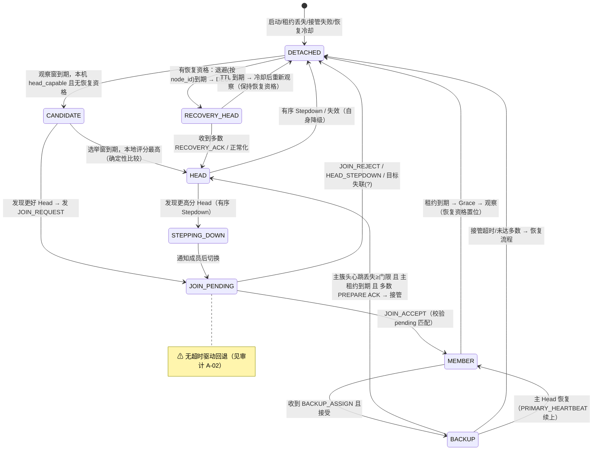
```mermaid
stateDiagram-v2
    [*] --> DETACHED : 启动/租约丢失/接管失败/恢复冷却
    DETACHED --> CANDIDATE : 观察窗到期，本机 head_capable 且无恢复资格
    DETACHED --> RECOVERY_HEAD : 有恢复资格：退避(按 node_id)到期 → DECLARE
    CANDIDATE --> HEAD : 选举窗到期，本地评分最高（确定性比较）
    CANDIDATE --> JOIN_PENDING : 发现更好 Head → 发 JOIN_REQUEST
    JOIN_PENDING --> MEMBER : JOIN_ACCEPT（校验 pending 匹配）
    JOIN_PENDING --> DETACHED : JOIN_REJECT / HEAD_STEPDOWN / 目标失联(?)
    MEMBER --> BACKUP : 收到 BACKUP_ASSIGN 且接受
    MEMBER --> DETACHED : 租约到期 → Grace → 观察（恢复资格置位）
    BACKUP --> HEAD : 主簇头心跳丢失≥门限 且 主租约到期 且 多数 PREPARE ACK → 接管
    BACKUP --> DETACHED : 接管超时/未达多数 → 恢复流程
    BACKUP --> MEMBER : 主 Head 恢复（PRIMARY_HEARTBEAT 续上）
    HEAD --> STEPPING_DOWN : 发现更高分 Head（有序 Stepdown）
    STEPPING_DOWN --> JOIN_PENDING : 通知成员后切换
    HEAD --> DETACHED : 有序 Stepdown / 失效（自身降级）
    RECOVERY_HEAD --> HEAD : 收到多数 RECOVERY_ACK / 正常化
    RECOVERY_HEAD --> DETACHED : TTL 到期 → 冷却后重新观察（保持恢复资格）
    note right of JOIN_PENDING : ⚠ 无超时驱动回退（见审计 A-02）
```

### 伪代码

```
// 消息处理（ucn_cluster_receive 分发）：
ADVERTISE/HEAD_DECLARE → observe_candidate → consider_head_offer
JOIN_REQUEST  → [HEAD] 容量检查 → ACCEPT(租约) / REJECT
JOIN_ACCEPT   → [JOIN_PENDING/BACKUP] 校验 → MEMBER（租约开始）
JOIN_REJECT   → [JOIN_PENDING] → DETACHED(观察)
KEEPALIVE     → [HEAD] 续租成员
LEAVE         → [HEAD] 移除成员（Backup 是它则重选）
HEAD_STEPDOWN → [MEMBER/JOIN_PENDING] → DETACHED
BACKUP_ASSIGN → 接受/拒绝备份角色（覆盖成员集快照同步）
PRIMARY_HEARTBEAT → [BACKUP] 重置丢失计数
TAKEOVER_PREPARE → [MEMBER] 校验发起者 → ACK
TAKEOVER_ACK → [BACKUP] 计数（多数 → ANNOUNCE）
HEAD_TAKEOVER → [MEMBER] 切换归属到 Backup
RECOVERY_DECLARE → [无主 MEMBER/BACKUP/DETACHED] ACK（同 nonce 幂等）
RECOVERY_ACK → [RECOVERY_HEAD] 计数（信息性，不 gate）

// step 调度（每个角色只做自己的到期动作）：
HEAD:     成员过期回收 → 广告 → 备份分配/心跳/快照 → 快照有界重发
BACKUP:   主心跳丢失计数 → 达门限且主租约到期 → start_takeover
          接管窗口未达多数 → 放弃 → 恢复流程
MEMBER:   租约到期 → Grace → DETACHED(recovery_eligible=true)
DETACHED: 观察窗到期 → 有恢复资格走退避/declare，否则 start_election
CANDIDATE: 选举窗到期 → complete_election（最高分者成为 HEAD）
RECOVERY_HEAD: TTL 到期 → stepdown → 冷却
STEPPING_DOWN: deadline 到期 → 清成员 → JOIN_PENDING
JOIN_PENDING: 重试间隔到期 → send_join_request（⚠ 无放弃路径，见 A-02）
```

---

## 17. SM-17 全局调度 step（把前面所有"时间驱动"串起来）

### 调度图

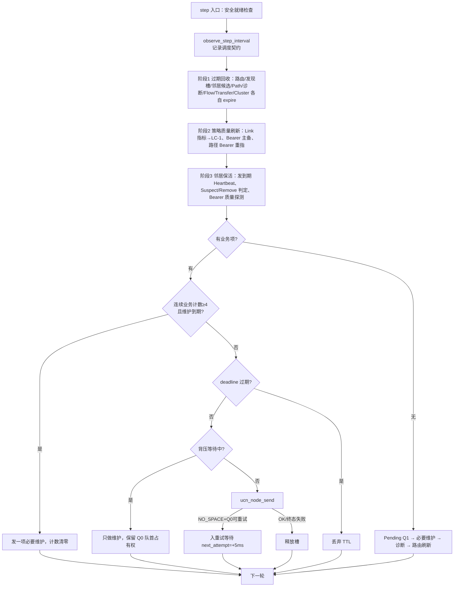
```mermaid
flowchart TD
    S[step 入口：安全就绪检查] --> T[observe_step_interval<br/>记录调度契约]
    T --> E[阶段1 过期回收：路由/发现槽/邻居候选/Path/诊断/Flow/Transfer/Cluster 各自 expire]
    E --> P[阶段2 策略质量刷新：Link 指标→LC-1、Bearer 主备、路径 Bearer 重指]
    P --> L[阶段3 邻居保活：发到期 Heartbeat、Suspect/Remove 判定、Bearer 质量探测]
    L --> Q{有业务项?}
    Q -- 有 --> B{连续业务计数≥4<br/>且维护到期?}
    B -- 是 --> M[发一项必要维护，计数清零]
    B -- 否 --> D{deadline 过期?}
    D -- 是 --> DR[丢弃 TTL]
    D -- 否 --> W{背压等待中?}
    W -- 是 --> M2[只做维护，保留 Q0 队首占有权]
    W -- 否 --> X[ucn_node_send]
    X -- NO_SPACE+Q0可重试 --> R[入重试等待 next_attempt=+5ms]
    X -- OK/终态失败 --> F[释放槽]
    Q -- 无 --> Z[Pending Q1 → 必要维护 → 诊断 → 路由刷新]
    M --> E2[下一轮]
    M2 --> E2
    R --> E2
    F --> E2
    DR --> E2
    Z --> E2
```

### 优先级铁律（调度层的"宪法"）

1. **维护公平**：业务突发 ≥4 次后强制让位一次到期维护（防保活饿死）；
2. **Q0 占有权**：背压等待期间低优先级业务不得插队，但必要维护可以；
3. **每轮一件事**：发送、维护、诊断都是一轮一件——吞吐 = 步频 × 轮次；
4. **诊断永远垫底**：快照/策略查询排在业务、Pending、维护、路由刷新之后。

---

## 18. 子状态机耦合总图

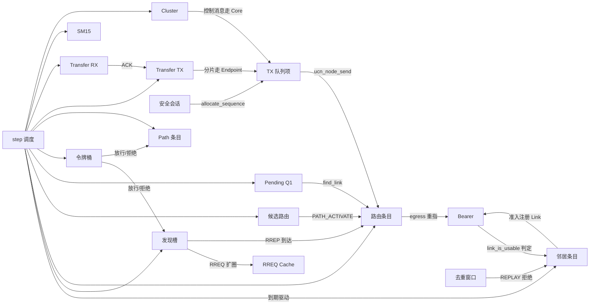
```mermaid
flowchart LR
    SM06[TX 队列项] -->|ucn_node_send| SM04[路由条目]
    SM07[Pending Q1] -->|find_link| SM04
    SM03[发现槽] -->|RREQ 扩圈| SM09[RREQ Cache]
    SM03 -->|RREP 到达| SM04
    SM05[候选路由] -->|PATH_ACTIVATE| SM04
    SM04 -->|egress 重指| SM02[Bearer]
    SM01[邻居条目] -->|准入注册 Link| SM02
    SM02 -->|link_is_usable 判定| SM01
    SM10[令牌桶] -->|放行/拒绝| SM03
    SM10 -->|放行/拒绝| SM11[Path 条目]
    SM08[去重窗口] -->|REPLAY 拒绝| SM01
    SM14[安全会话] -->|allocate_sequence| SM06
    SM12[Transfer TX] -->|分片走 Endpoint| SM06
    SM13[Transfer RX] -->|ACK| SM12
    SM16[Cluster] -->|控制消息走 Core| SM06
    SM17[step 调度] -->|到期驱动| SM01
    SM17 --> SM03
    SM17 --> SM04
    SM17 --> SM05
    SM17 --> SM07
    SM17 --> SM10
    SM17 --> SM11
    SM17 --> SM12
    SM17 --> SM13
    SM17 --> SM15
    SM17 --> SM16
```

**三类耦合介质**：
1. **固定表**（同步耦合）：RREP 到达 → SM-04 学习 → SM-07 下轮放行；
2. **消息**（异步耦合）：SM-03 发出的 RREQ 驱动对端 SM-04 学习；
3. **调度顺序**（SM-17）：阶段 1 过期 → 阶段 3 保活 → 阶段 4 发送，顺序即优先级。

---

## 19. 状态机审计

### 19.1 方法与置信度声明

- 方法：逐状态列出"事件 × 状态"覆盖，核对是否存在：**无出边的状态**（死锁）、
  **吞掉的事件**（静默忽略）、**无超时的等待态**（无限等待）、**表满后的级联**；
- 置信度：`高`=代码事实（读得到的分支）；`中`=需要运行验证的推断；`低`=纯猜测；
- 本审计未做动态注入；结论以复现实验为准。

### 19.2 覆盖核对摘要

| 状态机 | 无出边状态 | 吞掉事件 | 无超时等待 | 表满行为 |
| --- | --- | --- | --- | --- |
| SM-01 邻居 | 无（REMOVED/EXPIRED/REJECTED 均可复用） | 无（都显式） | 无 | NO_SPACE 显式 |
| SM-02 Bearer | 无 | 无 | 无 | 槽固定 |
| SM-03 发现槽 | 无 | 无 | 总预算 1s 强制关 | NO_SPACE |
| SM-04 路由 | 无 | 无 | 30s 寿命 | **NO_SPACE→RREQ 中止（A-03）** |
| SM-05 候选 | 无 | Candidate RREP 不合格静默消费（有计数） | 候选超时存在 | NO_SPACE |
| SM-06 TX 项 | 无 | 无 | deadline 必在 | NO_SPACE |
| SM-07 Pending Q1 | 无 | 无 | 固定 1s | NO_SPACE |
| SM-08 去重 | 无 | 无 | 懒回收 | NO_SPACE（B-04） |
| SM-09 RREQ Cache | 无 | 无 | 超时回收 | FULL 显式 |
| SM-10 令牌 | — | 无 | 无 | 拒绝显式 |
| SM-11 Path | 无 | 无 | 租约 | NO_SPACE |
| SM-12 Transfer TX | 无 | 无 | 档位 deadline | NO_SPACE |
| SM-13 Transfer RX | 无 | 无 | RX 超时 + Hold | NO_SLOT ACK |
| SM-14 会话 | 无 | 无 | 轮换阈值 | — |
| SM-15 Bridge | 无 | 无 | deadline | 固定槽 |
| SM-16 Cluster | **JOIN_PENDING（A-02）** | 非预期角色消息显式 ACCESS | **JOIN_PENDING 无超时** | 容量拒绝显式 |

### 19.3 A 级：静态分析发现（建议验证/修复）

**A-01 HELLO 不受 Core 侧 RX 令牌约束，且每次 HELLO 都回调 Provider 授权**
- 位置：`ucn_node_receive` HELLO 分支（只过 duplicate 窗口）、`ucn_node_observe_neighbor` 的 PROVIDER 分支；
- 现象：RREQ/Heartbeat/Trace 都有每 Peer 令牌（SM-10 桶 2），**HELLO 没有**；
  故障或恶意邻居高频 HELLO（绕过 Adapter 调度器）会反复触发 observe + `neighbor_authorize` 回调；
- 影响：邻居表 churn、Provider CPU 放大（DoS 面）；
- 缓解现状：Adapter 侧有 HELLO 调度器（间隔+抖动），但那是**产品实现责任**，Core 未强制；
- 建议：Core 侧加 per-Link HELLO 最小间隔门禁（与 Heartbeat 同风格的 RX 令牌），或在 Adapter 契约中把"HELLO 限速"列为强制项并加测试；
- 置信度：**中**（恶意构造需绕过产品 Adapter 调度器）。

**A-02 Cluster JOIN_PENDING 无超时驱动的回退路径**
- 位置：`ucn_cluster_step`（只有 `next_join_retry_ms` 到期重发 `send_join_request`；
  无"加入尝试总超时"）；`ucn_cluster_receive` 的退出仅限 JOIN_ACCEPT / JOIN_REJECT /
  HEAD_STEPDOWN（且 HEAD_STEPDOWN 要求 `source == head_node_id`，而 JOIN_PENDING 阶段
  `head_node_id` 为 0，实际上不可达）；
- 现象：pending Head 静默死亡（不再发 ADVERTISE）→ 节点无限周期重发 JOIN_REQUEST，
  不回到 DETACHED，无法进入恢复/选举（若本地本可成为 Head 则延误恢复）；
- 可恢复条件：新 Head 出现并 ADVERTISE → `consider_head_offer` 存在切换分支；
  所以不是永久卡死，而是**无界重试 + 恢复时效依赖对端出现**；
- 建议：给 JOIN_PENDING 加"加入超时→DETACHED(观察)"的 deadline 驱动转移（与 MEMBER 租约/Grace 对称）；
- 置信度：**高**（代码事实：无超时分支；影响程度中等，非安全缺陷）。

**A-03 路由表满 → 中继中止 RREQ 处理（既不学习也不转发）**
- 位置：`handle_route_request`：`learn_route` 失败直接 `return result`（`UCN_ERR_NO_SPACE`），
  不再 `forward_route_request`；
- 现象：8 条路由表满的中继（热点节点）会把途经它的所有 RREQ 挡下——源端扩圈到 16 后
  放弃（1s 总预算），**热点中继成为整片网络的可达性单点**；
- 影响：稀疏网络模型下 `UCN_MAX_ROUTES=8` 的默认值在"多源多目的地"场景容易触发；
- 说明：这是"表满必须显式拒绝"纪律的直接后果，方向正确（防无界），但代价是可达性；
- 建议：产品按角色放大 `UCN_MAX_ROUTES`；或考虑"学习失败仍转发 RREQ（不建反向路由，
  用缓存回 RREP）"的可选策略（需评估环风险）；至少把该行为写入容量文档并在规模模拟中
  覆盖"热点中继表满"场景（当前 S21 模拟未含此场景的结论）。
- 置信度：**高**（代码事实；影响评估为工程推断）。

### 19.4 B 级：契约/使用风险（踩坑面，非实现缺陷）

- **B-01 Transfer RX 交付指针生命周期**：回调拿到的是固定 RX Slot 缓冲指针；
  `completed_hold_ms` 到期后 step 清槽复用。业务必须在回调内复制数据或尽快
  `ucn_transfer_release_received`；否则槽复用造成 use-after-reuse 数据损坏。
  置信度：高（契约已写入头文件，但容易误用）。
- **B-02 step 间隔契约**：产品任务被抢占超过 Suspect 门限 → **对端**将本节点移除
  （对端看不到我们的 Heartbeat）；本端 `now_ms` 由 Owner 采样，被抢占期间时间冻结，
  到期判定滞后。必须满足 `UCN_MAX_STEP_INTERVAL_MS` 并实测 WCET/栈。
  置信度：高。
- **B-03 安全 Provider 回调频率**：`authorize_rx` 对**每条帧**调用，HELLO 路径还会
  调 `neighbor_authorize`；Provider 实现必须轻量、无阻塞、可重入，否则成为全节点
  处理瓶颈（与 A-01 同源）。置信度：高。
- **B-04 去重窗口容量**：默认 Full=32 源 / Lite=16 / Nano=4（窗口 64/32 bit）。
  活跃源数超过窗口数时，新源帧收到 `UCN_ERR_NO_SPACE`（显式但业务受损）；
  多源网络产品必须按"同时活跃的源数"配置 `UCN_DUPLICATE_SOURCE_WINDOWS`。
  置信度：高（配置事实）。
- **B-05 序号持久化写放大**：`allocate_sequence` 每帧调用 `store_next_sequence`
  （Provider 实现），若直接写 Flash 会产生磨损与时延；产品 Provider 应做
  有界批量/掉电安全优化。置信度：中。
- **B-06 Pending Q1 固定 1s 超时**：`UCN_PENDING_Q1_TIMEOUT_MS=1000` 与业务 deadline
  无关；同 (dst,endpoint) 持续覆盖会不断续命（设计意图：最新值优先），但"路由长期
  不可达"的 Q1 会在 1s 静默消失（有计数无回调）。产品若需要不可达事件，应依赖
  路由层 RERR/失联事件。置信度：高。

### 19.5 C 级：设计权衡与已知边界（文档已声明，非缺陷）

- **C-01 每轮一件事**：step 单轮只发一项（业务/维护/诊断），吞吐受步频限制；
  高吞吐需求走 Transfer 窗口 + 事件驱动即时唤醒。
- **C-02 表满即拒、无驱逐**：稀疏工作集模型的前提；与 A-03 同源，此处指邻居/
  候选/Path/发现槽的同类行为。
- **C-03 RREQ 只传播更优副本**（SM-09 BETTER 语义）：多 Bearer 场景同 request_id
  可能被转发两次（高 cost 副本先到）；每 Peer 令牌限制放大效应。
- **C-04 Q0/Q1 无端到端确认**（除 Transfer 外）：实时语义优先于可靠语义；
  关键确认走 Service Result Endpoint 或 Transfer。
- **C-05 中继不解密**：安全与性能权衡（透明密文中继）。
- **C-06 Cluster 首阶段边界**：簇间 Locator/Tunnel、多级簇、小时级长稳、功耗、
  受保护控制仍未完成；**不能宣称全闭环**（README 已声明）。
- **C-07 老化参数为默认值**：路由 30s/刷新 6s/间隔 5s、邻居 3s/4s、候选超时等
  需按介质与拓扑标定（文档要求产品冻结）。

### 19.6 结论与建议优先级

1. **立即验证**（写测试/模拟复现）：A-02（Cluster JOIN_PENDING 超时）、A-03（热点
   中继表满阻断 RREQ）——两者都有清晰的复现路径（Host 模拟器可直接构造）；
2. **产品接入前必须知晓**：B-01（Transfer 指针生命周期）、B-02（step 间隔契约）、
   B-04（去重窗口容量）；
3. **按需加固**：A-01（HELLO 限速门禁，与 Adapter 契约合并落地）；
4. **保持现状**：C 类全部属于设计意图，需在发布规格里明确为"已知边界"。

> 总评：17 个子状态机**全部有界、全部显式**，没有发现"无出边死锁"或"静默吞帧"
> 类硬缺陷；发现的两项 A 级问题均为**可用性/恢复时效**层面（且都有对端驱动的
> 自愈路径），不构成安全漏洞或环路风险。这与项目文档"协议状态机闭合，但工程
> 边界仍需实机验证"的自我评价一致。

---

## 附录：状态机 ↔ 源码对照

| SM | 核心函数（`src/node/ucn_node.c` 除注明外） |
| --- | --- |
| SM-01/02 | `ucn_node_observe_neighbor`、`admit_neighbor_entry`、`maintain_neighbor_liveness`、`refresh_neighbor_liveness_state`、`select_neighbor_bearer`、`evaluate_bearer_quality` |
| SM-03 | `begin_route_discovery`、`send_route_discovery_ring`、`send_due_route_discovery_ring` |
| SM-04 | `learn_route`、`invalidate_route_to`、`route_epoch_is_accepted`、`start_due_route_refresh` |
| SM-05 | `learn_candidate_route`、`activate_candidate_route`、`handle_path_probe(_ack)`、`handle_path_activate(_ack)` |
| SM-06/07 | `ucn_node_enqueue`、`queue_pending_q1`、`send_pending_q1_if_ready`、`ucn_node_step` |
| SM-08 | `ucn_duplicate_accept_frame`（`ucn_duplicate_internal.h`） |
| SM-09 | `classify_route_request`、`commit_route_request` |
| SM-10 | `take_control_token`、`take_control_rx_token`、`take_path_control_source_token` |
| SM-11 | `handle_path_install/revoke`、`ucn_path_install/revoke/expire`（`src/routing/ucn_path.c`） |
| SM-12/13 | `ucn_transfer_send/step`、`handle_fragment`、`handle_ack`、`ucn_transfer_release_received`（`src/extended/ucn_transfer.c`） |
| SM-14 | `allocate_sequence`、`ucn_node_set_security` |
| SM-15 | `ucn_service_protocol_bridge_step_at`、`ucn_service_bridge_replay_accept_command`（`src/service/ucn_service_bridge.c`） |
| SM-16 | `ucn_cluster_receive/step`、`start_election/complete_election`、`begin_join`、`start_takeover`、`declare_recovery_head`（`src/extended/ucn_cluster.c`） |
| SM-17 | `ucn_node_step` |

---

## 附录 B：与理想设计文档的差异核对（UCN_V5_Cluster_FSM_Design.md）

> 该文档（`docs/UCN_V5_Cluster_FSM_Design.md`）自述为"**建议的修正版 FSM，不是对当前
> `ucn_cluster.c` 的逐行复刻**"。因此**本审计的 SM-16 与它不一致是预期的**：
> SM-16 描述现状，该文档描述理想目标；差异清单即"首阶段实现 → 完整设计"的待办量。
> 以下逐项核对（2026-08，依据 `src/extended/ucn_cluster.c` + `include/ucn/ucn_cluster.h`）。

### 差异总表

| # | 维度 | 当前实现（SM-16 依据） | 理想设计文档 | 性质 |
| --- | --- | --- | --- | --- |
| D-01 | 状态建模 | 扁平 role 枚举 + 多个 bool（`backup_ready`、`backup_takeover_active`、`backup_assign_pending`、`backup_syncing`、`recovery_eligible`…） | 唯一 `phase` 枚举（18 相位）+ 对外 role 映射；规则 9 明确禁止多 bool | 结构性 |
| D-02 | Head 子相位 | 仅 HEAD + bool | HEAD_NO_BACKUP/ASSIGNING/SYNCING/STABLE/FENCED | 设计新增 |
| D-03 | Head 多数派自 FENCE | **完全没有**（Head 不自我隔离） | Authority Lease = self vote + CommittedVoterSet 近期 KEEPALIVE ≥ quorum，否则 HEAD_FENCED | 重大缺失 |
| D-04 | CommittedVoterSet | 单成员表 + Backup mirror，无 commit 概念 | RuntimeMembers / CommittedVoterSet 双表，快照提交后晋升 | 设计新增 |
| D-05 | 成员侧接管投票门禁 | `handle_takeover_prepare` 只查角色/epoch/已投，**不查成员自身 Head Lease 是否过期** | 必须处于 MEMBER_TAKEOVER_GRACE 且 Head Lease 已过期（§20.2） | **分裂脑窗口** |
| D-06 | 投票身份 | 单字段 `member_voted_term == term` | TakeoverVoteId{cluster, old_term, proposed_term, generation, snapshot_id} 持久化 | 设计明确点名禁止现状 |
| D-07 | Takeover Term 时机 | PREPARE 用旧 term，`complete_takeover` 才 +1 | PREPARE 即宣告 proposed_term = old_term+1 | 语义差异 |
| D-08 | Term 回绕 | `term == UINT32_MAX ? 1 : term+1` | **明确禁止 UINT32_MAX→1**，要求封存旧 cluster_id 新建 | 直接违反设计 |
| D-09 | Term 持久化 | 全 RAM，重启归零 | 持久/半持久 active_term、max_seen_term、投票、stepdown_nonce | 缺失 |
| D-10 | JOIN 事务号 | 无 txid（只匹配 cluster/term/head 三元组） | join_txid 精确匹配（§7） | 重放防护弱化 |
| D-11 | JOIN 超时 | **无**（本审计 A-02） | JOIN_PENDING → timeout → DETACHED_OBSERVE（§41） | 设计修复了 A-02 |
| D-12 | Member 换头 | `consider_head_offer`：更高分+采样达标 → 自行 LEAVE + begin_join | §8 明确禁止成员因高分自行切换，合并必须 HEAD↔HEAD | **行为直接违反设计** |
| D-13 | 快照协议 | BEGIN/MEMBER/END flags，无 snapshot_id、无 hash、无 staging；SYNC_BEGIN 直接 `clear_members` | snapshot_id + snapshot_hash + 双缓冲 staging→原子 swap；§16 明确禁止 BEGIN 清 committed mirror | 多项直接违反 |
| D-14 | 快照字段宽度 | `membership_sequence` 写入截断 16 bit；`member_nonce` 为 `uint16_t` | 两者都必须 32 bit（§15） | 字段宽度不足 |
| D-15 | HEAD_STEPDOWN | 只查 role + source==head_node_id（JOIN_PENDING 期 head_node_id=0，实际不可达） | stepdown_nonce 单调校验 + 目标 epoch 字段，Member 与 Backup 都处理 | 重放面 |
| D-16 | Recovery 建模 | DETACHED + `recovery_eligible` bool + backoff/declare；无 parent 记录 | RECOVERY_OBSERVE/ELECTION 相位 + parent_cluster_id/parent_term + 新 cluster_id | 近似但结构不同 |
| D-17 | 跨簇 Merge | 未实现（已知边界） | HANDOVER_PREPARE/READY/COMMIT 四步协议 + MergeRank | 设计新增 |
| D-18 | 两节点接管 | majority = mirror 成员数/2+1，且 PREPARE 不发给自己 → Head+Backup+1 成员数学上**永远无法**接管 | §22 明确分析 N=2 不可安全接管、需 Witness | 结论巧合一致、机制隐晦 |
| D-19 | 事件架构 | Core receive 内联分发 + step 计时（单 Owner 已满足） | 独立 Event Queue + RX 先于 Timer + 固定事件优先级 + `assert_cluster_invariants` | 架构增强 |

### 与本审计发现的关系

- **A-02（JOIN_PENDING 无超时）**：设计 §7/§41 明确补上超时转移 → 设计是 A-02 的正式修复方案；
- 设计文档还暴露了**本审计未单独列出的更深问题**（D-05 成员侧无租约门禁、D-08 term 回绕、
  D-12 成员自行切换、D-13/14 快照协议）→ 已在本附录补录；
- A-01/A-03 与 Cluster 无关，设计文档不涉及。

### 结论

理想设计 ⊇ 现状：现状可定性为"设计的简化首阶段"（README 已声明首阶段边界），
设计文档是下一步（C07 全闭环）的完整 FSM 规格。两者之间不存在矛盾，**差距 = 待办**。

