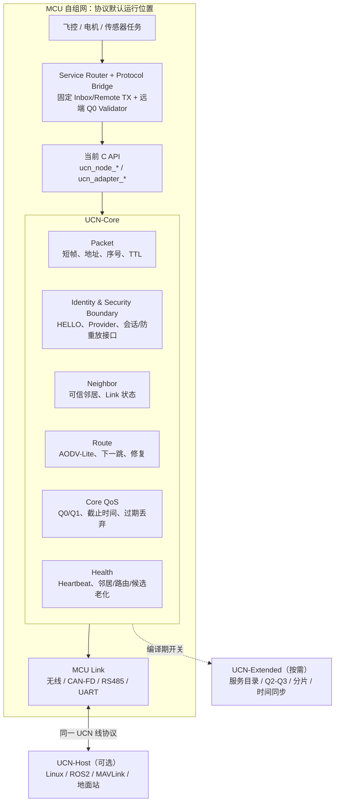

# UCN 整体架构设计：MCU 自组网优先

> 状态：**UCN v5 的协议/软件闭环、V5-46 独立 Platform Port、V5-47 工程模块分层与 V5-62 预发布 API V2 修复已完成（2026-08-14）**；W0～W3、全 Build Profile 四档接收、Profile-aware 控制面、32 bit Cost 与 3/3/3/4 B Wire Cost、Q1 绝对 Deadline、Candidate Profile 连续性、业务路由约束、运行期 Hop Scope、Pinned Path Remaining Hops、有界 Expanding Ring、Ingress 早拒绝和 Host 软件门禁已完成。v4 已独立冻结；生产密码库、Authorized Class 执行层、目标板资源和多介质多跳实机仍待验证。
> 日期：2026-08-14
> 目标：以 MCU 为主体完成安全自组网；Linux 仅作为兼容接入端；协议小而可裁剪；资源占用由目标硬件配置决定。

## 1. 架构结论

UCN 是一个可移植的 C 通信协议栈。它的最小运行形态不是 Linux 守护进程，而是运行在 MCU 上的 `UCN-Core`：多个 MCU 即使没有 Linux，也能完成邻居发现、有限多跳和消息转发。生产认证入网、统一失联事件与本地安全动作是 MCU-first 的架构目标，当前仍需 T15 和实机产品逻辑完成。

Linux、ROS2、PX4/MAVLink、地面站与 AI 系统可以通过 `UCN-Host` 接入同一网络，但它们不拥有路由中心、入网中心或控制中心的地位，更不替代 Linux 自己已有的网络体系。

当前代码已实现 **v5 W0/W1/W2/W3 官方 Codec、17/21/26/30 B 基础头、Profile 派生 Route/Path 扩展、Nano/Lite/Full 统一四档 Decoder、Node 与 per-Link 接收上限、1 B RX Ceiling HELLO、Ingress Profile/真实长度 Peek、Profile-aware 控制载荷、32 bit Cost、Hop-Cost-RTT 门禁、Profile 绑定 AAD、透明密文中继、路由感知最小档、受限 AODV-Lite、Candidate Probe/Activate、LC-1 本地动态 Cost、Endpoint Q1 首包寻路、固定邻居/Path/Policy、公共多 Source Event Runtime、UART/RS-485/USB CDC Stream Source、CAN/CAN-FD Frame Source、经典 CAN 有界 Carrier，以及按需诊断**。编译期公开默认值统一列在 `ucn_config.h`，原头文件默认继续兜底；运行期 Node ID、密钥和板级配置仍归产品。默认仍是固定 W3，收窄 TX 时推荐 RX 保持 W3；HELLO 分别表达 TX 线上档和最大 RX 档，自动档必须由产品明确开启。真实 `JOIN_*`、经审计 AEAD/身份库、Authorized Class 执行层、真实 BSP/DMA/USB/CAN 控制器/RTOS、多源实机仍是后续任务，不能由软件测试替代。

V5-47 进一步将仓库内部实现明确归入 `src/core`、`src/node`、`src/transport`、`src/routing`、`src/service`、`src/ports`；公开 `include/ucn/...` 路径与 Wire 行为不变。目录依赖和未来 Adapter/RTOS 扩展规则见 [工程架构索引](架构/README.md)。

V5-62 在尚未对外稳定发布的前提下选择工程 API 最优而非旧源码兼容：`ucn_port_ops_t` 使用 `struct_size/api_version` 的 Port API V2，Transfer 只接受一个权威单调时钟，经典 CAN 完成 Carrier 必须先提交再消费下一 START。旧对象必须全量重编译；Wire 仍是 v5，Frame/Header/消息编号不变。迁移与验证见 [V5-62 修复报告](UCN_V5_62_Port_API_V2与审计缺陷修复报告.md)。

这份架构只围绕四项约束设计：

| 方向 | 架构结论 |
| --- | --- |
| 兼容 Linux 现有体系 | 以 Host Adapter 方式接入 UDP、Ethernet、SocketCAN、ROS2/MAVLink；不重写或替代 Linux 网络栈。 |
| 无 Linux 也能自组网 | `UCN-Core` 在 MCU 上独立完成安全、邻居、AODV-Lite 路由和转发。 |
| 足够简洁 | Core 只保留自组网闭环；服务目录、分片、时间同步、大数据和桥接全部是可选模块。 |
| MCU 资源可控 | 无堆内存、无无限表项、无隐藏后台线程；当前由公共头文件中的编译期宏或构建参数配置，目标板专用 `ucn_config.h` 尚未建立。 |

四个方向不是要求所有 MCU 都编译完整功能。S04 已把网络能力冻结为真正的编译期 Profile：`Nano` 只保留静态直连/静态 Route，`Lite` 增加 HELLO、Neighbor、Heartbeat、AODV-Lite 和最小 Security Provider，`Full` 再增加 Candidate、Path、Policy/Balance 和按需诊断。`UCN_FEATURE_SERVICE` 与三档正交；关闭的状态字段和源文件不会进入目标，而不是仅在运行时禁用。完整能力表、最小 MTU 和 Host 裁剪证据见 [S04 Feature Profile 与资源报告](UCN_S04_Feature_Profile与资源报告.md)。

当系统需要接入 ROS2、PX4/MAVLink、地面站或 AI 时，采用“上层应用 → 受控 Bridge → UCN-Host → MCU Mesh”的关系；详细的系统级边界见 [UCN × ROS2 协同整体架构](UCN_ROS2协同整体架构.md)。

## 2. 系统边界

UCN 负责的是“不同 MCU 节点如何安全地组成一个网络并通信”。它不负责下列事情：

- 不实现 WiFi MAC、CAN 控制器驱动、TCP/IP 或 802.11s。
- 不实现电机 FOC、PWM、电流环、姿态内环等本地硬实时闭环。
- 不替代 ROS2、DDS、MAVLink、PX4、CANopen 或 Linux 网络栈。
- 不要求网络必须存在 Linux、云端、地面站或固定网关。

底层已有的 WiFi、CAN-FD、RS485、UART 或厂商 Mesh 能力只要能收发字节，就可以作为 UCN Link。UCN 在其上增加统一身份、路由、QoS 和安全规则。

## 3. 总体架构



`UCN-Core` 不依赖 `Extended` 或 `Host`。因此图中的 Host 不存在时，MCU 网络仍是完整网络。

## 4. UCN-Core：按节点角色裁剪的 MCU 闭环

`UCN-Core` 表示不依赖 Linux 的协议实现边界，不再表示每个节点必须携带所有自组网能力。参与自动 Mesh 的节点至少选择 Lite；只处在预配置静态网络中的小型 Sensor/Actuator 可选择 Nano；需要候选换路、显式 Path、负载均衡或管理诊断的节点选择 Full。不同 Profile 是否允许混网必须由产品冻结共同线格式和能力边界，不能假设 Nano 会处理 Lite/Full 的动态控制面。

### 4.1 模块职责与当前实现状态

| 模块 | 当前已实现 | 明确尚未实现 |
| --- | --- | --- |
| Packet | v5 W0～W3 基础头 17/21/26/30 B；Nano/Lite/Full 都解析四档。固定域和最大接收档可配置，推荐最低够用 TX/W3 RX；自动模式按字段、路由 Hop、Path 共同 Profile/MTU、对端上限及 Tag 选择最小可用档。Ingress 先用 3 B Prefix 按 per-Link RX Ceiling 早拒绝，再执行完整长度/CRC/Network/Hop/Flag/字段校验。可选 `ucn_transfer` 已提供 T32～T8K 有界逻辑消息。 | Transfer 的真实 Bearer 性能、完整 Path MTU 主动协商和生产安全实测。 |
| Identity & Join | 最小 `HELLO`、Candidate/Admitted/Suspect/Removed/Rejected/Expired 邻居表、`Manual`/`Open`/`Provider` 准入。 | `JOIN_REQ`/挑战/接受状态机、出厂身份格式。 |
| Session & Replay | 可注入 Provider 的会话 ID、发送序号持久化、TX/RX 授权、固定 `seal/open`、30 B 不可变 AAD（Path 帧含 Path ID）、明文/受保护策略和入站去重缓存。 | 生产 AEAD、密钥轮换、完整重放窗口与产品 ACL 表。 |
| Route / Forwarding | 固定 Active/Candidate 表、2→4→8→16 有界 AODV-Lite、RREQ/RREP/RERR、`PATH_PROBE/ACK` 的端到端 RTT EWMA、携带 Candidate ID + Epoch 的 `PATH_ACTIVATE/ACK`、TTL、断链清表、32 bit Route Cost；Node/Policy 可按 Hop/Cost/已验证 RTT 门禁业务路线，按 `(destination, route_epoch)` 区分 Current/Previous，默认 1 s grace。 | 自动业务重发、全网拓扑。 |
| Core QoS | Q0/Q1 固定队列、deadline、`best_effort`、`latest_value`；Endpoint Q1 首包固定 4 槽/1 s 等待并合并同 `(destination, Endpoint)`。Extended Transfer 以独立固定槽提供默认窗口 1、显式窗口 2～8、累计 ACK 和有界 Go-Back-N，不改变 Core 队列或 v5 Wire。 | 通用 Q2/Q3、文件级续传和高吞吐流。 |
| Node 内任务通信 | Core 外已有固定 Router、本机 Inbox、Remote TX、Bridge、FreeRTOS 静态事件通知；高风险远端 Q0 可在入队前强制产品 Validator，并使用固定 Replay 表。 | 产品执行器、真实 Task 时延/失联安全与板级验收；详见[节点内任务通信建议](UCN_节点内任务通信建议.md)。 |
| Health | 8 B 一跳 `HEARTBEAT` 请求/ACK、业务帧刷新存活、`ADMITTED → SUSPECT → REMOVED`、路由/Link 槽回收。 | `LINK_STATE` 线协议消息、对应用的统一失联事件、介质专用 Profile 实机标定。 |

### 4.2 报文类型与处理状态

| 类别 | 报文 | 当前处理状态 |
| --- | --- | --- |
| 邻居与入网 | `HELLO` | 已处理：只在一跳 Link 上绑定 Node ID 并执行准入；不转发、不交给应用。 |
| 邻居与入网 | `JOIN_REQ`、`JOIN_CHALLENGE`、`JOIN_ACCEPT` | 已定义枚举值，尚无 Core 状态机；生产入网属于 T15。 |
| 路由 | `ROUTE_REQ`、`ROUTE_REPLY`、`ROUTE_ERROR` | 已处理：受限发现、回程建表、失效清理；非 Candidate RREP 携带 Route Epoch。 |
| 健康 | `HEARTBEAT` | 已处理：一跳 8 B 请求/ACK、认证后刷新存活、SUSPECT/REMOVED 回收；`LINK_STATE` 尚未定义为线协议消息。 |
| 业务 | `DATA_Q0`、`DATA_Q1`、静态 Endpoint `0x40..0xBF` | 已处理：单跳/多跳转发与 Q0/Q1 API；Endpoint 可配置明文/受保护/接收/透明转发策略。 |

Core 只需支持：单播、受限广播、有限跳转发和小尺寸应用负载。组播、服务调用、文件和大包分片不属于 MCU 自组网成立条件。

### 4.2.1 一个 Node 内的多个任务（T25.3 ESP32 Port 已构建；实机待验收）

一个 MCU 对网络只暴露一个 Node ID；IMU、控制、舵机、电源等任务以静态 Endpoint/Service 挂载在该 Node 内。T25.3 已把 Core 外 Service Router 与独立 Protocol Bridge 接入 ESP32：目标为本机时直接投递固定 Router Inbox，目标为远端时只写固定 Remote TX Queue；只有 Arduino `loopTask` 有界地将其交给 Core 寻路和发送。FreeRTOS 静态 Queue 只传 1 B Endpoint 唤醒事件，业务 Payload 不会被二次排队。因此本机消息不产生帧、空口、寻路或额外心跳。

高风险远端 Q0 Binding 可强制要求产品 Validator：Core 完成安全/解密后，Bridge 在 Router 上锁与复制前传入完整 Frame、Source、Session、Endpoint、Payload 和当前 Node 时间；拒绝项不会进入 Inbox。可选 Replay 表使用固定容量，Session 切换必须由认证产品逻辑显式轮换。普通 Q1 和本机 Fast Path不承担这项开销，执行 Task 始终保留第二次产品安全检查。

`ucn_node_t` 仍由单一协议任务拥有。Endpoint 回调只应完成无阻塞固定副本投递和任务通知，不能在协议任务中执行耗时控制、PWM、FOC 或传感器业务。当前 Port 已编译，但真实 Task 高水位、Q0/Q1 和时延仍未测量；详细队列、QoS、Payload 所有权和测试门禁见[节点内任务通信建议](UCN_节点内任务通信建议.md)。

### 4.3 MCU 独立自组网流程

```text
启动
  ↓
读取设备身份、网络配置、持久化计数器
  ↓
Adapter 发现物理端点，建立 Candidate Link（Node ID 未知）
  ↓
物理广播 HELLO；Core 绑定 Node ID
  ↓
按 Manual / Open / Provider 策略准入；生产网由 Provider 认证/授权
  ↓
写入可信 Neighbor Table
  ↓
已有路由：直接下一跳发送
未知路由：限速 ROUTE_REQ Ring 2→4→8→16 → ROUTE_REPLY → Route Cache
  ↓
链路失效：ROUTE_ERROR → 清理缓存 → 允许的业务重新寻路
  ↓
无安全路径：通知本地应用，由飞控/执行器执行失联安全动作
```

Coordinator 是可由 MCU 承担的**授权角色**：它批准加入、保存网络策略、可选提供时间源；正常业务转发不应强制经过它。Coordinator 暂时离线时，已有会话和缓存路径可继续使用到各自有效期结束。

当前 Core 的 `HELLO` 只是链路本地发现与 Node ID 绑定：它不转发、不交给业务层，也不会把 MAC/CAN ID 当作身份。`Open` 仅用于实验网络；生产设备必须配置安全 Provider，并由 Provider 验证 HELLO/后续 JOIN 的真实身份与 ACL。

### 4.3.1 控制帧的送达范围：不能把 HELLO、Heartbeat 与寻路混为一谈

UCN 不会为所有控制帧做全网广播。每类帧的范围由目的地址、`hop_limit` 和当前 Link 决定：

| 帧 | 当前发送范围 | 会不会被中继转发 | 用途 |
| --- | --- | --- | --- |
| `HELLO` | Discovery Link 上的一跳物理广播，`hop_limit=1`。处于同一无线/总线一跳范围的候选节点可以接收。 | 不会。 | 发现物理邻居、绑定 Node ID、执行准入。Core 只提供发送 API；周期由 Adapter/Profile 决定。当前 ESP-NOW 测试 Profile 每秒调用一次。 |
| `HEARTBEAT` | 已准入的**一个直连邻居**。请求和 ACK 都在该邻居对应的单播 Link 上发送，`hop_limit=1`。 | 不会。 | 只证明这一跳 Neighbor/Link 仍可用，并刷新该邻居 `last_seen`。 |
| `ROUTE_REQ` | 在受 Hop Limit、去重和 Token 约束下向本地可用邻居扩散。 | 会。 | 仅在未知路径或受限候选刷新时寻找多跳路径。 |
| 业务帧 | 只交给当前选定的下一跳 Link。 | 仅路径上的中继会转发。 | 交付到目标 Node 的 Endpoint/业务回调。 |

例如 `A → B → C` 是一条业务路径时，保活关系实际是两组独立的一跳会话：

```text
A ── HEARTBEAT / ACK ── B ── HEARTBEAT / ACK ── C
A ── 业务帧 ───────────► B ── 转发业务帧 ───────► C
```

B 会收到并处理 A 发给 B 的心跳，也会独立地与 C 保活；但 B **不会**把 A 的心跳转发给 C，C 收不到那一帧 A→B 心跳。换言之，Heartbeat 不能证明 A 到 C 的端到端路径可达；多跳健康仍依赖业务结果、Link Down/RERR、路由刷新和 Candidate Probe 等机制。

### 4.3.2 两条路径的并行性与共享资源边界

UCN 没有全网总发送队列，也没有要求一条路径传完后另一条才可开始。彼此不共享节点的两条路径由各节点自己的协议任务、路由表和发送队列独立推进，属于**逻辑并行**。

但 MCU 网络不是“任何条件下都物理并行”，必须区分以下三层边界：

| 场景 | 当前行为 |
| --- | --- |
| `A→B→C` 与 `D→E→F` 不共享节点、且底层介质独立 | 两条路径可独立收发；不存在 UCN Core 的全局互斥。 |
| 两条路径共享中继 B | B 的协议任务按帧处理接收和转发；本地 Q0 队列优先于 Q1，因此共享 B 时会出现本地排队。 |
| 多块 ESP-NOW 板共用同一 WiFi 信道 | 业务可同时被不同节点提交，但无线空口和每块板的无线电仍是共享资源；实际发送会竞争、退避或重试，高负载时表现为时延上升、队列积压或丢帧，而不是全网协议锁。 |

当前 `ucn_node_step()` 每次只取一个本地业务项，Q0 仍优先且保持 FIFO。连续发送 `UCN_BUSINESS_TX_BURST_BEFORE_MAINTENANCE`（默认 4）个业务项后，若 Heartbeat、Bearer/Path Probe 或 Route Refresh 已实际到期，则占用一个维护槽；未到期时不会插入控制帧，Snapshot/Policy Diagnostic 始终不抢占业务。因此持续满载不会再无限期饿死必要维护，但 Q0 在该单个维护槽会延后一轮。来自该邻居的任意有效业务或控制帧也会刷新 `last_seen`，不会只依赖单独的 Heartbeat。实际 ESP-NOW 的并发上限、空口占用、调度周期和队列深度必须由 S06/T22.7.2 实机压力测试测量，不能由该逻辑规则推导为吞吐承诺。

### 4.4 AODV-Lite 的限制

为了保持 MCU 资源可控，路由只采用一套按需、受限的 AODV-Lite：

- 每节点只维护固定数量的邻居、路由、重复请求和等待请求。
- `ROUTE_REQ` 带请求 ID、Hop Limit、累计 `route_cost` 与过期时间；重复请求默认抑制，但累计代价更低的副本可以替换较高代价副本。
- 自动发现默认按 2→4→8→16 扩圈，单 Ring 250 ms、总预算 1000 ms；每轮新 Request ID 并重新选择最小可表达 Profile，Pending 业务不会反复重启活动 Ring。
- `ROUTE_REPLY` 只建立“目标 → 下一跳”的缓存，不构建完整全网拓扑图；同一目标优先保留较低 `route_cost` 的动态路径。
- `ROUTE_ERROR` 只影响相关缓存路径，不触发无限全网泛洪。
- Q0 不得等待路由发现；Q0 只能使用直连、预建路径或本地安全动作。
- `ucn_node_send_endpoint()` 的 Q1 在未知路径时自动发起一次受限 RREQ，并把最新值放入固定等待槽；旧 `ucn_node_send()` 保持显式寻路兼容。
- “Route 存在”不等于该业务可用：Node 默认和单 Policy 可以限制 Hop、累计 Cost、最大已验证 RTT/是否强制 RTT。有限 Cost 遇 Unknown、必需 RTT 未验证时失败关闭。

等待槽仅服务 Endpoint Q1，默认 `UCN_PENDING_Q1_DEPTH=4`、`UCN_PENDING_Q1_TIMEOUT_MS=1000`，同目的同 Endpoint 的**新应用值**覆盖旧值并刷新 Deadline；Protocol Task 内部重试保留原绝对 Deadline，不重新排队续命，成功、到期或永久错误后才清槽。Q0 永不进入等待槽。这保持了 RAM、时延和 RREQ 数量的上限。

### 4.4.1 策略路由、Path 转发表与可选负载均衡（T22.1～T22.5 已实现基础）

当前 Active/Candidate 解决的是“同一目标 Node 的自动换路”，不是“不同业务固定走不同路径”或“多路径同时分担”。T22.1 已在 `ucn_node_t` 中加入固定 Policy、当地 Path、Q1 Flow 和 Link 质量快照表；默认上限为 8/8/8/4，均可按 RAM Profile 编译期调整。Policy 按 `(destination, Endpoint[, traffic_class])` 精确或 traffic-class 通配匹配；未配置业务仍保持原有 `AUTO_BEST`。它已提供 `ucn_node_set_route_policy()`、`ucn_node_set_policy_path()`、`ucn_node_bind_q1_flow()` 和质量/统计查询 API。

T22.2 已引入真正的线上 Path ID，但它与 T22.1 的本地 `local_path_id` 仍不是同一个概念。v5 Path 业务帧按 Profile 使用 19/25/31/36 B Header；固定模式使用 Node 发送档，自动模式选择能表达 Path ID、地址、真实 Remaining Hops、Tag 且满足整条 Path 共同 Profile/MTU 的最小档。表项以 `(源 Node、源 Session、Path ID、目标)` 识别，并在每一跳保存固定的“下一跳/egress 或终端 + remaining_hops + maximum_wire_profile + minimum_mtu”关系。PATH_INSTALL 基础四档 Payload 为 8/11/14/17 B，扩展能力格式为 11/14/17/20 B；旧 API 固定发送基础格式，capability API 才显式发送扩展格式，新节点只接受两组精确长度。中继 Scope 逐跳递减，终端为 0，坏中间长度或错误 Scope 失败关闭。默认每节点最多 8 项，租约到期自动回收；中继保留源端已选 Wire Profile，只按表转发，端到端密文只由目标解密。若后续跳发现既有 E2E 帧超出能力，会撤销 Path 并返回 Path-RERR，不会静默保留黑洞。

T22.3 将 Policy 的 Primary/Backup 本地句柄绑定到已经验证的线上 Path ID，并接入 `ucn_node_send_endpoint()`。`PINNED_STRICT` 只发送 Primary，任何失败都直接返回；`PINNED_FAILOVER` 仅在 Link Down 或 Path 不存在时标记该本地 Path Down 并尝试 Backup，Cost、队列抖动、背压和 Security 错误均不会触发切换。Primary/Backup 都不可用时，只有配置显式允许的 Q1 才会进入既有 RREQ/等待槽；这代表该次业务已经允许退回普通 Route，Q0 永不自动寻路。

T22.5 进一步把两层选择接起来：Path 表保留安装时的 egress Link 作为“逻辑下一跳”，每次真正发送或中继转发前都解析该 Neighbor 当前健康的 UART/ESP-NOW/CAN Bearer。单 Bearer Down 只切换物理承载，不改变 `Path ID`、逐跳表或 E2E AAD；只有同一下一跳的全部 Bearer 都 Down 才撤销使用该 hop 的 Path，并把本机相同 `wire_path_id + destination` 的 Policy Path 标为 Down。中继下一次遇到该失效 Path 时通过健康上游 Bearer 回送 Path 范围 RERR，独立 P2 不受影响。

后续策略执行边界如下：

- `PINNED_FAILOVER` 已使业务正常固定在指定 Primary Path；只有 Link Down、Path RERR/不存在等硬故障才切到 Backup 或按策略寻路，Cost 的短时优劣不触发切换。
- `AUTO_BALANCE` 已实现但默认不配置：只接受精确 Q1 Policy，Primary/可选 Backup 构成最多两条已验证 Path 成员。每个 `(destination, Endpoint, Q1)` 在固定 Flow 表中默认租约 2 s；首次或租约过期时按 Full 本地 LC-1 `effective_select_cost ×（已有 Flow 数 + 1）` 选择成员，Known 基础 Cost 仍优先于 Unknown。持续 Adapter Queue Pressure 也可按既有三样本门限触发拥塞重绑；同一 Flow 租约内不逐帧换路。
- Path Down 会使受影响 Flow 只重绑一次到另一健康成员；默认连续 3 个 500 ms 队列压力样本达到 800‰ 才视为持续拥塞并重绑。Q0、自动 Discovery、帧复制和带宽聚合均不属于该能力；实际门限可按 MCU Profile 覆写，尚未完成实机标定。
- 真正的端到端指定路径需要短小 `Path ID` 和受认证的路径安装/撤销控制面，中继仅按 Path ID 转发。现有 `route_epoch` 只用于 Current/Previous 切换，不能充当 Path ID。

`ucn_link_metrics_t` 已可选携带 RTT、TX/RX 失败率、队列压力、介质占用/质量和快照时间戳；Full Core 每 500 ms 用固定 25% EWMA 缓存快照并执行 LC-1。Core 不读取 RSSI/MAC/UART 私有字段；真实 Adapter 必须把可得质量归一为通用字段，不能伪造缺失指标。该层与 T21 的“到同一下一跳时选择 WiFi/UART/CAN Bearer”不同：T21 处理一跳承载冗余，T22 处理经不同中继的端到端路径策略。完整边界、API 原则、帧兼容要求和测试门禁见[策略路由与可选负载均衡建议](UCN_策略路由与可选负载均衡建议.md)。

### 4.4.2 按需路径追踪（T23，Core 已实现）

应用可调用 `ucn_node_request_path_trace()` 查询**该次** Trace 实际走过的 Node ID。源节点先写入自身，沿途节点追加自身，目标经固定容量 Reverse 表反向回送 Reply；中继不保存完整路径，也不需要目标到源的普通 Route Cache。

- Trace 只使用当前直连/Route Cache，找不到路径立即返回，不触发 RREQ；它不锁定或改变后续业务的选路。
- `PATH_TRACE_REQ/REPLY` 使用 `DIAGNOSTIC=0x04`、Q1 和独立低频 Token；不占 Q0 控制预算，不进入普通 Q0/Q1 队列。
- 每个 Node 都以固定 Pending/Reverse 槽和超时限制状态；结果含 `OK`、`NO_ROUTE`、`TTL_EXCEEDED`、`TRUNCATED` 或源端本地 `TIMEOUT`。
- Trace 是拓扑诊断，控制帧不允许 E2E 保护；生产是否开放该能力仍由身份 Provider/产品 ACL 决定。所有路径中继必须支持该 Flag。

线格式、记录上限和实机门禁见[路径追踪诊断建议](UCN_路径追踪诊断建议.md)。它与 T22 的业务 `Path ID` 无关，不能作为指定业务路径或负载均衡机制。

### 4.4.3 按需节点快照（T24，Core 已实现）

被授权的管理节点可调用 `ucn_node_request_node_snapshot()`，通过受限广播收集当前连通域内回复的 Node ID 和直接 Link 数量。请求只首次泛洪；每个中继只保存短期 `(origin, query_id, ingress Link)` Reverse 项，Reply 沿该项回源。因此它不要求全网 Route Cache，也不让每个 MCU 常驻完整拓扑图。

- Snapshot 使用 `NODE_SNAPSHOT_REQ/REPLY`、`DIAGNOSTIC=0x04`、Q1 与独立的“突发 1、10 s 补 1”Token；正常 Q0/Q1、Heartbeat 和 Path Probe 优先。
- 远端默认拒绝，必须经 `ucn_node_set_node_snapshot_authorizer()` 显式允许管理 Node；既有 Security Provider 的 RX 授权仍先执行。
- 源端仅用固定结果数组收集一次窗口内的唯一回复；没有回复不等于永久离网，也不返回 MAC、密钥或完整邻接图。

完整载荷、资源上限、虚拟测试与五节点实机门禁见 [v4 节点快照诊断](UCN_v4_节点快照诊断.md)。

### 4.4.4 按需策略诊断（T22.6，Core 已实现）

管理 Node 可调用 `ucn_node_request_policy_diagnostic()` 向一个目标 Node 查询其现有策略效果，而不是让每个节点周期性广播状态。`POLICY_DIAGNOSTIC_REQ (0x1E)` 为固定 8 B，`REPLY (0x1F)` 为固定 32 B；两者都是 `DIAGNOSTIC` Q1 控制帧，基础头下回复刚好适配 64 B Profile，普通业务帧完全不增加字段。

- 目标默认拒绝，产品必须通过 `ucn_node_set_policy_diagnostic_authorizer()` 明确允许指定管理 Node；既有 Security Provider 的 RX 授权仍优先生效。
- 查询一次只读取三页 Summary 或固定表的一项 Policy、Path、Q1 Flow、Link-quality。Path 返回逻辑 egress 与当前解析的健康 Bearer、缓存 Cost/RTT/失败率/队列；Flow 返回绑定 Path 与租约；不返回密钥、完整邻接表或永久全网地图。
- 请求和响应分别用独立“突发 1、1 s 补 1”Token，默认 Pending/Reply 固定槽各 2；`ucn_node_step()` 只在普通 Q0/Q1、Heartbeat、Probe 和既有 Snapshot Reply 之后才发诊断，因此不挤占 Q0。
- 控制帧不带 E2E/Path ID；如产品要求加密的管理面，应通过其 Security Provider/ACL 选择更高层受保护管理通道，而非把此诊断帧伪装成业务 E2E。

### 4.5 Link Cost：跨介质质量选路

Core 不直接读取 WiFi RSSI、BLE RSSI、LoRa SNR 或 CAN 专有状态。每个 Link 可选上报一个统一的 16 bit 非零 `route_cost`，值越小表示越适合参与路由；`UCN_UNKNOWN_LINK_ROUTE_COST=UINT16_MAX` 只表示单跳输入未知。多跳累计值为 32 bit，最高 Known 为 `0xFFFFFFFE`、Unknown 为 `0xFFFFFFFF`；任何 Known 都优于 Unknown，真实溢出失败关闭。

| Link 类型 | 稳定基础 `route_cost` 来源 | Adapter 可另行上报的 LC-1 动态指标 |
| --- | --- | --- |
| WiFi / ESP-NOW | 标准 Preset + 产品静态覆盖。 | TX/RX failure、Queue、RTT、映射后的 medium quality/busy。 |
| BLE | 连接档 Preset + 产品覆盖。 | failure、Queue、RTT、映射后的质量；不把连接参数裸相加。 |
| LoRa | 调制/速率条件 Preset。 | failure、Queue、RTT、SNR 映射 quality、占空/空口 busy。 |
| CAN / CAN-FD | 仲裁/数据速率 Preset。 | Bus-Off 进入状态门；错误率、Queue、RTT、Bus Load 进入 busy。 |
| UART / RS485 | 波特率与拓扑 Preset。 | CRC/超时映射 failure、Queue、RTT；没有可靠物理质量时保持 Invalid。 |

这不是动态内存的全网最短路径算法：线上 RREQ/RREP 仍只累加稳定基础 Cost；Full 只在本节点用 LC-1 动态分比较出口。Adapter 负责介质私有值到通用指标的映射，Core 统一执行采样、定点 EWMA、20%/3 样本/Probe 和保持期，避免 WiFi RSSI 等瞬时波动造成频繁换路。

### 4.6 Adapter：物理介质与 Core 的唯一边界

每种介质都遵循同一条路径：`物理地址 → Candidate Link → 驱动固定 Ring/有界收包队列 → 事件唤醒唯一 Protocol Owner → 有预算地批量 pump → Core`。驱动 ISR/WiFi 回调不直接运行路由或应用逻辑；它们只搬运数据、投递固定队列并通知 Owner。正常数据不等待 Heartbeat 或固定轮询周期；最多 10 ms 的定时唤醒只负责协议维护、漏通知和无中断平台兜底。Core 不保存 MAC、CAN ID、串口号或 socket。物理地址到 Link 的静态映射由 Adapter 管理，成功 HELLO 后才由 Core 写入 `peer_node_id`。

Owner 必须设置单次 Drain 的轮数/时间预算，防止连续外设流量独占 MCU；达到预算后让出 CPU，再处理后续通知。Frame 解码、寻路、解密、Transfer 重组、Endpoint 回调和同步日志禁止放进 ISR。ESP32 三板参考已用 UART/ESP-NOW 事件通知验证这一模型，详见 [V5-57 报告](UCN_V5_57_事件驱动Owner与窗口8三节点报告.md)；其他 RTOS/BSP 仍需各自实机门禁。

当前“跨介质多跳转发”已由 Link + 通用 Cost 支持；T21.1～T21.4 还让同一 Node ID 的 WiFi/UART/CAN 等自动准入 Link 合并为一个固定 Bearer 集（默认最多两条），并在 Primary 明确 Down 后让下一帧使用健康 Backup。每条 Bearer 都独立经过 Provider 准入、Heartbeat 和 `last_seen`；全 Bearer Down 后才回收 Neighbor。健康 Primary 不因一次 Cost 波动改变：Full 候选有效分需低至少 20%、连续 3 个 500 ms 窗口成立，再在该候选 Bearer 上收到 2 次一跳 Heartbeat ACK（最多 3 次尝试）才切换，切换后保持 3000 ms。Probe 不新增线格式、不经中继；当 Probe 到期且连续业务已达默认 4 个发送上限时，它获得一个必要维护槽，未到期时不会抢占业务。Active/Previous Route 与 Candidate 都在业务、Probe、Activate 和中继转发时解析到当前 Primary：单 Bearer Down 不清动态路径；下游断链的 RERR 经当前 Backup 回传；全 Bearer Down 才清动态 Route/Candidate。静态 Route 有意保留给产品层恢复策略。Adapter 负责把 RSSI、错误、拥塞等映射为通用指标，Core 负责 LC-1 平滑和评分。

ESP32 T21.6 正常诊断镜像已经让 ESP-NOW Peer Link 和 UART Link（ID `0x70`）各自携带 RX Queue、状态、Cost 与统计，直接进入同一个 Core；`DualMediaLink` 仅保留为 `legacy_dual` 回归对照，不能作为 Core Bearer 切换证据。两块 S3 已实测同一对端合并为 `count=2`，UART Cost 5 为 Primary、ESP-NOW Cost 10 为 Backup；B 临时改为 Wi-Fi-only 后 A 仍保留 Neighbor 并走 ESP-NOW，恢复 B 后自动回到两 Bearer。该控制实验尚不等于物理拔线、P50/P95 切换时延、丢失/乱序、功耗或三板 RERR 验收，因此仍不称为“无缝”多介质冗余。具体边界见 [多介质同对端主备 Link 建议](UCN_多介质同对端主备_Link_建议.md)。

即使 T21 完成，它也只是在一个下一跳内部选择 Bearer，不会自动让不同业务在 `A→B→C` 与 `A→D→C` 间分担。后者属于 T22 的显式策略层，默认关闭，见[策略路由与可选负载均衡建议](UCN_策略路由与可选负载均衡建议.md)。

Adapter 的默认收包队列是两个最大帧缓存，可按 MCU RAM 编译期缩小。队列满必须显式丢弃并计数。接口、状态机、各介质映射和实际限制见 [UCN Adapter 契约](UCN_Adapter_契约.md)。

Core 本身不做跨 Link 分片/重组；可选 `ucn_transfer` 在 Core 之上把 T128～T8K 逻辑消息切为多个正常 UCN 帧，中继仍只转发。每个物理 UCN 帧必须小于实际 Path/Bearer 的有效 MTU；静态 `link->mtu` 和动态 `get_status().mtu` 同时存在时取较小值，任一为零时使用另一方，两者均零时 Link 暂不可发送。64 B CAN-FD 直接承载完整小帧；经典 CAN 由 `ucn_can_source_t` 的固定 8 B Carrier 在单条 Link 内先重组成完整 UCN 帧，仍不等于业务 Transfer。

## 5. UCN-Extended：仅给需要它的 MCU 开启

`Extended` 不是第二套协议，而是建立在 Core 之上的编译期模块集合。

| 可选模块 | 用处 | Core 节点关闭后怎样工作 |
| --- | --- | --- |
| Service Discovery | 发布/查询 `motor.control`、`imu.data` 等服务与版本。 | 使用预配置 Node ID + Message Type 通信。 |
| Group / Multicast | 面向编队或同类传感器的受权限组消息。 | 使用受限广播或多次单播。 |
| Q2 Reliable | 参数写入、配置、普通确认。 | Core 不承担可靠参数服务。 |
| Fragmentation | `ucn_transfer` 已实现九档、固定槽、CRC32、ACK/重试和显式 release；仅目标端重组。 | 未链接 Transfer 时仍直接拒绝超 Core 负载；不提供无限消息或隐式文件传输。 |
| Q3 Bulk | 日志、OTA、文件等限速流量。 | 不在普通 MCU Mesh 上进行大数据传输。 |
| Time Sync | 编队、传感器融合和日志关联。 | 使用本地单调时间完成 Core 超时与防重放。 |
| Diagnostics | 详细统计、抓包镜像、长期质量历史。 | 仅保留必要故障计数。 |

只有 Coordinator、MCU 网关或 RAM/Flash 充足的控制节点才需要开启其中一部分。即使开启，也必须拥有独立的缓冲、队列和上限，绝不能占用 Q0/Q1 或路由表资源。

## 6. UCN-Host：兼容 Linux，但不替代 Linux

Linux 通过 `UCN-Host` 以一个普通受认证节点的身份加入网络。Host 复用与 MCU 相同的帧、身份、会话和 ACL，只额外提供主机侧适配与桥接：

- UDP、Ethernet、SocketCAN 等 Linux Link Adapter。
- ROS2、MAVLink/PX4、地面站和用户应用的白名单 Bridge。
- 日志、抓包、图形化配网、性能测试、AI 和大数据处理。

它不能做的事情：

- 不能绕过 MCU Coordinator 批准新节点加入。
- 不能修改 MCU 的 Route Cache，或强制 MCU 经由 Linux 转发。
- Host 断线、重启、未部署时，不能影响 MCU 间的会话、路由和本地控制。
- 不能把 ROS2 Topic、MAVLink 帧或 Linux UDP 裸包无筛选地写入执行器。

这就是“兼容 Linux 现有体系”的含义：Linux 保留原生能力，UCN 只提供一层受控的节点通信接口，不取代 Linux 的任何网络或机器人生态。

## 7. 像 FreeRTOS 一样保持简洁的实现方式

UCN 不能像 FreeRTOS 内核那样小，因为它还要解决身份与路由；但应采用相同的工程思想：**小核心、静态配置、明确模块、无隐式成本。**

### 7.1 当前 Core 的最小 API

```c
ucn_node_init(&node, &config);
ucn_node_set_security_required(&node, true); /* 产品也可编译期默认开启 */
ucn_node_set_security(&node, &security_ops, security_context);
ucn_node_set_join_policy(&node, UCN_JOIN_PROVIDER, authorize, context);
ucn_node_set_security_policy(&node, &node_policy);
ucn_node_set_endpoint_security_policy(&node, endpoint, &endpoint_policy);
ucn_adapter_rx_enqueue(&rx_queue, ingress_link, frame, frame_length);
ucn_adapter_rx_pump(&rx_queue, &node, max_frames, NULL);
ucn_node_send_endpoint(&node, destination, endpoint, UCN_TRAFFIC_Q1_REALTIME, payload, length);
ucn_node_request_path_trace(&node, destination, 0U, trace_callback, callback_context);
ucn_node_request_policy_diagnostic(&node, manager_target, UCN_POLICY_DIAGNOSTIC_PATH, 0U, diag_callback, callback_context);
ucn_node_enqueue(&node, &request);  /* 或兼容的 ucn_node_send() */
ucn_node_step(&node, now_ms);
```

开发构建默认兼容明文联调；生产构建可定义 `UCN_SECURITY_REQUIRED_BY_DEFAULT=1`。Required 状态下，只有完整 Provider、有效 Session/Sequence 和禁止明文的 Node/Endpoint 策略全部就绪，`ucn_node_security_ready()` 才允许 Step/收发运行。该门禁防止漏配置静默降级，但不替代审计 AEAD、身份和密钥生命周期。

- `ucn-core` 不创建线程、不调用 `malloc`、不依赖 Linux socket 或特定 RTOS。
- 裸机主循环可周期调用 `ucn_node_step()`；FreeRTOS/Zephyr 可由端口层把 RX、TX、Timer 映射为任务或队列。
- 应用通过 `ucn_node_send()` 或 `ucn_node_enqueue()` 提交 Node ID、消息类型、Q0/Q1 与截止时间；应用不直接指定 WiFi、CAN 或下一跳。

### 7.2 当前代码目录

```text
UCN/
├── include/ucn/       公共 API；Node owner 另选 node_storage 静态布局
├── src/               ucn_core.c、ucn_frame.c、ucn_adapter.c、ucn_node.c
├── tests/             单元测试、虚拟 Link、路由、Adapter、集成模拟
├── docs/              架构、任务表、操作记录、Adapter 契约
└── CMakeLists.txt     C99 静态库与 CTest 入口
```

当前源码以小型平铺目录组织；未创建 `host/`、`extended/` 或具体厂商 `transport/` 目录。后续新增真实 Adapter 时可按介质拆分目录，但不能使 Host、ROS2 或 Linux 反向成为 Core 的编译依赖。

`ucn_node.h` 只公开不完整 `ucn_node_t`、配置/结果/统计和函数声明。只有唯一 Protocol Task 的所有者、Core 实现与明确白盒测试包含 `ucn_node_storage.h` 取得完整固定布局。这个拆分不引入堆分配：Node 仍可静态实例化，但业务 Task 和 Adapter 不再依赖 Route、Queue、Seen 等内部字段位置。

## 8. RAM 与 Flash：按目标硬件配置，不写死一个数字

UCN 不预设“所有 MCU 必须占用多少 RAM”。资源取决于目标 MCU、链路 MTU、最大节点数、安全算法、是否开启 Extended，以及应用自身剩余空间。

### 8.1 编译期资源配置

当前工程通过公共头文件的 `#ifndef` 宏或 CMake 编译参数裁剪资源；目标板专用 `ucn_config.h`/Kconfig 是后续工程化选项，尚未提供。当前可配置项至少包括：

```c
UCN_MAX_NEIGHBORS       // 可信一跳邻居数量
UCN_MAX_BEARERS_PER_NEIGHBOR // 同一 Neighbor 可接纳的物理 Bearer 数
UCN_MAX_LINKS           // 已注册 Link 数量
UCN_MAX_ROUTES          // Route Cache 条目数
UCN_MAX_ROUTE_DISCOVERIES // 并发路由请求数
UCN_DUPLICATE_SOURCE_WINDOWS // Source/Session 去重窗口数
UCN_DUPLICATE_WINDOW_BITS // 每来源乱序/重复 Sequence 位图
UCN_RREQ_CACHE_SIZE     // 独立 RREQ Request/Best Cost 状态
UCN_MAX_PATH_FORWARD_ENTRIES // T22.2 固定 Path 转发表容量
UCN_MAX_FRAME_BYTES     // Core 最大帧和单帧负载
UCN_TX_Q0_DEPTH         // Q0 队列深度
UCN_TX_Q1_DEPTH         // Q1 队列深度
UCN_PENDING_Q1_DEPTH    // Endpoint Q1 等待寻路槽数
UCN_MAX_CANDIDATE_ROUTES // Candidate 路由表
UCN_MAX_ENDPOINT_SECURITY_POLICIES // Endpoint 安全策略表
UCN_MAX_ROUTE_POLICIES // T22 业务策略表
UCN_MAX_POLICY_PATHS // T22 本地 Path 表
UCN_MAX_POLICY_FLOWS // T22 Q1 流绑定表
UCN_POLICY_QUALITY_SAMPLE_INTERVAL_MS // Link 质量快照周期
UCN_PATH_TRACE_PENDING_DEPTH // 本地并发 Trace 槽
UCN_PATH_TRACE_REVERSE_DEPTH // 中继反向回程槽
UCN_PATH_TRACE_TIMEOUT_MS // Trace 临时状态寿命
UCN_POLICY_DIAGNOSTIC_PENDING_DEPTH // 本机按需策略查询等待槽
UCN_POLICY_DIAGNOSTIC_REPLY_QUEUE_DEPTH // 目标按需策略回复槽
UCN_POLICY_DIAGNOSTIC_TOKEN_REFILL_MS // 独立诊断限频
UCN_ROUTE_EPOCH_GRACE_MS // 旧 Epoch 保留窗口
UCN_ADAPTER_RX_QUEUE_DEPTH // 公共 Adapter 收包队列深度
UCN_MAX_STEP_INTERVAL_MS // Protocol Task 两次 ucn_node_step() 的产品最大允许间隔
```

`UCN_MAX_HOPS` 默认 16，支持全工程统一编译期覆盖并限制在 1～254；每个 Node 的 `default_hop_limit` 可进一步收窄实际参与范围。完整 Decode/Network 检查后、Security 与状态修改前，Full/Lite/Nano 都拒绝超范围帧；RREQ 原始 Ring Scope、RREP/Route/Candidate 学习和 Path Remaining Hops 同步执行该边界。V5-14 已完成 32 bit 累计 Cost 和 201 Node/200 Edge Host 正向验证；这只证明线格式与状态机，不代表 100～200 Hop 在真实无线/总线上具有可接受收敛、内存、空口或故障恢复性能。产品扩大 Hop 前仍必须重标 RREQ 超时、控制预算和介质容量，并完成 S06/S07 实机验证。

Protocol Task 同样是资源边界。Core 使用以下保守式把“每若干业务帧让出维护槽”换算成时间上界：`(UCN_BUSINESS_TX_BURST_BEFORE_MAINTENANCE + 1) × UCN_MAX_STEP_INTERVAL_MS × UCN_MAX_NEIGHBORS × UCN_MAX_BEARERS_PER_NEIGHBOR`。默认值为 800 ms，叠加 1 s Heartbeat 后仍早于 3 s Suspect；不安全的组合在编译期失败关闭。Node 只保存三个固定统计字段观察实际 Step，不新增动态内存、线字段或网络流量。产品 Port 还必须冻结任务优先级、最大阻塞、Adapter/Bridge 预算并实测 Link `send()` WCET。

Core RAM 的构成应可计算而非猜测：

```text
Core RAM = 固定上下文
         + 邻居表 × UCN_MAX_NEIGHBORS
         + 路由表 × UCN_MAX_ROUTES
         + RREQ/去重缓存
         + Q0/Q1 队列与帧缓冲
         + Link Adapter 必需缓冲
```

启用 Extended 后，其分片槽、Q2/Q3 队列、服务目录和诊断缓存必须单独计入；不能把它们隐藏在 Core RAM 中。

### 8.2 资源纪律

1. Core 全部使用静态数组、调用方缓冲或初始化时一次性提供的内存池。
2. 不允许运行时按邻居、路由、分片或接收包无限扩容。
3. 每个目标构建必须输出：Core/Extended 各自的 Flash、静态 RAM、峰值 RAM、栈峰值、CPU 占用和空口占用。T21.5 已有 S3 单/双 Bearer 的静态比较和可编译的堆/`loopTask` 栈观测口；峰值、CPU、空口和功耗仍必须来自实机日志，不能由 ELF 推导。
4. 编译期应检查配置是否合法；资源预算不足时构建失败或启动失败，不可悄悄降级为不安全行为。
5. 节点规模变大时优先选择更大 MCU 或调整配置，而不是取消会话校验、防重放或路由限速。

### 8.3 当前 ESP32 静态资源证据（T21.5）

在 `UCN_MAX_FRAME_BYTES=250`、固定 RX Queue 深度 4、相同 ESP32-S3 双介质测试应用中，`UCN_MAX_BEARERS_PER_NEIGHBOR=1` 的整机测试固件为 RAM `42,852 B`、Flash `582,183 B`；默认 `=2` 为 RAM `43,108 B`、Flash `582,679 B`。第二条 Bearer 的已测静态增量为 **256 B RAM、496 B Flash**；目标符号 `g_node` 也从 `5,040 B` 增至 `5,296 B`，说明这 256 B 来自固定 Neighbor Bearer 数组。完整口径、WROOM 兼容构建和运行时观测边界见 [T21 目标板资源报告](UCN_T21_目标板资源报告.md)。

该数字包含 Arduino、Wi-Fi/ESP-NOW、UART Adapter、测试 Endpoint 与日志，不是“纯 Core 仅占用多少字节”。现在的 `bearer_diag` 实机镜像已改为两个真实 Core Link，关闭吞吐生成器后的整机构建为 RAM `42,892 B`、Flash `579,423 B`；空闲实测的内部最小 Heap 为约 `315,428 B`、`loopTask` 剩余栈约 `5.4–5.6 KiB`。真实物理拔线的切换时延、持续业务丢失/乱序、驱动任务栈、功耗和三板 RERR 仍由 T21.6 后续验收。

## 9. 节点配置档案

| 节点 | 必选档案 | 可选档案 | 说明 |
| --- | --- | --- | --- |
| 传感器/执行器 MCU | Core | 无 | 能入网、收发 Q0/Q1；是否允许转发由配置决定。 |
| 飞控/控制 MCU | Core | 少量 Extended | 本地闭环优先；网络只给高层命令与状态。 |
| MCU Relay | Core | 无或少量 Extended | 承担有限多跳转发，路由容量按硬件配置。 |
| MCU Coordinator | Core | Enrollment/Time 等 Extended | 只承担授权与策略角色，不承担业务中心。 |
| MCU 网关 | Core | 按需 Extended | 连接不同 Link，必要时提供服务或诊断。 |
| Linux/地面站 | Host | 按需 Extended | 只提供兼容、桥接、日志和大数据能力。 |

更细的档案和可选模块清单见 [UCN 协议分层与配置档案](UCN_协议分层与配置档案.md)。

## 10. V1 的实际实施顺序

### V1-A：MCU Core 单跳

- 固定帧、身份、加入、会话、AEAD、防重放。
- 一个无线或总线 Link。
- 邻居表、Q0/Q1、心跳、单跳通信。

### V1-B：MCU Core 自组网

- AODV-Lite、两跳/多跳转发、Route Cache、路由错误和受限修复。
- 三个 MCU 节点在没有 Linux 时完成认证、两跳通信、断链与恢复。
- 测量节点规模、跳数、帧长和安全算法配置下的资源与时延。

### V1-C：按需扩展与 Linux 兼容

- 只为必要节点开启服务发现、Q2、时间同步或分片。
- 最后实现 Host Adapter 与 ROS2/MAVLink Bridge。
- 验收条件是 Host 退出后 MCU Mesh 仍持续工作。

## 11. 编码前必须冻结的参数

以下参数不能从架构图中猜测，必须按首个实际硬件方案确定：

1. MCU、无线模块、总线控制器、RTOS/裸机环境以及各自可用 RAM/Flash。
2. 网络最大节点数、最大邻居数、最大并发会话数、最大跳数和最差 Link MTU。
3. Core 最大帧、Q0/Q1 队列深度、路由请求频率、缓存老化和心跳策略。
4. 设备身份保存方式、入网授权策略、所选 AEAD 套件和 Counter 持久化方案。
5. 哪些设备可以作为中继、Coordinator，哪些业务允许多跳以及失联时的本地安全动作。
6. 是否、在哪些节点启用 Extended；每个模块允许增加多少 Flash、RAM、CPU 与空口占用。
7. Linux Host 需要接入的实际 Link 与白名单 ROS2/MAVLink 业务，而不是先做全量桥接。

## 12. 最终判断

新的 UCN 架构以 MCU 为协议主体：**没有 Linux 仍能安全自组网；有 Linux 时只是在不改变 Linux 体系的前提下增加一个受控接入端。**

简洁性来自 Core 的严格边界，而不是删除安全和路由：Core 只承担自组网必需能力，所有“好用但重”的能力均后置为 Extended 或 Host。资源占用不再写死一个数字，而是随目标硬件和配置生成可验证的预算与报告。
