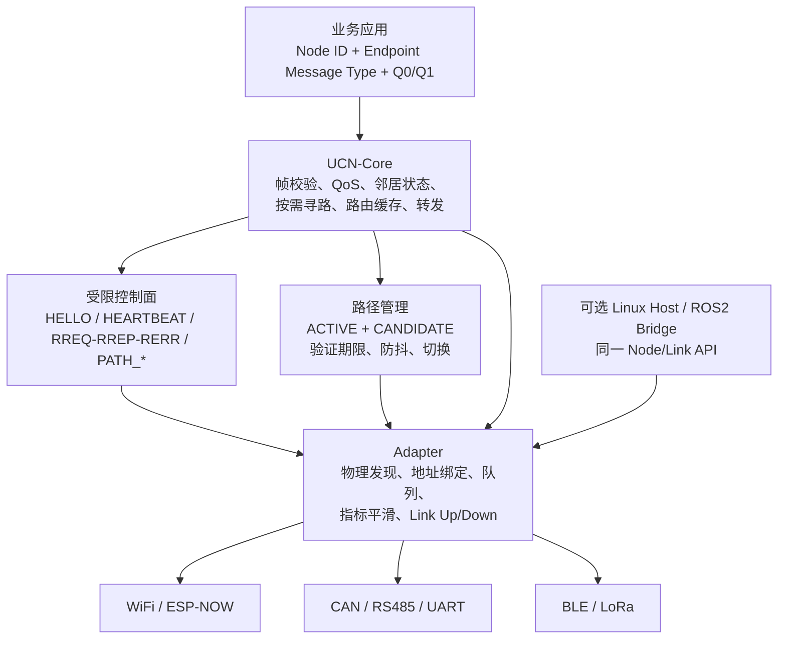

# UCN 更新后设计方案：MCU 自组网、稳定入离网与受限自动选路

> 状态：**UCN v4 Core 已实现：Route Epoch/grace、受保护业务 Provider、透明中继、Endpoint Q1 等待、受认证 Path ID 逐跳表、按需路径追踪、按需节点快照与受授权策略诊断；真实 Adapter、生产密码/身份和多板 Path 验证仍未完成。**
> 日期：2026-08-08  
> 适用范围：MCU-first 的 UCN-Core、跨介质 Adapter、可选 Linux Host；覆盖节点入离网、动态路由刷新、候选路径验证与故障恢复。  
> 关联资料：[整体架构设计](UCN_整体架构设计.md) · [协议分层与配置档案](UCN_协议分层与配置档案.md) · [路由缓存与自动选路建议](UCN_路由缓存与自动选路建议.md) · [节点入离网与网络稳定性建议](UCN_节点入离网与网络稳定性建议.md) · [任务表](00-任务表.md)

## 1. 设计结论

更新后的 UCN 仍是一套给 MCU 使用的轻量自组网 Core：**Linux 只是普通 Host Adapter，不是路由前提、中心节点或控制器。**

本次更新不把 UCN 改造成 ESP-WIFI-MESH 的单介质树，也不把它复制成 Reticulum 的主机级通用网络栈。最终采用以下组合：

1. 保留 UCN 的 Node ID、按需 AODV-Lite、固定 Route Cache、Q0/Q1、跨介质 `route_cost` 与固定内存模型。
2. 增加一跳邻居健康状态机，让节点能主动发现静默离网、回收 Link 槽位，并抑制大量节点同时入网造成的控制流量。
3. 将多跳路径分为 `ACTIVE` 和最多一条 `CANDIDATE`；旧路径继续承载业务，候选路径先用无副作用 Probe 验证，成功后才切换。
4. 控制面采用“按需、限频、去重、随机退避、固定队列”的策略。新节点出现或局部链路变差，不触发全网拓扑表同步。
5. 适配器负责 RSSI、SNR、丢包、重试、CRC、Bus-Off、队列等介质指标的采样与平滑；Core 只使用通用 Link 状态和 `route_cost`。
6. 正常业务数据以现有 1 B `message_type` 作为静态 Endpoint 标识，不增加服务信封；只有后续动态服务目录才进入 UCN-Extended。

### 1.1 不变的边界

| 项目 | 更新后仍然成立的设计约束 |
| --- | --- |
| MCU 独立运行 | 仅 MCU 节点也能发现邻居、按需寻路、转发和恢复；没有 Linux 仍可自组网。 |
| Linux 的定位 | Linux/ROS2 通过同一 Link/Node API 接入，是普通节点或 Gateway，不参与 MCU 网络的必经转发。 |
| 内存模型 | 无动态分配、无完整全网拓扑表、所有表和队列都由编译期宏限定。 |
| 介质抽象 | Core 不出现 WiFi MAC、CAN ID、串口号、RSSI 等专有概念；这些只存在于 Adapter。 |
| 应用语义 | Core 负责“发给哪个 Node、如何到达”；静态 Endpoint 用 `message_type` 区分 IMU/气压计/温度。动态服务目录、订阅、Q2/Q3 可靠业务仍在 Extended。 |

## 2. 当前 v4 Core 与产品落地的边界

| 能力 | 当前 v4 Core 实现 | 产品/实机后续 |
| --- | --- | --- |
| 入网 | Candidate Link、双向 `HELLO`、Manual/Open/Provider 准入、Candidate 5 s 超时，以及 `ADMITTED → SUSPECT → REMOVED`/动态 Link 槽回收。 | 入网随机退避、令牌桶、真实 Adapter 地址池。 |
| 离网发现 | Driver Down 立即清动态路径；无驱动事件时一跳 Heartbeat/认证业务刷新存活，默认 3 s SUSPECT、4 s REMOVED。 | 按介质/功耗冻结实机 Profile。 |
| 多跳路由 | Active/Candidate 固定表、初始 RREP Epoch、Current/Previous Route Epoch 和默认 1 s grace。 | 实机窗口标定。 |
| 最优路径 | 已使用路由在刷新窗口发受限 Candidate RREQ；候选至少低 20% Cost，经 3 次 Probe/ACK 才 Activate；未知 Cost 默认 1000。 | Adapter Cost 抖动连续窗口和实机门限。 |
| 切换 | 旧 Active 持续承载业务直到 Activate ACK；Activate/ACK 携带 Epoch，旧出口在 grace 内可按 Epoch 转发。 | 已交给驱动的帧不迁移；仍不承诺零乱序/零丢失。 |
| 控制面保护 | RREQ/Probe/Activate/Heartbeat 有固定源端 Token、最小间隔、固定统计和队列上限。 | HELLO 随机退避、每 Adapter/每 Link 空口配额。 |
| 路径诊断 | `PATH_TRACE_REQ/REPLY` 逐跳记录 Node ID，固定 Pending/Reverse 表反向返回，独立低频 Token；仅查询当前 Cache，不触发 RREQ。 | 三板 Trace 时延/断链/重组网、产品 Trace ACL 与拓扑保密策略。 |
| 节点快照 | `NODE_SNAPSHOT_REQ/REPLY` 受限泛洪，一次窗口汇总可达 Node ID 与直接 Link 数；中继只存短期 Reverse，源端固定结果表。 | 五节点收集率、空口负载、网络分区、默认 ACL 的产品授权表与完整邻接图策略。 |
| 策略诊断 | `POLICY_DIAGNOSTIC_REQ/REPLY` 经目标 ACL 授权后单播查询一个固定 Policy/Path/Flow/quality 槽位或 Summary 页；8 B 请求、32 B 回复、独立 Token。 | 管理 ACL/Security Provider、真实时延/控制开销、多板并发诊断与故障环境。 |
| 指定 Path、固定主备与 Q1 均衡 | 40 B Path Header、默认 8 项逐跳表、受认证安装/撤销、Path AAD、透明 E2E 中继、Path 范围 RERR；Endpoint `PINNED_STRICT`/`PINNED_FAILOVER`；以及默认不配置的 `AUTO_BALANCE`。均衡仅 Q1，按 Flow 租约绑定 Primary/Backup Path 集成员，持续拥塞或 Down 才重绑。 | 至少四板实测授权/故障/资源/时延、实际负载比例、P50/P95、丢失与乱序。 |
| 同节点多类数据 | 已有静态 Endpoint `0x40～0xBF`、专用发送 API、固定分发表；`latest_value` 按“目的节点 + Message Type”合并。 | 产品 ABI、Endpoint ACL 与动态目录另列 T19/T15。 |

其中 `HEARTBEAT`、`CANDIDATE`、`PATH_PROBE/ACK`、`PATH_INSTALL/REVOKE`、`PATH_TRACE_REQ/REPLY`、`NODE_SNAPSHOT_REQ/REPLY`、`POLICY_DIAGNOSTIC_REQ/REPLY`、Route Epoch、36 B 路由扩展、40 B Path Header、grace、Tag 线格式和透明中继已在 v4 Core 实现。测试覆盖的是 C99 虚拟 Link；生产安全和真实无线性能仍不可由此宣传。

## 3. 总体架构



### 3.1 模块职责

| 模块 | 必须负责 | 明确不负责 |
| --- | --- | --- |
| 应用 | 指定目标 Node、静态 Endpoint Message Type、Q0/Q1、截止时间；对 Q1 使用业务序号/时间戳。 | 不直接挑选 WiFi/CAN/串口，不维护下一跳。 |
| UCN-Core | 帧、Network ID、TTL、QoS、认证调用边界、路由转发、状态机和固定表。 | 不读取 RSSI，不调用 ESP-IDF/WiFi/LwIP，也不保存全网节点图。 |
| 路由管理 | 维护 Active/Candidate、候选验证、防抖、切换、RERR 失效和统计。 | 不直接扫描无线或决定物理地址。 |
| Adapter | 物理发现、MAC/CAN/站号映射、收发队列、Link 状态、指标归一化。 | 不解析应用数据或保存全网路由。 |
| Security Provider | 对已准入邻居和控制帧做认证/ACL/重放保护。 | 不决定链路质量或自动选择介质。 |
| Host | 将 socket、ROS2、串口等映射为普通 Link。 | 不成为所有 MCU 消息的中心。 |

## 4. 核心数据模型

### 4.1 邻居状态机（T18）

```text
EMPTY → CANDIDATE → ADMITTED → SUSPECT → REMOVED
                  └──────────→ REJECTED
```

| 状态 | 进入条件 | 允许动作 | 离开条件 |
| --- | --- | --- | --- |
| `EMPTY` | 空闲固定槽。 | 等待 Adapter 发现物理端点。 | 发现端点后进入 `CANDIDATE`。 |
| `CANDIDATE` | 物理地址已绑定，`peer_node_id = 0`。 | 仅收发最小 HELLO/准入控制帧。 | 双向 HELLO 且策略通过进入 `ADMITTED`；超时进入 `REMOVED`；拒绝进入 `REJECTED`。 |
| `ADMITTED` | 已验证 Node ID 和准入策略。 | 一跳业务、路由控制、认证 Heartbeat。 | 驱动 Down 立即进入 `REMOVED`；连续保活失败进入 `SUSPECT`。 |
| `SUSPECT` | 连续丢失保活或错误累积。 | 允许极短恢复窗口和必要的确认帧；不能被 T17 选为新的最优候选出口。 | 收到认证业务/Heartbeat ACK 回到 `ADMITTED`；恢复窗口到期进入 `REMOVED`。 |
| `REMOVED` | 明确离网或超时。 | 清路由、清 Node ID、解除 Adapter 地址绑定、回收 Link 槽。 | 再次发现物理端点时作为新 `CANDIDATE`。 |
| `REJECTED` | Provider/ACL/身份校验失败。 | 只记录有限诊断计数。 | 退避期结束后才允许重新以 Candidate 尝试。 |

任意一跳收到的**认证有效**业务帧、HELLO 或 Heartbeat ACK 都应更新 `last_seen_ms`。仅“本机把包交给下一跳驱动”不等于远端仍然存活。

### 4.2 路由状态机（T17）

每个目的地最多保存一条业务活动路径和一条正在验证的候选路径。这样资源上界可预测，且不会因多条备份路径压垮 MCU。

```text
NO_ROUTE ── RREQ/RREP ──> ACTIVE
                              │
                   刷新窗口/持续质量恶化
                              ↓
                        REFRESHING
                         │        │
                  候选失败 │        │ Probe + ACTIVATE 成功
                         │        ↓
                         └──── ACTIVE(new) + GRACE(old)
                                      │
                          Link Down / RERR / 验证失效
                                      ↓
                                  INVALID → NO_ROUTE
```

| 字段/状态 | 含义 |
| --- | --- |
| `ACTIVE` | 当前业务路径：`destination`、出口 Link、总 Cost、Hop、`route_epoch`、`validated_until_ms`。 |
| `CANDIDATE` | 最多一条候选：同样保存出口、Cost、Hop、`candidate_id`、过期时间和 Probe 统计；未通过前绝不覆盖 `ACTIVE`。 |
| `last_used_at_ms` | 最近业务使用时间，只服务 LRU/诊断，不能续租端到端可达性。 |
| `validated_until_ms` | 由 RREP、Probe ACK 或后续端到端确认更新的路径验证期限。 |
| `GRACE` | 切换后旧 `route_epoch` 的短暂保留窗口，只服务已在途旧帧；超时必须释放。 |
| `INVALID` | Link Down、RERR、安全拒绝、验证过期等明确故障后立即不可用。 |

### 4.3 固定资源原则

新增能力只能增加固定数组，不能引入链表、堆、无限重传表或完整拓扑图。建议的配置形态如下，具体数量由 RAM 测试冻结：

| 宏/资源 | 当前默认值 | 更新后的要求 |
| --- | --- | --- |
| `UCN_MAX_LINKS` | 4 | 保持编译期可配置。 |
| `UCN_MAX_NEIGHBORS` | 8 | 每项追加存活时间、状态、少量错误/漏包计数。 |
| `UCN_MAX_ROUTES` | 8 | 每项保留 Active；只对活跃目的地按固定上限分配 Candidate。 |
| Candidate 数 | 当前无 | 建议独立 `UCN_MAX_ROUTE_CANDIDATES`，默认从 1～2 起实测；满时只保留更高优先级或更接近验证到期的候选。 |
| Q0/Q1 | 各 4 | Q0 永远优先；控制帧不得占满 Q0。控制面使用独立、小容量、限速队列。 |
| Adapter RX 队列 | 2 帧 | 保持固定；Adapter 回调只入队，`ucn_node_step()` 在任务上下文完成协议处理。 |

每个目标板 Profile 必须在构建产物中报告 `sizeof(ucn_node_t)`、各 Adapter 静态对象大小、队列帧数、最大帧长、Flash 与任务栈占用。设计阶段不写死“占用多少 RAM”。

### 4.4 业务 Endpoint 与同节点数据分发（T19）

路径和数据类别必须分层：Route Cache 只回答“到 Node C 的下一跳是什么”，Endpoint 才回答“这帧是 C 的哪个 IMU、气压计或温度数据”。因此，无论同一节点提供多少种数据，到该节点的多跳路径都只保存一条 Active 和最多一条 Candidate，不为每种传感器复制路由。

#### 4.4.1 默认：静态 Endpoint，不增加任何业务帧字节

当前 `ucn_node_send()` 接受任意 1 B `message_type`；Core 只特殊处理已定义的 HELLO、RREQ、RREP、RERR 等控制值，其余值会随帧转发并在目标节点交给应用。当前 Q1 `latest_value` 队列也以 `(destination, message_type)` 作为覆盖键。

因此，MCU 产品的默认方案冻结如下：

| 范围 | 用途 | 规则 |
| --- | --- | --- |
| `0x00～0x3F` | UCN-Core 控制面保留 | 只能由协议定义使用，应用禁止占用。 |
| `0x40～0xBF` | 产品静态 Endpoint | 每个 Node 的 Endpoint 表中唯一；可在不同源 Node 上复用相同编号。 |
| `0xC0～0xFF` | 实验/厂商临时扩展 | 不作为跨产品长期兼容接口；正式稳定后应迁入静态 Endpoint 表。 |

示例静态表应以 `ucn_endpoints.h` 或等价的产品配置文件维护：

```text
Node C
0x40  IMU0_RAW_V1        Q1 + latest_value
0x41  IMU1_RAW_V1        Q1 + latest_value
0x42  BAROMETER0_V1      Q1 + latest_value
0x43  TEMPERATURE0_V1    Q1 + latest_value
0x60  MOTOR0_COMMAND_V1  Q0
```

一帧从 C 到 A 的 IMU 数据只需：

```text
UCN 基础头：source=C, destination=A, message_type=0x40, traffic_class=Q1
Payload：IMU0_RAW_V1 的实际二进制数据
```

接收端以 `(source_node_id, message_type)` 分发到对应解码器。源 Node ID 已区分“C 的 IMU0”和“D 的 IMU0”；同一 Node 的多个同类设备使用不同 Endpoint Type。因为 Endpoint 已在帧头，正常业务帧仍是 `32 B 固定头 + 实际数据`，有效率为 `payload / (32 + payload)`，不必为每帧增加 4 B 服务信封。

这个设计还保证 Q1 队列正确：C 同时向 A 发送 `0x40` IMU 和 `0x42` 气压计时，`latest_value` 只会覆盖同一 Endpoint 的旧值，不会把 IMU 覆盖成气压计。静态 Endpoint 表属于产品 ABI，编码字段、单位、字节序和版本必须随编号冻结；不能只凭“Payload 长度不同”猜测数据类型。

#### 4.4.2 后续 Extended：动态 Endpoint 目录与订阅

只有存在运行时挂载传感器、节点能力未知、单节点 Endpoint 超过静态范围或需要按频率订阅时，才开启 Extended 服务目录。它不替换静态 Endpoint，也不在每个普通传感器帧上强制增加字段。

```text
A → C：SERVICE_QUERY
C → A：SERVICE_ANNOUNCE（endpoint_id、名称/类别、编码版本、权限、可用频率）
A → C：SUBSCRIBE（endpoint_id、instance、频率、租约）
C → A：ENDPOINT_DATA（endpoint_id、instance、版本、业务数据）
```

`ENDPOINT_DATA` 可使用 4 B Extended 信封：`endpoint_id`（16 bit）、`instance_id`（8 bit）、`schema_version`（8 bit）。启用后，发送队列的 `latest_value` 覆盖键必须升级为 `(destination, endpoint_id, instance_id)`；订阅、能力、ACL 和租约表均需固定容量、认证和超时回收。禁止在节点入网时向全网广播完整服务目录，只允许静态配置、明确查询或受限本地缓存。

Endpoint ACL 必须细化到 `(源 Node、目标 Node、Endpoint、操作)`。例如温度 Endpoint 可以允许订阅，`MOTOR0_COMMAND` 则只能允许明确控制节点的 Q0 命令。

#### 4.4.3 节点内任务通信：Endpoint 挂载到 Service，而不是把 Task 变成 Node（T25）

一个 MCU 对外仍只有一个 Node ID、一个 Neighbor/Route/Security 实例和一个协议任务；IMU、控制、舵机和电源等 FreeRTOS 任务是该 Node 内的静态 Service。每个 Service 绑定一个或多个 Endpoint 与固定 Inbox。业务任务使用统一 `destination Node ID + Endpoint + QoS + Payload` 语义：目标为本机时直接投递 Inbox；目标为远端时经固定 TX Request Queue 交由唯一协议任务调用 `ucn_node_send_endpoint()`。

```text
Task A → Service Router
       ├─ 本机 Node + Endpoint → Task B Inbox（无帧、无 Link、无寻路）
       └─ 远端 Node + Endpoint → Protocol Task → UCN Core → 路由/Link
```

当前 v4 Core 仍只具备协议任务上下文的固定 Endpoint 回调；T25.1 已在 Core 外实现纯 C `ucn_service` Router，T25.2 已以独立 Bridge 让唯一 Protocol Task 有界地将 Remote TX 交给 Core，且将目标 Endpoint callback 投递回 Router。T25.3 才接 FreeRTOS Queue/任务通知。整个 T25 均保持 Core 无 RTOS 依赖、静态表和静态队列；Q1 使用按 Endpoint 的 Latest Value Inbox，Q0 使用有界 FIFO，舵机的 PWM/限位/超时安全始终在本机任务完成。任务重启不得触发 Node 离网；Service 未就绪、Endpoint 未注册或 Inbox 满必须显式失败/计数。Endpoint callback 没有端到端 ACK 返回值，因此目标 Service 拒绝只能记本机统计，可靠确认留给后续独立能力。完整设计与测试门禁见[节点内任务通信建议](UCN_节点内任务通信建议.md)。

### 4.5 按需安全策略与透明加密转发（T15）

安全不是按“无线/有线”隐式决定，也不要求所有 Node 的所有帧都加密。产品按 **Node 默认策略 + Endpoint 覆盖策略 + 对端身份/密钥表** 配置：一个 Node 可默认发送明文、加密或按策略自动选择；接收端可设为 `PLAIN_ONLY`、`ENCRYPTED_ONLY` 或显式允许 `BOTH`。`BOTH` 不表示认证失败后可降级为明文；对 `ENCRYPTED_ONLY` Endpoint，没有可用密钥或 Tag 校验失败必须拒绝。

业务加密的默认目标是端到端 Payload AEAD：源 Node 为最终目标 Node 加密 Payload，路由头保留给中继按目的地与 Hop Limit 转发；中继不持有端到端业务密钥，可以透明转发密文，最终目标完成 Tag 校验、解密、重放检查和 Endpoint ACL 后才分发给应用。高风险 `MOTOR0_COMMAND` 可设为“只接收加密帧且仅允许飞控来源”，普通温度 Endpoint 则可配置为明文或两者皆可。

```text
A（加密业务 Payload） → B（只读路由头，透明转发） → C（验 Tag、解密、ACL、业务分发）
```

透明中继不能修改端到端受保护的来源、目的、Endpoint、Session、Sequence、业务密文等不可变数据；但允许按协议改写 Hop Limit、路径扩展和 CRC。v4 Core 已提供固定 AAD、Tag 和 `seal/open` Provider 契约；可变/不可变字段、生产密钥和实际 AEAD 见[按需加密与透明转发建议](UCN_按需加密与透明转发建议.md)。

## 5. 协议演进设计

### 5.1 最新目标设计：单帧到底包含什么

UCN 的一帧始终分为“网络头 + 可选路径扩展 + Payload”。正常稳定通信不会把路由表、RSSI、Cost、邻居表、服务目录、MAC/CAN ID 或 Linux 信息塞进每一帧；这些信息分别保存在本地 Route Cache、Adapter、邻居表或 Extended 目录中。

#### 5.1.1 正常静态 Endpoint 业务帧（最常用）

```text
Byte  0.. 1  Magic                 2 B   0x55 0x43
Byte       2  Protocol Version      1 B   当前为 v4
Byte       3  Message Type          1 B   静态 Endpoint，例如 0x40 = IMU0_RAW_V1
Byte       4  Traffic Class         1 B   Q0 / Q1
Byte       5  Flags                 1 B   `ROUTE_EXTENSION=0x01`；`E2E_PROTECTED=0x02`
Byte       6  Hop Limit             1 B   每经一个中继减 1
Byte       7  Header Size           1 B   正常业务固定为 32
Byte  8..11  Network ID             4 B   UCN 网络身份
Byte 12..15  Source Node ID         4 B   原始发送节点，例如 C
Byte 16..19  Destination Node ID    4 B   最终接收节点，例如 A
Byte 20..23  Sequence               4 B   源节点帧序号，用于去重/乱序判断
Byte 24..27  Session ID             4 B   会话/安全边界
Byte 28..29  Payload Length         2 B   仅业务 Payload 的长度
Byte 30..31  CRC-16                 2 B   头部与业务 Payload 完整性校验
Byte 32..N   Business Payload      0..224 B
```

例如，C 向 A 发送 IMU0 原始数据：

```text
source=C, destination=A, message_type=0x40, traffic_class=Q1
payload=[IMU0_RAW_V1 的时间戳、加速度、角速度等实际数据]
```

这帧已经同时表达了：**哪个网络、谁发、发给谁、是什么 Endpoint、优先级、还能转发几跳、是否重复、业务数据有多长、内容是否损坏。**

其中“IMU0/气压计/温度”的区分只占用现有的 1 B `message_type`，不再增加 4 B 服务信封。接收端用 `(source_node_id, message_type)` 找到静态 Endpoint 解码器；同一节点的多个传感器使用不同 Type，例如 `0x40/0x41/0x42`。

正常帧的总长度是：

```text
frame_bytes = 32 B + business_payload_bytes
```

默认最大帧为 256 B，所以静态 Endpoint 的实际业务 Payload 最大为 224 B。

#### 5.1.2 端到端受保护的静态 Endpoint 业务帧（按需）

只有发送/接收策略和 Endpoint ACL 要求加密时，才在正常业务 Payload 后附加 AEAD Tag；它不是所有帧的固定字段：

```text
Byte  0..31  与正常业务帧相同，Flags 的 E2E_PROTECTED 置位
Byte 32..N   Ciphertext Business Payload  0..208 B
Byte N+1..N+16 AEAD Tag                    16 B
```

`Payload Length` 仍只表示业务明文/密文的 `P` 长度，不包含 Tag；正常受保护帧总长为：

```text
frame_bytes = 32 B + business_payload_bytes + 16 B
```

路由头保持可见以支持不持有业务密钥的透明中继。最终目标以不可变头字段作为 AAD 验 Tag 后才解密 Payload；中继只能递减 Hop Limit、按规则处理路径扩展并重算 CRC。默认最大帧 256 B 时，加密业务 Payload 最大为 208 B。

#### 5.1.3 路由切换窗口中的业务帧

所有经动态多跳 Route Cache 发送的业务帧携带 4 B Route Extension；这使首次动态路径和切换期都能按 Epoch 转发。直连/静态路径可保持 32 B：

```text
Byte  0..29  与正常帧相同，但 Header Size = 36，Flags 标识有路径扩展
Byte 30..31  route_epoch           2 B   当前应走的路径版本
Byte 32..33  reserved               2 B   当前必须为 0，留作以后扩展
Byte 34..35  CRC-16                 2 B   覆盖变长头（含 Route Extension）和 Payload
Byte 36..N   Business Payload      0..220 B
```

```text
frame_bytes = 36 B + business_payload_bytes
```

`route_epoch` 让中继区分 Current/Previous 路径；它不是 IMU/温度类别，也不替代 `message_type`。Previous 默认在 1 s grace 后释放；当前 Active 动态路径继续带自身 Epoch。

#### 5.1.4 控制帧

控制帧使用相同网络头，但 `message_type` 落在 Core 保留范围，Payload 改为控制信息：

| 帧 | `message_type` | 正常头长 | Payload 内容 |
| --- | --- | ---: | --- |
| 邻居发现 | `HELLO (0x01)` | 32 B | 4 B：Node ID。 |
| 路由发现 | `ROUTE_REQ (0x10)` | 32 B | 16 B：源、目标、请求 ID、累计 Cost、Hop。 |
| 路由应答 | `ROUTE_REPLY (0x11)` | 32 B | 18 B：源、目标、请求 ID、Cost、Hop、Route Epoch（Candidate RREP 的 Epoch 为 0）。 |
| 路由错误 | `ROUTE_ERROR (0x12)` | 32 B | 4 B：不可达目标 Node ID。 |
| 邻居保活 | `HEARTBEAT (0x13)` | 32 B | 目标 8 B：请求/ACK、序号、nonce 等。 |
| 候选验证 | `PATH_PROBE/ACK (0x14/0x15)` | 32 B | 目标 12 B：candidate ID、Probe 序号、nonce。 |
| 路径激活 | `PATH_ACTIVATE/ACK (0x16/0x17)` | 32 B | 6 B：Candidate ID + Route Epoch。 |
| 路径追踪 | `PATH_TRACE_REQ (0x18)` | 32 B | 8 B 前缀 + Node ID 列表：Trace ID、记录数/上限、状态、逐跳 Node ID。 |
| 路径追踪回复 | `PATH_TRACE_REPLY (0x19)` | 32 B | 同一载荷，沿中继短期 Reverse 表返回 `OK/NO_ROUTE/TTL/TRUNCATED`。 |
| 策略诊断请求 | `POLICY_DIAGNOSTIC_REQ (0x1E)` | 32 B | 8 B：Request ID、Section、固定槽/页 Index、保留。目标必须显式授权请求 Node。 |
| 策略诊断回复 | `POLICY_DIAGNOSTIC_REPLY (0x1F)` | 32 B | 32 B：Request ID、Section、Index、状态和 24 B 固定记录；适配 64 B Profile。 |

控制帧只在入网、心跳、路径刷新、故障或候选切换时出现；它们不是每个普通 IMU/温度业务帧都必须附带的额外字段。

#### 5.1.5 后续动态 Endpoint 帧（仅 UCN-Extended）

当产品确实需要运行时发现未知服务、订阅频率或单节点超过静态 Endpoint 范围时，才使用 Extended：

```text
基础头：message_type = ENDPOINT_DATA（编号由 T19.2 冻结）
Payload：endpoint_id(2 B) + instance_id(1 B) + schema_version(1 B) + business_data
```

这比静态 Endpoint 每帧多 4 B，因此不应成为普通 MCU 传感器流的默认方式。动态目录、`SERVICE_QUERY`、`SERVICE_ANNOUNCE`、`SUBSCRIBE` 的本体也都是低频控制帧，不进入普通数据帧。

### 5.2 版本与兼容性

当前实现为 `UCN_PROTOCOL_VERSION = 4`，支持 32 B 基础头、36 B Route Extension 和 40 B Path Header；v3/v4 不在同一 Network ID 内直接互通。升级采用全网同批升级，或由后续独立 Gateway 显式转换，不能静默混用。

v4 保留 32 B 基础头，并实现受标志位控制的 4 B 路由扩展：

| 内容 | 目标设计 |
| --- | --- |
| 基础头 | 延续 Magic、Version、Network ID、源/目的 Node ID、序号、Session、TTL 等既有基本语义。 |
| `header_size` | v4 解码器支持 32 B 正常头、36 B Route Extension，或同时带 Route Extension/Path Flag 的 40 B Path Header；Payload 从 `header_size` 指定的位置开始。 |
| CRC 位置/范围 | 32 B 头的 CRC 位于 30..31；36 B 头的 CRC 位于 34..35；40 B Path Header 的 CRC 位于 38..39，均覆盖 CRC 之前的全部头字段及 Payload/可选 Tag。 |
| Route Extension | `route_epoch`（16 bit）+ 16 bit 保留；动态业务帧携带它。 |
| Path Extension | 40 B 头在 Route Extension 后加入非零 `path_id`（32 bit）；它由 `(owner Node, owner Session, Path ID, Destination)` 的固定逐跳表解释，不能替代 `route_epoch`。 |
| 按需端到端加密 | `E2E_PROTECTED` Flag 表示 `Payload` 后固定附加 16 B Tag；明文/加密由 Node 默认策略和 Endpoint 覆盖决定，Tag 不计入 `Payload Length`。 |
| 按需路径追踪 | `DIAGNOSTIC=0x04` 标识 Trace 控制帧，不改变 32 B 头；Trace 控制帧不得带 `E2E_PROTECTED`，中继需读取并追加 Node ID。 |
| 按需节点快照 | `NODE_SNAPSHOT_REQ/REPLY` 共用 `DIAGNOSTIC=0x04`，Request 为 8 B、Reply 为 12 B Payload；请求泛洪、Reply 沿短期 Reverse 回源，默认 ACL 拒绝。 |
| 按需策略诊断 | `POLICY_DIAGNOSTIC_REQ/REPLY` 共用 `DIAGNOSTIC=0x04`，Request 为 8 B、Reply 为 32 B Payload；只单播到一个已可达目标、默认 ACL 拒绝，独立 Token 和固定 Pending/Reply Queue。 |
| 小 MTU 影响 | 带扩展的帧可用载荷比基础头少 4 B；小于基础头的 Carrier 仍由 T16 Adapter 分段/重组解决。 |

字节序、标志位、CRC 覆盖范围和 v3→v4 拒绝已由 v4 编解码器和协议向量测试冻结。

### 5.3 控制报文

| 报文 | 方向/范围 | 最小目标载荷 | 作用 |
| --- | --- | --- | --- |
| `HELLO` | 一跳，不转发 | 保持当前最小 Node ID 准入信息。 | 物理 Candidate 与 Node ID 绑定。 |
| `HEARTBEAT` (`0x13`) | 一跳，不转发 | 8 B：类型、序号、标志、nonce/本地时间字段。 | 双向存活确认；请求由对端 ACK 回显序号。 |
| `ROUTE_REQ/REPLY/ERROR` | 多跳，受 Hop Limit/去重约束 | 延续目标、源、请求 ID、Cost、Hop；候选以 `request_id` 作为 `candidate_id`。 | 按需发现、建立候选/活动转发表、明确故障失效。 |
| `PATH_PROBE`（建议 `0x14`） | 仅候选路径 | 12 B：`candidate_id`、Probe 序号、标志、nonce。 | 无业务副作用地验证候选可达性、RTT、丢包和抖动。 |
| `PATH_PROBE_ACK`（建议 `0x15`） | 目标回源，沿候选反向路径 | 回显 12 B。 | 证明候选路径双向可达。 |
| `PATH_ACTIVATE`（建议 `0x16`） | 沿已验证候选路径 | `destination`、`candidate_id`、新 `route_epoch`、grace 参数。 | 让候选路径的所有中继安装新 Epoch 转发表。 |
| `PATH_ACTIVATE_ACK`（建议 `0x17`） | 目标回源 | 回显激活信息。 | 源节点收到后才让新业务帧改走新 Epoch。 |
| `PATH_INSTALL`（`0x1C`） | 已授权管理节点到指定 Node | 16 B：Path ID、目标、下一跳、租约。 | 在源/中继/终端安装或更新一项固定逐跳 Path；既需 Provider 又需显式 Path 授权。 |
| `PATH_REVOKE`（`0x1D`） | 已授权管理节点到指定 Node | 8 B：Path ID、目标。 | 幂等撤销一项固定 Path；不影响同目标的其它 Path。 |
| `PATH_TRACE_REQ`（`0x18`） | 当前 Route Cache 单播 | Trace ID、记录数量/上限、状态 0 与源 Node ID。 | 逐跳追加实际经过的 Node；没有 Cache 立即返回，不触发 RREQ。 |
| `PATH_TRACE_REPLY`（`0x19`） | 目标/失败中继回源 | 同一列表与结果状态。 | 中继按 `(origin, trace_id)` 的固定 Reverse 表回送，源端回调一次结果。 |
| `NODE_SNAPSHOT_REQ`（`0x1A`） | 受限广播 | 8 B：Query ID + 保留。 | 所有被授权节点只首次处理/转发，建立 `(origin, query_id)` 短期 Reverse 并排队自身回包。 |
| `NODE_SNAPSHOT_REPLY`（`0x1B`） | 每个响应节点回源 | 12 B：Query ID、Node ID、直接 Link 数、标志。 | Reply 沿 Reverse 回送；源端固定表按 Node ID 去重，窗口结束交付完整或截断结果。 |
| `POLICY_DIAGNOSTIC_REQ`（`0x1E`） | 管理 Node 到一个目标 | 8 B：Request ID、Section、Index、保留。 | 只读取目标自身已有固定 Policy/Path/Flow/quality/统计，不触发 RREQ、不泛洪、不增加业务帧字段。 |
| `POLICY_DIAGNOSTIC_REPLY`（`0x1F`） | 目标回管理 Node | 32 B：Request ID、Section、Index、状态、24 B 记录。 | 目标经显式 ACL 后低优先级排队回复；源端固定 Pending 超时交付结果。 |
| 静态 Endpoint 数据 | 端到端，按 Route Cache 转发 | 不新增控制载荷；`message_type=0x40～0xBF`，Payload 按产品静态表解释。 | 用零额外业务帧开销区分同节点的不同数据。 |

所有控制报文都必须先经过 Network ID、邻居准入和 Security Provider 校验。候选 `PATH_PROBE/ACTIVATE` 不交给应用回调；Trace 仅在源端匹配 Pending 项后调用专用 Trace 回调，不能用真实电机命令、参数写入或传感器业务帧冒充控制面。

### 5.4 为什么需要 `candidate_id` 与 `route_epoch`

只让源节点保存候选下一跳是不够的。探测帧到达中继后，如果中继仍按旧的 `destination → egress_link` 查表，数据会回到旧路径，候选路径根本没有被验证。

因此：

1. RREQ/RREP 创建候选时，以 `candidate_id` 在所有候选中继中建立 `(destination, candidate_id) → candidate_egress_link`。
2. Probe 使用 `candidate_id`，使每个中继明确从候选出口转发。
3. Probe 达标后，`PATH_ACTIVATE` 把该候选转换为 `(destination, route_epoch) → new_egress_link`。
4. 源节点收到 `PATH_ACTIVATE_ACK` 后，新的业务帧带新 `route_epoch`；旧 Epoch 继续保留一个很短的 grace window。
5. grace 到期后所有节点释放旧 Epoch 表项；候选失败则直接清 Candidate，不影响 Active 业务。

## 6. 运行流程

### 6.1 节点接入

```text
Adapter 发现物理端点
      ↓
固定 Link 槽绑定为 CANDIDATE（peer_node_id = 0）
      ↓
随机退避后发送/接收一跳 HELLO
      ↓
Security Provider / ACL 校验
      ↓
ADMITTED：允许一跳业务与控制面
      ↓
首次需要访问远端 Node 时，才按需 RREQ/RREP
```

接入不会广播完整节点名单，也不会清空全网 Route Cache。单节点成本应限制为本地 HELLO、准入和必要的父/邻居表项；只有真正访问该节点的源才产生多跳 RREQ。

### 6.2 邻居健康与离网

```text
ADMITTED
   │  认证业务/Heartbeat ACK
   ├──────────────────────────→ 刷新 last_seen_ms
   │
   ├─ 驱动明确 Link Down / Bus-Off → REMOVED（立即）
   │
   └─ 连续 N 次 Heartbeat 未确认 → SUSPECT
                                      │
                         恢复确认 ────┼──→ ADMITTED
                                      │
                              grace 超时
                                      ↓
                                   REMOVED
                                      ↓
                   清路由 + RERR + 解绑物理地址 + 复用 Link 槽
```

`REMOVED` 只能影响经过该邻居的路径，不得重置无关节点的缓存。若 Active 路径失效，T17 可立即进入受限恢复；若只是 Candidate 的邻居失效，只丢弃 Candidate，旧业务仍保持在 Active。

### 6.3 正常路径刷新与候选探测

```text
业务帧继续走 ACTIVE
       │
       ├─ 距 validated_until_ms 尚远，且质量稳定：不发送网络探测
       │
       └─ 到刷新提前量 / Cost 持续恶化：进入 REFRESHING
                    │
                    ├─ 受控 RREQ/RREP 找到 CANDIDATE
                    ├─ 3 次低频 PATH_PROBE/ACK 验证
                    ├─ 候选不达标：释放 Candidate，ACTIVE 不变
                    └─ 候选达标：PATH_ACTIVATE/ACK → 新帧切到新 Epoch
```

切换是“从一个新帧边界开始切换”，不是把已经交给旧 Link 驱动的帧迁移到新链路。Q1 接收端必须依据业务序号/时间戳丢弃迟到旧值；Q0 不能等待路由恢复，应有直连、预建路径或本地失效安全行为。

### 6.4 硬故障恢复

`Link Down`、Bus-Off、认证失败、连续 TX 失败、RERR 等明确故障不等待定期刷新：

1. 将对应 Active/Candidate 标记 `INVALID`。
2. 清除所有以该 Link 为出口的动态路径；若为转发节点，向上游发送受限 `ROUTE_ERROR`。
3. 只对仍有业务需求的目的地启动一次 RREQ 恢复，并设最小间隔/退避，避免故障扩散为 RREQ 风暴。
4. 恢复成功建立新 Active；恢复失败由应用收到无路由/超时结果，不能无限占用队列。

## 7. Cost、定时器与控制流量预算

### 7.1 Cost 的责任边界

Adapter 内部可以读取 RSSI、SNR、重传率、ACK 丢失、CRC、队列积压、Bus-Off、串口超时等；它们必须先平滑、去抖、归一化为一个 `uint16_t route_cost`。Core 只累加或比较 Cost，不理解其物理含义。

质量瞬时变化的处理顺序固定为：

```text
驱动采样/故障事件 → Adapter 平滑指标 → Link 状态与 route_cost
→ T18 邻居健康判断 → T17 是否需要候选发现 → Probe 验证 → 切换
```

未知/无效指标不能长期以最小默认 Cost 压过已测量链路。v4 已以 `UCN_UNKNOWN_LINK_ROUTE_COST=1000` 表示保守未知 Cost，并由测试覆盖。

### 7.2 初始 Profile（均待实机标定）

| 参数 | 稳定 WiFi / ESP-NOW 起点 | CAN / RS485 起点 | LoRa / 低功耗无线起点 |
| --- | --- | --- | --- |
| 本地质量采样 | 500 ms，无 UCN 空口帧 | 以总线错误/收发统计为主 | 收发结果驱动，不高频采样 |
| Heartbeat | 1 s + 随机抖动；3 次未确认约 3～4 s | 优先驱动状态，按控制周期配置 | 数十秒至数分钟 |
| Active 刷新 | `validated_until_ms` 前约 20% 窗口 | 30～60 s 活跃路径窗口 | 60～300 s 以上，按法规/电池调整 |
| 自动候选发现 | 同一目的地最短 5 s；连续 3 个质量窗口恶化才触发 | 明确异常或较长验证窗口 | 仅故障或明确业务需求 |
| Probe | 3 次，间隔 100～200 ms | 1～3 次轻量确认 | 1～2 次，严格受空口预算限制 |

上述不是协议常量，也不是当前实测指标。最终数值必须由 T14/T18 在指定芯片、距离、干扰、节点规模、业务周期和功耗预算下报告 P50/P95/最坏值后冻结。

### 7.3 控制面预算

| 控制类型 | 约束 | 目的 |
| --- | --- | --- |
| HELLO | 每 Candidate 随机退避、最小重发周期、最大尝试次数。 | 防止同时上电产生同步冲突。 |
| Heartbeat | 每个已准入邻居固定小帧、允许轻微抖动；业务帧可刷新存活但不能无限延长失效时间。 | 给静默离网一个有界发现时间。 |
| RREQ/RREP | 每目的地最短间隔、Hop Limit、重复请求去重、每 Link 令牌桶。 | 防止局部故障变成全网泛洪。 |
| Probe/Activate | 每候选固定次数、固定超时、固定 Candidate 表项；失败即释放。 | 防止“为了最佳路径”长期消耗空口。 |
| 控制队列 | 独立小容量，超预算时延迟/丢弃低优先级控制面。 | Q0 安全动作永远不能被控制面挤占。 |

参考 Reticulum 的经验，网络维护应按带宽预算运行而不是无限重发；参考 ESP-WIFI-MESH 的经验，邻居健康必须来自一跳状态而不是全网扫描。UCN 只吸收这些原则，不采用其主机级路径表或 WiFi 单树拓扑。

## 8. QoS 与切换期规则

| 类别 | 更新后规则 |
| --- | --- |
| Q0 关键/安全动作 | 不等待 RREQ、Probe 或候选切换；应用必须提供本地失效安全、直连或预建路径策略。 |
| Q1 实时状态 | 可用 `latest_value` 覆盖旧值；切换期允许少量丢失/乱序，接收方用业务序号或时间戳舍弃旧帧。 |
| Q2 可靠命令（后续 Extended） | 由 ACK、请求 ID、去重、超时重传实现，不在本次 Core 中隐式承诺可靠送达。 |
| Q3 大数据（后续 Extended） | 分片、流控、缓存和续传独立实现，不让其侵占 Core 固定 Q0/Q1 队列。 |

“无缝”只定义为：候选验证期间旧 Active 不被提前中断，激活成功后新帧转到新路径。它不等于绝对零丢包、零乱序，也不等于单 WiFi STA 可以同时维持两个上游 AP 关联。

## 9. Adapter 与介质落地要求

### 9.1 通用 Adapter 契约

```text
物理发现 / 驱动事件
        ↓
物理地址 ↔ 固定 Candidate Link
        ↓
Adapter RX 固定队列（回调/ISR 只入队）
        ↓
协议任务调用 ucn_node_receive() / ucn_node_step()
        ↓
Core 输出 Link 状态、路由控制和业务发送请求
```

Adapter 需要增加但不泄漏到应用层的能力：

1. 明确 `Link Up`、`Link Down`、Bus-Off、恢复、队列满等事件。
2. 缓存平滑后的 `route_cost`，让 `get_metrics()` 为常数时间读取。
3. 在 `REMOVED` 后安全解绑物理地址、清 `peer_node_id`、允许固定 Link 槽复用。
4. 提供每 Link 的控制面发送预算与统计，不能让 Core 直接操作无线扫描或 WiFi API。

### 9.2 WiFi / ESP-NOW 特别限制

WiFi/ESP-NOW Adapter 可以提供 RSSI、重试、丢包、发送完成回调等指标。但若底层采用单 WiFi STA 上游关联模式，设备在任一时刻只能关联一个父 AP：不能靠同一块单射频硬件同时保持旧、新父节点来实现真正 Make-Before-Break。

此时 UCN 应采取“保守快速恢复”：保留逻辑 Active 直到驱动报告断开，完成新关联后再重建路径；对真正需要先测后切的场景，应使用可并存的第二 Link、另一种介质或支持并发连接的底层能力。这个限制必须写入 T14 实机验收报告。

## 10. 实施顺序与测试门禁

### 10.1 分阶段实现

| 阶段 | 内容 | 完成前不得做的事 |
| --- | --- | --- |
| A：T18.1/T18.2 | `HEARTBEAT` 收发、邻居状态机、SUSPECT/REMOVED、路由清理与 Adapter 槽复用。 | 不先改多跳切换线格式。 |
| B：T18.3 | HELLO/RREQ 退避、令牌桶、控制队列和入离网统计。 | 不以“虚拟无冲突”替代并发压力测试。 |
| C：T17.1 | Active 验证期限、刷新定时器、Cost 防抖与候选发现入口。 | 不让普通业务成功自动续租黑洞路径。 |
| D：T17.2 | 已实现 Candidate 表、`PATH_PROBE/ACK`、含 Epoch 的 `PATH_ACTIVATE/ACK`、36 B Route Extension 与固定 grace。 | 不只在源节点保存候选路由，也不能承诺实机零丢包切换。 |
| E：T17.3/T17.4 | 切换策略、Q0/Q1 语义、统计、故障恢复。 | 不承诺绝对无丢包切换。 |
| F：T19.1 | 冻结 `0x40～0xBF` 静态 Endpoint 表、产品编码 ABI 与 Q0/Q1 映射。 | 不在未定义静态表时用 Payload 长度或临时常量猜测数据类型。 |
| F1：T25 | 在 Core 外实现固定 Service/Task Adapter：Endpoint→Inbox、本机直投、固定 TX Request Queue 与协议任务独占 Core。 | 不把每个任务注册为 Node，不把本机消息发送到 Link，也不让任务并发调用 `ucn_node_t`。 |
| G：T14/T15 | ESP32 实机 Adapter、真实身份/ACL、规模/功耗/干扰测试。 | 不以 Host/虚拟 Link 结果宣称实际无线性能。 |
| H：T19.2（按需） | 动态服务查询、订阅、固定目录/租约表与 Endpoint ACL。 | 不让动态目录常驻占用所有 MCU 的 RAM，或自动全网广播服务表。 |

### 10.2 单元测试

| 范围 | 必测场景 |
| --- | --- |
| 邻居 | Heartbeat 格式、认证失败、3 次漏包、SUSPECT 恢复、重复 REMOVED、物理地址解绑后复用。 |
| 控制预算 | 随机退避边界、令牌耗尽、队列满、RREQ 去重、故障时允许一次快速恢复。 |
| 路由 | Active/Candidate 共存、验证期限、未知 Cost、Candidate 满、RERR 同时影响 Active/Candidate。 |
| Probe/激活 | candidate ID 不匹配、ACK 超时、认证拒绝、激活 ACK 丢失、旧 Epoch grace 到期。 |
| QoS | Q0 不被控制队列饿死，Q1 切换期 `latest_value` 覆盖和乱序过滤。 |
| Endpoint | 控制值不能冒充业务 Endpoint、同一目的地 IMU/气压计 `latest_value` 不互相覆盖、静态 ABI 解码、Endpoint ACL 拒绝。 |
| Task Adapter | 本机直投不调用 Link、远端请求只由协议任务出队、Endpoint/任务未就绪、Queue 满、Q1 覆盖、Q0 FIFO、固定表满与 Payload 所有权。 |
| 帧兼容 | v4 32/36/40 B 头、Path Flag/长度、CRC、错误标志、Path AAD 与 v4 节点拒绝 v3。 |
| 指定 Path | 默认拒绝控制、显式授权、重复安装更新、租约/撤销、P1 RERR 不误清 P2、透明 E2E 中继不解密。 |

### 10.3 虚拟拓扑与集成测试

```text
拓扑 1：A ─ B ─ C                     断开 B-C，验证 RERR 与恢复
拓扑 2：A ─ B ─ C 和 A ─ D ─ C        Cost 恶化，候选 Probe 后切换
拓扑 3：多节点同时接入                验证 HELLO/RREQ 预算与 Q0/Q1 连续性
拓扑 4：A ─ WiFi ─ B，A ─ CAN ─ D ─ C  验证跨介质 Cost 与候选优先级
拓扑 5：C → A 同一路径多 Endpoint       IMU/气压计/温度并发，验证分发与 latest_value 不互相覆盖
拓扑 6：C 内 IMU → Control → Servo          本机直投与远端 Q0 并发，验证任务队列与本地安全动作
```

集成通过的最低条件是：所有单测通过；模拟中不存在路由环路、固定表越界或无限控制重试；故障和加入压力下 Q0 语义保持；文档记录每个 Profile 的控制帧数量、候选次数、收敛时间、丢包与 RAM 上界。

### 10.4 实机验收

T14 至少使用三块已明确型号的 ESP32，在指定 ESP-IDF 工程、距离和干扰条件下测量：

- 入网时间的 P50/P95/最坏值；
- 驱动 Down 与静默离网的发现时间；
- 链路质量恶化到候选验证、切换或恢复完成的时间；
- 控制帧数、空口占用、业务丢包、Q1 乱序与切换次数；
- RAM、Flash、任务栈和长时间运行后的表项复用情况。

没有这些实测结果前，不得把建议中的 1 s、3～4 s、5 s、30 s、500 ms 等起始值当作产品承诺。

## 11. 本设计暂不解决的事项

1. 动态服务目录、按“IMU/气压计/温度”查询未知节点能力与运行时订阅；静态 Endpoint 已定义为默认方案，动态目录仍由 Extended 的 T19.2 按需实现。
2. Q2 可靠命令、Q3 大数据、通用分片/续传；保持在 Extended，避免污染 Core。
3. 生产级身份、经审计 AEAD、密钥轮换与完整 ACL 策略；v4 Core 已有[按需加密与透明转发建议](UCN_按需加密与透明转发建议.md)中的帧/Provider/策略基础，产品密钥和实机测试仍待落地。
4. 经典 CAN 等小 MTU 的 Carrier 分段/重组；仍由 T16 在 Adapter 层单独完成。
5. 全网最短路径、全局拓扑可视化、根节点选举与 WiFi 树重构；这些会破坏 MCU 固定资源和跨介质边界，不进入 Core。

## 12. 实施前必须冻结的参数

v4 Core 已冻结线格式；以下输入仍须在产品接入真实介质与生产安全前明确：

| 参数 | 原因 |
| --- | --- |
| 首个目标 ESP 芯片、ESP-IDF 工程和底层模式 | 决定能否并存候选 WiFi 路径、帧 MTU、回调上下文和真实指标。 |
| 目标节点数、每节点 Link 数、允许的 RAM/Flash | 决定邻居、Route、Candidate 和队列的编译期上限。 |
| 各介质的离线检测时间与功耗预算 | 决定 Heartbeat 周期、漏包阈值和 LoRa/低功耗 Profile。 |
| Q0/Q1 的业务时延、丢包和乱序容忍度 | 决定是否允许切换、grace window、Probe 门限和上层序号规则。 |
| 入网安全模型 | 决定 Open 是否仅测试可用、Provider 的身份来源、ACL 与拒绝退避。 |
| Node/Endpoint 安全策略 | 决定每类业务的 `PLAIN/ENCRYPTED/AUTO`、`PLAIN_ONLY/ENCRYPTED_ONLY/BOTH`、透明转发规则、密钥槽和最大安全帧长度。 |
| 静态 Endpoint 表与 ABI | 决定 `0x40～0xBF` 的数据含义、单位、字节序、版本、Q0/Q1 与访问权限；冻结后不得重用编号改变语义。 |
| v3→v4 升级窗口 | 版本字段改变；必须明确是否全网同步升级。 |

## 13. 最终判断

这份更新设计使 UCN 在不放弃 MCU 简洁性的前提下，具备可实施的“自动入离网 + 受限自动选路”路线：

- **节点接入是局部、受预算的，不是全网重算。**
- **节点离开有驱动快速通知和 Heartbeat 兜底。**
- **路径优化是先发现、再 Probe、后切换，旧业务不中断。**
- **同节点多类数据由静态 Endpoint 区分，路径不因传感器类型重复建表。**
- **质量判断属于 Adapter，路径决策属于 Core，Linux 仍是可选普通节点。**
- **资源、可靠性和性能全部以编译期边界和实机数据为准。**

当前运行能力以 UCN v4 源码、任务表和操作记录为准；T14/T15 的硬件、生产密码和实机性能门禁仍不可跳过。
