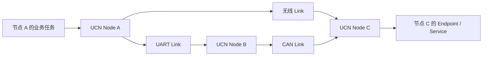

# 项目定位、目标与非目标

> 文档级别：`NORMATIVE`
> 实现状态：`CURRENT`
> 适用版本：UCN 5.0.0 / Core Wire v5
> 事实源：`README.md`、`CMakeLists.txt`、`src/`、`include/ucn/`
> 最近核对：`a093862`，2026-08-25
> 硬件状态：部分 ESP32-S3 UART/ESP-NOW 历史与当前阶段实测；并非全介质验收

## 1. 为什么需要 UCN

在典型嵌入式系统中，不同设备往往使用不同通信方式：传感器走 UART，电机控制器走 CAN，手持终端走 Wi-Fi，调试工具又通过 USB 或 Linux 网关接入。如果应用直接面向这些驱动开发，通常会出现三类重复工作：

1. 每增加一种介质，都重新定义地址、包格式、重试、超时和业务分发；
2. 同一个业务消息需要分别维护 UART 版、CAN 版和无线版发送流程；
3. 网络拓扑变化后，应用还要知道数据应走哪一个接口、是否需要经过中继。

UCN 的目标是把这些重复逻辑收回协议层。业务只表达：

```text
把什么数据
发送给哪个 Node
交给目标 Node 的哪个 Endpoint 或 Service
使用什么服务等级、截止时间和安全策略
```

至于消息最终从 UART1、CAN2、ESP-NOW 还是经过另一个节点转发，由 Node、Route、Path、Policy 和 Link 层处理。

## 2. 项目定位

UCN（Unified Communication Network，品牌名 UniLink）是一个 **MCU-first、介质无关、静态资源可控的通信与自组网协议库**。它首先解决资源受限 MCU 之间的统一寻址、发现、路由、消息分发和可选可靠传输，而不是把 MCU 变成一个缩小版 Linux 主机。

一个最小 UCN 网络可以只有两块 MCU 和一根串口线，也可以由多个 MCU、多个 UART/CAN 总线和无线 Link 组成。只要产品把物理驱动接到标准 Link/Adapter 接口，Core 就不要求 Linux、IP 路由器、Broker 或中心服务器参与。



上图中，A 的业务只指定目标 C。若无线可用，可能直接发送；若无线断开，路由也可能选择 A→B→C。业务数据结构不因为路径变化而改变。

## 3. UCN 统一了什么

### 3.1 统一逻辑地址

每个协议实例使用 Node ID。Node ID 是产品提供的逻辑地址，可以来自编译配置、Flash/NVS、出厂分配或身份系统，不要求等同于 MAC、CAN ID 或串口号。

物理地址仍由 Adapter 管理。例如 ESP-NOW MAC、CAN arbitration ID 和 UART 端口号都属于链路上下文，不泄漏到业务 Endpoint。

### 3.2 统一业务入口

Endpoint 用来区分同一 Node 内的业务数据类型。Service 在 Endpoint 之上增加任务绑定、请求/结果和本机 Fast Path。因此，同一节点可以同时提供 IMU、气压计、温度和舵机控制服务，而不需要每一种数据单独配一块 MCU。

### 3.3 统一路由和多链路决策

同一 Node 可以注册多个 Link。Lite/Full 可以通过 Neighbor、AODV-Lite 和 RERR 自动建立路由；Full 还可使用显式 Path、动态 Cost、固定路径和 Q1 负载均衡。

### 3.4 统一运行模型

所有协议状态由唯一 Protocol Owner 推进。中断只把字节或物理帧放入固定 Ring 并唤醒 Owner，避免在 ISR 中执行路由、解密和业务回调。

## 4. 核心设计目标

| 目标 | 具体含义 | 对实现的约束 |
| --- | --- | --- |
| MCU-first | 无 Linux 也能组网和转发 | Core 不依赖 Socket、线程库或文件系统 |
| 静态可控 | RAM 能由配置提前预算 | 固定表、有界队列、调用者提供存储 |
| 介质无关 | 业务不绑定 UART/CAN/Wi-Fi | Core 只看 Link、MTU、Cost、状态和通用指标 |
| 失败关闭 | 表达不了或验证失败时明确拒绝 | 不截断地址、不猜版本、不覆盖活跃槽 |
| 可裁剪 | 小 MCU 不承担不用的能力 | Nano/Lite/Full 和独立 Archive |
| 可诊断 | 能解释数据为什么没有送达 | 分层状态、统计、Path Trace、Snapshot |
| 可扩展 | 小消息保持轻量，大消息按需加入 | Core Frame 与 Transfer 分层 |

## 5. 一个完整消息的来龙去脉

以“节点 A 的控制任务向节点 C 的舵机服务发送命令”为例：

1. 应用构造 Service 请求，写入目标 Node C、Service/Operation、Command ID 和 deadline；
2. Service Bridge 将远端请求映射到 UCN Endpoint；
3. Node 检查 Q0～Q3、Hop、Payload、Security Policy 和发送格式；
4. 若 Route Cache 已有 C 的有效下一跳，直接选择 Link；没有路由则发起受限 RREQ；
5. Adapter 把完整 UCN Frame 交给产品驱动；
6. 中继节点只读取转发所需头字段，递减 Hop，并按下一跳重新发送；
7. C 验证版本、长度、重复窗口、安全策略和 Endpoint；
8. Service Router 将命令交给舵机任务；
9. 若业务要求确认，舵机任务通过 Result Endpoint 返回“已接收、已执行或失败”的明确结果。

本地 `send()` 返回成功只表示协议接受了消息，不自动等于第 9 步已经完成。

## 6. UCN 不解决什么

### 6.1 不替代物理层和驱动

UCN 不负责配置 UART 引脚、CAN sample point、Wi-Fi channel、ESP-NOW peer、BLE connection 或 LoRa 射频参数。它消费驱动提供的字节/帧和状态。

### 6.2 不替代 Linux 网络栈

UCN 不是 TCP/IP、Socket、DDS 或 ROS 2 的替代品。Linux 可以作为普通 Node、网关或 Bridge；如果已有成熟的 Linux 高带宽网络，UCN 没有必要重写其底层实现。

### 6.3 不承诺无条件实时和可靠

实时性受链路速率、排队、跳数、重传和应用调度共同影响。Q0 是关键消息调度等级，不等于端到端可靠；需要完整消息 ACK 时使用 Transfer，需要业务执行确认时使用 Service Result。

### 6.4 不提供现成的生产密钥系统

Security 层定义 Policy、AAD、透明密文转发和 Provider 合同。产品仍需提供经过审计的身份、密钥、AEAD、随机数和掉电安全序列存储。

### 6.5 不把实验 Cluster 当作已发布能力

默认 Cluster Current 使用 v3/32 B。Wire v4/40 B、M10/M11/M13 等组件仍有默认关闭或生产接线阻断，不能因为源码存在就宣称完整 Target FSM 已投入产品。

## 7. 与其他体系的协作方式

| 体系 | UCN 与它的关系 |
| --- | --- |
| UART/CAN/USB/Wi-Fi | 它们运输 UCN Frame；各自物理特性仍保留 |
| ESP-WIFI-MESH/BLE Mesh | 可以把其网络能力当作一个 Bearer，也可以由 UCN 直接对接底层 peer 驱动；是否替代取决于产品需要 |
| DroneCAN/MAVLink | 可作为特定设备/业务协议，由网关或 Service Bridge 映射；UCN 不自动兼容其全部语义 |
| ROS 2/DDS | Linux 侧可桥接 Topic/Service；MCU 自组网不依赖 ROS 2 |
| FreeRTOS/Zephyr/NuttX/RT-Thread | 提供 Owner Task、时钟、临界区和通知；协议状态机保持一致 |

## 8. 选择 UCN 前应确认

适合使用 UCN：设备包含多 MCU、多种链路、拓扑会变化，且希望用统一 Node/Endpoint/Service 语义管理通信。

可能不必使用 UCN：只有一个固定 UART 主从连接、消息极少且不会扩展；或者所有设备本来就是 Linux/IP 主机，现有 TCP/UDP/DDS 已完整满足需求。

最终原则是：UCN 统一**上层通信语义、多 Bearer 选择和 MCU 网络行为**，但不会掩盖产品必须承担的硬件、容量、安全和实时性工程责任。
