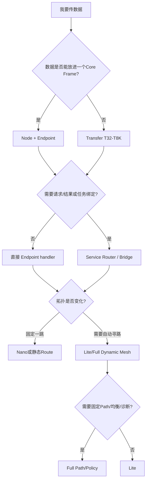

# 功能与模块索引

> 文档级别：`REFERENCE`
> 实现状态：`CURRENT`
> 最近核对：`a093862`，2026-08-25

| 我想做什么 | 主要模块/Target | 首选文档 |
| --- | --- | --- |
| 发送一个小消息 | `ucn_core` / Node / Endpoint | [核心协议](../02-核心协议/README.md) |
| 自动发现直连节点 | Node / Neighbor / HELLO | [Neighbor、HELLO、准入与Heartbeat](../02-核心协议/05-Neighbor发现、HELLO、准入与心跳.md) |
| 按目标地址自动寻路 | Node / AODV-Lite | [AODV-Lite 路由发现](../03-路由与链路/02-AODV-Lite路由发现与RREQ-RREP-RERR.md) |
| 指定固定 Path | Full Path/Policy | [Path 安装与追踪](../03-路由与链路/04-Path安装、转发与完整路径诊断.md) |
| 多链路按 Cost 选优 | Link Cost / Policy | [动态 Cost 与 LC-1](../03-路由与链路/05-Link-Metrics与LC-1动态Cost.md) |
| Q1 自动负载均衡 | Full Policy | [Q1 负载均衡](../03-路由与链路/07-Q1负载均衡与Flow粘滞.md) |
| 同一 MCU 任务间通信 | `ucn_service` | [Service Router](../04-传输与服务/05-Service-Router、Binding与Inbox.md) |
| 跨 MCU 向任务发指令并收结果 | Service Bridge + Result Endpoint | [命令、结果与业务确认](../04-传输与服务/07-命令、结果与业务确认语义.md) |
| 发送 32 B～8 KiB | `ucn_transfer` | [Transfer 消息等级](../04-传输与服务/01-消息大小等级T32至T8K.md) |
| 接 UART/RS-485/USB CDC | Stream Source + 产品 Driver | [Stream Source](../05-Adapter与平台/04-Stream-Source与COBS载体.md) |
| 接 CAN/CAN-FD | CAN Source + 产品 Driver | [CAN Source](../05-Adapter与平台/05-CAN-FD与Classic-CAN载体.md) |
| 接 Wi-Fi/ESP-NOW/BLE/LoRa | 自定义 Adapter + Driver | [无线 Adapter 接入合同](../05-Adapter与平台/12-WiFi-ESP-NOW-BLE-LoRa对接规范.md) |
| 接裸机/RTOS | 对应 `ucn_port_*` target | [Adapter 与平台](../05-Adapter与平台/README.md) |
| 配置加密/密文中继 | Security Policy + 产品 Provider | [安全](../06-安全/README.md) |
| 自动分簇/簇头恢复 | `ucn_cluster` | [Cluster](../07-Cluster簇/README.md) |
| 跨簇 Locator/Tunnel | `ucn_cluster_federation` | [Federation](../07-Cluster簇/14-Federation、Locator、Directory与Tunnel.md) |
| 查看路径/节点状态 | Full Diagnostics | [诊断与运维](../11-诊断与运维/README.md) |
| 选择 Nano/Lite/Full | Profile/Config | [配置与资源](../08-配置与资源/README.md) |
| 查函数和调用合同 | `include/ucn/` | [API 参考](../09-API参考/README.md) |
| 判断是否可以发布 | 测试、证据和发布门禁 | [测试与一致性](../12-测试与一致性/README.md) / [发布](../13-兼容、迁移与发布/README.md) |

如果功能不在表中，先查公共头和 CMake target；不要仅凭历史建议文档判断已经实现。

## 1. 从需求选择 UCN 模块

不要一开始就把所有 Extended 组件全部链接。先回答业务需要的交付语义：

Cluster 是另一条选择：只有当网络需要成员控制域、Head/Backup、quorum 或跨簇目录时才加入，不是普通多跳通信的前置条件。

## 2. 常见场景映射

### 场景 A：一个 MCU 上有 IMU、气压计和温度任务

使用一个 Node，给三类数据定义不同 Endpoint 或 Service。任务间本地请求可走 Service Fast Path；远端节点订阅时仍使用相同 Service 标识。无需给每个传感器单独配置 Node 或芯片。

### 场景 B：两个 ESP32-S3 通过 UART 通信，之后再增加 Wi-Fi

先注册 UART Stream Source/Link 验证 Core。加入 Wi-Fi 后注册第二个 Link，并给两条 Link 提供各自 MTU、Cost 和状态。Neighbor/Policy 可以在上层保持目标 Node 不变的情况下选择链路。

### 场景 C：舵机命令和日志同时发送

舵机命令使用 Q0、deadline、Command ID 和 Service Result；日志块使用 Q1 或 Transfer，并允许走吞吐更高的路径。不要让大 Transfer 挤占关键控制队列。

### 场景 D：需要多个簇和备用簇头

先完成 Core、Persistence Provider 和默认 Cluster Current 验证，再评估 Target 组件。当前 Wire v4/Takeover/Handover/Rekey 仍有实验或发布阻断，不能按“打开一个宏就生产可用”的方式集成。

## 3. 模块依赖原则

| 模块 | 依赖 | 不依赖 |
| --- | --- | --- |
| Core | Config、Frame、Node、Link | Linux、RTOS、Cluster |
| Adapter/Source | Core frame 合同、产品 Driver | 业务 Service |
| Service | Core Endpoint；可独立关闭 | Transfer（小消息可直接发） |
| Transfer | Core Node/Route、静态 slot | Cluster |
| Cluster | Core 邻居/发送入口、可选 Persistence | 普通业务转发路径 |
| Federation | Cluster 身份/Authority、Core send | 自动获得全网大消息能力 |

## 4. 查找实现的正确方法

1. 先从本表进入官方语义文档；
2. 再到 [API 参考](../09-API参考/README.md)确认对象、调用上下文和返回值；
3. 通过 [`reference/generated`](../../reference/generated/模块-源码-测试映射表.md) 找源码和测试；
4. 检查 CMake target 和 Feature 是否进入当前产品；
5. 最后在 [`evidence`](../../evidence/README.md) 核对真实验证范围。

这样可以避免“看到头文件里有 API，就误以为默认固件已经启用”的错误。
