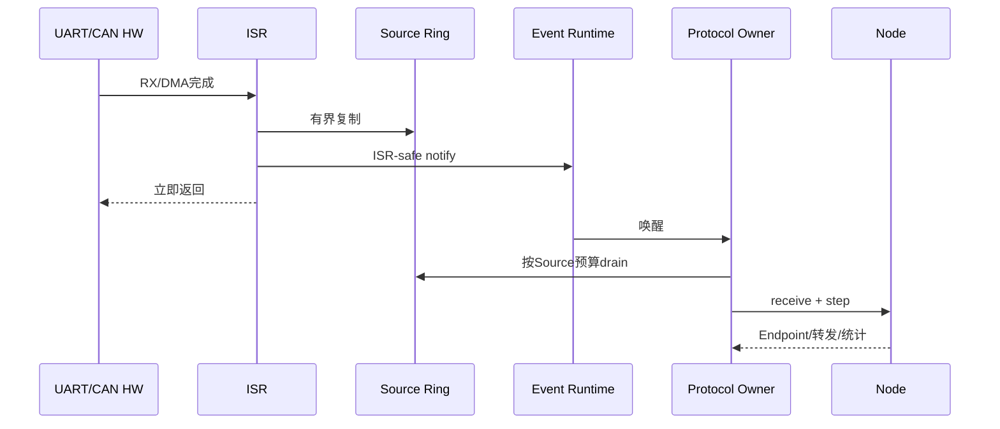

# Protocol Owner、并发与 ISR 模型

> 文档级别：`NORMATIVE`
> 实现状态：`CURRENT`
> 事实源：`ucn_port.h`、`ucn_event_runtime.h`、`ucn_protocol_owner.h`、各 Port/Source
> 最近核对：`a093862`，2026-08-25

## 唯一 Owner

一个 Node 的协议可变状态由一个 Protocol Owner 串行推进。Owner 可以是：

- 裸机主循环中的一个函数调用位置；
- FreeRTOS/Zephyr/NuttX/RT-Thread 中的单一协议任务；
- Host 测试执行器。

应用任务和 ISR 不得同时直接调用 `ucn_node_step()` 或修改 Node/Route/Transfer/Cluster 私有状态。

## 事件路径

```text
外设中断/DMA回调
    ↓ 只复制最小数据
Source Ring（Byte 或 CAN Frame）
    ↓ 通知
ucn_event_runtime_t
    ↓ Source/Round 预算
唯一 Protocol Owner
    ↓
Source service → Adapter RX Queue → ucn_node_receive/step
```

ISR 只允许进入明确标注的 Source/Queue push 接口。Core 编解码、路由、Endpoint 回调和业务处理不在 ISR 中执行。

## Port API V2

`ucn_port_ops_t` 使用 `struct_size/api_version`，并分开任务与 ISR 临界区。某些 RTOS 的 ISR mask 需要 token 恢复，不能用一个无上下文 lock 同时覆盖 Task 和 ISR。

旧 Port 对象必须全量重编译；不能只重新链接新静态库。

## 预算与公平

Event Runtime 固定最多 Source 数、每次 Source 预算和 Round 预算。某一路持续满载时不能让其他 UART/CAN/USB/Wi-Fi Source 永远得不到服务。

轮询仍有三种合法用途：

- 无中断平台；
- 协议 Deadline/Heartbeat/Retry 定时器；
- 漏通知兜底。

轮询不是要求所有 Driver 定时逐字节读取。

## 调用者责任

- 用同一权威单调 32 位毫秒时钟推进相关模块；
- 正确实现 Task/ISR 临界区和通知；
- 保证回调上下文与借用配置在对象生命周期内有效；
- 不从回调重入同一 Owner 的状态机；
- 业务任务通过 Service/Endpoint/消息队列交换数据，而不是直接改 Node。

## 1. 为什么选择单 Owner

Node 内部的 Route、Neighbor、Sequence、Queue 和 Deadline 彼此关联。使用多个锁保护每个表不仅增加 MCU RAM/代码，还容易出现锁顺序、ISR 优先级反转和“Route 已删但队列仍引用”的竞态。单 Owner 把状态转换串行化，使大多数协议对象无需内部互斥锁。

单 Owner 不等于整个系统单线程。多个应用任务、多个 DMA 和多个外设仍可并行，只是它们通过固定队列把事件汇聚给协议任务。

## 2. Task 与 ISR 的职责表

| 操作 | ISR/DMA callback | Protocol Owner | 应用任务 |
| --- | --- | --- | --- |
| 复制接收字节/物理帧 | 允许，有界 | 可轮询补充 | 否 |
| 解析 COBS/CAN Carrier | 否 | 是 | 否 |
| Frame decode/安全验证 | 否 | 是 | 否 |
| Route/Neighbor/FSM 更新 | 否 | 是 | 否 |
| Endpoint/Service 分发 | 否 | 是 | 通过消息接收 |
| 提交发送请求 | 通过 ISR-safe 专用入口才允许 | 是 | 通过 Service/命令队列 |
| 访问私有对象字段 | 否 | 仅实现内部 | 否 |

## 3. 一次中断到处理完成的时序



## 4. 背压如何跨上下文传播

Ring 满时 ISR 不能阻塞等待 Owner，应丢弃本次物理输入并增加 overflow 计数。Adapter Queue 满时 Source 保留可重试的完整 carrier，或按其明确合同返回背压。Node 队列满时调用方得到 `UCN_ERR_NO_SPACE`/背压状态。

每一层都必须有自己的容量和计数，避免最终只看到“消息没到”却不知道堵在哪一层。

## 5. Owner 主循环概念伪代码

```c
for (;;) {
    wait_for_event_or_timeout();
    now = monotonic_ms();

    ucn_event_runtime_service(&runtime, source_budget, round_budget);
    drain_application_requests();
    ucn_node_step(node, now);
    ucn_transfer_step(transfer);   /* 若链接 */
    service_local_inboxes();      /* 不在 ISR 中执行 */
}
```

精确签名以公共头为准。关键是所有模块共享权威时钟和调用顺序，不是复制这段伪代码的函数名。

## 6. 重入与回调

Link send、Security Provider、Persistence Provider 和 Endpoint handler 都可能是产品回调。回调不得同步重入同一 Owner 状态机。Cluster Persistence 甚至在调用 Provider 前建立专用 I/O gate，防止 `submit()` 内递归 `step()` 看到尚未建立的 pending 状态。

## 7. 多个 Node 实例

多个 Node 可以各有 Owner，也可以由一个调度器顺序推进，但不能让两个 Owner 同时操作同一个 Node。若共享一个物理 Driver，Adapter 必须按 Link/peer 将 RX 明确分派，不能共享可变重组槽。

## 8. 如何验证时序预算

记录 Owner 最大唤醒间隔、每轮 Source 处理量、最长 step 时间、Ring/Queue 峰值和 RTOS task stack high-water。在持续高速 Source 和 Q0/控制消息并存时验证其他 Source 不被饿死。
