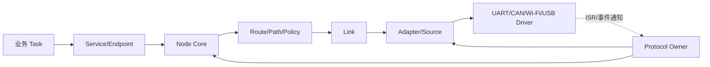

# 总体架构

> 文档级别：`NORMATIVE INDEX`
> 实现状态：`CURRENT`
> 最近核对：`a093862`，2026-08-26

## 本章要建立的整体认识

总体架构不是源码目录的简单复述，而是说明一条业务数据为什么要经过这些边界、每个对象由谁拥有，以及发生拥塞、重启或 Link Down 时哪个模块负责收敛。UCN 的核心约束是 MCU-first：固定内存、无 Linux 依赖、单一 Protocol Owner、Driver 与协议解耦，并在证据不足时失败关闭。

可以把运行中的 UCN 看成以下主链：

Driver 只搬运物理数据；Adapter 把 Carrier 还原为完整 UCN Frame；Link 表示一条可被路由选择的本地出口；Node 处理寻址、控制帧和转发；Service/Endpoint 把消息交给具体任务。任一层都不能偷偷承担另一层的权威职责。

## 阅读顺序

1. [UCN 总体架构与设计原则](01-UCN总体架构与设计原则.md)：理解为什么以 MCU、静态容量和 Bearer 无关为核心。
2. [模块边界与依赖规则](02-模块边界与依赖规则.md)：确认哪些调用方向允许，避免 Driver、RTOS 和 Core 耦合。
3. [数据平面、控制平面与诊断平面](03-数据平面、控制平面与诊断平面.md)：区分业务转发、网络收敛和按需观察。
4. [Protocol Owner、并发与 ISR 模型](04-Protocol-Owner、并发与ISR模型.md)：理解 ISR 只写 Ring/通知、Owner 串行推进的原因。
5. [对象所有权、生命周期与静态存储](05-对象所有权、生命周期与静态存储.md)：确定配置、缓冲、回调和对象由谁保存。
6. [源码目录、构建产物与链接关系](06-源码目录、构建产物与链接关系.md)：把逻辑模块映射到源码和最终固件。
7. [一帧数据的完整路径](07-一帧数据从任务到物理接口的完整路径.md)：沿发送、转发和接收链定位真实开销与失败点。
8. [内存、时间与失败关闭契约](08-内存、时间与失败关闭三条基础契约.md)：理解全项目共同遵守的底层约束。

## 用三个场景检查是否真正理解架构

### 场景 A：同一 MCU 内两个任务通信

消息使用 Node + Endpoint 语义，但由 Service Local Fast Path 写固定 Inbox；不会编码成 Wire Frame，也不经过 UART/Wi-Fi。这样统一了调用方式，却不为本地通信支付网络开销。

### 场景 B：A 通过 UART 到 B，B 再通过 CAN 到 C

A 的业务只指定目标 C 与 Endpoint。A/B 的 Node 和 Route 决定下一跳；B 的 UART Adapter 交付完整 Frame，B Core 校验后从 CAN Link 转发。业务不需要知道中途更换了 Bearer。

### 场景 C：UART 中断收到字节

ISR/DMA 把数据写入 Driver Ring 并通知 Owner；Owner 在任务/主循环上下文中调用 Source/Adapter/Node。ISR 不直接执行路由、Endpoint Handler 或动态状态机，从而避免 RTOS ISR 锁语义和 Core 状态并发混乱。

## 本目录解决的问题

阅读完后，应能画出业务任务到 Driver 的完整调用链，解释为什么 ISR 不直接进入 Core，说明 Node/Link/Adapter/Source/Port/Extended 的所有权和依赖方向，并能根据产品需求选择最小链接组合。

建议先读 01～03 建立分层，再读 04～05 理解并发和存储，最后用 06～08 对照实际工程的构建、帧路径和失败合同。

## 架构验收时不要混淆的边界

- 源码存在不等于默认产品已经链接；
- Host 单元测试通过不等于 MCU ISR、DMA、Flash 掉电或 RF 环境已经验证；
- Adapter 支持 256 B 逻辑 Frame 不等于一次物理 Carrier 也有 256 B；
- Node 能转发不等于它知道业务 Payload 内容；
- `UCN_OK` 的意义取决于 API 的所有权边界，通常不等于远端执行完成；
- Cluster 实验模型和默认 Core 是可分离的，不应因 Cluster 状态影响普通 Core 的成熟度描述。
