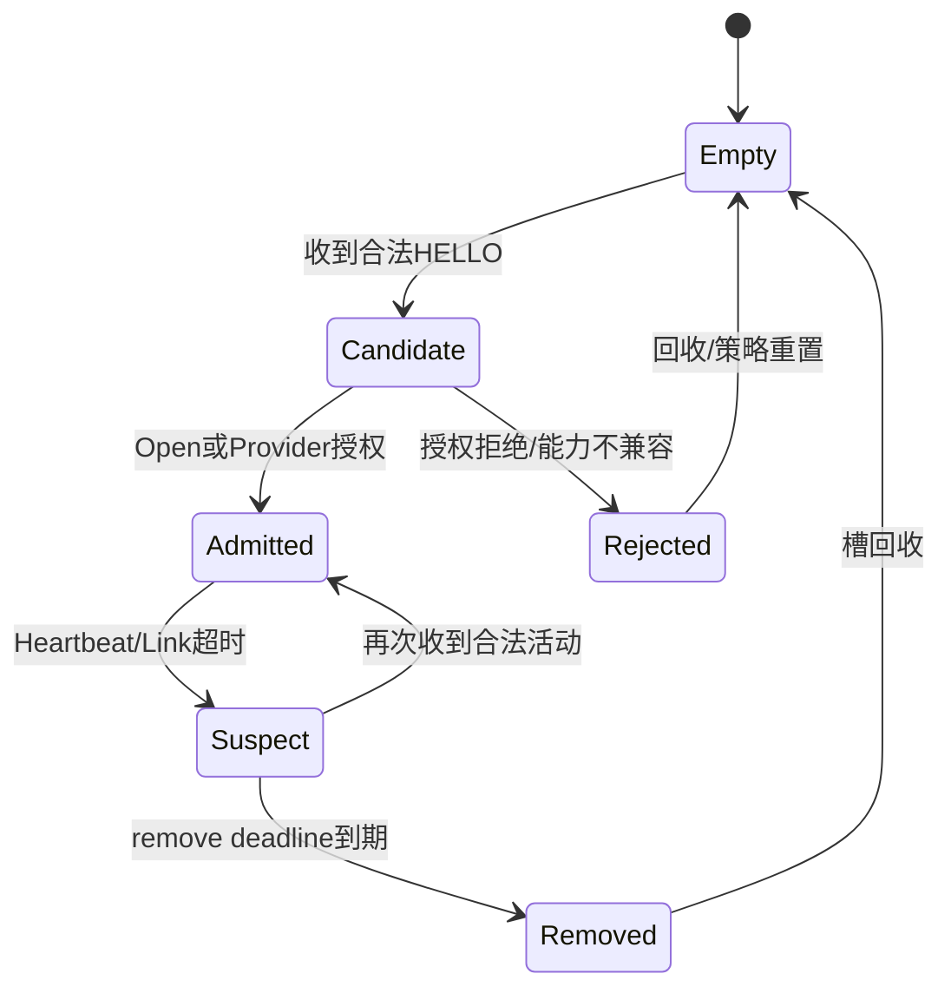

# Neighbor 发现、HELLO、准入与心跳

> 文档级别：`NORMATIVE`
> 实现状态：Lite/Full `CURRENT`；Nano 不含动态 Mesh
> 事实源：`ucn_neighbor.h`、Node HELLO/Heartbeat 实现和 tests
> 最近核对：`a093862`，2026-08-25

## 一跳范围

HELLO 和 Heartbeat 是一跳邻居维护，不是默认全网洪泛。只有能直接从某 Link 收到对方 Carrier Frame 的节点把它作为该 Bearer 的一跳候选。

多跳中继不会仅因转发 A→C 的业务帧，就把 C 当作自己的直连 Bearer。

## 状态

Neighbor 状态包括 Empty、Candidate、Admitted、Suspect、Removed、Rejected、Expired。一个逻辑 Neighbor 可包含多个独立 Bearer，每个 Bearer又有 Candidate、Admitted、Suspect、Down 状态。

## Join Policy

| Policy | 行为 |
| --- | --- |
| Manual | 产品显式决定/预配置，不自动开放 |
| Open | 合法候选按协议准入 |
| Provider | 通过产品 `authorize` 回调决定 |

Open 不是安全身份认证。生产安全网络应使用 Provider、Session/ACL 和产品身份体系。

## 多 Bearer

同一 Node ID 可通过 UART 和 Wi-Fi 等多个 Link 被独立发现。Neighbor 保存固定数量 Bearer，并选择 Primary Bearer；某一 Bearer Down 不必立即删除整个 Neighbor，只要还有已准入 Bearer。

## Heartbeat 与故障

Heartbeat 只维护直连存活。到期未见会先进入 Suspect，再按固定时间门禁移除或过期；相关直连 Route、Candidate/Path/Policy 状态会按各自规则失效。

具体“多久发现离开/多久接入”取决于 HELLO、Heartbeat、Suspect、Link liveness profile 和 Owner Step 配置，不能用一个对所有介质都固定的数字描述。

## 成本控制

新节点接入主要产生一跳 HELLO/Join/Heartbeat 和必要的路由请求，不要求所有节点立即保存它到全网每个目的地的完整路径。表和控制预算都是有界的。

## 1. 从 Link Up 到 Admitted 的流程



具体状态枚举和转换以源码为准。关键原则是：物理上收到 Frame 只建立 Candidate，不能绕过产品准入直接获得受信邻居身份。

## 2. HELLO 携带什么信息

HELLO 至少让对端知道 Source Node、Network、Session/能力和可接收 Wire 上限。Adapter 同时提供 ingress Link/物理 peer，因此 Neighbor 可以把同一 Node 的新 Bearer 合并到同一逻辑身份下。

HELLO 不是全网节点目录，也不携带所有 Route。它只解决一跳身份和能力发现。

## 3. Provider 准入

Provider Policy 的授权输入应包含候选 Node、ingress Link/peer、能力和产品身份信息。返回允许后才能进入 Admitted。回调失败、未配置或安全未就绪时应拒绝/保持 Candidate，而不是自动退化为 Open。

## 4. 多 Bearer 合并示例

节点 A 先通过 UART 收到 B 的 HELLO，建立 `B/UART=Admitted`；随后 ESP-NOW 又发现相同 B，增加 `B/WiFi=Candidate→Admitted`。Neighbor B 仍只有一个逻辑 Node ID，但有两个 Bearer。

UART Down 后：

- 只把 UART Bearer 标为 Down/Suspect；
- 如果 Wi-Fi 仍 Admitted，Neighbor B 继续存在；
- Route/Policy 可把下一跳 B 解析到 Wi-Fi；
- UART 恢复后再次通过 liveness/准入合并。

## 5. Heartbeat 为什么不转发

Heartbeat 用于证明“我与这个 peer 的这条 Bearer 仍直接相连”。如果经多跳转发，接收者无法区分中间链路健康，liveness 语义会失真。因此它限定一跳。

## 6. 故障感知时间

大致由以下关系决定：

```text
最快发现 ≈ Driver立即Link Down事件
无Driver事件时 ≈ 最后活动到 suspect timeout
彻底移除 ≈ suspect后再到 remove timeout
```

快速 profile 可以用更短 Heartbeat/suspect/remove，但会增加控制流量和抖动误判。产品需要根据 UART 有线稳定性、无线丢包和期望恢复时间选择。

## 7. 新节点接入的网络代价

新节点先只影响直连邻居。只有当它发起/成为目标或参与 Cluster 时，相关 Route/控制状态才逐步建立。RREQ 有重复缓存和最小间隔，避免一个新节点瞬间让全网无界波动。

表满时不能覆盖活跃受信 Neighbor。策略应明确拒绝新候选、回收过期项或由产品提高容量。

## 8. 常见误解

- “中继收到业务帧，所以源节点是直连邻居”：错误，ingress 只证明上一跳直连；
- “Open Policy 就是安全入网”：错误，它只表示无需产品授权；
- “Heartbeat 1 秒，所以 1 秒一定离网”：错误，还取决于 suspect/remove、Driver事件和 Owner调度；
- “一个 Node 有两条 Bearer 就是两个 Neighbor”：错误，它们属于同一逻辑 Neighbor 的两个承载。
